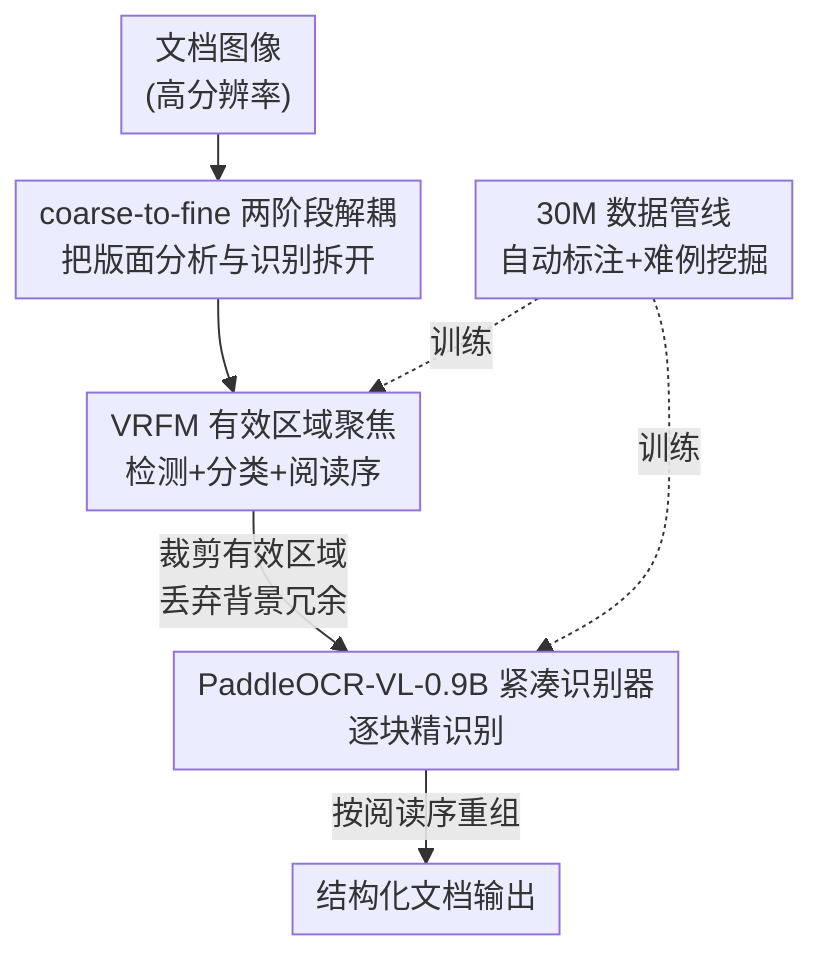

# Boosting Document Parsing Efficiency and Performance with Coarse-to-Fine Visual Processing

**会议**: CVPR 2026  
**论文**: [CVF Open Access](https://openaccess.thecvf.com/content/CVPR2026/html/Cui_Boosting_Document_Parsing_Efficiency_and_Performance_with_Coarse-to-Fine_Visual_Processing_CVPR_2026_paper.html)  
**代码**: https://github.com/PaddlePaddle/PaddleOCR  
**领域**: 多模态VLM  
**关键词**: 文档解析, 粗到细, 视觉token压缩, 版面分析, 阅读顺序  

## 一句话总结
PaddleOCR-VL 用一个轻量"先定位有效区域、再逐块精识别"的粗到细两阶段框架，把高分辨率文档里大量冗余背景挡在 VLM 之外——只用 0.9B 参数和约 2.5k 视觉 token，就在 OmniDocBench v1.5 上拿到 92.62 的总分 SOTA，同时吞吐量比最强基线再高 50%。

## 研究背景与动机

**领域现状**：文档解析（把一页 PDF/扫描件拆成文字、公式、表格、图表并恢复阅读顺序）是给 LLM 喂语料、做 RAG 的关键前置。当前主流分三派：① pipeline 法（检测+识别+结构重建各用专家模型串起来）；② 通用 VLM（GPT-4o、Qwen2.5-VL 这类大模型直接读整页）；③ 专用文档 VLM（MinerU、dots.ocr 这类把版面理解和识别塞进一个端到端大模型）。

**现有痛点**：文档是细粒度任务，小字、密集表格、公式都靠**高分辨率**才看得清；但分辨率一高，视觉 token 数随之**平方级**膨胀，编码和解码成本暴涨。pipeline 法易错误传播、复杂版面就崩；端到端 VLM 在长文档上会读乱顺序、产生幻觉，而且要堆很大的参数量。已有的减 token 工作（如 DeepSeek-OCR）对全图做**均匀压缩**，结果把密集文字区也一起压糊了，细粒度版面精度反而掉。

**核心矛盾**：高分辨率带来的精度和它带来的算力开销是直接对立的；而开销之所以大，根因在于文档图像里**有效信息分布极不均匀**——作者在 OmniDocBench v1.5 上量化发现，PPT 类文档的有效视觉区域只占约 39%，连信息最密的报纸也只占约 60%，剩下都是背景、装饰这类对识别毫无价值却照样消耗 token 的冗余。

**核心 idea**：既然冗余是大头，那就别让 VLM 去"啃整张大图"。先用一个极轻的模块把有效区域抠出来、定好阅读顺序（粗），再把这些紧凑的小块喂给一个紧凑 VLM 逐个精识别（细）——用"区域稀疏性"换掉"均匀高分辨率"，同时把效率和精度都拉上去。

## 方法详解

### 整体框架

PaddleOCR-VL 把"版面分析"和"内容识别"彻底**解耦成两个独立可优化的阶段**。输入是一张非结构化的文档图像，输出是按正确阅读顺序重组好的结构化文档。

- **粗阶段**：轻量的 Valid Region Focus Module（VRFM）扫一遍整页，检测出版面元素（文字块/表格/公式/图表）、给每块分类，并预测它们之间的阅读先后顺序。这一步只做"在哪、是什么、先读谁"，不做识别，所以可以做得很快很轻。
- **裁剪**：根据 VRFM 框出的有效区域，把对应的图像子块裁出来——背景、空白、装饰被直接丢弃，不进入下游。
- **细阶段**：每个裁好的有效子块送进 PaddleOCR-VL-0.9B（一个 0.9B 的紧凑 VLM）做元素级精识别（OCR / 表格 / 公式 / 图表）。因为输入已经是干净的小块，模型可以把全部容量专注在单个元素上。
- **重组**：把各子块的识别结果按 VRFM 预测的阅读顺序拼回去，得到最终结构化文档。

这套设计带来两个直接好处：一是不再处理大片无关背景，喂给 VLM 的视觉 token 数大幅下降；二是定位和识别各管一摊、各自专精，效率和识别质量同时受益。

### 关键设计

**1. coarse-to-fine 两阶段解耦：用区域稀疏性替代均匀高分辨率**

这是全篇的范式核心，直接针对"高分辨率 → token 平方膨胀"这个根因。端到端 VLM 把整页（含大片背景）一股脑编码成视觉 token，而文档有效区域平均不到 50%，等于一半算力花在没用的地方。作者的做法是把流程切成"先定位、后识别"两段：粗阶段只输出有效区域的框和顺序（计算量小），细阶段只对裁出来的紧凑区域跑 VLM。和 DeepSeek-OCR 那种对全图**均匀压缩** token 的思路本质不同——均匀压缩会无差别地把密集文字也压糊，而这里是**有的放矢地丢弃冗余、保留显著区域的原始分辨率**，所以既省 token 又不牺牲细粒度精度。解耦还带来工程上的好处：版面模块和识别模块可以各自独立训练、独立换型，互不拖累。

**2. VRFM 有效区域聚焦：检测 + 分类 + 阅读顺序的统一轻量模块**

粗阶段要解决的问题是"怎么又快又准地找到有效区域并定好读序"。VRFM 以 **RT-DETR** 作为检测骨干，对版面元素做定位和分类，产出每个候选区域的区域级表征；在此之上接一个**指针网络（pointer network）**专门建模阅读顺序——它对检测出的区域两两建模关系，预测一个 $N\times N$ 的矩阵来编码区域间的相对先后次序。这样定位、分类、阅读序三件事在一个轻量框架里一次性完成。把无关背景显式过滤、只保留任务相关区域，VRFM 给下游 VLM 提供的是**紧凑且信息密集**的输入，从源头上削掉了冗余计算，又保住了重组文档所需的结构信息。训练上分两步：先用 PP-DocLayout Plus-L 初始化、训 RT-DETR 核心 100 epoch；再冻结核心、单训指针网络 200 epoch，用对噪声鲁棒的 Generalized Cross Entropy Loss 学习这个两两排序矩阵。

**3. PaddleOCR-VL-0.9B：原生动态分辨率的紧凑识别器**

细阶段要在"高精度"和"低开销"之间同时站住。模型沿用 LLaVA 式的"视觉编码器 + MLP 投影 + 语言模型"结构，但每个部件都选了紧凑高效的搭配。关键区别于以往**定长分辨率/切片（tiling）**的做法：它用 **NaViT 式视觉编码器**（由 Keye-VL 初始化）按**原生分辨率**处理图像，避免缩放/切片带来的形变和幻觉，对文字密集任务更友好。投影端是 2 层带 GELU 的 MLP；语言模型选了只有 0.3B 的 **ERNIE-4.5-0.3B**，并加 **3D-RoPE** 做位置编码以压低推理延迟。NaViT + ERNIE-4.5-0.3B 的组合让整个识别器在 0.9B 量级就拿到强识别力，且内存占用极小。识别任务覆盖四类：OCR、表格（输出 OTSL 结构化格式）、公式（转 LaTeX，区分行内与独立公式）、图表（抽成 Markdown 表）。

**4. 30M 多源数据管线 + 难例挖掘：把 SOTA 喂出来**

作者明确把数据列为达到 SOTA 的最关键因素之一，所以它不是辅料而是一个独立贡献。数据来自四路——开源集、合成集（针对公开数据里稀缺类型做低成本合成以纠偏）、网络爬取（学术论文/报纸/手写扫描，增强泛化）、自研集，累计 30M+ 样本。标注用**自动管线**：先用专家模型 PP-StructureV3 生成带噪伪标签，再拿原图喂给 ERNIE-4.5-VL 和 Qwen2.5-VL 做精修，最后过一道幻觉过滤剔除模型编造的错误。针对薄弱点还专门做**难例挖掘**：先在人工细标的评测集上用各自专用指标（文字 EditDist、表格 TEDS、图表 RMS-F1、公式 BLEU）找出模型短板，再用 XeLaTeX、带丰富字体/语料的浏览器等渲染工具，针对这些难例**合成**新的高质量数据补强。

### 损失函数 / 训练策略

VRFM 两步训练已如上述。PaddleOCR-VL-0.9B 采用"后适配"策略，视觉编码器用 Keye-VL、语言模型用 ERNIE-4.5-0.3B 初始化，基于 ERNIEKit 分两阶段训：Stage 1 模态对齐——在 29M 图文对上训 1 epoch，最大视觉 token 1280×28×28，序列长 16384，batch 128，LR 从 $5\times10^{-5}$ 退到 $5\times10^{-6}$；Stage 2 指令微调——在 2.7M 样本上训 2 epoch，把最大视觉 token 提到 2048，LR 用更细的 $5\times10^{-6}$ 到 $5\times10^{-7}$，覆盖 OCR/表格/公式/图表四类指令任务。

## 实验关键数据

### 主实验（OmniDocBench v1.5 页级解析）

1355 页中英文档，总分是文字/公式/表格指标的加权组合。S/M/L 三档为同一权重、不同视觉 token 预算。

| 方法 | 参数 | 视觉token | Overall↑ | TextEdit↓ | FormulaCDM↑ | TableTEDS↑ | ReadOrderEdit↓ |
|------|------|-----------|----------|-----------|-------------|------------|----------------|
| Gemini-2.5 Pro | - | - | 88.03 | 0.075 | 85.82 | 85.71 | 0.097 |
| dots.ocr | 3B | 5513 | 88.41 | 0.048 | 83.22 | 86.78 | 0.053 |
| MinerU2.5 | 1.2B | 3256 | 90.67 | 0.047 | 88.46 | 88.22 | 0.044 |
| DeepSeek-OCR-Gundam-M | 3B | 1854 | 86.46 | 0.081 | 89.45 | 78.02 | 0.093 |
| **PaddleOCR-VL-S** | 0.9B | 1898 | 91.55 | 0.035 | 90.30 | 87.89 | 0.044 |
| **PaddleOCR-VL-M** | 0.9B | 2259 | 92.17 | 0.035 | 90.22 | 89.75 | 0.043 |
| **PaddleOCR-VL-L** | 0.9B | 2561 | **92.62** | **0.035** | **90.90** | **90.48** | **0.043** |

L 档以 2561 token 拿下 92.62 总分，超过次优 MinerU2.5（90.67，3256 token）；和 token 数相近的 DeepSeek-OCR-Gundam-M（1854 token）相比总分高出 6 分多，印证了"定向丢冗余"比"均匀压缩"更划算。

### 元素级 + 推理效率

| 评测 | 指标 | PaddleOCR-VL-L | 次优 |
|------|------|----------------|------|
| 表格 OmniDocBench-Table-block | Overall TEDS↑ | **0.9046** | MinerU2.5 0.9005 |
| 公式 Formula-block | Overall CDM↑ | **0.9404** | MinerU2.5 0.9187 |
| 图表 In-house（1801样本） | RMS-F1↑ | **0.8440** | PP-StructureV3 0.8060 |
| 推理（A100, vLLM） | Pages/s↑ | **1.6192** | MinerU2.5 1.0574 |
| 推理 | Tokens/s↑ | **2470.7** | MinerU2.5 1647.9 |
| 推理 | 显存(GB)↓ | 42.1 | dots.ocr 78.5 |

文字识别在 PPT(0.049)、学术文献(0.021)、书籍(0.047)、杂志(0.020)、报纸(0.035)等几乎所有类别都取得最低 EditDist。推理端比最强基线 MinerU2.5 页吞吐高 **53.1%**、token 吞吐高 **49.9%**，显存比 dots.ocr 省 **46%**。

### 关键发现
- **token 效率是核心卖点**：在视觉 token 比对手少 25%~65% 的前提下反超总分，说明瓶颈确实在"喂了多少冗余 token"而非"模型多大"。
- **解耦让小模型够用**：0.9B 参数即超过 72B/241B 通用 VLM，验证了"先抠区域再识别"能把模型容量集中到刀刃上。
- **公式中文(ZH-CDM 0.9035)远超对手**（MinerU2.5 仅 0.8623），难例挖掘对薄弱类型补强效果显著。

## 亮点与洞察
- **把"减 token"从均匀压缩升级成区域级取舍**：先验证有效区域只占 <50%，再用轻量检测模块定向裁剪，思路简单但量化动机扎实，比无差别压缩更不伤精度——这套"稀疏性驱动的计算分配"可迁移到任何高分辨率视觉任务。
- **指针网络做阅读顺序**：把读序建模成 $N\times N$ 关系矩阵，和检测一起塞进轻量 VRFM，避免了端到端生成式模型在密集长文档上"坐标漂移、读序混乱"的老毛病。
- **原生动态分辨率（NaViT）替代切片**：对文字密集文档，避免 tiling 的形变和幻觉，是细粒度识别精度的重要来源，值得借鉴到其他 OCR/票据类任务。

## 局限与展望
- **两阶段误差会串联**：VRFM 一旦漏检或框错区域，下游识别再强也救不回来——论文未充分讨论 VRFM 召回失败时的端到端鲁棒性，⚠️ 这部分以原文与代码实测为准。
- **数据是隐性门槛**：30M 自研+合成数据被明确列为 SOTA 关键因素，意味着方法的可复现性高度依赖这套难以公开的数据管线，纯靠开源数据未必能复现同等效果。
- **裁剪—重组开销**：把整页流程拆成"检测→裁剪→逐块识别→重组"，在版面极其密集、区域数量庞大时，逐块推理与重组的调度成本是否仍优于端到端，论文给的是批处理吞吐，单页极端 case 下的表现待观察。

## 相关工作与启发
- **vs DeepSeek-OCR**：两者都想省视觉 token，但 DeepSeek-OCR 对全图做均匀压缩、会牺牲细粒度版面精度且长解码延迟未解；本文是区域级定向裁剪+解耦识别，token 更少（1898 vs 1854 时总分高 6 分）且精度不掉。
- **vs MinerU2.5 / dots.ocr（专用 VLM）**：它们把检测和识别塞进一个端到端大模型，靠生成式/grounding 输出坐标，密集长文档易坐标漂移、读序乱；本文用判别式 RT-DETR+指针网络做粗定位，坐标更稳、读序更准，且用 0.9B 就反超它们的 1.2B~3.7B。
- **vs pipeline 法（PP-StructureV3 等）**：传统 pipeline 串多个专家模型、易错误传播且系统笨重；本文只用"VRFM + 一个紧凑 VLM"两段，既保留模块专精的好处，又靠统一 VLM 识别避免了多专家模型的级联脆弱性。

## 评分
- 新颖性: ⭐⭐⭐⭐ "区域稀疏性驱动的粗到细解耦"思路清晰，但 RT-DETR+指针网络、NaViT、解耦两阶段都是已有组件的高水平组合，原理性突破有限。
- 实验充分度: ⭐⭐⭐⭐⭐ 页级+四类元素级+推理效率全覆盖，对比对象从 72B 通用 VLM 到各路专用模型，token/参数/吞吐多维度量化。
- 写作质量: ⭐⭐⭐⭐ 动机量化（有效区域占比）有说服力，框架清晰；数据管线部分偏配方式叙述、细节略粗。
- 价值: ⭐⭐⭐⭐⭐ 0.9B 拿 SOTA + 50% 吞吐提升 + 开源到 PaddleOCR，对实际高吞吐文档解析落地价值很大。

<!-- RELATED:START -->

## 相关论文

- [\[CVPR 2026\] PaddleOCR-VL: Boosting Document Parsing Efficiency and Performance with Coarse-to-Fine Visual Processing](paddleocr_vl_coarse_to_fine_document_parsing.md)
- [\[CVPR 2026\] Towards Real-World Document Parsing via Realistic Scene Synthesis and Document-Aware Training](towards_real-world_document_parsing_via_realistic_scene_synthesis_and_document-a.md)
- [\[CVPR 2026\] Efficient Document Parsing via Parallel Token Prediction](efficient_document_parsing_via_parallel_token_prediction.md)
- [\[CVPR 2026\] EvoComp: Learning Visual Token Compression for Multimodal Large Language Models via Semantic-Guided Evolutionary Labeling](evocomp_learning_visual_token_compression_for_multimodal_large_language_models_v.md)
- [\[CVPR 2026\] Boosting Visual Reprogramming for CLIP with Dual Granularity Alignment](boosting_visual_reprogramming_for_clip_with_dual_granularity_alignment.md)

<!-- RELATED:END -->
