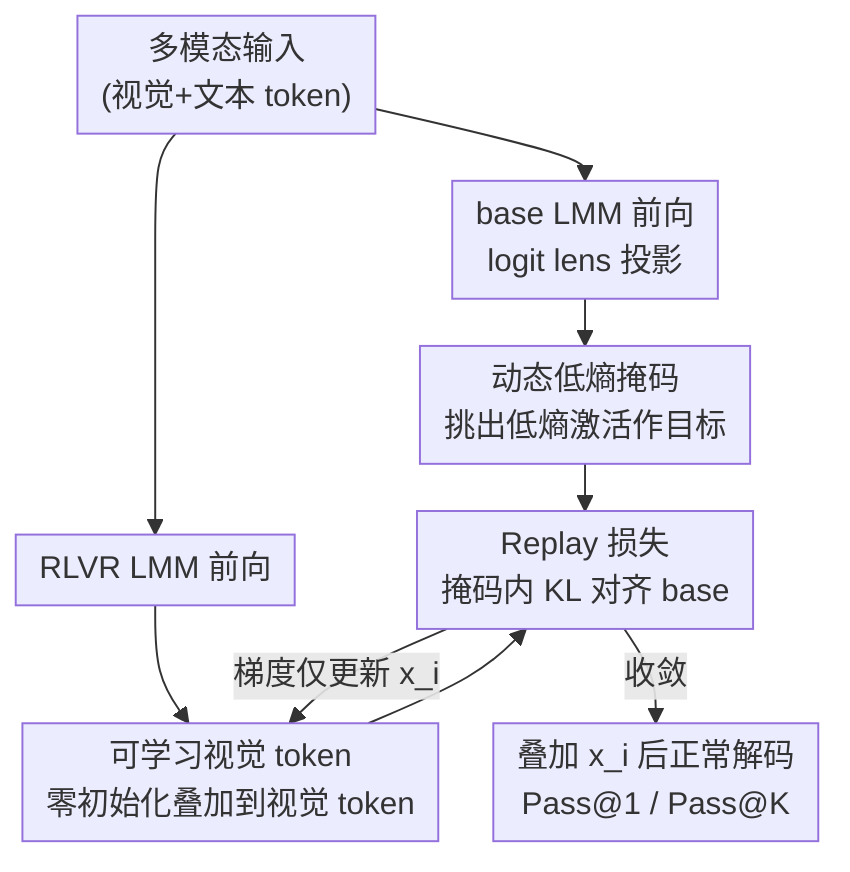

# Boosting Reasoning in Large Multimodal Models via Activation Replay

**会议**: CVPR2026  
**arXiv**: [2511.19972](https://arxiv.org/abs/2511.19972)  
**代码**: https://github.com/latentcraft/replay.git  
**领域**: 多模态VLM / LLM推理 / 强化学习  
**关键词**: RLVR、激活回放、低熵激活、logit lens、测试时优化

## 一句话总结
作者用 logit lens 发现 RLVR 后训练会"过度"扰动多模态大模型的低熵输入激活，进而提出 Activation Replay——一种免训练、测试时通过优化一组可学习视觉 token、把 RLVR 模型的低熵激活拉回 base 模型分布的方法，在数学、o3 式视觉智能体和视频推理上一致涨点。

## 研究背景与动机

**领域现状**：RLVR（可验证奖励强化学习）已成为激发多模态大模型（LMM）推理能力的主流后训练手段，靠规则奖励 + 长思维链让模型在数学、智能体、视频推理等难任务上变强。但大家普遍只关心"配什么数据、设计什么奖励、怎么稳定训练"，对 RLVR **到底改变了模型内部的什么**几乎没有解释。

**现有痛点**：LMM 的推理高度依赖**输入激活**——视觉 token + 文本 token 拼成的多模态上下文，是后续长解码的"地基"。如果 RLVR 在悄悄扭曲这个地基，那再多的奖励设计也是在歪地基上盖楼。但此前没人系统刻画过 RLVR 对输入激活的影响。

**核心矛盾**：作者用 logit lens 把激活投影回词表空间观察，发现 RLVR 前后**同样输入**的 top 预测发生了偏移；进一步按 base 模型激活的熵分桶量化 KL 散度，发现一个反直觉现象——**低熵激活（本应稳定）被 RLVR 扰动得更厉害，而高熵激活反而受影响小**。已有工作只强调高熵少数 token 负责"探索/分叉"，低熵激活的作用一直被忽视。

**本文目标**：(1) 搞清低熵 vs 高熵输入激活在多模态推理里各自扮演什么角色；(2) 如果低熵激活被 RLVR 带偏有害，能否在**不重新训练**的前提下把它纠回来。

**切入角度**：通过扰动研究（给输入加噪声、观察正确/错误回答的困惑度随低熵激活 KL 漂移如何变化）和干预研究（把 base 的低熵激活直接注入 RLVR 前向）两个实验，证明"让 RLVR 的低熵激活更接近 base"有利于推理。

**核心 idea**：与其重新跑昂贵的策略优化，不如在测试时**只操纵视觉 token**，间接逼迫 RLVR 模型的低熵输入激活去"回放"（mimic）配对 base 模型的分布。

## 方法详解

### 整体框架
Activation Replay 是一个**测试时、免训练**的纠偏流程，针对一对模型——RLVR 后训练模型和它对应的 base 模型。直觉上：base 模型的低熵激活是"干净参照"，RLVR 把它带偏了，那就在推理前先把 RLVR 的低熵激活拉回参照分布，再正常解码。

具体地，同一份多模态输入会同时喂给 base 和 RLVR：base 侧用 logit lens 把低熵位置的激活投到词表空间，作为目标分布；RLVR 侧在视觉 token 上加一组零初始化的可学习 token $x_i$，通过梯度下降只优化这组 token，使 RLVR 在**被低熵掩码选中的位置**上的分布去匹配 base 的目标分布。优化收敛后，把 $x_i$ 加回输入，再做正常的贪心/采样解码。整个过程不动任何模型权重。

### 关键设计

**1. 选择性扰动洞察：RLVR 专挑低熵激活下手**

这是整套方法的立论根基。作者先用 logit lens 把第 $l$ 层第 $i$ 个激活投到词表空间 $p_{l,i}=\mathrm{softmax}(\mathcal{V}(\mathcal{N}(h_{l,i})))$，并定义激活熵 $e_{l,i}=-p_{l,i}\cdot \log(p_{l,i})$ 作为不确定性代理。比较 base 与 RLVR 在**完全相同输入**上的差异时，单看 top 预测会偏移，但 top 预测一致并不代表分布一致；于是改用 token 级 KL 散度 $D_{kl}(P_{base}\|P_{rlvr})=\sum p_{l,i}^{b}\log\frac{p_{l,i}^{b}}{p_{l,i}^{r}}$，并按 base 熵分位数分桶。结论是低熵激活的 KL 漂移显著大于高熵激活。配套的扰动研究进一步显示：低熵激活的 KL 漂移越小，正确回答的困惑度越低、错误回答的困惑度越高——也就是说把低熵激活拉回 base 是"奖励正确、惩罚错误"的。这个发现把"该纠哪部分激活"从盲调变成了有的放矢

**2. 可学习视觉 token：在输入层间接纠偏，而非跨模型硬注入**

干预研究里作者试过最直接的做法——把 base 的低熵激活硬塞进 RLVR 的前向。它在部分情况下确实有效（见下表），但 base 和 RLVR 的表示空间已经差得很远，硬注入会撕裂 RLVR 自己的表示，收益受限，不能当成可靠的免训练方案。Activation Replay 改成只在输入层动手：引入一组零初始化的可学习 token $\{x_1,\dots,x_n\}$，以 token 级加法叠到视觉输入上，$\hat{h}_{0,i}^{r}=h_{0,i}^{r}+x_i$。这样所有纠偏都通过模型自己的前向自然传播，而不是在中间层粗暴替换激活，既尊重了 RLVR 的表示结构，又把"改什么"收敛成一个低维、可优化的小扰动

**3. 动态低熵掩码：只对该纠的位置施力**

既然只有低熵激活该被拉回，就需要一个判定哪些激活算"低熵"的开关。作者用动态阈值：以 base 模型该层激活的最大熵乘一个系数 $\tau$ 作界，$M_{l,i}=1$ 当 $e_{l,i}^{b}<\max(h_l^{b})\cdot\tau$，否则为 0。相比用 held-out 验证集定固定阈值，动态阈值随每层激活的熵尺度自适应、实现更简单，作者实测两者效果相当故取动态版。这个掩码保证优化只作用在低熵位置，不去碰承担探索功能的高熵少数 token——干预研究表明，一旦把高熵激活也换成 base 的，性能会明显下降

**4. Replay 损失：以 base 低熵激活为目标对齐 KL**

有了目标（base 低熵分布）、施力点（可学习 token）和作用范围（低熵掩码），就把三者拼成一个测试时优化目标：$\bm{x}_i\leftarrow\bm{x}_i-\alpha\nabla_{\bm{x}_i}(D_{kl}(P_{base}\|P_{rlvr})\cdot M_i)$，其中 $\alpha$ 控制向 base 对齐的强度。损失只在掩码 $M_i=1$ 的位置计算 KL，梯度只回传到 $x_i$、不碰模型权重。优化收敛后把 $x_i$ 加回输入做解码，无论是评 Pass@1 的贪心还是评 Pass@K 的采样都先做这步纠偏。本质上它把"回放 base 的低熵激活"实现成了一个轻量的输入端梯度内循环

### 损失函数 / 训练策略
唯一的优化目标就是上式的掩码 KL，超参只有阈值系数 $\gamma$（即 $\tau$）和对齐强度 $\alpha$，两者通过小网格搜索确定；不引入任何额外训练数据或权重更新，因此是严格意义上的 training-free 测试时方法。

## 实验关键数据

### 干预研究（动机验证，Table 1）
把 base 的低熵激活注入 RLVR（Low）vs 把 base 的高熵激活注入（High），在 MathVerse(ME)/MathVision(MN)/WeMath(WM) 上对比：

| 模型 | 策略 | ME | MN | WM |
|------|------|----|----|----|
| MM-Eureka | RLVR | 45.1 | 30.6 | 36.8 |
| MM-Eureka | Low（注入 base 低熵） | 45.1 | 31.6 ↑ | 36.6 |
| MM-Eureka | High（注入 base 高熵） | 42.1 ↓ | 27.6 ↓ | 32.8 ↓ |
| VL-Rethinker | RLVR | 47.0 | 30.3 | 34.8 |
| VL-Rethinker | Low | 47.5 ↑ | 33.5 ↑ | 35.3 ↑ |
| VL-Rethinker | High | 44.4 ↓ | 29.7 ↓ | 34.3 ↓ |

注入低熵激活基本不掉甚至涨，注入高熵激活则全面下降，印证"该纠的是低熵、该留的是高熵"。

### 主实验：数学推理（Table 2，节选 7B/32B）
对多个 RLVR 模型 `+ replay` 后在 8 个数学/知识基准（ME/MN/MA/DM/WM/LV/MU/MP）上的增量：

| 模型 | ME | MN | MA | WM | LV | MU |
|------|----|----|----|----|----|----|
| MM-Eureka-Qwen-7B | 45.1 | 30.6 | 73.0 | 36.8 | 49.2 | 58.7 |
| + replay | 47.7 ↑2.6 | 31.5 ↑0.9 | 73.5 ↑0.5 | 38.0 ↑1.2 | 51.0 ↑1.8 | 62.0 ↑3.3 |
| VL-Rethinker-7B | 47.0 | 30.3 | 72.0 | 34.8 | 46.1 | 58.7 |
| + replay | 49.2 ↑2.2 | 33.2 ↑2.9 | 72.4 ↑0.4 | 36.7 ↑1.9 | 49.7 ↑3.8 | 60.0 ↑1.3 |
| MM-Eureka-Qwen-32B | 50.5 | 35.2 | 72.1 | 36.9 | 52.8 | 59.3 |
| + replay | 52.4 ↑1.9 | 35.5 ↑0.3 | 74.0 ↑1.9 | 37.6 ↑0.7 | 54.6 ↑1.8 | 63.2 ↑3.9 |

涨幅在 0.3~3.9 之间，且对更强的 32B 模型仍有效，说明纠偏收益不只来自弱模型。

### 智能体推理（Table 3）与视频推理（Table 4）
- DeepEyes-7B（o3 式多轮视觉搜索）在 HRBench/VisualProbe 上：H4 53.7→56.3（↑2.6），VM 82.1→84.7（↑2.6）。
- Video-R1-7B（16 帧视频推理）：VideoMMMU 49.8→53.8（↑4.0），VideoHolmes 36.5→40.9（↑4.4）。

### 消融实验（Table 5，MathVerse Vision Only）
对阈值系数 $\gamma$ 与对齐强度 $\alpha$ 做网格搜索（基线为对应 RLVR 模型）：

| 模型 | $\gamma$ | $\alpha$=10 | $\alpha$=20 | $\alpha$=40 |
|------|------|------|------|------|
| MMR1-Math | 0.4 | 43.3 ↑2.2 | 41.8 ↑0.7 | 42.1 ↑1.0 |
| MMR1-Math | 0.2 | 42.3 ↑1.2 | 42.5 ↑1.4 | 40.7 ↓0.4 |
| MM-Eureka | 0.2 | 45.4 ↑0.3 | 46.1 ↑1.0 | 47.7 ↑2.6 |
| MM-Eureka | 0.4 | 47.1 ↑2.0 | 47.5 ↑2.4 | 46.5 ↑1.4 |

### 关键发现
- 干预研究是全文最有说服力的一环：低熵/高熵激活角色的非对称性，直接决定了方法"只纠低熵"的设计。
- Activation Replay 还能提升 Pass@K（Figure 6），缓解了已知的"RLVR 收窄推理覆盖面"问题——即 RLVR 提高 Pass@1 却常牺牲 Pass@K 多样性。
- 超参不算特别敏感：多数 $\gamma/\alpha$ 组合都为正增益，但过大的 $\alpha$（如 40 配小 $\gamma$）偶有掉点，说明对齐强度过猛会过度抹平 RLVR 自身分布。

## 亮点与洞察
- **用 logit lens 把"RLVR 改了什么"量化出来**：把抽象的"后训练影响"落到 token 级 KL + 熵分桶上，得到"低熵被扰动更重"这个反直觉且可操作的结论，是全文最巧的地方。
- **免训练 + 只动输入**：不碰权重、不跑 RL，只在视觉 token 上叠一个梯度优化出的小扰动就能涨点，部署成本极低，可直接套在任何现成 RLVR 模型上。
- **"回放参照分布"的思路可迁移**：base↔RLVR 这种"原始参照 vs 微调后偏移"的配对在很多后训练场景都存在，用低维可学习扰动把激活拉回参照、而非硬替换激活，是一个通用的纠偏范式。
- **正面回应了 RLVR 的覆盖面争议**：在提升 Pass@1 的同时改善 Pass@K，给"RLVR 是否只是重排已有能力"的讨论提供了一个缓解手段。

## 局限与展望
- 方法**强依赖配对的 base 模型**：必须能拿到 RLVR 模型对应的 base 权重做参照，闭源或只发布 RLVR 版本的模型无法套用。
- **额外推理开销**：每条样本解码前都要先跑一轮测试时梯度优化（base + RLVR 双前向 + 内循环），正文承认有额外推理时间成本（细节在附录），高吞吐场景需权衡。
- **机制解释仍是相关性而非因果**：扰动/干预研究说明"拉回低熵激活有利推理"，但为什么 RLVR 会专门扰动低熵激活、这种扰动的根因是什么，本文未给出训练动力学层面的解释。⚠️ 阈值/超参的最优值在不同模型上不一致，跨模型直接套用同一组 $\gamma/\alpha$ 不保证最优。
- 改进方向：把测试时内循环蒸馏成一次前向的轻量适配器，或把"低熵纠偏"直接做进 RLVR 训练目标里以省掉测试时优化。

## 相关工作与启发
- **vs 高熵分叉 token 研究（Qwen fork-token）**: 他们强调高熵少数 token 负责探索/分叉推理路径，本文补全了另一半——低熵激活同样关键且被 RLVR 带偏；两者结论互补，本文据此设计"只纠低熵、保留高熵"。
- **vs 直接跨模型激活注入（本文干预研究 baseline）**: 直接把 base 激活注入 RLVR 前向虽偶有效，但破坏 RLVR 表示空间、收益不稳；Activation Replay 改为输入层可学习 token 间接对齐，更稳更通用。
- **vs 常规 RLVR 后训练配方（MM-Eureka / VL-Rethinker / Video-R1 等）**: 它们靠数据 + 奖励 + 策略优化把推理"训"出来，本文不训练、在测试时纠偏，正交且可叠加在这些模型之上继续涨点。

## 评分
- 新颖性: ⭐⭐⭐⭐⭐ 从 logit lens 视角揭示 RLVR 选择性扰动低熵激活，并据此设计免训练纠偏，角度新颖
- 实验充分度: ⭐⭐⭐⭐ 覆盖数学/智能体/视频三类场景、多模型多尺度 + Pass@K + 干预/消融，较充分但偏经验、缺因果分析
- 写作质量: ⭐⭐⭐⭐ 动机—实验—方法递进清晰，公式与图配合到位
- 价值: ⭐⭐⭐⭐ 免训练、即插即用、可叠加在现成 RLVR 模型上，落地价值高（受限于需配对 base + 额外推理开销）

<!-- RELATED:START -->

## 相关论文

- [\[AAAI 2026\] AStar: Boosting Multimodal Reasoning with Automated Structured Thinking](../../AAAI2026/multimodal_vlm/astar_boosting_multimodal_reasoning_with_automated_structure.md)
- [\[CVPR 2026\] Mastering Negation: Boosting Grounding Models via Grouped Opposition-Based Learning](mastering_negation_boosting_grounding_models_via_grouped_opposition-based_learni.md)
- [\[CVPR 2026\] Activation Matters: Test-time Activated Negative Labels for OOD Detection with Vision-Language Models](activation_matters_test-time_activated_negative_labels_for_ood_detection_with_vi.md)
- [\[CVPR 2026\] ReMatch: Boosting Representation through Matching for Multimodal Retrieval](rematch_boosting_representation_through_matching_for_multimodal_retrieval.md)
- [\[AAAI 2026\] AbductiveMLLM: Boosting Visual Abductive Reasoning Within MLLMs](../../AAAI2026/multimodal_vlm/abductivemllm_boosting_visual_abductive_reasoning_within_mll.md)

<!-- RELATED:END -->
