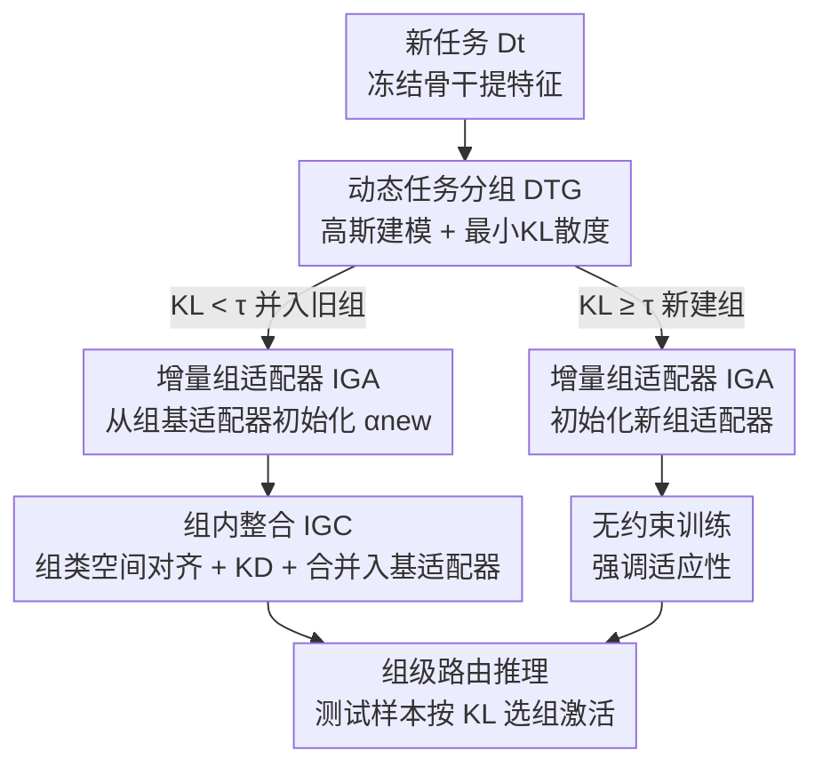

# Boosting Vision-Language Models Towards Cross-Domain Incremental Object Detection

**会议**: CVPR 2026  
**论文**: [CVF Open Access](https://openaccess.thecvf.com/content/CVPR2026/html/Wang_Boosting_Vision-Language_Models_Towards_Cross-Domain_Incremental_Object_Detection_CVPR_2026_paper.html)  
**代码**: https://github.com/Never-wx/dgs  
**领域**: 多模态VLM  
**关键词**: 增量目标检测, 跨域持续学习, VLM, LoRA适配器, 任务分组  

## 一句话总结
针对"跨域增量目标检测"这一更现实的场景，本文先建了 CDIOD 基准（让检测器依次学自然场景、水下、遥感三个域的子任务），再提出 DGS 框架：按分布相似度把任务动态分组、组内用可扩展 LoRA 适配器共享子空间、并在分组路由下推理，在 CDIOD 上以仅 +1.2% 参数取得 +11.4 AP 的 SOTA。

## 研究背景与动机

**领域现状**：增量目标检测（IOD）希望检测器能不断学新类别、应对动态环境，Grounding DINO、GLIP 这类视觉-语言模型（VLM）把检测变成"区域-文本对齐"的短语 grounding 问题，天然具备开放词表能力，被认为是 IOD 的理想底座。要把 VLM 用到下游专业场景，通常还得微调来弥合分布差距。

**现有痛点**：绝大多数 IOD 研究都把场景**过度简化**为"所有增量任务来自同一个通用域"。本文指出，在这种单域设定下，直接朴素微调 VLM 就已经能打平 SOTA（Fig. 1(b)），说明现有 benchmark 根本无法反映现代 VLM 检测器的真实增量能力。而真实世界里，新域和新类别往往**同时出现**（如从 Objects365 跳到遥感图像），二者叠加才是真正的难题。

**核心矛盾**：在大幅域偏移下，VLM 会发生严重遗忘，且引入新类别会进一步加剧遗忘——这让"为旧知识和新知识找一个最优子空间"变得极难，于是现有方法在**稳定性（stability，不忘旧）与适应性（adaptivity，学好新）之间无法兼顾**。全量微调适应性好但跨域遗忘严重；PEFT 方法（给每个任务独立适配器/prompt）靠隔离子空间保住稳定性，但有两个硬伤：① 把每个任务当独立个体，忽视了检测任务间天然共享的语义（不同任务的物体常共现于同一图像）；② 推理时依赖 task-ID 路由，CDIOD 下任务多、域交织，路由错误率飙升导致掉点。

**本文目标**：构造一个能同时考察新类别+新域的现实评测协议；并设计一个能在剧烈分布漂移的任务流上同时守住稳定性与适应性的框架。

**切入角度**：与其把每个任务关进独立子空间，不如把**分布相似的任务归到同一组、让它们联合演化共享子空间**，把 CDIOD 重新 formulate 成一个"任务分组指派"问题——模型动态地把新任务指派到最兼容的组并增量扩展该组的共享子空间。

**核心 idea**：用"动态任务分组 + 组内适配器合并"替代"每任务独立适配器 + 任务级路由"，实现组内知识共享、组间知识隔离，从而在跨域增量中平衡稳定性与适应性。

## 方法详解

### 整体框架

DGS（Dynamic Group Subspace）建在冻结的 Grounding-DINO-T 之上，只训练插在 enhancer 层 FFN 里的 LoRA 适配器。它由三个组件串成一条**动态训练管线**：①**动态任务分组（DTG）** 把新到的任务建模成特征空间里的高斯分布，按 KL 散度判断它该并入某个已有组还是新建组；②**增量组适配器（IGA）** 为每个组维护一组可扩展的 LoRA 适配器；③**组内整合（IGC）** 训完一个任务后把它的适配器合并进该组的"基适配器"，refine 共享子空间并控制参数增长。训练管线会**按 DTG 的指派结果分叉**：进新组的任务无约束训练（强调适应性），并入旧组的任务触发 IGC（强调稳定性）。推理时 DTG 对测试样本同样估高斯分布，做**组级路由**激活对应组的适配器预测，绕开了任务级路由的高错误率。

### 关键设计

**1. 动态任务分组 DTG：用分布相似度决定"合并还是隔离"**

痛点直接对准 PEFT 的两大硬伤——任务独立化既浪费了共享语义，又逼出不靠谱的任务级路由。DTG 的做法是把每个任务 $D_t$ 用冻结图像骨干提特征 $F_t$，估出均值 $\mu_t=E(F_t)$、方差 $\Sigma_t=\mathrm{Var}(F_t)$，用高斯 $\mathcal{N}_t=\mathcal{N}(\mu_t,\Sigma_t)$ 近似该任务分布。判断它和某个组 $g$ 的相似度时，取该组内所有任务的**最小 KL 散度**：

$$\mathrm{KL}(t,g)=\min_{k\in g}\left[D_{KL}(\mathcal{N}_t\|\mathcal{N}_k)\right]$$

令 $g^*=\arg\min_g \mathrm{KL}(t,g)$，分组决策为：若 $\mathrm{KL}(t,g^*)<\tau$ 则并入 $g^*$，否则新建一组。阈值 $\tau$ 直接掌控分组粒度——太小退化成每任务一组（回到任务级路由），太大把异质任务挤进同组造成干扰。这一设计让"相似域联合演化、异质域彼此隔离"有了量化标准，也为推理期的组级路由复用了同一套分布度量。

**2. 增量组适配器 IGA：组内多任务用可扩展 LoRA 撑起共享容量**

DTG 给出了任务到组的映射，IGA 负责具体承载每个组的可训练容量。每个组 $g_i$ 配一个 IGA 模块 $\mathcal{A}_i$，内含一组任务级 LoRA 适配器 $\alpha^k_{g_i}$（组里每来一个任务 $k$ 就有一个），这些适配器按 LoRA 方式插进**文本和图像两条分支** enhancer 层的 FFN。给定 FFN 输入 $h$，输出为：

$$\mathrm{FFN}(h)+\sum_{k\in g_i} m_k\cdot B_k A_k h$$

其中 $A_k,B_k$ 是任务 $k$ 的低秩矩阵，$m_k$ 是 one-hot 掩码用来选中当前激活的适配器。把适配器分散到组内、而非全局一摊，使得"组内扩展"成为应对新任务的基本操作，既保留了 LoRA 的快速适应能力，又把容量增长约束在组的范围内（实验里只占 1.2% 额外参数）。

**3. 组内整合 IGC：靠初始化+对齐保证适配器能安全合并进共享子空间**

IGA 里多个任务的适配器各占独立子空间，IGC 要把它们融成一个组内共享子空间，同时防止参数随任务线性膨胀。做法是每个 IGA 维护一个基适配器 $\alpha_g^{\text{base}}$，训完新任务适配器 $\alpha_g^{\text{new}}$ 后迭代合并：

$$\alpha_g^{\text{base}}\leftarrow\lambda\,\alpha_g^{\text{base}}+(1-\lambda)\,\alpha_g^{\text{new}}$$

$\lambda\in[0,1]$ 平衡旧知识保留与新信息吸收，合并作用于两个 LoRA 矩阵 $(A,B)$，合并后 $\alpha_g^{\text{new}}$ 直接丢弃——参数因此不会线性增长。但直接平均独立训练的模型会落进不同 basin、产生高 loss 壁垒，所以 IGC 配了两个关键机制：**组初始化**——新任务 $\alpha_g^{\text{new}}$ 从组基适配器 $\alpha_g^{\text{base}}$ 初始化（微调前后通常同 basin，保证合并权重落在低 loss 区）；**组对齐**——只用任务自身监督训练会让 $\alpha_g^{\text{new}}$ 漂离 $\alpha_g^{\text{base}}$，于是改在**整个组的类空间**上训练，缺失标注用 $\alpha_g^{\text{base}}$ 生成伪标签补齐，并加一个拓扑型 KD 损失让新适配器与组共享表示保持一致：

$$\mathcal{L}_{\text{kd}}=\mathcal{L}\left(\mathcal{M}(x;\alpha_g^{\text{new}}),\;\mathcal{M}(x;\alpha_g^{\text{base}})\right)$$

消融显示，光有 G-LoRA 分组合并只到 54.3 AP，加组初始化升到 56.7，再加组对齐才冲到 60.2，证明"安全合并"这两步是稳定性的主要来源。

### 损失函数 / 训练策略

训练管线由二元指示 $\delta(t)$ 驱动：$\delta(t)=1$ 表示任务并入已有组（触发 IGC、强调稳定），$\delta(t)=0$ 表示新建组（无约束训练、强调适应）。总目标为：

$$\mathcal{L}=\mathcal{L}_{\text{align}}+\mathcal{L}_{\text{reg}}+\delta(t)\mathcal{L}_{\text{kd}}$$

其中 $\mathcal{L}_{\text{align}}$ 用 focal loss 做区域-文本对齐，$\mathcal{L}_{\text{reg}}$ 用 L1 + GIoU 做框回归，$\mathcal{L}_{\text{kd}}$ 仅在并入旧组时启用。实现上全部基于 Grounding-DINO-T（Objects365 + GoldG + Cap4M 预训练），只更新 LoRA 参数、rank=16，8×RTX 3090、总 batch 16、初始学习率 $1\times10^{-3}$ 训 11 epoch（末段 0.1× 衰减；$\delta(t)=1$ 时初值降到 $5\times10^{-4}$），扩展阈值 $\tau=150$、合并因子 $\lambda=0.2$。

## 实验关键数据

### 主实验

CDIOD 由 DIOR（遥感 20 类）、Pascal VOC（自然场景 20 类）、RUOD（水下 10 类）三个域共 50 类按类增量串成，最终任务无关地联合评测，报告 AP(mAP50:95)，三次随机任务序后取均值。

| 数据集/设定 | 指标 | DGS(本文) | 之前SOTA(MR-GDINO) | 提升 |
|--------|------|------|----------|------|
| CDIOD 0-10 (5阶段) Avg | AP | **64.7 ±0.6** | 56.2 ±0.2 | +8.5 |
| CDIOD 0-5 (10阶段) Avg | AP | **60.2 ±0.2** | 48.8 ±0.4 | +11.4 |
| CDIOD 0-5 DIOR | AP | **58.8** | 34.4 | +24.4 |
| CDIOD 0-5 RUOD | AP | **56.7** | 48.7 | +8.0 |

可见越长的增量序列（10 阶段）域偏移越剧烈、提升越大，尤其在 DIOR（遥感，离预训练分布最远）上把 34.4 抬到 58.8。全量微调适应性好但跨域遗忘崩（0-5 Avg 仅 24.6），PEFT 方法稳但适应性差，DGS 在所有域上取得更好平衡。

跨基准泛化也成立：IVLOD（ODinW-13 顺序训练）上 ZCOCO 零样本只掉 1.0 AP、ODinW13 均值反超前 SOTA +1.2 AP（13 个数据集赢 10 个）；常规 IOD（COCO 40-10）上 all 类 52.6 AP 也优于各 baseline，体现域内稳定性增强。

### 消融实验

10 阶段 CDIOD 设定下逐组件拆解（EPP=额外参数百分比）：

| # | 配置 | EPP | Avg AP | 说明 |
|------|------|---------|---------|------|
| 1 | Base Model(零样本) | 0.00% | 24.7 | 冻结 VLM |
| 2 | LoRA | 0.40% | 29.5 | 单适配器，能适应但严重遗忘 |
| 3 | T-LoRA | 4.00% | 51.5 | 每任务独立 LoRA，参数线性增长+路由错 |
| 4 | 3 + Merge | 4.00% | 43.8 | 朴素合并全部 LoRA，跨域知识鸿沟致大跌 |
| 5 | G-LoRA | 1.20% | 54.3 | DTG 分组+组内合并，参数不再线性增长 |
| 6 | 5 + Group Init | 1.20% | 56.7 | 组初始化，进一步缓解遗忘 |
| 7 | 6 + Group Align(Full) | 1.20% | 60.2 | 组对齐，适应性与稳定性同时拉满 |

### 关键发现

- **分组是核心增益来源**：T-LoRA(4% 参数)只有 51.5，G-LoRA 用 1.2% 参数就达 54.3——按分布分组既省参数又避开了朴素合并(Row 4 仅 43.8)的跨域知识冲突。
- **"安全合并"两步缺一不可**：组初始化 +2.4、组对齐再 +3.5，证明合并前把适配器拉进同一 basin、训练时用组类空间+伪标签+KD 对齐，是稳定性的关键。
- **阈值 $\tau$ 鲁棒**：$\tau\in[100,600]$ 时分成 3-4 组、AP 稳定在 59.6-60.2；$\tau=1$ 退化成每任务一组(51.5)，$\tau=1000$ 挤成 2 组、DIOR 崩到 23.5。说明分组粒度有较宽的安全区。
- **组级路由显著降错**：相比 AE/NMC/Dist 等任务级路由的域内混淆，DTG 组级路由在 10 阶段后路由准确率明显更高，且 T-LoRA 性能对路由准确率高度敏感，印证"绕开任务级路由"的价值。

## 亮点与洞察
- **把"任务独立 vs 全局共享"的二元对立改成"动态分组"中间态**：用 KL 散度自适应决定相似任务合并、异质任务隔离，一个 $\tau$ 同时掌控训练分组与推理路由，思路干净且可迁移到任何 PEFT 增量框架。
- **用模型合并(model merging)解决增量遗忘**：组基适配器的凸组合 + 同 basin 初始化 + 伪标签/KD 对齐，是把"权重平均会撞高 loss 壁垒"这个已知坑系统性填上的实用方案，可复用于任意 LoRA 增量场景。
- **组级路由 > 任务级路由**：揭示了 PEFT 增量检测真正的瓶颈往往不在适配器本身，而在推理期 task-ID 预测；把路由从"任务"粒度抬到"组"粒度直接把错误率压下来，这个观察很有启发性。
- **CDIOD 基准本身的价值**：它点破了"单域 IOD 已被朴素微调打平"的尴尬，把跨域+新类别的复合挑战摆上台面，为后续 VLM 增量检测提供了更有区分度的试金石。

## 局限与展望
- DTG 用单一高斯近似整个任务分布，对多模态/长尾域内分布可能不够精细；KL 度量也依赖冻结骨干的特征质量，骨干本身偏置时分组可能误判。
- 组对齐依赖 $\alpha_g^{\text{base}}$ 生成伪标签补缺失标注，若基适配器在某域本就弱，伪标签噪声可能反噬新任务训练（论文未深究伪标签质量的影响）。⚠️
- 合并因子 $\lambda$ 与阈值 $\tau$ 虽被报告为鲁棒，但都是全局固定值；不同组的最优保留-吸收平衡可能不同，自适应 $\lambda$ 或许还有空间。
- 评测仍限于检测三域（自然/水下/遥感），更极端的域（医学、红外、夜视）或更长任务流下的表现待验证。

## 相关工作与启发
- **vs MR-GDINO / ZiRa（任务级 PEFT）**: 它们给每任务训独立适配器、靠 task-ID 路由，本文指出这在跨域交织时路由错误率高、且浪费共享语义；DGS 改为组级共享子空间+组级路由，CDIOD 上大幅领先（+11.4 AP）。
- **vs GCD（KD 全局范式）**: GCD 蒸馏视觉-语言拓扑关系、维护覆盖所有旧类的全局 prompt，但大域偏移下仍守不住旧知识；DGS 通过隔离异质组避免了全局更新的相互干扰。
- **vs 朴素全量微调**: 单域 IOD 里朴素微调已能打平 SOTA，但跨域下灾难性遗忘严重（0-5 Avg 24.6）；DGS 用 1.2% 参数把适应与稳定同时做好，证明 VLM 增量检测的关键在结构化的子空间管理而非整模型更新。

## 评分
- 新颖性: ⭐⭐⭐⭐ 把跨域增量检测 formulate 成动态分组问题，DTG+IGC 组合新颖且贴合 VLM 特性
- 实验充分度: ⭐⭐⭐⭐ 三基准(CDIOD/IOD/IVLOD)+逐组件消融+阈值/路由/参数分析，较为完整
- 写作质量: ⭐⭐⭐⭐ 问题动机层层递进，图表清晰；部分符号(如对齐细节)需结合附录
- 价值: ⭐⭐⭐⭐ CDIOD 基准与组级路由洞察对 VLM 持续学习社区有实用参考价值

<!-- RELATED:START -->

## 相关论文

- [\[CVPR 2026\] UNI-OOD: Unified Object- and Image-level Out-of-Distribution Detection via Cross-Context Attentive Vision-Language Modeling](uni-ood_unified_object-_and_image-level_out-of-distribution_detection_via_cross-.md)
- [\[CVPR 2026\] Mechanisms of Object Localization in Vision-Language Models](mechanisms_of_object_localization_in_vision-language_models.md)
- [\[AAAI 2026\] Cross-modal Proxy Evolving for OOD Detection with Vision-Language Models](../../AAAI2026/multimodal_vlm/cross-modal_proxy_evolving_for_ood_detection_with_vision-lan.md)
- [\[CVPR 2026\] BOP-Ask: Object-Interaction Reasoning for Vision-Language Models](bop-ask_object-interaction_reasoning_for_vision-language_models.md)
- [\[CVPR 2026\] ORIC: Benchmarking Object Recognition under Contextual Incongruity in Large Vision-Language Models](oric_benchmarking_object_recognition_under_contextual_incongruity_in_large_visio.md)

<!-- RELATED:END -->
