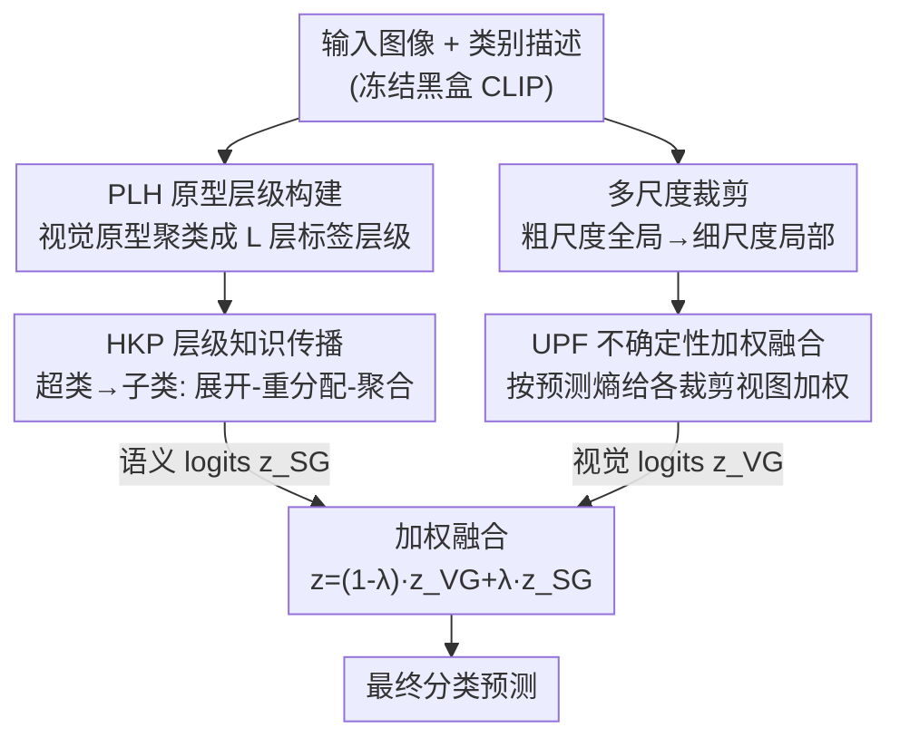

# Boosting Visual Reprogramming for CLIP with Dual Granularity Alignment

**会议**: CVPR 2026  
**论文**: [CVF Open Access](https://openaccess.thecvf.com/content/CVPR2026/html/Wu_Boosting_Visual_Reprogramming_for_CLIP_with_Dual_Granularity_Alignment_CVPR_2026_paper.html)  
**代码**: https://github.com/JiayangWU66/DGA  
**领域**: 多模态VLM  
**关键词**: 视觉重编程, CLIP少样本, 标签层级, 多尺度对齐, 不确定性加权  

## 一句话总结
针对 CLIP 视觉重编程（只训练输入端的视觉提示、冻结黑盒 CLIP）只做"单层对齐"的缺陷，本文提出 DGA，从数据里挖出两种被忽略的结构信息——语义粒度（标签层级）和视觉粒度（多尺度），用 PLH+HKP 做层级语义对齐、用多尺度裁剪+UPF 做不确定性加权的视觉对齐，两路协同融合，在 12 个识别数据集上比上一代 SOTA（DVP）平均提升 4.5%。

## 研究背景与动机
**领域现状**：模型重编程（model reprogramming）是一种参数高效的黑盒适配范式——不碰预训练模型的内部结构和参数，只在输入/输出端学一组变换。落到 CLIP 上就是**视觉重编程（Visual Reprogramming, VR）**：冻结 CLIP 的图像/文本编码器，只学一块加在输入图像上的可学习扰动（即视觉提示 VP），把 CLIP 原有的图文对齐能力"借用"到下游分类任务上。形式化地，VR 优化一个输入变换 $\delta$：

$$\tilde{x}_i = \mathrm{Pad}(x_i) + \delta \odot M$$

其中 $M$ 是二值掩码（图像所在区域为 0、外圈为 1），保证只在图像周边贴 VP、绝不改 CLIP 内部。这在数据稀缺、只能访问黑盒 API 的场景下尤其实用。

**现有痛点**：从 VP、AR 到 AttrVR、DVP，这一系列 VR 方法都聚焦于**单层（single-level）图文对齐**——把"贴了 VP 的整图"和"类别文本描述"直接拉齐。它们把每张图当成一个扁平的整体、每个类别当成一个孤立的标签，完全没用上数据里天然存在的两种结构信息。

**核心矛盾**：判别不同类别的关键特征其实分布在**不同的视觉细节层次**上（粗尺度看全局、细尺度看局部判别区），而类别之间也存在**层级语义关系**（细类可以聚成超类）。单层对齐把这两种"粒度"都拍平了，VP 学到的对齐自然不够充分。

**本文目标**：把这两种被忽略的结构信息显式建模进 VP 的训练过程——既要让 VP 感知视觉粒度（多尺度），又要让 VP 感知语义粒度（标签层级）。

**切入角度**：作者有一个关键观察——构建语义层级时，**不该用文本描述去算类别相似度**（视觉和语言存在模态鸿沟，文本相似度未必反映视觉可分性），而应该直接用 CLIP 的**视觉原型**算相似度来聚类，这样得到的层级才"对齐目标模态的特征"。

**核心 idea**：用"视觉粒度 + 语义粒度"的双粒度对齐替代单层对齐——多尺度裁剪配不确定性加权融合处理视觉粒度，视觉原型聚类配层级知识自上而下传播处理语义粒度，两路协同生成更可靠的 VP。

## 方法详解

### 整体框架
DGA（Dual Granularity Alignment）是一个 VP 训练框架，输入是一批带标签的下游图像 + 类别文本描述，输出是一组训练好的视觉提示 $\delta$ 和最终分类 logits。它由两条并行支路 + 一个融合头组成：

- **语义粒度支路（SG）**：先用 **PLH** 把所有类别按视觉原型相似度自底向上聚成 $L$ 层标签层级（如细类 → 中类 → 超类），每一层都对应一组 VP 和一组层级描述；再用 **HKP** 让超类的知识自上而下约束子类——超类 VP 平均进全局 VP、超类 logits 经"展开-重分配-聚合"后注入子类预测。
- **视觉粒度支路（VG）**：对每张图做**多尺度随机裁剪**（粗尺度看全局、细尺度看局部），每个尺度配自己的局部 VP $\delta_e^{local}$；再用 **UPF** 按预测熵给各裁剪视图算可靠性权重、加权融合，压掉"裁丢了关键物体/视图质量差"的坏预测。
- **融合头**：两路 logits 用权重 $\lambda$ 加权相加得到最终预测，损失同时监督子类分类和各层级分类。

### 关键设计

**1. PLH 原型层级构建：用视觉原型相似度造标签层级，绕开模态鸿沟**

要做语义粒度对齐，先得有一棵"类别层级树"。作者拒绝用文本描述算类别距离——视觉/语言之间的模态鸿沟会让文本相似度偏离视觉可分性。PLH（Prototype-guided Label Hierarchization）改用 CLIP **视觉特征**：先用零样本 CLIP 抽出每个样本的视觉特征，对每个类别 $c$ 取所有样本特征均值作为**视觉原型** $p_c = \frac{1}{N_c}\sum_{i\in I_c} f_i$。然后做**自底向上的凝聚式聚类**：从"每个类别各自一簇"出发，反复找当前簇里原型欧氏距离 $d_{ij}=\|p_i-p_j\|$ 最小的一对合并，合并后新簇原型取其包含的原始类别原型的均值；重复直到构造出 $L$ 层层级 $\{H_l\}_{l=1}^L$。这样得到的超类划分是按"在 CLIP 视觉空间里像不像"分的，天然贴合 VR 要对齐的目标模态。

**2. HKP 层级知识传播：让超类知识自上而下约束子类的 VP 与预测**

光有层级树还不够，得让上层（超类）的知识真正"传"给下层（子类）。HKP（Hierarchical Knowledge Propagation）在两个层面做自上而下传播。其一是 **VP 层面**：全局分支的 VP 取自身 VP 与所有 $L$ 层超类 VP 的平均，$\delta_{global} = \frac{1}{L+1}\left(\delta_0 + \sum_{k=1}^{L}\delta_k\right)$，让超类的提示约束子类的特征提取。其二是 **logits 层面**：对每个超类层级的 logits $z_i^{(l)}$ 走三步——**展开（expansion）**把超类 logit 按层级关系复制给它所有从属子类，$z_{i,c}^{(exp),(l)} = z_{i,s}^{(l)},\ \forall c\in S_s^{(l)}$；**重分配（redistribution）**再按子类自己的归一化置信度把展开值分摊下去，$\tilde{z}_{i,c}^{(l)} = z_{i,c}^{(exp),(l)}\cdot \frac{\exp(z_{i,c})}{\sum_{c'}\exp(z_{i,c'})}$；**聚合（aggregation）**把各层级结果平均得语义 logits $z_i^{SG} = \frac{1}{L}\sum_{l=1}^{L}\tilde{z}_i^{(l)}$。这样超类的先验既塑造了 VP、又作为概率分布的先验注入子类预测，形成跨语义层的连贯对齐。

**3. UPF 不确定性加权融合：多尺度裁剪 + 按熵过滤坏视图**

视觉粒度支路先做多尺度采样：给定原图尺寸 $S_0$、尺度递减量 $\Delta$，第 $e$ 个尺度的裁剪尺寸为 $S_e = S_0 - \Delta\cdot e$，裁剪后双线性插值回 $S_0$ 并贴上该尺度专属的局部 VP $\delta_e^{local}$，从而让 VP 在不同视觉细节层次上分别对齐文本。但随机裁剪有两个坑：关键物体可能被裁出框、不同视图的判别质量参差不齐。UPF（Uncertainty-calibrated Prediction Fusion）用**预测熵**作为质量度量来动态加权：对每个裁剪视图 $j$ 算熵 $H_i^{(j)} = -\sum_c p_{i,c}^{(j)}\log p_{i,c}^{(j)}$（$p$ 为 softmax 概率）；以阈值 $H_0$ 过滤——熵低于阈值（更确定）的视图给正权重 $w_i^{(j)} = H_0 - H_i^{(j)}$，否则权重置 0，再 L1 归一化 $\hat{w}_i = w_i/\|w_i\|_1$。该尺度的融合 logits 为 $z_i^e = \sum_j z_i^{(j)}\cdot\hat{w}_i^{(j)}$，最后对所有尺度（含全局尺度 $z_i^0$）平均得 $z_i^{VG} = \frac{1}{E+1}(z_i^0 + \sum_{e=1}^{E} z_i^e)$。本质是"越确定的视图越可信"，把裁糊/裁偏的预测自动压到接近 0。

### 损失函数 / 训练策略
两路 logits 用 $\lambda$ 加权融合得最终预测 $z_i = (1-\lambda)\cdot z_i^{VG} + \lambda\cdot z_i^{SG}$。训练目标同时约束子类分类与各层级分类：

$$\mathcal{L}_{total} = \mathcal{L}_{sub} + \mathcal{L}_{hier}$$

其中子类损失 $\mathcal{L}_{sub} = -\log\frac{\exp(z_{i,y_i})}{\sum_j \exp(z_{i,j})}$ 是标准交叉熵；层级监督损失 $\mathcal{L}_{hier} = -\frac{1}{L}\sum_{l=1}^{L}\log\frac{\exp(z_{i,y_i}^{(l)})}{\sum_j \exp(z_{i,j}^{(l)})}$ 在每个层级用该层标签 $y_i^{(l)}$ 做监督。全程冻结 CLIP，只更新各尺度/各层级的 VP 参数；优化用 SGD（lr=40、动量 0.9、cosine 退火、200 epoch），$\lambda=0.7$ 为全数据集通用设置。

## 实验关键数据

### 主实验
16-shot 设置、ViT-B/16 CLIP、12 个识别数据集、三次随机种子取均值。DGA 全面超越上一代 SOTA：

| 数据集 | VP | AttrVR | DVP-CSE | DGA(本文) |
|--------|------|--------|---------|-----------|
| Aircraft | 32.1 | 36.6 | 40.3 | **51.8** |
| Cars | 65.5 | 68.3 | 72.5 | **84.4** |
| DTD | 61.4 | 65.6 | 66.7 | **73.9** |
| Flowers | 82.5 | 92.9 | 95.4 | **97.6** |
| SUN | 65.8 | 69.6 | 71.1 | **76.9** |
| ImageNet | 64.2 | 69.4 | 70.0 | **72.7** |
| **12 数据集均值** | 73.5 | 77.7 | 79.3 | **83.8** |

平均 83.8% 比 DVP-CSE（79.3%）高 4.5%、比 DVP-CLS（78.9%）高 4.9%。细粒度数据集涨幅最猛——Aircraft +11.5、Cars +11.9，正对应 VG 模块"靠少数关键视觉细节区分类别"的设计意图。跨骨干（RN50/RN101/ViT-B/32/ViT-B/16）也一致提升；ViT-B/16 涨幅相对小，作者归因于其本身特征提取已很强、提升空间有限。

### 消融实验
在 SUN/UCF/Pets/Aircraft 四个数据集上（均值为这 4 个的平均）：

| 配置 | 均值Acc | 说明 |
|------|---------|------|
| Full Model（VG+UPF+SG+HKP） | **77.3** | 完整模型 |
| w/o HKP（SG 保留但去 HKP） | 75.6 | 只留 logits 展开、去重分配+聚合，掉 1.7 |
| w/o SG（整条语义支路去掉） | 76.4 | 掉 0.9 |
| w/o UPF（VG 保留但去 UPF） | 75.7 | 多裁剪改简单平均，掉 1.6 |
| w/o VG（整条视觉支路去掉） | 75.5 | 掉 1.8 |

### 关键发现
- **VG 支路贡献更大、尤其在难数据集上**：去掉 VG 后 Aircraft 从 51.0→48.4、UCF 从 86.7→84.2，细粒度/视频识别掉点最明显，印证多尺度建模对"关键判别细节"的价值。
- **UPF/HKP 是两路的"灵魂"而非可选项**：单独去掉 UPF（75.7）或 HKP（75.6）的掉点，甚至接近去掉整条 VG（75.5）/SG（76.4）支路——说明光有多尺度/多层级但不会"加权融合 / 知识传播"，信息根本用不起来。
- **超参不敏感、实用性强**：$\lambda$ 在各数据集上精度标准差 < 0.5%、约 $\lambda=0.7$ 最优；UPF 阈值在 $[0.3, 2.1]$ 区间波动 < 1.6%。作者据此用一套通用超参跑所有数据集，免去逐数据集调参。
- DGA 在多数数据集上不仅均值高、标准差也低；DTD 标准差偏高源于其类内多样性大（纹理识别本身不稳定），Aircraft 略高则因类间混淆导致特征敏感。

## 亮点与洞察
- **"造层级树该用视觉原型而非文本"是很对的直觉**：在 CLIP 这种图文模型上做语义结构，自然会想到用文本算类别相似度；本文明确指出模态鸿沟会让文本相似度跑偏，改用 CLIP 视觉原型聚类——这个 caveat 对所有"想给 CLIP 加语义层级"的工作都有借鉴价值。
- **用预测熵当裁剪视图的可靠性权重，简单且免训练**：UPF 不需要额外的质量评估网络，直接拿 softmax 熵 + 一个阈值就能把裁糊/裁偏的视图权重压到 0，是个可即插即用的多视图融合 trick。
- **HKP 的"展开-重分配-聚合"把层级先验做成了概率分布的软约束**：相比硬性的层级分类损失，它让超类置信度按子类自身置信度重新分摊，既注入先验又不抹掉子类的判别性，这套 logits 操作可迁移到任何带标签层级的分类任务。
- 全程不碰 CLIP 内部、只学输入端 VP，黑盒友好——双粒度的所有增益都来自"怎么更聪明地组织输入和融合输出"，这点在只能访问 API 的场景很有吸引力。

## 局限与展望
- **依赖多尺度裁剪 + 多层级 VP，训练/推理开销随尺度数 $E$ 和层级数 $L$ 增长**：每个尺度、每个层级都要各自的 VP 和一次前向，相比单层 VR 的计算量明显更高，论文未充分讨论这部分代价。⚠️ 具体开销倍数原文未给量化，以原文为准。
- **PLH 的层级靠零样本 CLIP 视觉原型聚类**：当下游域与 CLIP 预训练分布差异很大（如医学/遥感细分），零样本特征本身就不准，聚出来的"超类"可能并不语义合理，进而拖累 HKP——本文的 Resisc 遥感数据虽有提升，但这一隐患在更偏的域上值得警惕。
- 实验只覆盖 16-shot 分类、未测更低样本（1/4/8-shot）或更大词表场景下层级聚类与 UPF 阈值是否仍稳健。
- 改进思路：层级数/尺度数可做成自适应（按数据集类别数/类内方差决定 $L,E$），而非固定；UPF 的硬阈值过滤可换成更平滑的不确定性加权（如温度调节的软权重）。

## 相关工作与启发
- **vs DVP**：DVP 通过"解耦+重加权"多个 VP 来提升可靠性，但仍是单层图文对齐；DGA 引入语义/视觉双粒度的多层结构，区别在于它显式建模了标签层级和多尺度——这也是 Aircraft/Cars 等细粒度任务上 DGA 大幅反超 DVP 的原因。
- **vs AttrVR**：AttrVR 用 LLM 生成的描述性/判别性属性来引导单个 VP；DGA 沿用其实验配置但把对齐从"单 VP×属性"升级为"多层级/多尺度 VP×层级描述"，从数据结构而非文本属性侧挖增量。
- **vs 提示学习（prompt learning，如 CoOp/VPT）**：提示学习需要访问并修改预训练模型内部（插 token、改注意力），而 VR/DGA 只在输入端贴 VP、把 CLIP 当完全黑盒，适用约束访问/黑盒 API 场景，这是两类范式的根本分野。

## 评分
- 新颖性: ⭐⭐⭐⭐ 把"双粒度结构信息"显式引入 VR、并坚持用视觉原型而非文本造层级，角度新且自洽
- 实验充分度: ⭐⭐⭐⭐ 12 数据集 + 4 骨干 + 完整消融 + 三种超参敏感性分析，但只测 16-shot
- 写作质量: ⭐⭐⭐⭐ 公式与算法清晰、pipeline 图信息密但能对上方法
- 价值: ⭐⭐⭐⭐ 黑盒友好、超参不敏感，对 CLIP 少样本黑盒适配是实用的一步

<!-- RELATED:START -->

## 相关论文

- [\[CVPR 2026\] IsoCLIP: Decomposing CLIP Projectors for Efficient Intra-modal Alignment](isoclip_decomposing_clip_projectors_for_efficient_intramodal_alignment.md)
- [\[CVPR 2026\] Granulon: Awakening Pixel-Level Visual Encoders with Adaptive Multi-Granularity Semantics for MLLM](granulon_awakening_pixel-level_visual_encoders_with_adaptive_multi-granularity_s.md)
- [\[CVPR 2026\] β-CLIP: Text-Conditioned Contrastive Learning for Multi-Granular Vision-Language Alignment](b-clip_text-conditioned_contrastive_learning_for_multi-granular_vision-language_.md)
- [\[CVPR 2026\] POINTS-Long: Adaptive Dual-Mode Visual Reasoning in MLLMs](points-long_adaptive_dual-mode_visual_reasoning_in_mllms.md)
- [\[CVPR 2026\] Boosting Document Parsing Efficiency and Performance with Coarse-to-Fine Visual Processing](boosting_document_parsing_efficiency_and_performance_with_coarse-to-fine_visual_.md)

<!-- RELATED:END -->
