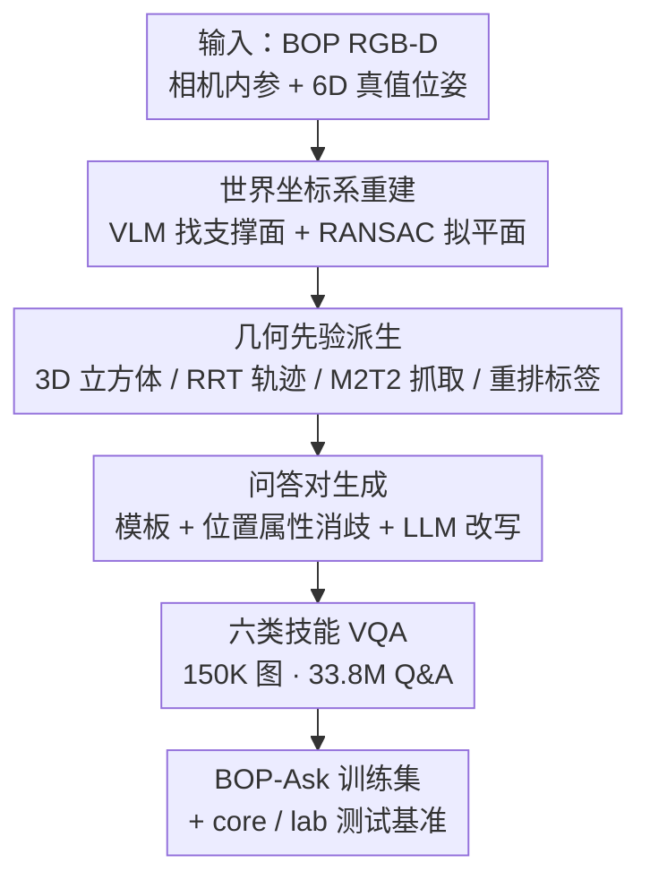

# BOP-Ask: Object-Interaction Reasoning for Vision-Language Models

**会议**: CVPR 2026  
**arXiv**: [2511.16857](https://arxiv.org/abs/2511.16857)  
**代码**: https://bop-ask.github.io/ (项目主页)  
**领域**: 多模态VLM / 具身空间推理 / 机器人  
**关键词**: 物体交互推理, 6D 位姿, 抓取, 运动规划, VQA 基准

## 一句话总结
本文把 6D 物体位姿基准 BOP 自动改造成一个含 150K 图像、33.8M 问答对、覆盖六类技能（位姿/抓取/轨迹/重排/空间/深度）的大规模物体交互推理数据集 BOP-Ask，用它微调开源 VLM 后不仅在自建测试集上大幅超越 GPT-5、Gemini，还能迁移到域外空间推理基准并驱动真实 Franka 机器人完成 10/15 抓放任务。

## 研究背景与动机
**领域现状**：当前评测 VLM 空间能力的基准（EmbSpatial、RoboSpatial、SpatialRGPT 等）几乎都在问"高层关系"——A 在 B 的左边/后面、谁离相机更近，并且大多是多选或 yes/no 题。这类题刷分很好看，却掩盖了真正落地机器人时需要的细粒度几何理解。

**现有痛点**：要让 VLM 当具身智能体的"感知接口"，光知道"咖啡罐在左边"远远不够——它得知道**具体抓哪里**（抓取位姿）、**怎么绕开障碍移过去**（无碰撞轨迹）、**先搬走哪个挡路的物体**（重排顺序）。现有数据集要么不含这些可执行信息，要么用单目深度估计这类近似标注，精度撑不起毫米级的抓取/运动规划；规模大的数据集又恰恰缺物体交互任务。

**核心矛盾**：精度、交互完整性、规模三者难以兼得——近似标注的数据集精度不够，精标的数据集规模小且任务窄，大规模数据集又缺交互推理。

**本文目标**：构造一个同时满足"精确（继承 BOP 真值 6D 位姿）+ 交互完整（从感知一路到可执行操作）+ 大规模多样"的数据集，既能训练也能评测，并把答案从多选/二元升级为**像素级坐标输出**。

**切入角度**：BOP（Benchmark for Object Pose estimation）本来就提供了高质量 3D 真值位姿和 3D 模型，但它只管检测/位姿、不管物体之间怎么交互。作者的观察是：有了精确 6D 位姿 + 3D 模型 + RGB-D，**抓取、轨迹、重排这些交互标注全都可以几何地自动推导出来**，无需人工逐条标。

**核心 idea**：把"位姿基准"当作几何金矿，用一条自动管线从 6D 位姿派生出抓取、轨迹、重排等细粒度交互标注，再套模板 + LLM 生成海量自然语言 VQA，从而以极少人工拿到精确且大规模的物体交互推理语料。

## 方法详解

### 整体框架
BOP-Ask 本质是一条**"位姿数据 → 几何先验 → VQA 问答"的自动数据生成管线**：输入是 BOP 系列数据集里的 RGB-D 图、相机内参和物体 6D 真值位姿；输出是形如 $S=\langle I_k, Q_k, A_k, T_k \rangle$ 的样本（图像、问题、答案、任务标签）。管线先把场景对齐到统一世界坐标系，再用几何/规划算法从位姿派生出抓取、轨迹、重排等先验，最后用模板 + LLM 把这些先验翻译成语言多样的问答对。位姿/抓取/轨迹/重排的答案统一表示为**有序的 2D 关键点列表**（像素坐标），空间/深度任务则是二元 yes/no。

### 关键设计

**1. 六类物体交互技能：把"感知→可执行操作"拆成可评测的任务谱**

痛点是现有基准只测"左/右/远/近"这类关系判断，离真正操作物体还差一大截。作者据此定义了一套覆盖完整操作链的六类技能：① **物体位姿估计**——预测被指物体的 3D 立方体框（而非 VLM 惯常的 2D 框或点）；② **抓取估计**——推断稳定的 3D 抓取位姿；③ **物体间运动预测**——生成把源物体移向目标物体的无碰撞路点；④ **物体重排**——在严重杂乱场景里判断要先搬走哪些挡路物体才能抓到目标；⑤ **空间推理**和 ⑥ **相对深度感知**两个二元任务（左右上下 / 远近）。前四类是本文新增、且要求像素级精确输出，后两类沿用前人但作为多技能共训的辅助。这套谱系的价值在于：它第一次把抓取可行性、碰撞感知运动、操作排序这些机器人真正要用的能力，统一成可自动标注、可定量评测的 VLM 任务

**2. 世界坐标系重建：给一切几何派生一个可靠的重力方向**

直接拿杂乱物体的位姿去估世界 Z 轴很不靠谱——倒着、躺着的物体根本不能当重力的代理。作者先用一个"指向型" VLM 定位场景里的平面支撑面（如桌面），对那些 3D 点用 RANSAC 拟合平面，**平面法向量 $\mathbf{n}_p$ 即世界上方向**；再用 Rodrigues 公式求把规范上轴 $\mathbf{v}_z=[0,0,1]^\top$ 对齐到 $\mathbf{n}_p$ 的旋转，并解出平移使拟合平面与世界原点对齐，得到相机到世界的变换 ${}^{cam}T_{world}\in SE(3)$。有了统一坐标系，后续抓取、轨迹、立方体框才都落在同一个物理一致的参考系里，这是整条管线几何自洽的前提

**3. 从 6D 位姿自动派生几何先验：抓取/轨迹/重排零人工标注**

这是"以位姿换交互标注"的核心。**立方体框**直接由物体位姿 + 模型尺寸算出；**运动轨迹**用 RRT 规划器在 3D 笛卡尔空间为每对物体（共 $\binom{n}{2}$ 对）生成无碰撞 pick-and-place 路径，10% 目标偏置采样，凡与邻居网格相交的路径被滤掉，再用 Ramer–Douglas–Peucker 算法简化冗余路点得到平滑轨迹；**抓取**用基于 Transformer 的平行夹爪模型 M2T2（全局场景点 + 物体中心点双采样）算，每物体保留 top-5 抓取增加多样性。最妙的一步是**重排标签的自动生成**：如果某物体所有预测抓取都与周围物体碰撞，就把它标为"完全被遮挡/杂乱"，这正好定义了"必须先搬走别的物体才能抓它"的重排任务监督信号。整套先验完全由几何与规划算法产出，几乎不需人工

**4. 模板 + LLM 的问答生成与同类实例消歧**

有了几何先验还要变成自然、可训练的语言问答。作者先渲染 3D 模型让 VLM 生成物体描述（形状/颜色/尺寸/用途，再人工校验），然后按 `{TASK_TYPE} {OBJECT A} {OBJECT B}` 的结构为每类任务设计模板，配上精选的 in-context 示例喂给 LLM，生成语言多样、像人说的话的问题。针对机器人场景常有同类多实例、靠颜色形状无法唯一指代的难题，作者计算各实例 3D 框中心、赋予"最左/最右/最上/最下"等相对位置属性 `{POS. ATTRIBUTE}`，拼进模板来消歧。最终 33.8M 问答里相对深度占 32%、抓取/轨迹/空间各 16%、位姿 12.4%、重排 7.6%

### 损失函数 / 训练策略
本文是数据集论文，不引入新模型或损失。训练即用 Qwen-VL 2.5 与 NVILA 各自官方代码库在 BOP-Ask 上做标准 SFT；开源模型推理在单卡 A100、微调在 8×A100 集群、默认超参。关键评测指标：位姿用 3D IoU；轨迹用成功率 SR（首末点是否落在源/目标物体上）+ 像素距离误差；重排用 Recall(%)；抓取用归一化坐标误差

$$\text{NCE}=\frac{1}{N}\sum_{i=1}^{N}\frac{\|p_i-\hat{p}_i\|_2}{d},$$

其中 $N=5$（抓取用五点表示：抓取中心、左右指根、左右指尖），$d$ 为夹爪宽度，每点按图像宽高归一化以保证尺度不变。

## 实验关键数据

### 主实验（BOP-Ask-core，688 条人工校验 VQA）
微调显著超越所有现成 VLM，多个任务甚至超过人类基准：

| 模型 | 位姿 3D IoU↑ | 轨迹 SR↑ | 抓取 NCE↓ | 空间 SR↑ | 深度 SR↑ | 重排 Recall%↑ |
|------|------|------|------|------|------|------|
| Human | 54.2 | 67.3 | 1.1 | 84.9 | 87.3 | 44.1 |
| GPT-5 | 9.0 | 0 | inf | 68.3 | 74.6 | 14.8 |
| Gemini Robotics-ER 1.5 | 24.4 | 43.0 | 4.2 | 84.2 | 88.0 | 48.9 |
| RoboRefer | 34.3 | 0 | inf | 81.7 | 84.0 | 16.6 |
| NVILA (15B) 原始 | 27.2 | 6.2 | 5.3 | 75.0 | 65.0 | 25.0 |
| **NVILA (15B) - SFT** | **73.5** | **64.2** | **1.40** | **95.8** | 94.6 | **57.7** |
| **NVILA (2B) - SFT** | 77.4 | 50.8 | 1.69 | 94.2 | 94.6 | 56.4 |
| **Qwen-VL 2.5 (3B) - SFT** | 48.2 | 22.5 | 1.5 | 92.6 | 94.1 | 43.4 |

注：`inf` 表示模型未产出有效输出。最强的现成模型 GPT-5 在轨迹/抓取上几乎完全失败，凸显这些技能不在现有预训练语料里。

### 域外泛化 + 消融

**OOD 测试（Table 4，BOP-Ask-lab + 三个域外空间基准）**：微调后全面提升。

| 模型 | RS-H↑ | CV-B↑ | SB↑ | lab-位姿↑ | lab-轨迹↑ | lab-S-D↑ |
|------|------|------|------|------|------|------|
| NVILA | 63.4 | 78.2 | 47.5 | 6.1 | 0 | 70.0 |
| + BOP-Ask | 69.1 | 89.3 | 50.0 | 16.2 | 28.2 | 81.2 |
| Qwen-VL 2.5 | 78.1 | 88.8 | 60.0 | 12.6 | 0 | 74.4 |
| + BOP-Ask | 81.3 | 92.4 | 65.0 | 25.3 | 37.1 | 85.8 |

**数据配方消融（Table 5，NVILA 增量加数据）**：

| 配置 | 位姿 IoU↑ | 轨迹 SR↑ | 抓取 NCE↓ | 重排 Rec%↑ | 说明 |
|------|------|------|------|------|------|
| NVILA (Base) | 6.5 | 0 | 8.15 | 8.3 | 原始模型 |
| + BA-YCBV | 31.7 | 24.2 | 6.37 | 16.4 | 仅 YCB-V |
| + BA-YCBV+H | 54.4 | 30.8 | 2.85 | 21.8 | 加 HANDAL |
| + BA-YCBV+H+L | 67.2 | 51.8 | 2.02 | 39.2 | 再加 LineMOD |
| + BOP-Ask (Full) | 77.4 | 64.2 | 1.40 | 57.7 | 全量四家 |
| + BA-NoSpatDep | 78.2 | 50.0 | 1.69 | 50.3 | 去掉空间/深度二元题 |

### 关键发现
- **数据多样性单调增益**：每加一个 BOP 子数据集，六项指标几乎全线上涨——物体几何、纹理、布局的多样性直接增强细粒度空间泛化。
- **二元辅助任务有用**：去掉空间/深度 yes/no 题（BA-NoSpatDep）后，空间从 94.2→62.5、深度从 94.6→50.6、轨迹也从 64.2→50.0，证明多技能共训中这些"简单"题反而强化了交互推理。
- **重排是最难的技能**：即便最好模型也只到约 57%，它需要同时理解物体-物体关系、3D 坐标对齐和杂乱动态。
- **真机验证**：15 个 Franka 抓放任务中，原始 NVILA 0/15，BOP-Ask 微调后 10/15。

## 亮点与洞察
- **"把已有精标基准当几何金矿"是可复用的方法论**：不去重新采集/人工标注，而是从 BOP 现成的 6D 真值位姿用 RRT、M2T2、RANSAC 这些成熟几何/规划工具自动派生出抓取、轨迹、重排标注，用极少人工换来 33.8M 精确样本——这个"位姿→交互标注"的转换思路可迁移到任何带 3D 真值的数据集。
- **重排监督信号的定义很巧**：不是额外人工标"哪些要先搬"，而是直接复用抓取碰撞检测的副产品——"所有抓取都碰撞=被杂乱遮挡=需要重排"，零成本拿到一个高价值任务的标签。
- **像素级坐标输出取代多选/二元**：迫使模型真正输出可执行的几何量（立方体、五点抓取、路点列表），而不是在选项里蒙，评测也因此更接近真实操作需求。
- **小模型反超大模型**：NVILA 2B SFT 在位姿（77.4）上甚至超过 15B SFT（73.5），说明高质量几何监督比单纯堆参数更关键。

## 局限与展望
- 作者承认重排任务仍只有约 57%，物体-物体关系 + 3D 对齐 + 杂乱动态的联合推理远未解决。
- **域偏窄**：数据全是桌面（tabletop）室内场景、104 个家用/工业物体，BOP-Ask-lab 也只有 15 张图 / 240 条 VQA，开放世界、室外、可形变物体的覆盖很有限。
- **依赖上游几何工具的质量**：抓取来自 M2T2、轨迹来自 RRT，这些先验本身的误差会传进"真值"，标注精度上限被这些算法绑定；物体描述虽 VLM 生成但需人工校验，扩展到全新物体时这步人工成本仍在。
- **与并发工作 TIGeR 无法直接比较**（其数据/模型未公开），同任务上的相对强弱尚不清楚。
- 可改进：把管线接到仿真环境批量造位姿（作者已指出 trivial），或引入可形变/铰接物体、多视角时序，拓宽到非桌面场景。

## 相关工作与启发
- **vs SpatialVLM / RoboPoint**：它们也给 VLM 加显式空间目标，但标注靠单目深度等近似方法、且偏合成或互联网级基准，在物体-物体关系、操作、长程推理上偏弱；BOP-Ask 继承 BOP 真值位姿，精度到毫米级，任务覆盖到可执行操作。
- **vs RoboSpatial**：RoboSpatial 是搭起感知-空间推理桥梁的重要一步（1M 图、3M 空间 QA），但不含运动、位姿、抓取三类可执行标注；BOP-Ask 是唯一同时提供 Motions + Poses + Grasping 的数据集（Table 1），并在 RoboSpatial-Home 上微调后还能提升其分数。
- **vs MolmoAct / RoboBrain**：它们直接在机器人轨迹数据上训练来预测动作，但范围窄、缺抓取可行性/位姿/物体级运动规划的广度；BOP-Ask 用几何派生覆盖更全的交互技能谱。

## 评分
- 新颖性: ⭐⭐⭐⭐⭐ 首个同时含位姿+抓取+运动+重排的大规模物体交互推理数据集，"位姿基准→交互标注"的自动化思路新颖
- 实验充分度: ⭐⭐⭐⭐⭐ 覆盖 9 个 VLM、人类基准、两套自建测试集、三个域外基准、增量消融加真机验证，相当扎实
- 写作质量: ⭐⭐⭐⭐ 任务定义和管线讲得清楚，但部分几何细节（M2T2/RRT 参数）需查原文补全
- 价值: ⭐⭐⭐⭐⭐ 直击具身 VLM 落地的核心短板，数据+基准双发布，对机器人操作社区即插即用

<!-- RELATED:START -->

## 相关论文

- [\[CVPR 2026\] Mechanisms of Object Localization in Vision-Language Models](mechanisms_of_object_localization_in_vision-language_models.md)
- [\[CVPR 2026\] HanDyVQA: A Video QA Benchmark for Fine-Grained Hand-Object Interaction Dynamics](handyvqa_a_video_qa_benchmark_for_fine-grained_hand-object_interaction_dynamics.md)
- [\[CVPR 2026\] Boosting Vision-Language Models Towards Cross-Domain Incremental Object Detection](boosting_vision-language_models_towards_cross-domain_incremental_object_detectio.md)
- [\[CVPR 2026\] ORIC: Benchmarking Object Recognition under Contextual Incongruity in Large Vision-Language Models](oric_benchmarking_object_recognition_under_contextual_incongruity_in_large_visio.md)
- [\[ACL 2025\] Teaching Vision-Language Models to Ask: Resolving Ambiguity in Visual Questions](../../ACL2025/multimodal_vlm/teaching_vlm_ask_ambiguity.md)

<!-- RELATED:END -->
