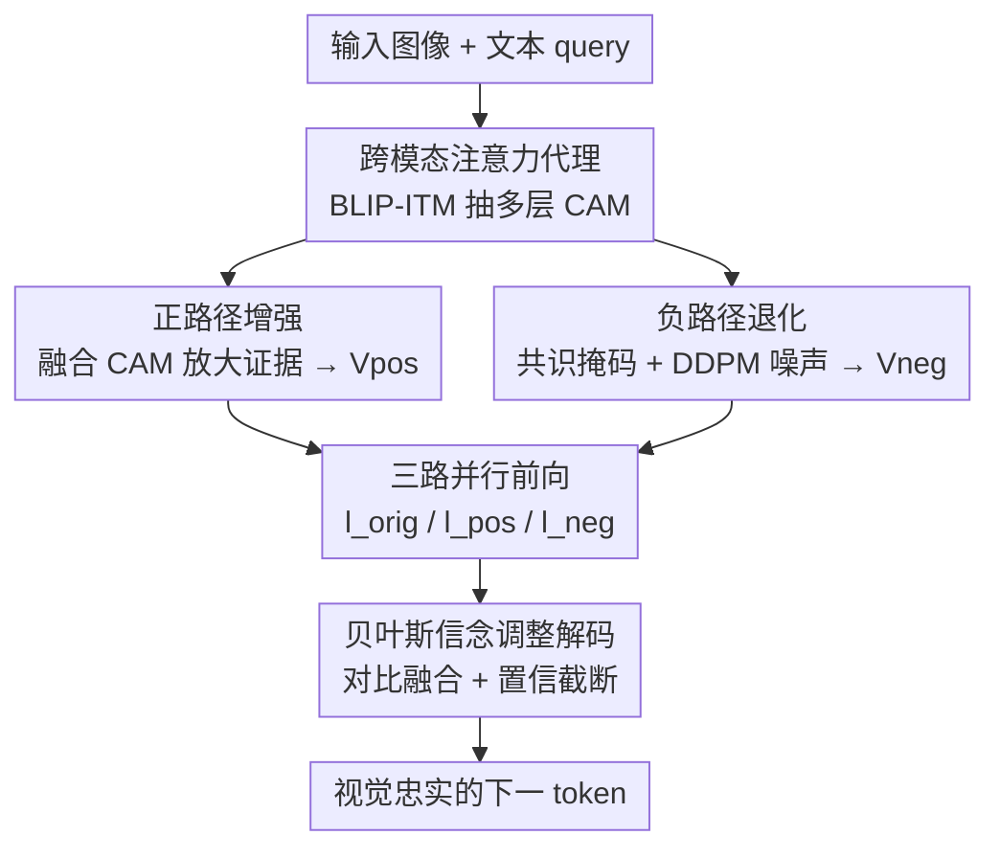

# Breaking the Illusion: When Positive Meets Negative in Multimodal Decoding

**会议**: CVPR 2026  
**arXiv**: [2605.06679](https://arxiv.org/abs/2605.06679)  
**代码**: https://github.com/JiangYubo4399/PND (有)  
**领域**: 多模态VLM / 幻觉抑制 / 推理时解码  
**关键词**: 物体幻觉, 对比解码, 跨模态注意力, 贝叶斯信念调整, 训练无关

## 一句话总结
针对视觉语言模型（VLM）"过度依赖语言先验、忽视视觉证据"导致的物体幻觉，本文提出训练无关的 Positive-and-Negative Decoding（PND）：用外部 BLIP 跨模态注意力定位视觉证据区域，构造"放大证据"的正路径和"抹除证据、暴露先验"的负路径，在每步解码时对三路 logits 做对比融合，把生成拉向视觉事实，POPE 上准确率最高提升 6.5%。

## 研究背景与动机
**领域现状**：现代 VLM（LLaVA、InstructBLIP、Qwen-VL 等）把预训练视觉编码器通过轻量 adapter 接到强大的 LLM 上，借助视觉指令微调获得了出色的多模态对话能力，已成为主流范式。

**现有痛点**：这类模型频繁产生**物体幻觉**——描述图中不存在的物体（false positive / 幻造），或对明明存在的物体视而不见（false negative / 遗漏）。根因是模型继承了 LLM 庞大的参数化知识，强语言先验很容易压过真实视觉证据。

**核心矛盾**：作者把幻觉刻画为一种**贝叶斯推理失衡**。VLM 的生成由两股力量竞争决定：语言先验 $p(y\mid x_t)$（预训练学到的词-概念共现偏置）和视觉似然 $p(x_v\mid y)$（图像证据约束），即 $p(y\mid x_v,x_t)\propto p(y\mid x_t)\cdot p(x_v\mid y)$。当生成变得"先验主导"时就产生幻觉。更关键的实证发现是：跨模态注意力存在**注意力赤字**——视觉 patch 在浅层只拿到约 13.7% 的注意力预算，到中层降到 6.2%、深层只剩 4.9%，深层几乎完全被用户指令和系统提示占据，说明视觉似然随层数被系统性低估。

**现有方法的不足**：以 VCD 为代表的推理时对比解码只做**单路扰动**——把图像整体加噪/破坏，再压低那些"扰动前后不变"的 token。问题有二：扰动过猛会连关键语义一起删掉，反而破坏 grounding；而且它是单向破坏性路径，对本就微弱的真实物体（如 frisbee）会进一步压制，无法从证据丢失中恢复，导致模型继续否认其存在。这类方法既不放大证据，也无法干净地隔离语言先验。

**核心 idea**：与其只用一路破坏性扰动，不如**对称地两路出击**：一路放大视觉证据（抬高似然），一路精准抹除最小证据（隔离先验），在解码时对比两路输出，对幻觉施加双向压力，把生成同时推向"有视觉支撑"且远离"先验臆造"。

## 方法详解

### 整体框架
PND 是一个推理时（inference-only）、即插即用、无需重训的解码框架。给定一张输入图像和文本 query，它先用外部视觉语言模型 BLIP-ITM 抽取多层跨模态注意力图，估计"视觉证据落在哪些 patch"；据此构造两个被修改过的视觉表示——**正视图** $\mathbf{V}_{\mathrm{pos}}$（放大证据）和**负视图** $\mathbf{V}_{\mathrm{neg}}$（抹除证据）；把原图、正视图、负视图分别送进同一个 VLM 得到三组 logits（$\mathbf{l}_{\mathrm{orig}}, \mathbf{l}_{\mathrm{pos}}, \mathbf{l}_{\mathrm{neg}}$）；最后用一个"信念调整"目标把三路对比融合成最终的下一 token 分布。核心直觉：真正依赖视觉似然的 token 在正负视图间会剧烈漂移，而先验主导（幻觉）的 token 对视觉扰动几乎不敏感——这个漂移就是区分"视觉事实"和"语言臆造"的信号。

### 关键设计

**1. 跨模态注意力代理：用外部 BLIP 注意力把"证据"和"上下文"拆开**

要干预幻觉，先得知道"哪里是视觉证据、哪里是会强化语言先验的上下文"，但直接把 VLM 隐特征显式分解成似然项和先验项是不可解的。作者的做法是借一个**外部**视觉语言模型 BLIP-ITM 当可微、架构无关的代理：用文本 query $\mathbf{Q}_{\text{text}}$ 和视觉 key $\mathbf{K}_{\text{vis}}$ 在第 $i$ 层算注意力图 $\mathbf{A}_i=\mathrm{softmax}\!\left(\mathbf{Q}_{\text{text}}(\mathbf{K}_{\text{vis}}^{(i)})^{\top}/\sqrt{d_k}\right)$。这些注意力图量化了"query 和哪些视觉 patch 相关"，从而估计证据所在。之所以这么设计，是因为作者发现 CAM 跨层有系统性规律：浅层聚焦细粒度物体区域，深层转向全局语义、视觉占比骤降（13.7%→6.2%→4.9%），这正对应"似然随深度衰减、先验随深度累积"的失衡。用外部模型而非被干预 VLM 自身的注意力，好处是与被增强模型解耦、对任意 VLM 架构通用

**2. 正路径增强：把被低估的视觉似然显式放大回来**

针对注意力赤字这个痛点，正路径直接把证据区域"调亮"。它先把多层归一化注意力图融合成显著图 $\mathbf{M}_{\mathrm{fused}}=\frac{1}{L}\sum_{i=1}^{L}\hat{\mathbf{A}}_i$，凸显模型隐式关联到 query 的区域（即贝叶斯解读里的证据成分）；再用乘性调制放大这些区域：$\mathbf{V}_{\mathrm{pos}}=\mathbf{V}_{\mathrm{orig}}\odot(1+\lambda\cdot\mathbf{M}_{\mathrm{fused}})$，其中 $\lambda$ 控制放大强度、$\odot$ 是逐元素缩放。关键点在于这个操作**不改变图像语义**，只是逐步抬高证据特征的相对显著性，从而鼓励模型在解码时更忠实地反映视觉似然。它直接对冲了"深层视觉注意力几乎为零"的缺陷，相当于把模型本该看却没看够的地方重新喂回去

**3. 负路径退化：只抹掉最小证据，干净地暴露语言先验**

负路径要造一个反事实视觉输入，把语言先验**单独**逼出来。难点是：深层本就只有约 4.9% 注意力给视觉，整体加噪既浪费又会误伤有用先验。作者的做法是**只移除多层 CAM 共识认定的最小证据**。先取各层归一化注意力图的逐像素最小值得到共识图 $\mathbf{M}_{\mathrm{consensus}}=\min(\hat{\mathbf{A}}_1,\ldots,\hat{\mathbf{A}}_L)$（软交集，是对证据区的保守估计），再阈值化成二值掩码 $\mathbf{M}_{\mathrm{mask}}=\mathbb{I}[\mathbf{M}_{\mathrm{consensus}}\geq\tau]$。退化方式不用高斯噪声，而是用 **DDPM 前向加噪**：$\mathbf{V}_{\mathrm{noise}}=\sqrt{\bar{\alpha}_T}\,\mathbf{V}_{\mathrm{orig}}+\sqrt{1-\bar{\alpha}_T}\,\boldsymbol{\epsilon}$，因为 DDPM 腐蚀得到的是**分布上仍合理、语义对齐**的特征，避免高斯噪声那种"模型一看就忽略"的离群伪影。最后只在掩码区域替换：$\mathbf{V}_{\mathrm{neg}}=\mathbf{V}_{\mathrm{orig}}\odot(1-\mathbf{M}_{\mathrm{mask}})+\mathbf{V}_{\mathrm{noise}}\odot\mathbf{M}_{\mathrm{mask}}$。这样保留了大部分视觉信息和有用先验，却把模型"还在依赖"的那一点视觉证据掐断，强迫解码几乎完全依赖 $p(y\mid x_t)$，从而把先验驱动的幻觉倾向暴露出来——这正是 VCD 单路破坏做不到的"精准隔离"

**4. 贝叶斯信念调整解码：三路对比 + 置信截断**

有了 $\mathbf{V}_{\mathrm{orig}}, \mathbf{V}_{\mathrm{pos}}, \mathbf{V}_{\mathrm{neg}}$，三路并行前向得到 $\mathbf{l}_{\mathrm{orig}}, \mathbf{l}_{\mathrm{pos}}, \mathbf{l}_{\mathrm{neg}}$，PND 用对比更新把它们合成：$\mathbf{l}_{\mathrm{PND}}=\mathbf{l}_{\mathrm{orig}}+\alpha\,\mathbf{l}_{\mathrm{pos}}-\gamma\,\mathbf{l}_{\mathrm{neg}}$，其中 $\alpha,\gamma\geq 0$ 是平衡系数。正项抬高有视觉支撑的候选，负项压制"没有视觉支撑却仍存活"的先验驱动 token，两边对称施压恰好对应贝叶斯分解的两个因子。为避免引入不合理候选，再做一次置信截断，只保留在原分布下足够可信的 token：$\mathbf{l}_{\mathrm{final}}=\mathbf{l}_{\mathrm{PND}}\odot\mathbb{I}[\mathbf{l}_{\mathrm{orig}}\geq\log(\beta)+\max(\mathbf{l}_{\mathrm{orig}})]$，$\beta$ 为置信阈值，最后对 $\mathbf{l}_{\mathrm{final}}$ 做 softmax 得到下一 token 分布。这一步把前两路构造的视觉证据信号真正落到 token 选择上，是整个框架的"会师"点

### 损失函数 / 训练策略
PND **完全训练无关**，没有任何可学习参数和反向传播。代价是推理时三路并行前向 + 一次 BLIP 注意力抽取带来的开销，作者称这比训练类方法（RLHF / 数据集 / 改架构）轻得多，可在需要更高可靠性时按需开启。关键超参为放大系数 $\lambda$、平衡系数 $\alpha,\gamma$、置信阈值 $\beta$、掩码阈值 $\tau$ 和 DDPM 噪声级 $T$；主实验全程用固定超参。

## 实验关键数据

### 主实验
评测覆盖 4 个互补 benchmark：POPE（Yes/No 物体级幻觉）、MME（感知与属性级能力）、CHAIR（开放式描述幻觉）、GCCCE（作者自建，GPT-4.1 当裁判评 Relevancy/Accuracy/Common Sense/Fine-grained Precision）。骨干涵盖 LLaVA、InstructBLIP、InternVL、Qwen-VL。

POPE 主结果（节选，对比 baseline 与 VCD / VAF / AGLA）：

| 模型 | 子集 | 方法 | Accuracy | F1 |
|------|------|------|----------|-----|
| LLaVA1.5-7B | adversarial | regular | 78.53 | 77.04 |
| LLaVA1.5-7B | adversarial | AGLA | 83.13 | 82.21 |
| LLaVA1.5-7B | adversarial | **PND** | **84.03** | **83.48** |
| LLaVA1.5-7B | popular | regular | 81.56 | 84.87 |
| LLaVA1.5-7B | popular | **PND** | **86.10** | **88.79** |
| LLaVA1.5-7B | random | **PND** | **87.33** | **93.41** |
| InstructBLIP-7B | random | regular | 81.10 | 80.70 |
| InstructBLIP-7B | random | **PND** | **87.63** | **86.73** |

作者报告 POPE 上相对贪心解码 baseline 平均提升 6.4% Accuracy、5.5% F1，且在 popular / adversarial 这两个专门用强但错误的语言先验诱发幻觉的子集上增益最大，直接验证"PND 在压制过载语言先验"的假设。跨 7B/13B、跨 LLaVA/InstructBLIP/Qwen-VL/InternVL 架构一致提升，说明它是模型无关的解码增强而非架构特定 trick。

MME 上（Tab. 2）PND 不仅在物体级（Existence、Count）刷新 SOTA，在细粒度属性（Position、Color）也提升明显，如 LLaVA1.5-7B 总分从 531.67（regular）/608.67（AGLA）升到 **621.67**，InternVL2-2B 从 450.00 大幅升到 **530.00**，说明它是整体性的视觉保真增强而非有副作用的窄修复。CHAIR 上（Tab. 3）幻觉指标显著下降：LLaVA1.5-7B 的 $\mathcal{C}_s$ 从 51.0 降到 **46.0**、$\mathcal{C}_i$ 从 17.6 降到 **14.0**，同时 Recall 不降反升（74.4→78.1），印证负路径"惩罚缺乏视觉支撑的物体 token"的有效性。

### 消融实验
在 POPE 上拆解正负双路（Tab. 4，LLaVA1.5-7B adversarial）：

| 配置 | Accuracy | F1 | 说明 |
|------|----------|-----|------|
| Baseline（仅 Original） | 78.53 | 77.04 | 贪心解码 |
| + Positive only | 83.14 | 82.21 | 只放大视觉似然 |
| + Negative only | 82.23 | 80.67 | 只惩罚语言先验 |
| Original + Positive | 83.60 | 82.35 | 双视图组合 |
| **Full PND（三路）** | **84.03** | **83.48** | 完整模型 |

### 关键发现
- **双路是强协同而非冗余**：P-only 和 N-only 单独都明显超 baseline（+4.6 / +3.7 Accuracy），但完整 PND 还能进一步超过两者。正路径当"增强器"补充有据细节，负路径当"压制器"约束臆造内容，两者互补才同时拿到忠实度和描述丰富度。
- **越是"先验陷阱"子集增益越大**：popular / adversarial 子集本就是用似是而非的语言先验诱发幻觉，PND 在这里提升最猛，反向印证它确实在纠正过载先验。
- **超参敏感性**：性能对控制贝叶斯调整强度的 $\alpha$–$\gamma$ 权衡最敏感，$\beta$ 影响较温和；近确定性解码（低 temperature）下视觉 grounding 最强。

## 亮点与洞察
- **把幻觉重写成贝叶斯失衡**：用 $p(y\mid x_v,x_t)\propto p(y\mid x_t)\cdot p(x_v\mid y)$ 把"语言先验 vs 视觉似然"显式拆开，再用注意力赤字的实测数据（13.7%→4.9%）坐实"似然随深度被低估"，让整套干预有了清晰的因果故事，而不是经验调参。
- **双路对称对比**优于单路破坏：VCD 类只会越扰越糟、无法恢复弱证据；PND 一路放大一路精准抹除，对幻觉施加双向压力，这种"正负会师"的对称设计是最 aha 的点。
- **DDPM 加噪当反事实**很巧：用扩散前向噪声替代高斯噪声，得到分布合理、语义对齐的腐蚀特征，避免模型对离群伪影"免疫"，让负路径的反事实真正起作用——这个 trick 可迁移到任何需要"语义合理扰动"的对比解码场景。
- **外部 BLIP 注意力当架构无关代理**：不碰被增强 VLM 自身权重，纯靠外部模型定位证据，因此能即插即用到 LLaVA/Qwen-VL/InternVL 等异构架构，工程上很轻。

## 局限与展望
- **推理开销增加**：每步要三路并行前向 + BLIP 注意力抽取，作者自己也承认引入了"modest overhead"，实时性场景需权衡（虽远低于训练类方法）。
- **依赖外部模型质量**：证据定位全靠 BLIP-ITM 的跨模态注意力，若 BLIP 对某些 query/图像定位不准，正负视图都会被带偏；论文未充分讨论这种失败模式。
- **超参敏感**：性能对 $\alpha$–$\gamma$ 权衡敏感，主实验虽用固定超参，但跨数据集/任务是否需要重调、鲁棒性边界如何，正文未给完整答案（细节挪到补充材料）。
- **GCCCE 自建 + GPT-4.1 当裁判**：高层语义一致性评测用自家 benchmark 和 LLM judge，存在评测循环与可复现性顾虑，结论需谨慎看待。⚠️ 部分公式细节（如 token 级证据权重）原文挪到补充材料，正文只给概述，以原文为准。

## 相关工作与启发
- **vs VCD（Visual Contrastive Decoding）**：VCD 做单路视觉扰动、压低扰动不变的 token，但破坏性强、会误伤弱证据且无法恢复。PND 改成正负双路——既放大证据又精准隔离先验，对称施压，在 POPE/CHAIR 上全面超过 VCD。
- **vs AGLA（全局+局部注意力组装）**：AGLA 靠注意力重组缓解幻觉、是 PND 的强 baseline。PND 在多数 POPE 设置和 MME 总分上反超 AGLA（如 LLaVA MME 621.67 vs 608.67），且机制上多了"负路径反事实"这条压制先验的通道。
- **vs 训练类方法（RLHF / 数据集 / 改架构）**：训练类虽有效但算力贵、易损伤其他多模态能力。PND 训练无关、即插即用，代价只是推理时开销，适合在需要高可靠性时按需启用。

## 评分
- 新颖性: ⭐⭐⭐⭐ 贝叶斯失衡视角 + 正负双路对称对比 + DDPM 反事实，组合新颖、故事自洽，但单看每个组件都有前作影子。
- 实验充分度: ⭐⭐⭐⭐ 4 个 benchmark、4 类骨干、7B/13B 多尺度，消融清晰；但部分关键细节与效率分析挪到补充材料、GCCCE 为自建。
- 写作质量: ⭐⭐⭐⭐ 贝叶斯框架贯穿全文、动机到方法推导顺畅，注意力赤字数据支撑有力。
- 价值: ⭐⭐⭐⭐ 训练无关、即插即用、跨架构通用，对落地缓解 VLM 物体幻觉很实用。

<!-- RELATED:START -->

## 相关论文

- [\[CVPR 2026\] Illusion-Aware Visual Preprocessing and Anti-Illusion Prompting for Classic Illusion Understanding in Vision-Language Models](illusion-aware_visual_preprocessing_and_anti-illusion_prompting_for_classic_illu.md)
- [\[CVPR 2026\] When to Think and When to Look: Uncertainty-Guided Lookback](when_to_think_and_when_to_look_uncertainty-guided_lookback.md)
- [\[CVPR 2026\] Breaking Multimodal LLM Safety via Video-Driven Prompting](breaking_multimodal_llm_safety_via_video-driven_prompting.md)
- [\[CVPR 2026\] Breaking the Regional Perception Bottleneck of Multimodal Large Language Models via External Reasoning Framework](breaking_the_regional_perception_bottleneck_of_multimodal_large_language_models_.md)
- [\[ICLR 2026\] ICYM2I: The Illusion of Multimodal Informativeness under Missingness](../../ICLR2026/multimodal_vlm/icym2i_the_illusion_of_multimodal_informativeness_under_missingness.md)

<!-- RELATED:END -->
