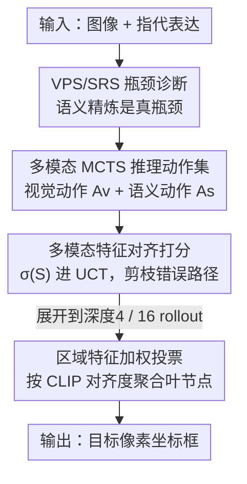

# Breaking the Regional Perception Bottleneck of Multimodal Large Language Models via External Reasoning Framework

**会议**: CVPR 2026  
**论文**: [CVF Open Access](https://openaccess.thecvf.com/content/CVPR2026/html/Zhang_Breaking_the_Regional_Perception_Bottleneck_of_Multimodal_Large_Language_Models_CVPR_2026_paper.html)  
**代码**: 无  
**领域**: 多模态VLM  
**关键词**: 区域感知, 视觉定位, 多模态MCTS, 推理扩展, 特征对齐  

## 一句话总结
本文先剖出多模态大模型（MLLM）做像素级定位（grounding）的真瓶颈不在"看清区域"而在"把区域翻译成坐标"的语义精炼阶段，再用一套基于多模态蒙特卡洛树搜索（MCTS）的外置推理框架 R-Ground，把算力定向投到该阶段，让 7B 模型在 RefCOCO 系列上反超 72B。

## 研究背景与动机
**领域现状**：MLLM 从"对整张图做 QA"进化到"对图中具体区域做细粒度感知"，其中最难的就是 grounding——给一句话描述，输出目标的像素坐标框。主流做法有两类：一类给 MLLM 深层特征接一个回归 decoder（如 LLaVA-Grounding、GLaMM），定位准但破坏了端到端生成范式、还要额外训练 decoder；另一类是纯 MLLM 直接用自然语言"说出"坐标文本（如 Shikra、Ferret、Qwen-VL），保持端到端但精度上不去。

**现有痛点**：第二条路线沿用了 LLM 的老办法——堆参数、堆数据来 scaling。但实测发现，grounding 任务上的收益远小于普通 QA 任务：Qwen2.5-VL 从 7B 放大到 72B，RefCOCO+ 的 val 也才从 84.2 涨到 88.9。投入巨大、回报微薄，说明"无脑放大整模型"没打到要害。

**核心矛盾**：作者做了一个关键的表征分析（第 3 节），发现 LM decoder 在处理多模态信息时会自然分成两段——浅层是**视觉感知阶段（VPS）**，把区域信息持续强化进隐状态；深层是**语义精炼阶段（SRS）**，把视觉表征映射成坐标文本。两个现象很关键：(1) **PSR（Perception-to-Semantics Refinement）**——用每层隐状态与目标区域特征的余弦相似度衡量，相似度先升后降，降到低于首层即认为模型对目标失去注意力，这个拐点就是 VPS↔SRS 边界；(2) **SDSG（Semantics-Dominated Scaling Gap）**——把各层隐状态喂给一个 DETR decoder 测检测性能，发现 7B 和 72B 在 VPS 段几乎打平（grounding setting 下最佳性能差仅 1.6%），差距全在 SRS 段拉开（末层差 13.4%）。

**本文目标**：既然不同规模模型在"看区域"上能力相当、差距全在"精炼成语义"这一段，那就别再均匀放大整个模型（白白浪费算力在 VPS 上），而要**只对 SRS 做定向 scaling**。

**切入角度**：常规 CoT 用固定模板，无法动态强化某个推理阶段；而作者注意到——"任务设定（task setting）本身能引导 MLLM 把有效算力导向某个阶段"（REG setting 下 SRS 来得比 grounding setting 早得多）。于是把"选什么任务设定、走哪条推理路径"交给一个会自我演化的搜索算法去探索。

**核心 idea**：用一套多模态 MCTS 推理框架，在推理时（test-time）把计算定向扩展到语义精炼阶段——不改 MLLM 权重，靠精心设计的推理动作集 + 多模态对齐打分 + 加权投票，把一个 7B 模型的定位能力推到 72B 之上。

## 方法详解

### 整体框架
R-Ground 是一个**外置（external）、test-time 的推理框架**，不微调 MLLM 本体。输入是一张图 + 一句指代表达（referring expression），输出是目标的像素坐标框。它把 grounding 问题 $X$ 拆成一棵搜索树 $T$：每个节点是一个状态 $S$，由某个推理动作 $A$ 在特定 task setting 下生成，节点串成生成路径 $P = X \oplus S_1 \oplus S_2 \oplus \dots \oplus S_c$。

整条 pipeline 三步走：(1) 用一个**动作集**（视觉主导 $A_v$ + 语义主导 $A_s$）在 MCTS 里展开搜索树，靠"语义动作多于视觉动作"的配比，把推理重心压向 SRS；(2) 在节点选择时，把**多模态特征对齐分** $\sigma(S)$ 加进标准 UCT，让搜索更稳、并能提前剪掉错误路径；(3) 树建完后，对所有合法叶节点用**区域特征加权投票**聚合出最终框。MCTS 深度设 4、rollout 设 16。

### 关键设计

**1. 多模态 MCTS 推理动作集：用动作配比把算力压向语义精炼**

针对"常规 scaling 把算力浪费在 VPS、没增强 SRS"这个根因，R-Ground 不去改模型，而是设计一组推理动作，让 MLLM 在自我探索中多走语义精炼。动作分两类：**视觉主导动作 $A_v$**（grounding setting，强化看区域）和**语义主导动作 $A_s$**（REG setting，强化把区域精炼成描述）。具体五个动作各司其职：$A_v^1$ 全局定位（带历史路径上下文在全图找目标，借历史信息平衡 VPS/SRS 配比）；$A_v^2$ 局部定位（只在上一步 $A_v$ 框出的区域内再定位，抑制把框画得过大的幻觉，仅在已执行过 $A_v$ 的路径上触发）；$A_s^3$ 无位置信息的目标状态判断（把路径里所有坐标信息 mask 掉，纯靠文本线索判断目标是否存在，不存在就**直接终止该路径**避免后续低质状态）；$A_s^4$ 有位置信息的目标状态判断（把最近的框叠到图上看内容是否匹配目标，不匹配则终止路径）；$A_s^5$ 目标描述重建（聚合当前路径上所有文本描述 + 位置信息，重写一版更精确的目标描述，后续步骤只保留这版最新描述 + 最近的 $A_v$ 定位）。

设计上**故意让语义动作多于视觉动作**——这正是"定向增强 SRS"的落点；同时定义明确的子节点生成规则保证路径 $P$ 连续：只有视觉主导动作能产生合法叶节点（因为最终要输出框），但每条路径被约束保留足够多的语义精炼动作。这跟固定模板的 CoT 的本质区别是：MCTS 能自适应地在"再看一眼"和"再精炼一下描述"之间动态切换，而不是线性走一条死板的链。

**2. 多模态特征对齐打分：把单模态的"反复采样投票"换成跨模态对齐分**

纯文本 MCTS（如 rStar 等）算节点质量 $Q(S,A)$ 时要靠在同一节点反复采样、比对多条回答的一致性——开销极大。R-Ground 指出：多模态场景天然有"图—文是否对得上"这个跨模态参照，可以直接用它替代反复采样。具体把对齐分 $\sigma(S)$ 加进标准 UCT：

$$UCT^{*}(S,A) = \frac{N_c(S)}{N(S)} + \varphi \cdot \sqrt{\frac{\ln N_{parent}(S)}{N(S)}} + \lambda \cdot \sigma(S)$$

其中 $\sigma(S)$ 定义为分段函数，$Clip(v,l)$ 是用 CLIP 算的视觉 $v$ 与文本 $l$ 的匹配度，$\lambda$ 控制对齐分对 UCT 的影响：

$$\sigma(S) = \begin{cases} 1 - \dfrac{1}{1 + Clip(v,l)}, & 0 < Clip(v,l) \le 1, \\[4pt] \ln(1 + Clip(v,l)), & -1 \le Clip(v,l) \le 0. \end{cases}$$

当跨模态正相关（$Clip(v,l)>0$）时 $\sigma$ 平滑上升、鼓励探索这条路；负相关时 $\sigma$ 急剧趋向负无穷，**截断（truncate）后续路径生成**，既剪掉错误候选又省算力。打分对象按动作类型区分：视觉动作 $A_v$ 算"原始目标描述"与"路径上最后一个框对应图像区域"的对齐；语义动作 $A_s$ 算"路径上第一个框对应区域"与"最新目标描述"的对齐。这一步把 UCT 从"靠重复采样估计"变成"靠跨模态一致性估计"，是稳定多模态搜索的关键。

**3. 区域特征加权投票：用图—文对齐度给候选框加权，替代多数投票**

树建完后要从所有合法叶节点里选最终答案。单模态 MCTS 几乎都用多数投票（majority voting），或依赖一个额外 LLM 打分，结果质量高度依赖那个外挂模型。R-Ground 改成按区域特征对齐度加权：

$$w_i = \alpha \cdot \frac{Clip(v_i, l_i)}{\sum_j Clip(v_j, l_j)} + (1-\alpha) \cdot \frac{Clip(v_i, l_i')}{\sum_j Clip(v_j, l_i')}$$

其中 $w_i$ 是第 $i$ 个候选解的权重，$v_i$ 是最终图像区域，$l_i$ 是原始描述、$l_i'$ 是（经 $A_s^5$）重建后的精炼描述，$\alpha \in [0,1]$ 平衡两者影响。作者点出一个细节：有些原始描述过于抽象（如"最接近 1:45 的钟"），这时调大 $l_i'$（重建描述）的权重更能选出正确解。在 grounding 任务里，这个 $w_i$ 直接作为框合并（如 NMS）的输入来产出最终检测框。相比多数投票，加权投票显著降低了误选概率——RefCOCO+ 平均从 86.36 升到 91.93。

### 一个完整示例
以图中"最接近 1:45 PM 的钟"为例（论文 Fig.4）：根节点用 $A_v^1$ 全局定位先框出一个黄色三角钟（bbox [53,418,252,573]），$A_s^4$ 叠框判断"显示 1:52，不是目标"——若纯按位置判断会误终止；另一条路径用 $A_s^3$ 无位置判断"图中存在两个接近 1:45 的钟：黄色三角钟 + 黑三角加黄圆的钟"，再用 $A_s^5$ 把描述重建为"指向 1:45、由黑三角和黄圆组成的钟"，最后用 $A_v^2$ 在对应区域局部定位。多条路径并行展开，各叶节点的框按 $w_i$（原始描述 + 重建描述的 CLIP 对齐加权）投票，重建描述帮助从抽象的"最接近 1:45"中锁定真正目标，最终输出正确框。这正体现了 MCTS 相比线性 CoT 的优势：错误分支被 $\sigma(S)$ 提前截断、正确语义在重建中逐步收敛。

## 实验关键数据

### 主实验
三个指代定位基准 RefCOCO / RefCOCO+ / RefCOCOg，指标 AP@0.5。R-Ground 基于 Qwen2.5-VL-7B，反超同系列 72B，甚至超过专家模型和其他推理框架。

| 方法 | RefCOCO+ Val | RefCOCOg Test | 八项平均 |
|------|------|------|------|
| Qwen2.5-VL 7B（基座） | 84.2 | 87.2 | 86.56 |
| Qwen2.5-VL 72B（参数 scaling） | 88.9 | 90.3 | 90.25 |
| InternVL3-78B | 90.1 | 91.5 | 91.41 |
| UniVG-R1（推理框架） | 85.91 | 88.56 | 88.20 |
| **R-Ground (Qwen2.5-VL-7B)** | **91.67** | 93.16 | **92.93** |
| **R-Ground (Qwen3-VL-8B)** | **93.45** | **93.21** | **94.47** |

关键点：7B + R-Ground（92.93）比 72B 参数 scaling（90.25）还高 2.68，验证了"瓶颈在 SRS、定向推理 scaling 比参数 scaling 更划算"的核心论断；在 Qwen2.5-VL 和 Qwen3-VL 两套坐标格式不同的模型上都有效，说明可迁移。

### 消融实验
全在 RefCOCO+（无空间提示、最考验多模态对齐与推理）上做。

| 配置 | RefCOCO+ Val | TestB | 说明 |
|------|------|------|------|
| 仅 $A_v^1+A_v^2$（≈Visual-CoT） | 85.63 | 75.45 | 纯视觉收缩框 |
| 仅 $A_v^1+A_s^3$（≈Semantic-CoT） | 89.47 | 82.32 | 纯语义精炼描述 |
| $A_v^1+A_s^3+A_s^5$ | 90.12 | 84.98 | 加描述重建 |
| $A_v^1+A_s^3+A_s^4+A_s^5$ | 90.68 | 87.63 | 再加带位置判断 |
| 全动作集（R-Ground） | **91.67** | **89.97** | 完整 |
| w/o 对齐打分 | 90.89 | 87.02 | UCT 去掉 σ(S)，FLOPs 反升至 87.23T |
| w/ 对齐打分 | **91.67** | **89.97** | FLOPs 降到 45.89T |
| 多数投票 | 86.23 | 82.45 | 平均仅 86.36 |
| 加权投票 | **91.67** | **89.97** | 平均 91.93 |

### 关键发现
- **语义动作比视觉动作更关键**：只加视觉动作（Visual-CoT 85.63）远不如加语义动作（Semantic-CoT 89.47），直接佐证"瓶颈在语义精炼"；动作集越完整性能越高，TestB（最难子集）从 75.45 一路涨到 89.97。
- **对齐打分是"双赢"**：加上 $\sigma(S)$ 不仅精度升（90.89→91.67），FLOPs 反而几乎砍半（87.23T→45.89T）——因为它能提前截断错误路径，少生成无效候选。这是少见的"更准且更省"。
- **加权投票贡献巨大**：从多数投票换成加权投票，RefCOCO+ 平均直接跳 5.57（86.36→91.93），说明在 MCTS 候选变多、仍有残余错误框时，靠图—文对齐度筛选比单纯数票靠谱得多。
- **超参边际效应早现**：区域感知所需推理深度远浅于数学推导这类复杂 QA，深度/rollout 加大收益很快饱和却成倍涨算力，故取 depth=4、rollout=16 平衡。

## 亮点与洞察
- **先诊断后开方**：PSR + SDSG 两个表征分析把"grounding scaling 不灵"的病因精确定位到 SRS，方法（定向 scaling SRS）是诊断的自然推论，逻辑闭环漂亮。这种"用机制分析驱动方法设计"的范式可迁移到任何"scaling 不成比例"的多模态任务。
- **把多模态当资源而非负担**：单模态 MCTS 视"多次采样估计一致性"为必要开销，本文反过来用 CLIP 跨模态对齐分**替代**反复采样——一个 $Clip(v,l)$ 既是打分器又是剪枝器又是投票权重，三处复用，省算力还提精度。
- **test-time、零训练、即插即用**：不微调 MLLM 本体，纯外置推理框架就让 7B 反超 72B，且在两套不同坐标格式的模型上都生效，工程上很有吸引力。

## 局限与展望
- **依赖 CLIP 对齐质量**：$\sigma(S)$ 和投票权重全建立在 CLIP 的图—文匹配度上，对 CLIP 本身难分辨的细粒度/小目标场景，剪枝和投票可能误判（论文未深入讨论 CLIP 失效时的退化行为）⚠️。
- **推理开销仍高于单次前传**：即便对齐剪枝把 FLOPs 砍到 45.89T，相比基座直接推理仍是数十倍的 test-time 成本，深度/rollout 一旦调大成本陡增，落地需权衡。
- **评测局限于 RefCOCO 系**：只在三个指代定位基准上验证，对开放词表检测、密集场景、多目标 grounding 的泛化未测。
- **改进思路**：可探索用更强的区域级对齐模型（而非通用 CLIP）做打分；或把"哪些样本值得开 MCTS"做成自适应门控，简单样本走单次前传、难样本才展开树，进一步省算力。

## 相关工作与启发
- **vs 回归 decoder 路线（LLaVA-Grounding / GLaMM / Ferret-v2）**：它们给 MLLM 接专门回归头，定位准（Ferret-v2-13B 平均 89.58）但破坏端到端、要额外训练；R-Ground 不接 decoder、不训练本体，纯靠 test-time 推理把 7B 推到 92.93，保持生成范式。
- **vs 参数/数据 scaling（Qwen-VL / InternVL 系）**：它们均匀放大整模型，算力大量浪费在 VPS；本文证明定向 scaling SRS 更高效——7B+R-Ground 反超 72B 参数 scaling。
- **vs 线性推理框架（Visual-CoT / Semantic-CoT / UniVG-R1）**：CoT 走固定模板的线性链，无法动态平衡视觉感知与语义精炼；R-Ground 用 MCTS 自适应在两阶段间切换，RefCOCO+ TestB 上比 Semantic-CoT 高 7.65（82.32→89.97）。
- **vs 单模态 MCTS（rStar 等）**：它们靠多次采样估 $Q$、用多数投票选解；R-Ground 用跨模态对齐分替代采样、用加权投票替代多数投票，更稳更省。

## 评分
- 新颖性: ⭐⭐⭐⭐⭐ 把"瓶颈在语义精炼"的机制诊断与多模态 MCTS 定向 scaling 结合，视角和方法都新
- 实验充分度: ⭐⭐⭐⭐ 三基准 + 多消融 + 跨基座验证充分，但只限指代定位、未测更广 grounding 场景
- 写作质量: ⭐⭐⭐⭐⭐ 诊断→方法→实验逻辑闭环，PSR/SDSG 分析清晰有说服力
- 价值: ⭐⭐⭐⭐⭐ test-time 零训练让 7B 反超 72B，对区域感知落地有直接实用价值

<!-- RELATED:START -->

## 相关论文

- [\[CVPR 2026\] DiG: Differential Grounding for Enhancing Fine-Grained Perception in Multimodal Large Language Models](dig_differential_grounding_for_enhancing_fine-grained_perception_in_multimodal_l.md)
- [\[CVPR 2026\] Perception Programs: Unlocking Visual Tool Reasoning in Language Models](perception_programs_visual_tool_reasoning.md)
- [\[CVPR 2026\] Grounding Everything in Tokens for Multimodal Large Language Models](grounding_everything_in_tokens_for_multimodal_large_language_models.md)
- [\[CVPR 2026\] Breaking Multimodal LLM Safety via Video-Driven Prompting](breaking_multimodal_llm_safety_via_video-driven_prompting.md)
- [\[CVPR 2026\] CADFS: A Big CAD Program Dataset and Framework for Computer-Aided Design with Large Language Models](cadfs_a_big_cad_program_dataset_and_framework_for_computer-aided_design_with_lar.md)

<!-- RELATED:END -->
