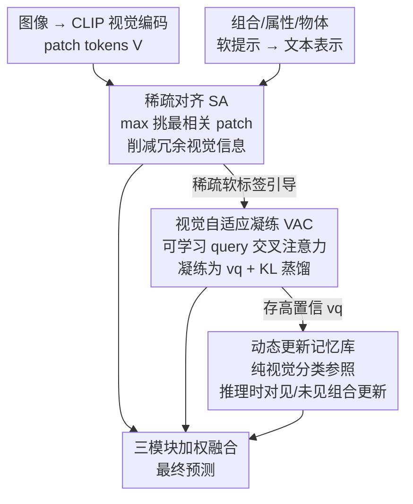

# Bridging the Modality Gap in Compositional Zero-Shot Learning via Sparse Alignment and Unimodal Memory Bank

**会议**: CVPR 2026  
**论文**: [CVF Open Access](https://openaccess.thecvf.com/content/CVPR2026/html/Zhang_Bridging_the_Modality_Gap_in_Compositional_Zero-Shot_Learning_via_Sparse_CVPR_2026_paper.html)  
**代码**: 未公开  
**领域**: 多模态VLM  
**关键词**: 组合零样本学习, 模态鸿沟, CLIP, 稀疏对齐, 记忆库  

## 一句话总结
针对组合零样本学习（CZSL）中 CLIP 固有的「模态鸿沟」，本文提出 SAM 三阶段框架——稀疏对齐挑出与文本最相关的图像 patch 以削减冗余视觉信息、视觉自适应凝练把关键线索压缩进单一表示、动态记忆库用纯视觉分类绕过模态鸿沟，在三个基准的闭世界/开世界设置上全面超越 CLIP-based 方法。

## 研究背景与动机
**领域现状**：组合零样本学习要求模型从见过的属性-物体组合（如 white swan、black cat）里学到属性和物体两类「基元（primitive）」，再泛化到没见过的组合（如 black swan）。近年主流做法都建立在 CLIP 的强跨模态对齐之上，通过增强视觉-文本对齐、基元解耦、优先级校准、语义挖掘等技巧来提升识别。

**现有痛点**：这些方法虽然性能强，却都继承了 CLIP 的一个根本缺陷——**模态鸿沟（modality gap）**。模态鸿沟指 CLIP 共享嵌入空间里图像嵌入和文本嵌入在几何上彼此分离，导致一张图的嵌入「和很多文本类别都差不多近」，而不是紧贴它对应的描述。在 CZSL 这种细粒度任务里尤其致命：显著属性很容易被周围环境污染（例如 Brown bear 和 Brown platform 都含「Brown」，模型会同时关注两者）。

**核心矛盾**：以往把模态鸿沟归因于对比损失或温度系数，但更近的证据指向更深层的原因——**训练图文对里的信息不平衡**。文本描述（caption）通常只写显著物体，而图像编码了远更丰富的细节；这种不匹配削弱了配对监督信号。而以往 CZSL 方法只用聚合了全局信息的 `[CLS]` token 当视觉表示、把输出的 patch tokens 直接丢掉，恰恰把过量冗余信息硬塞进了 `[CLS]`。

**切入角度**：作者做了一个先导实验——在输入端随机丢弃 patch tokens（Drop），让更少视觉信息汇聚到 `[CLS]`。结果发现：适中的丢弃率能同时提升 AUC（C-GQA 上 14.3→14.7）并缩小相对模态鸿沟 RMG，而 AUC 的提升与 RMG 的下降同步出现。这验证了「受控地削减视觉信息」是缓解模态失衡的有效策略。

**核心 idea**：用「直接把文本表示稀疏地对齐到语义最相关的图像 patch」来替代「依赖 `[CLS]` 全局 token」，在源头削减信息不平衡；再用自适应凝练补回被误删的有用信息，最后用纯视觉记忆库在推理时彻底绕过模态鸿沟。

## 方法详解

### 整体框架
SAM 把视觉表示从全局 `[CLS]` token 转向**输出端的 patch tokens**，分三个阶段递进解决模态鸿沟。输入是图像 $x$ 经 CLIP 视觉编码器得到的 token 序列 $V=[v_{\text{CLS}}, v_1, \dots, v_L]\in\mathbb{R}^{(L+1)\times D}$，以及属性/物体/组合的可学习软提示经文本编码器得到的表示 $t_a, t_o, t_c$；输出是组合的预测分布。

Stage I（稀疏对齐 SA）：对每个组合文本，用 max 操作从所有 patch 里挑出语义最相关的那个 token，得到一组稀疏选中的 patch，构成信息平衡的训练范式，快速把 CLIP 适配到属性-物体识别。Stage II（视觉自适应凝练 VAC）：因为 Stage I 的硬规则选择可能误删有用 patch，VAC 用一个可学习 query 通过交叉注意力把**所有** patch 的关键信息凝练成单一表示 $v_q$，并由 SA 输出的软标签蒸馏约束，做到「补回上下文信息但仍受削减后视觉信号管制」。Stage III（动态更新记忆库）：把 VAC 产出的高置信视觉表示存进记忆库，推理时对见过/未见组合都持续更新，提供**纯视觉**的分类参照，从根本上绕开跨模态对齐里的模态鸿沟。最终预测把三个模块的输出加权融合。

### 关键设计

**1. 稀疏对齐（SA）：用 max 挑 patch 替代 `[CLS]`，从源头削减视觉冗余**

痛点直白：`[CLS]` token 把全图信息（含无关上下文）一锅端，造成视觉端信息远多于文本标签，正是模态鸿沟的来源。SA 干脆不用 `[CLS]`，改在输出端用全部 patch。它先算所有 token 和「见过组合」文本表示 $T_c\in\mathbb{R}^{|C_s|\times D}$ 的相似度矩阵 $S=VT_c^\top\in\mathbb{R}^{(L+1)\times|C_s|}$（表示均做 $\ell_2$ 归一化），然后对每个组合 $c$ 用 max 取出语义最相关那一个 patch 的得分：

$$s_c = \max_{l=1}^{L+1} S_{l,c}, \quad c=1,2,\dots,|C_s|$$

得到的稀疏得分 $s\in\mathbb{R}^{|C_s|}$ 再重写分类目标 $p_{sa}(c_i|x)=\dfrac{\exp(s_i/\tau)}{\sum_k \exp(s_k/\tau)}$，对组合、属性、物体三路分别做交叉熵 $L_{base}=L_c+L_a+L_o$（属性/物体只需把 $T_c$ 换成 $T_a/T_o$）。

为什么有效：每个 patch 编码一个局部区域，「为每个文本只保留最相关的局部 token」既保住判别性特征又压掉冗余，自然形成视觉-文本的稀疏对齐。作者还做了验证——把 SA 与 `[CLS]` 按 $(1-W)\cdot SA + W\cdot[\text{CLS}]$ 混合，发现增大 `[CLS]` 占比反而掉点，说明 `[CLS]` 引入的过量信息会污染对齐；且只有约 25% 的 patch 呈现高类别激活，多数样本里命中标签的最高响应 token 来自 patch 而非 `[CLS]`。值得注意的是，SA **不做显式基元解耦**，直接对齐基元的文本表示，从而完整保留 CLIP 原生的跨模态对齐能力。

**2. 视觉自适应凝练（VAC）：补回 SA 误删的语义，并被 SA 蒸馏管住**

痛点：SA 的硬规则选择虽然平衡了信息，却可能把对模型至关重要的语义线索一并丢掉。VAC 用一个可学习 query embedding $q\in\mathbb{R}^{1\times D}$ 加 $K$ 个处理块（多头交叉注意力 + FFN），让 query **动态地从所有 token** 里聚合重要信息，不被单个 patch 限制，凝练出表示 $v_q$ 用于预测：$p_{vac}(c_i|x)=\dfrac{\exp(v_q\cdot t_c^i/\tau)}{\sum_k \exp(v_q\cdot t_c^k/\tau)}$，同样配基础损失 $L^{vac}_{base}=L^{vac}_c+L^{vac}_a+L^{vac}_o$。

关键在于不能让 VAC「放飞自我」把冗余又捡回来——所以引入 KL 蒸馏，让 VAC 的分布对齐 SA 的削减后分布：

$$L_{kl} = -\frac{1}{|D_{tr}|}\sum_{x\in D_{tr}} p_{vac}\log\frac{p_{vac}}{p_{sa}}$$

VAC 总损失 $L_{vac}=(1-\alpha)\cdot L^{vac}_{base}+\alpha\cdot L_{kl}$，$\alpha$ 平衡蒸馏权重。为什么有效：SA 提供了「信息平衡」的软标签，VAC 在它的约束下既能自适应挖回上下文相关信息、又不会破坏来之不易的模态平衡——可视化里 baseline 的 `[CLS]` 会同时关注 Brown bear 和 Brown platform，而 VAC 只聚焦正确的 Brown platform，注意力更稀疏。

**3. 动态更新记忆库：用纯视觉分类绕过模态鸿沟，并在推理时适配未见组合**

痛点：前两阶段仍在跨模态空间里做对齐，模态鸿沟不可能被完全消除。记忆库换个思路——直接做**单模态（纯视觉）**分类，从机制上就不碰跨模态对齐。它维护 $B\in\mathbb{R}^{|C|\times N\times D}$（每个组合存 $N$ 个样本），用 VAC 的高置信样本按熵动态更新：当 $\arg\max p_{vac}=i$ 且预测熵 $H(p_{vac})<T_{i,j}$ 时，用当前样本替换掉第 $i$ 个组合里熵最高（最不可信）的那条存储。推理时对每个 $v_q$ 从库里检索原型并分类：

$$p_i=\text{softmax}\big((v_q\cdot B_{i,:}^T)/\tau_{mb}\big)B_{i,:}, \quad p_{mb}(c_i|x)=\frac{\exp(v_q\cdot p_i/\tau)}{\sum_k \exp(v_q\cdot p_k/\tau)}$$

为什么有效：相比以往静态、且无法接触未见组合的记忆库，本文记忆库为未见组合**先用文本表示初始化**，再在推理时持续吸纳可靠测试样本（对见过/未见组合同时更新），既提供纯视觉参照绕开模态鸿沟，又在 test-time 加速对未见组合的适配。整个更新与检索都是 training-free，不带来显著推理开销（$\tau_{mb}$ 经验设为 0.1）。

### 损失函数 / 训练策略
训练分两组目标：SA 模块用 $L_{base}=L_c+L_a+L_o$（公式 4），VAC 模块用 $L_{vac}=(1-\alpha)L^{vac}_{base}+\alpha L_{kl}$（公式 8）。骨干为 CLIP ViT-L/14，按既往工作用 LoRA 微调视觉编码器。推理时三模块加权融合：

$$\hat{p}(c|x)=\beta\cdot\bar{p}_{sa}(c|x)+(1-\beta)\cdot\big(\bar{p}_{vac}(c|x)+\gamma\cdot p_{mb}(c|x)\big)$$

其中 $\bar{p}(c|x)=p(c|x)+p(a|x)\cdot p(o|x)$，把组合预测和「属性×物体」的基元预测组合起来。

## 实验关键数据

数据集：UT-Zappos、MIT-States、C-GQA 三个基准；指标为 Seen（S）、Unseen（U）、Harmonic Mean（HM）、AUC。

### 主实验（闭世界设置，节选）
| 方法 | UT-Zappos HM / AUC | MIT-States HM / AUC | C-GQA HM / AUC |
|------|------|------|------|
| Troika [CVPR'24] | 54.6 / 41.7 | 39.3 / 22.1 | 29.4 / 12.4 |
| LogiCzsl [CVPR'25] | 57.8 / 45.8 | 40.5 / 23.4 | 33.3 / 15.3 |
| ClusPro [ICLR'25] | 58.5 / 46.6 | 40.7 / 23.8 | 32.8 / 14.9 |
| **SAM-CZSL（本文）** | **62.0 / 50.0** | **40.8 / 24.0** | **34.8 / 16.2** |

三个数据集的 AUC 分别达 50.0 / 24.0 / 16.2，HM 达 62.0 / 40.8 / 34.8，几乎所有指标都是最佳，Seen 准确率全部第一、Unseen 接近最佳。开世界设置下同样全面领先（AUC 42.3 / 9.4 / 4.6，HM 54.8 / 23.1 / 15.3）。

### 消融实验（逐组件叠加，AUC）
| 配置 | UT-Zappos | MIT-States | C-GQA |
|------|------|------|------|
| Baseline | 37.5 | 21.2 | 14.3 |
| +$L_{base}$（SA） | 44.4 | 22.0 | 15.2 |
| +$L^q_{base}$（VAC 基础） | 46.2 | 22.2 | 15.6 |
| +$L_{kl}$（SA 蒸馏 VAC） | 48.6 | 23.0 | 15.8 |
| +Memory Bank（仅见过组合） | 49.3 | 23.4 | 16.0 |
| +Dynamically Update（见/未见） | **50.0** | **24.0** | **16.2** |

### 关键发现
- **SA 是最大增量来源**：在 UT-Zappos 上仅加入 SA 就把 AUC 从 37.5 拉到 44.4（+6.9），远超后续各模块的增益，印证「源头削减视觉冗余」是缓解模态鸿沟的主力。
- **模态鸿沟与 AUC 强相关**：RMG 越小 AUC 越高——UT-Zappos 上 Base/SA/VAC 的 RMG 依次 0.1825→0.1271→0.1072，AUC 同步 37.5→44.4→48.6，直接验证了「削减视觉信息缩小鸿沟」这条主线。
- **max 优于其他选择算子**：在 SA 里对比 Mean / Attention / Linear / Max，max 在 C-GQA（AUC 15.2）和 UT-Zappos（AUC 44.4）上都最好；Mean 池化无法聚焦关键 patch（各 patch 贡献均匀）因而最差。
- **动态更新带来稳定尾部提升**：记忆库从「仅见过组合」升级到「推理时对见/未见组合都更新」，三数据集 AUC 各再 +0.2~0.7，说明 test-time 持续丰富记忆库对未见组合有实打实帮助。

## 亮点与洞察
- **把「模态鸿沟」拆成可操作的信息不平衡问题**：作者没有去改对比损失或温度，而是顺着「caption 信息少于图像」这条因果链，用一个极简的随机丢 patch 先导实验先证明「少给视觉信息→鸿沟变小→AUC 变高」，再把它工程化为 SA。这种「先证机理再设计模块」的叙事很有说服力。
- **patch token 的反向利用**：以往 CZSL 把输出 patch token 当垃圾丢掉、只留 `[CLS]`，本文借鉴 CLIP 分割里「patch 表示局部区域」的思路反其道而行——只留最相关 patch 来抑制无关信息，这个视角迁移很巧妙，可推广到其他「`[CLS]` 携带过量上下文」的细粒度任务。
- **硬选择 + 软补偿的组合拳**：SA 用 max 硬选会误删，VAC 用可学习 query 软补回但被 SA 的 KL 蒸馏管住，二者构成「先收紧再放松、但放松有约束」的平衡，比单纯任一方都稳。
- **纯视觉记忆库绕过而非缩小鸿沟**：前两阶段是「缩小」跨模态鸿沟，记忆库直接换成单模态分类「绕过」它，且 training-free、可在推理时吸纳未见组合——这种 test-time 适配思路对开世界 CZSL 很契合。

## 局限与展望
- 方法依赖 CLIP ViT-L/14 + LoRA 这套较重的骨干，三模块加权融合引入 $\beta、\gamma、\alpha$、记忆大小 $N$、$\tau_{mb}$ 等多个超参，论文正文未充分展示这些超参的敏感性（多放在 Supp），实际迁移到新数据集时调参成本可能不低。⚠️ 训练细节与超参设置以原文 Supp 为准。
- 记忆库在推理时持续吸纳测试样本，意味着性能可能依赖**测试样本的到达分布**；论文称未改变默认到达顺序、相关分析在 Supp §B，但若部署中测试流高度有偏（某些组合长期不出现），纯视觉原型的质量与更新是否依然稳健存疑 ⚠️。
- 在 MIT-States 上提升相对最小（Unseen 甚至略低于个别对手），作者归因于该数据集噪声样本多导致模态鸿沟更大——说明本方法对标注噪声较敏感，噪声鲁棒性是可改进方向。
- max 硬选择本质仍是每组合只取一个 patch，对需要多区域协同判别的复杂组合可能信息过窄，是否可用「top-k 软稀疏」替代单一 max 值得探索。

## 相关工作与启发
- **vs Troika / LogiCzsl / ClusPro（CLIP-based CZSL SOTA）**：它们沿着增强对齐、逻辑约束、聚类原型等方向继续「用好」CLIP 的跨模态对齐，但都默认接受了模态鸿沟；本文直指鸿沟根因（信息不平衡）并从视觉端削减信息来缓解，思路正交，因而能在它们之上再提升。
- **vs 显式基元解耦方法**：第二类 CZSL 把属性和物体解耦、各训分类器；本文反而**不做显式解耦**，直接对齐基元文本表示以完整保留 CLIP 原生对齐能力，把「解耦」让位给「稀疏对齐 + 凝练」。
- **vs 检索增强 / 静态记忆库方法**：以往把外部知识库做成静态、且无法接触未见组合；本文记忆库动态更新、对未见组合先用文本初始化再吸纳可靠测试样本，更贴合 CZSL 的开世界需求。
- **启发**：「用先导实验把一个抽象现象（模态鸿沟）锚定到可控变量（视觉信息量）上，再据此设计模块」这套方法论，可迁移到任何怀疑「某模态信息过载污染对齐」的多模态任务；patch 级稀疏对齐也可作为细粒度检索/分割的轻量插件。

## 评分
- 新颖性: ⭐⭐⭐⭐ 把模态鸿沟归到信息不平衡、用 patch 级稀疏对齐从源头削减视觉冗余的切入角度新颖，模块本身（max 选择 / 交叉注意力凝练 / 记忆库）较常规。
- 实验充分度: ⭐⭐⭐⭐ 三基准×闭/开世界全面对比，逐组件消融 + RMG-AUC 相关性 + 算子对比都到位，超参敏感性与训练细节多在 Supp。
- 写作质量: ⭐⭐⭐⭐ 「先导实验→机理→模块」的叙事清晰，公式与图示对应；个别符号（$L^{vac}_{base}$ 等）排版略密。
- 价值: ⭐⭐⭐⭐ 在多个 CZSL 基准刷新 SOTA，且「削减视觉信息缓解模态鸿沟」的洞察对其他 CLIP 细粒度任务有迁移价值。

<!-- RELATED:START -->

## 相关论文

- [\[CVPR 2026\] FlowComposer: Composable Flows for Compositional Zero-Shot Learning](flowcomposer_composable_flows_for_compositional_zeroshot_learning.md)
- [\[CVPR 2026\] Is the Modality Gap a Bug or a Feature? A Robustness Perspective](is_the_modality_gap_a_bug_or_a_feature_a_robustness_perspective.md)
- [\[NeurIPS 2025\] TOMCAT: Test-time Comprehensive Knowledge Accumulation for Compositional Zero-Shot Learning](../../NeurIPS2025/multimodal_vlm/tomcat_test-time_comprehensive_knowledge_accumulation_for_compositional_zero-sho.md)
- [\[CVPR 2026\] DeepAlign: Mitigating Modality Conflict through Modality-Specific Alignment](deepalign_mitigating_modality_conflict_through_modality-specific_alignment.md)
- [\[CVPR 2026\] Text-Only Training for Image Captioning with Retrieval Augmentation and Modality Gap Correction](text-only_training_for_image_captioning_with_retrieval_augmentation_and_modality.md)

<!-- RELATED:END -->
