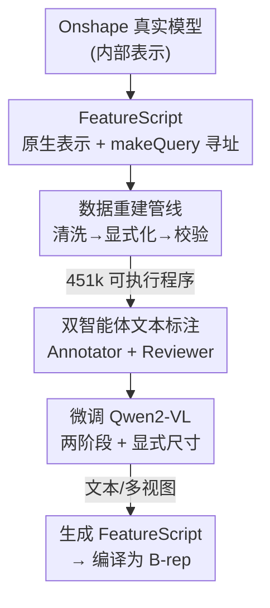

# CADFS: A Big CAD Program Dataset and Framework for Computer-Aided Design with Large Language Models

**会议**: CVPR 2026  
**arXiv**: [2605.01925](https://arxiv.org/abs/2605.01925)  
**代码**: https://voyleg.github.io/cadfs (项目页)  
**领域**: 多模态VLM / 生成式CAD / 数据集  
**关键词**: 生成式CAD, FeatureScript, 设计历史, VLM代码生成, 多模态标注

## 一句话总结
CADFS 把工程师在 Onshape 平台真实创作的 45 万个 CAD 模型重建成干净可执行的 FeatureScript 代码，配上自动生成的文本与多视图标注，让 VLM 第一次能生成超出"草图+拉伸"的复杂设计历史（fillet、loft、revolve 等 15 种操作），在文本生成与图像重建两个任务上都刷新 SOTA。

## 研究背景与动机

**领域现状**：生成式 CAD 的目标正从直接生成 B-rep 曲面，转向生成"设计历史"（design history）——也就是工程师真正使用的、由一连串参数化建模操作（画草图、拉伸、倒角……）组成的可编辑构造序列。近期主流做法是借用预训练 LLM/VLM 的代码理解能力，让模型直接吐出 CAD 构造脚本。

**现有痛点**：无论模型多强，生成的设计始终很简单。瓶颈不在模型，而在训练数据——所有大规模设计历史数据集（DeepCAD、Text2CAD 等）都只含两种操作：草图（sketch）和拉伸（extrude）。于是模型从没见过倒角（fillet）、倒棱（chamfer）、旋转（revolve）、放样（loft），自然也生成不出这些特征。

**核心矛盾**：操作集为什么被锁死在 2 种？根源是数据集采用的**表示方式**。早期 token 序列表示（DeepCAD）里，一个新操作只能引用"之前发出的某个操作"，却无法引用操作产生的几何实体（某条新拉伸出来的边、某个面）。但 fillet/loft/pattern 这类操作恰恰要作用在"演化中几何的具体实体"上，token 表示天生表达不了。后来的 Python 脚本表示（基于 CadQuery）虽然更自然，却用"最终实体的第三条边"这种依赖拓扑的间接引用——一旦模型稍有改动引用就失效，仍然无法稳健表达复杂特征，所以这些数据集照样停留在 2 种操作。此外，从 Onshape 原生表示转成这些自定义格式都是**有损翻译**，丢失了几何与参数保真度。

**本文目标**：(1) 找到一种能稳健引用几何实体、又适合 LLM 生成的设计历史表示；(2) 据此构建一个覆盖丰富操作的大规模真实数据集；(3) 验证 VLM 在该表示上能生成复杂设计。

**核心 idea**：别再发明简化表示，直接用 CAD 系统的**原生语言**——Onshape 的 FeatureScript。它语法结构化、语义可解释，并通过 `makeQuery` 这种结构化查询机制天然支持"按来源/语义角色定位几何实体"，既保留完整保真度又对 LLM 友好。围绕它做一条把 Onshape 内部表示重建成干净 FeatureScript 的数据管线，是整个框架的地基。

## 方法详解

### 整体框架

CADFS 是一个**以数据为中心**的框架，核心三步：先确定一种新表示（FeatureScript 代码），再围绕它造数据（重建管线 + 文本标注），最后微调 VLM 学会生成这种表示。

具体地：① 用一条**重建管线**把 Onshape 为每个模型存的"内部表示"（既不可执行也不可读，含隐式参数、冗余表达式、随机命名）转换成干净、紧凑、可直接编译回 B-rep 的 FeatureScript 程序，过滤掉验证失败的约 15%，得到 45.1 万个真实设计、覆盖 15 种建模操作；② 用 **Annotator + Reviewer 双 LLM** 给每个模型自动写文本描述，并配渲染图与点云，形成多模态标注；③ 微调 **Qwen2-VL-2B**，分两阶段（先 DeepCAD 的草图+拉伸打底，再全量数据学全部操作），支持文本条件生成与多视图重建，并在提示里显式给出包围盒中心和尺寸，让模型按工程师指定的真实尺寸出图。

### 关键设计

**1. FeatureScript 原生表示 + makeQuery 结构化寻址：让"引用几何实体"变得稳健**

复杂操作的拦路虎是"如何指向构造过程中产生的某条边、某个面"。旧 token 表示只能引用操作、不能引用实体；Python 表示用"最终体的第三条边"这种拓扑序号引用，模型一改就错位。FeatureScript 用 `makeQuery` 函数解决：它接收四要素——**操作标识**（把查询限定到某个建模操作，如拉伸 F5）、**查询类型**（实体在该操作中的拓扑角色，如侧边是 `SWEPT_EDGE`）、**实体类型**（顶点/边/面/体）、**消歧数据**（当多个候选满足条件时，用 original-set 消歧或 topology 消歧指定其祖先或邻居）。这四要素拼成一个紧凑而富表达力的寻址方案，能稳健地点到 CAD 历史中的任意几何实体。妙在它正好模仿人类口头描述特征的方式——"由那次拉伸产生的、连接两段草图弧的那条边"——按来源、语义角色、类别、区分属性来定位，所以特别适合 LLM 生成。正是这种寻址能力，让 fillet、loft、circular pattern、删除中间体等操作首次可被表达和学习

**2. FeatureScript 重建管线：把"脏"的内部表示洗成可执行可读的训练代码**

光选对语言不够——Onshape 对人工创建的模型并不直接暴露干净的 FeatureScript，只有满是隐式参数、冗余表达式、单位不一致、随机标识符的内部表示，没法直接拿来训练。管线逐步清洗：先抽取操作序列与参数；把隐式/平台相关参数换成显式参数（如把"点+方向向量"定义的线改成"起点-终点"定义）；单位统一成毫米；解析数值表达式并把精度统一到两位小数；把无意义的 dummy query 换成有意义的引用；把随机实体/变量名换成紧凑有序的标识符（随机名会严重干扰 LLM 理解）；规范化几何操作定义；删掉对最终几何无影响的冗余操作与草图实体。最后做**闭环校验**：执行生成的代码、检查能否复现原模型，过不了的丢弃（约 15%）。这条管线的价值不仅是造出当前数据集，它还能直接复用——Onshape 库里新增的设计可以持续灌进来扩充数据

**3. Annotator–Reviewer 双智能体文本标注：让文本描述与代码逻辑对齐**

文本到 CAD 需要清晰无歧义地描述构造步骤，但公开 CAD 库没有文本描述、人工标注又无法规模化。本文用两个角色分工的 LLM 自动标注：**Annotator** 拿到 FeatureScript 源码和少样本示例，产出对构造过程的结构化初稿，保证全局完整与连贯；**Reviewer** 再核对操作序列正确性、消解歧义、纠正术语、校验数值参数，保证细节正确并与原代码一致。两个模型都额外喂入 FeatureScript 文档——没有文档时 LLM 容易认错引用实体（混淆内/外轮廓、引用错边或错面），有了文档这类错误显著减少。双智能体分工降低了单智能体常见的失败模式（漏操作、命名错误、把代码片段泄漏进文本）。关键前提是：因为底层是语义清晰的 FeatureScript 代码（操作、参数、依赖都显式写出），标注本身才变得简单可靠，文本与设计逻辑天然对齐——这也是消融里"新标注"能稳定涨点的原因

**4. 显式尺寸 + 两阶段微调：把通用 VLM 调成 CAD 生成器**

采用 Qwen2-VL-2B 作为骨干。和以往把 CAD 模型归一化到零中心、固定尺度不同，本文让模型直接生成工程师指定的**真实尺寸**——做法是在文本提示里同时给出设计包围盒的中心和范围（extent），文本条件与图像条件生成都这么做，消融显示这能提升新表示下的生成精度。训练分两阶段 SFT：先在约 17 万个只含草图+拉伸的 DeepCAD 设计上微调，建立核心几何推理能力；再在约 40.5 万个全量数据上微调，泛化到全部 15 种操作。输入既可以是文本描述，也可以是 2×2 的多视图网格图像（沿用 Cadrille 的设定）

### 一个完整示例

以论文里的玩具火箭模型为例，走一遍 FeatureScript 如何表达复杂设计历史：(a) 用样条曲线画出火箭主体的轮廓，绕轴**旋转**（revolve）成体；(b) 用圆弧和文字基元画出尾翼轮廓并**拉伸**（extrude）；(c) 通过 `makeQuery` 把"尾翼轮廓两段弧的连接处、由那次拉伸产生的边"识别为翼尖；(d) 对识别出的翼尖做**倒角**（fillet），再用**圆形阵列**（circular pattern）复制整个机翼；(e) 用**放样**（loft）把机翼的一个矩形面平滑连接到一个圆底面，做成火箭支架，并删除对应那片机翼（它只是中间体）。整个过程里 revolve / fillet / pattern / loft / 删除中间体这些操作，都依赖 `makeQuery` 去稳健地点中"上一步刚产生的某条边/某个面"——这正是旧 token / Python 表示做不到、本文表示首次能学的部分。

## 实验关键数据

骨干为 Qwen2-VL-2B，对比两条主流路线：token 序列（Text2CAD，360M Transformer，训练于 17 万 DeepCAD）与 Python 代码（Cadrille，同样基于 Qwen2-VL-2B，SFT 训练于 DeepCAD + CAD-Recode 合成数据共 117 万样本）。两个测试集：DeepCAD 测试集（7278 个，仅草图+拉伸）与新测试集（约 9k 个，覆盖 15 种操作）。指标含几何精度 CD/ECD/NC、分布保真 MMD、多样性 COV/JSD，以及无效率 IR。

### 主实验

| 任务 / 测试集 | 关键指标 | 本文相对 Cadrille |
|--------------|---------|------------------|
| 文本条件生成 / DeepCAD | Chamfer Distance (CD) | ↓ 40%（更准） |
| 文本条件生成 / DeepCAD | Edge Chamfer Distance (ECD) | ↓ 64%（边更准） |
| 文本条件生成 / DeepCAD | MMD / COV / JSD | 均更优 |
| 文本条件生成 / DeepCAD | 无效率 IR | 与 Text2CAD 相当，略逊 Cadrille |
| 多视图重建 / 新测试集（15 操作） | 精度 & 多样性 | 均超过 Cadrille |

注：IR 略逊 Cadrille，作者归因于 VLM 预训练语料里 FeatureScript 远少于 Python。新测试集上基线无法做文本条件生成——因为 Text2CAD 标注对新设计不存在。⚠️ 表中具体数值未在缓存文本中给出，此处只列论文明确陈述的相对提升（CD −40%、ECD −64%）。

### 消融实验

| 配置（标识对应论文 Table 3） | 表示 / 操作 / 标注 | 结论 |
|------------------------------|--------------------|------|
| Cadrille (基线) | Python / DeepCAD(2) / T2C | 117 万样本训练 |
| (a) FeatureScript | FS / DeepCAD(2) / T2C | 与 Cadrille 持平，但训练语料小得多 |
| (b) + 新标注 | FS / DeepCAD(2) / 新标注 | 几何精度与多样性明显提升 |
| (c)/(e) + 扩展操作 | FS / 全量(15) | 相比 (a)/(d) 大幅提升 |

### 关键发现
- **表示本身可行**：(a) 用 FeatureScript + DeepCAD + Text2CAD 标注，就能追平用 117 万样本训练的 Python 版 Cadrille——说明 FeatureScript 是 Python 表示的可行替代。
- **扩展操作集贡献最大**：真正拉开差距的是把训练规模扩到含 15 种操作的真实复杂设计（(a)→(c)、(d)→(e) 大涨），这正是 FeatureScript 表示解锁的能力。
- **标注必须与表示对齐**：仅替换为新标注（(a)→(b)）就稳定涨点，印证"文本描述要和底层设计历史表示对齐"的重要性。
- **显式尺寸有效**：在提示里给出包围盒中心与范围能提升新表示下的生成精度。
- **图像重建比文本生成更难**：两个模型在多视图重建上都弱于文本条件生成，说明仅凭图像恢复设计历史本身就很难。

## 亮点与洞察
- **用"原生语言"取代"自定义简化表示"**：最大的启发是——与其为了 autoregressive 方便去发明一套有损 token 语法，不如直接采用工程系统自带的、人类工程师每天在用的语言。它既保真又对 LLM 友好，因为 LLM 本就擅长结构化代码。
- **makeQuery 模仿人类指认实体的方式**：四要素（来源/角色/类别/区分属性）寻址恰好对应人怎么口头描述一条边，这种"表示与人类语言同构"的设计天然适合 LLM 生成——可迁移到任何"需要稳健引用动态生成实体"的代码生成任务（如增量编辑场景中的 DOM/AST 节点引用）。
- **数据管线即护城河**：闭环校验（执行→复现→不过则丢）保证了数据保真度，而且管线可持续吸收 Onshape 新增设计——数据集会随时间自动长大，这比一次性数据集更有生命力。
- **兼容旧基准的取数策略**：数据集刻意取成 ABC 的子集、DeepCAD/Text2CAD 的超集，让不同表示的方法能在同一几何上直接对比，并支持从 token/Python 数据集平滑迁移过来。

## 局限与展望
- **IR 偏高**：因 VLM 预训练几乎没见过 FeatureScript，生成代码的无效率略逊 Python 版 Cadrille；可通过继续预训练注入 FeatureScript 语料、或加执行反馈/RL 来改善（本文 SFT 版尚未用 RL，而 Cadrille 完整版含 RL）。
- **强绑定 Onshape 生态**：表示、数据、可执行校验都依赖 Onshape/FeatureScript，迁到其他 CAD 内核（SolidWorks、Fusion）需重做管线。
- **约 15% 模型在校验阶段被丢弃**：可能系统性地排除了某些难重建的复杂设计，存在数据分布偏差风险。
- **骨干较小（2B）**：受限于 2B 模型，更大模型在该表示上的上限尚未探明；多视图重建仍明显落后于文本生成，留有提升空间。

## 相关工作与启发
- **vs DeepCAD / Text2CAD（token 序列表示）**：它们把设计历史量化成 token 序列便于自回归，但只能引用"之前的操作"、无法引用其产生的实体，操作集被锁死在草图+拉伸，且转换有损。本文用原生 FeatureScript + makeQuery 稳健引用实体，把操作从 2 扩到 15，且无损保真。
- **vs Cadrille / CAD-Recode（Python/CadQuery 表示）**：Python 表示更自然、能表达依赖几何的操作，但用"最终体的第三条边"这类拓扑序号引用，对小改动不稳健、丢失构造历史。本文的 makeQuery 按"来源+语义角色"引用，稳健且保留历史；消融显示 FeatureScript 仅用更小语料就追平 Cadrille。
- **vs B-rep 扩散生成（TRELLIS 等）**：直接生成 B-rep 曲面虽多样，但不恢复设计历史，缺乏工程实践最看重的可编辑性。本文生成的是可执行、可编辑的构造历史。

## 评分
- 新颖性: ⭐⭐⭐⭐⭐ 首个用 CAD 系统原生语言 FeatureScript 作训练表示、把生成式 CAD 操作集从 2 扩到 15 的工作。
- 实验充分度: ⭐⭐⭐⭐ 两任务两测试集对比 + 表示/操作/标注三维度消融充分；但缓存未含完整数值表，部分绝对指标待原文确认。
- 写作质量: ⭐⭐⭐⭐⭐ 动机链（表示→操作集→数据）层层递进，makeQuery 与火箭示例把抽象机制讲得很清楚。
- 价值: ⭐⭐⭐⭐⭐ 数据集+管线+模型一并开源，且管线可持续扩数据，对生成式 CAD 社区是地基级贡献。

<!-- RELATED:START -->

## 相关论文

- [\[CVPR 2026\] SldprtNet: A Large-Scale Multimodal Dataset for CAD Generation in Language-Driven 3D Design](sldprtnet_a_large-scale_multimodal_dataset_for_cad_generation_in_language-driven.md)
- [\[CVPR 2026\] LVLM-Aided Alignment of Task-Specific Vision Models](lvlm-aided_alignment_of_task-specific_vision_models.md)
- [\[CVPR 2026\] Dr. Seg: Revisiting GRPO Training for Visual Large Language Models through Perception-Oriented Design](dr_seg_revisiting_grpo_training_for_visual_large_language_models_through_percept.md)
- [\[CVPR 2026\] R4-CGQA: Retrieval-based Vision Language Models for Computer Graphics Image Quality Assessment](r4-cgqa_retrieval-based_vision_language_models_for_computer_graphics_image_quali.md)
- [\[CVPR 2026\] Breaking the Regional Perception Bottleneck of Multimodal Large Language Models via External Reasoning Framework](breaking_the_regional_perception_bottleneck_of_multimodal_large_language_models_.md)

<!-- RELATED:END -->
