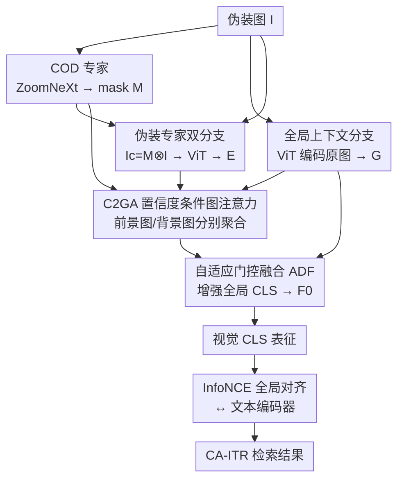

# Camouflage-aware Image-Text Retrieval via Expert Collaboration

**会议**: CVPR 2026  
**论文**: [CVF Open Access](https://openaccess.thecvf.com/content/CVPR2026/html/Jiang_Camouflage-aware_Image-Text_Retrieval_via_Expert_Collaboration_CVPR_2026_paper.html)  
**代码**: https://github.com/jiangyao-scu/CA-ITR  
**领域**: 多模态VLM  
**关键词**: 伪装场景理解, 图文检索, 跨模态对齐, 置信度图注意力, 专家协同  

## 一句话总结
本文首次把"图文检索"搬到伪装场景，构建了 1.05 万样本的 CamoIT 数据集，并提出双分支 + 置信度条件图注意力（C2GA）的 CECNet：用一个 COD 专家把伪装目标从背景里"抠"出来单独编码，再有选择地融回全局表征，最终在伪装图文检索（CA-ITR）上把整体准确率拉高约 29%，超过 7 个主流检索模型。

## 研究背景与动机
**领域现状**：伪装场景理解（CSU）这几年发展很快，但绝大多数工作停在伪装目标检测/分割（COD），输出的是像素级 mask；近期少数工作开始用 MLLM 做伪装场景的 VQA、视觉定位，仍偏"生成"视角。

**现有痛点**：跨模态对齐——也就是把一句文本描述准确对应到图像里的伪装目标——这个最基础的能力几乎没人系统研究。作者用 CLIP、AVSE、D2S-VSE 等 SOTA 检索模型在伪装图上一测就露馅：它们经常把文本匹配到背景而不是那个和背景"长得一模一样"的目标（图 1），错排成 crab、lizard 等近似类别。

**核心矛盾**：伪装的本质是"目标视觉特征与背景高度相似、但语义上是两回事"。主流检索模型都是在前景-背景清晰分离的数据（MS-COCO/Flickr30K）上训出来的，ViT 这种全局编码会把目标信号和背景纠缠在一起，单纯调一调区域权重根本压不住背景干扰；而把 mask 直接乘到图上虽然能"破伪装"，又会破坏图像保真度、引入语义错位。

**本文目标**：(1) 把伪装跨模态对齐形式化成一个新任务 CA-ITR 并配套数据集；(2) 做一个能真正感知伪装目标的检索基线模型。

**切入角度**：既然单编码器"调权重"治标不治本、"先抠图再编码"又伤保真度，那就让两条编码路并行——一条保留全局上下文，一条专门、独立地编码被隔离出来的伪装目标，再智能地把后者融进前者，从根上避免特征污染。

**核心 idea**：引入一个 COD 专家当"放大镜"提纯伪装目标表征，用置信度条件的图注意力（C2GA）把前景/背景信息分到两张图里分别聚合，只把伪装目标信息选择性注入全局 CLS 表征。

## 方法详解

### 整体框架
CECNet 建在标准 VSE（视觉-语义嵌入）全局对齐框架上：输入一张伪装图 $I$，先经 COD 专家（ZoomNeXt）得到伪装目标 mask $M$；上半路是**全局上下文分支**，用标准 ViT 对原图编码出 $G^l$，保留整幅场景语境；下半路是**伪装专家分支**，先把 mask 与原图逐元素相乘得到只剩目标的 $I_c=M\otimes I$，再用一个（与全局分支共享参数的）ViT 编码出提纯后的目标特征 $E^l$。两路特征在全局分支的**每个 block 之后**经 **C2GA** 模块交互：C2GA 借助每个 patch 的伪装置信度，把特征拆进"前景图"和"背景图"分别聚合，再用自适应门控（ADF）把增强后的全局特征稳定地融回原全局特征。最终取全局分支的 CLS token 作为视觉表征，与文本编码器输出做 InfoNCE 对齐完成检索。

### 关键设计

**1. CamoIT 数据集与三阶段渐进标注：让 GPT-4o 也能"看见"伪装目标**

CA-ITR 没有数据可用，作者基于 4 个 COD 数据集（CHAMELEON/CAMO/COD10K/NC4K）剔除低质样本后，用 GPT-4o 辅助标注出多粒度文本，得到 1.0464 万样本、约 237 类。难点是 GPT-4o 本身就看不清伪装目标，于是设计了三步：① **Camouflage Disruption**——从 COD mask 提目标轮廓、用醒目颜色描到原图上"破伪装"提升可见性，并在 prompt 里专门加一句"忽略红色标记"防止模型把人工高亮当成场景内容；② **Evolutionary Annotation**——一次性描述含多组件的复杂图很难，于是分级渐进：先分类→再描述伪装目标→最后给整图描述，且把第一步识别出的类别名显式塞进后续 prompt 提升准确率；③ **人工精修**——16 名标注员按规范做三轮复核，纠正幻觉/事实错误并去冗余，每图约 2–4 分钟。每张图带三级标注（类别 / 目标描述 / 整图 caption），CA-ITR 最终用 Level 3 整图描述，按每类约 7:3 分层划分，测试集恰为 3000 样本。这套标注本身也能服务于视觉定位、COD 等任务。

**2. 伪装专家双分支编码器：用独立编码避免"特征污染"**

针对"单编码器调权重压不住背景、先抠图编码又伤保真"的两难，CECNet 把感知任务拆成两条彻底独立的路。全局上下文分支吃原图 $I$ 保留完整场景语境；伪装专家分支吃被隔离的目标 $I_c=M\otimes I$，专门产出一份"提纯"的伪装目标表征 $E$。关键在于两路在编码阶段**互不污染**——专家分支不会被背景特征带偏，全局分支也不丢上下文。实现上专家编码器与全局编码器共享参数以保证两路表征一致，COD 专家用 ZoomNeXt。消融（表 3 的 A1–A3）正好验证了这个取舍：把 mask 在编码前卷积调制输入（A1）反而掉点（I2T R@1 41.3→28.5），而双分支隔离编码的 CECNet 提升最大。

**3. 置信度条件图注意力 C2GA：按伪装置信度把前景/背景分图聚合**

简单地把两路特征相加或线性融合是次优的（表 3 的 B1/B2），因为它们不加区分地混所有特征，容易让占主导的背景特征污染专家分支提纯出的伪装表征。C2GA 受多头注意力"在不同子空间捕捉不同语义"启发，但**显式**构造一张前景相关图 $G_F$ 和一张背景相关图 $G_B$：先用 mask $M$ 对每个 patch 区域做 max pooling 得到伪装置信度，再把全局特征 $G$ 经线性投影分到前景/背景两个子空间 $G_{obj}/G_{env}$，专家特征 $E$ 同样投影成 $E_{obj}/E_{env}$。前景图 $G_F$ 的节点是 $G_{obj}$ 与 $E_{obj}$ 的所有 token，边权由相似度与置信度共同决定：

$$W^F_{i,j} = M_{v_i}\cdot M_{v_j}\cdot \frac{v_i v_j^\top}{|v_i||v_j|},\quad v_i,v_j\in V_F$$

其中 $M_{v_i},M_{v_j}\in[0,1]$ 是节点的伪装置信度——置信度低的背景节点会被自动压低边权，从而把图聚焦在前景结构上（CLS token 的置信度设为 1，$E_{obj}$ 的置信度直接复制对应位置 $G_{obj}$ 的值，因为伪装目标在原图/抠图里表征一致）。聚合时由于是全局对齐，只把信息汇聚到 CLS 节点 $G_{obj}_0$：$\dot v_i = \sum_{v_j\in V_F} W^F_{i,j} v_j$，得到增强前景表征 $A^{obj}_0$。背景图 $G_B$ 对称构造，节点置信度改用背景置信度 $(1-M_{v_j})$，而 $E_{env}$ 所有节点置信度设 0（专家分支不含背景信息），得到 $A^{env}_0$。前景/背景增强表征拼接投影回原空间得 $A_0$，最后用自适应门控融合（ADF）稳定地融回原全局特征：

$$F_0 = \mathrm{sum}\big(\sigma(f([A_0,E_0,G_0]))\cdot[A_0,E_0,G_0]\big)$$

$f(\cdot)$ 用线性映射逐通道学融合权重，$\sigma$ 是 sigmoid。整套机制只更新全局分支的 CLS token、其余 patch 不动，从而"有选择地"把伪装目标信息注入全局表征而不被背景反噬。

### 损失函数 / 训练策略
文本侧用标准 Transformer 编码，跨模态全局对齐用 InfoNCE：$L = L_{T2I}+L_{I2T}$，其中

$$L_{T2I} = -\frac{1}{n}\sum_{i=1}^{n}\log\frac{e^{(T_i V_i^\top/\tau)}}{\sum_{j=1}^{n} e^{(T_i V_j^\top/\tau)}}$$

$L_{I2T}$ 对称定义，温度 $\tau=0.05$，batch size 128，图像 224。整体建在 CLIP（ViT-B/32）上，文本编码器与全局分支直接沿用 CLIP。采用两阶段训练：先只训 C2GA 模块、其余保持 CLIP 权重（lr 1e-4），再对整个 CECNet 端到端微调（lr 1e-5，COD 模型冻结）。作者也坦言文本侧编码/损失仍有提升空间，是留给后续的方向。

## 实验关键数据

### 主实验
所有模型均在 CamoIT 训练集上重训后于 3000 测试样本评测（R@K %，I2T = 图检文，T2I = 文检图）。CECNet 全面领先，平均 R@1 比最强通用检索模型 D2S-VSE 高 8.9%，比微调 CLIP 高约 4%，比同为 CLIP-based 的 CUSA 高 21.5%。

| 模型 | I2T R@1 | I2T R@5 | I2T R@10 | T2I R@1 | T2I R@5 | T2I R@10 |
|------|---------|---------|----------|---------|---------|----------|
| CUSA | 23.9 | 53.5 | 66.7 | 23.5 | 51.3 | 64.3 |
| CFM | 30.8 | 59.9 | 70.3 | 28.9 | 57.2 | 68.3 |
| HREM | 34.3 | 62.7 | 74.0 | 31.5 | 59.9 | 71.4 |
| D2S-VSE（最强通用） | 37.1 | 68.4 | 79.5 | 35.5 | 67.5 | 78.4 |
| CLIP（微调） | 41.3 | 69.2 | 79.0 | 41.1 | 67.7 | 78.4 |
| **CECNet（本文）** | **45.8** | **74.5** | **83.5** | **44.6** | **73.9** | **83.1** |

把伪装专家协同方案（CEC）插到 D2S-VSE、AVSE 上也都涨点（如 D2S-VSE+CEC 的 I2T R@1 37.1→39.0），说明这套方案可即插。作者强调即便如此，所有方法在 CA-ITR 上仍远低于常规检索（如 Flickr30K 上 38.1% R@1 的早期水平），CA-ITR 不是简单域迁移，而是有"感知伪装目标 + 图像内容复杂 + 需要细粒度理解"三重独特挑战。

### 消融实验

双分支与 C2GA 的消融（CamoIT，以微调 CLIP 为 Baseline）：

| 配置 | I2T R@1 | I2T R@5 | T2I R@1 | T2I R@5 | 说明 |
|------|---------|---------|---------|---------|------|
| Baseline | 41.3 | 69.2 | 41.1 | 67.7 | 标准 CLIP |
| A1 | 28.5 | 58.3 | 30.0 | 58.0 | 编码前用 mask 卷积调制输入（反而崩） |
| A2 | 42.1 | 69.9 | 41.2 | 69.5 | mask 与图特征卷积融合 |
| A3 | 41.8 | 69.2 | 42.2 | 68.9 | 可训练 prompt 生成 CAM 式注意力 |
| B1 | 42.5 | 71.7 | 42.9 | 71.1 | 两路特征相加 |
| B2 | 42.4 | 70.4 | 41.7 | 70.2 | 通道拼接 + 线性融合 |
| B3 | 42.9 | 70.7 | 42.3 | 68.9 | 普通图注意力 |
| **CECNet** | **45.8** | **74.5** | **44.6** | **73.9** | 双分支 + C2GA |

不同 COD 专家对检索性能的影响（专家越强，检索越好）：

| COD 专家 | I2T R@1 | T2I R@1 | 分割 $S_\alpha$ | 分割 MAE |
|----------|---------|---------|---------------|----------|
| White（无目标感知，下界） | 41.6 | 41.3 | 0.443 | 0.120 |
| SINet | 42.3 | 42.1 | 0.808 | 0.049 |
| SINet-v2 | 43.3 | 43.1 | 0.843 | 0.037 |
| ZoomNet | 44.0 | 42.9 | 0.851 | 0.033 |
| **ZoomNeXt** | **45.8** | **44.6** | **0.906** | **0.021** |

### 关键发现
- **C2GA 是性能主力**：把它换成相加/线性/普通图注意力（B1–B3）只能在 42–43 区间小涨，而 C2GA 直接拉到 45.8，差距来自"按置信度分前景/背景图聚合"避免了背景污染。
- **双分支隔离是必要的**：A1（编码前调制输入）反而把 R@1 砸到 28.5，印证"单编码器改输入会伤保真度"的判断；双分支独立编码才稳。
- **专家能力可线性传导**：COD 分割越准（$S_\alpha$ 0.44→0.91），检索 R@1 越高（41.6→45.8），且 White 下界证明收益确实来自 COD 提供的目标感知——这是首次验证把 COD 模型接进图文检索能真正提升检索精度。
- **BUTD 反超部分 ViT 方法**：基于物体级表征的 CFM/HREM 在 CamoIT 上竟超过可训练 ViT 的 CUSA/LAPS/AVSE，因为 object proposal 偶尔能部分框住伪装目标，反过来佐证了 CECNet"显式建模伪装目标"的合理性。

## 亮点与洞察
- **"提纯-选择性融合"范式很干净**：不在原编码器里硬掰权重，而是另开一条专家路提纯目标、再用置信度图注意力只把目标信息注入 CLS——把"避免背景污染"这件事做成了结构性保证，而非靠损失约束。
- **置信度当图边权的调制器**很巧：$W^F_{i,j}=M_{v_i}M_{v_j}\cdot\cos$ 让低置信背景节点自动断边，前景/背景两张图天然分工，比"无差别 attention"更可控，且这个 trick 可迁移到任何"前景信号被背景淹没"的细粒度任务。
- **COD↔检索的桥**：用 mask 把伪装目标"抠"出来当专家知识，首次量化证明分割能力可直接换成检索精度，给"低层感知服务高层对齐"提供了一个可复用模板。
- **数据集标注的工程巧思**：用"破伪装描轮廓 + 提示忽略红标 + 分级渐进 + 类别名回灌 prompt"绕过 GPT-4o 看不清伪装目标的硬伤，是很实用的 LLM 辅助标注配方。

## 局限与展望
- 作者承认这只是 CA-ITR 的**奠基性基线**，绝对性能仍处于传统 ITR 早期水平，文本侧编码/损失策略基本沿用标准方案，有较大改进空间。
- **强依赖外部 COD 专家**：整条专家分支建立在 COD mask 上，表 4 也显示性能和 COD 质量强绑定；在 COD 失效（如全新伪装类别、极端伪装）场景下专家分支可能反成噪声来源。
- 专家分支与全局分支**共享参数**且每个 block 后都插 C2GA，多级交互的计算/显存开销、以及 mask 误差如何沿层累积，文中未深入分析。⚠️ 这部分以原文为准。
- CamoIT 仅约 237 类、来自现有 COD 数据集，类别与场景多样性有限；CA-ITR 用的是 Level 3 整图描述，Level 1/2 的细粒度标注潜力尚未在检索里挖掘。

## 相关工作与启发
- **vs 全局对齐检索（CFM/HREM/D2S-VSE/AVSE/CUSA）**：它们匹配整图-整句的全局表征，在前景清晰数据上有效，但 ViT 全局特征会把伪装目标和背景纠缠；CECNet 仍是全局对齐框架，却多了一条专家路+C2GA 来"净化"全局 CLS，对伪装目标的感知显著更强。
- **vs 局部对齐 / BUTD 检索（CHAN/DBL/LAPS）**：它们靠区域-词的细粒度交互或物体级表征，BUTD 偶尔能框住伪装目标，但难利用背景上下文；CECNet 的双分支同时保住了"目标提纯"和"全局语境"。
- **vs 伪装场景的 MLLM 工作 [51,66]**：那些偏 VQA/对话等生成任务，把最基础的跨模态对齐留白；本文正是补这块对齐地基，并指出 MLLM 在伪装场景的吃力很可能源于初始对齐不稳。
- **vs COD/分割方法（ZoomNeXt/SINet 等）**：它们产出像素 mask、缺高层语义；CECNet 把 COD 当专家知识接入检索，让"低层感知"反哺"高层跨模态理解"。

## 评分
- 新颖性: ⭐⭐⭐⭐⭐ 首次提出伪装图文检索任务，双分支+置信度图注意力的"提纯-选择性融合"范式有结构性创新。
- 实验充分度: ⭐⭐⭐⭐ 8 个 SOTA 对比 + 三组消融 + COD 专家梯度验证，较完整；但仅 CamoIT 单数据集、文本侧未深挖。
- 写作质量: ⭐⭐⭐⭐ 动机-矛盾-方案推导清晰，C2GA 公式与置信度设定讲得明白；图 3 信息密度偏高。
- 价值: ⭐⭐⭐⭐⭐ 立了一个新任务+数据集+基线，并验证 COD 能反哺检索，为伪装跨模态对齐开了方向。

<!-- RELATED:START -->

## 相关论文

- [\[CVPR 2026\] EagleNet: Energy-Aware Fine-Grained Relationship Learning Network for Text-Video Retrieval](eaglenet_energy-aware_fine-grained_relationship_learning_network_for_text-video_.md)
- [\[CVPR 2026\] STiTch: Semantic Transition and Transportation in Collaboration for Training-Free Zero-Shot Composed Image Retrieval](stitch_semantic_transition_and_transportation_in_collaboration_for_training-free.md)
- [\[CVPR 2026\] Text-Only Training for Image Captioning with Retrieval Augmentation and Modality Gap Correction](text-only_training_for_image_captioning_with_retrieval_augmentation_and_modality.md)
- [\[CVPR 2026\] Text-Printed Image：把文本「印」成图片来弥合图文模态鸿沟](text-printed_image_bridging_the_image-text_modality_gap_for_text-centric_trainin.md)
- [\[CVPR 2026\] Gravitation-Driven Semantic Alignment for Text Video Retrieval](gravitation-driven_semantic_alignment_for_text_video_retrieval.md)

<!-- RELATED:END -->
