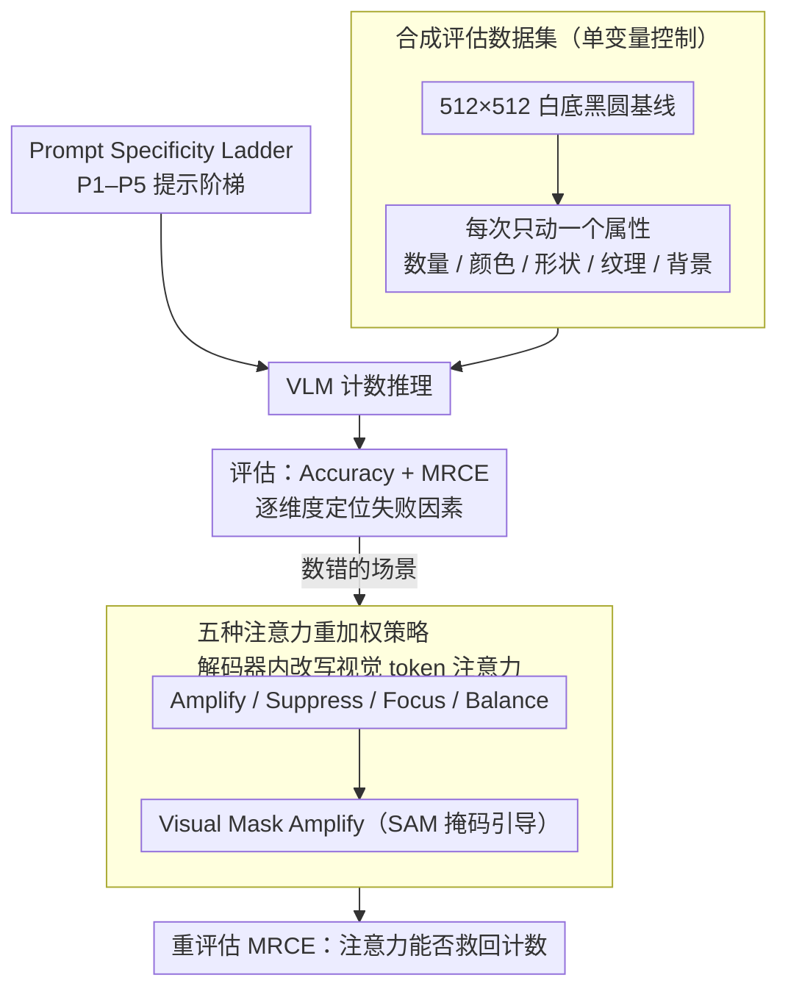

# Can Vision-Language Models Count? A Synthetic Benchmark and Analysis of Attention-Based Interventions

**会议**: CVPR 2026  
**arXiv**: [2511.17722](https://arxiv.org/abs/2511.17722)  
**代码**: [GitHub](https://github.com/ssen7/vlm-count-analysis)  
**领域**: Multimodal/VLM  
**关键词**: VLM, 计数能力, 注意力机制, 合成基准, 视觉注意力干预

## 一句话总结

构建了一个合成计数基准数据集，系统评估了开源 VLM 在不同图像/提示条件下的计数能力，并通过解码器层面的视觉注意力重加权实验探索改善计数行为的机制。

## 研究背景与动机

**领域现状**：VLM 已广泛应用于视觉问答等任务，但在精确计数（enumeration）方面表现不佳，远落后于专用计数方法（如 PseCo、CountGD、CrowdDiff）。

**现有痛点**：现有评估大多使用自然图像数据集，变量高度耦合（遮挡、纹理、密度等），难以隔离具体失败因素；现有研究缺乏系统性的诊断框架来分析计数失败的根因。

**核心矛盾**：VLM 在训练中习得了强先验偏置，面对需要精确视觉注意力的计数任务时，容易依赖记忆模式而非逐物体分析。这与人类认知中的枚举极限和认知负荷效应高度吻合。

**本文目标**：构建可控合成基准，通过逐一变化图像/提示属性来精确隔离影响因素，并探索注意力干预是否能改善计数。

**切入角度**：从认知科学（认知负荷理论）和模型可解释性（注意力分析）两个视角切入。

**核心 idea**：用合成数据精确控制变量 + 注意力重加权干预的可解释诊断框架。

## 方法详解

### 整体框架

这篇论文想回答一个看似简单的问题：VLM 到底为什么数不准物体？它的做法是把"诊断"拆成两步走。第一步，用一套**完全可控的合成图像**把影响计数的变量逐个隔离开——白底黑圆做基线，每次只动一个属性（数量、颜色、形状、纹理、背景），这样模型一旦数错，就能精确归因到是哪个因素在作祟。第二步，在模型已经数错的地方，深入到语言解码器内部去**改写它对视觉 token 的注意力分配**，看看把注意力强行往物体上挪能不能救回计数。整条链路从合成数据 → 多维度评估 → 注意力干预，始终围绕"隔离变量、定位根因"这一条主线。

### 关键设计

**1. 合成评估数据集：用单变量控制把失败因素一个一个揪出来**

自然图像基准最大的问题是变量全都搅在一起——遮挡、纹理、密度同时变化，模型数错了也说不清是哪一项害的。本文索性放弃自然图像，从 512×512 的白底黑圆出发，把所有可能影响计数的属性都拆成独立维度：物体数量（0–50，步长 10）、物体的颜色/形状/纹理、背景的颜色/纹理。每生成一组数据集只改动其中一个属性，其余全部冻结。这样一来，某个模型在"背景换成棋盘格"这组上崩了，就能直接断定是高频背景纹理干扰了物体检测，而不必在一堆耦合因素里猜。这种严格的控制变量设计，正是后面所有归因结论能站得住脚的前提。

**2. Prompt Specificity Ladder：把语言描述的详细程度也变成一个可控旋钮**

光控制图像还不够，提示词的措辞同样会左右计数。作者设计了 P1–P5 五级递进的提示阶梯：P1 是最朴素的"数一数有多少个物体"，逐级往上加描述，到 P5 变成"数一数有 X 纹理、Y 颜色的 Z 形状有多少个"。这样就把"语言复杂度"也变成一个可以独立扫描的维度，用来检验一个直觉假设——给模型更多语义线索是否真能帮它数得更准。实验里这个旋钮恰恰暴露了反直觉现象：描述背景能帮模型简化分割从而提分，描述物体本身却反而越说越糟，这个不对称只有靠这套阶梯才扫得出来。

**3. 五种注意力重加权策略：在解码器里直接掰动视觉注意力**

诊断之外，作者还想验证一个机制假设：VLM 数不准，部分原因是注意力"下沉"——大量注意力被分到了与查询无关的视觉 token 上。为此他们在语言解码器中直接对视觉 token 的注意力权重 $A_{h,i,j}$ 做手术，给出五种重加权方案。**Amplify** 把视觉注意力整体放大，$\tilde{A}_{h,i,j} = \alpha \cdot A_{h,i,j}$（$\alpha=2.0$）；**Suppress** 反过来按 $\beta=0.5$ 削弱；**Focus** 把所有非视觉 token 的注意力压到 $\epsilon=10^{-10}$，强迫模型只看图；**Balance** 设一个目标视觉注意力比率 $r_v^{target}=0.4$，做校正缩放把比例拉回这个值；**Visual Mask Amplify** 则借助 SAM 分割掩码区分物体与背景，对物体区域按 $\alpha_{obj}=2.0$ 放大、背景区域按 $\alpha_{bg}=0.5$ 抑制，相当于把"该看哪"的先验直接灌进注意力。这五种方案从粗放的整体缩放到精细的掩码引导层层递进，用来检验"重新分配注意力能否改善计数"这一假设——结论是有可测量的改善但整体温和，说明注意力下沉只是部分病因而非全部。

### 损失函数 / 训练策略

本文不涉及任何训练，所有注意力干预都发生在推理阶段，因此核心只在评估指标上。除了精确匹配的 **Accuracy**，作者还用 **MRCE**（Mean Relative Count Error）刻画"数错了错多远"：

$$\text{MRCE} = \frac{1}{N}\sum_{i=1}^{N}\frac{|c_{pred}^{(i)} - c_{true}^{(i)}|}{c_{true}^{(i)}}$$

它把每张图的计数误差按真值归一化再平均，越低越好——相比只看是否精确命中的 Accuracy，MRCE 能反映干预是否至少让计数"更接近"了，是衡量注意力重加权温和改善的关键指标。

## 实验关键数据

### 主实验 — 提示特异性效果

| 特征类别 | 模型 | P1 Acc | 最佳提示 Acc | MRCE 变化 |
|---------|------|--------|------------|-----------|
| 背景纹理 | Qwen7b | 0.090 | P2: 0.168 (+0.078) | -0.433 |
| 背景纹理 | Kimi | 0.169 | P2: 0.264 (+0.095) | -0.355 |
| 物体纹理 | Qwen32b | 0.240 | P1 最佳 | P5: +0.172 (恶化) |
| 物体颜色 | Qwen7b | 0.163 | P2: 0.212 (+0.049) | -0.115 |

### 消融实验 — 视觉复杂度影响

| 配置 | 关键指标 | 说明 |
|-----|---------|------|
| 物体数量 0-9 | 准确率最高 | 所有模型在低数量区间表现最好 |
| 物体数量 40-50 | 准确率显著下降 | 计数能力随数量增加系统性退化 |
| 背景纹理-棋盘格 | MRCE 升高 | 高频纹理干扰物体检测 |
| 背景纹理-对角条纹 | MRCE 最高 (Qwen32b: 0.308) | 方向性纹理与物体形状产生混淆 |

### 关键发现

1. **提示特异性的不对称效应**：背景特征的具体描述一致提升性能（简化视觉分割），但物体纹理特异性单调恶化准确率（引入"认知负荷下沉"）。
2. **认知负荷效应**：P5 高负荷提示下，模型对形状的注意力被纹理和颜色处理"抑制"，热力图直接证实了这一点。
3. **模型规模不等于鲁棒性**：Qwen32b 在物体纹理维度表现最差（Acc 从 0.240 降至 0.132），规模更大不意味着更好的计数能力。
4. **注意力重加权效果有限但可测量**：掩码引导放大在部分场景下改善 MRCE，但整体改进较为温和。

## 亮点与洞察

- 首个从认知科学角度系统诊断 VLM 计数能力的框架，将人类认知负荷理论映射到 VLM 失败模式。
- 发现"P1 最优现象"：最简单的通用提示反而效果最好，因为它绕过了具体语义线索带来的认知下沉。
- 跨模态绑定（cross-modal binding）是计数失败的根本原因，自然图像基准无法轻易隔离此问题。
- 在 FSC-147 真实世界计数基准上验证了定性一致趋势，表明发现并非合成图像的伪影。

## 局限与展望

- 注意力干预仅在推理时操作，未考虑训练阶段的注意力引导（如注意力损失）。
- 合成数据虽然可控，但与真实世界场景的复杂度差距大，干预效果在真实场景可能更弱。
- 仅测试了三个开源 VLM，缺少对闭源模型（GPT-4V、Gemini）的分析。
- 未探索数量超过 50 的大规模计数场景。

## 相关工作与启发

- Vo et al. 发现 o3/Gemini 2.5 Pro 存在强先验偏置，与本文发现一致。
- Kang et al. 的视觉注意力下沉（attention sinks）研究直接启发了注意力干预策略。
- 本文的可控诊断框架可推广到其他 VLM 视觉推理能力的系统测试。

## 评分

- 新颖性: ⭐⭐⭐⭐ 诊断框架新颖，但注意力干预策略较直接
- 实验充分度: ⭐⭐⭐⭐⭐ 多模型、多维度、多层次的系统评估非常充分
- 写作质量: ⭐⭐⭐⭐ 结构清晰，认知科学类比贴切
- 价值: ⭐⭐⭐⭐ 为理解 VLM 计数失败提供了重要诊断工具和机制解释

<!-- RELATED:START -->

## 相关论文

- [\[CVPR 2026\] CICA: Coupling Confidence-Aware Pretraining with Confidence-Informed Attention for Robust Multimodal Sentiment Analysis](cica_coupling_confidence-aware_pretraining_with_confidence-informed_attention_fo.md)
- [\[CVPR 2026\] VL-RouterBench: A Benchmark for Vision-Language Model Routing](vl-routerbench_a_benchmark_for_vision-language_model_routing.md)
- [\[ICML 2026\] Large Vision-Language Models Get Lost in Attention](../../ICML2026/multimodal_vlm/large_vision-language_models_get_lost_in_attention.md)
- [\[CVPR 2026\] STAR: Test-Time Adaptation Can Enhance Universal Prompt Learning for Vision-Language Models](star_test-time_adaptation_can_enhance_universal_prompt_learning_for_vision-langu.md)
- [\[CVPR 2026\] SpatiaLQA: A Benchmark for Evaluating Spatial Logical Reasoning in Vision-Language Models](spatialqa_a_benchmark_for_evaluating_spatial_logical_reasoning_in_vision-languag.md)

<!-- RELATED:END -->
