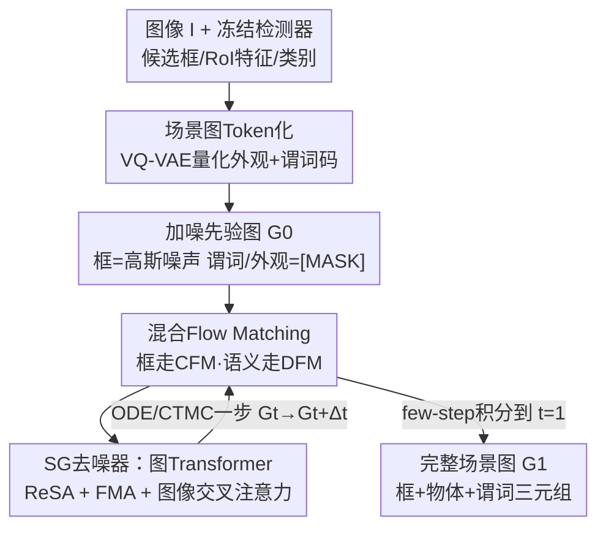

# Can We Build Scene Graphs, Not Classify Them? FlowSG: Progressive Image-Conditioned Scene Graph Generation with Flow Matching

**会议**: CVPR 2026  
**论文**: [CVF Open Access](https://openaccess.thecvf.com/content/CVPR2026/html/Hu_Can_We_Build_Scene_Graphs_Not_Classify_Them_FlowSG_Progressive_CVPR_2026_paper.html)  
**代码**: 未公开  
**领域**: 多模态VLM / 场景图生成  
**关键词**: 场景图生成, Flow Matching, 离散-连续混合生成, 图Transformer, 开放词表  

## 一句话总结
FlowSG 把场景图生成从"一次性分类"改造成"渐进式生成"——用混合离散-连续 flow matching，让一张被噪声污染的图随时间逐步长出物体框（连续 CFM）和谓词标签（离散 DFM），在 VG / PSG 的闭集与开放词表设定上比 SOTA（USG-Par）平均高约 3 个点。

## 研究背景与动机

**领域现状**：场景图生成（SGG）要把一张图解析成"物体节点 + 主-谓-宾三元组"的结构图，既要定位物体框、又要推理它们之间的视觉关系。主流做法分两类：两阶段（先用检测器枚举物体对，再用关系头分类谓词）和一阶段（一次前向同时输出所有三元组，再做匹配）。

**现有痛点**：作者指出无论哪一类，本质都是 **一次性、确定性的分类**——把视觉特征直接映射成最终图，没有显式的生成过程。这带来三个毛病：① **不可纠错**，关系一旦在单次前向里定下来，配错的实体对或分错的谓词没机会借助"图级别证据"回头修正；② **语义与几何被当成静态输入**，物体框和谓词标签各算各的，不能在迭代中互相refine；③ **图级约束难施加**，关系独立打分时，像"空间传递性"这种全局一致性约束几乎无从落地，导致生成的图全局不自洽。

**核心矛盾**：缺少一个"真正生成式、渐进式"的构图过程，模型就只能在单次前向里赌一把，无法产出连贯、全局一致的场景图。

**切入角度**：作者从图生成领域的 Flow Matching 进展出发——分子图等离散图生成已经证明，对节点/边状态做迭代去噪能产出高保真、带约束的图。那么 SGG 能不能也被重述成"在混合状态空间上的连续时间传输"？

**核心 idea**：把场景图建成一个 **混合图**——每个节点带离散物体标签 + 连续框参数，每条边带离散谓词——然后用 flow matching 把一个加噪图（框是高斯噪声、谓词全 [MASK]）沿时间逐步传输到干净的、以图像为条件的场景图。一句话：**用"渐进去噪生成"代替"一次性分类"来解决全局不一致问题**。

## 方法详解

### 整体框架

FlowSG 的输入是一张图像 $I$，输出是一张完整场景图 $G_1$（物体框 + 物体类别 + 谓词）。整个流程分三步走：先用冻结检测器拿到候选物体，把物体外观特征和谓词短语 **离散化成紧凑 token**（连续的框保持连续）；然后从一个"加噪先验图 $G_0$"出发，用 **混合 flow matching** 沿时间 $t{=}0\to1$ 迭代去噪；每一步去噪都由一个 **图 Transformer 去噪器** 完成，它以冻结图像特征为条件，同时输出连续框的速度场和离散 token 的干净后验。

关键在于这是一个 **离散-连续耦合** 的传输过程：连续的框 $\mathbf{g}$ 用连续 flow matching（CFM）走概率流 ODE，离散的语义 $\mathbf{s}=(c,r,a)$（物体类别 / 谓词 / 外观码）用连续时间马尔可夫链（CTMC）的离散 flow（DFM）演化，两路在每一步通过共享的图 Transformer 紧耦合。物体类别 $c$ 不加噪，作为先验稳定训练；谓词和外观码全 [MASK]，框从 $\mathcal{N}(0,I_4)$ 起步。

### 关键设计

**1. 场景图 Token 化：把离散语义压成语言对齐的紧凑码**

直接在原始 $\mathbb{R}^d$ 视觉特征空间里做生成既昂贵又不稳定，所以作者先把"离散部分"变得可预测。物体外观用 VQ-VAE 量化：用 CLIP 图像编码器对每个框裁剪区域编码得 $\mathbf{u}_i = \mathrm{CLIP_{img}}(\Phi_{crop}(I,\mathbf{b}_i))$，再量化到码本最近邻 $a^\star_i = \arg\min_k \lVert \mathbf{u}_i - \mathbf{e}_k\rVert_2^2$。谓词则用 CLIP 文本编码器把关系短语（含 ConceptNet 等外部语料）量化进一个谓词码本。这一步的巧妙之处在于：码本是在 **语言空间** 里学的，语义相近的谓词会映射到相邻甚至相同的码，天然带来"语义平滑"，并且推理时可以把码最近邻回 CLIP 空间，从而支持 **开放词表解码**——这正是后面开放词表实验涨点的根。最终节点 token 是 $\mathbf{n}_i=(a^\star_i, c^\star_i, \mathbf{b}^\star_i)\in[K_a]\times[C_{obj}]\times\mathbb{R}^4$。

**2. 混合 Flow Matching：连续框走 CFM、离散语义走 DFM，每步紧耦合**

这是 FlowSG 的核心机制，解决"语义与几何被当静态输入、不能互相 refine"的痛点。对连续框，用线性插值路径 $\mathbf{g}_t=(1-\kappa_t)\mathbf{g}_0+\kappa_t\mathbf{g}_1$，目标速度 $\mathbf{u}^\star_g=\dot\kappa_t(\mathbf{g}_1-\mathbf{g}_0)$，训练一个速度场去匹配它：

$$\mathcal{L}_{CFM}=\mathbb{E}_{t\sim U[0,1]}\big\lVert v_\theta(\mathbf{g}_t,t,c)-\dot\kappa_t(\mathbf{g}_1-\mathbf{g}_0)\big\rVert_2^2$$

推理时从 $\mathbf{g}_0\sim\mathcal{N}(0,I)$ 出发，用少数几步 ODE 积分 $\frac{d}{dt}\mathbf{g}_t=v_\theta(\mathbf{g}_t,t,c)$ 把噪声框传输到干净框。对离散语义，用两点条件路径 $p_t=(1-\kappa_t)\delta_{s_0}+\kappa_t\delta_{s_1}$（$s_0$ 是 [MASK] 先验），其边缘分布在 CTMC 下演化。这里有个数值上的关键技巧：不直接回归满足 $p_tR_\theta\approx u^\star_t$ 的速率矩阵，而是 **让网络预测"干净后验" $q_1$**，采样时再从后验和 $\kappa_t$ 装配一个可行的速率矩阵——于是训练就退化成一个时间条件交叉熵：

$$\mathcal{L}_{DFM}=-\sum_i\sum_m\log p_{1|t}(a^1_{i,m}\mid G_t,\mathbf{C})-\sum_{(i,j)}\sum_m\log p_{1|t}(r^1_{ij,m}\mid G_t,\mathbf{C})$$

总目标 $\mathcal{L}=\mathcal{L}_{CFM}+\lambda\mathcal{L}_{DFM}$。两路共享同一个以图像为条件的图编码器 $\mathbf{C}$，所以框的几何更新和谓词的语义更新在每一步互相看得到对方的当前状态，这就是"耦合"——相比旧方法把语义/几何隔离处理，这里它们是 **联合演化的状态**。调度器用 $\kappa_t=1-\cos(\frac{\pi t}{2})$。⚠️ 原文公式编号有重叠（DFM 与 CTMC 都标 Eq.(4)），以原文为准。

**3. SG 去噪器：关系调制注意力 + flow 条件消息聚合**

场景图通常稀疏、度分布重尾，普通消息传递表达力不足且对度数敏感。去噪器是个 DiT 风格的图 Transformer，每个 block 含三件套：图像条件交叉注意力、关系调制自注意力（ReSA）、flow 条件消息聚合（FMA）。**ReSA** 用 FiLM 把谓词语义注入注意力偏置——$\alpha_{ij}(t)=\mathrm{softmax}_j\big(\frac{q_i^\top k_j}{\sqrt d}+\mathrm{FiLM}(e^{(\ell)}_{ij})\big)$，从而选择性放大"关系一致的邻居"、压制虚假连接。**FMA** 则解决"度敏感"：它把时间、度数、局部关系上下文拼成 $\zeta_i(t)=[\phi(t)\oplus\log(1+\deg(i,t))\oplus\bar r_i(t)]$，再维护一组置换不变的矩操作子（均值/方差/偏度/峰度），用学到的 $\mathrm{softmax}(W_\beta\zeta_i)$ 加权聚合。其直觉很具体：去噪早期（$t\approx1$）图还很脏，需要保守、鲁棒的低阶统计量；去噪后期（$t\to0$）图变干净，转向更尖锐的高阶矩。这种"按去噪阶段切换聚合策略"是 FMA 比固定式 PNA 强的关键，消融里它也是贡献最大的模块。节点和边交替更新，边的 logits 把 FiLM 偏置和 refine 后的边状态结合。

### 损失函数 / 训练策略
总损失 $\mathcal{L}=\mathcal{L}_{CFM}+\lambda\mathcal{L}_{DFM}$。模型 5 个 Transformer block、8 头、隐维 512、dropout 0.1；CLIP ViT-B/16 冻结提图像特征做交叉注意力，物体/谓词码本各 64 个条目、维度 512，外观和谓词各用 4 个有序 slot 量化。训练引入一个 **随机仅边 refine 模式**：以概率 0.2 固定节点属性、只生成边（关系），提升鲁棒性。AdamW 训 500K 步，batch 128，lr $1\times10^{-4}$，weight decay 0.02，4 张 A100。

## 实验关键数据

数据集：Visual Genome（VG150，150 物体类 / 50 谓词）和 PSG（含全景分割，56 谓词）。子任务 PredCls（给定框和标签预测谓词）与 SGDet（联合检测+分类+关系），指标 R@K / mR@K，并测闭集与开放词表（base:novel = 7:3）。

### 主实验（两阶段，闭集）

| 数据集 | 任务/指标 | 之前最好(USG-Par) | FlowSG |
|--------|-----------|-------------------|--------|
| PSG | SGDet R/mR@100 | 51.3 / 42.7 | **53.3 / 48.3** |
| PSG | PredCls R/mR@100 | 72.3 / 57.8 | **74.3 / 61.3** |
| VG | SGDet R/mR@100 | 38.5 / 17.3 (DSGG) | **42.4 / 21.6** |
| VG | PredCls R/mR@100 | 67.4 / 50.3 (OpenPSG) | **68.8 / 53.3** |

在 VG SGDet 上对两阶段方法有约 3–4 点 R@50/100 提升；对一阶段强模型（HRTrans 等）也拿到最好的 R 和 mR，约 +2 点。开放词表设定下（Tab.3）泛化到未见谓词更强：PSG 上 mR@50/100 超过 VL-IRM 约 4 / 2 点，VG 上 R@100 提升约 +2。

### 消融实验

| 配置 | R@50 | mR@50 | 说明 |
|------|------|-------|------|
| FlowSG (full) | 46.3 | 42.7 | 完整模型 |
| w/o FMA | 40.5 | 37.1 | 去掉整个 flow 条件消息聚合，全面大跌 |
| w/o EdgeMA | 43.1 | 38.5 | 去边级聚合，掉 3–6 点 |
| w/o NodeMA | 42.8 | 38.9 | 去节点级聚合，掉 3–6 点 |
| w/o Cross-attn | 39.2 | 34.3 | 去图像交叉注意力，掉幅最大 7–11 点 |

Token 化消融：码本从 32×256 增到 64×256 带来双位数涨幅（说明小码本是信息瓶颈），64×512 进一步提升；slot 数 $M{=}4$ 优于 $M{=}3/5$（太少表达力不足、太多描述难度激增），最终选 64×512 + 4 slot。采样初始分布对比 Uniform/Masking/Marginal/Absorbing：**Marginal（匹配数据集先验）** 全面最优，尤其在 mR 上更明显，说明合理初始化对长尾谓词识别是关键；Absorbing 偏头部类、mR 偏低。

### 关键发现
- **图像交叉注意力是命脉**：去掉它掉 7–11 点，远超去掉任何聚合模块——印证"以图像为条件去消歧关系"才是渐进生成涨点的核心。
- **FMA 贡献最大**：去掉整块全面大跌，且节点级/边级两种聚合互补、缺一不可，验证了"按去噪阶段切换统计量"的设计。
- **涨点集中在 mR（长尾）**：语言对齐码本的语义平滑 + Marginal 初始化共同改善稀有谓词召回，同时不牺牲头部精度。

## 亮点与洞察
- **范式重述很漂亮**：把"分类"问题转成"在混合离散-连续状态空间上的时间传输"，让框（连续）和谓词（离散）能在迭代中互相 refine——这是一次性分类做不到的"可纠错"能力，标题"Can We Build... Not Classify"点得很准。
- **DFM 的训练巧思可复用**：不直接回归速率矩阵，而是让网络预测"干净后验"、采样时再装配速率矩阵，把离散 flow 训练降成一个交叉熵——这个 trick 对任何离散序列/图的 flow matching 都通用。
- **语言空间码本顺带解锁开放词表**：把谓词量化进 CLIP 文本空间，使语义相近谓词共享码、推理时可最近邻回 CLIP——一个为了"压缩"的设计同时白送了开放词表泛化，设计杠杆很高。
- **FMA 的"阶段自适应聚合"**：早期用鲁棒低阶矩、后期用尖锐高阶矩，这个"聚合策略随去噪时间变化"的思路可迁移到任何图扩散/图 flow 任务。

## 局限与展望
- 依赖一个 **冻结检测器** 提供物体先验和候选框，物体类别甚至不加噪、直接当先验——这意味着 FlowSG 主要"生成"的是关系和外观码，检测器的误差会直接传导，端到端检测质量未被该生成过程改善。
- 推理虽是 few-step ODE/CTMC，但相比一次性分类仍是 **多步迭代**，论文未给出明确的推理时延/步数-精度权衡曲线，实际部署成本存疑。
- 开放词表的绝对指标仍偏低（VG OV mR@50 仅 9.7），离实用还有距离；且 base/novel 7:3 的划分协议下，泛化主要靠码本语义平滑，机制层面的可解释性有限。
- ⚠️ 原文多处公式编号重复（Eq.(4) 既指 DFM 又指 CTMC、Eq.(13)–(14) 标注不一致），细节以原文图表为准。

## 相关工作与启发
- **vs 两阶段 SGG（MOTIF / VCTree / USG-Par）**：它们先检测再对预定义物体对分类谓词，决策在单次前向定死；FlowSG 把谓词从噪声里逐步生成、可借图级证据纠错，所以长尾 mR 明显更好。
- **vs 一阶段集合预测（SGTR / HRTrans / DSGG）**：一阶段一次解码所有三元组再匹配，仍是确定性的；FlowSG 用迭代去噪 + 图像条件，在 VG SGDet 上 R/mR 全面领先。
- **vs 图生成的 Flow Matching（分子图 FM）**：以往图 FM 大多无条件或弱条件、且语义与几何分离处理；FlowSG 是 **强图像条件** 下把离散语义和连续几何紧耦合，这是它面向 SGG 的关键差异。

## 评分
- 新颖性: ⭐⭐⭐⭐⭐ 把 SGG 从分类重述为离散-连续混合 flow matching 生成，范式层面有真创新
- 实验充分度: ⭐⭐⭐⭐ VG/PSG × 闭集/开放词表 × 三类消融覆盖完整，但缺推理成本-精度曲线
- 写作质量: ⭐⭐⭐⭐ 动机清晰、图示到位，但公式编号多处重复易误导
- 价值: ⭐⭐⭐⭐ 渐进生成 + 语言码本开放词表的组合对 SGG 社区有借鉴意义，依赖冻结检测器略限上限

<!-- RELATED:START -->

## 相关论文

- [\[CVPR 2026\] HOG-Layout: Hierarchical 3D Scene Generation, Optimization and Editing via Vision-Language Models](hog_layout_hierarchical_3d_scene_generation_optimization_and_editing.md)
- [\[CVPR 2026\] Scene-VLM: Multimodal Video Scene Segmentation via Vision-Language Models](scene-vlm_multimodal_video_scene_segmentation_via_vision-language_models.md)
- [\[CVPR 2026\] FlowHijack: A Dynamics-Aware Backdoor Attack on Flow-Matching VLA Models](flowhijack_dynamics_aware_backdoor_attack_on_flow_matching_vla_models.md)
- [\[ICML 2026\] Pair2Scene: Learning Local Object Relations for Procedural Scene Generation](../../ICML2026/multimodal_vlm/pair2scene_learning_local_object_relations_for_procedural_scene_generation.md)
- [\[CVPR 2026\] RE-VLM: Event-Augmented Vision-Language Model for Scene Understanding](re-vlm_event-augmented_vision-language_model_for_scene_understanding.md)

<!-- RELATED:END -->
