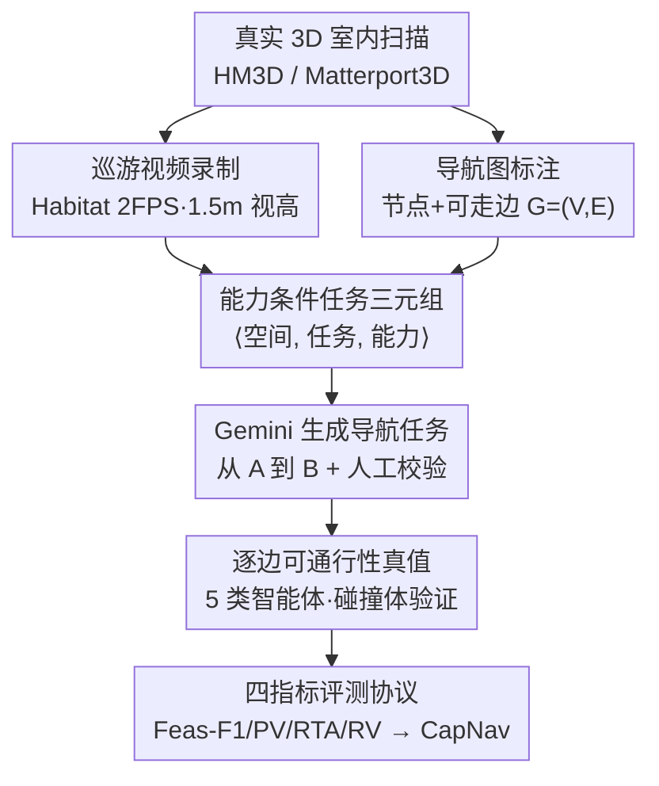

# CapNav: Benchmarking Vision Language Models on Capability-conditioned Indoor Navigation

**会议**: CVPR 2026  
**论文**: [CVF Open Access](https://openaccess.thecvf.com/content/CVPR2026/html/Su_CapNav_Benchmarking_Vision_Language_Models_on_Capability-conditioned_Indoor_Navigation_CVPR_2026_paper.html)  
**代码**: https://makeabilitylab.github.io/CapNav/ （数据集 + 标注工具）  
**领域**: 多模态VLM / 视觉语言导航 / Benchmark  
**关键词**: 能力条件导航, VLM评测, 室内导航, 可通行性, 具身空间推理

## 一句话总结
CapNav 提出一个"能力条件导航"评测基准：给 VLM 一段室内巡游视频、一张导航图、一个带物理/操作能力的智能体画像和一个"从 A 到 B"的任务，看它能否判断该智能体在这个空间里到底能不能走通、走哪条路；在 13 个主流 VLM 上的实验显示，一旦给智能体加上移动约束（不能上楼梯、过道太窄），导航性能就断崖式下跌。

## 研究背景与动机
**领域现状**：VLM 在视觉语言导航（VLN）里被越来越多地当作"导航助手"或机器人的规划模块，给人指路、帮机器人做移动决策。已有 VLN benchmark（R2R、RxR、REVERIE 等）大多在模拟器或图结构环境里评测"与具身无关的到达目标"能力，或把导航简化成 VQA 式的空间推理。

**现有痛点**：真实导航本质上是被智能体的移动能力约束的——扫地机器人过不了楼梯，四足机器人能上楼梯但不会操作电梯，轮椅用户需要足够的转弯/通过净空。但现有 benchmark 普遍忽略这一点：要么是"具身无关"的到达评测，要么用单一标注真值路径来衡量轨迹保真度（如 SPL），完全没考虑同一任务对不同智能体有不同可行性、且常存在多条可行路径。

**核心矛盾**：现实导航的"能力条件有效性"和"解的多样性"，与现有评测范式假设的"单一具身 + 单一真值路径"之间存在根本错配。当 VLM 真被部署到具身控制或辅助场景时，一个无视能力的路线建议可能是不可行甚至危险的。

**本文目标**：构造一个能显式刻画移动约束、允许多条可行解、并能在边级别细粒度评判可通行性的导航评测基准，回答"VLM 给出的导航方案在特定能力约束下到底有没有效"。

**切入角度**：作者采用**被动式（passive）全局观测**设定——把整个场景以巡游视频 + 导航图的形式一次性给模型，而不是让它交互式逐步探索。这样能把"具身约束推理"从"探索噪声/底层控制"中剥离出来，纯粹考察高层的路线规划与可行性判断。

**核心 idea**：用 ⟨空间, 任务, 能力⟩三元组定义导航 query，给 5 类代表性智能体标注**逐边可通行性**真值，让 VLM 在"能不能走通 / 走哪条路 / 路上每条边是否真的可过 / 为什么不可行"四个维度上接受检验。

## 方法详解
CapNav 是一个 benchmark 论文，核心不是模型而是**任务定义 + 真值标注 + 数据构建 + 评测协议**。整体上：每个 query 是一个 ⟨S, τ, a⟩三元组，VLM 输出 $(\hat{y}, \hat{P}, \hat{\rho})$——可行性、路径、理由；CapNav 用四个互补指标把输出和逐边真值对齐打分。

### 整体框架
输入端，空间 $S$ 用一段巡游视频 + 一张人工标注的连通图 $G=(V,E)$ 表示；任务 $\tau$ 是"从源节点到目标节点"的自然语言指令；能力 $a=(\phi,\kappa,\mu)$ 编码智能体的物理尺寸 $\phi$、垂直跨越能力 $\kappa$（单台阶高度、能否连续上下楼梯）和操作能力 $\mu$（能否开门/操作电梯）。VLM 接收三元组后产出 $(\hat{y},\hat{P},\hat{\rho})=f_\theta(S,\tau,a)$，其中 $\hat{y}\in\{0,1\}$ 是任务可行性，$\hat{P}=[v_0,\dots,v_m]$ 是节点序列路径，$\hat{\rho}$ 是不可行时的简短理由。

数据这一侧是一条人工 + Gemini 混合的标注流水线（下图）：从真实 3D 扫描出发，人工录视频、标导航图，用 Gemini 生成任务，再人工在标注界面里逐任务逐智能体标可通行性。

### 关键设计

**1. 能力条件三元组与 5 类代表性智能体：把"谁在走"显式注入导航任务**

针对"现有 benchmark 具身无关"这个痛点，CapNav 把智能体能力做成 query 的一等公民。每个 query 是 ⟨空间, 任务, 能力⟩三元组，能力用一份 capability JSON $a=(\phi,\kappa,\mu)$ 描述：$\phi$ 是物理占地尺寸（高/宽/深），$\kappa$ 是垂直跨越限制（单个障碍的最大可跨高度、能否连续上下楼梯），$\mu$ 是操作/操纵能力（能否开门、操作电梯）。作者定义 5 类覆盖人类与常见机器人的画像：**无运动障碍成人**（默认可走所有路线）、**轮椅用户**（不能上楼梯、需通过/转弯净空）、**人形机器人**（不能上下楼梯、需通过净空 0.9m）、**扫地机器人**（需平整地面）、**四足机器人**（能走大多数空间但不会开门/操作电梯）。这些属性直接决定每条边 $E$ 和整体任务 $\tau$ 的可通行性——同一个"从地下室到顶楼"的任务，轮椅用户该坐电梯，四足只能走楼梯，于是可行性和路径都不同。这正是基准要逼出来的差异。

**2. 逐边可通行性真值与可行性定义：支持多解、可解释的细粒度标注**

针对"单一真值路径无法刻画解的多样性"这个痛点，CapNav 不标注唯一正确路径，而是在**边级别**打二值标签。对每个任务 $\tau$ 和具身 $a$，标注者遍历连接 $v_{\mathrm{src}}$ 和 $v_{\mathrm{tgt}}$ 的每条简单路径，给路径上每条边 $e$ 赋 $g_e^{(a)}\in\{0,1\}$，表示在该局部几何 + 移动能力下这条边能否过；不可通行的边还附一段文字原因（如"无法上下楼梯"）。标注 UI 会把匹配 $\phi$ 的 3D 碰撞体可视化、支持手动移动/转身来验证净空和转弯空间。任务级可行性真值则定义为"是否存在至少一条全边可过的简单路径"：

$$\hat{y}^\star = \mathbb{I}\big[\exists\, P(v_{\mathrm{src}}, v_{\mathrm{tgt}}):\ \forall (u,v)\in P,\ g^{(a)}_{(u,v)}=1\big]$$

这样既允许多条等价可行路径，又能在某条边过不去时给出精确的"卡在哪、为什么卡"，比"和唯一真值路径比对"信息量大得多。

**3. 人工 + Gemini 混合数据构建流水线：从 3D 扫描到 5k+ 可通行标注**

针对"真实、可控、可扩展"三方面需求，作者设计了上图的混合流水线。3D 场景取自 HM3D 和 Matterport3D，在 Habitat 模拟器里以人眼高度（1.5m）、75° 视场、2FPS 手动巡游录制视频，模拟随手拍的走查。每个场景人工标注导航图：节点带语义标签 $c(v)$ 和近似 3D 位置，边表示双向、可直接步行的相邻关系。任务生成交给 Gemini 2.5 Pro（输入视频 + 节点列表），再人工校验任务有效性，最后人工逐智能体标边级可通行性。过滤掉不完整、断连、语义重复或布局过于平凡的场景后，保留 **45 个室内场景**（平均视频 160.38s、13.8 个节点、14.5 条边），产出 **2,365 个导航任务**和 **5,075 条可通行标注**（3,945 正 / 1,130 负）。⚠️ 摘要里写的是"473 navigation tasks, 2365 QA pairs"，与正文/数据集节的"2365 navigation tasks, 5075 traversability annotations"口径不一致，以数据集节为准。

**4. 四指标评测协议与 CapNav 复合分：分维度量化"能力感知导航"**

针对"导航质量是多面的、单一指标会糊掉"这个问题，CapNav 用四个互补指标，整体与逐具身分别报告：

- **可行性分类（Feas-F1）**：二值可行性预测的 F1。
- **路径有效性（PV）**：路径 $\hat{P}$ 在节点合法、相邻边存在、起止正确、无重复节点时才算有效，$\mathrm{PV}=\mathbb{E}[\mathbb{I}(\hat{P}\in\mathcal{P}_{\text{simple}})]$。
- **路线可通行性准确率（RTA）**：在 $\hat{y}=1$ 且路径有效时，衡量预测路径里真正可过的边占比 $\mathrm{RTA}(\hat{P},a)=\frac{\sum_{e\in E(\hat{P})}g_e^{(a)}}{|E(\hat{P})|}$，角色类似 SPL 但以具身可通行性为条件。
- **推理有效性（RV）**：对不可行预测（$\hat{y}=0$），要求模型给出路径 $\hat{P}$ 和失败理由 $\hat{\rho}$，用 LLM-as-judge $J_{\text{LLM}}$ 判断理由是否语义匹配标注原因（人工抽检 300 条，人机一致率 89%）。

复合分 $\mathrm{CapNav}=\lambda_c F_1+\lambda_p \mathrm{PV}+\lambda_t \overline{\mathrm{RTA}}+\lambda_r \overline{\mathrm{RV}}$，$\sum\lambda=1$，默认四项各 0.25。作者还测了权重敏感性：把 0.5 分给某一项、其余各 1/6，四种方案间排名的 Kendall's τ 平均 0.909，说明结论对权重扰动稳健。参考界：随机游走策略给出下界 29.35，4 名人类各做 20 题给出上界（AVG=60.59，最高 74.77）。

## 实验关键数据

### 主实验
在 13 个 VLM（2025 年 11 月评测，含 Gemini 2.5、GPT-4.1/5-Pro、Doubao-Seed、Qwen3-VL，以及专攻空间推理的 Spatial-MLLM、Video-R1）上跑，每模型测 16/32/64 帧及 1FPS 四种输入设定，取最优。下表节选（CapNav 为复合分，单位 %）：

| 模型 | 模式 | Feas-F1 | PV | RTA | RV | CapNav |
|------|------|---------|-----|-----|-----|--------|
| Gemini-2.5-pro | thinking | 84.30 | 73.00 | 79.15 | 32.29 | **67.18** |
| GPT-5-pro | thinking | 86.87 | 67.90 | 75.89 | 34.81 | 66.37 |
| Gemini-2.5-flash | thinking | 84.16 | 65.12 | 68.96 | 38.04 | 64.07 |
| Doubao-Seed-1.6 | thinking | 76.16 | 61.94 | 71.93 | 38.44 | 62.12 |
| 人类平均 | — | — | — | — | — | 60.59 |
| Doubao-Seed-1.6 | non-think | 80.26 | 60.00 | 71.92 | 35.47 | 61.91 |
| GPT-4.1 | non-think | 75.90 | 49.00 | 65.51 | 32.86 | 55.82 |
| Spatial-MLLM-4B | thinking | 75.27 | 5.04 | 10.16 | - | 30.15 |
| Video-R1-7B | thinking | 74.57 | 25.50 | 44.66 | 4.82 | 37.39 |
| 随机游走（下界） | — | — | — | — | — | 29.35 |

关键观察：所有模型都超过随机游走下界；最强的 Gemini-2.5-pro / GPT-5-pro 超过人类平均（60.59），但仍低于人类最佳（74.77）。**专门为空间推理设计的 Spatial-MLLM、Video-R1 反而显著垫底**——PV/RTA 极低，说明它们的空间推理训练方案不足以应对 CapNav。

### 逐具身 / 障碍分析（基准的核心发现）
逐智能体可行任务比例本身就极不均衡（见下表），这是性能随约束收紧而下跌的根源：

| 智能体 | 可行任务比例 | 边可通行比例 | 平均 CapNav 分 |
|--------|------------|------------|---------------|
| Human（无障碍成人）| 1.00 | 1.00 | 57.83 |
| Quadrupedal（四足）| 0.97 | 0.96 | 较高 |
| Sweeper（扫地机）| 0.57 | 0.79 | 中 |
| Wheelchair（轮椅）| 0.48 | 0.71 | 中 |
| Humanoid（人形）| 0.22 | 0.43 | **39.12（最低）** |

人形机器人因"不能上楼梯 + 需 0.9m 通过净空"成为最难具身，所有模型在它上面平均分最低。失败模式经 Gemini-3 挖掘 + 人工提炼为四类：**路径幻觉**（N=659/1500，把不相邻节点连起来或违反起止）、**障碍幻觉**（N=418，报告不存在的阻挡如关着的门）、**尺寸忽视**（N=191，忽略窄门/狭窄净空等几何约束）、**能力幻觉**（N=10，理由与给定能力画像矛盾，多见于 MiMo-VL 7B 等小模型）。

### 关键发现
- **能力约束导致系统性退化**：基线具身（无障碍成人）平均 57.83%，约束收紧后下跌，人形仅 39.12%。在无约束设定下表现好不代表能迁移到受约束场景，部署前必须做针对性评测。
- **视觉瓶颈**：开启 thinking 平均涨 ΔCapNav=6.87%，但推理时间约 8×（14.94s→123.94s）；增帧的收益不均衡——强模型（Gemini）受益、弱模型几乎无感，因为"多给证据只有能可靠整合时才有用"，更多视角反而会增加障碍幻觉。
- **尺寸忽视**：所有模型在有显著视觉特征的障碍（楼梯、门槛）上明显好于需隐式度量估计的约束（窄净空、转弯半径）。一个把 2K 任务扩到 13K 并 LoRA 微调 Qwen3-VL-8B 的试点把测试分从 45.26% 提到 55.18%，但推理有效性反降（0.30→0.25），并频繁把可行窄道误判为堵塞——微调能缓解尺寸忽视却带来过激障碍判断。

## 亮点与洞察
- **把"具身能力"做成 query 一等公民**：同一任务对 5 类智能体有不同可行性和路径，这个设定一下子把"具身无关导航 benchmark"的盲区暴露出来，且贴近辅助/机器人部署的真实需求。
- **逐边二值真值 + 可行性存在性定义**：用"是否存在全边可过的简单路径"定义可行性，天然支持多解、又能精确定位"卡在哪条边"，比单一真值路径信息量大得多，RTA 指标也因此能做到边级细粒度。
- **"空间推理专用模型反而垫底"的反直觉结论**：Spatial-MLLM/Video-R1 大幅落后通用强模型，提示当前空间推理训练方案与真实多帧几何推理之间仍有鸿沟，这个 negative result 对后续具身 VLM 训练很有指导意义。
- **可迁移**：用碰撞体可视化 + 手动移动验证净空的标注 UI，以及"人工录视频/标图 + LLM 生成任务 + 人工标真值"的混合流水线，可直接套用到其他需要细粒度几何真值的具身评测上，并支持自定义新智能体画像。

## 局限与展望
- **被动全局观测而非交互式探索**：CapNav 把整个场景一次性给模型，剥离了探索/底层控制噪声，但也意味着评测的是"高层路线规划与可行性判断"，不能直接等同于真实交互式导航能力。
- **依赖模拟器渲染视频 + LLM 生成任务**：视频来自 Habitat 渲染、任务由 Gemini 生成（虽人工校验），与真实手持拍摄/真人指令仍有 domain gap；RV 用 LLM-as-judge（89% 一致）也引入一定噪声。
- **数据口径不一致**⚠️：摘要与正文对任务数/标注数的描述（473 vs 2365 tasks）存在矛盾，读者引用时需以数据集节为准。
- **改进方向**：作者计划用 embodiment 约束下的 task-level reward 做 RL 微调，并注入空间信息（深度估计、拓扑先验、类地图中间表示）来缓解尺寸忽视；联合优化"障碍感知"和"尺寸推理"以免微调引入过激误判。

## 相关工作与启发
- **vs 传统 VLN benchmark（R2R / RxR / REVERIE）**: 它们做具身无关的逐步到达、用单一真值路径算 SPL；CapNav 显式建模 5 类具身能力、用逐边真值支持多解，区别在于把"谁在走、能不能走"纳入评测，更贴近真实部署。
- **vs 被动式导航评测（VideoNavQA / OpenEQA / NRNS）**: 同样用预录视频/全局观测剥离探索噪声；CapNav 在此基础上加入图结构空间抽象和能力条件可通行性，专门考察跨帧几何推理与可行性判断。
- **vs 带移动约束的导航研究（VLN-PE / NaviTrace / VAMOS）**: VLN-PE 偏模拟器内跨具身物理差异，NaviTrace 做 2D trace 预测，VAMOS 是 affordance 分层规划器；CapNav 的差异在于在含多楼层转换、瓶颈、无障碍可供性等真实障碍的复杂室内空间里，显式验证"多解、能力条件的路线可行性"。

## 评分
- 新颖性: ⭐⭐⭐⭐⭐ 首个把"具身移动能力"做成 query 一等公民、用逐边真值支持多解的能力条件导航基准。
- 实验充分度: ⭐⭐⭐⭐ 13 个 VLM、四指标、逐具身/逐障碍/帧预算/失败模式全面剖析，还有微调试点；但口径不一致和 LLM 生成任务略减分。
- 写作质量: ⭐⭐⭐⭐ 问题动机和指标定义讲得清楚，图表丰富；摘要与正文数据口径矛盾是瑕疵。
- 价值: ⭐⭐⭐⭐⭐ 对具身/辅助导航的安全部署有直接评测价值，并开源数据 + 标注工具支持扩展。

<!-- RELATED:START -->

## 相关论文

- [\[CVPR 2026\] β-CLIP: Text-Conditioned Contrastive Learning for Multi-Granular Vision-Language Alignment](b-clip_text-conditioned_contrastive_learning_for_multi-granular_vision-language_.md)
- [\[CVPR 2026\] GraphVLM: Benchmarking Vision Language Models for Multimodal Graph Learning](graphvlm_benchmark_vlm_graph_learning.md)
- [\[CVPR 2026\] Unleashing the Intrinsic Visual Representation Capability of Multimodal Large Language Models](unleashing_the_intrinsic_visual_representation_capability_of_multimodal_large_la.md)
- [\[CVPR 2026\] SVHalluc: Benchmarking Speech-Vision Hallucination in Audio-Visual Large Language Models](svhalluc_benchmarking_speech-vision_hallucination_in_audio-visual_large_language.md)
- [\[CVPR 2026\] From Indoor to Open World: Revealing the Spatial Reasoning Gap in MLLMs](from_indoor_to_open_world_revealing_the_spatial_reasoning_gap_in_mllms.md)

<!-- RELATED:END -->
