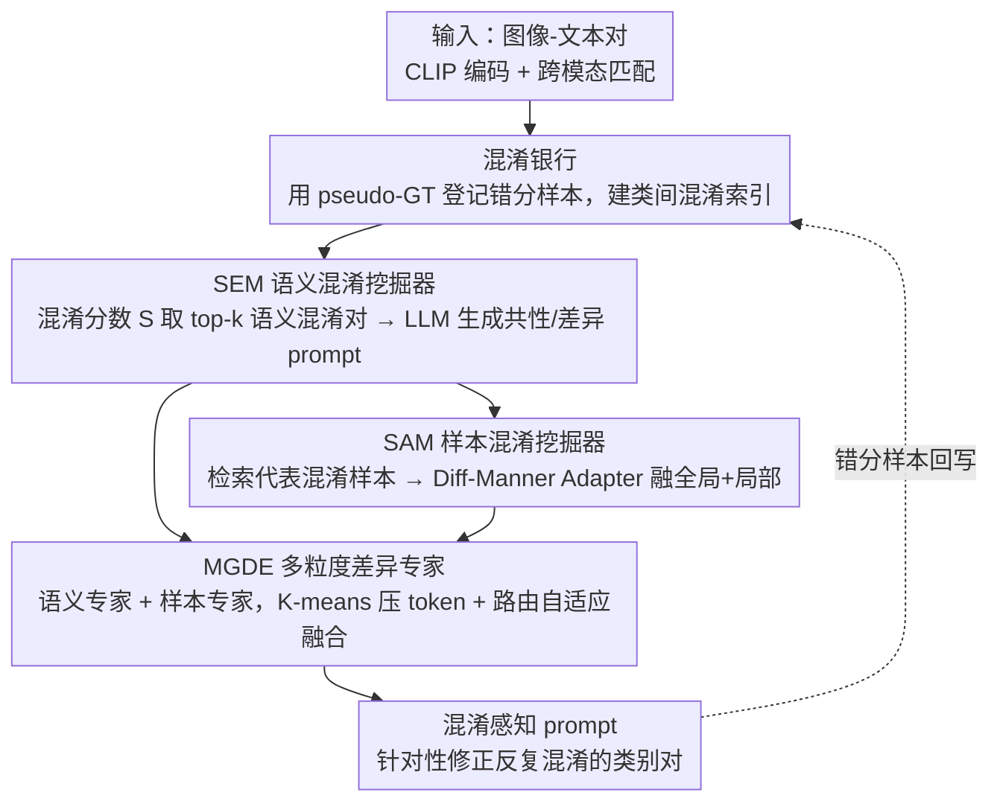

<!-- 由 src/gen_stubs.py 自动生成 -->
# CAPT: Confusion-Aware Prompt Tuning for Reducing Vision-Language Misalignment

**会议**: CVPR2026  
**arXiv**: [2603.02557](https://arxiv.org/abs/2603.02557)  
**代码**: [github.com/greatest-gourmet/CAPT](https://github.com/greatest-gourmet/CAPT)  
**领域**: 多模态VLM  
**关键词**: prompt tuning, 视觉语言对齐, 混淆感知, CLIP, 小样本, 细粒度分类

## 一句话总结
提出 CAPT 混淆感知 prompt tuning 框架，通过语义混淆挖掘器（SEM）和样本混淆挖掘器（SAM）显式建模 VLM 的系统性误对齐模式，配合多粒度差异专家（MGDE）融合不同层次的混淆信息，在 11 个基准上取得 HM 83.90% 的最优表现。

## 研究背景与动机

**领域现状**：CLIP 等视觉语言模型存在系统性误对齐——特定类别对之间的混淆不是随机的，而是持续发生的固定模式。例如 OxfordPets 数据集中，terrier 被错分为 bulldog 多达 30 次，却几乎不会被误认成其他类。

**现有痛点**：现有 prompt tuning 方法（MaPLe、PromptSRC）只优化全局图像-文本特征对齐，忽略了这种固定的混淆模式；而误对齐的根源在于视觉和语义上高度相似类别之间模糊的语义边界和局部表示相似性，全局对齐无力消除。

**切入点**：应当让模型从自身的误对齐中学习——显式建模混淆关系并加以修正，同时从混淆样本里挖掘可区分的细粒度线索，而这正是现有方法没做的。

## 方法详解

### 整体框架

CAPT 把「从误对齐中学习」做成一条闭环：在 CLIP 的 prompt tuning 之上挂一个**混淆银行**记录被错分的样本，再用**语义混淆挖掘器**（SEM）从语义层面挖出最该修的混淆对，**样本混淆挖掘器**（SAM）在这些混淆对上补上细粒度的样本线索，最后由**多粒度差异专家**（MGDE）把语义、样本两路信息融合进 prompt，针对性地修正那些反复混淆的类别对；修正后的新预测又把错分样本回写混淆银行，构成持续学习的闭环。

### 关键设计

**1. 混淆银行：把模型的系统性错误存下来当训练信号**

要从误对齐中学习，先得知道模型到底在哪些类别对上反复犯错。混淆银行为每个样本记录它被误分类到的类别，从而维护一份类间混淆关系索引。这里用 pseudo-GT（模型置信度最高的预测类）而非标注 GT 来登记，因为前者更真实地反映模型「以为是什么」的混淆倾向，把零散的错误聚合成可挖掘的固定模式。

**2. SEM：从语义层面挖出最该修的混淆对**

混淆银行里的关系有强有弱，SEM 负责挑出最值得修的语义混淆对。它用历史混淆统计 $n_i$ 和当前样本置信度 $C_i$ 算混淆分数 $S_i = (1 + \frac{n_i}{\sum n_i}) C_i$，取 top-k 生成语义混淆对，再让 LLM（CoT 风格）为每对生成「共性（commonality）」和「差异（difference）」两类 prompt——共性帮模型理解为什么会混，差异帮它学会怎么分。

**3. SAM：从样本层面补上细粒度的可区分线索**

语义层面是全局的，但区分两个相似类往往靠局部细节。SAM 从混淆银行检索混淆样本集 $U \in \mathbb{R}^{c \times l}$，选出与当前实例特征最相似的代表样本 $I_c^* = \arg\max \cos(E_I(I), E_I(U_j^i))$，再用 Diff-Manner Adapter 把 ViT 的全局注意力和 2D 深度可分离卷积的局部细节融在一起：

$$[X] \leftarrow [X] + \alpha \cdot DWConv2D(\hat{[X]})$$

这样既保留全局语义，又补回了全局对齐丢掉的局部判别信息。

**4. MGDE：用 MoE 自适应融合两种粒度的混淆信息**

语义混淆和样本混淆各有侧重，硬融合会互相干扰。MGDE 用 MoE 架构分设语义专家（由文本的差异/共性 prompt 初始化）和样本专家（由 CLIP FFN 初始化），先用 K-means 聚类压缩 prompt token、去掉低区分度的 token，再由路由网络自适应决定各专家的输出权重，让模型按样本难度在「全局混淆模式」和「细粒度差异」之间动态取舍。

### 损失函数

$$\mathcal{L} = \mathcal{L}_{ori} + \mathcal{L}_{confuse}$$

- $\mathcal{L}_{ori}$：标准交叉熵对齐损失
- $\mathcal{L}_{confuse}$：InfoNCE 风格对比损失，作用于混淆样本特征和 prompt

## 实验关键数据

### 主实验：Base-to-New 泛化（16-shot）

| 方法 | Base | Novel | HM |
|------|------|-------|-----|
| CoOp (IJCV'22) | 82.69 | 63.22 | 71.66 |
| MaPLe (CVPR'23) | 82.28 | 75.14 | 78.55 |
| PromptKD (CVPR'24) | 86.96 | 80.73 | 83.73 |
| TAC (CVPR'25) | 85.42 | 77.60 | 81.24 |
| 2SFS (CVPR'25) | 85.55 | 75.48 | 80.20 |
| **CAPT (本文)** | **87.41** | **80.90** | **83.90** |

### 混淆样本修复率

| 指标 | 数值 |
|------|------|
| 混淆样本对修复率 | 50.72% |
| Base 类准确率 | 87.41% |
| Novel 类准确率 | 80.90% |

### 关键发现
- CAPT 在 HM 上超越所有先前方法，Base 和 Novel 类均有显著提升
- 50.72% 的混淆样本对被成功修复，验证了混淆感知学习的有效性
- SEM 和 SAM 各自贡献互补——语义层面捕获全局混淆模式，样本层面捕获细粒度差异

## 亮点与洞察
- 独特视角：从模型自身误对齐中挖掘改进信号，变"bug"为"feature"
- 混淆银行的设计简洁有效，为后续研究提供了可复用的工具
- Diff-Manner Adapter 融合 ViT 全局性和 CNN 局部性的思路有普适价值

## 局限与展望
- pseudo-GT 的质量依赖模型初始预测能力，弱模型可能产生噪声过大的混淆银行
- LLM 生成语义 prompt 的质量和一致性未充分分析
- 模型复杂度增加（SEM+SAM+MGDE），训练成本可能显著高于简单 prompt tuning

## 相关工作与启发
- 与 PromptSRC/MaPLe 的本质区别：关注的不是如何更好地对齐，而是如何从误对齐中学习
- 混淆银行思想可迁移到对比学习中的难负例挖掘
- 启发：模型的系统性错误模式本身是有价值的信号，值得在更多任务中被利用

## 评分
- 新颖性: ⭐⭐⭐⭐⭐ (混淆感知的视角非常新颖，从误对齐中学习)
- 实验充分度: ⭐⭐⭐⭐ (11 个数据集，充分的消融和可视化)
- 写作质量: ⭐⭐⭐⭐ (框架图清晰，方法描述系统)
- 价值: ⭐⭐⭐⭐ (prompt tuning 的新方向，混淆修复率指标有启发性)

<!-- RELATED:START -->

## 相关论文

- [\[CVPR 2026\] Improving Calibration in Test-Time Prompt Tuning for Vision-Language Models via Data-Free Flatness-Aware Prompt Pretraining](improving_calibration_in_test-time_prompt_tuning_for_vision-language_models_via_.md)
- [\[CVPR 2026\] Towards Calibrating Prompt Tuning of Vision-Language Models](towards_calibrating_prompt_tuning_of_vision-language_models.md)
- [\[CVPR 2026\] Cluster-Aware Neural Collapse Prompt Tuning for Long-Tailed Generalization of Vision-Language Models](cluster-aware_neural_collapse_prompt_tuning_for_long-tailed_generalization_of_vi.md)
- [\[CVPR 2026\] FedMPT: Federated Multi-Label Prompt Tuning of Vision-Language Models](fedmpt_federated_multi-label_prompt_tuning_of_vision-language_models.md)
- [\[CVPR 2026\] Noise-Aware Few-Shot Learning through Bi-directional Multi-View Prompt Alignment](noise-aware_few-shot_learning_through_bi-directional_multi-view_prompt_alignment.md)

<!-- RELATED:END -->
