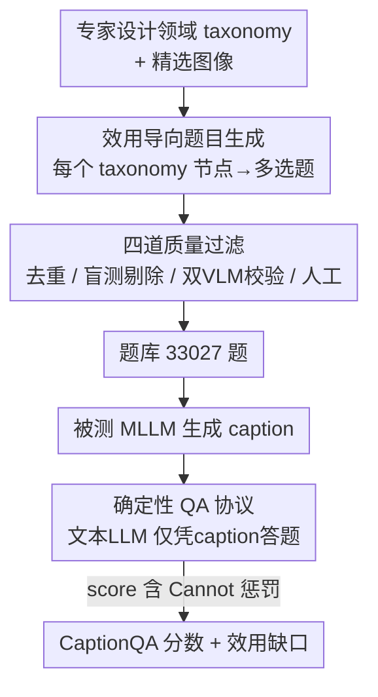

# CaptionQA: Is Your Caption as Useful as the Image Itself?

**会议**: CVPR 2026  
**论文**: [CVF Open Access](https://openaccess.thecvf.com/content/CVPR2026/html/Yang_CaptionQA_Is_Your_Caption_as_Useful_as_the_Image_Itself_CVPR_2026_paper.html)  
**代码**: https://captionqa.github.io/website/ （项目页，含开源构建 pipeline）  
**领域**: 多模态VLM  
**关键词**: 图像描述评测, 下游效用, QA-on-caption, 多模态基准, 领域 taxonomy  

## 一句话总结
CaptionQA 把"图像描述好不好"重新定义为"这段 caption 能不能替图像撑起下游任务"，用一个纯文本 LLM 仅凭 caption 去答 33,027 道密集多选题，直接量出 caption 相对原图损失了多少可用信息——结果发现连最强闭源模型都掉 9–16%，开源模型在 Embodied AI 上甚至掉超过 40%。

## 研究背景与动机
**领域现状**：在检索、推荐、agent/具身流水线里，caption 越来越多地被当成图像的"廉价替身"——把非结构化的视觉输入转成可搜索、可分析、可作为长期记忆的文本信号。但学术界评 caption 的方式还停留在两套老路：一是 BLEU/CIDEr/SPICE/CHAIR 这类和参考句比 n-gram 重叠或抽语义元组的指标，二是近年流行的 "VLM-as-a-Judge"（CapArena、CAPability）让一个大模型给长 caption 打分。

**现有痛点**：n-gram 指标早被证明抓不住事实性错误、和人类判断弱相关；object-centric 解析法（抽 fact 算 precision/recall）依赖复杂的 LLM judge 或图匹配，不确定、难复现，而且只覆盖自然图像。VLM-as-Judge 把评分外包给一个黑盒模型，分数随 prompt 和 API 版本漂移，更糟的是它把"效用"和"啰嗦"混为一谈——为了"详尽"反而鼓励模型产出又长又噪声的 caption。至于 MMBench/MMMU 这类 QA 基准，测的是"看着图被动答题"，每图才 1–2 题，根本不是"主动生成完整描述"这个能力的代理。

**核心矛盾**：所有现有评测都在问"caption 写得像不像 / 全不全"，但真正该问的是"caption 在实际使用场景里能不能顶替图像"。一段 caption 写多少细节不重要，重要的是它有没有保住**对目标用途有用**的那些细节。这两件事不是一回事——啰嗦的 caption 可能效用更低。

**本文目标**：造一个以"下游效用"为第一性原理的 caption 基准，让 caption 的好坏由"它支撑下游任务的程度"来度量，并且要确定性、可复现、跨多个高价值专业领域。

**切入角度**：既然"效用"是领域相关的（自然图像看物体属性、文档看版式结构、电商看商品属性、具身看可供性），那就给每个领域请专家写一套细粒度 taxonomy，列出该领域下游任务真正需要的信息，再据此把这些信息点变成"必须看图才能答"的多选题。

**核心 idea**：用 "QA-on-caption" 代替"和参考句比对"——让一个纯文本 LLM 只拿 caption（看不到图）去答这些题，答对率就直接等于 caption 保住了多少图像级效用；再拿同样的题让模型直接看图答（QA-on-image）作上界，两者之差就是 caption 的"效用缺口"。

## 方法详解

### 整体框架
CaptionQA 本质是一个**基准 + 评测协议**，不是一个训练好的模型。它分两条线：一条是**离线把题目造出来**（针对每个领域，从 taxonomy 出发生成一大堆候选题，再经四道过滤变成高质量题库）；另一条是**在线给被测 MLLM 打分**（让被测模型生成 caption，再让固定的文本 QA 模型只看 caption 答题，按一套带"答不出"惩罚的计分规则汇总）。

题库构建对所有领域走同一条流水线，唯一的领域相关组件就是 taxonomy：写好一套新 taxonomy，整条生成管线原封不动就能扩展到新领域。评测协议则把"被测模型"和"QA 评判模型"解耦——前者随意换（要评谁就让谁写 caption），后者固定为同一个文本 LLM，保证不同被测模型的分数横向可比。

### 关键设计

**1. 效用导向的题目生成：让每道题都钉在一个"下游需要的信息点"上**

针对"现有基准每图才 1–2 题、且不一定真要看图"的痛点，CaptionQA 让题目从领域 taxonomy 长出来。每个领域先由 GPT-5 起草、人类专家迭代合并裁剪，得到一套两级 taxonomy（一级如"物体存在 / 属性 / 空间关系 / 动作 / 场景属性 / 幻觉"，二级如"属性→颜色、形状、大小、文字、材质、状态"），四个领域合计 25 个一级、69 个二级类目。然后对每张图的每个 taxonomy 节点，用三个生成器（GPT-5、4o、o4-mini）各产出一到多道聚焦该信息点的多选题，且每题都记着它来自哪个 taxonomy 节点，便于后续按领域/类目/子类目组织评测。这样最终拿到平均每图 50.3 题、共 33,027 题的密集标注，是真正"覆盖整张图全部有用内容"的探针，而不是稀疏抽样。

**2. 四道质量过滤：把"不看图也能答"和"模糊/重复"的题全部清掉**

题目"必须看图才能答"是这套效用度量成立的前提，否则文本 QA 模型靠世界知识就能蒙对，分数就被污染。作者串了四道过滤（顺序见框架图的 C 节点）：① **盲测剔除**——用 Qwen2.5-72B 在看不到图的情况下答题，每题打乱选项重复 10 次，若正确率超过略高于随机的阈值就判为"文本可答"丢弃；② **嵌入去重**——用 Qwen3-Embedding-8B 把每题+选项编码成 $\ell_2$ 归一化向量，对每张图建相似度阈值 $\tau$ 的互 k-NN 图，连通分量即语义近似题组，取嵌入空间最中心的 medoid 作代表；③ **双 VLM 质控**——把图+题+选项给 GPT-5 和 Gemini 2.5 Pro，在原选项外加四个 meta-flag（题目歧义 / 看图也答不出 / 不适合做 caption 评测 / 以上都不是），只保留两个校验器选了同一项且与原答案一致的高置信题，任何分歧或 flag 都送人工；④ **人工精修**——标注员修答案/改题或丢弃。Table 2 显示过滤前后题目准确率从 86–88% 升到 95–100%，而人工审题量减少了 90% 以上。

**3. 带"答不出"惩罚的确定性计分：奖励"少说但不误导"，惩罚"自信地说错"**

caption 评测最怕两件事：分数不可复现、以及模型靠幻觉细节骗分。为此每道非是非题都额外加一个选项"Cannot answer from the caption."，让 QA 模型在"caption 不够答"时显式选它。每题得分定义为
$$ s = \begin{cases} 1, & \text{选对} \\ 0, & \text{选错} \\ \tfrac{1}{K}+0.05, & \text{选了"答不出"} \end{cases} $$
其中 $K$ 是语义选项数（不含"答不出"那项）。最终分数是所有题 $s$ 的平均，并随机打乱选项序消偏。这套设计的精髓在于第三档：选"答不出"拿的分约等于盲猜期望（$1/K$）再加一点点，所以一段**信息不全但不误导**的 caption，比一段**自信地把人引向错误答案**的 caption 得分更高——明确把 precision 置于 hallucinated detail 之上，正好对上现实里"宁可漏说也别瞎说"的需求。

**4. 系统化挑选 QA 评判模型：让分数本身可信、可大规模跑**

因为所有被测 MLLM 的分数都由这一个文本 QA 模型读 caption 答题决定，它选错了整个 benchmark 就废了，所以作者没有随手用 GPT-5，而是沿四个维度系统比较候选（GPT-5 / Gemini 2.5 Pro / DeepSeek-R1-Llama-70B / Qwen2.5-72B）：**忠实度**（给空 caption 时应几乎总选"答不出"，量它能达到的最大 Cannot ratio，验证它不在没有文本证据时瞎答）、**效率**（QPS，因题量巨大）、**性能**（在固定 caption 池上的答题准确率）、**稳定性**（temperature 0 跑三遍的准确率标准差）。最终选 Qwen2.5-72B：21.14 QPS、三遍准确率仅 ±0.02% 波动，单张 AMD MI325 GPU 25 分钟跑完全库；虽然忠实度（92.61%）和准确率（68.98%）略逊 GPT-5，但快了约两个数量级，让大规模 caption 评测真正可行。

### 一个完整示例
拿一张电商商品页跑一遍：被测模型（比如 GPT-5）先用 Simple prompt 生成一段约 317 词的 caption；QA 模型 Qwen2.5-72B 拿到这段文字（看不到图）逐题作答。假设有一题问"该商品的材质是什么？"，若 caption 写清了材质则答对得 1 分，若 caption 只说了颜色没提材质，理想情况下 QA 模型选"Cannot answer"得 $1/K+0.05$ 分而非乱选一个错答案得 0 分。同一张图的所有题这样跑完取平均，就是该模型在这张图上的 CaptionQA 分。把电商域所有图平均，GPT-5 拿到约 94.7%；而让它直接看图答同样的题（QA-on-image）能到接近 96–99%，两者之差就是电商域的效用缺口——电商是缺口最小的域（最优模型仅丢约 5%），因为商品信息天然好用文字描述。

## 实验关键数据

### 主实验
作者在 4 个领域、4 种 caption prompt 下评了 24 个 MLLM，统一用 Qwen2.5-72B 做 QA 模型。下表节选 Simple/Long prompt 下的 CaptionQA 总分（score %，越高表示 caption 越接近图像效用）：

| Prompt | 模型 | 规模 | Overall | Natural | Document | E-com. | Embodied AI |
|--------|------|------|---------|---------|----------|--------|-------------|
| Simple | GPT-5 | – | **90.29** | 88.78 | 90.81 | 94.73 | 86.82 |
| Simple | Gemini 2.5 Flash | – | 89.64 | 88.95 | 88.97 | 95.73 | 84.89 |
| Simple | Qwen3-VL | 30B-A3B | 87.02 | 86.14 | 85.89 | 93.90 | 82.15 |
| Simple | GLM-4.1V | 9B | 84.28 | 81.67 | 87.86 | 92.04 | 75.56 |
| Simple | LLaVA-OneVision | 7B | 66.03 | 66.56 | 61.45 | 75.09 | 61.01 |
| Long | Gemini 2.5 Pro | – | 90.12 | 89.44 | 88.67 | 95.60 | 86.78 |
| Long | Claude Sonnet 4.5 | – | 80.97 | 77.78 | 85.08 | 91.11 | 69.90 |

闭源模型整体领先（GPT-5、Gemini 居首），开源里 Qwen3-VL-30B-A3B、GLM-4.1V-9B 最强。分数强烈依赖领域：电商最易（多在 77–96%），Embodied AI 最难（约 66–87%）。

更关键的是**效用缺口**（QA-on-caption 相对 QA-on-image 的绝对掉分，越低越好）：

| 模型 | Natural | Document | E-com. | Embodied AI |
|------|---------|----------|--------|-------------|
| GPT-5 | 11.30 | 6.72 | 4.96 | 13.81 |
| Gemini-2.5-Pro | 12.02 | 10.11 | 5.03 | 15.78 |
| Claude-Sonnet-4.5 | 19.39 | 8.47 | 8.80 | 29.06 |
| Qwen3-VL-30B-A3B | 12.09 | 10.06 | 4.87 | 16.96 |
| GLM-4.1V-9B | 17.12 | 7.79 | 6.62 | 24.86 |
| LLaVA-OV-7B | 34.14 | 28.73 | 24.97 | 41.81 |

题目本身在有图时并不难（GPT-5 的 QA-on-image 接近 98%），但换成只看自己写的 caption，强闭源模型一致掉 9.2–16.4%，开源模型掉 11–32.4%，Embodied AI 域 LLaVA-OV 掉超过 40%——意味着只留 caption 时近一半的图像级有用信号丢了。

### 消融 / 分析实验
两组分析回答"加复杂 prompt 或写更长能不能补上缺口"：

| 配置变化 | 平均效果 | 说明 |
|----------|---------|------|
| Long → Taxonomy-Hinted | **−10.8%**（25 类中 23 类下降） | 复杂 prompt 反而更差，文档域专项掉 −33.1% |
| Short → Simple（21→317 词） | **+33.8%** | 单这一步就拿到 Long 全部收益的 99% |
| Simple → Long（317→471 词） | +0.35%（全 25 类 <2%） | 继续加长几乎无收益 |

### 关键发现
- **小差距藏大鸿沟**：在传统 QA-on-image 上几乎相同的模型，caption 效用可能天差地别——Claude Sonnet 4.5 和 LLaVA-OV-7B 在 QA-on-image 上只差 1.1%，但 caption 分差 17.2%；GPT-5 和 LLaVA-OV-7B 看图只差约 9%，caption 分却差 32.3%。说明 MMBench/MME 会把它们判为"接近"，CaptionQA 才暴露出 caption 携带的可用信息量差异巨大。
- **缺口跨域极不均匀**：电商缺口最小（产品信息易文字化），Embodied AI 最大（机器人相关表达是当前 MLLM 的真·短板），自然/文档居中（丢在空间关系、细粒度属性、文档结构上）。
- **复杂 prompt 为何反噬**：被 Taxonomy-Hinted 这类复杂指令引导时，模型常把指令当模板照搬，输出"填空式"的枚举句，表面提到了概念却没真正描述，发生从"内容 grounding"到"格式模仿"的滑移——揭示了指令遵循与视觉理解之间的张力。
- **长度边际递减且分域**：文档结构元素、电商文字内容从 Short→Simple 涨 41–56%（属于"信息在但没说出来"的 verbalization 瓶颈），而 Embodied AI 只涨 6–34%（属于"信息根本没看出来"的 information 瓶颈）。作者据此推荐 Simple 作默认 prompt。

## 亮点与洞察
- **把评测目标从"像不像"换成"能不能用"**：QA-on-caption 这个协议最巧妙的地方是用一个确定性文本 LLM 当"下游任务的代理人"，绕开了 VLM-as-Judge 的黑盒不可复现，又比 n-gram 指标真正抓到了语义效用——这是可迁移到任何"生成物是否保住信息"评测的思路（如评摘要、评检索 index）。
- **"答不出"选项 + 计分公式联手**：第三档得分 $1/K+0.05$ 不是随手设的，它把"诚实地承认信息不足"的收益钉在略高于盲猜，从机制上让"少说但不误导"优于"瞎说"，直接对抗 caption 评测里最顽固的幻觉刷分问题。
- **QA 模型选型本身是一项贡献**：很多 benchmark 默认"用最强模型当裁判"，本文却论证了在大规模、需可复现的场景下，一个稍弱但快两个数量级、方差极小的 Qwen2.5-72B 才是更对的裁判——把"裁判可信度"显式拆成忠实度/效率/性能/稳定四维去验证，值得其他 benchmark 借鉴。
- **领域 taxonomy = 唯一可插拔件**：整条造题管线对领域无关，扩展新领域只需写一套 taxonomy，工程上把"基准可持续扩展"这件事真正做轻了。

## 局限与展望
- **依赖 QA 模型这一单点**：所有分数都建立在 Qwen2.5-72B 的答题行为上，它 92.61% 的忠实度意味着仍有约 7% 情况会在证据不足时硬答；换一个 QA 模型，横向排名是否完全保持，论文没给出 robustness 分析。⚠️ 以原文为准。
- **题目由 GPT-5/4o/o4-mini 生成**：候选题来自几个强模型，可能继承它们的能力盲区与偏好（比如对它们也看不清的细节根本不会出题），benchmark 的"上界"可能被生成器能力悄悄框住。
- **图像规模偏小**：657 张图、靠人工精选，虽然每图题密（50.3 题），但图像多样性和长尾覆盖受限，尤其 Embodied AI 仅 200 张。
- **改进方向**：作者主张 Embodied AI 的"机器人相关表达效用"是当前 MLLM 急需补的能力；从评测者角度，下一步可把 QA-on-caption 协议接进真实下游系统（检索/agent）做端到端验证，看 benchmark 分数与真实任务收益的相关性。

## 相关工作与启发
- **vs n-gram / object-centric 指标（BLEU、CIDEr、SPICE、CHAIR）**：它们比文本重叠或抽语义元组，抓不住"对下游有没有用"，且只覆盖自然图像；CaptionQA 直接用下游答题效用度量，跨四个专业领域，且确定性可复现。
- **vs VLM-as-Judge（CapArena、CAPability、DeCapBench）**：它们让黑盒 VLM 给长 caption 打分，分数随 prompt/API 漂移，还把"详尽"误当"有用"；CaptionQA 用固定文本 LLM + 客观多选答案，既可复现又把"啰嗦≠效用"这件事用实验证明（长度边际递减）。
- **vs QA-based 多模态基准（MMBench、MMMU）**：它们测"看图被动答题"、每图 1–2 题，本文测的是"主动生成完整描述"的能力、每图 50.3 题，并显式构造"必须看图才能答"的题目，是对 caption 效用的密集探针而非稀疏抽样。

## 评分
- 新颖性: ⭐⭐⭐⭐⭐ 把 caption 评测重定义为"下游效用"，QA-on-caption 协议 + "答不出"计分是一套自洽且可复现的新范式。
- 实验充分度: ⭐⭐⭐⭐⭐ 24 模型 × 4 域 × 4 prompt，外加效用缺口、prompt/长度两组分析与 QA 模型选型，覆盖很全。
- 写作质量: ⭐⭐⭐⭐ 动机与协议讲得清楚，部分原文公式排版有损（计分式需对照原文核对）。
- 价值: ⭐⭐⭐⭐⭐ 给"caption 当图像替身"的真实场景提供了可落地、可扩展的选型与评测工具，开源 pipeline 进一步放大影响。

<!-- RELATED:START -->

## 相关论文

- [\[CVPR 2026\] Rethinking MLLM Itself as a Segmenter with a Single Segmentation Token](rethinking_mllm_itself_as_a_segmenter_with_a_single_segmentation_token.md)
- [\[CVPR 2026\] ROSE: Rotate Your Large Language Model to See](rose_rotate_your_large_language_model_to_see.md)
- [\[CVPR 2026\] One Patch to Caption Them All: A Unified Zero-Shot Captioning Framework](one_patch_to_caption_them_all_a_unified_zero-shot_captioning_framework.md)
- [\[CVPR 2026\] Is your VLM Sky-Ready? A Comprehensive Spatial Intelligence Benchmark for UAV Navigation](is_your_vlm_sky-ready_a_comprehensive_spatial_intelligence_benchmark_for_uav_nav.md)
- [\[NeurIPS 2025\] Unifying Vision-Language Latents for Zero-Label Image Caption Enhancement](../../NeurIPS2025/multimodal_vlm/unifying_vision-language_latents_for_zero-label_image_caption_enhancement.md)

<!-- RELATED:END -->
