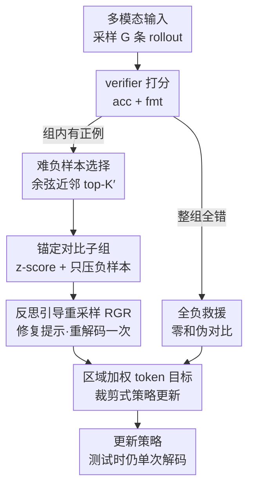

# CARE What Fails: Contrastive Anchored-REflection for Verifiable Multimodal Reasoning

**会议**: CVPR 2026  
**论文**: [CVF Open Access](https://openaccess.thecvf.com/content/CVPR2026/html/Wang_CARE_What_Fails_Contrastive_Anchored-REflection_for_Verifiable_Multimodal_Reasoning_CVPR_2026_paper.html)  
**代码**: 未公开（论文未提供链接）  
**领域**: 多模态VLM / 可验证多模态推理  
**关键词**: RLVR, GRPO, 对比优势归一化, 难负样本, 反思自修复  

## 一句话总结
CARE 是一套"以失败为中心"的多模态推理 RLVR 后训练框架：把组内最佳 rollout 当锚点、围绕它挑一小撮"差一点就对"的难负样本做子组内 z-score 归一化并只压制负样本，再对代表性失败做一次结构化反思重采样，把"近似错误"变成监督信号，在 Qwen2.5-VL-7B 上六个可验证视觉推理基准 macro 平均比 GRPO 高 4.62 分。

## 研究背景与动机
**领域现状**：多模态大模型（MLLM）的推理能力越来越多地靠 RLVR（带可验证奖励的强化学习）来提升——用程序化 verifier（答案检查器）给出确定性的 pass/fail 奖励，再用 GRPO 这类组相对方法，对同一个 query 采样多条 rollout、用组内蒙特卡洛优势替代 critic 来更新策略。这条路在数学、代码上已被 DeepSeek-R1 等验证有效。

**现有痛点**：当 rollout 预算很小（论文设 $G=8$）时，GRPO 暴露两个老毛病。其一是**梯度方差大、训练不稳**：一个组里若全错，优势全为零、梯度直接停摆；其二是**信用分配太粗**：组里偶然蒙对一条时，更新会无差别地奖励这条链，却完全无视"其余几条错在哪、离正确有多近"，结果常常把一条**侥幸蒙对的虚假推理链**也一并强化了。

**核心矛盾**：RLVR 手里其实握着信息量最大的数据——失败样本，但现有目标函数把它们当噪声丢掉了。一条"差一步就对"的难负样本和一条"完全跑偏"的负样本，在 GRPO 里被同等对待，对比信号被稀释。

**本文目标**：在**不改变测试时解码**（推理仍是单次 decode、不做 test-time reflection）的前提下，把失败转成可用的学习信号，同时显式提高"来自失败的学习信号占比"。

**切入角度**：作者观察到，真正有教学价值的对比，是把"组内最好的那条"和"语义上最接近它、但被 verifier 判错"的那几条放在一起比——这才是 near-miss，而不是把无关失败模式混在一锅里归一化。

**核心 idea**：用一条**锚点 + 难负样本子组**替代整组做对比归一化（anchored-contrastive），并对挑出来的代表性失败做**一次性结构化反思重采样**（RGR），把近似错误就地修成正例或弱化的负例。

## 方法详解

### 整体框架
CARE 在标准 RLVR 流程（采样 $G$ 条 rollout → verifier 打分 → 更新策略）之上，把"组内怎么算优势、失败怎么用"这两件事重做了一遍。一次更新的数据流是：先对多模态输入 $x=\langle I, q\rangle$ 采样固定数量 rollout，verifier 只解析 `<answer>` 段给出准确率与格式奖励；然后挑出**锚点**（verified-correct 里推理最短的那条）、用**余弦近邻**从失败池里选 $K'$ 个难负样本组成子组 $S$；在子组内做 **z-score 归一化 + 只压负样本**得到优势；当组里存在正例时触发**反思引导重采样（RGR）**，对一个难负样本插入修复提示、重解码一次，成功就替换原失败、失败就保留为弱化负例；若整组全错则走**全负救援**给一个零和伪对比，避免梯度冻结；最后用**区域加权 token 目标**做裁剪式策略更新。

### 关键设计

**1. 锚定对比子组：用"最佳 rollout + 难负样本"做局部归一化，而不是整组**

针对 GRPO"整组归一化把 near-miss 和无关失败一锅炖、信用分配太粗"的痛点。设 verifier 判对的集合为 $P=\{i: \text{acc}[x,y_i]=1\}$，锚点取**推理最短**的正例 $y^+=\arg\min_{i\in P} T_i^{\text{think}}$（同分再偏向更短答案），直觉是"用最简洁的正确解当参照系"。再从难负样本选择器拿到 $K'$ 个负例，组成紧凑子组 $S=\{y^+\}\cup\{y_1^-,\dots,y_{K'}^-\}$（负样本不够时 $K'=\min(K, |\{\text{acc}=0\}|)$，缩到能凑多少算多少）。子组内做 z-score 归一化：$\mu_S,\sigma_S$ 为子组奖励的均值与标准差，原始优势 $A_{\text{raw}}[y]=(r[y]-\mu_S)/\sigma_S$（子组外置零）。

关键的"非对称"处理在于**负样本惩罚缩放**：锚点优势原封不动 $A[y^+]\leftarrow A_{\text{raw}}[y^+]$，而每个负样本被乘上 $s\in(0,1]$ 衰减——$A[y_j^-]\leftarrow -s\,|A_{\text{raw}}[y_j^-]|$（默认 $s=0.5$）。作者还给出了机制签名：在"一个正例 + $K'$ 个同水平负例"的两层结构下，z-score 会自然产生

$$A_{\text{raw}}[y^+]\approx \zeta\sqrt{K'},\qquad A_{\text{raw}}[y_j^-]\approx -\zeta\,\frac{1}{\sqrt{K'}}$$

（严格二值奖励、间隔为 1 时 $\zeta=1$）。也就是说锚点的正向推力随子组里难负样本数 $\sqrt{K'}$ 增长，单个负样本的反推力则按 $1/\sqrt{K'}$ 衰减——子组越"难"，对比越聚焦于把正确解从一堆似是而非的失败里推开，而不会被某一条负样本带偏。当 $K'<K$ 时再乘全局因子 $\sqrt{K/K'}$ 把不同组的更新幅度拉齐（只改大小不改方向）。

**2. 难负样本选择：余弦近邻挑"差一点就对"的失败，而非随机负样本**

针对"对比信号要瞄准 near-miss、不能混入无关失败模式"。verifier 的对错只当一个二值门，真正排序靠**推理语义的接近度**：对失败池 $F=\{i:\text{acc}=0\}$ 里每条，把 `<think>` 段最后一层隐状态做 mean-pooling、再 $\ell_2$ 归一化得到推理嵌入 $\tilde h_i$（停梯度，不反传），与锚点嵌入 $\tilde h^+$ 算余弦距离 $d_{\cos}(i)=1-\tilde h_i^\top \tilde h^+$。按 $d_{\cos}$ 升序取前 $K'$ 条做难负样本；为减少冗余先取前 $M>K'$ 个最近邻、在这个子集里做一遍 farthest-first 去重再返回 $K'$ 个。这样选出来的负样本是"推理过程和正确解很像、但结论错了"的真·近似错误，对比时才能教会策略**分辨细微差别**，而不是去区分两个八竿子打不着的错误。消融里 COSINE-TopK′ 收敛到 ~50.57，随机选只能停在 ~43.06，且 NEAREST > MIXED > FARTHEST，印证"混入或专挑远负样本会增大子组异质性、削弱对比"。

**3. 反思引导重采样（RGR）：对代表性失败做一次结构化自修复，把近似错误变正例**

针对"失败样本被动浪费"。仅当子组里**已有正例**时触发：选一条正例 $y^+$ 和一条难负样本 $y^-$，在 $y^-$ 的 `<think>` 段插一段简短修复提示（"你上一步推理有误，找出出错的运算、改正、重新推导，保持简洁"），用**完全相同的解码超参再解码一条** rollout，并用同一个 verifier 重新打分。两种处置：若反思样本**成功**，就用它**替换**子组里原来的失败；若仍**失败**，保留为负例但用更小的惩罚缩放 $s_{\text{refl}}=s/2$（默认 0.25），避免对它过度锐化。整个 RGR 只在训练期发生、推理时绝不调用，因此不增加任何 test-time 成本。消融证明收益来自"修复提示"而非单纯多采一次：触发条件下 RGR 的修复成功率 76.6%，远高于无提示重采样（19.3%）和随机重采样（12.8%）。

**4. 全负救援 + 区域加权 token 目标：堵住"全错梯度停摆"与"长推理稀释信用"两个漏洞**

这是两个把上面机制兜稳的辅助组件，合并讲。其一**全负救援**：当整组 $\max_i r_i$ 接近 0（全错），组相对梯度会趋零冻结，CARE 在子集 $S=\{t\}\cup N$ 上加一个**零和伪对比**——伪锚点 $t$ 取 $\log\pi_{\text{old}}$ 最高的失败，赋 $r'[t]=\gamma$、每个伪负样本 $r'[j]=-\gamma/K'$（默认 $\gamma=0.1$），再走同样的归一化与更新。它复刻了式 (10) 的良态更新、却不修改真实奖励，让"卡死的硬批次"也能产出短程进展。其二**区域加权 token 目标**：把 token 优势 $a_{i,t}=A[y_i]\cdot w_{i,t}/(\sum_u w_{i,u}+\epsilon_w)$ 里的权重 $w_{i,t}$ 设为——答案 span 权重 1；推理 span 在正样本里给极小权 $\tau^+=0.005$、在负样本里给 0。这样 GRPO 那种"长推理把答案信用稀释掉"的问题被纠正，同时又不给失败的 `<think>` 任何梯度信用（消融显示给失败 think 解 mask 反而注入噪声、拖慢学习）。最终用裁剪式 surrogate $L_{\text{PG}}$ 加 KL 正则更新。

### 损失函数 / 训练策略
训练数据是 ChartQA + Geometry3K + ViRL39K 去重后约 49.3K 条多模态 prompt。先在 Vision-R1cold 上做冷启动 SFT 固定 `<think>/<answer>` 格式与基础视觉数学能力，再做 RL 后训练：子组目标大小 $K=4$、rollout 预算 $G=8$、负样本缩放 $s=0.5$、$s_{\text{refl}}=0.25$、$\tau^+=0.005$、伪对比幅度 $\gamma=0.1$。跑 5 个随机种子取均值。

## 实验关键数据

### 主实验
六个可验证视觉推理基准上，三种 backbone 都用单次解码评测（LMMs-Eval）。

| 模型 | MathVista | MathVerse | MATH-Vision | MMMU | MMMU-Pro(std) | MMMU-Pro(vis) |
|------|-----------|-----------|-------------|------|---------------|---------------|
| Qwen2.5-VL-7B (Instruct) | 68.6 | 49.2 | 22.4 | 61.3 | 36.3 | 32.8 |
| + GRPO | 68.9 | 50.8 | 25.7 | 61.1 | 36.4 | 32.8 |
| + DAPO | 72.6 | 54.2 | 29.4 | 61.6 | 37.3 | 34.7 |
| + GSPO | 74.1 | 56.0 | 31.6 | 62.2 | 38.9 | 36.4 |
| **+ CARE** | **74.7** | **56.8** | **32.6** | **62.5** | **39.7** | **37.1** |
| Qwen3-VL-8B (Instruct) | 77.2 | 62.1 | 53.9 | 69.6 | — | — |
| **+ CARE** | **82.1** | 69.7 | **61.7** | 71.0 | **46.7** | **41.7** |

同 backbone（Qwen2.5-VL-7B）下 macro 平均：CARE 50.57 > GSPO 49.87 > DAPO 48.30 > GRPO 45.95，即比 GRPO 高 **+4.62**、比 DAPO 高 +2.27、比 GSPO 高 +0.70。Qwen3-VL-8B + CARE 在 MathVista(82.1)、MMMU-Pro 两个 split(46.7/41.7) 上拿到表中最佳，超过 MiMo-VL-7B-RL。增益随模型规模放大：相比 Qwen3-VL-8B-Instruct，CARE 在 MathVista +4.9、MathVerse +7.6、MATH-Vision +7.8。

### 消融实验
两大组件拆解（Avg. 为六基准 macro 平均，Δ 对同 backbone GRPO）：

| 配置 | Qwen2.5-VL-3B Avg. | Δ | Qwen2.5-VL-7B Avg. | Δ |
|------|--------------------|-----|--------------------|-----|
| GRPO (baseline) | 38.83 | — | 45.95 | — |
| CARE w/o RGR (仅 Anchor) | 40.15 | +1.32 | 49.85 | +3.90 |
| CARE (Anchor + RGR) | 40.95 | +2.12 | 50.57 | +4.62 |

### 关键发现
- **Anchor 是主力，RGR 是稳定加成**：7B 上 Anchor 贡献 +4.62 总增益的 84.4%，RGR 占剩下 15.6%；3B 上 Anchor 占 62.3%、RGR 占 37.7%（模型越弱、反思修复越关键）。
- **RGR 的收益来自"修复提示"而非多采样**：触发条件下修复成功率 76.6%，vs 无提示重采样 19.3% / 随机重采样 12.8%，对应 macro 平均 40.95 vs 39.94 / 39.76。
- **难负样本要选近的**：COSINE-TopK′ 收敛到 ~50.57，RANDOM 停在 ~43.06；NEAREST > MIXED > FARTHEST。
- **负样本缩放降的是负侧方差**：调小 $s$ 后负答案 token 的裁剪率与方差比 $R=\text{Var}(A[y^-])/\text{Var}(A[y^+])$ 的逐步增量都为负，说明压制是**选择性**作用在负样本上、而非两侧同缩。
- **机制签名成立**：把组按实际 $K'\in\{2,\dots,7\}$ 分桶，桶均值符合 $\sqrt{K'}$ / $1/\sqrt{K'}$ 线性趋势，理论归一化检验 $A_{\text{raw}}[y^+]/\sqrt{K'}$ vs $\zeta$ 的 Pearson $r=0.998$。⚠️ OLS 拟合 $R^2$ 只有 0.223/0.555，作者解释残差散布主要来自组间 $\zeta$ 波动而非 scaling 失效。
- **区域加权省 token**：在相同解码 token 预算下，RW($\tau^+{=}0.005$) 曲线左移，最终约 50% 而 GRPO / Answer-only / 失败 think 未 mask 变体落在 46–47%。

## 亮点与洞察
- **"以失败为中心"的视角很对路**：RLVR 平时把失败当噪声，CARE 反过来把 near-miss 当成最有信息量的监督——这个 reframe 比具体公式更值得借鉴。
- **锚点选"最短正确解"是个聪明 trick**：用最简洁的正确推理当参照系，既稳定又天然偏好简洁解，顺手抑制了冗长推理。
- **z-score 的 $\sqrt{K'}$ 机制签名**：作者没把归一化当黑盒，而是推导出优势随子组难度的解析行为并用实验验证（$r=0.998$），把"为什么有效"讲到了可证伪的程度，可迁移到分析任何子组对比 RL。
- **RGR 的"训练期反思、推理期不反思"**：把 self-reflection 的收益吃进权重、却不付 test-time 成本，这个解耦思路对任何想用 reflection 又怕推理变慢的工作都有参考价值。
- **可迁移性**：锚定对比子组 + 难负样本选择是通用的组相对 RL 改造，原则上可搬到纯文本 RLVR、代码 RL 等任何有 verifier 的场景。

## 局限与展望
- **全靠可验证奖励**：方法绑定程序化 verifier（exact-match / 选择题），对开放式生成、无客观答案的多模态任务难直接套用。
- **难负样本嵌入依赖隐状态 mean-pooling**：用 `<think>` 段隐状态算语义近邻，质量受模型表征好坏影响；若推理嵌入本身不可靠，"近邻"可能选错。
- ⚠️ **多处超参写死**（$K=4$、$s=0.5$、$\tau^+=0.005$、$\gamma=0.1$、$M$），论文称细节在附录，正文未给敏感性扫描全貌；跨任务迁移时这些值可能需重调。
- **机制签名拟合度有限**：$R^2$ 仅 0.22/0.56，组间 $\zeta$ 波动大，实际优势分布比理想两层模型更杂。
- **改进思路**：把 verifier 换成软奖励 / 过程奖励以覆盖开放式任务；或让锚点/子组大小随训练动态自适应而非固定 $K$。

## 相关工作与启发
- **vs GRPO**：GRPO 整组归一化、对所有 rollout 一视同仁；CARE 只在"锚点 + 难负样本"子组内归一化并只压负样本，把信用分配做成 fail-aware，同 backbone macro 高 4.62。
- **vs DAPO / GSPO**：DAPO 靠裁剪 + 选择性 rollout 提稳定性，GSPO 做序列级变体；二者仍是"组级"对比，CARE 的子组级对比 + 难负样本选择更聚焦 near-miss，全基准超过它们。
- **vs VL-Rethinker / 过程奖励类（SophiaVL-R1 等）**：它们多在推理时强制自验证或训练独立的过程奖励模型；CARE 的 RGR 把反思收益压进训练、推理仍单次解码，不额外训奖励模型也不增 test-time 成本。
- **vs DARS（难度自适应 rollout）**：DARS 给难 prompt 多分配 rollout 预算；CARE 不增加采样预算，而是更充分地利用已有失败 rollout，方向互补。

## 评分
- 新颖性: ⭐⭐⭐⭐ "以失败为中心"的子组对比 + 训练期反思重采样组合新颖，但底子仍是 GRPO 框架的改良。
- 实验充分度: ⭐⭐⭐⭐⭐ 三 backbone × 六基准 + 组件/选择器/缩放/救援/区域加权全套消融 + 机制签名验证，非常扎实。
- 写作质量: ⭐⭐⭐⭐ 机制推导清晰、消融到位；但符号密集、部分超参与附录依赖较重。
- 价值: ⭐⭐⭐⭐ 给可验证多模态推理 RL 提供了即插即用、不增推理成本的稳定提升，实用性强。

<!-- RELATED:START -->

## 相关论文

- [\[CVPR 2026\] Perceptual-Evidence Anchored Reinforced Learning for Multimodal Reasoning](perceptual-evidence_anchored_reinforced_learning_for_multimodal_reasoning.md)
- [\[CVPR 2026\] Beyond Multiple Choice: Verifiable OpenQA for Robust Vision-Language RFT](beyond_multiple_choice_verifiable_openqa_for_robust_vision-language_rft.md)
- [\[CVPR 2026\] REVISOR: Beyond Textual Reflection, Towards Multimodal Introspective Reasoning in Long-Form Video Understanding](revisor_beyond_textual_reflection_towards_multimodal_introspective_reasoning_in_.md)
- [\[CVPR 2026\] Stable and Efficient Single-Rollout RL for Multimodal Reasoning](stable_and_efficient_single-rollout_rl_for_multimodal_reasoning.md)
- [\[CVPR 2026\] CogniVerse: Revolutionizing Multi-Modal Retrieval-Augmented Generation with Cognitive Reflection and Geometric Reasoning](cogniverse_revolutionizing_multi-modal_retrieval-augmented_generation_with_cogni.md)

<!-- RELATED:END -->
