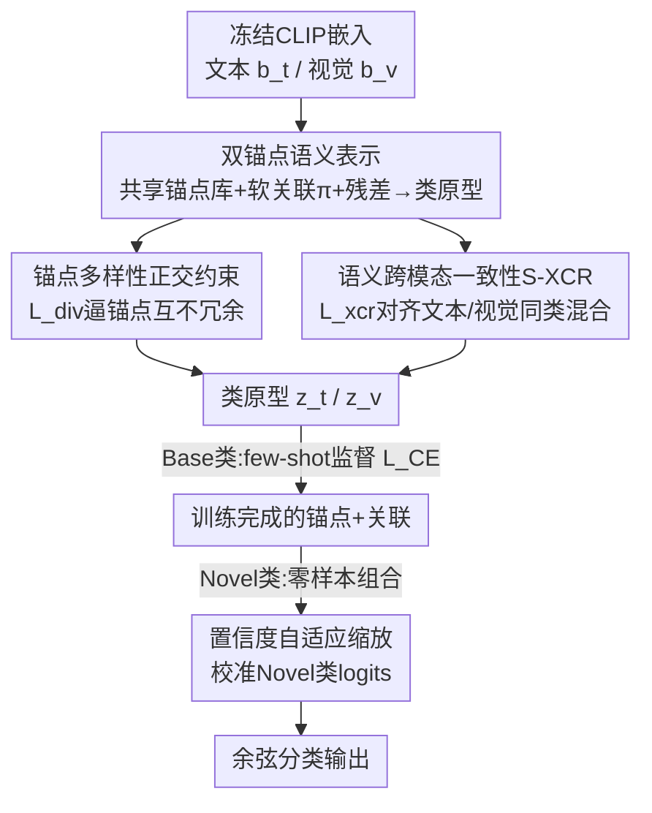

# CASPA: Graph-Structured Concept Anchors for Modality-Agnostic Adaptation in Vision-Language Models

**会议**: CVPR 2026  
**论文**: [CVF Open Access](https://openaccess.thecvf.com/content/CVPR2026/html/Chatterjee_CASPA_Graph-Structured_Concept_Anchors_for_Modality-Agnostic_Adaptation_in_Vision-Language_Models_CVPR_2026_paper.html)  
**代码**: https://abhiroopchatterjee123.github.io/CASPA-CVPR-2026/ (项目页)  
**领域**: 多模态VLM  
**关键词**: CLIP适配, 概念锚点, 组合泛化, 跨模态一致性, 参数高效微调  

## 一句话总结
CASPA 把 CLIP 的下游适配从"每个类各学一套 prompt"改成"所有类共享一组语义锚点（anchor），每个类只学一个在锚点上的软分布"，再用跨模态一致性正则把文本锚点和视觉锚点对齐，在冻结 backbone、只引入 1.1M 参数（占 CLIP 0.73%）的前提下，于 Base-to-Novel、跨数据集迁移、few-shot 等四套设置、11 个数据集上达到或超过 SOTA。

## 研究背景与动机

**领域现状**：把 CLIP 这类视觉-语言模型迁移到下游识别任务，目前主流是三条路——prompt-tuning（CoOp / CoCoOp / MaPLe 学一组可训练 context token）、adapter 注入（CLIP-Adapter / Tip-Adapter 在冻结 backbone 后挂小融合模块）、以及直接微调。它们都能在保留 CLIP 泛化能力的同时提升任务判别力。

**现有痛点**：这些方法本质上都是 **per-class（按类）** 的——CoOp 给每个类学独立的文本 token $p_c = g_\Phi([t_c; v_c])$，adapter 也把每个类的 prompt 当成相互独立的个体来更新。这就忽略了类与类之间天然存在的语义关联：比如"猫"和"老虎"、"汽车"和"卡车"在概念上共享大量中层视觉属性（条纹、轮子、金属外壳），但 per-class 参数化让每个类各学各的，既浪费参数，也学不到可跨类复用的"推理级"知识。

**核心矛盾**：适配被建模成了"按类的特化（class-specific specialization）"，而不是"共享的概念结构（shared conceptual structure）"。一旦遇到 Novel 类（训练时没见过），per-class 参数无从迁移，只能退回 CLIP 零样本，泛化乏力。

**本文目标**：在冻结 CLIP 编码器、不引入 MLP / LoRA / backbone 微调的前提下，学到一组**可跨类、跨模态复用**的语义基（basis），让每个类（包括 Novel 类）都能由这组基**组合**出来。

**切入角度**：作者观察到 CLIP 的联合嵌入空间 $\mathcal{E}\subset\mathbb{R}^d$ 已经编码了丰富的跨模态语义结构，与其给每个类新造一个方向，不如**在这个空间里显式分解出若干可复用的"中层语义原语"**（如对称性、曲率、层叠结构），让类去"路由"到这些原语上。论文图 1 展示了 nautilus（鹦鹉螺）和 pagoda（宝塔）通过编码"螺旋/层叠几何"的同一锚点相连——这正是 per-class 方法看不到的跨类结构。

**核心 idea**：用"共享锚点 + 每类一个软关联分布"替代"每类一套独立 prompt"，把 few-shot 适配重新表述为**组合推理（compositional reasoning）**问题，并用跨模态一致性正则保证文本锚点和视觉锚点说的是同一件事。

## 方法详解

### 整体框架

CASPA（Concept-Anchored Semantic Prompt Adapter）的输入是冻结的 CLIP 文本/视觉嵌入，输出是每个类经过适配的"原型（prototype）"向量，分类时用图像特征与各类原型做余弦相似度。整个适配只动三类可训练量：**两组锚点库**（文本/视觉各 $K$ 个）、**每个类在锚点上的关联分布**、以及每类的**残差修正项**；CLIP 编码器全程冻结。

它的转法是：① 先建立文本锚点库 $A_t$ 和视觉锚点库 $A_v$，作为两个模态的共享"概念基"；② 每个类 $c$ 学一个在锚点上的 softmax 软分布 $\pi^{(c)}_m$，把锚点加权混合再加上冻结 CLIP 嵌入和一个可学残差，合成出该类原型 $z^{(c)}_m$；③ 用正交正则 $L_{div}$ 逼锚点各自指向不同语义方向、不塌缩；④ 用跨模态一致性正则 $L_{xcr}$（S-XCR）把同一个类的文本侧混合和视觉侧混合在余弦意义上对齐。训练时只在 Base 类上做 few-shot 监督；**推理到 Novel 类**时，直接用 Novel 类的 CLIP 文本嵌入与文本锚点算关联分布、组合出原型，再叠一层置信度自适应缩放校准 logits，无需任何重训。

### 关键设计

**1. 双锚点语义表示：用"共享锚点 + 每类软分布"替代每类独立 prompt**

这是 CASPA 的地基，直接针对"per-class 参数化忽略类间关联"的痛点。作者定义两组模态专属锚点库 $A_m=\{a^{(k)}_m\in\mathbb{R}^d\mid k=1,\dots,K_m\}$，$m\in\{t,v\}$，每个锚点是 CLIP 空间里的一个潜在语义方向（可对应某个共享的视觉/语境属性）。每个类 $c$ 不再独占一个 prompt 向量，而是学一个在锚点上的概率分布 $\pi^{(c)}_m\in\Delta^{K_m-1}$（softmax 保证非负且和为 1），$\pi^{(c)}_{m,k}$ 就表示第 $k$ 个锚点对类 $c$ 的贡献——这就是图 1 里那张"类-锚点"二部图的权重。类原型由锚点加权混合合成：

$$z^{(c)}_m=\mathrm{Norm}\!\left(b^{(c)}_m+\sum_{k=1}^{K_m}\pi^{(c)}_{m,k}\,a^{(k)}_m\right),\quad m\in\{t,v\},$$

其中 $b^{(c)}_m$ 是冻结的 CLIP 嵌入（文本侧是 class 文本嵌入，视觉侧是该类视觉原型均值），归一化把原型压到单位超球面上，保持与 CLIP 相似度空间的几何一致。但纯凸组合把每个类困在锚点张成的子空间里、不够灵活，于是再加一个**轻量的类相关残差位移**（concept shift block）$s^{(c)}_m$：

$$z^{(c)}_m=\mathrm{Norm}\!\left(b^{(c)}_m+\sum_{k=1}^{K_m}\pi^{(c)}_{m,k}\,a^{(k)}_m+s^{(c)}_m\right).$$

残差像是"在锚点合成的均值附近做局部纠偏"，补回锚点子空间表达不了的细粒度类内差异。这样设计的好处很直接：参数量从 CoOp 的 $O(C M_{ctx}d)$（按类×上下文长度）降到 $O(K_td+K_vd+C(K_t+K_v)+Cd)$——锚点共享、每类只多一个软分布和残差，既省参数又因共享而样本高效；更关键是 Novel 类能"借用"已学好的锚点组合出来，而 per-class 方法做不到。

**2. 锚点多样性正交约束：防止共享锚点塌缩成同一个方向**

锚点共享带来复用，但无约束优化会让多个锚点收敛到相似语义方向（anchor redundancy），共享子空间的表达力随之退化。作者用一个基于正交性的多样性正则压制冗余：

$$L_{div}=\sum_{m\in\{t,v\}}\big\lVert A_m^\top A_m-I_{K_m}\big\rVert_F^2,$$

其中 $A_m\in\mathbb{R}^{d\times K_m}$ 是把该模态锚点按列堆叠的矩阵，$I_{K_m}$ 是单位阵。最小化它等于逼锚点两两去相关（Gram 矩阵趋近单位阵），从而保证每个锚点编码一个**独特**的语义方向。没有这一项，"32–48 个锚点"很容易退化成"有效只有几个锚点"，组合泛化就失去意义——所以它是双锚点表示能成立的必要保险。

**3. 语义跨模态一致性 S-XCR：逼文本锚点和视觉锚点说同一件事**

双锚点虽然支持双向迁移，但文本库和视觉库是各自独立学的，容易出现"语义漂移"——同一个类，文本侧混合出来的概念和视觉侧混合出来的概念对不上。S-XCR（Semantic Cross-Consistency Regularization）强制二者在每个类上余弦对齐。先定义类 $c$ 在模态 $m$ 的锚点混合（不含残差和归一化的纯混合）$M^{(c)}_m=\sum_k \pi^{(c)}_{m,k}a^{(k)}_m$，把所有类堆成矩阵 $Z_t,Z_v\in\mathbb{R}^{C\times d}$，构造跨模态相似度矩阵 $S=Z_tZ_v^\top$（$s_{ij}=\cos(M^{(i)}_t,M^{(j)}_v)$），其对角线就是"同类文本混合 vs 同类视觉混合"的相似度。损失只取对角：

$$L_{xcr}=1-\frac{1}{C}\mathrm{Tr}(S)=\frac{1}{C}\sum_{c=1}^{C}\big(1-\cos(M^{(c)}_t,M^{(c)}_v)\big).$$

它鼓励每个类的文本/视觉混合余弦相似度逼近 1，从而把两套锚点钉在同一套语义结构上，实现"推理级"的跨模态迁移。消融里这一项权重 $\lambda_x$ 在 300 附近收益最大，说明跨模态对齐对 few-shot 下稳定适配是关键而非可有可无。

**4. 置信度自适应缩放：让 Novel 类的零样本 logits 与 Base 类校准**

Novel 类推理时，直接用 Novel 文本嵌入 $b^{(new)}_t$ 与文本锚点算关联 $\pi^{(new)}_{t,k}=\mathrm{softmax}_k(b^{(new)}_t\cdot a^{(k)}_t)$、组合出原型 $z^{(new)}_t$。但 Base 类是 few-shot 训过的、Novel 类是纯零样本组合的，两者 logit 尺度天然不可比，直接拼在一起做分类会偏向 Base。作者加一个置信度自适应缩放：

$$a_{adaptive}=a_{min}+(a_{max}-a_{min})\cdot\sigma\big(\gamma(0.5-\mathrm{conf}_{base})\big),$$

其中 $\mathrm{conf}_{base}$ 是 Base 类上的最大 softmax 置信度，$\gamma$ 固定为 3，$\sigma$ 是 sigmoid。推理时把 Novel 类 logit 缩放 $\ell_c\leftarrow a_{adaptive}\cdot\ell_c$。直觉是：当模型对 Base 类很有把握（$\mathrm{conf}_{base}$ 高）时，说明当前样本更可能属于 Base，就调低 Novel logit；反之则放大 Novel 的话语权。这一步把"零样本组合"的输出校准到与"few-shot 训练"的输出同一量纲，是 Base-to-Novel 平衡的收尾保障。

### 损失函数 / 训练策略

总目标把分类损失和两个结构正则耦合在一起：

$$L_{total}=L_{CE}+\lambda_x L_{xcr}+\lambda_d L_{div},$$

$L_{CE}$ 是类别交叉熵，$\lambda_x,\lambda_d$ 控制跨模态一致性与锚点多样性的相对强度。论文进一步用 ASAM（Adaptive Sharpness-Aware Minimization，SAM 的泛化版）做优化以增强泛化，带 ASAM 的版本记为 **CASPA-G**，正文主结果均为 CASPA-G。训练只在 Base 类 16-shot 上进行；锚点数 $K$ 取 32–48 在表达力与过拟合间最平衡。

## 实验关键数据

评测覆盖四套设置（Base-to-Novel 泛化、16-shot few-shot、ImageNet 16-shot 训练后跨 10 数据集零迁移、跨 backbone）和 11 个数据集（ImageNet / Caltech / Pets / Cars / Flowers / Food / Aircraft / SUN / DTD / EuroSAT / UCF）。

### 主实验：Base-to-Novel 泛化（11 数据集平均，单位 %）

| 方法 | Base | Novel | HM（调和均值） |
|------|------|-------|------|
| CLIP (ICML'21) | 69.34 | 74.22 | 71.70 |
| MaPLe (CVPR'23) | 82.28 | 75.14 | 78.55 |
| DPC (CVPR'25) | 86.10 | 74.78 | 80.04 |
| 2SFS (CVPR'25) | 85.55 | 75.48 | 80.20 |
| RAda (ICCV'25) | 84.32 | 76.25 | 80.08 |
| **CASPA-G (本文)** | 85.24 | **77.18** | **81.01** |

CASPA-G 在 Novel 和 HM 两个最能反映泛化的指标上都拿到最高平均值；在细粒度数据集上提升明显（Cars HM 78.81、Flowers 86.76、Food 92.21），EuroSAT HM 87.64（Novel 高达 82.06）、UCF HM 84.23（比次优 +1.02%）。代价是在 DTD（纹理）上偏弱（HM 70.78，低于 RAda 73.86）。

### 跨数据集迁移（ImageNet 16-shot 训练，无重训直接迁移）

| 方法 | 源域 ImageNet | 10 目标域平均 | 11 数据集总平均 |
|------|------|------|------|
| MaPLe | 70.72 | 66.30 | 66.70 |
| MMA | 71.00 | 66.61 | 67.00 |
| DeKgTCP | 72.33 | 66.64 | 67.13 |
| **CASPA-G (本文)** | **73.24** | **66.70** | **67.30** |

CASPA-G 在 6/12 个场景取得最佳，源域精度最高（73.24），总平均 67.30 超过次优 67.13，说明共享锚点带来更平滑的跨域迁移、更少源域过拟合。

### 效率对比

| 方法 | 训练时间 (ImageNet 16-shot) | 新增参数 | 占 CLIP 比例 |
|------|------|------|------|
| CoOp | ~17 小时 | — | — |
| ProGrad | ~20 小时 | — | — |
| KgCoOp | ~4 小时 | 124.32M | — |
| MaPLe | — | 3.55M | — |
| **CASPA** | **5.29 分钟 (A100)** | **1.1M** | **0.73%** |

峰值显存仅 1501 MB，参数量比 MaPLe（3.55M）、KgCoOp（124.32M）小一到两个量级，训练时间从小时级降到分钟级。

### 消融实验（Table 4，ImageNet / Flowers / DTD 三类代表数据集）

| 配置 | 关键作用 | 结论 |
|------|---------|------|
| Full CASPA（双锚点+双残差） | 完整模型 | t-SNE 上类簇分离最清晰 |
| 仅图像分支 / 仅文本分支 | 关掉一侧锚点 | 双侧均显著掉点，缺一不可 |
| 去掉锚点（双分支均关） | 退化基线 | 类边界模糊、注意力弥散（Grad-CAM 验证） |
| $\lambda_x$（S-XCR 权重）扫描 | 跨模态对齐强度 | $\lambda_x\approx300$ 收益峰值 |
| 锚点数 $K$ 扫描 | 共享基容量 | 32–48 平衡表达力与过拟合 |

### 关键发现
- **双锚点协同是核心，缺一侧就崩**：t-SNE（EuroSAT 16-shot）显示只有文本+视觉双分支都开启时类簇才"分得开且语义连贯"，关掉任一分支或去掉锚点都让边界模糊——印证组合表示而非单模态 prompt 才是泛化来源。
- **锚点可解释**：Grad-CAM 显示有锚点时模型聚焦语义判别区域（摩托引擎、相机镜头），无锚点时注意力弥散；Top-6 检索图显示每个锚点对应一类可复用的中层视觉原语，跨类共享。
- **Novel 类是最大受益者**：CASPA-G 的优势集中在 Novel/HM 而非 Base，说明共享锚点真正解决的是"没见过的类怎么迁移"。
- **短板在纹理域**：DTD 上偏弱、few-shot 设置里 SUN/EuroSAT 也有退化，说明锚点子空间对高度纹理化、缺乏清晰"中层语义原语"的数据建模不足。

## 亮点与洞察
- **把适配从"分类参数化"重构成"概念基 + 组合"**：最 "啊哈" 的点是用一组共享锚点 + 每类软分布替代每类独立 prompt，参数量从 $O(CM_{ctx}d)$ 降到近似线性于类数，却换来更强的 Novel 泛化——共享即复用，复用即迁移。
- **正交正则是隐性功臣**：$L_{div}=\lVert A_m^\top A_m-I\rVert_F^2$ 这种"逼 Gram 矩阵趋近单位阵"的写法可直接迁移到任何"想让一组学习到的基彼此不冗余"的场景（如 codebook、prototype memory、mixture-of-experts 的专家去相关）。
- **S-XCR 的"只取对角线"很优雅**：构造 $C\times C$ 跨模态相似度矩阵却只用 $\mathrm{Tr}(S)$ 做损失，等价于"同类对齐"而不强加"异类排斥"，比对比损失更轻、更稳，适合 few-shot。
- **置信度自适应缩放解决了一个常被忽视的工程问题**：Base（训过）与 Novel（零样本组合）logit 不同量纲，用 Base 置信度反向调 Novel 增益，是个可复用的零样本校准 trick。

## 局限与展望
- **纹理/缺乏中层原语的域偏弱**：DTD、部分 few-shot 场景退化，说明"可复用语义原语"假设在纹理主导、概念无法清晰分解的数据上不成立。
- **锚点数与 $\lambda_x$ 需要扫描**：$K=32\text{–}48$、$\lambda_x\approx300$ 都是经验最优，跨数据集的最优值是否稳定、能否自适应未充分讨论（⚠️ 论文未给跨域统一超参的鲁棒性证据）。
- **依赖 CLIP 文本嵌入做 Novel 关联**：Novel 类的 $\pi^{(new)}_t$ 完全由 CLIP 文本编码器质量决定，若类名歧义或 CLIP 本身对该概念弱，则组合无从谈起。
- **可改进方向**：把锚点从全局共享扩展到层次化/可增长（开放词表场景动态新增锚点）；用视觉侧而非纯文本嵌入算 Novel 关联以缓解纹理域短板；联合学习 $K$ 而非固定。

## 相关工作与启发
- **vs CoOp / CoCoOp / MaPLe（prompt-tuning）**：它们学每类独立 context token，是 per-class、忽略类间关系；CASPA 用共享锚点 + 软关联建模类间结构，参数更少、Novel 泛化更强，本质区别是"特化 vs 组合"。
- **vs CLIP-Adapter / Tip-Adapter / MMA（adapter/PEFT）**：这些在冻结 backbone 后挂小融合模块、仍按类各自精炼；CASPA 是单阶段、纯在潜在语义空间操作、不引入 MLP，把 few-shot 重述为组合推理。
- **vs 2SFS（CVPR'25，两阶段解耦任务与类适配）**：2SFS 分两阶段，CASPA 单阶段、用锚点共享天然解耦"共享语义"与"类专属残差"，更简洁且效率高一个量级。
- **vs KgCoOp / DeKg（知识/梯度先验）**：它们注入外部先验防遗忘，CASPA 靠正交正则 + 跨模态一致性这两个**结构约束**保持泛化，不依赖额外知识源。

## 评分
- 新颖性: ⭐⭐⭐⭐⭐ 把 VLM 适配从 per-class prompt 重构为共享概念锚点 + 组合，视角清新且自洽
- 实验充分度: ⭐⭐⭐⭐ 四套设置 11 数据集 + 效率/可解释性/t-SNE 都覆盖，但纹理域短板和超参鲁棒性披露不足
- 写作质量: ⭐⭐⭐⭐ 公式与图（类-锚点图、Grad-CAM、t-SNE）配合清晰，部分符号略密
- 价值: ⭐⭐⭐⭐⭐ 1.1M 参数、5 分钟训练换 SOTA 级 Novel 泛化，参数高效适配的实用范式

<!-- RELATED:START -->

## 相关论文

- [\[CVPR 2026\] Structural Graph Probing of Vision-Language Models](structural_graph_probing_of_vision-language_models.md)
- [\[CVPR 2026\] Parameter-Efficient Adaptation for MLLMs via Implicit Modality Decomposition](parameter-efficient_adaptation_for_mllms_via_implicit_modality_decomposition.md)
- [\[CVPR 2026\] GraphVLM: Benchmarking Vision Language Models for Multimodal Graph Learning](graphvlm_benchmark_vlm_graph_learning.md)
- [\[CVPR 2026\] EvoPrompt: Evolving Prompt Adaptation for Vision-Language Models](evolving_prompt_adaptation_for_vision-language_models.md)
- [\[CVPR 2026\] Concept-wise Attention for Fine-grained Concept Bottleneck Models](coat_cbm_concept_wise_attention.md)

<!-- RELATED:END -->
