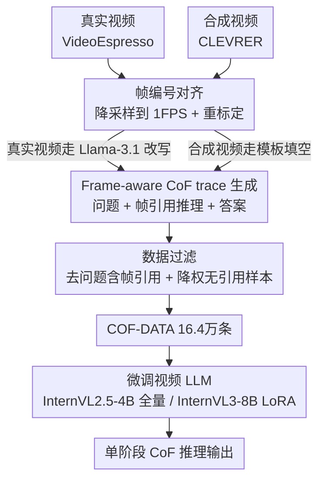

# Chain-of-Frames: Advancing Video Understanding in Multimodal LLMs via Frame-Aware Reasoning

**会议**: CVPR 2026  
**论文**: [CVF Open Access](https://openaccess.thecvf.com/content/CVPR2026/html/Ghazanfari_Chain-of-Frames_Advancing_Video_Understanding_in_Multimodal_LLMs_via_Frame-Aware_Reasoning_CVPR_2026_paper.html)  
**代码**: 未公开（⚠️ 论文未给出仓库链接）  
**领域**: 多模态VLM / 视频理解  
**关键词**: Chain-of-Frames, 视频推理, 时序定位, 合成数据, InternVL  

## 一句话总结
本文提出 Chain-of-Frames（CoF），让视频 LLM 在单阶段推理里直接用「Frame-k」这样的帧编号去引用关键帧、把时序定位写进 CoT 文本本身，再用一条低成本数据管线造出 16.4 万条带帧引用的训练样本微调 InternVL，在 5 个视频理解 benchmark 上平均涨 3.8%~5.1%，且发现纯合成数据就能带来显著提升。

## 研究背景与动机

**领域现状**：把 chain-of-thought（CoT）从纯文本 LLM 扩展到视频理解是近期热点——模型先生成一段对视频内容的推理，再给答案。视频比单图更难，因为模型要同时理解文本问题、帧与帧之间的时序/因果关系，并对整段视频做整体推理。

**现有痛点**：现有的视频 CoT 方法分两类，各有硬伤。一类是**多阶段流水线**（VideoEspresso、Video-of-Thought、M-LLM 等）：先用辅助网络做关键帧检索、构建时空场景图、生成 caption，再喂给推理模型——推理时算力开销大、专门化严重、且因为只把**子集帧**送进 LLM，丢掉了视频的完整时序上下文。另一类是**单阶段**方法（VideoCoT）：直接生成推理文本，但训练数据由「视频描述 + LLM 改写 + 人工校正」拼出来，描述本身没有帧级时序对齐，导致推理 trace 出现时序错乱，还得拉人进 loop 修，结果数据只能造到 1.1 万条、规模上不去。

**核心矛盾**：要么数据生成贵且缺乏显式时序定位，要么推理流程复杂、依赖辅助模型还牺牲了上下文完整性。更根本的是，现有视频 LLM 的推理文本**没有把具体视频片段和推理步骤显式连起来**——推理「悬空」，既不可解释也不易学。

**本文目标**：做出第一个「单阶段 + 显式引用关键帧」的视频 LLM 推理范式，既保留全帧上下文，又把时序定位直接落到推理文本里，同时让训练数据能低成本规模化。

**切入角度**：作者观察到 InternVL 这类模型本来就把视频编成「Frame-1 [图] Frame-2 [图]…」的图文交错格式——文本标识符天然挂在每帧上。那么推理时直接复用这些帧编号当「指针」，模型就能在一句话里说清"在 Frame 7 里发生了什么"，无需任何外挂检索模块。

**核心 idea**：用「在推理文本里显式写出 Frame-k 帧编号」这种最朴素的方式，把时序定位嵌进单阶段 CoT，替代昂贵的多阶段关键帧检索流水线。

## 方法详解

### 整体框架
CoF 的核心主张是：**不改架构、不加辅助模型**，只靠「数据 + 微调」就把帧感知推理教给现成的视频 LLM。整条工作分两半——左半边是一条两步数据管线，把真实视频和合成视频都转成「问题 / 带帧引用的推理 trace / 答案」三元组，攒成 COF-DATA（16.4 万条）；右半边是拿这些数据去微调 InternVL2.5-4B、InternVL3-8B，得到 CoF 模型，推理时单阶段直接输出含「Frame-k」引用的 CoT 再给答案。

推理时的格式长这样：模型读到「Frame-1 [图] … Frame-30 [图] + 问题」，输出类似 *"The video starts with two people on a rocky cliff (Frame 5)…the next scene shows a rescue (Frame 6)…"* 的推理，最后落到答案。帧编号用**帧在视频中的位置序号**（Frame 1、Frame 2…）而非时间戳——好处是它与视频时长、采样频率无关，跨不同视频数据更一致、也更易学。

### 关键设计

**1. Chain-of-Frames：把帧编号当指针写进单阶段 CoT**

针对「推理悬空、时序定位靠外挂检索」这个痛点，CoF 的做法极其朴素：在推理文本里直接引用帧的位置序号。设视频被均匀采样为 $N$ 帧 $\{f_1,\dots,f_N\}$（实验里 $N=30$），每帧挂一个文本标识符 Frame-$k$；推理 trace 是一段自然语言，其中显式出现 Frame-$k$ 来指认"回答这个问题所需的关键帧"。这样时序定位**不是**靠一个检索网络选出 top-$k$ 帧再处理，而是模型在生成推理时**隐式地**完成了帧检索——把哪几帧相关写出来即可。

之所以有效，关键在于和旧法的三点区别：（a）全部 30 帧都进 LLM，**不丢上下文**，而多阶段法只送子集帧；（b）推理纯自然语言，不产生 bounding box / 场景图等复杂中间格式，是标准 NLP CoT 的自然延伸，推理只需一次前向、延迟低；（c）用位置序号而非时间戳，对采样频率鲁棒。一个直观例子：问"物体出现顺序"，模型直接输出 *"purple cylinder appears in Frame 1, green cylinder in Frame 4, cyan cube in Frame 8…"*，推理步骤和具体帧一一咬合。

**2. 两步数据管线 + 真/合成双源，把带帧引用的 trace 低成本造出来**

CoF 是「数据驱动」的范式，所以瓶颈在数据怎么造得既准又便宜。痛点是 VideoCoT 那套靠人工 + LLM 反复修、贵且只有 1.1 万条。本文设计了两步管线（见框架图左侧）：

**Step 1 帧编号对齐**——原始标注带帧 ID，但受视频 LLM 上下文长度限制，要先降采样。做法是把每帧映射到时间戳，按模型允许的最大时长（实验里 30 秒）裁剪视频、保证含 caption 的帧都在区间内，再**重新标定**帧 ID 以反映其在裁剪后视频里的新位置。这一步保住了「帧—caption」的对齐，是后面 trace 时序正确的前提。

**Step 2 生成 CoF 三元组**——分两条支线：
- **真实视频（COF-DATA_real）**：取 VideoEspresso 训练集，它对每个视频的关键帧都带 caption；对齐帧 ID 后，把这些**帧级时序对齐**的标注作为输入，用 Llama-3.1-8B-Instruct 提示生成「问题 + 带 Frame-k 引用的推理 + 答案」。因为输入本身帧级对齐，产出的 trace 时序就准。一个视频常能生成多个覆盖不同片段的问题。
- **合成视频（COF-DATA_synth）**：取 CLEVRER，它每帧每个物体都标注了固定属性（形状/材质/颜色）和情境属性（速度/位置）。这些结构化标注足以**直接用人工模板填空**生成「物体计数 / 出现顺序 / 相对距离」三类定量问题及其 CoF——**完全不用 LLM**，生成成本近乎为零、可任意 scale。这正是本文规模能冲到 16.4 万条的原因。

**3. 数据过滤策略：让训练分布匹配测试时的推理需求**

直接拿生成的样本训会有两个偏差，作者做了针对性过滤。其一，**问题里若出现帧引用就删掉**——因为测试时问题不会告诉你帧号，留着会造成训练/测试不一致。其二，**降低"推理 trace 里完全没有帧引用"样本的比例**，给更复杂的（含帧引用的）推理更高权重；但不是全删——评测里确实存在不需要 CoF 式推理的问题，保留一部分无引用样本可以避免模型在不必要时硬凑帧引用。最终 16.4 万条里，帧引用数分布为：0 帧 22.5%、1 帧 32.0%、2 帧 25.3%、3 帧 13.8%、>3 帧 6.4%。这种「带刻度的混合」让模型学会**按需**使用帧引用——推理时 $P(\#\text{Frames}>0)=76.9\%$，说明模型确实学会了选择性引用而非一刀切。

### 损失函数 / 训练策略
标准监督微调（SFT）。InternVL2.5-4B **全量微调** LLM 与投影模块、冻结视觉编码器；InternVL3-8B 用 **LoRA** 微调以省显存。推理时每段视频**均匀采样 30 帧**保证时序覆盖一致（但模型不限于 30 秒视频，可处理任意时长）。Phi-3.5-Vision 作为第三个 backbone 验证泛化性（结果在附录）。

## 实验关键数据

### 主实验
5 个 benchmark（VSI-Bench 定量推理 / Video-MME 长视频 / MVBench 20 任务 / VidHal、EventHallusion 幻觉）上对比 SOTA 视频 LLM，指标为 accuracy（%）：

| 模型 | VSI-Bench | Video-MME | MVBench | VidHal | EventHall | 平均 |
|------|-----------|-----------|---------|--------|-----------|------|
| GPT-4o（闭源） | 34.0 | 71.9 | - | 77.2 | 91.9 | - |
| Gemini-1.5-Pro（闭源） | 48.8 | 75.0 | - | 67.1 | 80.4 | - |
| Qwen2-VL-72B | 37.6 | 71.2 | 73.6 | 76.2 | 54.7 | 62.7 |
| InternVL2.5-4B（基线） | 33.5 | 54.7 | 71.5 | 77.0 | 67.4 | 60.8 |
| **CoF-InternVL2.5-4B** | 36.9 | 59.7 | 76.1 | 79.2 | 71.2 | **64.6** (+3.8) |
| InternVL3-8B（基线） | 41.0 | 66.5 | 74.4 | 80.9 | 72.1 | 67.0 |
| **CoF-InternVL3-8B** | 51.3 | 73.7 | 77.1 | 79.5 | 78.7 | **72.1** (+5.1) |

CoF-InternVL3-8B 仅 8B 却在 VSI-Bench、MVBench 上拿到**全场最佳**（含闭源），Video-MME、VidHal 第二，EventHallusion 开源最佳；更大模型（8B 涨 5.1% > 4B 涨 3.8%）增益更明显，暗示越强的 LLM 越能吃到 CoF 红利。

与多阶段视频 CoT 方法对比（这些模型未开源，只能用其报告值在共享 benchmark 上比）：

| Backbone | 方法 | Video-MME | NExT-QA |
|----------|------|-----------|---------|
| Qwen2-VL-7B | M-LLM | 58.7 (+0.6) | 78.4 (+0.8) |
| Video-LLaVA-7B | Video-of-Thought | - | 76.0 (+9.7) |
| InternVL2.5-4B | **SFT with CoF (ours)** | 59.7 (+4.8) | 79.6 (+4.3) |
| InternVL3-8B | **SFT with CoF (ours)** | 73.7 (+7.8) | 87.3 (+4.9) |

CoF 在更少参数下仍超过这些多阶段检索方法；相对 M-LLM，CoF 在 NExT-QA 上的提升（+4.9% vs +0.8%）显著更大，且是从更强基线出发的。

### 消融实验
**CoF vs 其他 CoT 变体**（均基于 InternVL2.5-4B，验证「帧引用」本身是不是关键）：

| 配置 | VSI-Bench | Video-MME | MVBench | VidHal | EventHall | 说明 |
|------|-----------|-----------|---------|--------|-----------|------|
| Original | 31.8 | 54.9 | 70.8 | 74.0 | 62.5 | 默认提示 |
| + CoT Prompting | 33.5 | 54.7 | 71.5 | 77.0 | 67.4 | 仅加推理提示 |
| + SFT with QA only | 31.8 | 54.5 | 73.4 | 64.1 | 57.7 | 只用 QA 无推理 |
| + SFT with CoT | 34.3 | 58.6 | 73.7 | 77.9 | 53.1 | 有推理但**抹掉帧引用** |
| **+ SFT with CoF (ours)** | 36.9 | 59.7 | 76.1 | 79.2 | 71.2 | 完整方法 |

把推理 trace 里的「In Frame 1…」替换成泛化的「In the video…」后（SFT with CoT），多数 benchmark 仍提升但 EventHallusion 暴跌到 53.1；加回帧引用（CoF）后所有 benchmark 都达到最佳，相对原始模型提升 4.8%~8.7%。**显式帧引用就是关键变量**。

**合成数据的影响**（等量 164k，分别只用 real / 只用 synth / 混合）：

| 训练数据 | VSI-Bench | Video-MME | MVBench | VidHal | EventHall |
|----------|-----------|-----------|---------|--------|-----------|
| CoF-DATA-real | 35.3 | 59.0 | 74.8 | 73.2 | 73.6 |
| CoF-DATA-synth | 31.3 | 59.0 | 73.4 | 77.2 | 65.3 |
| CoF-DATA (combined) | 36.9 | 59.7 | 76.1 | 79.2 | 71.2 |

### 关键发现
- **纯合成数据反而常优于真实数据**：尽管 CLEVRER 合成帧与真实 benchmark 存在巨大分布差，只用合成数据训出的模型在多数 benchmark 上反超只用真实数据的版本——模型从合成样本里学到了「物体计数、出现顺序」这类**任务本身**并迁移到真实场景。由于合成数据零成本可规模化，这是个很有价值的可扩展策略。
- **混合最优、但靠多样性**：combined 在除 EventHallusion 外所有 benchmark 上都最好，说明推理 trace 的**多样性**比单一数据源更重要。
- **帧引用是因果变量**：去掉帧引用的 SFT-CoT 在 EventHallusion 上崩盘，加回后恢复并最佳，定位到「显式时序 grounding」是性能来源。
- **模型按需引用帧**：推理时 76.9% 的答案含至少一个帧引用，且不同任务引用数分布不同——模型学会了选择性使用而非机械套用。

## 亮点与洞察
- **"用文本指针代替检索模块"这一刀切得很漂亮**：把多阶段关键帧检索这套重型流水线，降维成「在 CoT 里多写几个 Frame-k」，既保住全帧上下文又零额外推理开销，是把 NLP CoT 思想干净迁移到视频的范例。
- **合成数据 OOD 仍涨点，是最"啊哈"的发现**：CLEVRER 的简单 3D 物体和真实视频天差地别，却能教会模型计数/排序并迁移——提示「定量时序推理」这类能力可以用便宜的程序化数据低成本灌注。
- **巧用了 backbone 的既有格式**：InternVL 本来就把帧编成「Frame-k [图]」交错格式，CoF 等于复用了这套现成的「图—文本标识符」绑定，几乎没有额外学习负担，这也是它特别适配 InternVL 的原因。
- **可迁移的 trick**：用「位置序号而非时间戳」当时序指针，对采样率鲁棒——任何需要在长序列里引用特定元素的任务（多图问答、文档页引用、长音频片段定位）都能借鉴。

## 局限与展望
- **作者承认**：CoF 训练数据适配「固定 FPS」的视频 LLM——要保证推理里引用的帧索引能和送进 LLM 的帧对齐；如何适配非固定 FPS / 动态采样的模型是开放问题。
- **方法强绑定 InternVL 的交错格式**：论文也说 CoF「particularly well-suited」于 InternVL，Phi-3.5-Vision 的结果被放进附录。对那些不把帧编号显式写进输入的视频 LLM，帧引用是否还学得动、收益多大，正文没充分回答。⚠️
- **benchmark 重叠的诚实 caveat**：作者明确指出 MVBench 有 5/20 任务部分基于 CLEVRER 测试集、VidHal 含 MVBench 视频，所以不把结果叫「zero-shot」——但这也意味着合成数据的增益里可能有一部分来自分布更接近，读者横向比较时要留意。
- **改进思路**：CoF 目前只引用「单帧」，对需要跨多帧连续动作（如细粒度动作时序）的问题，引用「帧区间 Frame a–b」或带方向的帧关系或许更贴合；扩大数据规模与多样性、增大模型规模是作者点名的未来方向。

## 相关工作与启发
- **vs VideoCoT（单阶段）**：VideoCoT 用视频描述 + LLM 改写造 CoT，但描述非帧级对齐导致时序错乱、要拉人工修、只有 1.1 万条；CoF 用帧级对齐标注 + 合成模板，时序准确、零人工、规模到 16.4 万条，且推理 trace 带显式帧引用。
- **vs Video-of-Thought / VideoEspresso / M-LLM（多阶段）**：它们靠辅助网络做关键帧检索 / 时空场景图，推理时开销大、专门化、只送子集帧丢上下文；CoF 单阶段、全帧入模、帧检索隐式融进推理文本，参数更少还在共享 benchmark 上反超（NExT-QA +4.9% vs M-LLM +0.8%）。
- **vs 标准 CoT Prompting / SFT-CoT**：消融证明只加推理提示或加了推理但抹掉帧引用都不如 CoF——核心增量来自「显式帧级时序 grounding」，而非「有没有推理」这件事本身。

## 评分
- 新颖性: ⭐⭐⭐⭐ 「帧编号当文本指针写进单阶段 CoT」想法朴素但确实是首个单阶段+显式帧引用的范式，切中多阶段检索的痛点。
- 实验充分度: ⭐⭐⭐⭐ 5 benchmark + 3 backbone + CoT 变体/数据源/推理引用分布多角度消融，诚实标注 benchmark 重叠；缺少对非 InternVL 格式模型的正文充分验证。
- 写作质量: ⭐⭐⭐⭐ 动机—局限—方法链条清晰，图示（数据管线、引用分布）到位，易读。
- 价值: ⭐⭐⭐⭐ 低成本数据管线 + 合成数据可迁移的发现实用性强，对做视频 LLM 推理的人有直接借鉴价值。

<!-- RELATED:START -->

## 相关论文

- [\[CVPR 2026\] EmoThinker: Advancing Visual-Acoustic Emotion Analysis via Structural Token Selection and Chain-of-Thought Reasoning](emothinker_advancing_visual-acoustic_emotion_analysis_via_structural_token_selec.md)
- [\[CVPR 2026\] World in a Frame: Understanding Culture Mixing as a New Challenge for Vision-Language Models](world_in_a_frame_understanding_culture_mixing_as_a_new_challenge_for_vision-lang.md)
- [\[CVPR 2026\] TimeLens: Rethinking Video Temporal Grounding with Multimodal LLMs](timelens_rethinking_video_temporal_grounding_with_multimodal_llms.md)
- [\[CVPR 2026\] REVISOR: Beyond Textual Reflection, Towards Multimodal Introspective Reasoning in Long-Form Video Understanding](revisor_beyond_textual_reflection_towards_multimodal_introspective_reasoning_in_.md)
- [\[CVPR 2026\] Agentic Video Summarization via Self-Reflecting Multimodal Understanding](agentic_video_summarization_via_self-reflecting_multimodal_understanding.md)

<!-- RELATED:END -->
