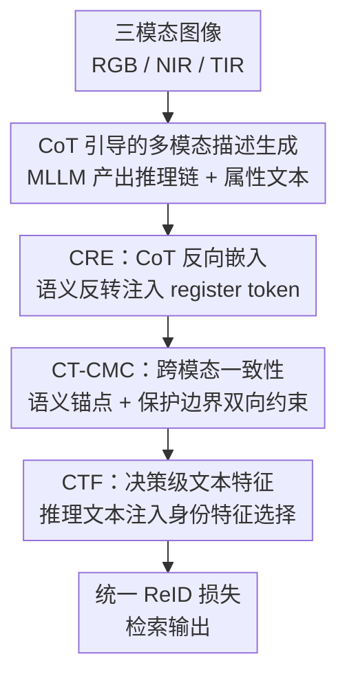

# Chain-of-Thought Guided Multi-Modal Object Re-Identification

**会议**: CVPR 2026  
**论文**: [CVF Open Access](https://openaccess.thecvf.com/content/CVPR2026/html/Gao_Chain-of-Thought_Guided_Multi-Modal_Object_Re-Identification_CVPR_2026_paper.html)  
**代码**: 未公开  
**领域**: 多模态VLM  
**关键词**: 多模态目标重识别, 思维链CoT, 跨模态一致性, MLLM, DINOv3  

## 一句话总结
CoT-ReID 让多模态大模型对 RGB/近红外/热红外三模态目标"边看边推理"，把推理链文本拆成早期、后期、决策三个层级去引导视觉特征学习，在四个多光谱 ReID 数据集上刷新 SOTA（如 MSVR310 mAP 71.7%）。

## 研究背景与动机
**领域现状**：多光谱目标重识别（ReID）用 RGB、近红外（NIR）、热红外（TIR）三种光谱来应对黑暗、遮挡、强光等真实场景。近两年的主流做法是借 MLLM 给每个目标生成文本属性标注（如颜色、车型、行人着装），再设计图文对齐模块把这些描述性语义融进视觉特征，代表工作有 IDEA、DeMo、PromptMA 等。

**现有痛点**：这些方法只把文本当成"扁平的属性清单"——给目标贴一堆静态、细粒度的描述标签，却忽略了视觉元素之间**内在的层级逻辑关系**。论文举的例子很形象：车的"品牌+型号"其实暗示了它的"车身线条"，行人的"着装"暗示了"性别"，这些属性不是孤立的，而是层层推导的。只做静态语义匹配，等于丢掉了人类识别物体时真正用到的推理结构。

**核心矛盾**：直接在视觉域里挖这种层级关系非常难（视觉特征是连续、纠缠的），而语义域的逻辑关系天然可解释、可显式表达。问题在于：怎么把"可解释的语义推理结构"灌回到"难以拆解的视觉特征"里？同时，引入多模态又带来新的两难——跨模态对齐做得太松学不到共识，做得太狠又会让强模态压制弱模态、抹掉模态独特性。

**切入角度**：CoT（思维链）是为大模型设计的结构化推理范式，能把复杂的视觉属性拆成一步步可解释的推理序列。作者的观察是：人类描述一个目标时先"看"再"说"，视觉与语言里都携带着逻辑推理过程（论文 Fig.1）。那就用 MLLM 产出的 CoT 推理链文本当"语义上下文锚点"，去模拟这套层级逻辑、贯穿整个 ReID 训练流程。

**核心 idea**：用 CoT 推理链文本（而非静态属性标签）在**早期、后期、决策三个层级**全程引导视觉特征学习——把跨模态一致性约束从"基于静态语义的表层对齐"升级为"基于动态推理的深层语义绑定 + 条件边界约束"。

## 方法详解

### 整体框架
CoT-ReID 的输入是同一身份在 RGB/NIR/TIR 三个光谱下的图像 $X_i=[X_{rgb},X_{nir},X_{tir}]$，输出是用于检索的判别性多模态身份特征。整条管线分两步走：先用 MLLM（Qwen-VL）为每个模态各生成两类文本——记录推理过程的 **CoT 推理链文本** 和 **目标属性描述文本**；再让这条推理链文本在三个层级依次引导视觉学习。

具体地，三模态图像先过 DINOv3 视觉骨干，但在**早期层**就由 CRE 模块把 CoT 文本的语义反转嵌进 DINOv3 的 register token，校准底层视觉特征；得到三模态视觉特征后，在**后期层**由 CT-CMC 模块把 CoT 文本当作条件锚点做双向跨模态对齐、同时用保护边界防过融合；最后在**决策层**由 CTF 把推理后的文本属性特征注入身份特征选择，与视觉特征一起在统一 ReID 损失下联合优化。三个层级对应论文反复强调的"early / late / decision-making"全流程引导。

### 关键设计

**1. CoT 引导的多模态描述生成：用推理链文本替代静态属性标签**

针对"现有文本只是扁平属性清单、丢掉了属性间逻辑"的痛点，作者不再让 MLLM 直接吐孤立标签，而是要求它对每个模态**分别**走一遍推理：先识别主体目标、再核验属性一致性、最后给可靠属性加权，从而产出两类数据——CoT 推理链文本（记录"为什么这么判断"的逻辑过程）和属性描述文本。形式上对模态 $i\in\{rgb,nir,tir\}$ 用模板 $TP_i$ 调 MLLM：$X_{T,i}=M(X_i,TP_i)$、$X_{T',i}=M(X_i,TP_i)$，分别得到推理链文本和属性描述。这样得到的文本同时编码了"属性定义"和"属性间的逻辑关系"，语义上下文比旧标注厚得多，也是后续三个模块的统一输入源。作者据此把四个数据集都扩成了带 CoT 文本的 benchmark（用 API 版 Qwen-VL 生成）。

**2. CRE（CoT-guided Reverse Embedding）：在早期层把推理语义"反向"灌进底层视觉特征**

针对"层级逻辑难以在视觉域直接挖掘"，CRE 选择从特征学习的最早期就介入。作者用 DINOv3 当骨干，看中它的 4 个 register token——这些 token 是承载全局语义、突破局部 patch 限制的稳定载体。CRE 把 CoT 推理文本的**语义反转**嵌进这些 register token：先用冻结的 CLIP 文本编码器 $\Phi$ 编码 CoT 文本得 $Q_T^T=\Phi(X_{T',i})$，再投影到视觉维度 $Q_T^V=Q_T^T\cdot W_{proj}+b_{proj}$（$W_{proj}\in\mathbb{R}^{512\times C_v}$）。投影后的文本 token 与视觉 patch 序列、原始 register token 拼接后一起送进 Transformer 层：

$$R_{in}^{(l)}=\big[\,Z_N^{(l)}\oplus r^{(l)}\oplus Q_T^{V(l)}\,\big],\quad F_{out}^{(l)}=\alpha\big(R_{in}^{(l)};\theta_{blk}^{(l)}\big)$$

其中 $Z_N$ 是视觉 patch 序列、$n=4$ 个 register token、$\alpha(\cdot)$ 是 DINOv3 的第 $l$ 个 Transformer block。这样推理语义从一开始就参与底层表征塑形，引导视觉系统在早期就"带着逻辑去看"，而不是等高层才补语义。⚠️ 原文对"语义反转（reverse/reversion）"的确切操作只用文字描述、未给独立公式，具体形式以原文为准。

**3. CT-CMC（CoT-guided Cross-Modal Consistency）：用 CoT 文本当锚点+保护边界，对齐又不过融合**

这是方法核心，针对多模态融合的两难——既要跨模态对齐、又不能让某个强模态主导抹掉模态独特性。CT-CMC 借鉴 InfoBridge，把语义上下文同时当成"条件信号"和"保护边界"。它把同一 ID、不同模态的表征定义为正对（服从联合分布 $p_{pos}^{ij}(F_i,F_j|T)$），不同 ID 不同模态为负对（服从边缘乘积 $p_{neg}(F_i|T)\cdot p_{neg}(F_j|T)$），正负对数记为 $N_1,N_0$。

**保护边界**：基于已证下界 $I(F_i,F_j|T)\ge \log(N_1/N_0)+L_{NCE}(h)$，引入边界 $\Delta=\log(N_1/N_0)$ 来主动控制融合程度、防过度融合。**CoT 语义锚点**：在 CoT 文本条件 $Q_{T'}^T$ 下定义带上下文的跨模态一致性损失

$$L_{i2j}=-\log\!\Big(\mathbb{E}_{(F_i,F_j)\sim p_{pos}^{ij}}h(F_i,F_j,Q_{T',i}^{T'})\Big)-\frac{N_1}{N_0}\log\!\Big(1-\mathbb{E}_{(F_i,F_j)\sim p_{neg}^{ij}}h(F_i,F_j,Q_{T',i}^{T'})\Big)$$

其中临界函数 $h$ 用 MLP 实现，在推理链上下文 $Q_{T'}$ 条件下估计一对 $(F_i,F_j)$ 是正对的概率，损失里直接带上保护边界 $N_1/N_0$。为对抗过对齐和模态差异，作者在三模态间做**两两双向约束**：$L_C=\sum_{i,j\in\{R,N,T\}}L_{i2j}$。三件套（CoT 锚点 + 双向 Bi-Cross + 保护边界 Pro.Margin）缺一不可，消融里去掉任一项都会掉点（见后表）。

**4. CTF（CoT-guided Text Features）：在决策层把推理文本注入身份特征选择**

前两个模块管早期和后期，CTF 收尾在决策层：把逻辑推理后的文本属性特征注入到判别性身份特征的选择中，为"选哪些特征做最终身份判定"提供逻辑支撑。训练上，作者把图像、文本特征分开抽取（$F_i^V,F_i^T$），每路都加标签平滑交叉熵 + 三元组损失 $L_g(F)=L_{CE}(F)+L_{Tri}(F)$，再叠加 CT-CMC 的损失，总目标为

$$L=L_g(F_i^V)+L_g(F_i^T)+L_C(F_i^V,F_i^T,F_i^{T'})$$

其中 $F_i^{T'}$ 是 CoT 引导的推理文本特征。⚠️ 论文正文未给 CTF 的独立模块公式，其作用主要体现在把 $F^T/F^{T'}$ 并入决策与总损失，细节以原文及补充材料为准。

## 实验关键数据

### 主实验
四个数据集：三个多光谱车辆数据集（RGBNT100、WMVeID863、MSVR310）+ 一个多光谱行人数据集（RGBNT201）。指标用 mAP 和 Rank-K（K=1/5/10）。为公平对比，作者把强 baseline（DeMo、IDEA）也复现到 DINOv3 骨干上（标记 ◦），并以 DINOv3◦ 作为自己的 baseline。

| 数据集 | 指标 | 本文 CoT◦ | DINOv3◦ baseline | 之前最优 | 提升 |
|--------|------|-----------|------------------|----------|------|
| RGBNT100 | mAP | 89.9 | 87.0 | 88.4 (DeMo◦) | +1.5 vs DeMo◦ |
| WMVeID863 | mAP | 74.7 | 70.1 | 72.5 (DeMo◦) | +2.2 vs DeMo◦ |
| MSVR310 | mAP | 71.7 | 68.2 | 68.7 (DeMo◦) | +3.0 vs DeMo◦ |
| MSVR310 | R-1 | 85.3 | 83.3 | 82.4 (IDEA◦) | — |
| RGBNT201 | mAP | 83.3 | 77.5 | 81.3 (IDEA◦) | +2.0 vs IDEA◦ |
| RGBNT201 | R-1 | 86.1 | 78.9 | 83.2 (IDEA◦) | +2.9 vs IDEA◦ |

作者明确把增益归因于两个因素：DINOv3 更强的自监督初始化 + 本文额外的 CoT 语义引导。值得注意的是同样换 DINOv3 骨干后，DINOv3◦ 已普遍超过 CLIP† 系方法，本文在此之上再涨。

### 消融实验
模块消融（WMVeID863，A 为 baseline = DINOv3◦）：

| 配置 | CRE | CT-CMC | CTF | mAP | R-1 |
|------|-----|--------|-----|-----|-----|
| A（baseline） | × | × | × | 70.1 | 80.8 |
| B | × | × | ✓ | 73.4 | 80.7 |
| C | × | ✓ | × | 72.8 | 80.0 |
| D | ✓ | × | × | 73.3 | 81.5 |
| F | ✓ | ✓ | × | 74.1 | 81.8 |
| G（Full） | ✓ | ✓ | ✓ | **74.7** | **82.0** |

CT-CMC 内部组件消融（WMVeID863，验证"三件套缺一不可"）：

| 配置 | CoT 锚点 | Bi-Cross | Pro.Margin | mAP | R-1 |
|------|---------|----------|-----------|-----|-----|
| A | ✓ | ✓ | × | 73.4 | 81.0 |
| B | ✓ | × | ✓ | 74.5 | 80.9 |
| C | × | ✓ | ✓ | 73.2 | 80.9 |
| D（Full） | ✓ | ✓ | ✓ | **74.7** | **82.0** |

### 关键发现
- **三个模块各自有效、叠加最优**：单加任一模块都比 baseline 涨（B/C/D 的 mAP 都从 70.1 升到 72.8~73.4），全开（G）达 74.7，验证 early/late/decision 三层级引导是互补的。
- **CT-CMC 的三件套都不可省**：去掉保护边界（A）、去掉双向（B）、去掉 CoT 文本约束（C）mAP 都掉到 73~74.5，其中"去掉 CoT 锚点"掉得最狠（73.2），说明语义逻辑约束是跨模态一致性的关键。
- **CoT 推理文本 > 静态属性文本**：把本文文本换成 IDEA 的静态文本后（Table 3），MSVR310/RGBNT201 全程掉点（如 RGBNT201 从 83.3 → 80.1 mAP），证明"推理链"比"属性清单"更有价值。
- **CT-CMC > 传统跨模态损失**：在同框架下用 3M Loss 替换 CT-CMC，mAP/R-1 掉 1.8%/1.2%（74.7→72.2 / 82.0→80.1）。
- **超参**：损失系数 $\alpha=0.3$、负样本数 $n_0=3$ 时最优。
- **检索可视化**：CoT 语义能过滤错配候选——RGB 语义说"白车"时 top-5 只检出白车（baseline 会混入银色）；TIR 语义描述"非对称车灯"时 top-5 完美对齐（IDEA 会选成正常车灯）。

## 亮点与洞察
- **把 CoT 从"文本推理"迁到"视觉特征学习"**：以往 CoT 用来提升检索排序或图像生成质量，这里第一次把 CoT 当作语义上下文去增强视觉可解释性，思路很新——文本侧的可解释逻辑成了视觉侧难挖关系的"外部脚手架"。
- **"反向嵌入 + register token"这个落点很巧**：选 DINOv3 的 register token 当文本语义注入口，既利用了它"全局语义稳定载体"的特性，又避免了直接改 patch 特征的破坏性，是个可复用的多模态注入 trick。
- **保护边界对抗"强模态主导"**：用信息论下界 $\Delta=\log(N_1/N_0)$ 显式控制融合程度，把"对齐但不过融合"做成可量化的约束，而不是靠经验调权重——这个思路可迁到任何多模态融合任务。
- **"先看再说"的人类隐喻落到了三层级设计**：early（看）→ late（跨模态核验）→ decision（说/判定）的拆法不是空话，而是真对应了 CRE/CT-CMC/CTF 三个模块。

## 局限与展望
- 作者承认：尚不清楚**哪些推理信号贡献最大**、它们如何与不同模态交互，留作未来工作。
- CoT 文本由 API 版 Qwen-VL 离线生成，整套 benchmark 质量与覆盖度受限于该 MLLM 的推理可靠性；若 MLLM 把属性推错，错误会被当成"逻辑监督"灌进训练（论文未量化这种噪声的影响）。⚠️
- 强增益部分来自 DINOv3 骨干本身（DINOv3◦ baseline 已经很强），CoT 模块的净贡献在 RGBNT100 上约 +1.5 mAP，相对有限；不同数据集增益差异较大（MSVR310 +3.0 vs RGBNT100 +1.5）。
- 方法依赖每个身份三模态齐全 + 逐模态生成文本，推理/训练时的文本生成开销与对缺失模态的鲁棒性论文未讨论。
- 代码未公开，benchmark 文本生成细节多放在补充材料，复现门槛偏高。

## 相关工作与启发
- **vs IDEA / DeMo（静态属性文本）**：它们用 MLLM 生成细粒度静态描述做图文对齐，本文换成 CoT 推理链文本并全程三层级引导；Table 3 直接把文本互换证明"推理链"优于"静态属性"，这是本文最直接的 ablation 式对比优势。
- **vs CCNet / EDITOR（纯视觉融合）**：它们靠一致性约束或背景解耦在视觉域做融合，本文引入语义逻辑作外部条件，把对齐从"表层静态语义"升级到"动态推理 + 条件边界"。
- **vs InfoBridge**：CT-CMC 的保护边界思想来自 InfoBridge 的信息论下界，本文把它扩展为"以 CoT 文本为条件锚点"的跨模态一致性损失，是对该框架在 ReID 场景的具体化。
- **vs X-CoT / PromptCoT 等 CoT 应用**：它们在检索排序、prompt 精化、图像生成里用 CoT，本文把 CoT 落到"引导视觉特征学习"这个新场景，作者称是首个把 CoT 当语义上下文提升视觉可解释性的 ReID 工作。

## 评分
- 新颖性: ⭐⭐⭐⭐ 首次把 CoT 推理链当语义上下文全程引导多模态 ReID 视觉学习，切入点清晰
- 实验充分度: ⭐⭐⭐⭐ 四数据集 + 模块/组件/文本来源多维消融，但净增益受 DINOv3 骨干稀释、缺缺失模态鲁棒性分析
- 写作质量: ⭐⭐⭐ 动机和三层级故事讲得清楚，但 CRE 的"语义反转"和 CTF 模块缺独立公式、部分细节甩给补充材料
- 价值: ⭐⭐⭐⭐ register-token 注入、保护边界控融合等 trick 可迁移到其他多模态融合任务

<!-- RELATED:START -->

## 相关论文

- [\[CVPR 2026\] When Visualizing is the First Step to Reasoning: MIRA, a Benchmark for Visual Chain-of-Thought](when_visualizing_is_the_first_step_to_reasoning_mira_a_benchmark_for_visual_chai.md)
- [\[CVPR 2026\] UniT: Unified Multimodal Chain-of-Thought Test-time Scaling](unit_unified_multimodal_chain-of-thought_test-time_scaling.md)
- [\[NeurIPS 2025\] MDReID: Modality-Decoupled Learning for Any-to-Any Multi-Modal Object Re-Identification](../../NeurIPS2025/multimodal_vlm/mdreid_modality-decoupled_learning_for_any-to-any_multi-modal_object_re-identifi.md)
- [\[CVPR 2026\] Beyond Weak Supervision: MLLMs-Guided Graded Knowledge Distillation for Unsupervised Camouflaged Object Detection](beyond_weak_supervision_mllms-guided_graded_knowledge_distillation_for_unsupervi.md)
- [\[CVPR 2026\] Fuel Gauge: Estimating Chain-of-Thought Length Ahead of Time in Large Multimodal Models](fuel_gauge_estimating_chain-of-thought_length_ahead_of_time_in_large_multimodal_.md)

<!-- RELATED:END -->
