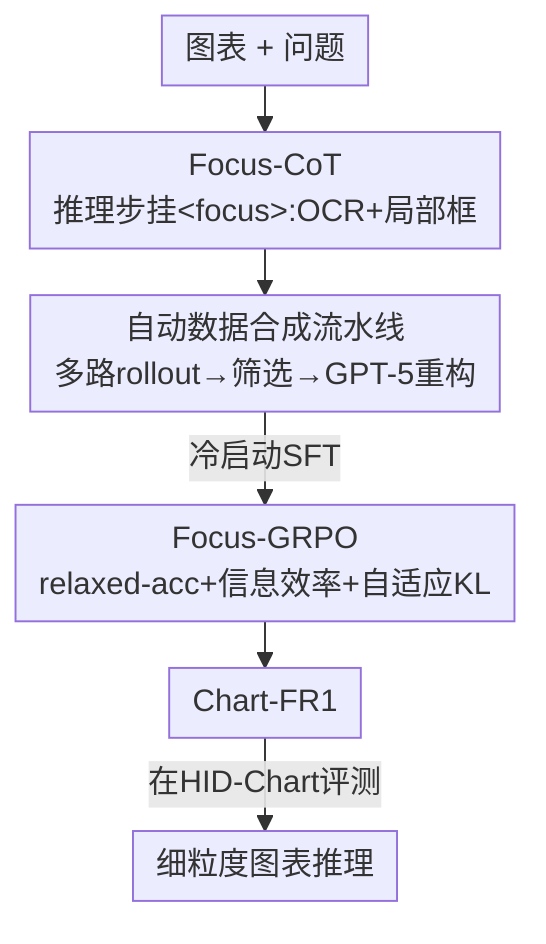

# Chart-FR1: Visual Focus-Driven Fine-Grained Reasoning on Dense Charts

**会议**: CVPR 2026  
**论文**: [CVF Open Access](https://openaccess.thecvf.com/content/CVPR2026/html/Pan_Chart-FR1_Visual_Focus-Driven_Fine-Grained_Reasoning_on_Dense_Charts_CVPR_2026_paper.html)  
**代码**: https://github.com/phkhub/Chart-FR1  
**领域**: 多模态VLM  
**关键词**: 图表推理, 视觉聚焦, 强化学习, GRPO, 思维链  

## 一句话总结
针对子图密集、图例标注繁多的「高信息密度图表」，Chart-FR1 用 `<focus>` 标签把推理步骤显式锚定到 OCR 文本和局部框区域（Focus-CoT），再用带「信息效率奖励 + 自适应 KL 惩罚」的 Focus-GRPO 做强化学习，把 Qwen2.5-VL-7B 在五个图表 benchmark 上平均拉高 6.1%，并反超 GPT-4o。

## 研究背景与动机
**领域现状**：多模态大模型（MLLM）在图表理解上进步很快，既有 GPT-4o、Qwen2.5-VL 这类通用模型，也有 ChartGemma、EvoChart 这类图表专用模型，近期还出现了用强化学习（GRPO）增强推理的 R1-VL、Vision-R1 等。

**现有痛点**：但论文盯住的是一类被忽视的硬骨头——**高信息密度（High Information Density, HID）图表**：一张图里塞了多个子图、多组图例、密密麻麻的标注。在这种图上现有模型暴露三个具体毛病：（1）**细粒度感知不足**——模型大多依赖全局视觉 embedding，无法从杂乱信息里精准抠出关键线索，漏读数值；（2）**视觉冗余与噪声**——一股脑塞进太多视觉元素，反而干扰推理，看似看得多其实抓不准；（3）**推理深度不自适应**——现有 RL 用固定的 KL 惩罚系数约束策略，当某些问题需要长链条、多线索的深推理时，固定惩罚会「过度惩罚」长输出，把模型按死在浅推理上。

**核心矛盾**：图表信息密度越高，视觉杂乱同时拖垮「感知」和「推理」两端——论文 Fig.2 显示，随着信息密度从 [0,3.7) 升到 [4.2,5.0]，GPT-4o / Qwen2.5-VL 的准确率单调下滑。而推理链需要的探索深度本应随线索增多而放宽，固定 KL 却反着来。

**本文目标**：让模型在 HID 图表上同时做到「感知更细、聚焦更省、推理深度自适应」，并补上一个专门评测 HID 图表的 benchmark。

**核心 idea**：把「聚焦动作」显式写进推理链——每一步推理都用 `<focus>` 标签挂上它依据的 OCR 文本和局部框，让感知和推理紧耦合；再用一套以「聚焦效率」为核心的 RL 奖励和**随线索数量动态调整的 KL 惩罚**去优化这个聚焦行为。

## 方法详解

### 整体框架
Chart-FR1 是一个**两阶段聚焦推理训练框架**，base model 是 Qwen2.5-VL-7B。输入是一张图表 + 一个问题，输出是带 `<think>`/`<focus>`/`<answer>` 结构的推理与答案。

- **Stage 1（冷启动 SFT）**：先用一条**自动 Focus-CoT 数据合成流水线**造出高质量的「带聚焦标签的推理链」数据，再做监督微调，把「边推理边聚焦」这个行为注入模型，作为冷启动。
- **Stage 2（Focus-GRPO 强化学习）**：在冷启动模型上跑改进版 GRPO，用三路奖励（relaxed-accuracy / format / information-efficiency）+ 自适应 KL 惩罚进一步打磨聚焦效率和推理深度。
- **评测侧**：作者另建了 HID-Chart benchmark 和 Chart-ID 信息密度指标，专门量化 HID 场景下的细粒度推理能力。

### 关键设计

**1. Focus-CoT：把推理步骤显式锚定到视觉证据，并用流水线自动造冷启动数据**

针对「细粒度感知不足」——普通 CoT 主要在语言层面推理，对图上的具体数值、局部区域缺乏感知。Focus-CoT 引入一个 `<focus>` 标签，每次聚焦动作包含两个子动作：**OCR 文本抽取**（`<ocr>...</ocr>`）和**局部图像定位**（`<box>{"bbox_2d":[...], "label":...}</box>`），后续推理在这些聚焦信息的指引下进行，从而让「推理」和「感知」紧耦合——例如模型先 `<think>` 怀疑某峰值，再 `<focus>` 去框出对应子图、OCR 出坐标值，回头修正之前的错误结论（论文开篇例子里，模型正是靠这一步把误判的「2 个峰」纠正成「1 个」）。

由于 RL 只会在模型已有知识里找高奖励路径，这种聚焦行为得先「教会」。作者设计了一条**自动 Focus-CoT 生成流水线**作为冷启动数据来源：① 按问题难度、图表质量、多样性筛样本，对每个样本用 Qwen2.5-VL 生成 8 条推理路径；② 格式过滤 + LLM 判对错，算每个样本的 pass@k，按难度分 easy/medium/hard（用 1:7:2 的比例搭 RL 训练集，剩下的 easy/hard 做冷启动集）；③ **条件式 CoT 重构**——用更强的教师模型 GPT-5 把原 CoT 接上视觉证据：原推理错了就定位错误、插入 `<focus>` 拿正确视觉信息并改写后续；原推理对了就在关键处插 `<focus>` 补一步「视觉验证」而不改原逻辑；④ 规则 + LLM 双重质量过滤，去掉冗余聚焦的链条。冷启动损失就是标准的序列 NLL：$L_{\text{cold-start}} = -\mathbb{E}_{(x,q,r,a)\sim D}\sum_{t=1}^{T}\log \pi_\theta(y_t\mid x,q,y_{<t})$，其中 $y$ 是推理 $r$ 与答案 $a$ 的拼接。

**2. Focus-GRPO：以聚焦效率为核心的奖励 + 随线索数量自适应的 KL 惩罚**

针对「视觉冗余」和「推理深度不自适应」两个痛点，这是本文最核心的创新。相比只靠稀疏的任务准确率做监督的标准 GRPO，Focus-GRPO 在三处动手。

**(a) Relaxed-Accuracy 奖励**——图表 QA 的数值答案常有小幅波动，硬比相等会让奖励信号过稀疏。于是定义 $R_{\text{relaxed acc}}=1.0$ 当 $\text{correctness}(\hat y,y)$ 成立否则为 0，而数值型答案的判对标准放宽为相对误差 $\frac{|\hat y-y|}{\max(|y|,\mu)}\le 0.05$（$\mu$ 防止除零），非数值型则要求严格相等。

**(b) Information-Efficiency 奖励**——直接打击「聚焦了一堆冗余 OCR / 重叠框」的行为。它是冗余惩罚 $P_{\text{redundancy}}$ 的指数衰减：$R_{\text{efficiency}}=\exp(-\alpha\cdot P_{\text{redundancy}})$。冗余惩罚由三个子项平均而来：OCR-OCR 文本相似度（用 SequenceMatcher 算，只对相似度超阈值 $\tau$ 的对计入）、Box-Box 的 IoU 重叠、以及 OCR-Box（每条 OCR 文本与所有框标签的最大文本相似度，超 $\tau$ 才计）。三项相似/重叠越高，惩罚越大、奖励越低，逼模型只挑高价值线索。format 奖励则用正则匹配输出结构，Focus-CoT 格式给 1.0、退化成普通 CoT 给 0.667、其它 0。三者加权汇总：$R = R_{\text{relaxed acc}} + w_1\cdot R_{\text{format}} + w_2\cdot R_{\text{efficiency}}$。

**(c) 自适应 KL 惩罚**——这是对「固定 KL 过度惩罚深推理」的直接修复。当模型聚焦到丰富线索、需要深探索时放松 KL 约束，线索少时收紧以保稳定。把聚焦信息量量化为 $N_{\text{info}}=(N_{\text{ocr}}+N_{\text{box}})/2$，自适应系数 $\beta'=\beta\cdot\frac{1}{1+\log(1+N_{\text{info}})}$——线索越多 $\beta'$ 越小、约束越松。最终目标在 group-relative 优势 $A'_i=\frac{R_i-\text{mean}(\{R\})}{\text{std}(\{R\})}$ 上做带 clip 的 PPO 式优化，并减去用 $\beta'$ 的自适应 KL 项 $D'_{\text{KL}}(\pi_\theta\|\pi_{\text{ref}})$。

**3. HID-Chart benchmark 与 Chart-ID 信息密度指标：补上 HID 评测缺口**

针对「现有图表 benchmark 在图表多样性、领域覆盖、信息密度上都不够」的问题，作者先定义一个信息密度指标 **Chart-ID**：用 GPT-5 从信息丰富度 $S_{\text{rich}}$、信息效率 $S_{\text{eff}}$、信息清晰度 $S_{\text{clar}}$、信息交互性 $S_{\text{inter}}$ 四个维度各打 1-5 分，按 $\text{Chart-ID}=\frac{S_{\text{rich}}}{2}+\frac{S_{\text{eff}}}{5}+\frac{S_{\text{clar}}}{5}+\frac{S_{\text{inter}}}{10}$ 合成（⚠️ 各维度权重以原文为准）。再走 human-in-the-loop 流程：从 2023-2025 的科学/社科出版物、网站、可视化库、行业报告里收约 2500 张图 → 用 Chart-ID 只留高密度图 → GPT-5 生候选问题 → 五名研究生删简单题、把单步题升级为多步题、标注答案并交叉二次校验。最终得到 **734 张图、1561 条高质量 QA**，平均信息密度 3.94（高于 ChartQA 3.23、CharXiv 3.75 等），覆盖 10 种图表类型、8 个领域。

### 损失函数 / 训练策略
两阶段共用 Qwen2.5-VL-7B，8×H100。冷启动集 6.4k 样本，训 1 epoch、lr $2\times10^{-6}$、batch 256；Focus-GRPO 阶段 30k 样本，训 3 epoch、lr $1\times10^{-6}$、batch 512、8 rollouts，超参 $\alpha=2$、$\tau=0.9$、$\beta=1\times10^{-2}$、$w_1=w_2=0.1$。

## 实验关键数据

### 主实验
五个图表 benchmark 上与闭源 / 通用 / 图表专用 / 推理类 MLLM 全面对比（Avg 为五项平均）：

| 模型 | ChartQA | CharXiv | EvoChart | ChartBench | PlotQA | Avg |
|------|---------|---------|----------|------------|--------|-----|
| GPT-4o（闭源） | 85.7 | 47.1 | 63.9 | 72.3 | 51.0 | 64.0 |
| Qwen2.5-VL-7B（base） | 87.3 | 42.5 | 53.5 | 66.4 | 55.5 | 61.0 |
| Vision-R1-7B（推理类） | 84.0 | 38.7 | 54.0 | 66.3 | 58.3 | 60.3 |
| ChartSketcher-72B（图表类） | 88.9 | 36.6 | 63.3 | 68.3 | 57.1 | 62.8 |
| **Chart-FR1-7B（本文）** | **91.0** | **46.6** | 59.2 | **75.6** | **62.9** | **67.1** |

Chart-FR1-7B 比 base 平均高 **6.1%**，比闭源 GPT-4o 高 **3.1%**，在同体量里全面领先。在自建的 HID-Chart 上（Table 4）更明显：Avg 53.0，比 base 高 **10.0%**，反超 72B 的 Qwen2.5-VL-72B（51.5）1.5%、超 GPT-4o（51.2）1.8%；并且所有模型都随信息密度上升而掉点，印证 HID 图表的难度。

### 消融实验
Focus-GRPO 组件消融（在五 benchmark 的 Avg 上，Table 5）：

| 配置 | Avg | 说明 |
|------|-----|------|
| 标准 GRPO | 64.1 | 基线 RL |
| **Focus-GRPO（完整）** | **67.1** | 比 GRPO 高 3.0% |
| w/o 自适应 KL 惩罚 | 65.8 | 掉 1.3%，深推理被过度惩罚 |
| w/o 信息效率奖励 | 65.8 | 掉 1.3%，冗余信息损害准确率 |
| w/o 两者 | 65.5 | 仍比 GRPO 高 1.4%（relaxed-acc 之功） |

两阶段框架与聚焦线索消融（Table 6）：

| 配置 | Avg | 说明 |
|------|-----|------|
| Chart-FR1-7B（完整） | 67.1 | — |
| w/o Focus-GRPO | 62.7 | 掉 4.4%，RL 阶段贡献最大 |
| w/o Cold-Start | 64.7 | 掉 2.4%，冷启动激活聚焦能力 |
| w/o OCR | 64.5 | 掉 2.6%，去掉 OCR 线索最伤 |
| w/o box | 65.2 | 掉 1.9% |

### 关键发现
- **Focus-GRPO 的 RL 阶段是头号功臣**：去掉它掉 4.4%，远超去掉冷启动的 2.4%；自适应 KL 与信息效率奖励各贡献 1.3%，且二者全去掉后靠 relaxed-accuracy 仍能比标准 GRPO 高 1.4%。
- **OCR 线索比框更关键**：去 OCR 掉 2.6% > 去 box 掉 1.9%，说明 HID 图表里把文字数值读准是细粒度推理的命门。
- **方法可迁移到别的底座**：换成 Qwen2.5-VL-3B / Qwen3-VL-8B 训练后，HID-Chart 等指标同样大幅提升（如 Qwen3-VL-8B Avg 63.9→69.7），不是只对单一 base 有效。
- **教师模型越强收益越高**：用 GPT-5 当 CoT 重构教师（Avg 67.1）优于 Qwen3-VL-32B（66.7）和 Qwen2.5-VL-72B（65.5）。

## 亮点与洞察
- **把「聚焦」做成可监督的结构化动作**：`<focus>` 里的 OCR + box 不是给人看的注释，而是能被「信息效率奖励」用 SequenceMatcher/IoU 直接量化冗余的对象，让「该看哪、别重复看」变成可优化目标——这套「让中间步骤可被奖励函数读取」的思路可迁移到任何需要工具调用 / 检索的多模态 RL。
- **自适应 KL 是个轻巧但对症的修复**：仅用 $\beta'=\beta/(1+\log(1+N_{\text{info}}))$ 一条公式，就把「线索多→放松约束允许深推理」的直觉编码进 GRPO，解决了固定 KL 对长链条的系统性压制。
- **relaxed-accuracy 奖励本身就值钱**：消融里把两个新奖励都拿掉、只留宽松数值判对，仍能稳超标准 GRPO 1.4%，提示图表 QA 里「奖励该不该容忍数值小波动」是个被低估的设计点。

## 局限与展望
- **重度依赖强教师模型**：冷启动数据的 `<focus>` 标注由 GPT-5 重构，教师弱了收益明显下降（Table 8），自建数据成本和可复现性受限于闭源教师。
- **Chart-ID 指标本身由 GPT-5 打分**：信息密度的四维评分是 LLM 主观给的，benchmark 的「难度标尺」与评测模型部分同源，⚠️ 是否引入循环偏置值得关注；各维度权重的取法原文也未充分论证。
- **只验证到 7B/8B 量级、单一语言**：未报告更大模型或非英文图表上的表现；`<focus>` 的 box 定位精度在极密集子图下的失败模式也未深入分析。
- **可改进**：把聚焦动作做成真正的迭代式「看-想-再看」多轮交互（当前一次推理内只插有限几个 focus），或让信息效率奖励区分「冗余」与「交叉验证型重复」，避免误伤有意的二次确认。

## 相关工作与启发
- **vs 标准 GRPO / R1-VL / Vision-R1**：它们用固定 KL + 稀疏准确率奖励，没法把视觉线索高效关联进推理；本文用三路奖励 + 自适应 KL，把「聚焦效率」和「推理深度」都纳入优化，HID 图表上 Avg 高 3% 起。
- **vs ChartPoint / ChartSketcher（图表专用）**：ChartPoint 在推理时关联局部区域、ChartSketcher 做多轮交互式代码标注，但缺乏对「冗余聚焦」的信息效率监督；本文把局部区域 + OCR 显式标签化并用奖励约束其冗余度。
- **vs EvoChart / ChartGemma（指令微调类）**：它们靠合成指令数据 SFT，受限于指令规模与质量、没有 RL 阶段；本文的两阶段范式里 RL 贡献了 4.4% 的主要增益。

## 评分
- 新颖性: ⭐⭐⭐⭐ Focus-CoT 的结构化聚焦标签 + 信息效率奖励 + 自适应 KL 三件套针对 HID 图表对症下药，组合新颖。
- 实验充分度: ⭐⭐⭐⭐⭐ 五 benchmark + 自建 HID-Chart，组件/两阶段/线索/底座/教师五类消融齐全。
- 写作质量: ⭐⭐⭐⭐ 公式与流水线交代清楚，痛点-设计对应明确，部分指标定义略需查补充材料。
- 价值: ⭐⭐⭐⭐ 在 7B 量级反超 GPT-4o 且方法可迁移底座，HID 图表与 Chart-ID 指标对社区有评测价值。

<!-- RELATED:START -->

## 相关论文

- [\[CVPR 2026\] SketchVL: Policy Optimization via Fine-Grained Credit Assignment for Chart Understanding and More](sketchvl_policy_optimization_via_fine-grained_credit_assignment_for_chart_unders.md)
- [\[CVPR 2026\] CropVLM: Learning to Zoom for Fine-Grained Vision-Language Perception](cropvlm_learning_to_zoom_for_fine_grained_vision_language_perception.md)
- [\[CVPR 2026\] ReasonMap: Towards Fine-Grained Visual Reasoning from Transit Maps](reasonmap_towards_fine-grained_visual_reasoning_from_transit_maps.md)
- [\[CVPR 2026\] OddGridBench: Exposing the Lack of Fine-Grained Visual Discrepancy Sensitivity in Multimodal Large Language Models](oddgridbench_exposing_the_lack_of_fine-grained_visual_discrepancy_sensitivity_in.md)
- [\[CVPR 2026\] Hugging Visual Prompt and Segmentation Tokens: Consistency Learning for Fine-Grained Visual Understanding in MLLMs](hugging_visual_prompt_and_segmentation_tokens_consistency_learning_for_fine-grai.md)

<!-- RELATED:END -->
