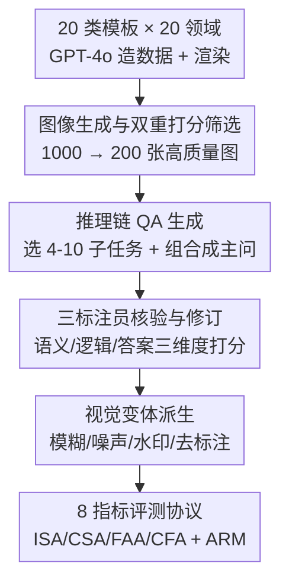

# ChartR: Evaluating Reasoning Accuracy and Robustness in Chart Question Answering

**会议**: CVPR 2026  
**论文**: [CVF Open Access](https://openaccess.thecvf.com/content/CVPR2026/html/Chen_ChartR_Evaluating_Reasoning_Accuracy_and_Robustness_in_Chart_Question_Answering_CVPR_2026_paper.html)  
**代码**: 无（未公开）  
**领域**: 多模态VLM  
**关键词**: 图表问答, 推理链评测, 视觉鲁棒性, MLLM, benchmark  

## 一句话总结
ChartR 把每道图表问答题拆成 4–10 个有依赖关系的子问题、再给每张图配 4 种视觉扰动变体，用 8 个指标同时考"每一步推理对不对"和"扰动下稳不稳"，在 12 个 MLLM 上揭示出：整链全对率普遍低于 10%、数值读取是最大瓶颈、且模型严重依赖图中文字标注而非真正的视觉理解。

## 研究背景与动机
**领域现状**：图表问答（Chart Question Answering, CQA）是衡量多模态大模型（MLLM）能否"看懂数据可视化并据此推理"的核心 benchmark，支撑自动分析、商业智能、科研报告等应用。FigureQA、DVQA、OpenCQA、ChartQA、ChartX、CharXiv 等一路把图表类型、领域、视觉复杂度做大。

**现有痛点**：这些 benchmark 几乎都只用 Exact Match / Accuracy / ANLS 之类指标判**最终答案**对错，把中间推理链当成黑盒。这带来两个内生缺陷：（1）模型即使用错误的理由也能蒙对最终标签，于是被算作"答对"，高估了真实理解力——论文 Figure 1(a) 里 Qwen2.5-VL 把"第 9 大柱子"认错，却仍答对了最终的 yes/no；（2）答错时只是被简单扣分，无法定位推理流水线"在哪一步、为什么"崩掉，没法做针对性改进。

**核心矛盾**：随着 MLLM 具备多步推理能力，"只看终答"的评测范式越来越不够用——终答正确既可能来自扎实的逐步推理，也可能来自捷径或巧合，二者在现有指标下无法区分。

**本文目标**：作者提出评测要同时满足两个互补诉求——**过程准确性（Procedural accuracy）**：能否正确完成推理链上每一步；**过程稳定性（Process stability）**：在模糊、噪声、水印、去标注等视觉扰动下能否保持推理一致。

**核心 idea**：把一道复杂问题显式结构化成一条有依赖的"子问题推理链"，再叠加受控视觉扰动，从而第一次能在**步骤粒度**上诊断"错在哪、是否传播、对扰动多敏感"，而不只是看终答。

## 方法详解
ChartR 本质是一套**数据集构建 + 评测协议**，不是一个模型，所以重点在"数据怎么造、任务怎么定义、指标怎么算"。整体分两条主线：①一条多阶段流水线，把 1000 张候选图筛成 200 张高质量图，每张图生成一条 4–10 步的推理链 QA，并派生 4 个扰动变体；②一套两类共 8 个指标，分别量化推理链准确性与视觉鲁棒性。

### 整体框架
输入是各类图表模板与领域主题，输出是 200 张基准图 + 800 个扰动变体 + 1652 道主问题（含子问题）共 8260 个图–问对，外加一套可在步骤级和整链级打分的指标。整条数据构建流水线如下：

### 关键设计

**1. 推理链式 QA 构建：把一道复杂题拆成有依赖的子问题图**

这是 ChartR 区别于所有现有 benchmark 的根本设计，直击"中间推理是黑盒"的痛点。作者先定义两大类、共 8 种细粒度任务：信息抽取类——数值读取 VE、颜色识别 CI、位置识别 PR；推理类——数值比较 VC、条件处理 CP、趋势识别 TI、序列排序 SO、数值计算 NC。对每张图，从两类里选 4–10 个任务串成一条逻辑连贯的链：每个子任务是一个三元组 $s_j=(q_j,p_j,a_j)$，其中 $q_j$ 是子问题、$a_j$ 是答案、$p_j$ 是它所依赖的前置子任务集合。$p_j$ 可以为空、也可以指向多个前置子任务，于是整条链既可能是链状、也可能是网状依赖图。最后用 GPT-4o 把所有子问题 $\{q_1,\dots,q_m\}$ 组合成一道复杂主问题 $q_{m+1}$，其答案 $a_{m+1}$ 需要对全部子答案做聚合或再推理得到。论文给的例子很直观：主问"在 Protection Index 介于 65–90 的年份里，从最小值年到最大值年的整体趋势如何"，被拆成 Q1 识别系列颜色 → Q2 读各年数值 → Q3 筛区间 → Q4/Q5 找最小/最大年 → Q6 判趋势，每个 Q 标注了它的 Pre-Q 依赖。这样模型答错时，能精确定位是"读数错"还是"筛选错"还是"趋势判断错"。

**2. 四种视觉扰动变体：把"是否真看图"和"是否靠文字蒙"分开**

针对"过程稳定性"诉求，每张原图额外派生 4 个变体，且 5 个版本共用同一套 QA，从而在唯一变量是"视觉质量"的条件下测稳定性。四种扰动各打一个软肋：**模糊**（高斯平滑）压低整体清晰度、**噪声**（随机像素扰动）干扰局部、**水印**（叠加文字干扰）制造文字层面的视觉污染、**去标注**（移除数值标签但保留图结构）专门考验"没有现成数字时还能不能从坐标/柱高读出值"。后两者的设计动机最关键——如果模型其实是在 OCR 图里印好的数字而非理解视觉布局，那么水印和去标注会让它大幅掉点；实验也正是借这两种扰动揭示了模型对文字线索的过度依赖。

**3. 多阶段质量管控：自动生成 + 专家精修的双闸门**

为了让"拆链"这件事可规模化又不失质量，作者把脏活拆成串行闸门。图像侧：先用 20 类结构化模板 + GPT-4o 在 20 个领域上造数据、用 Matplotlib/Plotly 渲染出 1000 张图，再做两步过滤——每张图由 3 名评审在**视觉可读性**（坐标轴/图例/数值是否清晰，2/1/0 三档）和**数据合理性**（如饼图是否求和为 100%、箱线图四分位是否有序，2/0 两档）上独立打分，按类内平均分排序、每类取前 10，得到 200 张高质量图 $I=\{I_j\}_{j=1}^{200}$。QA 侧：每个 QA 对由 3 名标注员在**语义对齐**（问题是否准确无歧义地对应图内容）、**推理一致性**（子问题是否构成连贯逻辑链）、**答案正确性**（参考答案是否精确匹配图数据）三个维度各打 0–2 分，平均分低于 4 的 QA 进入修订并复评。这道双闸门是"拆链"能当 benchmark 用的前提——否则一条链里只要有一步标注错，整条依赖图的诊断都会失真。

### 损失函数 / 训练策略
本文是 benchmark + 评测协议，不涉及模型训练。评测协议给出两类共 8 个指标。**推理准确性**有 4 个：个体步准确率 $\text{ISA}=\frac{1}{n}\sum_i \frac{1}{m_i+1}\sum_j \text{ACC}(f_\theta(\{\hat a_k\}_{k\in P_j},q_j),a_j^*)$，独立评估每步对错（ACC 精确匹配返回 1/0）；链式步准确率 CSA，只有当某步**及其全部前置子问题都答对**时才算对；最终答案准确率 FAA，只看复杂主问的终答；链式终答准确率 CFA，要求全链每一步加终答都对才算 1。两组 gap 各有诊断意义：**ISA–CSA gap** 衡量逻辑连贯性，gap 大说明"单步会做但跨步会崩"（误差传播严重）；**FAA–CFA gap** 衡量终答可靠性，gap 大说明终答可能靠捷径/部分推理蒙对而非真懂。**鲁棒性**用平均鲁棒度 $\text{ARM}=\frac{M_{\text{original}}-\frac{1}{|V|}\sum_{v\in V}M_v}{M_{\text{original}}}$，其中 $M\in\{\text{ISA,CSA,FAA,CFA}\}$、$V$ 是四种扰动；$|\text{ARM}|$ 越小越鲁棒。⚠️ 作者特别注明 ARM 可能为**负值**——当模型在原图上本就很差时，扰动产生的随机效应偶尔让指标"变好"，此时负 AR 不代表更鲁棒，而是基线太低。

## 实验关键数据

### 主实验
在 12 个 MLLM（9 个通用 + 3 个图表专用）上评测，单卡 H20，各模型用原始默认配置。下表为原图 + 四扰动的平均表现（节选代表性模型）：

| 模型 | 类别 | ISA | CSA | FAA | CFA |
|------|------|-----|-----|-----|-----|
| Gemini-2.0-flash | 通用 | **83.01** | **63.29** | **78.20** | **50.60** |
| Qwen2.5-VL-7B | 通用 | 72.00 | 46.80 | 53.60 | 27.60 |
| Qwen2.5-VL-3B | 通用 | 61.11 | 30.95 | 41.90 | 9.70 |
| Phi-4-multimodal-5.6B | 通用 | 59.52 | 28.39 | 34.30 | 6.80 |
| InternVL2.5-8B | 通用 | 54.72 | 26.24 | 43.20 | 8.90 |
| Deepseek-VL-7B | 通用 | 20.96 | 5.30 | 16.30 | 0.30 |
| ChartMoE-8B | 图表专用 | 44.74 | 17.66 | 32.80 | 2.80 |
| TinyChart-3B | 图表专用 | 28.29 | 9.16 | 10.20 | 0.30 |
| ChartGemma-2.4B | 图表专用 | 27.78 | 9.96 | 11.10 | 0.00 |

关键现象：（1）Gemini-2.0-flash 全面领先，但即便它 CFA 也才 50.60%；**绝大多数模型 CFA 低于 10%**，说明"整条链全对"对当前 MLLM 极难。（2）**图表专用模型反而垫底**（TinyChart/ChartGemma 的 CFA 近乎 0），反映其训练域过窄、泛化差。（3）ISA–CSA gap 揭示误差传播：Gemini gap 仅 19.72 点（相对连贯），而 MiniCPM-o-2.6（29.84）、Phi-4（31.13）、Qwen2.5-VL-3B（30.16）gap 大，单步会做但整链塌。（4）FAA–CFA gap 揭示"蒙对"：InternVL2.5-8B 从 FAA 43.20% 暴跌到 CFA 8.90%，大量终答正确其实来自部分推理或启发式。

### 鲁棒性与扰动类型分析
下表为四个 AR 指标（越大越退化）的代表性结果：

| 模型 | ARISA | ARCSA | ARFAA | ARCFA |
|------|-------|-------|-------|-------|
| Phi-4-multimodal-5.6B | **0.0776** | **0.0882** | 0.0423 | 0.1167 |
| Gemini-2.0-flash | 0.0833 | 0.1115 | 0.0863 | 0.0894 |
| Qwen2.5-VL-7B | 0.0920 | 0.1541 | 0.0536 | 0.1719 |
| Janus-Pro-7B | 0.1287 | 0.3095 | 0.0054 | 0.8125 |
| Deepseek-VL-7B | 0.1586 | 0.2750 | 0.2798 | 0.8750 |

发现：多数模型 ARCSA/ARCFA 明显高于 ARISA/ARFAA，说明**视觉扰动主要伤害多步推理**而非单步；Janus-Pro-7B 终答 AR 极低（0.0054）但整链 AR 极高（0.8125），是典型"误差沿链放大"。按扰动类型看，**水印和去标注掉点最狠，模糊和噪声温和得多**——这一致地说明模型严重依赖图中清晰的文字与数值标注，一旦遮挡/移除嵌入文字，步骤识别和高层推理链双双崩坏，即"靠读字而非看图"。

### 任务级错误分析（关键发现）
- 用 step error rate（SER，各类任务被答错的步骤比例）和 first error ratio（FER，整链首错落在某任务类型的比例）做诊断：**数值读取 VE 是最大瓶颈**——VE 的 FER 高达 26.6%–82.7%，即推理链的首个错误最常发生在"读数"这一步，然后沿链传播污染后续的条件处理 CP、趋势识别 TI。
- 一致性分布（Figure 3）显示：哪怕只有一小撮任务 ISA 落在 0–10%，也会对应 CSA 的大幅下滑——**早期步骤的错误是多步失败的主要驱动**，改善早期推理比堆叠后期能力更划算。
- ISA 集中在高位的模型（Gemini）能较好维持 CSA；ISA 分布弥散的模型（Qwen2.5-VL-7B、ChartMoE-8B）则因误差累积导致 CSA 偏低。

## 亮点与洞察
- **把"推理链"做成可标注的依赖图**是最巧妙的一招：用 $(q_j,p_j,a_j)$ 三元组 + 前置依赖 $p_j$，让"中间推理对错"变成可机器判分的对象，从而 ISA/CSA/FAA/CFA 四个指标的 gap 自动暴露"误差传播"和"蒙对终答"两类病灶——这套 gap 诊断思路可迁移到任何多步推理 benchmark（数学、代码、agent 规划）。
- **去标注变体是个低成本却高信息量的探针**：只删数字标签、保留图结构，就能干净地把"OCR 读字"和"视觉理解"分离开，比单纯加噪声更能戳穿"看似会看图实则读字"。
- **"图表专用模型反而更差"是反直觉的实锤**：提醒社区窄域微调可能牺牲了多步推理的泛化，benchmark 的价值正在于揭示这种被终答指标掩盖的脆弱性。

## 局限与展望
- 数据规模偏小（200 基准图、1652 主问），且图由 GPT-4o 合成数据 + Matplotlib/Plotly 渲染，与真实世界论文/财报截图的视觉分布有差距，外推到 in-the-wild 图表时结论需谨慎。⚠️ 摘要与正文统计存在口径差异（摘要写 1652 问、3.5 节写 200 主问 + 1452 子问），以原文为准。
- 评测全部用精确匹配 ACC 判对错，对数值类答案的容差、近义表述、单位差异不够友好，可能低估部分模型的真实能力。
- 扰动强度是固定档位、未做强度扫描，无法回答"多大模糊/多少水印才致命"；GPT-4o 既参与造数据又参与组合主问，存在潜在的生成偏置（题目分布偏向 GPT-4o 擅长的表述）。
- 改进方向：引入真实图表、加入软匹配/数值容差指标、对扰动做强度曲线、并把"早期 VE 步骤"单独拎出来做针对性训练或工具增强（如调用 OCR/数值定位器）。

## 相关工作与启发
- **vs ChartQA / OpenCQA**：它们众包真实图表的开放式 QA，但只判终答；ChartR 第一次显式结构化中间推理链并做步骤级评分，能诊断"在哪一步崩"，这是前者完全缺失的能力。
- **vs ChartX / CharXiv**：这两者把图表类型、领域、视觉复杂度做广，仍以终答正确性为度量；ChartR 不拼广度而拼"过程深度 + 扰动鲁棒性"，正交补充。
- **vs FigureQA / DVQA**：模板生成、二元/受限词表答案、复杂度低；ChartR 的 4–10 步依赖链显著提高了推理深度，且配套了鲁棒性维度。

## 评分
- 新颖性: ⭐⭐⭐⭐⭐ 首个显式评测图表推理"过程"而非只看终答的 benchmark，依赖图 + 双类 8 指标的设计有原创性。
- 实验充分度: ⭐⭐⭐⭐ 12 个模型 × 5 视觉版本 × 8 指标 + SER/FER 任务级诊断，覆盖面足；但缺真实图表与扰动强度扫描。
- 写作质量: ⭐⭐⭐⭐ 动机清晰、指标定义严谨；统计口径在摘要与正文间略有出入。
- 价值: ⭐⭐⭐⭐⭐ "VE 是瓶颈、早错传播、依赖文字线索"等结论对改进图表 MLLM 有直接指导意义。

<!-- RELATED:START -->

## 相关论文

- [\[CVPR 2026\] SEA: Evaluating Sketch Abstraction Efficiency via Element-level Commonsense Visual Question Answering](sea_evaluating_sketch_abstraction_efficiency_via_element-level_commonsense_visua.md)
- [\[CVPR 2026\] StaR-KVQA: Structured Reasoning Traces for Implicit-Knowledge Visual Question Answering](star-kvqa_structured_reasoning_traces_for_implicit-knowledge_visual_question_ans.md)
- [\[CVPR 2026\] DocPrune: Efficient Document Question Answering via Background, Question, and Comprehension-aware Token Pruning](docpruneefficient_document_question_answering_via_background_question_and_compre.md)
- [\[CVPR 2026\] VQ-VA World: Towards High-Quality Visual Question-Visual Answering](vq-va_world_towards_high-quality_visual_question-visual_answering.md)
- [\[CVPR 2026\] ENC-Bench: A Benchmark for Evaluating MLLMs in Electronic Navigational Chart Understanding](enc-bench_a_benchmark_for_evaluating_multimodal_large_language_models_in_electro.md)

<!-- RELATED:END -->
