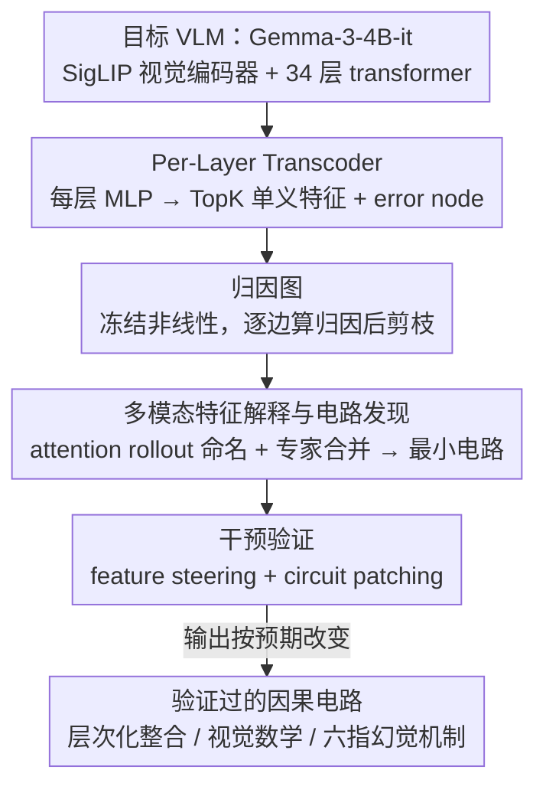

# Circuit Tracing in Vision-Language Models: Understanding the Internal Mechanisms of Multimodal Thinking

**会议**: CVPR 2026 Findings  
**arXiv**: [2602.20330](https://arxiv.org/abs/2602.20330)  
**代码**: [github.com/UIUC-MONET/vlm-circuit-tracing](https://github.com/UIUC-MONET/vlm-circuit-tracing)  
**领域**: 多模态VLM  
**关键词**: 可解释性, 电路追踪, transcoder, 归因图, feature steering

## 一句话总结

提出首个面向 VLM 的电路追踪框架，在 Gemma-3-4B 中训练 per-layer transcoder 并构建归因图，揭示了多模态推理的层次化整合机制、视觉数学电路和六指幻觉的内部成因，并通过 steering 和 circuit patching 验证电路的因果可控性。

## 研究背景与动机

**领域现状**：VLM（如 CLIP、LLaVA、GPT-4o）在视觉问答、图像描述、复杂视觉推理等任务上取得显著成功，但其内部工作机制仍然是不透明的黑箱。这一问题在医学影像、自动驾驶、内容审核等高风险应用场景尤为关键。

**现有痛点**：近年来，LLM 的机械可解释性研究（如电路发现、induction heads 分析、activation patching）已取得长足进展，但这些方法几乎完全局限于纯文本模型。VLM 面临独特的挑战——需要整合具有不同统计特性和语义的两种模态，还要发现有意义的视觉-语言对应关系。现有的 VLM 可解释性工作主要停留在高层分析（attention visualization、probing），本质上是相关性而非因果性的。

**核心矛盾**：我们对 VLM 如何将视觉特征绑定到 token、如何实现跨模态推理、以及视觉和语言注意力如何协调，几乎一无所知。Sparse autoencoders 和 transcoders 已在 LLM 中成功分解多义表示，但从未应用于多模态场景。

**本文目标**：建立首个完整的 VLM 电路追踪框架，系统分析多模态推理的内部计算机制。

**切入角度**：将 LLM 中已验证的 transcoder + attribution graph 范式扩展到多模态设定，针对 VLM 特有的图像 token 处理、双向注意力、跨模态信息流等问题开发新方法。

**核心 idea**：通过在 VLM 每层 MLP 中插入 transcoder 将多义表示分解为可解释的单义特征，结合归因图追踪特征间因果关系，发现并验证驱动多模态推理的稀疏计算电路。

## 方法详解

### 整体框架

这篇论文想回答一个此前几乎无人触碰的问题：VLM 在内部到底是怎么把图像和文字"想到一起"的？以往的 attention 可视化、probing 都只能看到相关性，看不到因果链条。作者把 Anthropic 在纯文本 LLM 上验证过的"transcoder + 归因图"范式整体搬到多模态场景，端到端跑通一条分析流水线：先给目标模型每一层 MLP 套上一个 transcoder，把纠缠的多义表示拆成稀疏的单义特征；再以这些特征为节点构建归因图，把"输入 token embedding → 中间特征 → 输出 logit"的因果贡献逐边算清；最后结合注意力分析和人类专家标注，从庞大的图里抽出真正驱动某个行为的最小电路，并用干预实验反向验证它确实在起作用。整个分析以 Gemma-3-4B-it 为对象，它用 SigLIP 视觉编码器（patch size 14，输入 896×896，先得到 4096 个 patch token，池化成 256 个 soft image token），语言侧是 34 层 transformer（$d_{model}=2560$，$d_{ff}=10240$）。

### 关键设计

**1. Per-Layer Transcoder：把每层 MLP 换成一组能读懂的单义特征**

直接分析 MLP 的内部表示没法做，因为同一个神经元往往同时编码许多互不相干的概念（多义性）。作者在每层 MLP 的位置插入一个 transcoder：编码器把输入 $x \in \mathbb{R}^{d_{model}}$ 投到远高维的特征空间 $z(x) = \text{ReLU}(W_{enc}x + b_{enc})$，再用 TopK 只保留其中 $k=48$ 个最强激活，解码器据此重建原 MLP 的输出 $\text{TC}(x) = W_{dec}z(x) + b_{dec}$。每个特征就是一对配对的编码器列和解码器行，对输出做加性贡献，从而把"这一层算了什么"翻译成一小撮可命名的特征在叠加。选 TopK 而非原始 transcoder 的 $\ell_1$ 惩罚，是因为前者不用反复调稀疏系数、训练更稳、特征更一致；选 transcoder 而非 SAE，则是因为 SAE 只重建激活本身，而 transcoder 模仿的是 MLP 的输入—输出行为，保留了计算等价性，下游做电路发现时特征间的因果关系才看得清。逼近总有误差，作者把重建残差 $e(x) = \text{MLP}(x) - \text{TC}(x)$ 显式留下，当作一个独立的 error node 挂进电路图，这样近似误差就不会被偷偷算进某个特征头上、干扰因果归因。

**2. 归因图：把整条因果链算成一张可加的图**

有了单义特征，还要知道它们之间谁推动了谁。关键观察是：在一个固定输入上，模型其实是局部线性的——只要把所有非线性（ReLU、attention softmax、LayerNorm）都冻结在当前取值，整个网络就退化成一组线性映射。于是任意一对源—目标特征间的因果贡献可以直接算出来：

$$A_{s \to t} = a_s \cdot w_{s \to t}, \qquad w_{s \to t} = f_{dec}^{(s)\top}\, J^\blacktriangledown_{(s) \to (t)}\, f_{enc}^{(t)}$$

其中虚拟权重 $w_{s \to t}$ 串起了源特征的解码器向量、冻结后的残差流 Jacobian、以及目标特征的编码器向量。这套定义最漂亮的性质是每个节点的 pre-activation 恰好等于所有入边归因之和（$h_t = \sum_{s} A_{s \to t}$），所以整张图是一个**完整的加性解释**——没有解释不掉的剩余项。剩下的就是做减法：剪掉归因小到可忽略的边（$|A_{s \to t}| < \epsilon$），把累积影响阈值卡在 0.80 和 0.98，节点数上限 $m=7500$，并保证保留的图至少覆盖 0.95 的 logit 概率质量，最终得到一张稀疏、能读的因果图。

**3. 多模态特征解释与电路发现：给无名特征命名，再抽出最小电路**

归因图里的特征一开始只是编号，得先知道每个特征"管什么"。文本 token 的特征好办，看它 top-k 激活样本的共同点即可；图像 token 的特征是 VLM 独有的难点，作者借 SigLIP 编码器的 attention rollout 来定位——在最后 $K$ 层里挑出熵最低（即注意力最集中）的 $q$ 比例 attention head，逐层相乘得到一张滚动注意力图，直接显示这个特征在原图上盯着哪块区域。命名完后，人类专家把功能相近的特征合并成节点，节点间归因就是成员特征归因之和，图随之收缩到可读的规模。为了让这一切跑得起来，作者用了一个很实用的 ad hoc 策略：不预计算模型全部特征，只算当前这张归因图里涉及的约 1000 个特征，存储和算力都大幅下降；遇到特定任务（如海獭识别）则临时再补 30 张相关图片算激活，特征语义立刻清晰很多。

**4. 干预验证：用 steering 和 circuit patching 反证因果**

发现一条电路不等于证明它真的在驱动行为，相关也可能只是巧合，所以作者用两种干预去主动改写电路再看输出。Feature steering 是在前向传播中把某个特征的激活强行设成目标值 $v_{\ell,t,i}$，按偏移 $\Delta z = v - z(x)$ 更新残差流 $h_{\ell,t} \leftarrow h_{\ell,t} + \Delta z \cdot d_{\ell,i}$，看输出是否随之可预测地变化。Circuit patching 更进一步，把电路 A 里某层某位置的特征补丁整段移植到结构相似的电路 B 上——比如在"火星"电路里抑制火星视觉特征、同时注入从"地球"电路中发现的地球视觉特征，再检查后续所有特征激活和最终输出是否一致地翻转成地球相关概念。只要输出按预期改变，就说明这条电路不是事后拼出来的相关性，而是真正承载因果的计算路径。

### 一个完整示例：火星 → 地球的电路移植

把上面四步串成一次具体的分析，以"这是哪颗行星？"这类视觉问答为例。输入一张火星图像，模型答"Mars"。第一步，每层 MLP 已被 transcoder 替换，于是这次前向传播被分解成一堆稀疏单义特征的叠加；第二步，冻结所有非线性后逐边算归因，得到从图像 patch token 一直连到输出 token "Mars" 的归因图，再剪枝到约千个特征；第三步，对图中关键的图像特征做 attention rollout，发现某个中间层特征的注意力牢牢锁在火星的红色盘面上，专家把它命名为"火星视觉特征"，并注意到它强烈推动了"Mars"这个 logit。第四步是验证：作者另取一张地球图像跑同样流程，定位出对应的"地球视觉特征"，然后回到火星这次前向传播里做 circuit patching——把火星视觉特征的激活压下去、把地球视觉特征的激活注入到同一层同一位置。结果下游特征像多米诺一样翻转，模型最终输出从"Mars"变成"Earth"。这一刀切下去既证明了那条视觉特征确实是答案的因果来源，也展示了整套流水线（分解 → 归因 → 命名 → 干预）是如何在一个真实样本上落地的。

## 实验关键数据

### Transcoder 训练配置

| 组件 | 配置 |
|------|------|
| 训练数据 | SmoLIM2 文本 144K + ImageNet 图像 144K + Cauldron QA 72K |
| 优化器 | AdamW, lr = $2 \times 10^{-4} \times \sqrt{2^{14} / (N_{latents} \times d_{model})}$ |
| 训练规模 | batch size 12, 30K 步, 8×H100, ~60 小时 |
| 稀疏化 | TopK, $k=48$ |
| 特征维度 | $d_{feat} = N_{latents} \times d_{model} \times 34$ |

### 扩展因子对比

| 扩展因子 $N_{latents}$ | 死特征比例趋势 | 层间差异 |
|------------------------|--------------|---------|
| 32 | 最高，大量特征未被利用 | 早期层（Layer 3）死特征比例尤其高 |
| **64（采用）** | 适中，利用率与质量平衡最优 | 中间层（Layer 15）激活模式最密集 |
| 128 | 最低，但 FVU 略有回升 | 高层特征冗余增加 |

### 多模态 vs 纯文本训练的 FVU 对比

| 训练数据 | 中间层 FVU（~Layer 15） | 高层 FVU（~Layer 30） | 差异分析 |
|---------|----------------------|---------------------|---------|
| 纯文本（SmoLIM2） | 较高 | 与多模态接近 | 缺乏视觉约束，中间层解释不充分 |
| **文本+图像（本文）** | **显著更低** | **略低** | 视觉特征提供额外约束，尤其在视觉信息整合的中间层 |

### 计算成本

| 操作 | 计算资源 |
|------|---------|
| 单个 QA 任务归因图 | H100 单卡 ~20 分钟 |
| 单个归因图（~1000 特征）的特征激活分析 | ~20 H100 GPU-hours |
| 28K 图像的 attention map 预计算 | H100 单卡 ~2 小时, ~2TB 存储 |
| Transcoder 完整训练 | 8×H100, ~60 小时 |

### 关键发现

- **层次化整合**：视觉和语义概念的联合编码特征仅在约 Layer 20 以上出现，早期层保持模态独立，支持"渐进绑定假说"——跨模态关联在网络深度方向上逐步建立
- **视觉数学电路**：对图像化算术（如渲染的 $1+2$），模型部分在视觉空间内计算——中间层出现对应结果数字 "3" 的视觉特征，跨上下文一致激活。还发现了数字范围编码和模算术模式的视觉表示，呼应了 LLM 文本电路中的类似发现
- **六指幻觉机制**：并非单一故障模式，而是感知偏差与内部电路动态的交互结果——(1) SigLIP 编码器产生过度强调通用"手"语义的 embedding；(2) 模型内部电路进一步放大手相关特征；(3) 数字 "6" 的视觉特征被压制到与无关数字相当的水平，而手相关特征强烈激活"五"电路。模型确实拥有可视化计数电路，但被更强的语义和感知信号淹没
- **平行视觉-语义通路与晚期收敛**：Gemma-3 在网络深层仍维持独立的视觉和语义表征流——如火星图像触发的"航天飞机"关联特征反映了独立于语义的视觉联想；高层中视觉相似物种（海獭、海豹、河狸）一致激活，即使语义类别不同。两条通路在最终层合并为统一的多模态表征

### 消融实验

| 干预方式 | 实验设置 | 结果 |
|---------|---------|------|
| Circuit Patching（火星→地球） | 抑制中间层火星视觉特征，激活地球视觉特征 | 后续所有特征和输出转变为地球相关概念 |
| Feature Steering | 修改特定特征激活值 | 输出可预测性地改变，验证电路因果性 |
| 特征消融（置零） | 将目标特征设为零 | 相关行为被精确抑制 |
| 特征放大 | 将目标特征设为正常数 | 相关行为被增强 |

## 亮点与洞察

- 首次在 VLM 中实现完整的电路追踪，将 Anthropic 在 LLM 上的方法论成功扩展到多模态场景
- 六指幻觉的机制分析特别有洞察力：不是简单的"编码器出错"，而是编码器偏差 + 内部电路竞争 + 计数电路被淹没三个因素的交互结果
- 发现 VLM 语言模型部分保持了独立的视觉表征空间，视觉相似性驱动的特征聚类和共激活独立于语义组织
- Ad hoc 特征分析策略实用且高效：仅分析当前归因图中的特征，配合小规模任务相关图像集，大幅降低成本同时提升可解释性

## 局限与展望

- 仅分析 Gemma-3-4B 一个模型，且该模型使用 SigLIP + 双向注意力机制可能引入特有复杂性，结论的普适性未经验证
- Per-layer transcoder 无法捕获跨层超位（cross-layer superposition），而 VLM 中图像 embedding 的高特征密度使得归因图中频繁出现近似重复的视觉特征
- 视觉编码器 attention map 有时难以定位相关区域，限制了图像特征的标注质量
- 电路发现依赖人类专家手动标注，难以引入定量评估或直接应用于模型微调
- 计算成本高（单个归因图的完整分析需 ~20 GPU-hours），自动化特征解释方法仍计算上过于昂贵
- 未深入研究不同 transcoder 配置（如 JumpReLU、BatchTopK）对 VLM 的最优训练策略

## 相关工作与启发

- **LLM 电路追踪的直系扩展**：基于 Anthropic 的 circuit tracing 框架（Lindsey et al., Ameisen et al.）和 Hanna et al. 的 per-layer transcoder 适配方案，本文首次处理图像 token 和跨模态信息流
- **与 attention visualization / probing 的本质区别**：传统 VLM 可解释方法是相关性分析，本文的电路追踪是因果性的——通过干预实验验证电路确实驱动行为
- **Sparse autoencoders vs Transcoders**：SAE 重建激活本身，transcoder 模仿 MLP 的 input-output 行为，后者更适合电路发现因为保持了计算等价性
- **启发**：VLM 内部独立的视觉表征空间的存在提示视觉和语言可能在"最后一刻"才真正融合；六指幻觉的多因素成因为幻觉缓解提供了多个切入点（编码器去偏、电路竞争调节、计数电路增强）

## 评分

- 新颖性: ⭐⭐⭐⭐⭐ 首个完整的 VLM 电路追踪框架，填补了多模态机械可解释性的空白
- 实验充分度: ⭐⭐⭐⭐ 多维度分析+因果干预验证，但仅覆盖单个模型，缺少定量基准对比
- 写作质量: ⭐⭐⭐⭐⭐ 案例分析深刻且引人入胜，方法论阐述清晰，图示丰富
- 价值: ⭐⭐⭐⭐⭐ 为 VLM 可解释性奠定了标准化分析框架，六指幻觉等洞察具有直接的实际应用价值

<!-- RELATED:START -->

## 相关论文

- [\[CVPR 2026\] Mechanisms of Object Localization in Vision-Language Models](mechanisms_of_object_localization_in_vision-language_models.md)
- [\[CVPR 2026\] EduDiag: A Benchmark for Educational Diagnostic Reasoning with Error Tracing and Correction on Large Multimodal Models](edudiag_a_benchmark_for_educational_diagnostic_reasoning_with_error_tracing_and_.md)
- [\[CVPR 2026\] Thinking with Programming Vision: Towards a Unified View for Thinking with Images](thinking_with_programming_vision_towards_a_unified_view_for_thinking_with_images.md)
- [\[ICLR 2026\] Visual Symbolic Mechanisms: Emergent Symbol Processing in Vision Language Models](../../ICLR2026/multimodal_vlm/visual_symbolic_mechanisms_vlm.md)
- [\[CVPR 2026\] All Roads Lead to Rome: Incentivizing Divergent Thinking in Vision-Language Models](all_roads_lead_to_rome_incentivizing_divergent_thinking_in_vision-language_model.md)

<!-- RELATED:END -->
