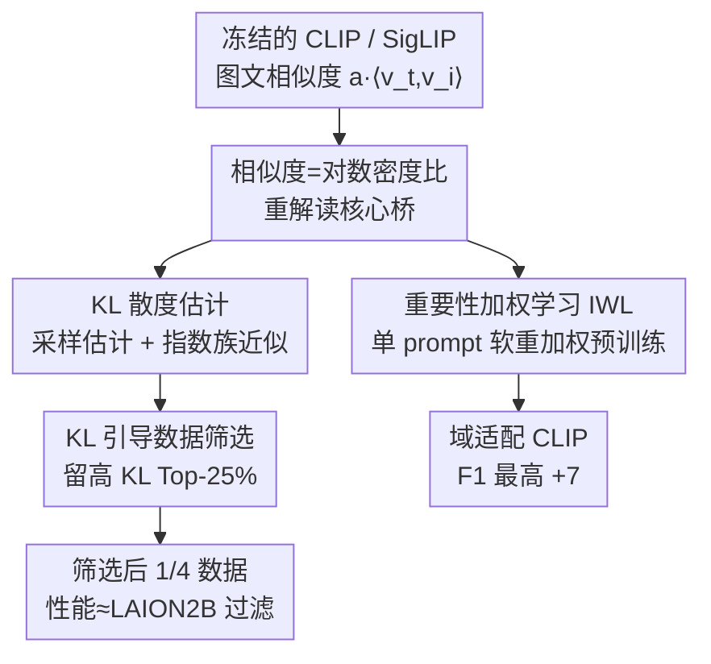

# CLIP-like Model as a Foundational Density Ratio Estimator

**会议**: CVPR 2026  
**arXiv**: [2506.22881](https://arxiv.org/abs/2506.22881)  
**代码**: https://github.com/fumiyauchiyama/CLIP_Density_Ratio (有)  
**领域**: 多模态VLM  
**关键词**: 密度比估计, 对比学习, 重要性加权, KL散度, 数据筛选

## 一句话总结
本文把 CLIP / SigLIP 这类对比训练的图文模型重新解读为"现成的密度比估计器"——对比目标隐式优化的相似度分数正比于对数密度比，由此免训练地导出两个新能力：单 prompt 的重要性加权预训练（F1 最高 +7 分）和图文 KL 散度估计（衡量语义多样性、并据此做数据筛选，效果与 LAION2B 过滤相当）。

## 研究背景与动机

**领域现状**：密度比（density ratio，两个概率密度之比 $p(x)/q(x)$）是统计机器学习里的核心工具，重要性加权、散度估计、似然无关推断都建立在它之上。经典的直接估计方法有 KLIEP、uLSIF、把密度比估计转成逻辑回归的 LogReg，以及噪声对比估计（NCE）。而现代大规模图文模型 CLIP、SigLIP 恰恰是用 InfoNCE / NCE 这类对比目标训练的。

**现有痛点**：尽管 CLIP-like 模型在理论上具备估计高维多模态密度比的能力，社区却几乎只把它们当作"嵌入器 / 检索器"在用——只取 embedding 算余弦相似度做下游分类、检索。对比学习在训练时隐式学到的"密度比结构"从没被系统地挖出来用过。与此同时，经典密度比估计方法虽然原理清晰，却需要为每一对分布单独训练一个估计器，成本高且难以泛化。

**核心矛盾**：一边是"为每对分布定制训练"的传统密度比估计器，泛化差、成本高；另一边是已经在数十亿图文对上训练好、编码了海量边缘/条件分布关系的 CLIP，却被埋没了概率推理能力，只当特征提取器用。

**本文目标**：把 CLIP-like 模型当成"预训练好的、通用的密度比估计器"，并验证这个视角能解锁哪些算法能力。具体分解为：(1) 给出对比目标如何编码密度比的统一推导；(2) 在重要性加权学习上验证；(3) 在 KL 散度估计与数据筛选上验证。

**切入角度**：NCE 早就证明对比目标建模的是两个分布的对数密度比（如 Word2Vec 的 skip-gram 近似点互信息）。把这条结论直接套到 CLIP 上——InfoNCE 优化的图文相似度 $a\langle v_t, v_i\rangle$ 正比于 $\log \frac{p_T(t\mid i)}{p_T(t)}$，于是相似度分数本身就是一个对数密度比估计。

**核心 idea**：不重新训练任何估计器，直接把 CLIP 的相似度分数当作对数密度比读出来，免训练地拿去做重要性加权和 KL 散度估计。

## 方法详解

### 整体框架

本文是一篇"重解读 + 两个应用"的工作，没有训练新模型结构。整体逻辑是：先把对比目标在数学上重写成密度比的形式（一个统一的理论桥），再顺着这座桥导出两条互不依赖的下游应用——重要性加权学习（域适配预训练）和 KL 散度估计（语义多样性度量 + 数据筛选）。所有应用都只用一个**现成、冻结**的 CLIP，不引入额外训练的估计器。

### 关键设计

**1. 相似度即对数密度比：把对比目标重写成密度比的统一桥**

这是全文的地基，针对的痛点是"CLIP 的相似度分数到底在估计什么从没被讲清"。作者证明，用 InfoNCE / NCE 训练出来的 embedding $v_i, v_t$ 满足

$$\frac{p_T(t\mid i)}{p_T(t)}=\frac{\exp(a\langle v_t,v_i\rangle)}{Z(i)},\qquad Z(i):=\mathbb{E}_{t\sim p_T(\cdot)}\big[\exp(a\langle v_t,v_i\rangle)\big]$$

即"给定图像后文本的条件分布"与"文本边缘分布"之比，其对数正比于图文 embedding 的内积，$a$ 是 logit scale，$Z(i)$ 是只依赖图像 $i$ 的归一化项。由模型目标的对称性，反过来对图像也成立（式 2）。这一步的价值在于：它把"CLIP 相似度"从一个经验性的对齐分数，提升为一个有明确概率含义的密度比估计量——后面两个应用全部建立在这条等式上，且因为是密度比，很多场景下 $Z$ 是常数可直接约掉

**2. 重要性加权学习 IWL：一句 prompt 完成域适配预训练**

域适配里的协变量偏移（covariate shift）假设条件分布 $p(\cdot\mid x)$ 不变、但输入图像分布 $p_I(x)$ 变了。要估测试损失 $L_{\text{test}}=\mathbb{E}_{x\sim p_I^{\text{train}}}\big[\frac{p_I^{\text{test}}(x)}{p_I^{\text{train}}(x)}\,l(x)\big]$，传统做法要再训一个密度比估计器。本文的关键观察是：把"测试域"近似成"给定某个 prompt $t$ 的条件分布" $p_I^{\text{test}}(\cdot)\approx p_I(\cdot\mid t)$，那么权重直接由式 2 给出 $\frac{p_I^{\text{test}}(x)}{p_I^{\text{train}}(x)}\propto \exp(a\langle v_x,v_t\rangle)$，归一化项 $Z(t)$ 跨样本恒定可忽略。

于是只要一句域 prompt（如 "A photo of food"），就能给每个预训练样本算出软权重，重加权后的 CLIP 预训练损失为

$$L'_{\text{CLIP}}=-\sum_{j=1}^{N} e^{a\langle u_{i_j},u_{t^\dagger}\rangle}\Big(\log\frac{\exp s(t_j,i_j)}{\sum_k \exp s(t_k,i_j)}+\log\frac{\exp s(t_j,i_j)}{\sum_k \exp s(t_j,i_k)}\Big)$$

其中 $u$ 是另一个预训练 CLIP（ViT-L-14, LAION）的 embedding，$t^\dagger$ 是描述目标域的 prompt。为什么有效：图像越贴合域 prompt 权重越大，相当于一种**软选择**，比"丢掉所有低分样本"的硬过滤更稳健——尤其当 prompt 只松散地刻画了域、或代理指标不完美时。⚠️ 工程细节上 logit scale $a$ 从约 100 缩到 10，否则混合精度训练会因指数放大而溢出

**3. 基于密度比的 KL 散度估计：量化"条件化一个模态如何改变另一模态"**

第二个应用是估计图文之间的 KL 散度 $D_{\text{KL}}(i):=\mathrm{KL}(p_T(\cdot\mid i)\,\|\,p_T(\cdot))$（即 Information Gain）和反向的 $D_{\text{KLR}}(i):=\mathrm{KL}(p_T(\cdot)\,\|\,p_T(\cdot\mid i))$。痛点是：传统要先估两个分布再算散度，误差累积。本文给两种免训练估计：(i) **采样估计**——把式 1 代入 KL 定义，用候选文本集 $\mathcal{D}_T$ 上的相似度直接近似（式 10/11），核心是一组 $a\langle v_t,v_i\rangle$ 的 softmax 加权和 log-sum-exp；(ii) **指数族近似**——把固定图像下的文本条件分布视为指数族（$a v_t$ 是充分统计量、$v_i$ 是自然参数），用指数族两参数间 KL 的二次型展开，得到闭式

$$D_{\text{KL}}(i)\approx a^2 (v_i-\bar v_I)^\top G_T (v_i-\bar v_I),\quad G_T:=\mathbb{E}_{t}\big[(v_t-\bar v_T)(v_t-\bar v_T)^\top\big]$$

即"中心化 embedding 在协方差度量下的平方范数"。进一步定义经验版 $D_W$（用样本协方差 $\hat G_T$）和最简版 $D_C:=a^2\|v_i-\hat v_I\|^2$（只用欧氏范数）。为什么这组指标有意思：实验发现 $D_{\text{KL}}$ 高的样本恰好是语义多样、罕见上下文的样本（图 1/3），把抽象的"信息量"落到了可解释的数据属性上；而 $D_C$ 与"频率/对数似然"强负相关（频繁图像 $D_C$ 小、罕见图像 $D_C$ 大），$D_{\text{KL}}$ 却与这些频率指标几乎不相关，说明它捕获的是另一维度的信息

**4. KL 引导的数据筛选：保留高 KL 样本做预训练数据精选**

顺着设计 3 的发现——高 KL = 语义信息量大——作者把它当筛选信号。痛点是现有过滤（CLIPScore 等）只看图文"对齐度"，不衡量单个样本对整体分布的"影响力"。做法极简：在 DataComp 数据池里，对每对 $(t,i)$ 算 $D_{\text{KL}}(t)$ 或 $D_{\text{KL}}(i)$，只保留 KL 值 Top-25% 的样本，再在这 1/4 子集上预训练 CLIP。为什么是补充性信号：CLIPScore 测的是图文一致性，KL 测的是样本相对全局分布有多"信息丰富"，两者正交。实验显示，仅靠现成 CLIP + 简单密度比，文本侧 KL 筛选在 ImageNet1k 零样本上比无过滤高 5–8 个百分点、38 任务平均分与 LAION2B 过滤相当——尽管只用了 1/4 数据。作者也指出：文本侧 KL 比图像侧更有效，说明"度量文本信息量"更直接对应图文对齐

## 实验关键数据

### 主实验：数据筛选（DataComp small scale，38 任务）

| 过滤方法 | 模态 | IN1k 零样本 Acc. | 38 任务平均 |
|----------|------|------------------|-------------|
| 无过滤 | — | 0.025 | 0.132 |
| LAION2B | — | 0.031 | 0.133 |
| Basic 启发式 | — | 0.030 | 0.142 |
| CLIPScore | — | **0.051** | **0.173** |
| $D_{\text{KL}}$ | Text | 0.0300 | 0.1337 |
| $D_{\text{KLR}}$ | Text | 0.0325 | 0.1344 |
| $D_C$ | Text | 0.0312 | 0.1319 |
| $D_{\text{KL}}$ | Image | 0.0216 | 0.1220 |

> 文本侧 $D_{\text{KL}}/D_{\text{KLR}}/D_C$ 用 1/4 数据即达到甚至略超 LAION2B 与 Basic；但 CLIPScore 仍是最强 baseline，KL 单独用不超过它——作者定位 KL 为"互补信号"，可与对齐分数组合。

重要性加权学习（IWL）：在 CC12M 上重加权预训练，用 "A photo of food/pets/flowers" 三个域 prompt，在 Food101 / Oxford-IIIT Pet / Flowers102 三个零样本分类上评测。Pet 数据集第 4–6 epoch 检查点处，accuracy 比标准 CLIP 损失基线高 2–8 个百分点、F1 高 3–7 个百分点（摘要称 F1 最高 +7）。

### 分析实验：KL 指标与已有指标的相关性（Pearson，针对图像）

| 已有指标 | $D_{\text{KL}}$ | $D_{\text{KLR}}$ | $D_C$ | $D_W$ |
|----------|------|------|------|------|
| Conformity [18] | -0.255 | 0.015 | **-1.000** | 0.093 |
| $\log p(x)$ [2] | -0.346 | 0.096 | -0.626 | 0.389 |
| Raw Norm [9] | -0.089 | -0.046 | -0.731 | -0.120 |

### 关键发现
- **$D_C$ 与 Conformity 完全负相关（-1.000）**：本文从指数族视角导出的 $D_C$，在忽略常数后等价于 Conformity 的相反数，给"频率/常见性"度量提供了密度比层面的统一解释。
- **$D_{\text{KL}}$ 捕获的是另一维度**：它与频率类指标（$\log p(x)$、Raw Norm）几乎不相关，说明语义多样性 ≠ 频率，是独立信号——这正是它能补充 CLIPScore 的根据。
- **N-gram 覆盖验证语义多样性**：按 $D_{\text{KL}}$ 分十分位，最低 KL 组里 top-2500 三元组覆盖 60% 出现，高 KL 组只覆盖约一半或更少，定量证明高 KL 样本用词更多样。
- **文本侧 KL > 图像侧**：筛选时度量文本信息量比度量图像信息量更有效。

## 亮点与洞察
- **"现成模型当估计器"的视角迁移性强**：把"训练目标的隐式数学含义"挖出来直接复用，零额外训练。这套思路可推广到任何用 NCE / InfoNCE 训练的模型（语音、推荐、图-图对比），都能尝试读出密度比再做重要性加权或散度估计。
- **单 prompt 软重加权 = 极低成本域适配**：不用造领域数据集、不用标注，一句话描述目标域就能给海量预训练样本打软权重，比硬过滤更鲁棒——对"领域只能粗略描述"的现实场景特别实用。
- **指数族近似把 KL 变成闭式范数**：$D_C=a^2\|v_i-\hat v_I\|^2$ 这种"中心化 embedding 范数"几乎零成本，却能反映样本罕见度，是个可即插即用的数据质量探针。
- **KL 与 CLIPScore 正交**：明确指出"对齐度"和"信息量"是两个轴，提示未来过滤可以"先卡对齐阈值、再在合格样本里挑高信息量的"。

## 局限与展望
- **强分布假设**：核心成立条件是"CLIP 学到的条件/边缘密度比 = 真实训练数据的密度比"。预训练数据的偏置和建模误差会直接影响密度比估计的准确性，作者自己点明这是最强假设。
- **实验规模偏小**：IWL 在 CC12M、数据筛选在 DataComp 最小数据池上做，模型与数据都没放大。是否在更大规模下仍成立（尤其 logit scale 能否用回接近 100 的值带来更大提升）未验证。
- **KL 估计是有限样本近似**：依赖一组受限的候选文本/图像集，偏差与方差受 embedding、温度参数、采样策略影响，缺乏对估计误差的系统刻画。
- **单独用不如 CLIPScore**：数据筛选上 KL 没超过 CLIPScore，"组合 KL + 对齐分数"只是被提出为未来工作，没给出实际组合方案与结果。

## 相关工作与启发
- **vs 经典密度比估计（KLIEP / uLSIF / LogReg / NCE）**: 它们直接从样本估两分布之比但需为每对分布定制训练；本文主张直接复用在数十亿图文对上训练好的 CLIP 当通用估计器，免训练、跨模态，劣势是受预训练分布假设约束。
- **vs Word2Vec 密度比解读 [19,26]**: 前人已把 skip-gram 对比目标解读为点互信息/指数族 KL，但局限在 NLP；本文首次把这套解读搬到高维图文模型并落到下游应用（域适配、数据筛选）。
- **vs CLIPScore [14] 数据过滤**: CLIPScore 测图文对齐、识别噪声/错配样本；本文 KL 测样本相对全局分布的信息量，两者正交互补，单独用 KL 不及 CLIPScore 但可组合。
- **vs Conformity [18] / Whitened CLIP [2] / Raw Norm [9]**: 这些频率/常见性指标本文用指数族框架统一解释（$D_C$ 等价于 -Conformity），并指出 $D_{\text{KL}}$ 捕获的语义多样性是它们都没覆盖的新维度。

## 评分
- 新颖性: ⭐⭐⭐⭐⭐ 把 CLIP 重解读为通用密度比估计器是一个干净且有启发性的新视角，连带导出两个免训练应用
- 实验充分度: ⭐⭐⭐ 验证到位但规模偏小（CC12M / DataComp small），数据筛选未超 CLIPScore，组合方案留作未来工作
- 写作质量: ⭐⭐⭐⭐ 理论推导清晰、应用分层明确，公式与动机衔接好
- 价值: ⭐⭐⭐⭐ 提供了可迁移的"复用对比模型隐式目标"范式，单 prompt 域适配与 KL 数据探针都有实用潜力

<!-- RELATED:START -->

## 相关论文

- [\[CVPR 2026\] A More Word-like Image Tokenization for MLLMs](a_more_word-like_image_tokenization_for_mllms.md)
- [\[CVPR 2026\] β-CLIP: Text-Conditioned Contrastive Learning for Multi-Granular Vision-Language Alignment](b-clip_text-conditioned_contrastive_learning_for_multi-granular_vision-language_.md)
- [\[CVPR 2026\] Reconstructing CLIP for Open-Vocabulary Dense Perception](reconstructing_clip_for_open-vocabulary_dense_perception.md)
- [\[CVPR 2026\] Reevaluating the Intra-Modal Misalignment Hypothesis in CLIP](reevaluating_the_intra-modal_misalignment_hypothesis_in_clip.md)
- [\[CVPR 2026\] Conan: Progressive Learning to Reason Like a Detective over Multi-Scale Visual Evidence](conan_progressive_learning_to_reason_like_a_detective_over_multi-scale_visual_ev.md)

<!-- RELATED:END -->
