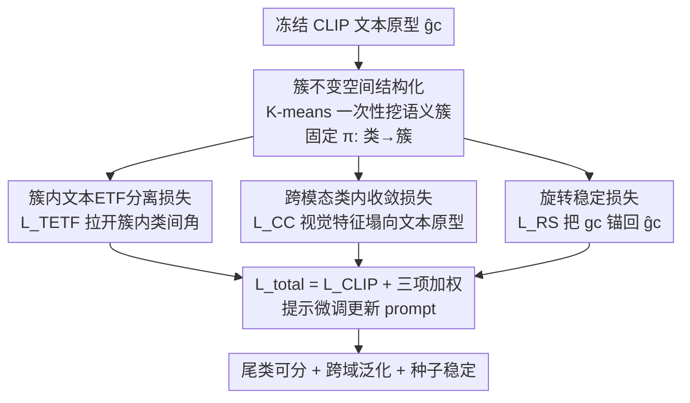

# Cluster-Aware Neural Collapse Prompt Tuning for Long-Tailed Generalization of Vision-Language Models

**会议**: CVPR 2026  
**论文**: [CVF Open Access](https://openaccess.thecvf.com/content/CVPR2026/html/Guo_Cluster-Aware_Neural_Collapse_Prompt_Tuning_for_Long-Tailed_Generalization_of_Vision-Language_CVPR_2026_paper.html)  
**代码**: 无  
**领域**: 多模态VLM  
**关键词**: 提示微调, 神经坍缩, 长尾识别, ETF, 语义聚类  

## 一句话总结
CPT 把"神经坍缩 / ETF 等角分离"约束从**全局所有类**收缩到**预训练 VLM 自带的语义簇内部**，再配一个把可学习文本原型拴回冻结原型的旋转稳定损失，从而在长尾提示微调里提升尾类可分性，同时不破坏 CLIP 的全局语义层级——在 11 个数据集上超过 DPC/DeKg/NPT 等 SOTA。

## 研究背景与动机
**领域现状**：提示微调（prompt tuning）已成为适配 CLIP 这类视觉-语言模型（VLM）的主流轻量手段——冻结主干，只学少量 prompt token，既省算力又保留可迁移性。为了提升类别可分性，近期一批方法借鉴**神经坍缩（Neural Collapse, NC）**：监督训练末期，同类特征塌到一个原型、不同类原型张成一个**等角紧框（Equiangular Tight Frame, ETF）**，两两夹角相等且最大化分离。于是有方法直接对**全部类**的文本原型施加一个**全局 ETF** 约束，把类间角间隔顶大，期望帮尾类不被头类吞掉。

**现有痛点**：作者指出全局 ETF 有两个硬伤。其一，它**抹平了 VLM 学到的语义层级**——预训练模型里语义相近的类本就该更近，强行让所有非对角相似度趋同会压低相似度矩阵的有效秩，损害跨数据集与 OOD 泛化（论文 Fig.1a-c 可视化：全局 ETF 把原型推成一个单纯形，预训练里的语义簇消失了）。其二，ETF 只约束**相对角度**、不约束**绝对朝向**，原型整体旋转不改变两两夹角却让训练在不同随机种子间漂移，于是 SOTA 方法的精度对种子高度敏感（Fig.1d）。

**核心矛盾**：尾类可分性（要更强的几何分离）和跨域泛化（要保住预训练语义结构）之间存在 trade-off——全局 ETF 为了前者牺牲了后者，而且约束不完整导致训练不稳。

**本文目标**：在提示微调下同时做到 (i) 提升尾类可分性、(ii) 保住可迁移的全局语义结构、(iii) 对随机种子稳定。

**切入角度**：既然预训练 VLM 本身就编码了"语义簇"，那就**别在全标签空间施加 ETF，而是在每个语义簇内部局部施加**——簇内拉开类间角、簇间保留预训练自带的差异。

**核心 idea**：用"簇内 ETF + 跨模态收敛 + 旋转锚定"三件套，把 NC 约束**限定在局部语义邻域**里，换全局语义不被压平。

## 方法详解

### 整体框架
CPT 建立在标准提示微调 CLIP 之上：冻结图像编码器 $G_v$ 和文本编码器 $G_t$，只插入可学习的连续 prompt。图像 $x$ 经视觉编码得特征 $f\in\mathbb{R}^d$，类别 $c$ 经文本编码得可学习文本原型 $g_c\in\mathbb{R}^d$；同一类**不带 prompt** 的冻结原型记作 $\hat g_c$。在原始对比损失 $L_{\text{CLIP}}$ 之上，CPT 加两大组件：先做**簇不变空间结构化**（cluster-invariant space structuring）——用冻结 VLM 文本特征跑一次 K-means 得到 $M$ 个语义簇，并把这个划分固定下来作为"语义围栏"；再在每个围栏内做 **NC 驱动的可分性优化**，由三个互补损失共同塑形簇内几何。整条 pipeline 是"先圈语义邻域、再在邻域内施加坍缩约束"，组件间一致地围绕"局部强约束、全局不动"这一原则。

### 关键设计

**1. 簇不变空间结构化：把 ETF 关进预训练自带的语义围栏里**

这一步直击"全局 ETF 抹平语义层级"的痛点。作者**只用冻结文本特征** $\{\hat g_c\}$ 跑**一次** K-means，得到 $M$ 个互不相交的语义簇 $\{\hat S_1,\dots,\hat S_M\}$，每簇质心 $\hat\mu_m=\frac{1}{|\hat S_m|}\sum_{c\in\hat S_m}\hat g_c$。关键是**全程不重新聚类**：固定一个映射 $\pi:\mathcal{C}\to\{1,\dots,M\}$，$\pi(c)=m\iff c\in\hat S_m$，训练期所有可学习文本原型 $g_c$ 及其视觉特征 $\{f_{c,i}\}$ 都被钉在 $S_{\pi(c)}$ 里。冻结划分有两重好处：一是保住预训练学到的高层语义结构（这是迁移与 OOD 泛化的根），二是避免每步梯度都让簇成员变动、给簇级目标灌进高方差的不稳定 target。后续所有 NC 约束都**只在簇内生效**，簇间则任其按预训练几何保持分离，从而维持更高秩、更丰富的相似度结构。

**2. 簇内文本 ETF 分离损失 $L_{\text{TETF}}$：只在易混的语义邻域里拉开类间角**

CLIP 里每个类只有一个由标签生成的文本嵌入，作者就拿它当类原型。在每个簇 $S_m$ 内收集 $k_m$ 个归一化文本原型 $\tilde P_m$，构造余弦相似度矩阵 $C_m=\tilde P_m^\top\tilde P_m$，理想 ETF 应让非对角项都相等。约束为

$$L_{\text{TETF}}=\frac{1}{M}\sum_{m=1}^{M}\left\|\,C_m+\frac{1}{k_m-1}(\mathbf{1}-I)\,\right\|_F^2,$$

其中 $\mathbf{1}$ 是全 1 矩阵、$I$ 是单位阵，$-\frac{1}{k_m-1}$ 正是单纯形 ETF 的理想两两余弦值。它在**同一语义邻域内**增大类间角分离——而这恰恰是尾类最容易被头类吞并的地方。与全局 ETF 的本质区别在于：它**绝不强迫不相关的簇彼此等距**，于是拿到局部可分性（尤其利于稀有类）而不压平全局语义层级。

**3. 跨模态类内收敛损失 $L_{\text{CC}}$：让视觉特征塌向对应文本原型**

NC 预测收敛时同类样本都对齐到单一原型，作者把这个直觉**跨模态化**：用类 $c$ 的 $N_c$ 个视觉特征去塌向其文本原型 $g_c$，

$$L_{\text{CC}}=\frac{1}{K}\sum_{c=1}^{K}\left(\frac{1}{N_c}\sum_{i=1}^{N_c}\left\|\frac{f_{c,i}}{\|f_{c,i}\|_2}-\frac{g_c}{\|g_c\|_2}\right\|_2^2\right).$$

它一方面压缩类内角度散布、一方面强制跨模态对齐：类 $c$ 的图像特征被显式拉向提示微调后的文本原型，使文本原型成为该类"簇内锚定的语义中心"。这给簇内的 ETF 分离补上了"类内紧致"的另一半。

**4. 旋转稳定损失 $L_{\text{RS}}$：钉住绝对朝向，消掉种子间漂移**

这一项专治全局 ETF 的第二个硬伤——ETF 只定**相对几何（两两角）**、绝对朝向自由，原型整体旋转几乎不改变 $L_{\text{TETF}}$，但因为 CLIP 依赖视觉/文本编码器的一致对齐，这种自由漂移会放大成下游精度的种子间方差。作者用 L1 把每个可学习原型软锚回其冻结原型：

$$L_{\text{RS}}=\frac{1}{K}\sum_{c=1}^{K}\|g_c-\hat g_c\|_1.$$

它惩罚对原始预训练表示的大幅偏离、又允许适度自适应，几何上**固定了原本自由的全局旋转**、阻止原型在不同种子间漂移，实测显著降低种子间方差、让结果更可复现。

### 损失函数 / 训练策略
最终目标是对比损失加三项簇感知 NC 损失的加权和：

$$L_{\text{total}}=L_{\text{CLIP}}+\lambda_{\text{TETF}}L_{\text{TETF}}+\lambda_{\text{CC}}L_{\text{CC}}+\lambda_{\text{RS}}L_{\text{RS}}.$$

默认权重 $\lambda_{\text{TETF}}=0.25,\ \lambda_{\text{CC}}=0.15,\ \lambda_{\text{RS}}=0.10$（ImageNet base-to-new 上的敏感性分析得出）。骨干用 ViT-B/16，冻结主干、只更新 prompt。

## 实验关键数据

数据集：11 个分类基准（ImageNet/Caltech/OxfordPets/StanfordCars/Flowers/Food/FGVCAircraft/SUN/DTD/EuroSAT/UCF）。用指数衰减下采样模拟长尾，失衡比 $\tau=\min\{n_k\}/\max\{n_k\}\in\{1,0.25,0.06\}$，固定 $\max\{n_k\}=16$；评测三种协议：base-to-new、cross-dataset、domain generalization。

### 主实验：Base-to-New（11 数据集平均，调和均值 H）

| 失衡比 | MaPLe | CoPrompt | NPT | DeKg | DPC | CPT(本文) |
|--------|-------|----------|-----|------|-----|-----------|
| τ=1（平衡） | 78.25 | 78.72 | 78.31 | 80.12 | 79.62 | **80.28** |
| τ=0.25 | 71.38 | 72.24 | 72.98 | 72.99 | 72.92 | **73.58** |
| τ=0.06（重尾） | 69.12 | 71.04 | 71.76 | 71.50 | 71.75 | **72.47** |

平衡时 CPT 与最强方法相当（不为长尾牺牲常态泛化）；越往重尾（τ 越小），CPT 相对 SOTA 的领先越明显，印证"保住预训练语义结构 + 局部强约束"对尾类的价值。Cross-Dataset 迁移（ImageNet 训、10 个目标集直测）CPT 平均 67.78%，高于 NPT 67.11%、DeKg 66.92%、DPC 66.27%。

### 消融实验（11 数据集调和均值，含两种失衡比）

| 配置 | τ=0.25 B2N / Cross / DG | τ=0.06 B2N / Cross / DG | 说明 |
|------|------------------------|------------------------|------|
| 基线（无三损失） | 70.35 / 63.89 / 57.99 | 69.99 / 63.84 / 57.03 | 仅 prompt tuning |
| +$L_{\text{TETF}}$ | 72.03 / 65.75 / 59.21 | 71.10 / 64.88 / 57.92 | 簇内 ETF 单独贡献最大 |
| +$L_{\text{TETF}}$+$L_{\text{CC}}$ | 73.22 / 66.03 / 59.66 | 71.85 / 65.49 / 58.56 | 类内收敛再加成 |
| +$L_{\text{TETF}}$+$L_{\text{RS}}$ | 72.42 / 65.94 / 59.49 | 71.93 / 65.63 / 58.64 | 旋转稳定单加也涨 |
| 全部（CPT） | **73.58 / 66.76 / 60.16** | **72.47 / 65.97 / 59.12** | 三损失协同最优 |

### 关键发现
- **$L_{\text{TETF}}$ 是主力**：单独加它就把 τ=0.25 base-to-new 从 70.35 拉到 72.03（+1.68），是三项里增量最大的，说明"簇内局部分离"是尾类可分性的核心来源。
- **三项互补不冗余**：$L_{\text{CC}}$（类内紧致）与 $L_{\text{RS}}$（朝向锚定）单独叠加都能再涨，三者全开取得每个协议的最优，证明"簇内分离 + 类内收敛 + 旋转稳定"分别补上几何的不同维度。
- **稳定性收益**：论文 Fig.1d 显示在 EuroSAT 上 CPT 的种子间方差显著低于 NPT，呼应 $L_{\text{RS}}$ 固定绝对朝向的设计意图。
- **场景偏好**：越重尾、越跨域，CPT 相对优势越大；平衡数据上提升有限——它本就是为长尾/分布漂移设计的。

## 亮点与洞察
- **"局部 ETF"是关键转念**：把 NC 约束从全标签空间收缩到预训练语义簇内，一举化解"几何分离 vs 语义保真"的 trade-off——既拿到尾类分离，又没把相似度矩阵压成低秩。这个"局部施加全局约束"的思路可迁移到任何怕破坏预训练结构的微调场景。
- **$L_{\text{RS}}$ 点破了 ETF 的隐疾**：ETF 只定相对角、不定绝对朝向，看似无害的全局旋转实则是种子敏感的根因。用一个 L1 锚定项就把这个被忽视的自由度钉死，是很"便宜"却切中要害的设计。
- **冻结聚类划分**避免了"目标随梯度乱跳"的优化噪声——把语义围栏当常量而非变量，这一工程取舍简单但对收敛很关键。
- **几乎零额外推理成本**：三项都是训练期损失，推理仍是标准提示微调 CLIP。

## 局限性 / 可改进方向
- **簇数 $M$ 与 K-means 质量是隐藏超参**：整套语义围栏依赖一次性 K-means 的划分，论文未充分讨论 $M$ 选择不当或簇划分错误时的鲁棒性（⚠️ 实现细节在补充材料，正文未给）。
- **依赖冻结 VLM 的语义簇是好是坏**：若预训练模型本身在某领域语义结构就差（如专业医学/遥感），冻结围栏可能把错误结构也固化下来。
- **失衡仅靠指数下采样模拟**：$\tau$ 控制的合成长尾未必等同真实世界的长尾分布形态，跨到真实长尾数据的结论需谨慎。
- **三个损失权重需调**：默认权重在 ImageNet 上选定，跨数据集是否仍最优、敏感度如何，正文只给了 ImageNet 上的曲线。

## 相关工作与启发
- **vs 全局 ETF 提示微调（如 NPT/相关 NC 方法）**：它们对全部类强加一个 ETF，CPT 只在簇内施加；区别在 CPT 保留簇间预训练几何，避免压低相似度矩阵有效秩，因而跨域/OOD 更稳、尾类也不被头类吞——这是本文最直接的对照面。
- **vs logit 调整 / 重加权类长尾方法**：这类方法只在**分类器层面**改打分（重加权、类先验校准），不重组图文嵌入空间；CPT 直接**塑形表示空间**，在改善头尾平衡的同时不偏离预训练语义几何，从根上解决"重加权伤泛化"的失败模式。
- **vs DPC / DeKg 等近期 prompt tuning SOTA**：它们在知识蒸馏/解耦上发力，CPT 的差异化在于把 NC 几何与预训练语义层级显式调和，长尾设定下持续领先。

## 评分
- 新颖性: ⭐⭐⭐⭐ "局部 ETF + 旋转锚定"切中全局 ETF 两大硬伤，转念清晰但仍在 NC×prompt tuning 既有框架内。
- 实验充分度: ⭐⭐⭐⭐ 11 数据集 × 3 失衡比 × 3 协议 + 逐项消融 + 权重敏感性，覆盖到位；真实长尾验证略缺。
- 写作质量: ⭐⭐⭐⭐ 动机—机制—损失对应工整，三项损失各自针对一个明确问题，逻辑顺。
- 价值: ⭐⭐⭐⭐ 几乎零推理开销、即插即用的损失项，对长尾 VLM 适配有实用价值。

<!-- RELATED:START -->

## 相关论文

- [\[CVPR 2026\] Towards Calibrating Prompt Tuning of Vision-Language Models](towards_calibrating_prompt_tuning_of_vision-language_models.md)
- [\[CVPR 2026\] Improving Calibration in Test-Time Prompt Tuning for Vision-Language Models via Data-Free Flatness-Aware Prompt Pretraining](improving_calibration_in_test-time_prompt_tuning_for_vision-language_models_via_.md)
- [\[CVPR 2026\] FedMPT: Federated Multi-Label Prompt Tuning of Vision-Language Models](fedmpt_federated_multi-label_prompt_tuning_of_vision-language_models.md)
- [\[CVPR 2026\] CAPT: Confusion-Aware Prompt Tuning for Reducing Vision-Language Misalignment](capt_confusion-aware_prompt_tuning_for_reducing_vision-language_misalignment.md)
- [\[CVPR 2026\] CoVFT: Context-aware Visual Fine-tuning for Multimodal Large Language Models](covft_context-aware_visual_fine-tuning_for_multimodal_large_language_models.md)

<!-- RELATED:END -->
