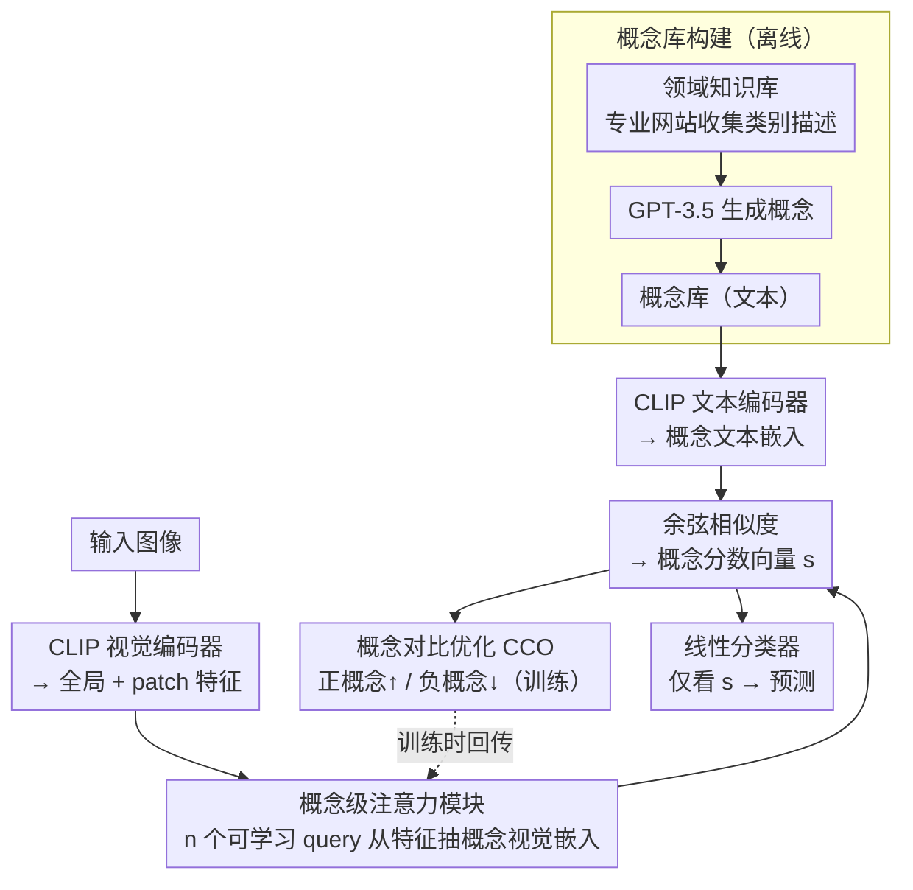

# Concept-wise Attention for Fine-grained Concept Bottleneck Models

**会议**: CVPR 2026  
**arXiv**: [2604.15748](https://arxiv.org/abs/2604.15748)  
**代码**: 无（接受后公开）  
**领域**: 多模态VLM  
**关键词**: 概念瓶颈模型, 可解释性, CLIP, 对比学习, 细粒度对齐

## 一句话总结

CoAt-CBM 通过可学习的概念级视觉 query 和概念对比优化（CCO）实现了自适应细粒度图像-概念对齐，在保持高可解释性的同时超越现有概念瓶颈模型和黑盒模型。

## 研究背景与动机

**领域现状**：概念瓶颈模型（CBM）通过先预测一组人类可理解的概念，再基于概念做最终分类，提供了清晰的可解释决策路径。近期工作利用 CLIP 等预训练视觉语言模型增强了 CBM 的性能。

**现有痛点**：现有 VLM-based CBM 面临两个关键限制。第一，计算概念分数时，要么依赖冻结的粗粒度全局特征（ResCBM、HybridCBM），存在粗到细的粒度不匹配；要么使用最优传输（DOT-CBM）分配 patch token，依赖预训练结构先验且计算代价高。第二，常用的 BCE 损失独立处理每个概念，忽略了概念间的互斥性，无法利用负概念作为参照来提升正概念的区分能力。

**核心矛盾**：预训练偏置导致视觉特征与文本概念之间的细粒度对齐不准确，而独立优化的损失函数又无法让模型学到概念间的相对重要性。

**本文目标**：实现自适应的细粒度图像-概念对齐，同时提升分类性能和可解释性。

**切入角度**：引入可学习的概念级视觉 query 来自适应地解耦视觉特征，并用对比约束替代 BCE 来建模概念间关系。

**核心 idea**：每个概念配一个可学习 query，通过注意力机制从视觉特征中提取概念特定的表示，再用多正样本对比损失优化概念分数的相对排序。

## 方法详解

### 整体框架

CoAt-CBM 想解决的是 VLM-based CBM 里"概念分数算不准"的问题：要么用冻结的全局特征导致粗到细的粒度不匹配，要么用最优传输对齐 patch 但又重又依赖结构先验。它的做法是给每个概念配一个专属的"探针"去主动从视觉特征里抠出相关部分，再换一种损失让概念之间互相参照。

整篇流程是这样转的：先离线构建领域知识库和概念库，确定每个类别对应哪些人类可读的概念；推理时 CLIP 视觉编码器把图像编成全局特征加 patch 特征；概念级注意力模块用一组可学习 query 从这些特征里为每个概念抽出一份概念特定的视觉嵌入；这些嵌入和概念的文本嵌入算余弦相似度，得到一个概念分数向量；训练阶段用概念对比优化（CCO）按正负概念对分数向量施加对比约束；最后一个线性分类器只看这个分数向量做预测——因为决策完全建立在可读概念上，整条路径是可解释的。

### 关键设计

**1. 领域知识概念库构建：先把概念集合本身做干净**

针对的是上游问题——直接让 LLM 凭自身知识生成概念，容易幻觉或遗漏；而纯可学习的概念向量又没有清晰语义、谈不上可解释。这里改成先从领域专业网站收集每个类别的知识描述构成类知识库（Class Knowledge Base），再把这些描述作为 prompt 喂给 GPT-3.5-Turbo 来为每个类别生成概念。这样概念是基于外部领域知识而非模型有限的内部知识产出的，既压住了幻觉，也补齐了遗漏，给下游的注意力和对比优化提供了一个可靠、语义明确的概念底座。

**2. 概念级注意力模块：让每个概念自己去视觉特征里"找证据"**

针对的痛点是粒度不匹配——一张图只有一个全局特征，却要去对齐几十上百个细粒度概念，自然对不准。这里的做法是为 $n$ 个概念各定义一个可学习 query $\mathbf{q}_i \in \mathbb{R}^{d_k}$，把 CLIP 输出的全局加 patch 特征 $\mathbf{Z}$ 投影成 key 和 value。每个 query 走一遍缩放点积注意力，先算出对各个 patch 的权重 $\bm{\alpha}_i = \text{Softmax}(\mathbf{K}\mathbf{q}_i / \sqrt{d_k})$，再加权聚合出这个概念的视觉嵌入 $\mathbf{e}_i = \mathbf{V}^\top \bm{\alpha}_i$。关键在于不同 query 在训练中会自动分工，各自学会盯住图像里不同的区域。比如对一张 CUB-200 的鸟图，"红色头冠"这个概念的 query 会把注意力集中到头部的 patch 上，"条纹翅膀"的 query 则落到翅膀区域——这就把原本一团的视觉特征动态解耦成了概念特定的表示，既绕开了冻结全局特征的粒度问题，也不像 OT 方法那样依赖预训练的结构先验。

**3. 概念对比优化（CCO）：让概念之间互相当参照系**

针对的是损失层面的缺陷——常用的 BCE 把每个概念当成独立的二分类，彼此不通气，模型学不到"这张图里该亮的概念应该比不该亮的概念分更高"这种相对关系。CCO 先用 CLIP 文本编码器把概念库编成文本嵌入，与上一步的概念视觉嵌入算余弦相似度得到概念分数向量 $\mathbf{s}$；再把一张图的分数切成两堆：与该图类别关联的正集 $\mathbf{s}^+$ 和不相关的负集 $\mathbf{s}^-$，然后用一个多正样本对比损失把正集整体往上推、负集往下压：

$$\mathcal{L}_{CCO} = -\log \frac{\sum \exp(s_i^+/\tau)}{\sum \exp(s_i^+/\tau) + \sum \exp(s_i^-/\tau)}$$

其中 $\tau$ 是温度。它和 BCE 的本质区别是：BCE 孤立地校准每个概念的绝对分数，CCO 则显式建模正负概念之间的相对大小，让负概念充当参照来抬高正概念的区分度。后面实验会看到，正是这一步把概念级可解释性指标从近乎失效拉回到可用。

### 损失函数 / 训练策略

总损失 $\mathcal{L} = \mathcal{L}_{cls} + \lambda \mathcal{L}_{CCO}$，分类损失加上加权的对比损失，$\lambda$ 默认 0.5。骨干用 CLIP-ViT-L/14，AdamW 优化器，单卡 3090 即可训练。

## 实验关键数据

### 主实验

| 方法 | 可解释 | CIFAR-10 | CIFAR-100 | CUB-200 |
|------|--------|----------|-----------|---------|
| Linear Probe | ✗ | 97.93 | 87.26 | 85.48 |
| HybridCBM | ✓ | 97.91 | 86.22 | 84.25 |
| DOT-CBM | ✓ | 97.75 | 84.75 | 83.76 |
| **CoAt-CBM** | **✓** | **98.51** | **89.19** | **89.13** |

### 消融实验

| 配置 | CIFAR-10 CDR | CIFAR-10 CC |
|------|-------------|------------|
| CoAt-CBM w/o CCO | 9.88 | 25.48 |
| CoAt-CBM_BCE | 82.16 | 85.42 |
| **CoAt-CBM** | **89.64** | **94.76** |

### 关键发现

- CoAt-CBM 在保持完全可解释性的同时超越了黑盒 Linear Probe，打破了"可解释性必然牺牲性能"的认知
- CUB-200 上提升 4.88%（89.13 vs 84.25），细粒度分类提升尤为显著
- CCO 对可解释性指标的提升极为关键：CDR 从 9.88% 提升到 89.64%，说明 BCE 下模型虽然分类准确但概念分数与图像内容不一致
- 概念级注意力模块始终优于 Adapter 和 LoRA 替代方案

## 亮点与洞察

- **CCO 揭示了 BCE 的根本缺陷**：即使分类准确，BCE 训练的模型在概念级可解释性上几乎失效（CDR 仅 9.88%）。CCO 通过引入概念间对比，让分数排序与实际图像内容高度一致
- **few-shot 优势明显**：CoAt-CBM 在 1-shot 到 16-shot 各档都超越 Linear Probe 和 LoRA-LP，说明概念先验提供了有效的归纳偏置
- **类-概念关联可视化清晰**：CCO 使类-概念关联矩阵从噪声状态变为清晰的对角线结构

## 局限与展望

- 概念库的质量依赖领域知识的收集质量，对于冷门领域可能不够完善
- 每个概念一个 query 的设计在概念数量极多时可能面临内存瓶颈
- 目前主要在分类任务上验证，向检测/分割等更复杂任务的扩展有待探索

## 相关工作与启发

- **vs HybridCBM**: HybridCBM 用可学习概念向量捕获缺失概念，但仍使用冻结全局特征；CoAt-CBM 通过注意力机制实现更细粒度的对齐
- **vs DOT-CBM**: DOT-CBM 用最优传输对齐 patch 和概念，计算开销大且依赖结构先验；CoAt-CBM 更灵活高效
- **vs PCBM**: PCBM 使用投影距离构建概念瓶颈，精度受限于全局特征质量

## 评分

- 新颖性: ⭐⭐⭐⭐ 概念级注意力 + CCO 的组合设计巧妙解决了两个关键问题
- 实验充分度: ⭐⭐⭐⭐⭐ 10 个数据集、全面的可解释性评估、few-shot 到 full 各设置覆盖
- 写作质量: ⭐⭐⭐⭐ 问题分析清晰，可解释性指标设计有说服力
- 价值: ⭐⭐⭐⭐⭐ 首次让可解释 CBM 全面超越黑盒模型，实用意义重大

<!-- RELATED:START -->

## 相关论文

- [\[CVPR 2026\] CLIP-Free, Label-Free, Unsupervised Concept Bottleneck Models](clip-free_label_free_unsupervised_concept_bottleneck_models.md)
- [\[CVPR 2026\] DeAR: Fine-Grained VLM Adaptation by Decomposing Attention Head Roles](dear_fine-grained_vlm_adaptation_by_decomposing_attention_head_roles.md)
- [\[CVPR 2026\] Vision-Language Models Encode Clinical Guidelines for Concept-Based Medical Reasoning](vision-language_models_encode_clinical_guidelines_for_concept-based_medical_reas.md)
- [\[CVPR 2026\] No Hard Negatives Required: Concept Centric Learning Leads to Compositionality without Degrading Zero-shot Capabilities of Contrastive Models](no_hard_negatives_required_concept_centric_learning_leads_to_compositionality_wi.md)
- [\[CVPR 2026\] Dictionary-Aligned Concept Control for Safeguarding Multimodal LLMs](dictionary_aligned_concept_control_for_safeguarding_multimodal_llms.md)

<!-- RELATED:END -->
