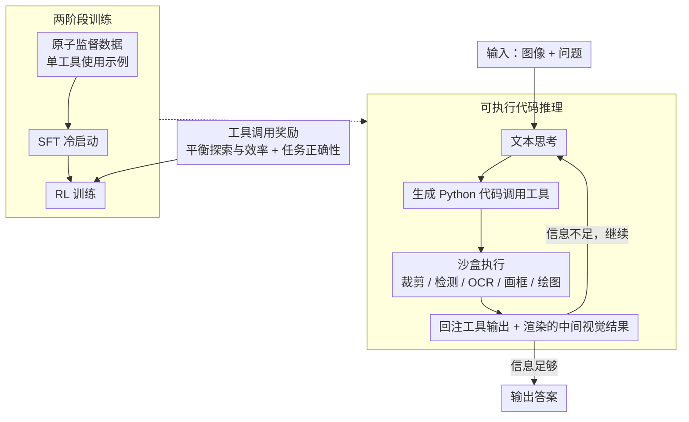

# CodeDance: A Dynamic Tool-integrated MLLM for Executable Visual Reasoning

**会议**: CVPR 2026  
**arXiv**: [2512.17312](https://arxiv.org/abs/2512.17312)  
**代码**: [https://CodeDance-VL.github.io](https://CodeDance-VL.github.io)  
**领域**: 多模态VLM / 工具使用  
**关键词**: 可执行视觉推理, 工具集成, 代码生成, 强化学习, 涌现行为

## 一句话总结
提出CodeDance，将可执行代码作为视觉推理的通用求解器——MLLM生成代码来定义、组合和执行多种工具，渲染中间视觉结果(bbox/线/图表)支持可审查的推理链，通过平衡探索与效率的工具调用奖励做RL训练，在RL中涌现出未见过的工具调用组合和跨任务迁移行为，7B模型在计数/视觉搜索/图表QA上超越GPT-4o。

## 研究背景与动机

1. **领域现状**：o3展示了"用工具思考"的能力——交替推理和工具使用。但现有开源方法要么仅用文本CoT、要么用固定schema(仅预测bbox坐标)、要么是单步pipeline。
2. **关键gap**：(1) 纯文本CoT无法动态与视觉输入交互或验证中间结果；(2) 固定schema限制了灵活性和可组合性；(3) o3是黑箱闭源系统。
3. **核心idea**：代码是最通用的"工具调用语言"——CodeDance让MLLM生成和执行Python代码来编排多种工具、计算中间结果、渲染视觉产物。通过RL训练发现**涌现行为**（训练中未见的新工具调用方式、组合和跨任务迁移）。

## 方法详解

### 整体框架

CodeDance 想解决的是：让 MLLM 像 o3 那样「用工具思考」，但要开源、可组合、还能看清推理过程。它的做法是把**可执行 Python 代码**当成统一的工具调用语言——推理时模型一边写文本思考、一边生成代码去调用各种工具（裁剪、检测、OCR、画框、绘图），代码在沙盒里执行后把工具输出和渲染出的中间视觉结果喂回模型，如此交替直到给出答案。这套「代码推理」能力靠两阶段训练得到：先用原子监督数据做 SFT 冷启动，再用平衡探索与效率的工具调用奖励做 RL，由此涌现出训练数据里没见过的工具组合。

### 关键设计

**1. 可执行代码推理：用代码当通用工具调用语言**

纯文本 CoT 没法真正和视觉输入交互、也无法验证中间结果，固定 schema（只预测 bbox 坐标）又限死了灵活性。CodeDance 让模型在「文本思考」和「执行代码」之间交替：先用文本推理，再生成 Python 代码去调用工具（裁剪、检测、OCR、画框、绘图），代码在沙盒里执行后，把工具输出和渲染出的中间视觉结果一并回注给模型，模型据此继续推理或再写新代码，循环到信息足够才输出答案。代码天然带变量、循环、条件和函数定义，表达力远超固定 schema——同样的模型规模下，仅凭这点性能就显著提升；而渲染出的视觉中间产物也让整条推理链可追溯、可核查。

**2. 两阶段训练：原子监督冷启动 + RL 精炼**

直接上 RL，模型还不会写规范的工具调用代码，于是先用「原子监督」数据（每条只示范单个工具的用法）做 SFT 冷启动，让模型掌握各工具的基本调用方式；再进入 RL 阶段，用工具调用奖励和任务正确性奖励联合优化。SFT 只教会原子能力，真正把这些原子能力组合成新颖工具链、并迁移到新任务的是后面的 RL——这也是涌现行为只在 RL 阶段出现、而 SFT 阶段不出现的原因。

**3. 工具调用奖励：让 RL 学会「适度用工具」**

工具不是用得越多越好：调太少则信息不足，调太多则过度使用、拖慢效率。为此设计一个平衡探索与效率的奖励，鼓励模型在恰当的时机调用恰当数量的工具。实验显示这种平衡奖励比「总是用工具」的奖励更有效，是 RL 中涌现出高质量工具使用行为的关键。

## 实验关键数据

### 主实验

| 模型 | CountBench | PixmoCount | V*Bench | ChartQA |
|------|:---:|:---:|:---:|:---:|
| GPT-4o | 87.9 | - | 67.5 | 86.7 |
| Qwen2.5-VL-7B | 76.5 | 50.4 | 76.4 | 86.3 |
| Deepeyes-7B | 80.4 | 57.2 | 90.4 | 78.2 |
| **CodeDance-7B** | **91.2** | **77.1** | 84.8 | **87.5** |

CountBench +19.2%, PixmoCount +53.0% vs Qwen2.5-VL-7B基线。

### 涌现行为案例
- 未见过的工具组合（如zoom+count+compare的链式调用）
- 跨任务迁移（计数任务中迁移用于图表分析的区域检测）
- 自发生成验证代码（画出检测结果进行视觉核查）

### 关键发现
- 代码比固定schema表达力强得多——同一模型大小下性能显著提升
- 涌现行为是RL的关键产出——SFT阶段不出现这些行为
- 工具不是越多越好——平衡奖励比"总是用工具"的奖励效果更好

## 亮点与洞察
- **代码作为通用推理媒介**：比文本CoT更有执行力，比固定schema更灵活——代码天然支持变量、循环、条件、函数定义
- **RL训练的涌现性**：工具使用的新颖组合和跨任务迁移——从原子能力到创造性组合，类似语言模型的涌现能力
- **可审查推理**：代码+渲染的视觉中间结果→推理链完全可追溯可验证

## 局限与展望
- 代码执行需要沙盒环境→部署复杂度高于纯文本模型
- 工具集是预定义的——如何动态发现和接入新工具？

## 评分
- 新颖性: ⭐⭐⭐⭐⭐ 可执行代码推理+RL涌现行为
- 实验充分度: ⭐⭐⭐⭐ 计数/搜索/图表多基准+涌现分析
- 写作质量: ⭐⭐⭐⭐ 涌现行为的案例展示直观
- 价值: ⭐⭐⭐⭐⭐ 对VLM工具使用和推理范式有重要推动

<!-- RELATED:START -->

## 相关论文

- [\[CVPR 2026\] Proof-of-Perception: Certified Tool-Using Multimodal Reasoning with Compositional Conformal Guarantees](pop_proof_of_perception_conformal_reasoning.md)
- [\[CVPR 2026\] Unbiased Dynamic Multimodal Fusion](unbiased_dynamic_multimodal_fusion.md)
- [\[CVPR 2026\] DocSeeker: Structured Visual Reasoning with Evidence Grounding for Long Document Understanding](docseeker_long_document_understanding.md)
- [\[CVPR 2026\] Fine-Grained Post-Training Quantization for Large Vision Language Models with Quantization-Aware Integrated Gradients](fine-grained_post-training_quantization_for_large_vision_language_models_with_qu.md)
- [\[CVPR 2026\] The Coherence Trap: When MLLM-Crafted Narratives Exploit Manipulated Visual Contexts](the_coherence_trap_when_mllm-crafted_narratives_exploit_manipulated_visual_conte.md)

<!-- RELATED:END -->
