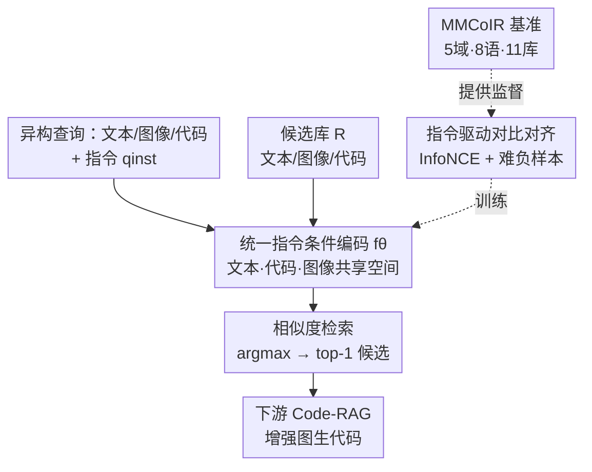

# CodeMMR: Bridging Natural Language, Code, and Image for Unified Retrieval

**会议**: CVPR 2026  
**论文**: [CVF Open Access](https://openaccess.thecvf.com/content/CVPR2026/html/Geng_CodeMMR_Bridging_Natural_Language_Code_and_Image_for_Unified_Retrieval_CVPR_2026_paper.html)  
**代码**: 未提供（论文未给出公开仓库链接）  
**领域**: 多模态VLM  
**关键词**: 多模态代码检索, 统一嵌入空间, 指令对比学习, Code-RAG, MMCoIR基准  

## 一句话总结
针对"代码检索只看文本、忽略代码渲染出来长什么样"这一缺口，本文造了首个多模态多语种代码检索基准 MMCoIR（5 个视觉域 / 8 种语言 / 11 个库），并基于 Qwen2VL 用指令条件对比学习训出统一模型 CodeMMR，把文本、代码、图像投到同一语义空间，nDCG@10 平均超过 VLM2Vec-v2/GME 等强基线约 10 分，接入 RAG 还能提升图生代码的执行率与视觉保真度。

## 研究背景与动机
**领域现状**：代码搜索通常被建模为信息检索（IR），是软件工程的基础设施，也越来越多地为 code-RAG 服务——检索相关代码片段喂给 LLM，缓解幻觉、提升生成可靠性。主流代码 IR 模型（CodeSearchNet、CoIR、CodeXEmbed 等）都在做"自然语言 ↔ 代码"的语义相似度。

**现有痛点**：现实中的软件产物天然是多模态的——一段代码可能定义网页布局、渲染图表、生成 SVG/UML 图。开发者经常需要"看这段代码跑出来是什么样"，或者反过来"给我一张图、找出能生成它的代码"。但现有代码 IR 系统几乎清一色 text-centric，把代码当纯文本处理，完全无视代码背后的视觉与结构语义。

**核心矛盾**：要支持"图 → 代码""文本+图 → 代码"这类组合检索，需要把异构模态（文本/代码/图像）对齐到同一嵌入空间；但通用多模态嵌入模型（CLIP、VLM2Vec、GME）虽然在图文上训得很强，面对"代码"这个长期被忽略的模态却表现很差——它们没见过 PlantUML 脚本、TikZ、SVG XML 这类结构化代码与其渲染图的对应关系。

**本文目标**：(1) 提供一个能系统评测多模态、多语种代码检索的基准；(2) 训一个统一模型，让单个检索器同时吃文本/代码/图像查询、跨域跨语言泛化。

**切入角度**：作者观察到，不同检索意图（图→码、码→图、文→码、文+图→码）的差异，可以用一条自然语言**指令** `qinst` 显式说清楚（"请检索与这张图匹配的代码"）。于是把"指令条件 + 对比对齐"作为统一不同任务的钥匙。

**核心 idea**：用指令条件的多模态对比对齐，把自然语言、代码、图像编码进**同一个共享语义空间**，让一个检索器统吃所有模态组合的代码检索。

## 方法详解

### 整体框架
CodeMMR 的目标很直接：给定一个查询 $q$（可以是文本 $q_t$、图像 $q_i$、代码 $q_c$ 或它们的组合如 $q_{t,i}$、$q_{t,c}$）和一条说明检索意图的指令 $q_{inst}$，从异构候选池 $R$ 里挑出最相关的目标 $r^*$（同样可以是任意模态）。整条管线就是"统一编码 → 相似度检索 →（可选）下游 Code-RAG"。

检索目标形式化为在共享空间里取相似度最大者：

$$r^* = \arg\max_{r \in R}\big( f_\theta(q, q_{inst})^\top f_\theta(r) \big)$$

其中 $f_\theta(\cdot)$ 是参数化的多模态编码器——查询侧带指令、候选侧不带指令，但共用同一套权重投到同一空间。这个编码器由"指令驱动对比对齐"训练得到，训练监督来自本文构建的 MMCoIR 基准。

### 关键设计

**1. 统一指令条件检索：把文本/代码/图像投到同一语义空间**

痛点是现有代码 IR 各任务（图→码、码→图、文→码）各自为政，且通用多模态模型读不懂代码。CodeMMR 的做法是让**同一个编码器** $f_\theta$ 同时处理三种模态，并在查询侧拼上一条自然语言指令 $q_{inst}$ 来声明检索方向与域上下文（例如"请检索与这张图匹配的代码"）。查询编码为 $h_{q} = f_\theta(q, q_{inst})$，候选编码为 $h_{r} = f_\theta(r)$，检索就是在共享空间里求内积最大。指令的好处是把"任务语义"从模型结构里解耦出来：对只有图-码配对、没有现成指令的数据集，作者用标准化提示补一条指令来标明输入/输出模态；对组合查询（如 $q_{t,i} \to r_c$，文本部分常来自代码编辑/修复数据的 prompt"把节点颜色改成紫色"），同一套机制也能覆盖。这样单个模型就能在 text-to-code、image-to-code、text+image-to-code 及其反向的视觉检索之间自由切换，而不必为每个方向训一个专用检索器。

**2. 指令驱动对比对齐：用 InfoNCE + 难负样本把异构模态拉齐**

光有统一接口还不够，关键是怎么把"代码"这个新模态对齐进来。CodeMMR 以预训练 VLM（Qwen2VL-2B-Instruct）为初始化，用基于 InfoNCE 的对比损失做指令条件对齐。对一个 batch 的 $B$ 个查询-正样本对 $\{(q_i, r_i^+)\}$，损失为：

$$L_{ret} = -\frac{1}{B}\sum_{i=1}^{B} \log \frac{\phi(h_{q_i}, h_{r_i^+})}{\phi(h_{q_i}, h_{r_i^+}) + \sum_{r_i^-\in N}\phi(h_{q_i}, h_{r_i^-})}$$

其中 $\phi(h_q, h_r) = \exp(\frac{1}{\tau} h_q^\top h_r)$ 是温度缩放的相似度，温度 $\tau=0.02$。负样本同时用 in-batch negatives 和从语义相近样本里挖的 hard negatives——后者很重要，因为代码检索里"长得像但不对"的干扰项（同类图表不同数据、同结构不同标签）特别多，单靠随机负样本区分不开。训练只更新语言模型部分（LoRA r=8、bf16），冻结视觉编码器，用 EOS pooling + ℓ2 归一化取嵌入。这套配方让一个原本只懂图文的 VLM 学会了"代码 token ↔ 渲染视觉"的细粒度对应。

**3. MMCoIR 基准：首个多模态多语种代码检索测试床**

要训也要评，但此前根本没有多模态代码检索的基准。MMCoIR 统一了 5 个代表性视觉域——网页 UI（WebSight/Web2Code/Sketch2Code）、数据图表（Chart2Code/ChartGen/ChartEdit）、矢量图 SVG（SVGStack/MMSVG）、示意图（DiagramGenBenchmark/DATIKZv3）、软件工程 UML（PlantUML）——覆盖 8 种编程语言（HTML/CSS/JS/Python/XML/LaTeX/PlantUML 等）和 11 个库。它用统一数据 schema 支持文/图/码的单模态与组合检索及其反向（共十余种 query→target 组合），文本查询既有自然图像描述也有指令式编辑 prompt。其中 Sketch2Code、ChartEdit、DiagramGenBenchmark 只给测试数据、不进训练，专门用来评 out-of-distribution 泛化与"文本+代码→图"这类训练时没见过的 novel task。这个基准既是 CodeMMR 的监督来源，本身也是论文的一大贡献。

### 损失函数 / 训练策略
对比损失即上面的 $L_{ret}$（InfoNCE，$\tau=0.02$，in-batch + hard negatives）。实现细节：8×A100-80G，per-device batch 64（global 512），文本截断到 256 token，AdamW（lr $5\times10^{-5}$、100 warmup、共 1000 步、线性调度），冻结视觉编码器、仅 LoRA 更新 LM，整个训练约 30 小时。

## 实验关键数据

### 主实验（MMCoIR seen datasets，跨 8 子集平均）

| 模型 | Avg Hit@1 | Avg nDCG@10 |
|------|-----------|-------------|
| UniIR (CLIP SF) | 9.0 | 15.9 |
| VLM2Vec (7B) | 19.3 | 28.2 |
| GME (2B) | 46.0 | 51.5 |
| GME (7B) | 49.5 | 53.8 |
| VLM2Vec-v2 (2B) | 53.3 | 58.0 |
| UniIR-FT (CLIP SF)（微调后） | 36.6 | 42.9 |
| **CodeMMR (2B)** | **65.4** | **68.0** |
| CodeMMR (2B)-Mix | 65.2 | 66.5 |

CodeMMR 在 nDCG@10 上比次优的 VLM2Vec-v2 高约 10 分，比微调后的 UniIR 高 20+ 分。

### 域间难度差异 & 不可见任务（部分代表值，CodeMMR-2B）

| 设置 | 域/任务 | 指标 | CodeMMR | 最强基线 |
|------|---------|------|---------|----------|
| seen | UML (PlantUML) | Hit@1 | 100.0 | 100.0 (VLM2Vec-v2) |
| seen | WebUI (WebSight qc→ri) | nDCG@10 | 92.8 | 83.7 (VLM2Vec-v2) |
| seen | SVG (SVGStack qi→rc) | nDCG@10 | 19.7 | 9.3 (VLM2Vec-v2) |
| unseen | ChartEdit qc→ri | nDCG@10 | 100.0 | 95.4 (VLM2Vec-v2) |
| unseen | ChartEdit qt,c→ri | nDCG@10 | 43.2 | 32.5 (VLM2Vec-v2) |
| unseen | Sketch2Code qi→rc | nDCG@10 | 1.5 | 2.1 (VLM2Vec-2B) |

UML 最易（代码短、靠符号文本匹配即可达 100%），SVG 最难（代码长、组合性强、几何复杂，图→码方向尤其吃力，码→图相对好——存在不对称的模态对齐）；手绘草图 Sketch2Code 几乎全军覆没，说明草图到渲染布局的视觉鸿沟仍未解决。

### 消融实验

| 配置 | 关键结果 | 说明 |
|------|---------|------|
| CodeMMR vs CodeMMR-Mix | 68.0 vs 66.5 nDCG@10 | 混入 VLM2Vec 通用图文检索数据**没有**带来增益（甚至略降），且对 ChartEdit/DiagramGen 等不可见域无可测改善 |
| 输入长度 128→512 | SVG 7.5→13.7、示意图 60.3→62.4 | 训练时放长输入序列在所有域一致提升，结构密集的 SVG 提升最明显（截断会切掉关键语法元素） |

### RAG 下游（image-to-code 生成）

| 基准 | 指标 | No-RAG → +CodeMMR | 相对 +GME |
|------|------|-------------------|-----------|
| ChartMimic Direct | Execution Rate | +10.0 | 再 +4~5 |
| ChartMimic Direct | High-Level Score | +7.6 | — |
| WebCode2M-Mid | Visual Accuracy | +9.4（Qwen2VL-2B 25.2→35.9） | 最优 |
| WebCode2M-Mid | CLIP Similarity | +10.8（Qwen2VL-2B 57.2→69.4） | 最优 |

### 关键发现
- **专用数据胜过堆量**：混入大规模通用图文检索数据无益，说明 MMCoIR 本身已提供足够丰富的跨模态/跨域监督——代码检索更需要"对口"的代码-视觉配对，而非更多通用图文对。
- **输入长度是结构化代码的瓶颈**：默认 256 token 对 SVG XML 这类长结构代码会截断关键语法，放长到 512 一致涨点，结构越密集的域收益越大。
- **模态对齐不对称**：同一个域里码→图往往比图→码好做（尤其 SVG），提示从视觉反推长结构代码比从代码渲染图更难。
- **检索质量直接传导到生成**：RAG 取回的代码片段提供了可靠的结构/风格先验，让 MLLM 在 ChartMimic 的 Text/Layout/Type/Color 四个低层维度全面提升（如 Qwen2VL-7B：26.4/51.0/31.0/23.3 → 34.1/56.6/34.4/26.7）。

## 亮点与洞察
- **把"代码"正式收编为检索模态**：以往 universal embedding 的扩张方向是图/文/视频，本文第一次把长期被当成纯文本的代码，连同它的"渲染视觉语义"一起纳入统一空间，补上了多模态检索版图里缺的一块。
- **指令条件是统一异构任务的低成本钥匙**：不改结构、只在查询侧拼一条自然语言指令，就把十余种 query→target 组合收进一个模型；对没指令的数据集补标准化 prompt 即可，迁移成本极低，这个 trick 可直接搬到其他多任务检索。
- **难负样本对代码检索尤其关键**：代码检索里"同类不同细节"的干扰项密度极高，hard negative 挖掘是把相近代码/图区分开的核心，比单纯加大 batch 更有效。
- **检索→生成闭环的实证**：不止报检索指标，还证明更好的检索器直接转化为更高的图生代码执行率与视觉保真度，给"多模态检索作为下一代编程系统基座"提供了实打实的依据。

## 局限与展望
- 作者承认 SVG 等长上下文域仍很难（图→码 Hit@1 个位数），长上下文检索是明确的未来方向。
- 草图等抽象视觉输入（Sketch2Code）几乎无提升，文本+代码的组合推理（$q_{t,c}\to r_i$）也明显弱于纯模态方向，指令驱动的组合检索仍是短板。
- ⚠️ 训练只在 Qwen2VL-2B（LoRA、冻结视觉编码器）上做，更大 backbone 或解冻视觉端能否进一步缩小 SVG 差距未充分探究。
- 提出但未深入的方向：沿特定维度（文本/布局/颜色）的细粒度检索，以及长上下文 SVG 检索——这些都还停留在 outline 阶段。
- 论文未给出公开代码/数据链接（截至缓存全文），复现性有待官方释出。

## 相关工作与启发
- **vs VLM2Vec / VLM2Vec-v2**：同样基于 Qwen2VL 做指令条件对比嵌入，但它们在通用图文上训，没专门对齐代码；CodeMMR 用 MMCoIR 的代码-视觉配对补齐，nDCG@10 平均高约 10 分，SVG 等结构域差距更大。
- **vs GME / LamRA**：GME 是强多模态检索基线、LamRA 把大模型当检索助手，二者在 UML/WebUI 上还行，但 SVG、组合查询上崩塌；CodeMMR 的难负样本 + 长输入训练让结构化代码对齐更稳。
- **vs UniIR / MagicLens**：UniIR 用共享编码器统一多检索任务，但仅限传统图文；本文沿其"指令统一"思路把模态扩到代码，并证明在 MMCoIR 上微调 UniIR 也能涨 20+ 分，侧面说明基准价值。
- **vs CodeXEmbed / 传统 Code IR**：它们把代码当纯文本做两阶段检索器适配；CodeMMR 指出现实代码深度多模态，首次把视觉模态正式引入代码检索与 code-RAG。

## 评分
- 新颖性: ⭐⭐⭐⭐⭐ 首次把代码连同其渲染视觉语义纳入统一多模态检索，并配套首个多模态多语种代码检索基准
- 实验充分度: ⭐⭐⭐⭐ 覆盖 5 域 8 语、seen/unseen、多基线、RAG 下游齐全；但仅单一 2B backbone、SVG 等难域仍弱
- 写作质量: ⭐⭐⭐⭐ 任务形式化与基准结构清晰，机制讲得明白；个别表述/拼写小瑕疵
- 价值: ⭐⭐⭐⭐⭐ 基准 + 模型 + RAG 闭环，对智能编程系统的检索基座有直接落地价值

<!-- RELATED:START -->

## 相关论文

- [\[CVPR 2026\] HBridge: H-Shape Bridging of Heterogeneous Experts for Unified Multimodal Understanding and Generation](hbridge_h-shape_bridging_of_heterogeneous_experts_for_unified_multimodal_underst.md)
- [\[CVPR 2026\] RetFormer: Multimodal Retrieval for Enhancing Image Recognition](retformer_multimodal_retrieval_for_enhancing_image_recognition.md)
- [\[CVPR 2026\] Camouflage-aware Image-Text Retrieval via Expert Collaboration](camouflage-aware_image-text_retrieval_via_expert_collaboration.md)
- [\[CVPR 2026\] UARE: A Unified Vision-Language Model for Image Quality Assessment, Restoration, and Enhancement](uare_a_unified_vision-language_model_for_image_quality_assessment_restoration_an.md)
- [\[CVPR 2026\] R4-CGQA: Retrieval-based Vision Language Models for Computer Graphics Image Quality Assessment](r4-cgqa_retrieval-based_vision_language_models_for_computer_graphics_image_quali.md)

<!-- RELATED:END -->
