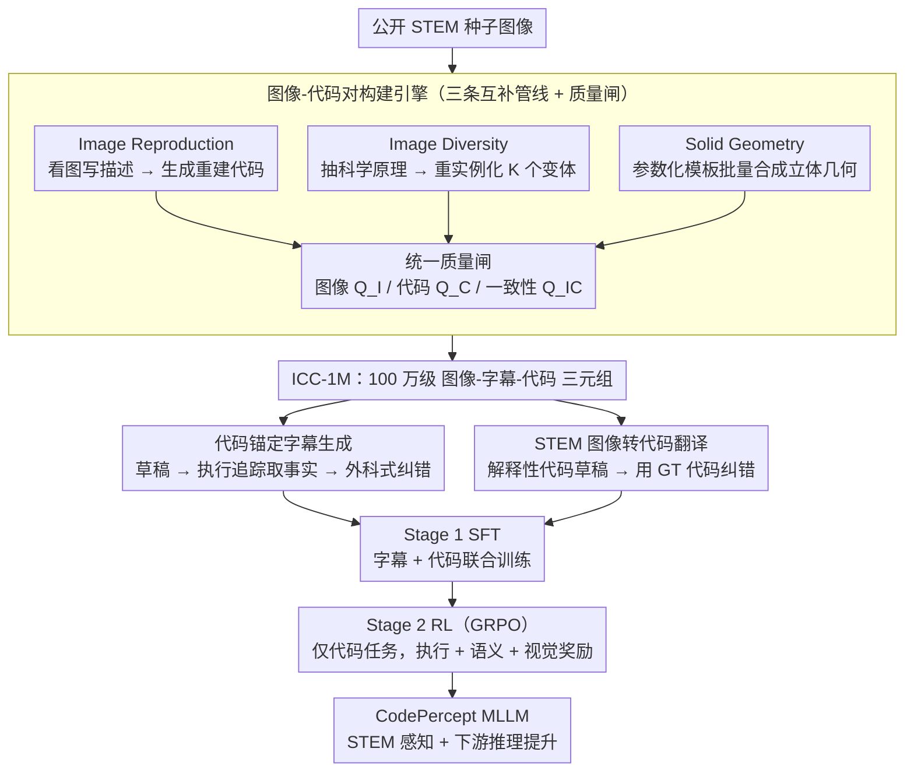

# CodePercept: Code-Grounded Visual STEM Perception for MLLMs

**会议**: CVPR 2026  
**arXiv**: [2603.10757](https://arxiv.org/abs/2603.10757)  
**代码**: [TongkunGuan/Qwen-CodePercept](https://github.com/TongkunGuan/Qwen-CodePercept)  
**领域**: 多模态VLM / STEM感知  
**关键词**: STEM视觉感知, 可执行代码, 图像重建, 代码锚定字幕, 多模态大模型, 感知增强

## 一句话总结

通过系统性缩放分析发现感知（perception）而非推理（reasoning）是 MLLM 在 STEM 领域的真正瓶颈，提出以可执行 Python 代码为锚定媒介的 CodePercept 范式——构建 100 万级 ICC-1M 数据集和 STEM2Code-Eval 基准，在 SFT+RL 两阶段训练后显著提升 MLLM 的 STEM 视觉感知和下游推理能力。

## 研究背景与动机

**领域现状**：当前大量工作聚焦于用强化学习增强 MLLM 的推理能力（冷启动数据、RL 奖励设计、单模态推理数据迁移），但始终未回答一个根本问题：模型 STEM 任务失败到底是感知不足还是推理不足？

**现有痛点**：作者将 STEM 视觉推理解耦为感知（image→caption）和推理（caption→answer）两个独立阶段，固定一端独立缩放另一端，在 MathVision 数据集上发现：扩展感知始终优于扩展推理（如 Perception@32B+Reasoning@4B 大幅优于 Perception@4B+Reasoning@32B）。这证明感知才是 STEM 视觉推理的真正杠杆，但几乎无人系统性地解决感知问题。

**核心矛盾**：直觉方案——用 GPT/Gemini 生成描述性字幕进行知识蒸馏——有两大致命缺陷：(1) 教师模型在空间关系、数量细节上易产生幻觉；(2) 复杂 STEM 图像存在"描述失语"（descriptive aphasia），自然语言无法精确刻画辅助线构造、多面体空间关系等结构信息。

**本文目标** (1) 如何系统性增强 MLLM 的 STEM 视觉感知能力？(2) 如何直接评估感知能力而非用问题解答准确度作为代理指标？

**切入角度**：可执行代码天然具有精确语义、可验证性和结构化表达——只有完整理解图像才能生成正确的重建代码。代码是比自然语言更精确的"结构化字幕"。

**核心 idea**：用可执行 Python 代码作为 STEM 图像的精确感知媒介，同时作为训练信号（代码锚定字幕 + 图像转代码）和评估标准（代码重建图像的保真度）。

## 方法详解

### 整体框架

CodePercept 想解决的是一个被整个领域忽略的问题：MLLM 在 STEM 上做不好，瓶颈不在推理而在感知——它根本没"看清"图里的辅助线、立体结构和精确坐标。作者的核心赌注是用**可执行 Python 代码**当感知的锚点：只有真正读懂一张图，才写得出能把它重画出来的代码。整条 pipeline 因此分三步转——先用一个图像-代码对构建引擎把现有 STEM 图像批量配上 ground-truth 重建代码（ICC-1M 数据集），再把这些配对喂成两种训练任务（看图写字幕、看图写代码），最后用 SFT 打底、GRPO 强化学习收尾，全部基于 Qwen3-VL 系列。

### 关键设计

**1. 图像-代码对构建引擎：用三条互补管线攒出 100 万级 image-code 配对**

训练这套范式的前提是有大量"图像配着它的精确重建代码"的数据，但现成 STEM 数据几乎没有代码标注，直接让 LLM 看图写代码又质量堪忧。作者用三条并行管线各补一块短板。第一条 Image Reproduction 最直白：对种子图像先生成详细文字描述，再基于"图像+描述"让模型写出 matplotlib 重建代码——但它的多样性天然被源图库锁死。第二条 Image Diversity 解决这个多样性瓶颈，做法是先从种子图里抽出底层科学原理 $G_{\text{principle}}$，再围绕同一原理重新实例化出 K 份不同的视觉变体；比如一道多米诺谜题，抽出"组合计数"原理后可以重画成圆形轮盘、三角形堆叠、网格图等形态，是概念级而非像素级的扩增。第三条 Solid Geometry 专补 LLM 的硬伤——立体几何代码——用参数化模板库（立方体展开/折叠、正投影三视图、截面分析、多面体构造共 8 类）做参数采样批量生成。三条管线产出的数据统一过三道质量闸：图像质量 $Q_I$、代码质量 $Q_C$、图像-代码一致性 $Q_{IC}$。

**2. 代码锚定字幕生成：用 ground-truth 代码把字幕里的幻觉擦掉**

知识蒸馏的老路是拿强模型生成描述性字幕，但教师模型在数量和空间关系上极易胡说。这里的巧思是让代码当事实裁判，分三步走。第一步 Native Caption 让 MLLM 直接看图写一版草稿 $t_{\text{draft}}$，语言自然但可能写错事实。第二步 Code Analysis 不去硬读代码——复杂代码带深层递归和嵌套循环，LLM 直接解析太难——而是挂一个执行追踪器 $\xi(\mathbf{c})$，把渲染时的精确坐标、维度、z-order 图层等确定性细节全记下来，据此提取经验证的视觉事实 $t_{\text{code}}$。第三步 Code-Grounded Refinement 以这些事实为准绳，外科手术式地改掉草稿里的数量错误和空间关系错误，同时保留原本自然流畅的语言风格，整条链路写成

$$t_{\text{new}} = G_{\text{refine}}\big(G_{\text{caption}}(\mathbf{x}),\, G_{\text{analyze}}(\mathbf{c}, \xi(\mathbf{c}))\big)$$

执行追踪器是这一步的关键——它把"读懂复杂代码"这个难题转成"读懂执行日志"这个简单任务。

**3. STEM 图像转代码翻译：让模型直接看图写代码，补一路自然语言给不出的结构化信号**

字幕再准也受限于自然语言对辅助线构造、多面体空间关系这类结构的"描述失语"。所以第二种任务干脆训模型从图像直接生成可执行重建代码：先让 MLLM 写一版带逐步分解和参数解释的代码草稿 $c_{\text{draft}}$（解释性强但事实可能错），再用 ground-truth 代码把错误纠正、同时保住那层解释性结构，得到

$$c_{\text{new}} = G_{\text{refine}}\big(G_{\text{code}}(\mathbf{x}),\, \mathbf{c}\big)$$

代码用编程构造直接表达几何关系和数学约束，和自然语言字幕互补——这也是后面实验里"字幕+代码联合训练优于单用任一"的根源。

### 损失函数 / 训练策略

- **Stage 1 (SFT)**：基于 Qwen3-VL，在 ICC-1M 上联合训练图像字幕和图像转代码两个任务，1 epoch，32 A100
- **Stage 2 (RL)**：仅对代码生成任务做 GRPO 强化学习，选 1 万样本。奖励函数包含格式奖励 $r_{\text{fmt}}$（代码块格式是否正确）和内容奖励 $r_{\text{cnt}}$（执行成功率 + GPT-4o 评估的代码语义等价性 + 图像视觉相似度）

## 实验关键数据

### 主实验（STEM2Code-Eval 图像重建）

| 模型 | Image Score | Code Score | Avg | Exec Rate |
|------|-----------|-----------|------|-----------|
| Gemini2.5-Pro-Thinking | 68.89 | 75.41 | 72.15 | 91.7% |
| GPT5-Thinking | 64.97 | 64.98 | 64.98 | 96.6% |
| Qwen3-VL-4B-Instruct | 24.55 | 26.42 | 25.49 | 79.4% |
| CodePercept-4B-S1 | 38.13 | 43.43 | 40.78 | 80.7% |
| **CodePercept-4B-R1** | **47.17** | **45.86** | **46.52** | **91.3%** |
| Qwen3-VL-32B-Instruct | 36.85 | 39.98 | 38.42 | 81.8% |
| **CodePercept-32B-R1** | **68.97** | **62.53** | **65.75** | **95.9%** |

### 感知能力评估（Captioner-Solver Setup，LLM Solver: Qwen3-30A3-Thinking）

| 模型（Captioner） | MathVision | MathVista | MathVerse | DynaMath | WeMath | LogicVista | Avg |
|------|------|------|------|------|------|------|------|
| Qwen3-VL-4B-Instruct | 54.21 | 67.30 | 64.59 | 69.40 | 46.10 | 54.14 | 59.29 |
| CodePercept-4B-S1 | **57.63** | **69.60** | **65.59** | **71.38** | **47.81** | **60.40** | **62.07** |
| Qwen3-VL-32B-Instruct | 58.55 | 72.20 | 71.09 | 75.78 | 48.00 | 62.19 | 64.63 |
| CodePercept-32B-S1 | **62.27** | **72.90** | **71.70** | **77.41** | **54.19** | **65.33** | **67.30** |

### 消融实验

| 数据配置 | MathVision 提升 | Avg 提升 |
|---------|---------------|---------|
| 仅 Image Reproduce | 基线 | 基线 |
| + Image Diversity | +显著 | +显著 |
| + Solid Geometry | +进一步提升 | +进一步提升 |
| + CodeCap (代码锚定字幕) | +额外提升 | 字幕与代码互补 |
| + ImCode (图像转代码) | 最高 | 最高 |

### 关键发现

- CodePercept-4B-R1 在 STEM2Code-Eval 上 Image Score 从 24.55→47.17（+92%），Exec Rate 从 79.4%→91.3%，证明 RL 阶段有效提升代码质量
- CodePercept-32B-R1 的 Avg Score 65.75 接近 GPT5-Thinking 的 64.98，仅用开源模型就逼近最强闭源
- 感知提升直接传导到下游推理：CodePercept-32B-S1 作为 captioner 时，下游推理平均提升 2.7 个点
- 代码和字幕是互补的：只用字幕或只用代码训练效果都不如联合训练

## 亮点与洞察

- 缩放分析揭示"感知是瓶颈"——大家都在卷推理（RL、思维链、奖励设计），但真正制约 STEM 性能的是感知。这个发现可能重新引导整个领域的研究方向
- 代码作为感知媒介的范式转换——代码是"可验证、可执行的结构化字幕"，自然语言描述不了的空间关系、精确数值在代码中都有确定性表达。执行追踪器进一步解决了"LLM 看不懂复杂代码"的问题
- Image Diversity Pipeline 的"原理抽象→重新实例化"策略是高效的数据扩增思路——不是简单增强，而是保持科学严谨性的概念级多样化，可迁移到其他科学领域数据构建

## 局限与展望

- STEM2Code-Eval 基准仅 1000 个样本，覆盖的 STEM 子领域和难度分布可能不够全面
- 代码重建依赖 matplotlib，对非 2D 可视化内容（如真实实验照片、显微图像）不适用
- RL 阶段的奖励函数依赖 GPT-4o 评分，引入了外部模型偏差
- 立体几何模板库是手工设计的，覆盖范围受限于模板种类

## 相关工作与启发

- **vs 传统 STEM 推理增强**（KeyeVL、InternS1）：这些方法聚焦推理侧（RL、思维链），本文证明感知侧才是杠杆——同等算力投入感知增强收益更大
- **vs 知识蒸馏方法**：用强模型生成字幕的传统路线受限于教师模型幻觉；CodePercept 用代码执行结果作为 ground truth 消除幻觉，是更可靠的知识传递方式
- **vs 领域特定代码生成**（UI-to-code、Chart-to-code）：这些工作面向下游应用；CodePercept 的 image-code 配对兼具评测和训练双重价值

## 评分

- 新颖性: ⭐⭐⭐⭐⭐ 缩放分析揭示感知瓶颈 + 代码作为感知媒介是范式级创新
- 实验充分度: ⭐⭐⭐⭐ 6 个 STEM 基准 + STEM2Code-Eval + 消融，但 RL 消融不够细致
- 写作质量: ⭐⭐⭐⭐ 逻辑清晰，缩放分析图很有说服力
- 价值: ⭐⭐⭐⭐⭐ 可能重新引导 STEM 多模态研究从推理侧转向感知侧

<!-- RELATED:START -->

## 相关论文

- [\[CVPR 2026\] AV-Reasoner: Improving and Benchmarking Clue-Grounded Audio-Visual Counting for MLLMs](av-reasoner_improving_and_benchmarking_clue-grounded_audio-visual_counting_for_m.md)
- [\[CVPR 2026\] Linking Perception, Confidence and Accuracy in MLLMs](linking_perception_confidence_and_accuracy_in_mllms.md)
- [\[CVPR 2026\] Widget2Code: From Visual Widgets to UI Code via Multimodal LLMs](widget2code_from_visual_widgets_to_ui_code_via_multimodal_llms.md)
- [\[CVPR 2026\] Parameter-Efficient Adaptation for MLLMs via Implicit Modality Decomposition](parameter-efficient_adaptation_for_mllms_via_implicit_modality_decomposition.md)
- [\[CVPR 2026\] HumanVBench: Probing Human-Centric Video Understanding in MLLMs with Automatically Synthesized Benchmarks](humanvbench_probing_human_centric_video_understanding_in_mllms_with_automatica.md)

<!-- RELATED:END -->
