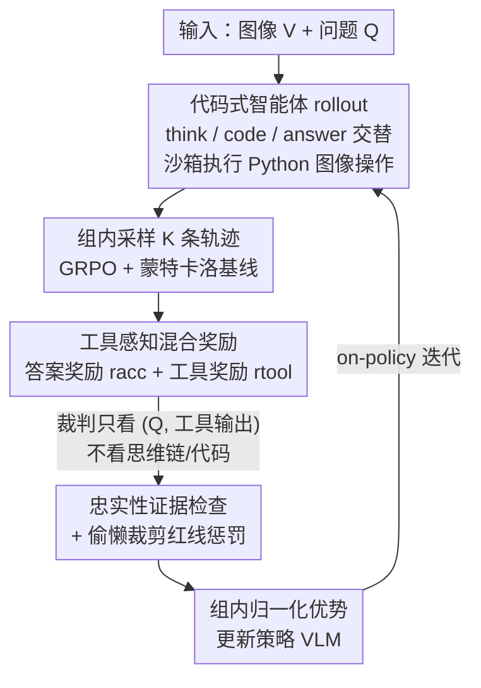

# CodeV: Code with Images for Faithful Visual Reasoning via Tool-Aware Policy Optimization

**会议**: CVPR 2026  
**论文**: [CVF Open Access](https://openaccess.thecvf.com/content/CVPR2026/html/Hou_CodeV_Code_with_Images_for_Faithful_Visual_Reasoning_via_Tool-Aware_CVPR_2026_paper.html)  
**代码**: https://github.com/RenlyH/CodeV  
**领域**: 多模态VLM / Agent / 强化学习  
**关键词**: 视觉智能体, 忠实推理, 工具调用奖励, 过程级RL, GRPO  

## 一句话总结
这篇论文发现"会用图思考"的视觉智能体常常**答对但工具用得不忠实**（裁错区域却蒙对答案），提出 CodeV——把视觉工具表示成可执行 Python 代码、并用 Tool-Aware Policy Optimization (TAPO) 在 GRPO 上加一个**只看工具输出、不看思维链**的过程级稠密奖励，结果在 10 个基准上保持甚至超越准确率的同时，把忠实工具调用率提升到基线的 1.3–2 倍。

## 研究背景与动机
**领域现状**：当前先进的视觉智能体（DeepEyes、Pixel-Reasoner、o3 等）流行"think with images"范式——在推理过程中穿插裁剪（crop）、旋转、分割等图像操作，把答案 ground 到工具返回的视觉证据上，在视觉搜索、图表推理等组合任务上明显优于一次性预测。训练上多采用两阶段课程：先 SFT 冷启动学会调工具，再用 RLVR（带最终答案正确性 + 工具调用 bonus 的奖励）强化。

**现有痛点**：作者做了一个忠实性诊断实验——把模型裁出的中间 crop 连同原问题喂给 GPT-4o 当裁判，判断这个 crop 到底有没有框住问题问的目标。结果触目惊心：在 V\* 基准上、**即使最终答案答对了**，DeepEyes 只有 57%、Pixel-Reasoner 只有 43% 的工具调用是忠实的。换句话说模型常常裁错地方、或干脆无视工具输出，却靠选项/文本线索蒙对答案——高准确率掩盖了不忠实推理，benchmark 严重高估了真实的视觉工具能力。

**核心矛盾**：根源是奖励设计的两个缺陷。其一是 **outcome dominance（结果主导）**：奖励只盯最终答案对不对、或工具有没有被调用，对"工具怎么用的"零监督，缺乏 step-level credit assignment，策略很快学会幻觉式调工具或做无意义操作来钻空子（reward hacking）。其二是 **reward sparsity（奖励稀疏）**：难题早期 rollout 经常全 0 奖励，优化不稳定；而粗暴的 invocation bonus 又会反过来鼓励"裁个超大没用的框"这种偷懒行为。

**本文目标**：在不训练一个易被 hack 的独立奖励模型、也不去监督不可验证的思维链 token 的前提下，**激励 VLM 产出真正 ground 在工具输出上的忠实推理**，同时不牺牲（最好还提升）最终准确率。

**核心 idea**：把工具使用看成"一串可验证的决策"——用一个**只检查工具输入/输出（而非思维链）的过程级稠密奖励**改造 GRPO，让监督既容易验证又难被 hack；并用代码（Python）作为统一工具接口，让模型自然调用丰富的图像操作库。

## 方法详解

### 整体框架
CodeV 把"代理式视觉推理"实例化为一个**生成代码来看图**的智能体，训练分两阶段：**Stage 1 SFT 冷启动** + **Stage 2 TAPO 强化学习**。

智能体的一次 rollout 是一条轨迹 $\tau = (\mathbf{x}, a_1, o_1, \dots, a_T)$，输入 $\mathbf{x}=(V,Q)$ 是图像和问题，每一步动作 $a_t \sim \pi_\theta(\cdot \mid \mathbf{x}, h_{t-1})$ 基于完整历史 $h_{t-1}=\{(a_i,o_i)\}_{i=1}^{t-1}$，属于三类之一：`<think>`（自由文本思考）、`<code>`（一段在受限沙箱里执行、对图像 $V$ 只读的 Python 程序）、`<answer>`（终止轨迹的最终答案）。只有 `<code>` 块执行后才会产生观测 $o_t$（日志 + 可选的派生图像），追加回上下文；`<think>`/`<answer>` 的 $o_t=\varnothing$。整个工具调用都被吸纳进 token 级策略，**不需要外部 controller**。

Stage 1 用 Thyme-SFT 这类含多步代码推理的轨迹冷启动，教会模型"会裁、会多轮 refine"，得到的模型同时充当初始化和参考策略 $\pi_{\text{ref}}$。Stage 2 在此基础上做 GRPO 式 on-policy rollout，奖励由一个**混合奖励系统**给出（准确性 + 忠实性），组内归一化后估计相对优势来更新策略。

### 关键设计

**1. 代码式工具接口：用 Python 沙箱统一表达所有图像操作**

针对"依赖外部重型工具 API、工具种类受限"的痛点，CodeV 不为每种操作设计专用 token，而是把视觉工具统一表示成一段 `<code>` 里的可执行 Python 程序。完整的 `<code>` 块在一个受限沙箱中执行，对原图 $V$ 只读，可调用一小套确定性的图像/数学工具（crop、rotate 等），返回日志和派生图像作为观测 $o_t$。这样做的好处是：模型在预训练阶段已经大规模见过代码模式，调用工具既自然又富有表达力；而且 crop 后的坐标、统计量等都是**确定性、可验证的中间产物**，为后面的过程奖励提供了干净的检查对象（相比直接判模型的思考文本要可靠得多）。

**2. TAPO 的混合奖励：把工具忠实性写进 GRPO 的稠密信号**

针对 outcome-only 奖励无法监督"工具怎么用"的核心矛盾，TAPO 在 GRPO 框架上加了一个**对工具步骤的稠密过程奖励**。轨迹总奖励是答案奖励与工具奖励的加权和：

$$R(\tau) = \lambda_{\text{acc}}\, r^{\text{acc}}(\tau) + \lambda_{\text{tool}}\, r^{\text{tool}}(\tau)$$

其中 $r^{\text{acc}}$ 用精确/程序匹配（数值、类别 VQA）或 LLM-as-a-judge（开放式问题）衡量答案质量；$r^{\text{tool}}$ 把所有 `<code>` 动作步骤的工具分求平均：$r^{\text{tool}}(\tau)=\frac{1}{|\mathcal{T}_{\text{tool}}|}\sum_{t\in\mathcal{T}_{\text{tool}}} r^{\text{tool}}_t$。优化目标是带 PPO 式 clipping 的 GRPO objective：

$$\mathbb{E}_{\tau,t}\Big[\min\big(r_t(\theta)A_t,\ \text{clip}(r_t(\theta),1-\epsilon,1+\epsilon)A_t\big)\Big] - \beta\,\mathbb{D}_{\text{KL}}(\pi_\theta \| \pi_{\text{ref}})$$

其中重要性比 $r_t(\theta)=\pi_\theta(a_t\mid s_t)/\pi_{\text{ref}}(a_t\mid s_t)$，优势 $A_t = R(\tau) - b(g(\tau))$ 用组内蒙特卡洛基线 $b(g)=\frac{1}{K}\sum_{k=1}^K R(\tau_k^{(g)})$，并广播到该轨迹的每个 time step。高温采样下组内轨迹在关键步骤分叉，更好的轨迹拿更高 $R(\tau)$，优势就会**有选择地提升那些决定性工具步骤的概率**——这就是稠密信号实现 step-level credit assignment 的机制。关键约束是始终保持 $|\lambda_{\text{tool}}| < |\lambda_{\text{acc}}|$，让答案正确性仍是主导信号、工具奖励只做修正。

**3. 工具奖励即"证据检查"：裁判只看工具输出，不看思维链**

这是 TAPO 抗 reward hacking 的核心招。早期实验发现直接让裁判去判模型的代码和思考既脆弱又昂贵，于是 TAPO **只检查非模型生成的上下文** $(Q, o_t, \text{metadata})$——原问题、沙箱输出（裁出的图或其描述、坐标、简单统计），裁判模型（Qwen2.5-VL-32B）只回答一个问题："当前这个工具结果对回答 $Q$ 有没有提供有用证据？"评分细则是：① 鼓励任何明显包含相关目标/区域的 crop；② 不要求 crop 框住所有相关目标——对多目标问题，只要隔离出至少一个正确区域就给奖励而非惩罚。因为裁判**从不看思维链或代码**，它无从被模型的花言巧语欺骗，只对"这块证据有没有用"作答，比诊断内部推理可验证得多；相比基于 GT bounding box 的 IoU 奖励，这种 judge-based 形式不需要密集标注、也能泛化到没有框标注的任务。

**4. 红线机制与偷懒裁剪抑制：双重防止 reward hacking**

针对"用 invocation bonus 会诱导裁个超大无用框"的隐患，CodeV 用两个机制压制偷懒：其一是 **SFT shaping**——冷启动阶段的轨迹本就教了局部化、高分辨率的 crop 和多轮 refine，大而空洞的框在训练数据里很罕见，RL 只是在这个先验上微调而非从零发现裁剪行为；其二是**裁判细则**——裁判被要求聚焦"裁出图的主体内容是否清晰包含回答 $Q$ 所需的目标"，过大或杂乱、目标几乎不可见的 crop 通常过不了检查、拿低 $r^{\text{tool}}_t$，而把图像读写当草稿纸这类明显误用直接给负奖励。此外对于**本就不需要视觉搜索的任务**（如某些计数/captioning），TAPO 故意把 $r^{\text{tool}}_t$ 默认压到接近 0、只对无效坐标/重复空操作/可避免的沙箱报错等红线给负奖励——避免稠密工具奖励反过来逼模型做不必要的工具调用。

### 损失函数 / 训练策略
两阶段课程：Stage 1 SFT 在 Thyme-SFT 上 finetune 3 个 epoch；Stage 2 用清洗后的 RL 数据集（基于 Thinklite-70K、DeepEyes-47K，先剔除需外部知识的 OK-VQA、再用 Qwen2.5-VL-32B + 人工清噪，并丢弃 Qwen2.5-VL-7B 八次采样准确率 > 0.9 的样本以保证组内有相对优势）。RL 超参：rollout/训练 batch size 均为 256，每样本 8 条 rollout，200 步更新，采样温度 1.0，学习率 $1\times10^{-6}$。基座是 Qwen2.5-VL-7B，8×H200，SFT/RL 分别 255 / 288 GPU 小时。

## 实验关键数据

### 主实验
基于 Qwen2.5-VL-7B，与开源基线（Qwen2.5-VL-7B、Pixel-Reasoner-7B、Thyme-VL-7B-RL）和闭源 GPT-4o 在感知/视觉搜索/数学推理 benchmark 上对比（除 GPT-4o 外均为 7B + 工具使用配置）：

| 基准 | 任务类型 | CodeV-7B | GPT-4o | Qwen2.5-VL-7B | Pixel-Reasoner-7B |
|------|---------|----------|--------|---------------|-------------------|
| VLMBlind | 原始感知 | **46.6** | 45.1 | 43.9 | 42.6 |
| V\* | 视觉搜索 | **84.8** | 64.4 | 75.0 | 79.6 |
| HRBench-4K-all | 高分辨搜索 | 76.1 | 63.1 | 68.6 | 70.1 |
| MathVista | 数学推理 | **71.8** | 61.3 | 67.9 | 71.2 |
| MathVerse-Mini | 数学推理 | **49.2** | 63.7 | 45.5 | 46.9 |
| MathVision-Mini | 数学推理 | 33.6 | 50.2 | 21.4 | 26.3 |

CodeV 在 V\* 上达 84.8，远超 GPT-4o 的 64.4、Qwen2.5-VL-7B 的 75.0；在感知和大多数数学任务上取得开源最优或追平/超越 GPT-4o，整体显著缩小开源与闭源的差距。

### 忠实性评估
在 V\* 和 HRBench-4K 上比较忠实工具调用率（条件于答案正确）：

| 模型 | 忠实工具调用率（相对） | 备注 |
|------|----------------------|------|
| CodeV | 最高（约为基线的 1.3–2×） | 准确率不降反升 |
| DeepEyes | V\* 上约 57% | 答对但常裁错区域 |
| Pixel-Reasoner | V\* 上约 43% | 同上 |
| Thyme | 个位数 | <10% rollout 真调工具，多靠纯文本"假装裁过" |

CodeV 在多数设置上比 Pixel-Reasoner/DeepEyes 高出两位数、极端情况下高出 30+ 点，证明 TAPO 确实让模型把决策 ground 在工具返回的证据上。

### 消融实验
**训练阶段消融**（全 benchmark 平均分）：

| 配置 | Reasoning | Perception | 说明 |
|------|-----------|------------|------|
| Qwen2.5-VL-7B | 49.7 | 62.8 | 基座 |
| Zero-RL（无 SFT 冷启动） | 52.9 | 67.0 | 提升后快速塌缩到纯文本推理、几乎不用工具 |
| Cold-start SFT | 47.7 | 61.7 | 略低但 rollout 工具使用更丰富 |
| **CodeV (SFT+TAPO)** | **54.2** | **69.7** | 比 Zero-RL 高 1–3 点、比 SFT 高 6–8 点 |

**奖励设计消融**（从冷启动 SFT 出发）：

| 奖励设计 | Reasoning | Perception | 说明 |
|---------|-----------|------------|------|
| Accuracy only | 51.2 | 67.5 | 小幅提升但最终倒向纯文本推理 |
| + Consistency | 50.4 | 67.6 | 几乎无变化 |
| + GPT-5-nano Judge | 52.4 | 68.7 | 推理 +2、感知 +1 |
| **CodeV (完整 TAPO)** | **54.2** | **69.7** | 再 +2 点，全面最优 |

### 关键发现
- **冷启动 SFT 不可省**：Qwen2.5-VL 这类 instruct 模型无法把"会写代码"转化为"用代码解题"——直接 RL 时用代码的 rollout 平均正确率反而低于直接作答，模型会迅速收敛到纯文本推理、放弃视觉工具。必须先 SFT 把"Code with Image"的知识激活。
- **过程级奖励 > 纯结果奖励**：accuracy-only 奖励会把策略推向 text-only 推理（消融里掉点），加 consistency 奖励几乎无效；只有 TAPO 的 step-level 工具奖励能同时保住准确率和忠实性。
- **裁判模型可替换**：用 GPT-5-nano 当裁判已有正收益，完整 TAPO（Qwen2.5-VL-32B 裁判）再 +2 点，说明方法对裁判选择有一定鲁棒性。

## 亮点与洞察
- **"只看工具输出、不看思维链"的奖励范式很巧**：它绕开了监督不可验证 CoT 的死结——裁判看不到模型的代码和思考，就无从被花言巧语 hack，只对客观的中间证据（crop 内容）打分。这个思路可迁移到 web agent（判检索结果是否相关）、代码 agent（判执行输出是否有用）等任何"工具输出可客观验证"的场景。
- **忠实性诊断协议本身是独立贡献**：把"答对率"和"工具用得对不对"解耦，揭示了 benchmark 高估视觉工具能力的系统性问题——这是一个可复用的评测视角。
- **代码即工具接口**：用 Python 沙箱统一所有图像操作，既复用预训练的代码能力，又让中间产物天然可验证，一举两得。

## 局限与展望
- **依赖一个强裁判模型**：$r^{\text{tool}}$ 的质量取决于 Qwen2.5-VL-32B 裁判的判断，裁判本身的偏差/成本是隐性依赖；论文虽做了 GPT-5-nano 鲁棒性消融，但裁判失误对训练的累积影响未深入分析。⚠️ 裁判 prompt 细节在附录，正文未完整给出。
- **忠实性定义偏视觉搜索**："忠实 = crop 框住目标"这一操作化定义在视觉搜索类任务上自然，但对不以裁剪为核心的任务（如全局推理、计数）忠实性如何定义并不清晰，论文对这类任务直接把工具奖励压到接近 0 回避了问题。
- **规模与基座单一**：只在 7B 的 Qwen2.5-VL 上验证，更大模型上 reward hacking 是否会卷土重来、TAPO 是否仍稳定，尚待验证（论文自己也提到 RL 训练越强、不忠实倾向越明显）。
- **改进思路**：可探索用多个异质裁判投票降低单裁判偏差，或把"证据检查"做成可学习但带可验证锚点的奖励，进一步抗 hacking。

## 相关工作与启发
- **vs DeepEyes / Pixel-Reasoner**：它们也做基于裁剪的代理式视觉推理，但奖励是 outcome-dominant（最终答案 + 工具 bonus），导致高准确率下忠实率仅 43–57%。CodeV 的区别是把忠实性写进稠密过程奖励，在准确率不降的前提下把忠实率提到 1.3–2 倍。
- **vs Thyme**：Thyme 用 consistency 奖励，但实测 <10% rollout 真正调工具、常"假装裁过"，忠实率个位数。CodeV 的工具奖励直接检查真实沙箱输出，强制模型真的执行裁剪并 ground 证据。
- **vs 标准 GRPO/RLVR**：标准做法只在最终答案给奖励、对中间工具步无信号；TAPO 用组内蒙特卡洛基线 + 工具步稠密奖励，实现 step-level credit assignment，同时靠 $|\lambda_{\text{tool}}|<|\lambda_{\text{acc}}|$ 保证答案正确仍是主信号、不破坏 GRPO 的稳定性。
- **vs 训练独立奖励模型**：TAPO 用规则检查 + judge 判证据，避免训练一个易被 hack 的独立 reward model 去监督 CoT，工程上也复用了开放式任务本就需要的 judge 基础设施。

## 评分
- 新颖性: ⭐⭐⭐⭐⭐ "只看工具输出不看思维链"的过程级奖励 + 忠实性诊断协议，切中代理式 RL 的 reward hacking 痛点
- 实验充分度: ⭐⭐⭐⭐ 10 个 benchmark + 忠实性 + 双消融，但只在单一 7B 基座验证，规模化结论待补
- 写作质量: ⭐⭐⭐⭐ 问题动机清晰、机制讲得透，部分公式/裁判细节散落附录
- 价值: ⭐⭐⭐⭐⭐ 揭示并量化了"答对但不忠实"这一被忽视的系统性问题，方法范式可迁移到广义工具智能体

<!-- RELATED:START -->

## 相关论文

- [\[CVPR 2026\] HiconAgent: History Context-aware Policy Optimization for GUI Agents](hiconagent_history_context-aware_policy_optimization_for_gui_agents.md)
- [\[CVPR 2026\] Visual Reasoning through Tool-supervised Reinforcement Learning](visual_reasoning_through_tool-supervised_reinforcement_learning.md)
- [\[CVPR 2026\] ARM-Thinker: Reinforcing Multimodal Generative Reward Models with Agentic Tool Use and Visual Reasoning](arm-thinker_reinforcing_multimodal_generative_reward_models_with_agentic_tool_us.md)
- [\[CVPR 2026\] VOLD: Reasoning Transfer from LLMs to Vision-Language Models via On-Policy Distillation](vold_reasoning_transfer_from_llms_to_vision-language_models_via_on-policy_distil.md)
- [\[CVPR 2026\] SpaceTools: Tool-Augmented Spatial Reasoning via Double Interactive RL](spacetools_tool-augmented_spatial_reasoning_via_double_interactive_rl.md)

<!-- RELATED:END -->
