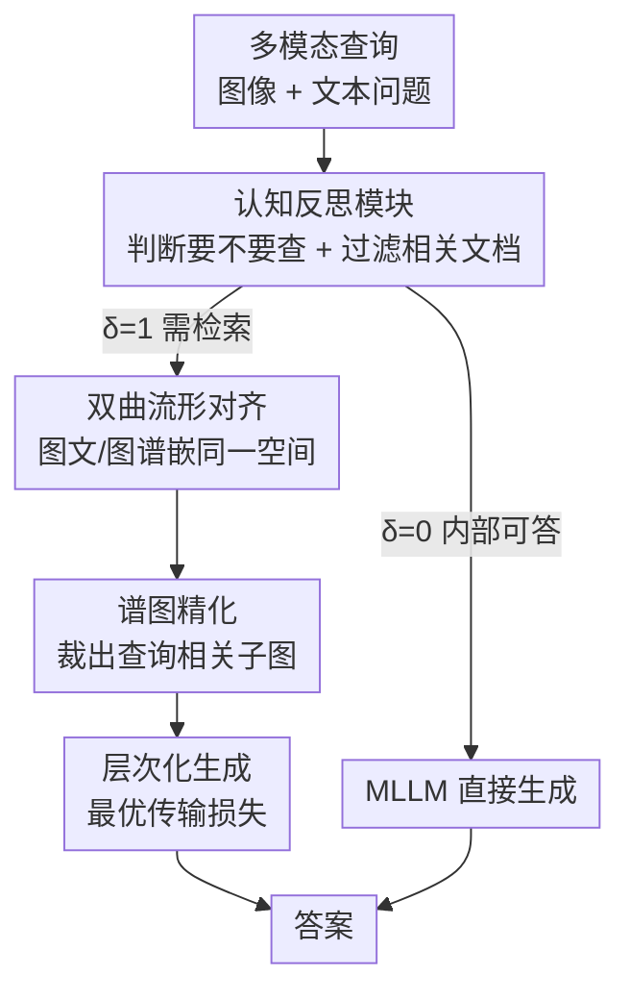

# CogniVerse: Revolutionizing Multi-Modal Retrieval-Augmented Generation with Cognitive Reflection and Geometric Reasoning

**会议**: CVPR 2026  
**arXiv**: [2605.29602](https://arxiv.org/abs/2605.29602)  
**代码**: 无（论文未提供）  
**领域**: 多模态VLM / 检索增强生成（MMRAG） / 图学习  
**关键词**: 多模态RAG, 自适应检索, 双曲嵌入, 谱图精化, 最优传输

## 一句话总结
CogniVerse 把"人脑式反思—检索—综合"三步搬进多模态 RAG：先用一个认知反思模块判断"这题要不要查外部知识、查回来的内容相不相关"，再把图文与知识图谱对齐到双曲空间并用谱图理论裁出查询相关子图，最后用最优传输损失生成兼顾局部准确与全局连贯的答案，在三个 MMQA 数据集上准确率、连贯度、检索精度全面超过 MuRAG/MMCoQA/GraphRAG，同时还降低了检索延迟。

## 研究背景与动机
**领域现状**：多模态检索增强生成（MMRAG）是当下知识密集型多模态问答（MMQA）的主流范式——先从外部知识库（图像、文本、知识图谱）检索相关内容，再让多模态大模型（MLLM）结合检索结果生成答案，弥补模型参数化记忆的不足。

**现有痛点**：作者点出四个具体毛病：(1) **检索噪声**——基于 embedding 相似度的检索常因语义错配抓回"关键词重叠但实质无关"的文档；(2) **跨模态错位**——视觉、文本、图结构嵌入在欧氏空间里对不齐，导致生成不连贯；(3) **缺乏自适应推理**——静态检索策略不看问题难度，简单题也强行检索（浪费且引入噪声），多跳难题又检索不足；(4) **生成不连贯**——生成阶段难以同时兼顾 token 级局部准确和全局语义一致。

**核心矛盾**：现有方法把检索当成"无脑前置步骤"，且默认欧氏空间能装下复杂的跨模态非线性关系——这两个假设同时不成立，才造成"该查的没查准、不该查的乱查、查回来还对不齐"。

**本文目标**：让 MMRAG 像人一样会"先掂量自己会不会、再选择性查、最后连贯综合"，并给检索对齐和图精化提供数学保证。

**切入角度**：作者类比人类认知三步——内省（assess）、选择性获取（selective retrieve）、连贯综合（synthesize），并用三套数学工具分别支撑：信息几何（双曲空间对齐）、谱图理论（子图裁剪）、最优传输（生成连贯性）。

**核心 idea**：用"认知反思决定要不要检索 + 双曲流形对齐多模态 + 谱图裁剪相关子图 + 最优传输平衡局部全局"四件套，替换掉传统"静态检索 + 欧氏相似度 + 交叉熵生成"。

## 方法详解

### 整体框架
CogniVerse 是一个三阶段串行的 MMRAG 流水线。输入是一个多模态查询 $\mathcal{Q}=(\mathcal{I},\mathcal{T})$（图像 + 文本问题），输出是答案 $\mathcal{Y}$。第一阶段**认知反思模块（CRM）**先判断这题要不要查外部知识（决策变量 $\delta\in\{0,1\}$）：能内部答的直接交给 MLLM 生成，需要检索的才进入第二阶段。第二阶段**多模态检索模块**把图文知识对齐到双曲空间、对知识图谱做谱精化裁出查询相关子图。第三阶段**层次化生成模块**把查询、相关文档、精化三元组喂给 MLLM，用最优传输损失生成答案。三阶段各配一套数学工具，并给出收敛性定理（双曲对齐 Theorem 3.1、谱裁剪 Lemma 3.2、OT 生成 Theorem 3.3）。

### 关键设计

**1. 认知反思模块（CRM）：让模型先掂量"这题我会不会、查回来相不相关"**

针对"静态检索不看题、噪声文档拖垮生成"的痛点。CRM 分两步：先用一个预训练 MLLM $\mathcal{M}$ 对查询算最大似然置信度 $\sigma(\mathcal{Q})=\max_{\mathcal{Y}}p(\mathcal{Y}\mid\mathcal{Q})$，与可学习阈值 $\theta$ 比较得到二值决策——$\sigma(\mathcal{Q})>\theta$ 则 $\delta=0$（内部知识够用，跳过检索），否则 $\delta=1$ 触发外部检索。检索触发后再对每篇候选文档 $\mathcal{D}_i=(\mathcal{D}_i^v,\mathcal{D}_i^t)$ 过一个轻量分类头 $\phi$ 算相关度 $r_i=\mathrm{sigmoid}(\mathcal{M}(\mathcal{Q},\mathcal{D}_i;\phi))$，只保留 $r_i>0.5$ 的进入相关集 $\mathcal{D}_{\text{rel}}$。训练用对比损失 $\mathcal{L}_{\text{CRM}}$ 拉开正/负文档：$-\sum_{\mathcal{Q}}[\sum_{\mathcal{D}_i\in\mathcal{D}^+}\log r_i+\sum_{\mathcal{D}_j\in\mathcal{D}^-}\log(1-r_j)]$。这一步直接呼应人类"内省"——实验里 35% 的查询被判定无需检索，既省延迟又把噪声挡在门外

**2. 双曲流形对齐：用负曲率空间装下欧氏装不下的跨模态非线性关系**

针对"欧氏 embedding 跨模态对不齐"的痛点。作者把视觉/文本/查询嵌入函数 $\mathcal{E}^v,\mathcal{E}^t,\mathcal{E}^q$ 都映射到一个带度量张量 $g$ 的黎曼流形 $\mathcal{M}$ 上，优化目标是最小化查询与正样本知识之间的测地距离 $\mathcal{L}_{\text{geo}}=\mathbb{E}_{\mathcal{Q},\mathcal{D}^+}[d_{\mathcal{M}}(\mathcal{E}^q(\mathcal{Q}),\mathcal{E}^v(\mathcal{D}^v))+d_{\mathcal{M}}(\mathcal{E}^q(\mathcal{Q}),\mathcal{E}^t(\mathcal{D}^t))]$。为可计算，把 $\mathcal{M}$ 近似为常负曲率的双曲空间 $\mathbb{H}^n$（Lorentz 模型），距离写成 $d_{\mathbb{H}^n}(x,y)=\mathrm{arccosh}(-\langle x,y\rangle_{\mathbb{L}})$。双曲空间体积随半径指数增长、天然适合装层次结构与复杂语义关系，所以比欧氏 cosine 相似度更能保住跨模态语义。Theorem 3.1 还在 Lipschitz 连续 + 有界曲率假设下论证该损失收敛到唯一全局最小（⚠️ 这套"负曲率 ⇒ Hessian 正定 ⇒ 凸"的证明较粗略，以原文为准）

**3. 谱图精化：用拉普拉斯特征向量把大知识图谱裁成"查询相关子图"**

针对"静态图检索抓回大量无关三元组、拖累多跳推理"的痛点。给定知识图谱 $G=(V,E)$、拉普拉斯矩阵 $L=D-A$，先对每个顶点算查询相关度 $r_i=\mathrm{sigmoid}(\mathcal{M}(\mathcal{Q},v_i))$，再求一个既保高相关顶点、又让子图内部"平滑"（拉普拉斯二次型小）的子集：$\min_{S\subseteq V}\sum_{(i,j)\in E,\,i,j\in S}(r_i-r_j)^2$ s.t. $\sum_{i\in S}r_i\ge\eta$。它等价于带约束的瑞利商最小化 $\min_x \frac{x^TLx}{x^Tx}$，松弛为连续问题后用 $L$ 最小非零特征值对应的特征向量求解（取前 10 个）。Lemma 3.2 借 Cheeger 不等式给出割边规模上界 $O(\sqrt{\lambda_2})$。直观上：低频特征向量对应图最"光滑"的划分，沿它切就能把跟查询同社区的相关实体留住、把无关枝叶剪掉——实验里一个 10000 节点图被裁到 500 节点，检索精度涨 5.2%。裁出的三元组同样编码进双曲空间 $\mathbb{H}^n$ 保持一致

**4. 层次化生成 + 最优传输损失：同时管住 token 级准确和全局语义连贯**

针对"生成顾此失彼"的痛点。生成函数 $\mathcal{G}:(\mathcal{Q},\mathcal{D}_{\text{rel}},G')\to\mathcal{Y}$ 由 MLLM 实现，损失分两级：局部用标准交叉熵 $\mathcal{L}_{\text{local}}=-\sum_t\log p(y_t\mid y_{<t},\cdots)$ 抓 token 准确；全局用生成答案分布与参考答案分布在 embedding 空间的 2-Wasserstein 距离 $\mathcal{L}_{\text{global}}=W_2(p_{\mathcal{Y}},p_{\mathcal{Y}^*})$ 抓语义一致。总损失 $\mathcal{L}_{\text{gen}}=\alpha\mathcal{L}_{\text{local}}+(1-\alpha)\mathcal{L}_{\text{global}}$（$\alpha=0.7$）。Wasserstein 距离的好处是"即使 token 不完全对上、只要语义接近就给低 loss"，比纯交叉熵更宽容也更连贯。训练时还加 **Query Dropout**：以概率 $p(t)=0.5\exp(-t/T)$ 随机遮挡查询输入，逼模型学会在信息残缺时依赖检索知识

### 损失函数 / 训练策略
两阶段训练（Algorithm 1）：Phase 1 单独训 CRM（优化分类头 $\phi$ 与决策）；Phase 2 联合训检索与生成，按 $\delta$ 分流——$\delta=1$ 走完整检索+对齐+谱精化+生成并更新 $\mathcal{L}_{\text{total}}$，$\delta=0$ 直接生成。总损失为多任务加权 $\mathcal{L}_{\text{total}}=\beta\mathcal{L}_{\text{CRM}}+\gamma\mathcal{L}_{\text{geo}}+(1-\beta-\gamma)\mathcal{L}_{\text{gen}}$，$\beta,\gamma$ 交叉验证调。实现细节：MLLM 用微调的 LLaVA-13B，双曲嵌入维度 128、Riemannian SGD 优化，谱精化取 Wikidata 图前 10 个特征向量，训练 20 epoch、batch 32、AdamW（lr $10^{-4}$，weight decay $10^{-2}$），知识库含 1000 万文档 + 100 万图节点，8×A100、3 个随机种子取平均。

## 实验关键数据

### 主实验
三个 MMQA 数据集（Encyclopedic-VQA 22.1万 / MultiModalQA 2.97万 / WebQA 4.16万），指标含准确率、连贯度（RoBERTa 空间 cosine）、检索精度 RP、延迟。

| 数据集 | 指标 | CogniVerse | MMCoQA(次优) | GraphRAG | MuRAG |
|--------|------|------|------|------|------|
| Encyclopedic-VQA | Accuracy(%) | **84.3** | 78.5 | 76.8 | 74.2 |
| Encyclopedic-VQA | Coherence | **0.91** | 0.85 | 0.83 | 0.82 |
| Encyclopedic-VQA | RP(%) | **78.4** | 70.1 | 68.7 | 65.3 |
| Encyclopedic-VQA | Latency(s) | 0.42 | 0.45 | 0.50 | 0.48 |
| MultiModalQA | Accuracy(%) | **82.7** | 75.9 | 73.4 | 71.6 |
| WebQA | Accuracy(%) | **79.5** | 72.6 | 70.1 | 68.4 |

CogniVerse 在三个数据集准确率均超次优 MMCoQA 约 6–7 个点，连贯度 0.89–0.91，检索精度最高 78.4%，延迟反而更低（0.40–0.42s vs. 基线 0.43–0.50s）——因为 CRM 让 35% 查询跳过检索。

### 消融实验（MultiModalQA）

| 配置 | Accuracy(%) | Coherence | RP(%) | 说明 |
|------|---------|------|------|------|
| CogniVerse (Full) | **82.7** | **0.90** | **76.8** | 完整模型 |
| w/o 认知反思 CRM | 76.4 | 0.84 | 68.2 | 改静态检索，准确率 −6.3、RP −8.6 |
| w/o 双曲嵌入 | 78.9 | 0.86 | 71.5 | 准确率 −3.8 |
| w/ 欧氏嵌入 | 77.2 | 0.85 | 70.3 | 换欧氏，准确率 −5.5、连贯 −0.05 |
| w/o 谱图精化 | 77.8 | 0.85 | 69.7 | 准确率 −4.9 |
| w/ 静态图检索 | 76.5 | 0.84 | 68.9 | 如 GraphRAG，准确率 −6.2、RP −7.9 |
| w/o 最优传输损失 | 79.3 | 0.83 | 76.8 | 换交叉熵，连贯 −0.07、准确率 −3.4 |

### 关键发现
- **CRM 贡献最大**：去掉它准确率掉 6.3、检索精度掉 8.6，是所有模块里掉点最猛的——验证"该不该查 + 过滤噪声"是 MMRAG 的命门。
- **几何对齐确实有用**：欧氏替双曲掉 5.5 个点、连贯掉 0.05；谱精化换静态图检索掉 6.2 点、RP 掉 7.9，说明双曲对齐和子图裁剪都在实打实提检索质量。
- **最优传输管连贯**：换回交叉熵主要伤连贯度（−0.07），印证 Wasserstein 损失的设计初衷是全局语义一致而非 token 准确（注意 w/o OT 那行 RP 仍 76.8，因为它不影响检索）。
- **抗噪与泛化**：注入 20% 无关文档时 WebQA 仅从 82.7 降到 80.1，而 MMCoQA 从 75.9 暴跌到 68.3；跨数据集零样本（训 Enc-VQA 测 MultiModalQA）仍有 74.2% vs. MMCoQA 65.3%。

## 亮点与洞察
- **"要不要检索"被当成可学习决策**：CRM 用置信度阈值 $\sigma>\theta$ 做门控，让 35% 简单题直接跳过检索——这把"自适应 RAG"在多模态场景落地，省延迟又降噪，是可迁移到任意 RAG 系统的 trick。
- **双曲空间装多模态层次语义**：用负曲率 $\mathbb{H}^n$ 替欧氏，呼应"知识天然有层次/树状结构"的直觉，消融里 5.5 个点的差距说明嵌入空间几何选择不是玄学。
- **谱图理论用来"裁子图"**：把检索相关性写成拉普拉斯二次型 + 瑞利商最小化，用低频特征向量切相关社区——给"知识图谱检索"提供了一个有理论保证（Cheeger 界）的剪枝视角。
- **OT 损失分管局部/全局**：交叉熵抓 token、Wasserstein 抓分布，思路可迁到任何"既要字对又要意通"的生成任务。

## 局限与展望
- **理论证明偏粗**：三个定理/引理（双曲对齐凸性、谱裁剪割边界、OT 收敛）都建立在较强假设（Lipschitz、双曲负曲率⇒凸、MLLM 容量足够）上，证明较简略，工程上未必严格成立——⚠️ 严谨性以原文为准。
- **无代码、无开源**：论文未给代码链接，10M 文档 + 1M 图节点的知识库与 8×A100 训练成本复现门槛高。
- **CRM 阈值是单一标量置信度**：用 $\max$ 似然作为"会不会"的判据，对幻觉性高置信错误可能误判为"无需检索"，存在过度自信风险。
- **谱精化的可扩展性**：对超大图反复求拉普拉斯特征向量代价不低，论文用"前 10 个特征 + 松弛"缓解，但未充分讨论百万级实时检索下的特征分解开销。
- **改进方向**：CRM 可引入校准（calibration）让置信度更可信；谱精化可换近似/增量特征求解；OT 损失的 $W_2$ 计算可考虑 Sinkhorn 近似进一步降本。

## 相关工作与启发
- **vs MuRAG / MMCoQA**：它们用欧氏 embedding + 静态检索，CogniVerse 换成双曲对齐 + CRM 自适应门控，区别在"会不会先掂量 + 嵌入空间几何"，主实验全面领先且延迟更低。
- **vs GraphRAG**：GraphRAG 用静态知识图谱做多跳，CogniVerse 用谱图理论按查询动态裁子图，消融里"静态图检索"配置掉 6.2 个点正是这一差异的代价。
- **vs CLIP-ViT-L / BLIP-2**：两者是无检索基线，准确率明显落后（55–69%），印证知识密集型 MMQA 必须外接检索。
- **vs 传统交叉熵生成 RAG**：用 Wasserstein 全局损失替/补交叉熵，把"语义连贯"显式写进目标函数，是 RAG 生成端可借鉴的思路。

## 评分
- 新颖性: ⭐⭐⭐⭐ 把信息几何/谱图理论/最优传输三套数学工具系统性塞进 MMRAG，组合新颖，但各组件均借自成熟方法
- 实验充分度: ⭐⭐⭐⭐ 三数据集 + 消融 + 抗噪 + 跨域泛化覆盖较全，但缺代码与更大规模/更多 MLLM backbone 验证
- 写作质量: ⭐⭐⭐ 公式与定理铺陈完整，但标题用词浮夸（"Revolutionizing"）、理论证明偏粗、个别句子（"Mosaic of the input sequence"）疑似笔误
- 价值: ⭐⭐⭐⭐ 自适应检索 + 几何对齐 + OT 生成的组合对 MMRAG 落地有实用参考价值

<!-- RELATED:START -->

## 相关论文

- [\[CVPR 2026\] Socratic-Geo: Synthetic Data Generation and Cross-Modal Geometric Reasoning via Multi-Agent Interaction](socratic-geo_synthetic_data_generation_and_cross-modal_geometric_reasoning_via_m.md)
- [\[CVPR 2026\] R4: Retrieval-Augmented Reasoning for Vision-Language Models in 4D Spatio-Temporal Space](r4_retrieval-augmented_reasoning_for_vision-language_models_in_4d_spatio-tempora.md)
- [\[CVPR 2026\] Wan-Weaver: Interleaved Multi-modal Generation via Decoupled Training](wan-weaver_interleaved_multi-modal_generation_via_decoupled_training.md)
- [\[CVPR 2026\] Hierarchical Attacks for Multi-Modal Multi-Agent Reasoning](hierarchical_attacks_for_multi-modal_multi-agent_reasoning.md)
- [\[CVPR 2026\] LASAR: Towards Spatio-temporal Reasoning with Latent Cognitive Map](lasar_towards_spatio-temporal_reasoning_with_latent_cognitive_map.md)

<!-- RELATED:END -->
