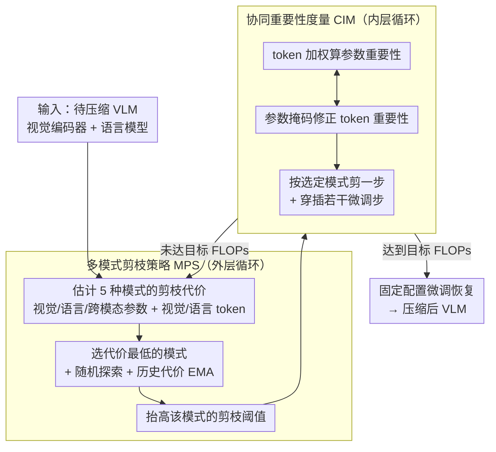

# CoMP: Collaborative Multi-Mode Pruning for Vision-Language Models

**会议**: CVPR 2026  
**arXiv**: [2604.02956](https://arxiv.org/abs/2604.02956)  
**代码**: [https://github.com/Wuzimeng/CoMP.git](https://github.com/Wuzimeng/CoMP.git)  
**领域**: 多模态VLM  
**关键词**: 模型剪枝, 视觉语言模型, 参数剪枝, Token剪枝, 协同压缩

## 一句话总结

CoMP 提出协同多模式剪枝框架，通过协同重要性度量（CIM）消除参数和 token 剪枝指标间的不一致性，通过多模式剪枝策略（MPS）自适应选择每阶段的最优剪枝模式，在高剪枝比例下显著优于单模式和简单联合剪枝方案。

## 研究背景与动机

VLM 基于 Transformer 架构，计算复杂度为 $O(N^2D + ND^2)$，其中 $N$ 是序列长度、$D$ 是特征维度。参数剪枝减小 $D$，token 剪枝减小 $N$，两者互补。

**两个核心挑战**：(1) **重要性度量不一致**——参数重要性的计算依赖所有 token，但 token 剪枝会移除部分 token，导致参数重要性被不重要的 token 主导。反之，token 重要性依赖所有参数，但参数剪枝会移除部分参数，导致 token 重要性失真。(2) **剪枝模式的固定应用**——渐进剪枝中每阶段固定按相同顺序剪参数和 token，但不同阶段的最优剪枝模式不同。

## 方法详解

### 整体框架

CoMP 要解决的是同一个 VLM 上同时做参数剪枝和 token 剪枝时两套重要性指标互相打架的问题。它把剪枝组织成一个嵌套循环：外层由多模式剪枝策略（MPS）周期性地决定这一阶段该剪什么——在视觉参数、语言参数、跨模态参数、视觉 token、语言 token 这五种模式里挑一个；内层则由协同重要性度量（CIM）算出参数和 token 各自的重要性分数，并按外层选定的模式执行一次剪枝。两层循环交替推进：每切换一次模式就穿插若干训练步，渐进逼近目标 FLOPs；达到目标后固定剪枝配置、再微调恢复性能——因此 CoMP 并非训练无关（training-free）方法，而是把剪枝嵌进了微调过程。

### 关键设计

**1. 协同重要性度量（CIM）：让参数和 token 的重要性不再互相污染**

参数剪枝和 token 剪枝单独看都成熟，但放在一起会互相干扰：参数重要性是在所有 token 上累积出来的，可一旦 token 被剪掉一批，这个累积就被那些本不该参与的 token 主导，算出来的参数重要性是失真的；反过来，token 重要性依赖所有参数，参数一被剪，token 排名也跟着错。CoMP 实测发现，对参数重要性贡献最大的那批 token，和 token 重要性排名前列的 token 重叠不到 30%，说明两套指标几乎各说各话。CIM 的做法是让两边互相"知会"：算参数重要性时引入 token 加权的输入范数，按 token 当前的重要性给输入加权，让已经被判为不重要的 token 少贡献甚至不贡献；算 token 重要性时则把参数侧的剪枝掩码传进注意力权重矩阵，已被剪掉的参数不再影响 token 排名。这样两套度量都基于"对方剪完之后的真实状态"来算，从源头消除了相互污染。

**2. 多模式剪枝策略（MPS）：每个阶段动态挑最划算的剪枝模式，让视觉和语言按各自冗余分别压**

渐进剪枝里常见的做法是每个阶段都按固定顺序剪参数再剪 token，但哪种模式最优其实是随阶段变化的——早期模型冗余多、且主要集中在 token 上，剪 token 代价低；到后期参数与 token 的冗余趋于相当、相互干扰加剧，最优模式随之漂移。固定顺序无法跟上这种变化。MPS 把剪枝切成多个阶段，并把可选项细分成五种模式：视觉参数、语言参数、跨模态参数、视觉 token、语言 token。每阶段先为这五种模式各估一个"剪枝代价" $r$——即按该模式剪一步后，模型在验证集上每单位 FLOPs 下降所付出的精度损失，然后挑代价最低的那个模式执行。为了不被单步噪声带偏，它对每种模式的代价维护一个指数滑动平均（EMA）来融合历史信息，并以概率 $\rho$ 做随机探索（按距上次执行的间隔做加权 softmax 采样），避免一直贪心选同一模式而陷入局部最优。

把模式按模态拆开是这一步的关键收益所在：因为五种模式本身就是模态特定的，MPS 的代价比较自然让视觉和语言以不同速率被压缩——哪边当前剪得更"便宜"就多剪哪边，最终落到一个非均匀但更优的压缩配比，无需人工为每个模态指定剪枝率。这套"估代价—选最优—带探索"的调度逻辑，本质上是把多臂老虎机的思路搬到了剪枝调度上。

### 训练策略

CoMP 把剪枝嵌进微调过程而非训练无关：模式切换之间会穿插若干训练步，按选定模式渐进抬高阈值、累积重要性得分并平滑衰减掩码（沿用 UPop 的做法），直到模型达到目标 FLOPs；之后固定剪枝配置，再对剪枝后的模型做一轮微调以恢复性能。MPS 用到的"剪枝代价"直接由模型在验证集上每单位 FLOPs 的精度变化估算。

## 实验关键数据

### 主实验

| 方法 | NLVR2 (50%剪枝) | NLVR2 (70%剪枝) | VQA | 图文检索 |
|------|----------------|----------------|-----|---------|
| 参数剪枝 only | 中 | 差 | 中 | 中 |
| Token剪枝 only | 中 | 差 | 中 | 中 |
| 简单联合 | 中 | 差 | 中 | 中 |
| **CoMP** | **最优** | **显著优于** | **最优** | **最优** |

在高剪枝比例（70%+）下优势尤为显著。

### 消融实验

| 配置 | 高剪枝比例性能 | 说明 |
|------|--------------|------|
| 无 CIM（独立度量） | 明显下降 | 度量不一致导致错误剪枝 |
| 无 MPS（固定模式） | 下降 | 非最优模式顺序 |
| 无随机探索 | 略下降 | 陷入局部最优 |
| 完整 CoMP | 最优 | 所有组件必要 |

### 关键发现

- CIM 的贡献在高剪枝比例下更加明显——低剪枝比例时度量不一致的影响较小
- MPS 的自适应模式选择避免了人工调参——不同任务/模型的最优策略不同
- 视觉和语言部分的最优剪枝比例确实不同，均匀剪枝是次优的

## 亮点与洞察

- **度量不一致的发现**：参数和 token 重要性度量间的干扰之前被忽视，CIM 的协同设计优雅地解决了这个问题
- **自适应模式选择**：借鉴多臂老虎机的思路（代价估计+探索），在剪枝中实现了自动化的策略选择
- **高剪枝比例优势**：在实际部署最需要的高压缩率场景下优势最大

## 局限与展望

- MPS 的模式选择增加了剪枝过程的计算开销
- 当前仅验证在 BLIP 系列模型上，对 LLaVA 等架构的适用性需进一步测试
- Token 剪枝在推理时的动态性需要专用的推理优化
- 未来可探索与量化的联合压缩

## 相关工作与启发

- **vs UPop/EViT**: 单模式剪枝方法，在高压缩率下性能急剧下降
- **vs 简单联合剪枝**: 不处理度量不一致，效果不如分别单模式剪枝
- **vs DepGraph/PLATON**: 参数剪枝专用方法，缺乏 token 维度的压缩

## 评分

- 新颖性: ⭐⭐⭐⭐ 度量不一致问题的发现和CIM设计有新意
- 实验充分度: ⭐⭐⭐⭐ 多任务多剪枝比例全面测试
- 写作质量: ⭐⭐⭐⭐ 问题分析清楚，图示直观
- 价值: ⭐⭐⭐⭐ 对VLM部署有直接实用价值

<!-- RELATED:START -->

## 相关论文

- [\[ICCV 2025\] METEOR: Multi-Encoder Collaborative Token Pruning for Efficient Vision Language Models](../../ICCV2025/multimodal_vlm/meteor_multi-encoder_collaborative_token_pruning_for_efficient_vision_language_m.md)
- [\[CVPR 2026\] Mostly Text, Smart Visuals: Asymmetric Text-Visual Pruning for Large Vision-Language Models](mostly_text_smart_visuals_asymmetric_text-visual_pruning_for_large_vision-langua.md)
- [\[CVPR 2026\] VisPlay: Self-Evolving Vision-Language Models](visplay_self-evolving_vision-language_models.md)
- [\[CVPR 2026\] TransPrune: Token Transition Pruning for Efficient Large Vision-Language Model](transprune_token_transition_pruning_for_efficient_large_vision-language_model.md)
- [\[CVPR 2026\] VisMem: Latent Vision Memory Unlocks Potential of Vision-Language Models](vismem_latent_vision_memory_unlocks_potential_of_vision-language_models.md)

<!-- RELATED:END -->
