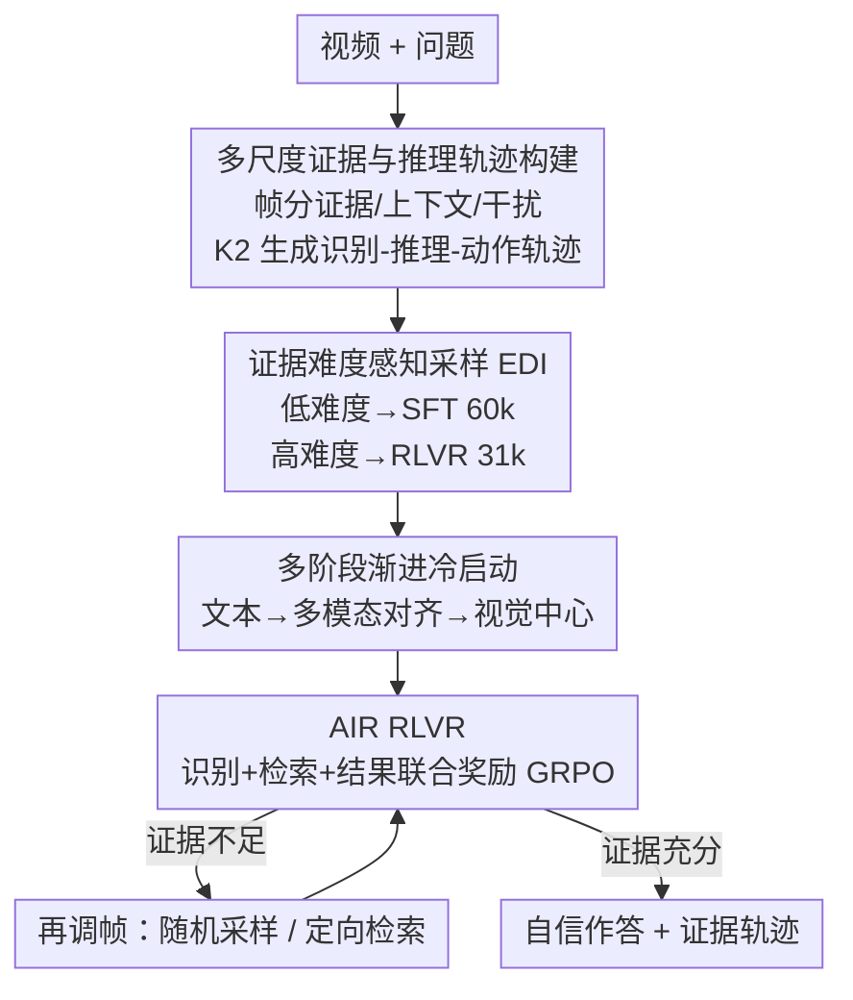

# Conan: Progressive Learning to Reason Like a Detective over Multi-Scale Visual Evidence

**会议**: CVPR 2026  
**论文**: [CVF Open Access](https://openaccess.thecvf.com/content/CVPR2026/html/Ouyang_Conan_Progressive_Learning_to_Reason_Like_a_Detective_over_Multi-Scale_CVPR_2026_paper.html)  
**代码**: https://github.com/OuyangKun10/Conan  
**领域**: 多模态VLM / 视频推理  
**关键词**: 视频推理, 证据定位, RLVR, 帧检索, 多步推理

## 一句话总结
Conan 让 7B 视频多模态大模型像侦探一样工作：先把帧分成证据/上下文/干扰三类，再边推理边决定"取证够了就答、不够就再调帧"，靠自建的 Conan-91k 数据集 + 三阶段冷启动 + 联合奖励 RLVR 训出来，六个多步推理基准平均比基座 Qwen2.5-VL-7B 涨 10.5%，多数榜超过 GPT-4o。

## 研究背景与动机
**领域现状**：视频推理需要跨帧累积视觉信息、再做多步逻辑演绎才能得到有依据的结论。受 RLVR（可验证奖励强化学习）在 LLM 推理上成功的启发，近期工作把这套范式搬到视频，分两条路线：一条是纯文本 CoT（如 Video-R1），另一条引入帧检索做 Video-CoT（如 Video-MTR、Rewatch-R1）。

**现有痛点**：纯文本 CoT 路线没有把推理"锚"在真实视觉证据上，推出来的链条经常是凭语言先验脑补的（hallucinated），结论看着合理但和视频内容对不上；帧检索路线虽然引入了视觉证据，却卡在**证据定位不准**——取回来的帧和问题弱相关，推理路径不可靠。更糟的是有些方法部分在 benchmark 自带训练集上训（如 Video-Holmes、LongVideoReason），分不清涨点是真推理变强还是 in-domain 过拟合。

**核心矛盾**：要做出可靠的多步视频推理，"在哪里取证（定位）"和"取到证据后怎么推（演绎）"必须协同——只推不取会脑补，只取不会判断够不够取又会乱取一通。现有方法把这两件事割裂了。

**本文目标**：给 MLLM 装上多尺度、证据锚定的多步推理能力，对应两个子问题：① 怎么自动造一份显式包含"证据定位 + 多步演绎 + 自信决策"的高质量推理数据；② 怎么设计训练课程，让模型循序渐进地学会跨多尺度证据推理。

**切入角度**：把推理过程类比成侦探破案——在多个尺度上识别相关帧（上下文帧 + 证据帧），跨帧串联线索形成连贯演绎链，并自适应决定是"下结论"还是"继续探查"。

**核心 idea**：用 "识别帧类型 → 基于线索推理 → 决定下一步动作"（Identification-Reasoning-Action）的可循环范式取代单向的文本 CoT 或盲目检索，把定位和演绎在同一条轨迹里联合优化。

## 方法详解

### 整体框架
Conan 的输入是"一段视频 + 一个问题"，输出是带证据轨迹的答案。它的核心是一个**可循环的三步推理轨迹**：每一轮先做帧识别（这批帧是证据/上下文/干扰），再做证据推理（基于已累积线索分析问题），最后做动作决策——三选一：没有任何证据就**随机采新帧**、有部分证据但不够答就**定向检索证据片段附近的帧**、证据足够就**自信作答**结束循环。

整篇论文要解决的"怎么让模型学会这套范式"被拆成数据 + 训练两半：先用强 LLM（Kimi K2）自动把 GenS-Video-150K 灌成 9.1 万条侦探式推理轨迹（Conan-91k），并按证据难度分层；再走两阶段课程——多阶段渐进冷启动（SFT）先把多步推理能力从纯文本逐级激活到以视觉为中心，AIR RLVR 再用联合奖励把识别、推理、动作三件事一起强化。

### 关键设计

**1. 多尺度证据与侦探式推理轨迹构建：把"取证-演绎-决策"灌进数据**

痛点直指现有数据要么只有文本链没有视觉锚点、要么定位标注粗糙。Conan 先复用 GenS-Video-150K 的帧级相关性分数，把帧分成三类——**证据帧**（直接能答题）、**上下文帧**（提供辅助线索）、**干扰帧**（与问题无关）；这个"多尺度"分类是后面一切的地基（消融里把上下文并进干扰会掉点）。然后用一条自动管线 + Kimi K2 生成视频-文本交错的推理轨迹：先均匀采 16 帧并保留类型标签，按当前证据比例决定动作——全是干扰就 Random Frames Sampling（随机再采 8 帧），有证据/上下文但证据比例没到 K2 能据此作答的动态阈值就 Specific Frames Retrieval（在含证据的片段里再均匀取 8 帧），证据比例过阈值就 Confident Question Answering 收尾。每一轮都把动作、帧类型、QA、稠密帧描述、时间戳喂给 K2，让它生成既分析 QA 又论证所选动作的连贯文本。这样产出的每条轨迹天然含三段：帧识别、证据推理、动作决策——正好就是要教给模型的范式骨架。

**2. 证据难度感知采样（EDI）：把课程从"易"铺到"难"**

要让模型循序渐进，得先量化"一道题有多难推"。作者定义**证据难度指数 EDI**：设证据比例 $P = m/N$（$m$ 为证据帧数、$N$ 为总帧数），证据帧的时间方差 $\mathrm{Var} = \frac{1}{m}\sum_{i=1}^{m}(x_i - \bar{x})^2$（$x_i$ 为第 $i$ 个证据帧的时间位置、$\bar{x}$ 为均值），则

$$\mathrm{EDI} = (1 - P)\cdot \mathrm{Var}.$$

EDI 越高，说明证据越稀疏、在时间上越分散，需要的多跳推理越难。基于 EDI 分布和推理轮数把样本分层分配：SFT 阶段挑低 EDI、最多三轮的 6 万条（25k 一轮 + 25k 两轮 + 10k 三轮），强调打基础；RLVR 阶段不限轮数、专挑高 EDI 的 3.1 万条，逼模型做高难度多跳。两份合起来就是 Conan-91k。这个设计让训练从"低难度证据锚定"平滑过渡到"高难度多跳推理"，比随机采样更稳（消融里换随机采样会掉点）。

**3. 多阶段渐进冷启动 + AIR 联合奖励 RLVR：从激活到精修的两段课程**

光有数据不够，怎么喂同样关键。第一段是**多阶段渐进冷启动**（在 Conan-CoT-60k 上 SFT），分三步、每步都掺新数据防过拟合：① 文本推理阶段——10k 低 EDI 一轮样本，帧只用稠密文字描述 + 时间戳，先把跨有序帧描述的时序/因果推理结构建起来；② 多模态对齐阶段——25k 一轮 + 10k 两轮样本，在视觉帧前插入时间戳和文字描述，从纯文本平稳过渡到多模态；③ 视觉中心阶段——用完整 60k（加 15k 两轮 + 10k 三轮），强迫模型直接在带时间戳的视觉帧上做深度多步推理。消融显示去掉视觉中心阶段或整个冷启动掉点最狠（Overall 53.0 / 51.0 vs 57.4），说明冷启动是激活多跳能力的关键。

第二段是 **AIR RLVR**（在 Conan-RLVR-31k 上）。因为冷启动后模型已会产出"帧识别 + 证据推理 + 动作决策"的轨迹，这里用奖励塑形去精修探索轨迹：格式奖励 $R_{fmt}$（匹配标签且每轮只做一个动作给 0.5）；结果奖励 $R_o$（多选题精确匹配给 1，自由问答取 ROUGE-1/2/L 均值）；再加两个过程奖励——识别奖励 $R_{ide}$（各轮识别证据/上下文帧的平均准确率）和检索奖励 $R_{ret}$（检索帧中证据/上下文帧的平均占比）。联合奖励是

$$R_J = \begin{cases} R_{fmt} + R_o + R_{ide} + R_{ret}, & R_o > 0,\\ R_{fmt} + R_o, & \text{否则}. \end{cases}$$

只有答对（$R_o>0$）才解锁过程奖励，这就把"结构合法 + 证据锚定 + 答案正确 + 检索高效"绑在一起，避免模型刷格式分或乱检索。最后用 GRPO 采一组 $G=8$ 个回复做强化优化。消融里去掉识别/检索奖励都掉点，证明这两个过程奖励确实在精修定位准确率和检索效率。

### 一个完整示例
以 VRBench 上的一道 Minecraft 题为例（"不同颜色衬衫对游戏有什么影响"）：**Round 1** 模型识别出当前帧全是干扰帧、意识到缺因果线索，决策 Random Frames Sampling 扩大搜索；**Round 2** 在上下文帧引导下，决策 Specific Frames Retrieval，检索 00:15:50–00:16:05、00:31:30–00:31:45 这些玩家交互的关键时间戳附近的帧；**Round 3** 识别出证据帧（夺旗、队伍活动等颜色触发的游戏事件），整合线索后 Confident Question Answering 选出正确选项 B。对照之下 Video-R1（纯文本 CoT）凭语言先验脑补选了错误的 A，Video-MTR（Video CoT）虽检索但定位不准也没答对——这一例把 Conan"定位准 + 会判断够不够取证"的优势具象化了。

### 损失函数 / 训练策略
基座 Qwen2.5-VL-7B-Instruct。冷启动每阶段训 1 epoch、全局 batch 32、lr 1e-5；AIR RLVR 训 1 epoch、batch 24、lr 1e-6。最大补全长度 4000 token，生成温度 1.0，GRPO 组大小 $G=8$。每段视频初始 16 帧、每轮最多再检索 8 帧；评测时推理限三轮、多步推理用 16 帧、长视频理解用 32 帧、分辨率 $448\times28\times28$。

## 实验关键数据

### 主实验
六个多步推理基准（MMR-V、Video-Holmes、VRBench、VCRBench 多选子集、Human-P&C、LongVideoReason）+ 四个长视频理解基准。Avg. VR / Avg. LU 分别是推理 6 榜与长视频 4 榜均值。

| 模型 | #Params | MMR-V | Video-Holmes | VRBench | VCRBench | Human-P&C | LVR | Avg. VR | Avg. LU |
|------|---------|-------|--------------|---------|----------|-----------|-----|---------|---------|
| GPT-4o | - | 44.0 | 42.0 | 76.7 | 54.0 | 48.4 | 63.1 | 54.7 | - |
| Qwen2.5-VL-72B | 72B | 39.1 | 40.2 | 72.7 | 50.8 | 55.7 | 72.3 | 55.1 | 53.4 |
| Qwen2.5-VL-7B（基座） | 7B | 30.1 | 28.5 | 66.4 | 46.5 | 48.2 | 61.8 | 46.9 | 48.0 |
| Video-R1（Text CoT） | 7B | 36.3 | 36.5 | 69.5 | 48.0 | 49.8 | 70.3 | 51.7 | 53.8 |
| Video-MTR（Video CoT） | 7B | 36.5 | 35.7 | 69.7 | 48.1 | 47.2 | 57.3 | 49.1 | 53.5 |
| Conan-SFT | 7B | 35.4 | 34.9 | 64.4 | 43.3 | 50.4 | 66.0 | 49.1 | 49.3 |
| **Conan** | 7B | **42.7** (↑12.6) | **44.6** (↑16.1) | **81.0** (↑14.6) | **51.0** (↑4.5) | **52.3** (↑4.1) | **72.8** (↑11.0) | **57.4** (↑10.5) | **54.9** (↑6.9) |

Conan 以 7B 之身在 Avg. VR 上反超 72B 基座（57.4 vs 55.1）和 GPT-4o（57.4 vs 54.7），且在 Video-Holmes、VRBench、Human-P&C、LVR 多榜单点超过 GPT-4o；长视频理解也涨 6.9%，说明能力可迁移。⚠️ 注：并发工作 Rewatch-R1 在 Avg. VR 上有 55.7（部分用了 LVR 训练集），原文将其标注为并发对比。

### 消融实验
| 配置 | Overall | 说明 |
|------|---------|------|
| **Conan（完整）** | **57.4** | 完整模型 |
| w/o multi-scale evidence | 53.8 | 上下文帧并进干扰类，缺多尺度线索 |
| w/o difficulty sampling | 55.2 | EDI 采样换成随机采样 |
| w/o textual reasoning | 57.0 | 去掉冷启动第一阶段 |
| w/o multimodal alignment | 56.4 | 去掉冷启动第二阶段 |
| w/o vision-centric reasoning | 53.0 | 去掉冷启动第三阶段（掉点显著） |
| w/o cold-start | 51.0 | 跳过三阶段冷启动直接 RLVR（掉最多） |
| w/o identification reward | 53.8 | 去掉识别奖励 |
| w/o retrieval reward | 54.0 | 去掉检索奖励 |
| w/ text CoT | 55.2 | 强制单轮纯文本 CoT、无检索 |

### 关键发现
- **冷启动是激活多跳能力的最大功臣**：去掉整个冷启动 Overall 从 57.4 跌到 51.0（-6.4），其中视觉中心阶段最关键（去掉 53.0）——说明先把推理结构铺好、再上 RLVR，远好于直接 RLVR。
- **多尺度证据 + 难度采样都有效**：把上下文并进干扰掉到 53.8，换随机采样掉到 55.2，验证"区分上下文/证据"和"按 EDI 从易到难"两个设计各自有贡献。
- **两个过程奖励缺一不可**：去识别奖励 / 去检索奖励分别掉到 53.8 / 54.0，证明它们确实在精修定位准确率与检索效率；强制纯文本 CoT（w/ text CoT 55.2）也不如完整范式。
- **Conan 当检索器也最强**：把不同模型当证据检索器、统一交给 Qwen2.5-VL-7B 作答，Conan 取的帧带来的下游精度最高，单独验证了它的证据定位能力。

## 亮点与洞察
- **把"该不该继续取证"做成了一个可学习的动作**：三选一的 Action Decision（随机采样 / 定向检索 / 自信作答）让模型显式学会"判断证据够不够"，而不是固定检索 K 帧——这是它比盲目检索路线定位更准的根因。
- **EDI 用"证据比例 × 时间方差"量化推理难度**：$(1-P)\cdot\mathrm{Var}$ 这个简洁指标把"证据稀疏 + 时间分散 = 更难"形式化，直接驱动了从易到难的课程分层，这套难度量化思路可迁移到其他需要长程证据聚合的任务。
- **奖励"答对才解锁过程分"的门控很聪明**：$R_o>0$ 才加识别/检索奖励，天然防止模型靠刷格式或乱检索骗分，把结果正确性当作过程奖励的闸门。
- **7B 反超 GPT-4o / 72B 的说服力**：在不依赖 benchmark 自带训练集的前提下涨点，缓解了"涨点 = in-domain 过拟合"的质疑。

## 局限与展望
- 作者提出未来要做 chain-of-frame 推理——在推理中动态**生成**帧，应对更复杂的视频推理，暗示当前 Conan 仍受限于"只能从已有视频里检索帧"。
- ⚠️ 数据轨迹由 Kimi K2 自动生成、证据/上下文/干扰标签源自 GenS 的相关性分数，轨迹质量与标签噪声直接受教师模型和源数据集上限制约，论文未单独量化轨迹噪声的影响。
- 评测固定三轮、16/32 帧，对需要更多轮探索或更密集采样的超长视频是否仍 work，缺乏更大轮数/帧预算下的曲线（部分在附录）。
- 横向比较里 Rewatch-R1 部分用了 LVR 训练集、VCRBench 只用多选子集，跨方法的绝对值不宜直接拉平比较。

## 相关工作与启发
- **vs Video-R1 / VideoChat-R1（Text CoT）**：它们纯文本推理无视觉锚点，靠语言先验容易脑补；Conan 把推理锚在识别+检索的真实证据上，多榜显著领先（如 MMR-V 42.7 vs 36.3）。
- **vs Video-MTR / Rewatch-R1（Video CoT）**：同样引入帧检索，但定位粗糙、检索效率低；Conan 用多尺度帧分类 + 识别/检索奖励精修定位，且能判断"够不够取证"，Avg. VR 57.4 优于 Video-MTR 49.1。
- **vs 直接 RLVR**：跳过冷启动直接强化（w/o cold-start 51.0）远不如先三阶段渐进激活再 RLVR（57.4），呼应"SFT 打基础 + RL 精修"在视频多步推理上同样成立。

## 评分
- 新颖性: ⭐⭐⭐⭐ 把侦探式"识别-推理-动作"循环做成可训练范式 + EDI 难度课程 + 联合过程奖励，组合新颖但各部件源自已有思路。
- 实验充分度: ⭐⭐⭐⭐⭐ 六推理 + 四长视频共十个基准，消融覆盖数据/冷启动/奖励三层，还做了检索器对比。
- 写作质量: ⭐⭐⭐⭐ 框架清晰、图文对照充分；部分指标定义需翻附录。
- 价值: ⭐⭐⭐⭐ 7B 反超 GPT-4o 且数据集/代码开源，证据锚定推理范式对视频 reasoning 社区有实用参考价值。

<!-- RELATED:START -->

## 相关论文

- [\[CVPR 2026\] Select Less, Reason More: Prioritizing Evidence Purity for Video Reasoning](select_less_reason_more_prioritizing_evidence_purity_for_video_reasoning.md)
- [\[CVPR 2026\] Perceptual-Evidence Anchored Reinforced Learning for Multimodal Reasoning](perceptual-evidence_anchored_reinforced_learning_for_multimodal_reasoning.md)
- [\[CVPR 2026\] DocSeeker: Structured Visual Reasoning with Evidence Grounding for Long Document Understanding](docseeker_long_document_understanding.md)
- [\[CVPR 2026\] PACT: Phase-Like Transition Constraints in Adapter-Based Continual Learning of Vision-Language Models](pact_phase-like_transition_constraints_in_adapter-based_continual_learning_of_vi.md)
- [\[CVPR 2026\] A More Word-like Image Tokenization for MLLMs](a_more_word-like_image_tokenization_for_mllms.md)

<!-- RELATED:END -->
