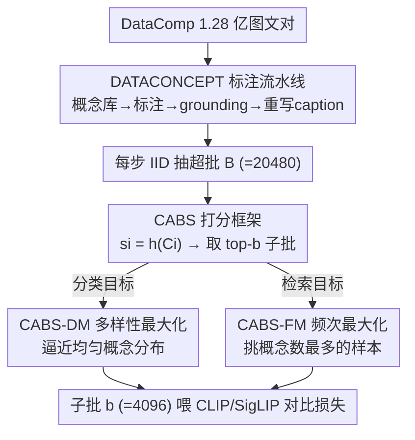

# Concept-Aware Batch Sampling Improves Language-Image Pretraining

**会议**: CVPR 2026  
**论文**: [CVF Open Access](https://openaccess.thecvf.com/content/CVPR2026/html/Ghosh_Concept-Aware_Batch_Sampling_Improves_Language-Image_Pretraining_CVPR_2026_paper.html)  
**代码**: https://cabs-vlp.github.io  
**领域**: 多模态VLM  
**关键词**: 视觉-语言预训练, 数据筛选, 在线批采样, 概念分布, CLIP/SigLIP  

## 一句话总结
本文把"数据筛选"从离线、样本级、概念无关的过滤，改成在线、批级、概念感知的采样：先给 1.28 亿图文对标注细粒度概念（DATACONCEPT），再用一个可插拔打分函数 CABS 在训练时实时从超批里挑出符合目标概念分布的子批——分类用"多样性最大化"、检索用"频次最大化"，在 28 个 benchmark 上分类涨 7%、检索涨 9.1%。

## 研究背景与动机
**领域现状**：CLIP/SigLIP 这类视觉-语言模型的泛化能力来自网络规模的图文对预训练。为了提质量，主流做法是数据筛选（data curation）：按 CLIP score 之类的指标过滤掉低质样本，或用大模型把 caption 重写得更描述性。DataComp 把这套筛选方案做成了标准 benchmark。

**现有痛点**：这些筛选方法有三个共性毛病。其一是**离线**——按预设规则一次性产出一个静态子集，数据一旦被丢弃就很难再为别的任务复用，还会加速训练样本枯竭、逼近"data wall"。其二是**样本级**——只在单样本粒度上判质量，完全忽略了整个数据集在**概念层面**的分布（哪些物体多、哪些稀有）。其三是**概念无关 / 黑盒**——依赖 SOTA 黑盒模型当过滤器，既不透明又会把模型自身的偏置传染进筛出来的数据集。

**核心矛盾**：根本问题在于"质量"没有普适定义——分类任务和检索任务想要的概念分布根本不一样。作者用实测说明：ImageNet（分类）的图大多是单物体，MSCOCO（检索）天然是多物体复杂场景。一个离线、固定的子集不可能同时对两类任务都最优。

**本文目标**：不预先丢弃任何数据，而是在训练过程中按下游任务需要、动态地塑造每个 batch 的概念分布；并且这套机制要可复现、可控、开源。

**切入角度**：把概念信息显式标进数据，再把 batch 构造变成一个"按目标概念分布打分选 top-k"的可参数化问题——换打分函数就能换目标，无需重做数据集。

**核心 idea**：用"在线、概念感知的批采样"替代"离线、概念无关的样本过滤"，让同一份带概念标注的数据池，靠切换打分函数适配不同下游任务。

## 方法详解

### 整体框架
方法分两层。**数据层**先把 DataComp 的 1.28 亿图文对升级成 DATACONCEPT：每个样本都附上检测到的概念标签、bounding box、逐概念置信度，以及一条概念感知的合成 caption。**训练层**是 CABS（Concept-Aware Batch Sampling）：每一步从数据池 IID 抽一个**大小为 $B$ 的超批**，用一个概念感知打分函数 $h$ 给每个样本打分，再取 top-$b$ 个样本组成真正喂给对比损失的**子批**（$b=(1-f)B$，$f$ 是过滤比例）。换不同的 $h$ 就得到不同采样策略：分类用 CABS-DM（多样性最大化），检索用 CABS-FM（频次最大化）。注意概念标注只用于挑样本，不进对比损失本身。

### 关键设计

**1. DATACONCEPT：给每个样本打上细粒度概念标注，让概念分布可被显式操控**

要在训练时按概念分布选样本，前提是每个样本"含哪些概念"是已知的。作者构建了一条四步标注流水线。第一步**建概念库**：把已有 4029 个概念扩充，从 RAM++、V3Det、OpenImages 的类别标签汇总、去重、安全过滤，得到 19261 个概念。第二步**概念标注**：用图像打标模型 RAM++ 给每个样本打一组概念标签。第三步**概念 grounding**：RAM++ 只给标签不给位置且置信度可能失准，于是用 GroundingDINO 补上 bounding box，并配两个技巧——**置信度种子**（只把 RAM++ 置信度 ≥0.75 的标签作为 GroundingDINO 的提示词）和**多分辨率集成**（在 {384,512,800,1000} 多个分辨率上预测再用 Weighted Box Fusion 融合，压低幻觉）。grounding 后概念词表收敛到最终的 12253 个（记作 $\mathcal{V}$），每个样本 $i$ 得到一个概念集 $C_i$。第四步**概念感知重写 caption**：用 Qwen2-VL-7B，把检测到的概念列表 $C_i$ 和原始 alt-text $T_i$ 一起喂进去，生成更干净、贴合概念的合成 caption $R_i$。最终每个样本表示为 $(I_i, T_i, R_i, C_i)$。

这一步的价值在于：它把"概念分布"从隐式的、不可见的，变成每个样本上可读可算的元数据——后面所有打分策略都建立在 $C_i$ 之上。

**2. CABS：把批采样形式化为"打分 + top-k"的可插拔框架**

这是全文的机制内核。给定从数据池 IID 抽出的超批 $B$，定义目标子批大小 $b=(1-f)B$，$f\in[0,1)$ 是过滤比例（实验默认 $f=0.8$，超批 $B=20480$、子批 $b=4096$）。对每个带概念标注 $C_i$ 的样本，CABS 算一个分数

$$s_i = h(C_i; B, \theta_h),$$

其中 $h(\cdot)$ 是概念感知的启发式增益函数、$\theta_h$ 是该策略相关的参数。然后取分最高的 $b$ 个构成子批：$B_{sub}=\mathrm{TopK}_{i\in B}(s_i, k=b)$。这个框架的妙处是它把 IID 采样也包含为特例——令 $h(i)=1$、$\theta_h=\varnothing$，top-k 就退化成 IID。于是"换 $h$ 就换采样策略"，practitioner 可以为不同任务在训练中实时诱导出不同的子批概念分布，无需重做离线数据集。这正是它相对离线筛选的根本差异：分布是任务自适应、按需即时生成的。

**3. CABS-DM：贪心逼近均匀概念分布，专治长尾分类**

针对分类任务的痛点——IID 子批里常见概念被过度表征、稀有概念欠优化、长尾表现差。CABS-DM 的目标是让子批的概念频次尽量均匀。它给每个概念 $c$ 设一个目标上限 $t_c$（即 $\theta_h$），并用如下增益函数迭代打分：

$$h_{DM}(i) = \frac{1}{|C_i|}\sum_{c\in C_i}\left(\frac{t_c-n_c}{t_c}+\frac{1}{F_c}\right),\quad \text{若 } n_c<t_c;\quad 0,\ \text{若 } n_c\ge t_c,$$

其中 $n_c$ 是当前子批里概念 $c$ 已出现的次数、$F_c$ 是 $c$ 的全局频次。每个概念贡献两项：**平衡增益** $(t_c-n_c)/t_c$ 优先补还没填满的概念，**稀有奖励** $1/F_c$ 把长尾概念往前提（让稀有概念在贪心早期就被纳入，减少需要遍历的样本数）。算法是确定性贪心——每步选 $i^\star=\arg\max_i h_{DM}(i)$，加入子批后更新 $n_c$；某概念一旦超过 $t_c$，所有还含该概念的样本作废。这个"选样本—更新计数"的交替很像 EM。确定性带来同一超批可复现；而超批本身是随机抽的，使得跨训练步仍有多样性。效果上，CABS-DM 子批的独立概念数几乎是 IID 的两倍（实测 3234 vs 1945），分布接近平的。

**4. CABS-FM：直接挑概念最多的样本，专治多物体检索**

检索 benchmark（MSCOCO、Flickr）考的是多物体组合理解，需要把丰富文本对齐到复杂场景。CABS-FM 因此反其道而行——不要均匀，要"密"。它的增益函数极简：$h_{FM}(i)=|C_i|$，即样本含的概念个数。直接按 $|C_i|$ 排序取 top-k，$B_{sub}=\mathrm{TopK}_{i\in B}(|C_i|,k=b)$，得到物体多重性最高、场景最复杂的子批。它无状态依赖（$\theta_h=\varnothing$），比 DM 还轻。把这种复杂样本喂给模型，能更好泛化到检索的组合性本质。

> CABS-DM 和 CABS-FM 共享同一个 CABS 框架（设计 2），只是 $h(\cdot)$ 和 $\theta_h$ 不同——这正体现了框架"可插拔"的设计意图：见 Tab.1，IID 用 $h=1$、DM 用 Eq.(1) 且依赖子批当前状态、FM 用 $|C_i|$ 且不依赖。

### 损失函数 / 训练策略
对比目标本身不变，仍是标准 CLIP / SigLIP 对比损失，概念标注只参与选样本、不进 loss。训练严格沿用 DataComp 超参（batch size 4096）做公平对比。主实验固定"见过 128M 样本"的预算；默认 $f=0.8$ 意味着每 epoch 有效样本是 IID 的 1/5，因此 CABS 天然处于"数据受限、需重复"的设定（5× worst-case 重复）。

## 实验关键数据

模型：ViT-B-32 CLIP（224 分辨率）与 ViT-B-16 SigLIP（256 分辨率）；评测 25 个分类 + 2 个检索 benchmark，外加长尾测试集 "Let-It-Wag!"。基线含 IID、离线的 MetaCLIP、在线的 GRIT-VLP / MAFA。

### 主实验：CABS-DM（分类）与 CABS-FM（检索）均显著超 IID

| 任务/模型 | 配置 | IID | 本文 | 提升 |
|--------|------|------|------|------|
| 分类 ImageNet-Val · ViT-B-32-CLIP (alt) | CABS-DM | 15.2 | 18.6 | +3.4 |
| 分类 Avg(Clf) · ViT-B-32-CLIP (recap) | CABS-DM | 33.0 | 35.5 | +2.5 |
| 分类 ImageNet-Val · ViT-B-16-SigLIP (recap) | CABS-DM | 27.4 | 32.3 | +4.9 |
| 检索 Avg(Ret) · ViT-B-32-CLIP (alt) | CABS-FM | 12.9 | 16.4 | +3.5 |
| 检索 Avg(Ret) · ViT-B-32-CLIP (recap) | CABS-FM | 32.6 | 41.6 | +9.0 |
| 检索 Flickr · ViT-B-16-SigLIP (recap) | CABS-FM | 57.0 | 63.5 | +6.5 |

论文摘要口径的"分类涨 7%、检索涨 9.1%"是跨配置的最大增幅。值得注意的是：即便仍用 IID 采样，仅把 alt-text 换成概念感知重写 caption，SigLIP 上 ImageNet 就能涨 +11.6%——说明 DATACONCEPT 的重写 caption 本身就是强增益，CABS 与之叠加效果最好。

### 对比 SOTA 筛选方法（分类，ViT-B-32-CLIP，Avg-Clf / IN-Val）

| 方法 | 类型 | Avg(Clf) | IN-Val | Let-It-Wag! |
|------|------|------|------|------|
| IID | 基线 | 28.2 | 15.2 | 5.1 |
| MetaCLIP | 离线概念平衡 | 26.9 | 16.9 | 5.3 |
| GRIT-VLP | 在线难负样本 | 27.5 | 15.0 | 6.3 |
| MAFA | 在线难负样本 | 27.9 | 15.0 | 5.6 |
| **CABS-DM** | 在线概念平衡 | **30.7** | **18.6** | **7.5** |

CABS-DM 在 ImageNet 上超离线 MetaCLIP +2.9（Avg-Clf）/ +3.8（IN-Val）；而 GRIT-VLP、MAFA 在 CLIP 上甚至打不过 IID 基线（只对 SigLIP 有小幅提升，印证 SigLIP 更吃主动采样）。检索侧 CABS-FM 同样全面胜出（Tab.5/6）。

### 数据/算力受限与长训练（关键发现）
- **兼容 CLIPScore 过滤**：先按 CLIP score 保留 top-30%（约 38M），再上 CABS（$f=0.5$，6.67× 重复），CABS-DM/FM 仍然全面超 IID——即便重复率是 IID 的 2×，重复已筛数据本会边际递减，CABS 依然占优（Tab.7/8）。
- **长训练 1.28B 样本**：只要 IID 还处于算力受限段，CABS 就带来 **3.2×（DM）/ 2×（FM）的算力倍增**；深入数据受限段（CABS 50× 重复 vs IID 10×）增益略缩但仍强（Fig.4）。
- **最大贡献来自"概念感知重写 caption + 任务自适应采样"的叠加**：两者单独都有效，合起来增益最大。

## 亮点与洞察
- **把数据筛选改写成"超批→打分→top-k"的统一框架**，巧在 IID 是其特例（$h=1$），换打分函数就换目标，无需重造数据集——这让"为不同任务定制数据分布"变成训练时一行 scoring 的事。
- **同一份数据、两种相反策略**：分类要"均匀分散"（DM）、检索要"密集复杂"（FM），用一个框架的两个 $h$ 实现，直接坐实了"质量无普适定义"的论点。
- **"重用 > 过滤"的范式转向**：不预先丢数据、把概念标注当可摊销的一次性投资，能反复为不同任务复用，缓解 data wall。这个思路可迁移到任何带可标注属性的预训练池（如多语言、风格、难度）。
- **DM 的稀有奖励 $1/F_c$ 是个工程巧思**：既鼓励长尾覆盖，又因为让稀有概念早被选中而减少遍历样本数，平衡了效果与开销。

## 局限与展望
- **标注成本高**：概念标注（RAM++ + GroundingDINO 多分辨率 + Qwen2-VL 重写）开销不小；作者辩称可摊销（同一标注供多任务复用）。
- **运行时随过滤比 $f$ 增大而上升**：贪心选样本有额外开销，$f$ 越高越贵；好在低 $f$ 也有效，可权衡。
- **未验证更复杂架构 / 真·SOTA 规模训练**：实验止于 ViT-B 级别和 1.28B 样本，没覆盖当前最大规模训练。
- **打分函数全程固定**：一个 $h$ 从头用到尾。作者自己也指出，未来可做课程式调度（先单物体后复杂场景）、或找一个同时平衡分类+检索的统一打分函数；还可推广到微调数据。
- ⚠️ 个人补充：DM 与 FM 是两套相反目标，论文未给出"既要分类又要检索"时的单一最优策略，实际部署需按主任务二选一。

## 相关工作与启发
- **vs MetaCLIP（离线概念平衡）**：两者目标相似（都想平衡概念），但 MetaCLIP 靠离线子串匹配 + 每概念封顶造静态子集；CABS 在线、按子批当前状态贪心调整，且不丢数据。结果上 CABS-DM 全面超 MetaCLIP。
- **vs GRIT-VLP / MAFA（在线难负样本采样）**：它们按 embedding 相似度挑难负样本（GRIT 用当前模型、MAFA 用预训练模型），关注的是"难度"而非"概念组成"；CABS 把概念多样性/多重性引入 batch 构造，是这条在线采样线里此前缺失的维度，效果也更好。
- **vs JEST / ACID**：同属在线主动采样但闭源不可复现；CABS 自称是首个可复现的任务自适应在线批采样开源方案。

## 评分
- 新颖性: ⭐⭐⭐⭐⭐ 把数据筛选从离线样本级重构为在线概念级，并用一个含 IID 特例的统一框架承载两种相反任务策略，视角新。
- 实验充分度: ⭐⭐⭐⭐⭐ 28 benchmark、4 backbone、CLIP/SigLIP 双目标，含对离线/在线 SOTA 对比与数据/算力受限消融，覆盖全面。
- 写作质量: ⭐⭐⭐⭐ 框架、公式、流水线交代清楚；DM/FM 与 DATACONCEPT 分节明确，仅细节散落附录。
- 价值: ⭐⭐⭐⭐⭐ 开源 DATACONCEPT + CABS，给出可复现、可控、可定制的在线数据筛选方案，对 VLM 预训练实践直接可用。

<!-- RELATED:START -->

## 相关论文

- [\[CVPR 2026\] SynCLIP: Synonym-Coherent Language-Image Pretraining for Robust Open-Vocabulary Dense Perception](synclip_synonym-coherent_language-image_pretraining_for_robust_open-vocabulary_d.md)
- [\[CVPR 2026\] TIPSv2: Advancing Vision-Language Pretraining with Enhanced Patch-Text Alignment](tipsv2_patch_text_alignment.md)
- [\[CVPR 2026\] CICA: Coupling Confidence-Aware Pretraining with Confidence-Informed Attention for Robust Multimodal Sentiment Analysis](cica_coupling_confidence-aware_pretraining_with_confidence-informed_attention_fo.md)
- [\[CVPR 2026\] Improving Calibration in Test-Time Prompt Tuning for Vision-Language Models via Data-Free Flatness-Aware Prompt Pretraining](improving_calibration_in_test-time_prompt_tuning_for_vision-language_models_via_.md)
- [\[CVPR 2026\] MVP: Multiple View Prediction Improves GUI Grounding](mvp_multiple_view_prediction_improves_gui_grounding.md)

<!-- RELATED:END -->
