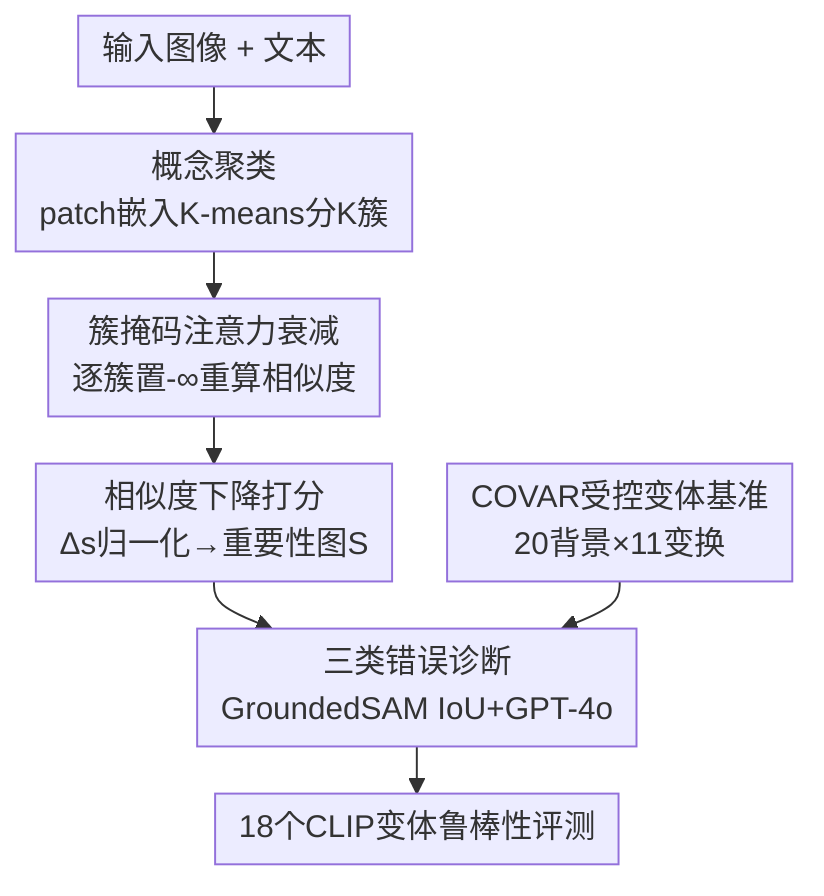

# Concept Regions Matter: Benchmarking CLIP with a New Cluster-Importance Approach

**会议**: CVPR 2026  
**论文**: [CVF Open Access](https://openaccess.thecvf.com/content/CVPR2026/html/Agarwal_Concept_Regions_Matter_Benchmarking_CLIP_with_a_New_Cluster-Importance_Approach_CVPR_2026_paper.html)  
**代码**: 无（论文未给出）  
**领域**: 多模态VLM / 可解释性  
**关键词**: CLIP可解释性, 虚假相关, 背景依赖, 概念聚类, 鲁棒性基准  

## 一句话总结
提出一种免训练的 CLIP 解释方法 CCI（把图像 patch 聚成语义簇、逐簇屏蔽注意力、用相似度下降量化每簇贡献），用它揭示「CLIP 的错误大多不是背景依赖、而是细粒度混淆」，并配套构建受控变体基准 COVAR 系统评测 18 个 CLIP 变体的虚假相关倾向。

## 研究背景与动机
**领域现状**：CLIP 这类对比式视觉-语言模型在零样本分类、检索、开放词表识别上泛化很强，但被反复发现会依赖「虚假相关」——靠背景而非物体本身做判断（水边的鸟标成 water ouzel、草地上的斑马等）。为量化背景依赖，CounterAnimals（CA）基准按 CLIP 自身准确率把图像切成 easy / hard 两堆，hard 集被默认为「非典型背景」从而探测背景敏感性。

**现有痛点**：作者指出 CA 这套「用准确率当代理」的做法有两个硬伤。其一，准确率掉了不等于就是背景在作怪——CLIP 完全可以「看对了物体却仍分错」（jaguar 看着物体却被判成 cheetah），也可以「靠背景却恰好蒙对」（water ouzel 靠水面识别）。其二，把丰富的视觉变化（视角、尺度、姿态、构图）压成 easy/hard 二元划分，掩盖了真正的错误来源。

**核心矛盾**：要诊断「CLIP 到底依赖了图像的哪块区域」，需要一个**忠实**且**区域级**的解释工具；但现有解释方法（GradCAM、Grad-ECLIP、MaskCLIP、RISE 等）要么基于梯度产生噪声碎片化的像素级显著图，要么用黑块/噪声 token 替换扰动、破坏输入分布导致解释不稳定。没有可靠的解释工具，背景依赖这件事就只能靠准确率间接猜。

**本文目标**：① 造一个忠实、语义连贯、区域级的免训练解释方法；② 用它把 CLIP 的错误**拆开**——到底是背景驱动、还是细粒度混淆、还是尺度/视角等鲁棒性问题；③ 造一个能逐因子受控变化的基准，公平评测大量 CLIP 变体。

**核心 idea**：与其在像素层做扰动，不如直接利用 **CLIP 自己的 patch 嵌入**把图像分成语义连贯的「概念簇」，逐簇在注意力层屏蔽、看图文相似度掉多少，用「相似度下降」当作该概念对预测的因果贡献。

## 方法详解

### 整体框架
论文有两条主线：一是解释方法 **CCI（Concept Cluster Importance）**，二是受控基准 **COVAR**。CCI 在推理时运行、不改模型也不重训：拿到一张图，先用 CLIP 的 patch 嵌入做 K-means 聚类得到 K 个语义簇；然后逐个簇把它在所有 Transformer 层的注意力 logit 置成 $-\infty$，让 CLS token 取不到这簇 patch 的信息，重新算图文相似度，相似度掉得越多说明这簇越重要；把各簇的相对下降归一化加权，得到一张空间重要性热力图。有了这张「CLIP 到底看了哪」的图，再借 GroundedSAM 的前景/背景掩码做 IoU 重叠，把错误分成前景驱动、背景驱动，并用 GPT-4o 进一步判定前景错误里哪些是细粒度混淆。最后 COVAR 把每个物体放进 20 种背景、再叠加 11 种结构化变换（尺度/视角/翻转/旋转/平移/裁剪），生成 39.6 万张受控样本，用 CCI 在上面系统诊断 18 个 CLIP 变体。

### 关键设计

**1. 概念聚类：用 CLIP 自己的表示切出语义连贯的区域**

痛点直白：像素级 superpixel（SLIC/LIME）和模型表示不对齐，梯度法又碎又噪。CCI 改成在 CLIP 的 patch 嵌入空间里做聚类。给定图像编码器输出的 token 序列 $Z=[z_{\text{CLS}}, z_1, \dots, z_N]$，只取 patch 嵌入 $X=\{z_i\}_{i=1}^N$（它们编码了局部语义），对其做 K-means 得到 $C=\{C_1,\dots,C_K\}$（论文默认 $K=7$）。每个簇聚的是「语义相似的 patch」，因此天然对应图像里一个连贯的概念区域（鲨鱼的牙齿、时钟的数字），而不是随机的像素块。这一步让后续的「屏蔽—打分」操作落在**有语义意义的整块区域**上，是 CCI 区域级解释的根基。

**2. 簇掩码注意力衰减 + 相似度下降打分：把「概念贡献」变成可度量的因果量**

要回答「这一簇对预测贡献多大」，CCI 不去改像素，而是直接掐断注意力。对簇 $C_k$ 先构造二值掩码 $m_k(j)=1$ 当 $j\in C_k$ 否则 $0$；然后在每一层、每个 head 的注意力 softmax 之前修改 logit：

$$\hat{A}^{(l)}_k(i,j) = \begin{cases} A^{(l)}(i,j), & m_k(j)=0 \\ -\infty, & m_k(j)=1 \end{cases}$$

置 $-\infty$ 意味着 CLS token 在聚合信息时完全拿不到这簇 patch。屏蔽后得到新的 CLS 嵌入 $\hat{z}_{\text{CLS},k}$，与文本嵌入 $t$ 算相似度 $s_k=\cos(\hat{z}_{\text{CLS},k}, t)$，对照原始相似度 $s=\cos(z_{\text{CLS}}, t)$，定义该簇的相似度下降 $\Delta s_k = s - s_k$。归一化成权重 $w_k = \Delta s_k / \sum_{j=1}^{K}\Delta s_j$，最终空间重要性图就是各簇掩码的加权和 $S=\sum_{k=1}^{K} w_k \cdot m_k$。

这样做的妙处在于：屏蔽发生在注意力 logit 层、不替换任何像素，因此**不破坏输入分布**（避开了 RISE 那类黑块/噪声替换带来的不稳定），又因为操作单位是整个语义簇，得到的解释是连贯、区域对齐的，而非梯度法的碎点。$\Delta s_k$ 本质是「拿掉这个概念，模型的判断变差多少」，是一个直接的因果信号。

**3. 三类错误诊断：把「准确率掉了」拆成背景 / 细粒度 / 其他**

光有热力图还停在定性，作者要量化「错误到底因为什么」。流程是：用 GroundedSAM 为 ImageNet-1k 和 CA 拿到真值前景（FG）/背景（BG）掩码，把 CCI 关于**预测类**算出的热力图与 FG/BG 掩码做 IoU 重叠，重叠在前景上就归为前景驱动错误（FG-Er）、在背景上就归为背景驱动错误（BG-Er）；对 FG-Er 再用 GPT-4o 判断预测类与真值类是否「视觉相似」（如 siamang vs chimpanzee），相似的归为细粒度混淆（Fine-Er）。结论很反直觉：BG-Er 只占很小一块（ImageNet 9.1%、CA 6.7%），而且 CA 的 easy 和 hard 集背景错误率几乎一样——这直接戳破了「准确率差距主要来自背景相关」的假设；真正的大头是 Fine-Er（ImageNet 46.6%、CA 60.4%）。这套诊断是论文从「方法」走向「论断」的桥梁。

**4. COVAR 受控变体基准：逐因子隔离，暴露更广的失败模式**

CA 只有每类 2 个背景、且不控制视角/尺度/翻转/裁剪，无法把各因子分开看。COVAR 的造法是：从 ImageNet 选 33 类、每类采 50 张，用 Emu2 图像编辑模型把每张图合成到 20 种 GPT-4o 设计的背景里（室内外都有），得到每类 1000 张、共 33,000 张「背景变体（Bg-varied）」；再把每张 Bg-varied 图扩成 11 种结构化变换（4 种尺度、2 种视角、水平/垂直翻转、单版本的平移/裁剪/旋转），最终 396,000 张。因为每个因子都被单独受控变化，就能逐项测出「哪种扰动最伤」——实验显示尺度（Scale）最致命，它不仅掉准确率、还把 BG-Er 几乎翻倍，说明物体变小后模型更去蹭背景；而翻转/旋转/平移基本不涨 BG-Er，属于「广义鲁棒性」问题而非背景依赖。这种「准确率 + BG-Er + Fine-Er 三指标 × 八子集」的评测，比 CA 的二元划分细得多。

## 实验关键数据

### 主实验：CCI 解释忠实度（ImageNet-1k，Deletion↓ / Insertion↑ AUC）
用 deletion（按重要性逐步把像素换成噪声，看 top-1/5 准确率掉得多快，AUC 越低越好）和 insertion（从空白逐步揭示重要像素，AUC 越高越好）衡量解释的因果忠实度。

| 方法 | Del@1 ↓ | Del@5 ↓ | Ins@1 ↑ | Ins@5 ↑ |
|------|---------|---------|---------|---------|
| GradCAM | 0.3417 | 0.5628 | 0.2682 | 0.4454 |
| MaskCLIP | 0.2848 | 0.4885 | 0.3335 | 0.5351 |
| Grad-ECLIP（次优） | 0.2464 | 0.4272 | 0.3838 | 0.5993 |
| **CCI（本文）** | **0.1809** | **0.3276** | **0.4175** | **0.6518** |

CCI 在 deletion 和 insertion 上全面刷新 SOTA，Del@5 从次优 0.4272 降到 0.3276。

### MS COCO 跨模态检索忠实度（Karpathy split，IR/TR）
| 方法 | Del-IR@5 ↓ | Del-TR@5 ↓ | Ins-IR@5 ↑ | Ins-TR@5 ↑ |
|------|------------|------------|------------|------------|
| MaskCLIP | 0.2841 | 0.2949 | 0.2953 | 0.3514 |
| Grad-ECLIP（次优） | 0.2670 | 0.2933 | 0.3203 | 0.3761 |
| **CCI（本文）** | **0.1056** | **0.1184** | **0.3513** | **0.3943** |

最亮眼：Del-IR@5 上 CCI 把误差从次优 Grad-ECLIP 的 0.2670 降到 0.1056，**超过两倍**的提升。

### 错误来源诊断（CCI + GroundedSAM + GPT-4o）
| 数据集/子集 | BG-Er | Fine-Er | 关键发现 |
|-------------|-------|---------|----------|
| ImageNet-1k | 9.1% | 46.6% | 背景错误是少数，细粒度才是主因 |
| CounterAnimals | 6.7% | 60.4% | easy/hard 背景错误率近乎一致 |
| COVAR Bg-varied | 15.6% | （主导） | 换背景后 BG-Er 较 CA 明显上升 |
| COVAR Scale | 显著升高 | 主导 | 缩小尺度使 BG-Er 接近翻倍（如 ViT-B/32 达 50.7%） |

### 关键发现
- **准确率不是好代理**：CA 的 easy/hard 集背景错误率几乎相同（约 6.2% vs 7.3%），证明「准确率掉=背景依赖」的隐含假设站不住脚；错误的真正大头是细粒度混淆。
- **尺度是最难的扰动**：在 COVAR 上，尺度变化同时拉低准确率、并把 BG-Er 翻倍（物体变小→更依赖背景）；视角变化会掉准确率但**不**显著升 BG-Er，说明它是广义鲁棒性问题。
- **模型大≠更鲁棒**：ViT-bigG、ViT-H/14(DFN-5B) 这类大模型 Bg-varied 准确率高，但在尺度扰动下 BG-Er 仍达约 30–33%；而用精选数据（DataComp-1B）训练的模型背景依赖更低——**预训练数据质量与模型大小同样重要**。
- **更细的 patch 有帮助**：同样 DataComp-1B 下，ViT-B/16 的 BG-Er 几乎在所有扰动上都低于 ViT-B/32（尺度下 30.5% vs 50.7%），细化 patch 能减少背景依赖；但单纯提分辨率（SigLIP2 512px）只能轻微降 BG-Er。

## 亮点与洞察
- **「相似度下降」作为因果度量很干净**：在注意力 logit 上置 $-\infty$ 而不替换像素，既保住输入分布、又把解释单位提到语义簇级别，一举解决了梯度法噪声和扰动法不稳定两个老问题——这个「在表示空间而非像素空间做扰动」的思路可迁移到任何带注意力的 VLM 解释任务。
- **用解释工具去证伪一个流行基准的假设**：论文最「啊哈」之处不是 CCI 本身，而是用 CCI 把 CounterAnimals 的核心假设（准确率差=背景依赖）量化地推翻，把社区对「虚假背景相关」的笼统归因拆成 BG-Er / Fine-Er / 鲁棒性三类。
- **受控数据生成范式**：用 Emu2 + GPT-4o 自动合成「同物体 × 20 背景 × 11 变换」的工厂化做法，把基准从「2 背景」拉到「逐因子可控」，这种合成受控变体的思路可复用到任何想隔离混淆因素的鲁棒性研究。

## 局限与展望
- COVAR 由生成式编辑（Emu2）合成，背景/变换的真实性与潜在生成伪影可能影响结论的外推性 ⚠️（论文未深入讨论合成偏差对 BG-Er 测量的影响）。
- 错误归因链路依赖 GroundedSAM 的 FG/BG 掩码与 GPT-4o 的「是否视觉相似」判断，这两步本身会引入误差，BG-Er/Fine-Er 的绝对数值应看作近似。
- CCI 需对每个簇做一次前向（K 次额外推理），$K$ 是超参（默认 7），在大图或大 K 下有额外开销；论文把 $K$ 的选择放在补充材料，正文未给敏感性曲线。
- 论文给出的缓解方向（多尺度特征对齐、RobustMixGen 数据增广、等变注意力）只是建议，未在 COVAR 上实证验证其改进效果。

## 相关工作与启发
- **vs Grad-ECLIP / GradCAM（梯度归因）**：它们靠梯度算重要性，产出像素级、噪声碎片化的显著图；CCI 在表示空间聚簇 + 注意力屏蔽 + 相似度下降，得到连贯区域级解释，忠实度（deletion/insertion AUC）大幅领先（COCO Del-IR@5 两倍提升）。
- **vs MaskCLIP / RISE（扰动/掩码）**：它们用黑块/噪声 token 替换区域，破坏输入分布、解释不稳定；CCI 在注意力 logit 层置 $-\infty$，不动像素、保分布。
- **vs CounterAnimals（基准）**：CA 用准确率把图分 easy/hard、只 2 个背景、隐式把掉点全归因背景；COVAR 逐因子受控（20 背景 + 11 变换）、配 CCI 把错误三分类，证明背景只是少数、细粒度才是主因。

## 评分
- 新颖性: ⭐⭐⭐⭐ 「表示空间聚簇+注意力屏蔽+相似度下降」的解释机制干净且首次系统用于证伪背景依赖假设
- 实验充分度: ⭐⭐⭐⭐⭐ 双任务忠实度 + 18 个 CLIP 变体 × 8 子集 × 三指标的大规模诊断
- 写作质量: ⭐⭐⭐⭐ 论证链（CA 的问题→CCI→诊断→COVAR）清晰，但代码与部分敏感性分析缺位
- 价值: ⭐⭐⭐⭐ 给「CLIP 虚假相关」研究提供了忠实解释工具 + 受控基准，纠正了社区一个流行的错误归因

<!-- RELATED:START -->

## 相关论文

- [\[CVPR 2026\] CLIP-Free, Label-Free, Unsupervised Concept Bottleneck Models](clip-free_label_free_unsupervised_concept_bottleneck_models.md)
- [\[CVPR 2026\] Concept-wise Attention for Fine-grained Concept Bottleneck Models](coat_cbm_concept_wise_attention.md)
- [\[CVPR 2026\] World in a Frame: Understanding Culture Mixing as a New Challenge for Vision-Language Models](world_in_a_frame_understanding_culture_mixing_as_a_new_challenge_for_vision-lang.md)
- [\[CVPR 2026\] Seeing Through Touch: Tactile-Driven Visual Localization of Material Regions](seeing_through_touch_tactile_localization.md)
- [\[CVPR 2026\] Cluster-Aware Neural Collapse Prompt Tuning for Long-Tailed Generalization of Vision-Language Models](cluster-aware_neural_collapse_prompt_tuning_for_long-tailed_generalization_of_vi.md)

<!-- RELATED:END -->
