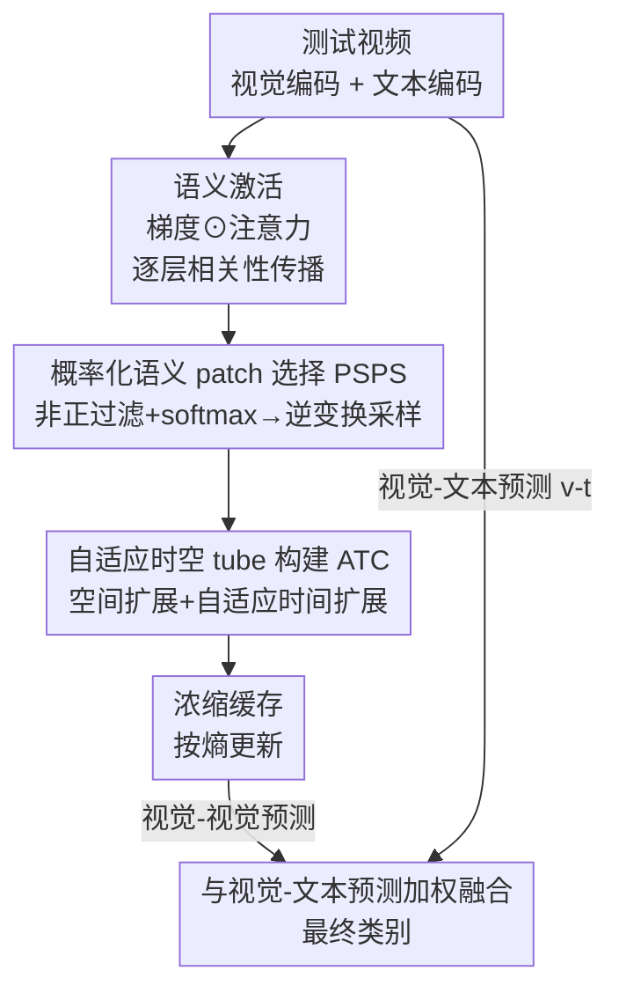

# Condensed Test-Time Adaptation of VLMs for Action Recognition

**会议**: CVPR 2026  
**论文**: [CVF Open Access](https://openaccess.thecvf.com/content/CVPR2026/html/Ge_Condensed_Test-Time_Adaptation_of_VLMs_for_Action_Recognition_CVPR_2026_paper.html)  
**代码**: 无（论文未公开仓库，方法 training-free）  
**领域**: 多模态VLM  
**关键词**: 测试时自适应, 零样本动作识别, 视频特征浓缩, 训练免微调, 缓存适配器

## 一句话总结
针对训练免微调的缓存式测试时自适应（TDA）里「视觉-视觉对齐被外观主导、视觉-文本对齐被语义主导」造成的映射链非传递性，CONDA 用文本语义反过来指导视觉缓存的构建——只把和动作语义正相关的 patch 浓缩进缓存（PSPS）并扩成时空 tube（ATC），在 7 个动作识别基准上平均稳超 TDA 1~3.5%，且可即插即用到任意 VLM。

## 研究背景与动机

**领域现状**：用 CLIP / ViCLIP 这类视觉-语言模型（VLM）做零样本动作识别已成主流。为了让冻结的 VLM 适应下游分布，测试时自适应（TTA）分成两条路：一条是 test-time prompt tuning（TPT、DTS-TPT），推理时优化 prompt；另一条是训练免微调的缓存适配器，代表作 TDA——它从高置信测试样本里在线攒一个「类别→视觉特征」的视觉缓存，推理时走一条两步模态映射链。

**现有痛点**：TPT 类方法推理时仍要反传优化，算力开销大，违背 TTA「轻量」初衷。而 TDA 这条缓存路虽然 training-free，却有个被忽视的结构性缺陷：它的两步映射链是**非对称**的。具体地，缓存视频和动作文本之间的对齐（$\bm{v}_c\text{-}\bm{t}$）是**语义主导**的，但测试视频和缓存视频之间的对齐（$\bm{v}\text{-}\bm{v}_c$）是**外观主导**的——直接拿全局视觉特征比相似度。

**核心矛盾**：两段对齐性质不同，导致映射链**非传递**（non-transitive）：$\bm{v}\text{-}\bm{t}$ 和 $\bm{v}\text{-}\bm{v}_c \circ \bm{v}_c\text{-}\bm{t}$ 对不上。后果是，若两个不同类的视频因为**语义无关因素**（背景、场景）长得像，就会被错误归到同一类。论文给的例子很直白：草地上打高尔夫和草地上骑车，语义完全不同，但背景相似就容易混淆。视频里这个问题尤其严重，因为时间冗余多、动作复杂，外观噪声被进一步放大。

**本文目标**：在不引入任何训练的前提下，修正「测试视频 ↔ 缓存视频 ↔ 文本标签」三者的对齐，让映射链恢复传递性。

**切入角度**：既然 $\bm{v}\text{-}\bm{t}$ 这条语义对齐是「对」的，那就**用它来指导** $\bm{v}\text{-}\bm{v}_c$ 这条外观对齐——把视频特征里和伪标签语义无关的信号过滤掉，只留语义相关的部分进缓存。

**核心 idea**：「浓缩」（condense）视频特征——基于视觉-文本对齐给出的语义激活概率，只采样语义 patch、再扩成时空 tube，构建一个**浓缩缓存**（condensed cache）来做视觉-视觉对齐，从而把外观偏置剔出去。

## 方法详解

### 整体框架

CONDA（Condensed Dynamic Adapter）是一个挂在任意冻结 VLM 上的 training-free 缓存适配器。给一个测试视频流，它沿用 TDA 的两步映射骨架（视觉-文本预测 + 视觉-视觉缓存预测，加权融合出最终 logits），但把「往缓存里塞什么」这一步彻底改写：不再存全局视觉特征，而是存**浓缩后的语义 tube 特征**。浓缩分两步——先用 PSPS（Probability-based Semantic Patch Selection）从视频局部特征里挑出和动作语义高响应、且空间多样的 patch；再用 ATC（Adaptive Tube Construction）把这些 patch 沿空间和时间扩展成时空 tube，补回结构和运动线索。两步产出的浓缩特征进历史缓存，缓存按熵更新，最终预测仍是 $\bm{p}_{\text{final}} = \bm{f}\bm{W}^\mathrm{T} + \alpha\,\mathcal{A}(\bm{f}\bm{F}^\mathrm{T})\bm{L}_p$，只是这里的缓存特征 $\bm{F}$ 换成了浓缩 tube。

### 关键设计

**1. 浓缩缓存：用语义对齐反向纠正外观对齐，恢复映射链传递性**

这是 CONDA 的总纲，直接对准「非传递性」这个根因。TDA 把测试视频的全局特征直接和缓存视频全局特征比相似度（$\bm{v}\text{-}\bm{v}_c$），而这个相似度被背景等语义无关因素主导，和真正决定类别的语义不一致。CONDA 的破法是：既然视觉-文本对齐 $\bm{v}_c\text{-}\bm{t}$ 携带正确的语义方向，就**用它的语义信息（伪标签）来筛视频特征**——只把和伪标签**正相关**的因子缓存下来，把**负相关**的干扰因子滤掉。这样缓存里存的就是「语义浓缩特征」而非「外观全局特征」，$\bm{v}\text{-}\bm{v}_c$ 这条边随之被拉回语义空间，整条链 $\bm{v}\text{-}\bm{v}_c \circ \bm{v}_c\text{-}\bm{t}$ 就能和 $\bm{v}\text{-}\bm{t}$ 传递一致。后面的 PSPS / ATC 都是这个总纲的两个具体执行模块：PSPS 负责「挑出语义正相关的 patch」，ATC 负责「把孤立 patch 补成有结构和运动的 tube」。

**2. PSPS：用梯度调制注意力得到「动作专属」语义激活，再概率采样保多样**

直接拿 MHSA 注意力图 top-k 选 patch 有两个毛病：一是注意力只衡量 patch 和**全局**视觉语义的关联，抓不到**动作专属**语义；二是 top-k 容易把选中的 patch 挤在少数几个高响应区域，丧失多样性。PSPS 对应拆成两小步。**语义 patch 激活**：借鉴 Grad-CAM 和「超越注意力可视化」的 Transformer 可解释性，引入相对伪标签的**梯度**来度量每个 patch 与伪标签的相关强度，用梯度加权调制每层的相关性（注意力），再逐层做相关性传播：

$$\bm{A} = \prod_{l=L_0}^{L}\big(\mathrm{Avg_h}(\bm{G}[l]\odot\bm{R}[l]) + \bm{I}\big)$$

其中 $\bm{G}[l]$、$\bm{R}[l]$ 是第 $l$ 层 MHSA 的梯度与相关性，$\mathrm{Avg_h}$ 沿 head 维取均值，$\odot$ 是 Hadamard 积，单位阵 $\bm{I}$ 用于补偿 Transformer 的残差跳连。**概率化选择**：先用非正过滤 $(\cdot)_+$ 把 $\bm{A}$ 里的负值（与动作语义负相关的 patch）剔掉，再 softmax 得到语义激活概率 $\bm{P}=\mathrm{softmax}(\bm{A}_+)\in\mathbb{R}^{T\times H\times W}$；然后按 $\bm{P}$ 对视频局部特征 $\bm{f}_v\in\mathbb{R}^{T\times H\times W\times d}$ 做**逆变换采样**，得到 $k$ 个语义 patch $\bm{f}_p\in\mathbb{R}^{k\times d}$。用采样而非 top-k，正是为了在保证高响应的同时拉开 patch 的空间分布。

**3. ATC：以语义 patch 为锚，空间扩区域 + 自适应时间追踪，补回结构与运动**

PSPS 选出的 patch 是空间上**碎片化**、时间上**不连续**的——单看 patch 既缺结构信息也抓不到运动。ATC 围绕每个选中的语义 patch 构建一条时空 tube。**空间扩展**：对位于帧内 $(h,w)$ 的语义 patch，从均匀分布采样缩放尺度 $s_h,s_w\sim U(\alpha,\beta)$，以 $(h,w)$ 为中心裁出 $s_h\cdot H \times s_w\cdot W$ 的矩形区域特征 $\bm{f}_{\text{region}}$，把孤立 patch 升级成有结构的「语义区域」（消融里这一步在 COIN 上独立贡献约 1.1%）。**时间扩展**：先对区域特征均值池化得到锚特征 $\bm{f}_{\text{anchor}}$，再用它作为 query 在每一帧里按余弦相似度**检索最相似的 patch**；只有相似度超过阈值 $\tau$ 才在该 patch 上做空间扩展、纳入 tube，最后聚合所有帧的区域特征成 tube 特征。关键在「自适应」：移动物体的空间位置随时间漂移，固定位置裁剪（Fixed）会带进语义无关区域，而 query 检索能动态追踪物体——消融显示 Adaptive 比 None / Random / Fixed 都更好（见下）。

### 损失函数 / 训练策略
CONDA 完全 training-free，编码器不在任何额外视频数据上微调，推理时也无任何参数更新；缓存按熵在线增删。默认配置：ViCLIP-ViT-B/16 作视觉/文本编码器，每个测试视频采 $T=32$ 帧，batch size = 1；PSPS 选 $k=10$ 个 patch，相关性传播从 $L-1$ 层起始（ViT-B/16 共 $L=12$ 层）以省显存；ATC 空间缩放 $\alpha=0.3,\beta=0.7$，时间相似度阈值 $\tau=0.5$；单张 NVIDIA 3090 24GB 即可跑。超参在 Kinetics-400 验证集上搜得。

## 实验关键数据

在 7 个基准上评测，覆盖常规动作识别（HMDB-51、UCF-101、Kinetics-600）、长时序动作识别（ActivityNet-200、COIN）、第一人称动作识别（EPIC-KITCHENS-100、EGTEA）。

### 主实验

零样本动作识别主表（top-1 %，K600 给 top-1/top-5），CONDA 即插即用挂在不同 VLM 上均稳超同类 TTA：

| 基座 + 方法 | HMDB-51 | UCF-101 | K600 (Top-1) | K600 (Top-5) |
|------|------|------|------|------|
| Vanilla CLIP | 43.7 | 70.9 | 64.3 | 86.8 |
| + TDA (CVPR'24) | 44.9 | 73.2 | 64.9 | 86.9 |
| + DPE (NeurIPS'24, 需训练) | 45.7 | 73.3 | 66.2 | 87.6 |
| + Point-Cache (CVPR'25) | 45.0 | 73.5 | 65.3 | 86.3 |
| **+ CONDA (本文)** | **46.1** | **74.7** | **67.5** | **87.7** |
| ViCLIP | 46.4 | 75.9 | 69.8 | 90.1 |
| + TDA | 47.4 | 76.7 | 70.9 | 90.5 |
| + DPE (需训练) | 47.6 | 77.1 | 70.8 | 90.6 |
| **+ CONDA (本文)** | **48.4** | **77.6** | **72.1** | **91.8** |
| OST (CVPR'24) | 54.6 | 78.2 | 74.6 | 92.0 |
| **+ CONDA (本文)** | **55.2** | **81.5** | **75.1** | **92.2** |

相比 training-free 先驱 TDA 平均提升约 1.3%；即便对比推理时无监督微调多模态特征的 DPE，CONDA 在 ViCLIP 上 top-1 仍更高（HMDB-51 +0.8%、UCF-101 +0.5%、K600 +1.3%）。

复杂场景泛化（top-1 %，均以对应基座为基线）：

| 方法 | COIN | ActivityNet-200 | EK-100 | EGTEA |
|------|------|------|------|------|
| 基座 (ViCLIP / EgoVLP) | 64.9 | 72.7 | 10.8 | 18.9 |
| + TDA | 65.6 | 73.2 | 11.0 | 19.2 |
| + DPE (需训练) | 66.5 | 73.6 | 11.3 | 19.7 |
| **+ CONDA** | **67.4** | **75.2** | **12.3** | **22.7** |

长时序场景平均超 TDA 1.9%，第一人称场景 EK-100 超 TDA 约 1.3%、EGTEA 更是高出对手 3.5%——说明浓缩缓存在动作复杂、视角抖动剧烈的 ego 视频里收益最大。

### 消融实验

以 ViCLIP / ViT-B/16 为基线，报告 K600 / COIN top-1 (%)：

| 配置 | K600 | COIN | 说明 |
|------|------|------|------|
| Full (PSPS + ATC) | 72.1 | 67.4 | 完整模型 |
| w/o PSPS、w/o ATC | 70.9 | 65.6 | 退化为 TDA 式全局缓存 |
| 仅 PSPS | 71.2 | 66.0 | 只挑语义 patch |
| 仅 ATC | 71.5 | 66.4 | 只补时空 tube |
| top-k 选 patch（替代概率采样） | 71.6 | 66.7 | 比概率采样平均低约 1.2% |
| w/o 梯度 G | 71.3 | 66.7 | 只用注意力 R |
| w/o 注意力 R | 71.5 | 66.6 | 只用梯度 G |
| w/o 空间扩展 | 71.3 | 66.3 | COIN 掉 1.1% |
| 时间扩展 = None / Random / Fixed | 71.6/71.5/71.7 | 66.4/66.5/66.9 | 均不如 Adaptive |

### 关键发现
- **两模块互补、缺一不可**：PSPS 和 ATC 单开分别 +0.3%/+0.6%（K600），合起来 +1.2%，说明「先挑语义、再补时空」是一条耦合的浓缩链，而非简单叠加。
- **梯度与注意力都不可省**：去掉任一项 K600 都掉到 71.3~71.5，梯度负责「动作专属语义」、注意力负责「全局关联」，二者正交互补。
- **概率采样 > top-k**：top-k 把 patch 挤在少数高响应区，概率采样靠逆变换采样拉开空间多样性，平均 +1.2%，印证了 PSPS 的设计动机。
- **时间扩展必须「自适应」**：Random 甚至在 K600 上掉 0.1%（裁进语义无关区），Fixed 因物体位移仍受干扰，只有 query 检索式 Adaptive 能追踪移动物体，K600/COIN 再 +0.5%/+1.0%。
- **$k$ 不敏感**：选 patch 数 $k=5/10/15/20$ 时 K600 在 71.8~72.1 间，$k=10$ 最优，方法对该超参鲁棒。
- **跨骨干普适**：在 Vanilla CLIP / ViCLIP × ViT-B/16 / ViT-L/14 四种组合上 CONDA 都稳超 TDA，ViT-B/16 + CLIP 的 COIN 从 58.2 直接拉到 64.6。

## 亮点与洞察
- **把「非传递性」讲成一个可操作的结构问题**：作者没有泛泛说「缓存有噪声」，而是精确指出 $\bm{v}\text{-}\bm{v}_c$（外观主导）与 $\bm{v}_c\text{-}\bm{t}$（语义主导）的不对称导致映射链断裂，并给出「用语义对齐指导外观对齐」这个对症下药的解法，问题定义本身就很漂亮。
- **梯度反传仍能 training-free**：Semantic Patch Activation 用到了梯度（Grad-CAM 式），但梯度只用于**算激活权重选 patch**，不更新任何参数，巧妙地在「无训练」约束下借到了梯度的判别力。
- **逆变换采样保多样性**：把「选 patch」从确定性 top-k 改成按激活概率采样，是个可迁移到任意 token 选择 / patch pruning 任务的小 trick——既保高响应又防塌缩。
- **query 检索式时间扩展**：用锚特征跨帧检索最相似 patch 来追踪移动物体，本质是把「构 tube」从几何裁剪变成语义匹配，对运动剧烈的 ego 视频收益最大（EGTEA +3.5%），思路可借到任何需要跨帧建立时空对应的任务。

## 局限与展望
- **依赖伪标签质量**：PSPS 的语义激活靠伪标签梯度算，若 VLM 在某类上零样本本就很差、伪标签错，浓缩的方向也会跟着错，作者未深入讨论这种失败模式（⚠️ 此为笔者推断）。
- **梯度开销**：虽然 training-free，但每个测试样本要算逐层梯度做相关性传播，相比纯前向的 TDA 推理成本更高；论文用「从 $L-1$ 层起传播」来省显存，但完整的延迟/吞吐对比未在正文给出。
- **超参偏经验**：空间缩放 $(\alpha,\beta)=(0.3,0.7)$、阈值 $\tau=0.5$ 在 K400 上搜得，跨域是否需重搜、对极端时长视频是否稳健，正文未充分覆盖。
- **改进方向**：可探索把伪标签的置信度直接调制进激活概率（不确定的样本少浓缩），或把 ATC 的随机空间缩放换成可学习/数据驱动的区域提议，进一步减小随机性带来的方差。

## 相关工作与启发
- **vs TDA**：同为 training-free 缓存适配器，TDA 存全局视觉特征、直接做外观主导的 $\bm{v}\text{-}\bm{v}_c$ 匹配；本文指出这条链非传递，改存语义浓缩 tube，用文本语义反向纠偏，是对 TDA 框架的「缓存内容」层面的根因修复。
- **vs DPE**：DPE 推理时无监督微调多模态特征（需训练），CONDA 完全无训练却在多数指标上反超，说明「修对齐结构」比「微调特征」更省也更对路。
- **vs TPT / DTS-TPT**：TPT 系在推理时反传优化 prompt，开销大；CONDA 用梯度但不更新参数，落在 memory-based 这条更轻的 TTA 支线上。
- **vs Point-Cache / BoostAdapter**：同属 TDA 衍生，Point-Cache 把缓存扩到点云、BoostAdapter 加实例感知 boosting 缓存，都在「加缓存」；本文则在「净化缓存内容」，是正交且更针对视频外观偏置的改进。

## 评分
- 新颖性: ⭐⭐⭐⭐ 把缓存式 TTA 的「非传递性」清晰形式化，并用语义指导外观对齐，问题定义和解法都干净。
- 实验充分度: ⭐⭐⭐⭐⭐ 7 基准 × 4 骨干 × 多基座，主表/泛化/消融齐全，覆盖长时序与第一人称难场景。
- 写作质量: ⭐⭐⭐⭐ 动机用「草地高尔夫 vs 骑车」讲透，公式与模块对应清晰，仅延迟/失败模式分析略欠。
- 价值: ⭐⭐⭐⭐ 即插即用、单卡可跑、不需训练，对资源受限的视频 TTA 落地很实用。

<!-- RELATED:START -->

## 相关论文

- [\[CVPR 2026\] Test-Time Distillation for Continual Model Adaptation](test-time_distillation_for_continual_model_adaptation.md)
- [\[CVPR 2026\] Dynamic Logits Adjustment and Exploration for Test-Time Adaptation in Vision Language Models](dynamic_logits_adjustment_and_exploration_for_test-time_adaptation_in_vision_lan.md)
- [\[CVPR 2026\] STAR: Test-Time Adaptation Can Enhance Universal Prompt Learning for Vision-Language Models](star_test-time_adaptation_can_enhance_universal_prompt_learning_for_vision-langu.md)
- [\[CVPR 2026\] Decoupling Stability and Plasticity for Multi-Modal Test-Time Adaptation](decoupling_stability_and_plasticity_for_multi-modal_test-time_adaptation.md)
- [\[CVPR 2026\] Multi-modal Test-time Adaptation via Adaptive Probabilistic Gaussian Calibration](multi-modal_test-time_adaptation_via_adaptive_probabilistic_gaussian_calibration.md)

<!-- RELATED:END -->
