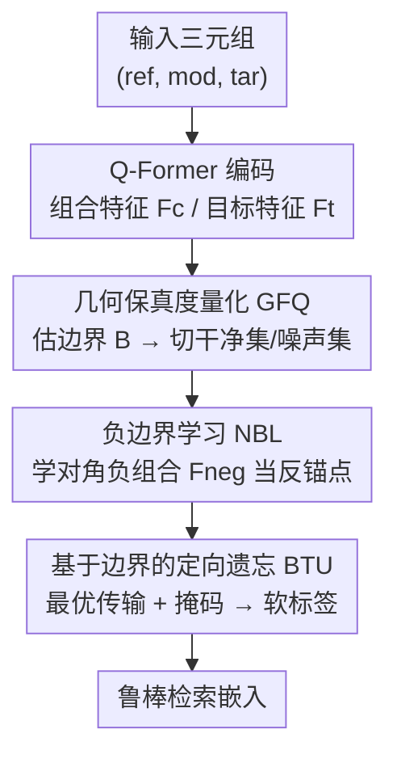

# ConeSep: Cone-based Robust Noise-Unlearning Compositional Network for Composed Image Retrieval

**会议**: CVPR 2026  
**arXiv**: [2604.20358](https://arxiv.org/abs/2604.20358)  
**代码**: https://github.com/Lee-zixu/ConeSep/ (有)  
**领域**: 多模态VLM / 图文检索 / 噪声对应学习  
**关键词**: 组合图像检索, 噪声三元组对应, 机器遗忘, 最优传输, 负锚点

## 一句话总结
针对组合图像检索（CIR）中三元组标注噪声里最棘手的「硬噪声」（参考图与目标图高度相似但修改文本错误），本文提出 ConeSep：先用锥形空间几何边界量化每个样本的匹配保真度做噪声分离，再为每个 query 学一个「对角负组合」作为显式语义反锚点，最后把噪声纠偏建模成最优传输问题做定向遗忘，在 FashionIQ / CIRR 上各噪声率下都超过 TME、HABIT、INTENT 等 SOTA。

## 研究背景与动机

**领域现状**：组合图像检索（CIR）让用户用「参考图 ref + 修改文本 mod」去检索「目标图 tar」，是一种灵活的多模态检索范式，主流做法是用 BLIP-2 的 Q-Former 把 (ref, mod) 融合成组合特征，与目标图特征做对比对齐。

**现有痛点**：CIR 严重依赖高质量 (ref, mod, tar) 三元组标注，但人工标注的主观偏差和 LVLM 生成标注的幻觉，都会让 mod 与 (ref, tar) 语义不一致，产生「噪声三元组对应」（Noisy Triplet Correspondence, NTC）。NTC 比传统的「噪声双对应」（NDC，单纯的图-文/视频-文错配）更复杂：它有复合噪声结构，既有「部分匹配」（mod 只对上 ref 或 tar 之一），又有「硬噪声」（ref/tar 视觉极相似但 mod 是错的）。

**核心矛盾**：现有 NCL 方法（包括 NTC 开山作 TME 和成熟的 NDC 方法）几乎都走「识别-纠正/抑制」范式，靠混合损失或结构相似度这种**粗粒度标量指标**来切分干净/噪声样本。但硬噪声因为 ref 和 tar 视觉太像，组合特征会有很小的 loss 值，从而被误判成干净样本——这直接**打破了「小损失假设」**，让传统方法失效。

**本文目标**：作者把 NTC 在这套范式下暴露的问题拆成三个被忽视的挑战——**C1 模态抑制**（硬噪声里 ref 的稠密视觉特征压过 mod 的稀疏语义信号，使混合 loss 看不出错配）；**C2 负锚缺失**（即便识别出硬噪声，现有框架只做正向对齐，没有结构化的负语义锚点可供「推离」）；**C3 遗忘反噬**（强行把噪声样本推离时，度量空间局部拥挤，会像涟漪一样误伤附近的干净样本）。

**切入角度 / 核心 idea**：作者发现需要一个能「细粒度感知（解 C1）+ 结构化排斥（解 C2）+ 避免反噬（解 C3）」的特征空间，于是借助**锥形空间几何**（干净样本与 NTC 样本相似度分布在二维直方图上呈锥形可分），用三个逻辑递进的模块构成闭环：几何保真度量化 → 负边界学习 → 基于边界的定向遗忘。

## 方法详解

### 整体框架
ConeSep 把「主动感知噪声 → 结构化建模负语义 → 精确遗忘噪声」串成一个闭环系统。输入是一批可能含噪的三元组 (ref, mod, tar)，先用 BLIP-2 的 Q-Former 抽出组合特征 $\mathbf{F}_c$ 和目标特征 $\mathbf{F}_t$；然后三个模块依次工作：**GFQ** 估计一条噪声边界 $\mathbb{B}$ 并据此把 batch 切成高保真干净集 $\mathcal{T}_{clean}$ 和低保真噪声集 $\mathcal{T}_{noisy}$；**NBL** 为每个 query 学一个语义相反的「对角负组合」$\mathbf{F}_{neg}$ 作为推离方向的反锚点；**BTU** 把「干净样本拉向 tar、噪声样本推向 $\mathbf{F}_{neg}$」建模成一个带掩码的最优传输，得到平滑软标签做定向遗忘，最终把这些目标和鲁棒对比损失一起优化，输出鲁棒的检索嵌入。

### 关键设计

**1. 几何保真度量化（GFQ）：用锥形空间边界穿透模态抑制，精准定位硬噪声**

这一步直击 C1：硬噪声的混合 loss 很小，标量指标分不开。GFQ 不依赖单一 loss，而是先**估计一条噪声边界** $\mathbb{B}$——对 ref、tar 各做 $K$ 次高斯采样 $x^G \sim \mathcal{N}(0,1)$、并在 batch 内随机取 mod，把这些「人造随机三元组」过一遍 Q-Former 编码，取它们组合特征与目标特征余弦相似度的均值作为边界 $\mathbb{B}$（式 2）。直觉是：随机拼出来的三元组就是「天然噪声」，它们的相似度均值刻画了「噪声该落在哪」。然后用一个**保真度函数**量化每个真实样本离边界多远：

$$\mathcal{F}(\mathbf{F}_c,\mathbf{F}_t)=(\text{ReLU}(s_{ct}-\mathbb{B}))^2\cdot(\text{ReLU}(s_{ct}-\mathbb{B})-1)$$

其中 $s_{ct}=\cos(\mathbf{F}_c,\mathbf{F}_t)$。$\mathcal{F}$ 越大越像干净样本，再用阈值 $\omega$ 把 batch 切成高保真 $\mathcal{T}_{clean}$ 和低保真 $\mathcal{T}_{noisy}$。相比 TME 那种 GMM 拟合混合 loss 的做法，GFQ 把判别建立在「相对几何边界」而非「绝对 loss 大小」上，硬噪声即使 loss 小，只要落在边界附近也会被识别为低保真，从而逃不过过滤

**2. 负边界学习（NBL）：为每个 query 显式学一个对角负组合当语义反锚点**

这一步解 C2：要做「定向遗忘」必须知道「往哪推」，但现有 CIR 只关注正向对齐，没有负锚点。NBL 用**双路学习**——正向路用受 RCL 启发的鲁棒对比损失 $\mathcal{L}_{robust}$（式 4）保证模型照常学 CIR 范式（把 $\mathbf{F}_c$ 拉近对应 $\mathbf{F}_t$）；负向路引入一组**可学习负提示** $\mathbf{P}_{neg}\in\mathbb{R}^{Q\times D}$，和组合特征同样过 Q-Former 得到「对角负组合」$\mathbf{F}_{neg}$（式 5），代表该 query 在度量空间里的语义反面。$\mathbf{F}_{neg}$ 同时被两个目标约束：**目标导向**用 Sigmoid 风格的反向匹配（二值目标矩阵对角为 1、非对角为 −1，再取反 $-\mathbf{T}_{ij}$），让 $\mathbf{F}_{neg}$ 远离自己的 tar、靠近其他非匹配 tar（式 6）；**query 导向**用松弛边界把 $s(\mathbf{F}_c,\mathbf{F}_{neg})$ 约束进区间 $[\alpha_1,\alpha_2]$（$\alpha_1$/$\alpha_2$ 分别是 batch 内负/正相似度均值），让相似度悬在 0 附近、实现「正交远离」（式 7）。这样每个 query 都有了一个结构化、专属的负锚点，而不是泛泛地「push away」

**3. 基于边界的定向遗忘（BTU）：把噪声纠偏建成带掩码的最优传输，绕开遗忘反噬**

这一步解 C3：直接梯度上升式地推离噪声会在拥挤空间里产生涟漪、误伤干净样本。BTU 把「该把哪些样本搬到哪」建模成一个 $B\times 2B$ 的**最优传输**问题：拼一个联合代价矩阵 $\mathbf{C}=[\mathbf{C}^+|\mathbf{C}^-]$，$\mathbf{C}^+_{ij}=1-s(\mathbf{F}_c^i,\mathbf{F}_t^j)$ 是搬向正目标的代价、$\mathbf{C}^-_{ij}=1-s(\mathbf{F}_c^i,\mathbf{F}_{neg}^j)$ 是搬向负边界的代价（式 9）。关键是一个**掩码 $\mathbf{M}$ 精确切断路径**：低保真噪声样本禁止流向自己的正目标（$j=i$），高保真干净样本禁止流向自己的负边界（$j=i+B$），被切的路径加上无穷大代价 $\infty$ 得到 $\mathbf{C}_{masked}$。在此基础上解熵正则 OT（式 10，用 Sinkhorn-Knopp 迭代）得到全局最优传输方案 $\mathbf{P}^*$，再把它和硬标签 $\mathbf{L}$（噪声行把对角置 0、把 $i{+}B$ 列置 1，即「该忘的位置改指向负边界」）融成**平滑软标签** $\mathbf{Y}=\gamma\mathbf{P}+(1-\gamma)\mathbf{L}$（式 11），最后用 KL 散度构成定向遗忘损失 $\mathcal{L}_{ul}$（式 12）。因为 OT 找的是「全局平滑最优路径」而非局部盲推，遗忘噪声时不会剧烈扰动邻近干净样本，从根上规避了反噬

### 损失函数 / 训练策略
训练分两阶段：前 $N$ 个 warm-up epoch 先用 NBL 的目标 $\mathcal{L}_{rank}+\zeta\mathcal{L}_{intra}+\nu\mathcal{L}_{inter}$（式 8）把负组合 $\mathbf{F}_{neg}$ 立起来；随后用 ConeSep 的最终目标
$$\Psi^*=\arg\min_{\Psi}(\mathcal{L}_{robust}+\kappa\mathcal{L}_{ul}+\zeta\mathcal{L}_{intra})$$
联合优化（式 13）。基座为 BLIP-2，AdamW 优化器，CIRR 学习率 $1e\text{-}5$、FashionIQ $2e\text{-}5$，batch size 128，随机采样数 $K=4$，温度 $\tau=0.07$，保真阈值 $\omega=0.5$，融合系数 $\gamma=0.7$，$\{\zeta,\nu,\kappa\}=0.5$，单张 A40 训 20 epoch。

## 实验关键数据

### 主实验

FashionIQ 验证集（R@K %，AVG 为六项均值）在不同噪声率下与 SOTA 鲁棒方法对比：

| 噪声率 | 方法 | Dress R@10 | Shirt R@10 | Toptee R@10 | Avg R@10 | Avg R@50 | AVG. |
|--------|------|-----------|-----------|------------|---------|---------|------|
| 0% | TME (CVPR'25) | 49.73 | 56.43 | 59.31 | 55.15 | 75.02 | 65.09 |
| 0% | HABIT (AAAI'26) | 49.99 | 56.62 | 59.51 | 55.38 | 75.20 | 65.29 |
| 0% | **ConeSep** | 50.96 | 56.98 | 58.80 | **55.58** | **75.88** | **65.73** |
| 20% | TME | 49.03 | 55.84 | 57.22 | 54.03 | 73.91 | 63.97 |
| 20% | HABIT | 49.63 | 55.67 | 58.14 | 54.48 | 74.28 | 64.38 |
| 20% | **ConeSep** | — | — | — | **54.93** | **75.01** | — |

CIRR 测试集（Avg(R@5, Rsub@1) %）随噪声率上升的优势对比：

| 噪声率 | TME | HABIT | INTENT | **ConeSep** |
|--------|------|-------|--------|-------------|
| 0% | 82.01 | 81.82 | 81.70 | **82.34** |
| 20% | 79.74 | 79.61 | 79.66 | **80.43** |
| 50% | 77.71 | 78.87 | 78.41 | 78.75 |
| 80% | 74.58 | 75.86 | 75.97 | **76.38** |

关键趋势：**噪声率越高，ConeSep 的优势越大**——FashionIQ 上对 HABIT 的 AVG 增益从 20% 噪声的 +0.92% 扩大到 50% 噪声的 +1.54%；CIRR 上即便在 80% 极端噪声仍领先。（注：CIRR 50% 噪声下 ConeSep 的 Avg 78.75 略低于 HABIT 78.87，作者文中以多数设置领先支撑结论，此处属诚实可查的局部差异 ⚠️。）

### 消融实验

FashionIQ / CIRR 在 σ=0.2 下的逐模块消融（节选最具代表性的掉点项）：

| 组 | 变体 | FashionIQ R@10 | CIRR R@K | 说明 |
|----|------|---------------|----------|------|
| — | ConeSep (Full) | 54.93 | 80.66 | 完整模型 |
| GFQ | w/o Fidelity | 53.42 | 79.90 | 去掉保真函数 $\mathcal{F}$，掉 1.51% |
| GFQ | w/o boundary | 53.69 | 80.14 | 保真计算里去掉边界 $\mathbb{B}$ |
| NBL | w/o neg-prompt | 54.77 | 78.94 | 去负提示 $\mathbf{P}_{neg}$，CIRR 掉最狠（1.72%）|
| NBL | w/o neg-tar | 53.62 | 79.74 | 去目标导向学习 |
| BTU | w/o Unlearn | 53.13 | 79.72 | 去定向遗忘损失 $\mathcal{L}_{ul}$ |
| BTU | w/o rank | 52.31 | 79.00 | 去鲁棒对比损失，**全场掉点最多** |

### 关键发现
- **鲁棒对比损失 $\mathcal{L}_{robust}$（w/o rank）掉点最多**（FashionIQ 54.93→52.31），说明它是抑噪和保证检索精度的地基；但去掉它之外的专用纠偏件（OT、$\mathcal{L}_{ul}$、$\mathbf{F}_{neg}$ 引导）也都明显掉点，三者「咬合」共同构成定向遗忘。
- **负提示 $\mathbf{P}_{neg}$（w/o neg-prompt）在 CIRR 上掉得最狠**（80.66→78.94），印证「显式学一个对角负组合当专属负锚点」是稳住鲁棒语义空间的核心。
- **超参 $\omega$ 与 $\kappa$ 都在 0.5 处达到峰值**：$\omega$ 太低会把噪声误划进干净集干扰对齐、太高会把干净样本误划进噪声集被过度遗忘；$\kappa$ 太低硬噪声纠正不足、太高则过度纠正反而触发遗忘反噬——两条曲线都恰好印证了 C3 的「反噬」论点。

## 亮点与洞察
- **把「小损失假设失效」这个根因找准并几何化**：用随机高斯采样三元组估出一条噪声边界 $\mathbb{B}$，把判别从「loss 绝对值」换成「离边界的相对几何位置」，硬噪声再难也藏不住——这个「用人造随机样本定义噪声基准」的思路可迁移到任何小损失假设失效的噪声学习场景。
- **「定向遗忘」需要先有一个可推的方向，本文给了显式负锚点**：可学习负提示 + Sigmoid 反向匹配学出的 $\mathbf{F}_{neg}$，把「往哪忘」从隐式变显式，比梯度上升盲推优雅得多。
- **用最优传输 + 掩码做「外科手术式遗忘」**：OT 求全局平滑路径、掩码精确切断（噪声样本禁流向正目标、干净样本禁流向负边界），把「遗忘反噬」这个 trade-off 转成了一个有约束的全局最优化问题，是把机器遗忘思想引入多模态检索的巧妙落点。
- **闭环三模块逻辑递进**：感知（GFQ）→ 建模负语义（NBL）→ 定向遗忘（BTU），每个模块的输出正好是下个模块的输入（噪声集喂给 BTU、$\mathbf{F}_{neg}$ 当 OT 锚点），结构干净自洽。

## 局限与展望
- **依赖随机采样估边界**：边界 $\mathbb{B}$ 由 $K=4$ 次高斯采样估计，采样数偏小，batch 分布偏移时边界估计的稳定性存疑，论文未给方差分析。
- **超参较多且敏感**：$\omega,\kappa,\gamma,\zeta,\nu$ 加 warm-up epoch 数 $N$ 都需调，$\omega/\kappa$ 又在 0.5 处尖峰，换数据集/噪声分布时调参成本不低。
- **CIRR 50% 噪声下并非全面领先**（Avg 略输 HABIT），说明几何边界对中等噪声率不总是最优，鲁棒性优势更集中在高噪声极端区。
- **只验证了 FashionIQ / CIRR 两个 benchmark**，且都用 BLIP-2 基座；换更轻量基座或开放域大规模检索时方法是否仍 work 未知。
- 改进方向：把边界估计从随机采样换成可学习/自适应的边界网络；把 OT 的掩码策略扩展到处理「部分匹配」这类非硬噪声。

## 相关工作与启发
- **vs TME（CVPR'25，NTC 开山作）**：TME 用 GMM 拟合混合 loss 来分干净/噪声，本质仍是粗粒度标量指标，对硬噪声因小损失假设失效而误判；ConeSep 用锥形几何边界做细粒度保真量化，并新增了负锚点和定向遗忘，全噪声率超过 TME，差距随噪声增大而扩大。
- **vs HABIT / INTENT（AAAI'26）**：都是 NTC 鲁棒方法，但仍聚焦「识别-纠正/抑制」，缺少对「模型已学进去的噪声」的主动遗忘机制；ConeSep 把机器遗忘引入 CIR，能定向「忘掉」已学的硬噪声。
- **vs 传统机器遗忘（Gradient Ascent 类）**：GA 靠局部、无定向的「push away」，正是遗忘反噬的来源；ConeSep 用 OT 找全局平滑最优路径 + 掩码切路，把概率分布从噪声样本平移到负边界，避免剧烈扰动——这是对「如何做无副作用的多模态遗忘」的一个具体答案。

## 评分
- 新颖性: ⭐⭐⭐⭐⭐ 首次把 NTC 的三大被忽视挑战系统拆解，并用锥形几何 + 负锚点 + OT 定向遗忘的闭环组合给出原创解法。
- 实验充分度: ⭐⭐⭐⭐ 两 benchmark × 四档噪声率 + 14 项细粒度消融 + 超参敏感性 + case study，较扎实；但只有两个数据集、单一基座，CIRR 中噪声率有局部不领先。
- 写作质量: ⭐⭐⭐⭐ 三挑战→三模块的对应逻辑清晰，公式完整；个别表述（如 Eq.10 用 $s(\cdot)$ 记 OT 内积）略含糊。
- 价值: ⭐⭐⭐⭐ 把机器遗忘思想引入组合检索的噪声鲁棒学习，方法模块化、可迁移性强，对噪声标注泛滥的多模态检索有实用价值。

<!-- RELATED:START -->

## 相关论文

- [\[CVPR 2026\] Air-Know: Arbiter-Calibrated Knowledge-Internalizing Robust Network for Composed Image Retrieval](air-know_arbiter-calibrated_knowledge-internalizing_robust_network_for_composed_.md)
- [\[CVPR 2026\] ReCALL: Recalibrating Capability Degradation for MLLM-based Composed Image Retrieval](recall_recalibrating_capability_degradation_for_mllm-based_composed_image_retrie.md)
- [\[CVPR 2026\] Self-guided Semantic Inspection for Zero-Shot Composed Image Retrieval](self-guided_semantic_inspection_for_zero-shot_composed_image_retrieval.md)
- [\[CVPR 2026\] STiTch: Semantic Transition and Transportation in Collaboration for Training-Free Zero-Shot Composed Image Retrieval](stitch_semantic_transition_and_transportation_in_collaboration_for_training-free.md)
- [\[ACL 2026\] TEMA: Anchor the Image, Follow the Text for Multi-Modification Composed Image Retrieval](../../ACL2026/multimodal_vlm/tema_anchor_the_image_follow_the_text_for_multi-modification_composed_image_retr.md)

<!-- RELATED:END -->
