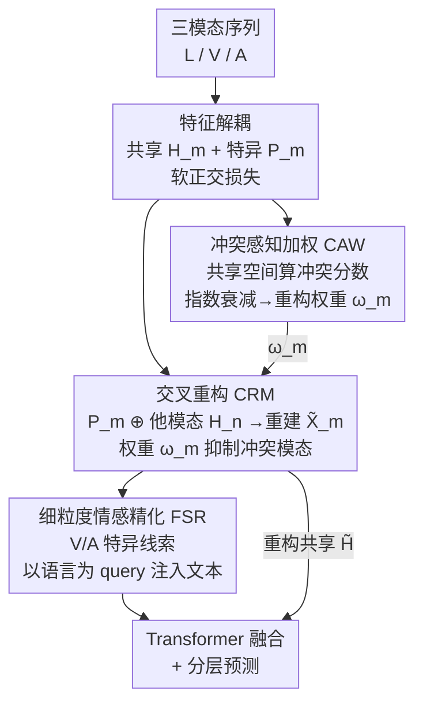

# Conflict-Aware Adaptive Cross-Reconstruction for Multimodal Sentiment Analysis

**会议**: CVPR 2026  
**论文**: [CVF Open Access](https://openaccess.thecvf.com/content/CVPR2026/html/Wang_Conflict-Aware_Adaptive_Cross-Reconstruction_for_Multimodal_Sentiment_Analysis_CVPR_2026_paper.html)  
**代码**: 无（论文未公开仓库）  
**领域**: 多模态VLM  
**关键词**: 多模态情感分析, 解耦表示, 情感冲突, 交叉重构, 自适应加权  

## 一句话总结
针对多模态情感分析中"同一样本里语言/视觉/音频情感极性互相矛盾"这个被忽视的痛点，CACR 先在共享子空间里量化每个模态的情感冲突分数，再用一个**带冲突权重的交叉重构模块**隐式对齐共享语义、压制冲突模态，并用细粒度情感精化补充文本语义，在三个标准数据集上全面超过现有 SOTA。

## 研究背景与动机
**领域现状**：多模态情感分析（MSA）从语言、视觉、音频三路异构序列里预测情感强度。主流的一支是"解耦表示学习"——把每个模态特征拆成**共享子空间**（跨模态一致语义）和**特异子空间**（模态私有信息），以减少冗余，代表方法有 MISA、FDMER、DMD、DLF。

**现有痛点**：这些解耦方法都隐含假设"同一样本的不同模态情感极性是一致的"，于是它们做两件事：(1) 每个模态**只用自己**的共享+特异特征重构自己（intra-modal reconstruction）；(2) 用**相似度损失**把各模态的共享特征硬拉到一起。但现实里同一段视频常出现情感冲突——例如嘴上说着积极的话（语言偏正）、表情和语气却透着失望（视觉/音频偏负）。相似度对齐会把这些矛盾特征强行拉近，导致共享语义被扭曲，最终预测错误。

**核心矛盾**：模型需要在共享子空间学到**一致**的语义表示，但又要**抑制**样本内部互相矛盾的冲突信息——一致性对齐和冲突抑制天然冲突。把所有模态一视同仁地拉齐，等于让最吵的冲突模态污染共享表示。

**本文目标**：(1) 形式化定义"情感冲突"并能逐样本量化；(2) 在不依赖相似度约束的前提下隐式对齐共享表示；(3) 让对齐过程对冲突模态自适应降权。

**切入角度**：作者的关键观察是——既然"自重构 + 相似度拉齐"会被冲突污染，那就改成**交叉重构**：用别的模态的共享特征来重构当前模态。如果共享语义真的一致，交叉重构就该成立；冲突越大、交叉重构越难，正好可以用一个权重把它压下去，从而把"是否对齐"变成一个由冲突分数自适应调节的软约束。

**核心 idea**：用"冲突感知加权的交叉重构"代替"自重构 + 相似度损失"，让共享表示隐式对齐的同时，自动给冲突模态降权。

## 方法详解

### 整体框架
CACR 的输入是一个样本的三模态序列（语言 L、视觉 V、音频 A），输出是情感强度预测。整条流水线分五步：先把每个模态解耦成共享/特异特征；再在共享子空间算出每个模态的**情感冲突分数**并映射成交叉重构的损失权重；然后用**交叉重构模块**让每个模态由"自己的特异特征 + 别人的共享特征"重建出来，在加权下隐式对齐共享语义、压制冲突模态；接着用**细粒度情感精化**把视觉/音频特异特征里的情感线索注入语言分支；最后融合（重构得到的）共享表示与精化后的特异表示做分层预测。

### 关键设计

**1. 冲突感知加权策略 CAW：在共享空间里把"情感冲突"量化成可优化的权重**

这是全文的核心，针对的痛点是"现有方法把模态异质性当成一致、无视样本内冲突"。作者先给出形式化定义：在共享子空间内，同一样本的不同模态表达了**矛盾的情感语义**，才算冲突——刻意选共享空间而非原始/特异空间，是为了不把天然的模态异质性误判成冲突。具体地，对目标模态 $m$，把其共享特征 $H_m^{(i)}$ 时序池化成全局向量 $h_m^{(i)}$，与互补集 $S_m = M \setminus \{m\}$ 中每个模态 $n$ 算余弦相似度并取距离 $d_{m,n}^{(i)} = 1 - \cos(h_m^{(i)}, h_n^{(i)})$，再对所有互补模态求平均得到样本级冲突分数 $C_m^{(i)} = \frac{1}{|S_m|}\sum_n d_{m,n}^{(i)}$。

然后用指数衰减把冲突分数映射成交叉重构损失权重：

$$\hat{\omega}_m^{(i)} = \exp\!\left(\frac{-C_m^{(i)}}{\tau}\right), \qquad \omega_m^{(i)} = \max\{\hat{\omega}_m^{(i)},\, \omega_{min}\}$$

其中 $\tau>0$ 控制衰减速率、$\omega_{min}$ 是权重下界（防止冲突模态被完全抹掉）。直觉很清楚：冲突小（$C_m \to 0$）时 $\omega_m \to 1$，保留完整的重构约束、鼓励对齐；冲突大时 $\omega_m$ 指数级衰减，让冲突模态对损失的贡献变小，从而显式压制它的负面影响。这比直接上一个通用的 gating 机制更有针对性——消融里证明效果确实来自"显式建模样本级冲突"而非泛泛的自适应加权。

**2. 自适应加权交叉重构模块 CRM：不靠相似度损失，用"互相重建"隐式对齐共享语义**

针对痛点"自重构 + 相似度对齐会扭曲冲突样本的共享语义"。对每个目标模态 $m$，CRM 把它自己的特异特征 $P_m$ 与其他模态 $n$ 的**共享特征** $H_n$ 拼接，过一个 1D 卷积解码器 $D_{nm}$ 生成跨模态交互特征 $\tilde{X}_{nm} = D_{nm}([H_n \oplus P_m])$，再线性融合成目标模态的重构 $\tilde{X}_m = F(\tilde{X}_{nm})$。核心在于损失：逐样本重构误差 $\ell_m^{(i)} = \lVert \tilde{X}_m^{(i)} - X_m^{(i)} \rVert_2$，但用设计 1 的权重做归一化加权：

$$\mathcal{L}_m = \frac{\sum_{i=1}^N \omega_m^{(i)}\,\ell_m^{(i)}}{\sum_{i=1}^N \omega_m^{(i)}}, \qquad \mathcal{L}_{recon} = \sum_m \mathcal{L}_m$$

因为目标模态是用"别人的共享特征"重建的，只有当各模态共享语义真正一致时重构才成立——这就把"共享对齐"从一个外加的相似度约束，变成了重构目标自带的隐式约束；而 $\omega_m$ 让高冲突样本的这条约束自动松绑，避免硬拉齐。重构后再对 $\tilde{X}_m$ 跑一遍同样的解耦得到 $\tilde{H}_m, \tilde{P}_m$，把三模态重构共享特征拼成 $\tilde{H} = [\tilde{H}_L; \tilde{H}_V; \tilde{H}_A]$ 供后续使用。为防止特异特征在重构中漂移，额外加一个特异损失 $\mathcal{L}_p = \sum_m \lVert \tilde{P}_m - P_m \rVert^2$。

**3. 细粒度情感精化 FSR：让语言主导，把视觉/音频的细粒度情感线索补回文本**

针对"语言通常主导情感语义、但视觉/音频藏着转瞬即逝的细粒度线索（如一闪而过的皱眉）容易被丢"的问题。不同于 DLF 那种相互交叉注意力，FSR 把语言当成**单向的 query**：先从 $P_V, P_A$ 抽出细粒度特征 $P'_V, P'_A$，再用语言特异特征 $P_L$ 作 query，通过文本引导的增强层有选择地聚合视觉/音频里的相关情感线索，融合回 $P_L$ 得到增强后的 $P'_L$。这样既保持语言的主导地位，又用辅助模态补足了文本说不清的细微情感。

**4. 分层融合与预测：共享 + 特异双分支联合优化**

精化后的 $P'_L, P'_V, P'_A$ 过一个多模态 Transformer（自注意力 + 交叉注意力）建模模内/模间依赖，得到增强特异特征 $TP'_m$；重构共享特征 $\tilde{H}_m$ 过自注意力 Transformer 得到 $T\tilde{H}$；二者拼接成最终表示 $M = \mathrm{Cat}(TP'_L, TP'_V, TP'_A, T\tilde{H})$。沿用 DLF 的分层预测，在共享和特异两条分支都加辅助分类器，但关键区别是：本文的共享特征来自**交叉重构估计**而非初始解耦特征，跨模态一致性更强。预测损失用 L1：$\mathcal{L}_f = \frac{1}{N}\sum_i |\hat{y}_i - y_i|$。

### 损失函数 / 训练策略
MSA 主损失把融合预测、共享分支、特异分支三处加权相加：

$$\mathcal{L}_{MSA} = \alpha \mathcal{L}_f + \beta \mathcal{L}_{T\tilde{H}} + \sum_{m \in \mathcal{M}} \mathcal{L}_{TP'_m}$$

总目标再叠加交叉重构损失、软正交损失、特异损失：

$$\mathcal{L}_{total} = \mathcal{L}_{MSA} + \mathcal{L}_{recon} + \mathcal{L}_o + \mathcal{L}_p$$

其中软正交损失 $\mathcal{L}_o = \sum_m |\cos(H_m, P_m)|$ 让共享与特异子空间尽量正交、减少冗余；$\alpha, \beta, \tau, \omega_{min}$ 的敏感性在论文 4.5 节分析。

## 实验关键数据

### 主实验
在 CMU-MOSI、CMU-MOSEI、CH-SIMS 三个标准数据集上对比，结果为 5 次运行平均。CACR 在所有报告指标上全面领先。

| 数据集 | 指标 | CACR | 之前最好 | 提升 |
|--------|------|------|----------|------|
| MOSI | ACC7 ↑ | **48.69** | 47.80 (EMOE) | +0.89 |
| MOSI | ACC2 ↑ | **87.04** | 85.67 (DLF) | +1.37 |
| MOSI | MAE ↓ | **0.710** | 0.710 (EMOE) | 持平 |
| MOSEI | ACC7 ↑ | **54.41** | 54.10 (EMOE) | +0.31 |
| MOSEI | ACC2 ↑ | **85.37** | 85.30 (EMOE) | +0.07 |
| CH-SIMS | ACC2 ↑ | **81.62** | 78.56 (MulT/DLF) | +3.06 |
| CH-SIMS | F1 ↑ | **80.99** | 79.66 (MulT) | +1.33 |

CH-SIMS 上提升最明显（ACC2 +3 个点）。相比同为解耦范式的 MISA/FDMER/DMD/DLF，CACR 用 CRM 隐式对齐 + CAW 抑制冲突，缓解了相似度约束带来的语义歧义。混淆矩阵分析显示，DLF 在 -2、2 这两类上混淆严重，而 CACR 在这些类别上正确分类更多、相邻情感强度边界更清晰。

### 消融实验
在 MOSI 上逐项消融核心组件和损失项：

| 配置 | ACC7 ↑ | ACC2 ↑ | MAE ↓ | 说明 |
|------|--------|--------|-------|------|
| **CACR (完整)** | **48.69** | **87.04** | **0.710** | — |
| w/o CRM | 40.23 | 84.15 | 0.791 | 去掉交叉重构，ACC7 暴跌 8.5 个点 |
| w/o CAW | 44.31 | 83.84 | 0.752 | 权重固定为 1，掉 4.4 点 |
| gating | 44.98 | 84.91 | 0.747 | 换成通用自适应加权仍掉 3.7 点 |
| w/o FSR | 46.79 | 86.43 | 0.751 | 去掉细粒度精化，掉 1.9 点 |
| w/o $\mathcal{L}_o$ | 40.96 | 85.06 | 0.779 | 去正交损失，解耦失效，ACC7 掉 7.7 点 |
| w/o $\mathcal{L}_p$ | 42.53 | 84.76 | 0.788 | 去特异损失，特异特征漂移，掉 6.2 点 |

### 关键发现
- **CRM 是地基**：去掉交叉重构模块 ACC7 从 48.69 直接掉到 40.23，证明跨模态语义对齐是整个模型的基础。
- **CAW 的增益来自"显式建模冲突"而非泛化加权**：把 CAW 换成通用 gating（44.98）仍明显差于完整模型（48.69），说明逐样本量化冲突并降权才是关键，不是随便上个自适应权重就行。
- **正交损失意外地重要**：去掉 $\mathcal{L}_o$ 后 ACC7 掉 7.7 点，比去掉 FSR 还狠——共享/特异子空间一旦不正交，解耦就崩，下游全受影响。
- **兼容性强**：换上更强的编码器（DeBERTa-large + MA-Net + wav2vec-large，记为 CACR-S）后性能进一步提升（MOSEI ACC2 85.37→86.21），说明方法作用在特征层、不依赖具体 backbone。

## 亮点与洞察
- **把"对齐"改写成"重构"是核心巧思**：传统做法用相似度损失外加一个对齐约束，本文让目标模态由别的模态的共享特征重建——重构能成立本身就意味着共享语义一致，对齐从外挂约束变成了内生目标，还顺手避开了相似度硬拉齐的副作用。
- **冲突分数 → 指数衰减权重的设计干净可迁移**：用"共享空间余弦距离的平均"定义样本级冲突、再用 $\exp(-C/\tau)$ 配 $\omega_{min}$ 下界映射成损失权重，这套"先量化矛盾、再用权重软性降权"的范式可以迁移到任何"样本内部子信号互相矛盾"的多源学习场景（如多视角学习、传感器融合）。
- **FSR 的单向 query 设计有判断**：没有盲目上双向交叉注意力，而是认定语言主导、让文本去"取"视觉/音频的细粒度线索，既省算力又符合情感表达的实际分工。

## 局限与展望
- **冲突定义依赖共享子空间的几何**：冲突分数完全建立在"共享特征余弦相似度"上，若解耦本身没学好（正交损失消融已显示其脆弱），冲突度量就不可靠，存在一定的"鸡生蛋"耦合。
- **语言主导是强先验**：FSR 把语言钉死为 query、视觉/音频只做补充，对于语言信息缺失或反讽（文字与真实情感相反）的样本，这个先验可能反而有害。⚠️ 论文未针对反讽场景单独评测。
- **只在三个经典 benchmark 上验证**：MOSI/MOSEI/CH-SIMS 都是较短的视频片段，长视频、实时流式或更多模态（如生理信号）下的表现未知。
- **改进思路**：可把冲突建模从样本级细化到 token/时序级，定位"哪一段在冲突"；或让 query 模态本身也由数据自适应选择，而非固定为语言。

## 相关工作与启发
- **vs DLF**：DLF 同为解耦 + 分层预测，但它把视觉/音频信息单向迁移进语言、并用相似度对齐共享特征；CACR 指出相似度对齐会扭曲冲突样本，改用加权交叉重构隐式对齐，且共享特征取自重构估计而非初始解耦特征，跨模态一致性更强（CH-SIMS 上 ACC2 78.56→81.62）。
- **vs MISA / FDMER / DMD**：这些都假设模态间情感一致、各自做 intra-modal 重构；CACR 的根本区别是**正面承认并量化样本内情感冲突**，并用自适应权重压制冲突模态，而非一视同仁地拉齐。
- **vs Self-MM / TFN / ALMT 等融合派**：融合派重点在"怎么把多模态信息整合得更好"，对模态内部矛盾不敏感；CACR 站在表示学习一侧，先把冲突处理干净再融合，与融合机制正交、可组合。

## 评分
- 新颖性: ⭐⭐⭐⭐ 把"样本内情感冲突"显式形式化并用加权交叉重构替代相似度对齐，角度新且自洽
- 实验充分度: ⭐⭐⭐⭐ 三数据集 + 细致消融 + 兼容性/混淆矩阵/案例分析，证据链完整，但仅限经典短视频 benchmark
- 写作质量: ⭐⭐⭐⭐ 动机—定义—机制层层递进，公式与图配合清楚
- 价值: ⭐⭐⭐⭐ "量化矛盾再软性降权"的范式对多源/多模态学习有较好的可迁移性

<!-- RELATED:START -->

## 相关论文

- [\[CVPR 2026\] CICA: Coupling Confidence-Aware Pretraining with Confidence-Informed Attention for Robust Multimodal Sentiment Analysis](cica_coupling_confidence-aware_pretraining_with_confidence-informed_attention_fo.md)
- [\[CVPR 2026\] Factorize, Reconstruct, Enhance: A Unified Framework for Multimodal Sentiment Analysis](factorize_reconstruct_enhance_a_unified_framework_for_multimodal_sentiment_analy.md)
- [\[CVPR 2026\] Prototype-as-Prompt: Multimodal Sentiment Prototypes Endowing Large Language Models the Capability to Perform Multimodal Sentiment Analysis](prototype-as-prompt_multimodal_sentiment_prototypes_endowing_large_language_mode.md)
- [\[CVPR 2026\] Enhance-then-Balance Modality Collaboration for Robust Multimodal Sentiment Analysis](enhance-then-balance_modality_collaboration_for_robust_multimodal_sentiment_anal.md)
- [\[CVPR 2026\] EBMC: Enhance-then-Balance Modality Collaboration for Robust Multimodal Sentiment Analysis](ebmc_multimodal_sentiment_analysis.md)

<!-- RELATED:END -->
