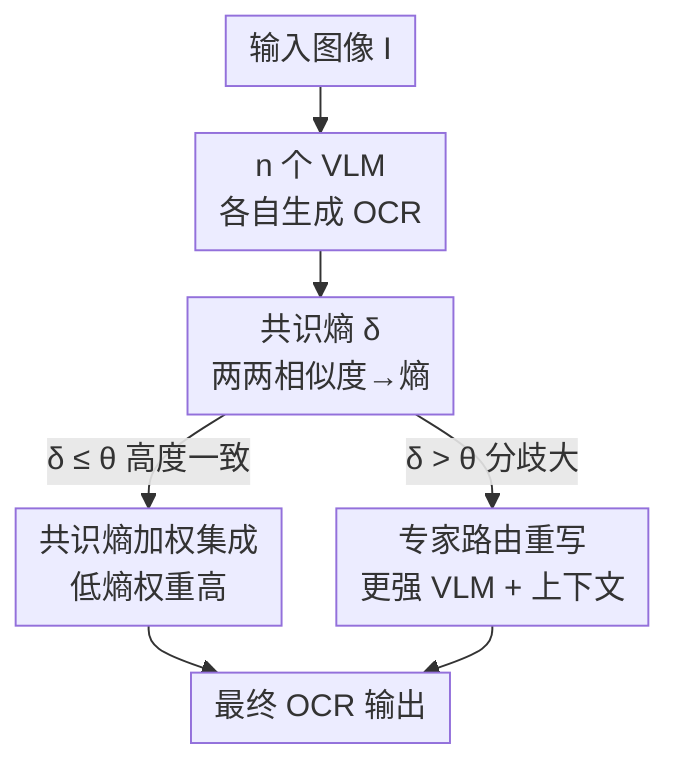

# Consensus Entropy: Harnessing Multi-VLM Agreement for Self-Verifying and Self-Improving OCR

**会议**: CVPR 2026  
**论文**: [CVF Open Access](https://openaccess.thecvf.com/content/CVPR2026/html/Zhang_Consensus_Entropy_Harnessing_Multi-VLM_Agreement_for_Self-Verifying_and_Self-Improving_OCR_CVPR_2026_paper.html)  
**代码**: https://github.com/Aslanyulong/consensus-entropy  
**领域**: 多模态VLM  
**关键词**: OCR质量验证, 多模型共识, 熵, 无监督, 自适应路由

## 一句话总结
本文提出 Consensus Entropy（CE）——一个免训练、模型无关的指标，用"多个 VLM 对同一张图的 OCR 结果是否收敛"来无监督地判断输出可靠性，并基于它搭出 CE-OCR 框架（共识熵加权集成 + 熵阈值路由到更强模型重写），在 OCRBench 等数据集上把质量验证 F1 比 VLM-as-Judge 提升 42.1%、OCR 准确率提升 8.2% 且只路由 7.3% 样本。

## 研究背景与动机
**领域现状**：OCR 已经从专用算法变成 VLM 的核心能力，OCR 准确率成了衡量多模态模型视觉-语言理解力的关键指标，OCR 抽出来的文本也是喂给 LLM 训练的重要数据源。但评测方式还停留在跑标准 benchmark 的平均分上。

**现有痛点**：平均分高不代表单样本可靠。作者实测发现，连 Qwen2.5-VL-72B、GPT-4o 这种顶级模型也频繁出现语义错误和格式不一致，而这些错误恰恰被传统指标漏掉——甚至 benchmark 排名更高的模型在实际场景里反而更差。现有补救手段有两类，都不灵：跨模型重评（multimodal re-evaluation）受评测模型自身不确定性拖累、引入二次噪声；VLM-as-Judge 只看文本质量，根本没法验证"视觉输入和文本输出到底对不对得上"。

**核心矛盾**：OCR 缺高质量标注、人工标注又贵，于是"判断一条 OCR 输出对不对"长期没有可靠的无监督手段；而既然连 SOTA 模型都做不到零错误，单靠某一个模型自评必然带偏。

**本文目标**：在没有人工监督、不重新训练的前提下，让模型自己**验证**（哪条对哪条错）并**改进**（把错的修对）OCR 结果。

**切入角度**：作者在 OCRBench 上观察了 210 个 VLM，发现三个朴素但有用的规律——(1) OCR 任务通常有唯一的语义真值（格式可变）；(2) 模型答对时，多个模型的输出在语义空间里紧紧聚成一簇；(3) 答错时，输出四散、熵很高。"对则收敛、错则发散"这个跨模型行为，正好是一个不需要标签的可靠性信号。

**核心 idea**：用"多个独立 VLM 输出之间的两两相似度分布的熵"来度量共识程度（即 Consensus Entropy），低熵=高度一致=大概率正确，高熵=分歧=可能出错；再让这个熵同时驱动集成加权和路由决策。

## 方法详解

### 整体框架
CE-OCR 是一条无训练的"生成→评估→决策"流水线。给定一张图，先让 $n$ 个独立 VLM 各自跑出 OCR 结果；然后两两比对这些结果、把相似度转成概率分布并算出一个标量共识熵 $\delta$；最后用一个阈值门 $\theta$ 决定怎么处理：$\delta\le\theta$（大家基本一致）就直接用共识熵加权的集成输出，$\delta>\theta$（分歧大、可能出错）就把图 + 各模型输出 + 集成结果一起喂给一个更强的 VLM 让它重写。整个过程不需要任何标签或参数微调，纯推理。

### 关键设计

**1. 共识熵 CE：用"输出两两相似度的熵"无监督地度量对错**

针对的痛点是"没有标签时无法判断单条 OCR 对不对"。做法是把质量评估从"有监督打分"转成"无监督一致性分析"。对一张图收集 $n$ 个模型输出 $\{O_1,\dots,O_n\}$，先算两两相似度——任务相关地选度量：字符级精度任务（标准 OCR、数学公式）用编辑距离，语义任务用文本编码器 embedding 的余弦相似度。字符级时在每个位置 $k$ 算归一化相似度

$$s_{ij}(k) = 1 - \frac{\text{EditDist}(o_i^k, o_j^k)}{\max(|o_i^k|, |o_j^k|)}$$

再归一化成概率 $p_{ij}(k) = s_{ij}(k)/\sum_{j'} s_{ij'}(k)$，然后对每一对输出算两两熵

$$E_{ij} = -\sum_k p_{ij}(k)\log p_{ij}(k)$$

关键在于：用熵（分布层面的不确定性）而不是单个余弦标量来刻画两条输出的差异。论文给了个直观例子——三个 VLM 把发票号读成 "Invoice"、"1nvoice"、"Invoice"，相对第一条的相似度是 $(1.0, 0.86, 1.0)$，归一化得 $p=(0.35,0.30,0.35)$、熵 $H=1.09$（接近均匀=有分歧）；若三条完全一致则 $H=0$（完美共识）。每条输出再对其余所有输出求平均熵距离 $E_i = \frac{1}{n-1}\sum_{j\ne i} E_{ij}$，衡量它和集体共识的偏离程度。最终把所有输出的分布建模到一起得到标量 $\delta$：语义任务用 KDE 在输出空间做核密度估计、每条输出的权重与其 $E_i$ 成反比（共识高的权重大），把空间离散成 $N\times N$ 网格后 $\delta = -\sum_{i=1}^{N^2} p_i\log p_i$；编辑距离任务则直接从两两距离分布算熵。作者比较了 Sum/Max/Mean/Mean-Distance 四种聚合，发现 **Mean Distance**（直接平均 $E$ 值）既"网格无关"（CE 在不同分辨率 $N$ 下稳定）又"序保持"（共识越高 CE 越低），最稳，作为默认。

**2. CE-Ensemble：用共识熵的倒数当权重做 token 级集成**

针对的痛点是"普通平均/投票会被离群的错误输出拉偏"。CE-Ensemble 直接复用上面的熵框架当权重——共识熵距离 $E_i$ 越低（越贴近共识）权重越高：

$$w_i = \frac{1/E_i}{\sum_{j=1}^{n} 1/E_j}$$

文本不能直接加权平均，所以先用动态规划把所有输出对齐、找出各位置对应的 token，再在每个位置 $k$ 选"加权共识最高"的 token：$t^*_k = \arg\max_{t\in T_k}\sum_{i:\,t\in O_i} w_i$，即把所有在该位置输出了 token $t$ 的模型权重加起来取最大。这样离群点被自动降权、可靠模型主导结果，比简单多数投票更抗噪。

**3. 阈值门路由 + 专家重写：只对真正难的样本花更强算力**

针对的痛点是"全部样本都喂大模型太贵、全部用小集成又救不了硬样本"。引入阈值门 $\theta$ 做二值路由：

$$R(\delta,\theta) = \begin{cases} 0, & \delta \le \theta \\ 1, & \delta > \theta \end{cases}$$

$R=0$ 直接用 CE-Ensemble 输出；$R=1$（共识熵超阈值，说明模型们分歧大、八成有错）才路由到更强的 VLM $M_\text{exp}$ 重写，且把原图、各模型输出、集成结果一起作为上下文喂进去：$O_\text{final} = M_\text{exp}(I, \{O_1,\dots,O_n\}, O_\text{ens})$。$\theta$ 是质量-效率的旋钮——调低就更多样本送去重写（更准但更贵），调高就更多直接接受集成（更省）；作者在开发集上标定，发现 $\theta\approx0.5$ 对多数 OCR 任务最优，实测只需把 7.3% 的样本送去重写就能拿到主要增益。

## 实验关键数据

### 主实验

无监督质量验证（人工标注的 1000 页 PDF，单参考模型、无集成，F1）：CE 在大多数难度区间都显著优于 VLM-as-Judge，整体平均 F1 提升 15.2、即 +42.1%。

| 参考模型 | VLM-as-Judge F1 | CE (本文) F1 | 提升 |
|----------|-----------------|--------------|------|
| GPT-4o | 40.0 | 48.0 | +20.0% |
| Qwen2-VL-7B | 36.1 | 51.3 | +42.1% |
| Qwen2-VL-72B | 39.8 | 51.0 | +28.1% |

CE-OCR 自我改进（OCRBench-V2 分项，阈值 0.5）：相比基础集成在英文 OCR / 数学 / 中文整体都有 +5~6.5% 相对提升，数学场景尤其突出。

| 方法 | En | Math | Elem | Cn All |
|------|----|----|----|----|
| GPT-4o | 61.2 | 43.4 | 29.8 | 32.2 |
| InternVL2.5-26B | 65.6 | 37.4 | 32.6 | 44.2 |
| Gemini Pro | 61.2 | 47.7 | 30.9 | 43.1 |
| CE-Ensemble | 67.2 | 50.1 | 34.0 | 45.7 |
| CE-OCR (GPT-4o 重写) | **71.6** | **53.1** | 33.8 | **48.0** |
| 相对最优单模型 | +9.1% | +11.3% | +3.7% | +8.6% |

CE-Ensemble 还能让一堆小模型组合超过 SOTA 单模型：例如 Ovis2-1B(890)+Qwen2.5VL-7B(874)+Step1V(886)+Step1o(926) 集成出 **955**（+29，超过 SOTA 单模型 926）；纯开源 <10B 模型组合（InternVL2.5-8B+Qwen2VL-7B+Qwen2.5VL-7B）也能从最高 874 提到 897。

### 消融实验

OCRBench 上逐组件移除（满分 1000，Rel. Perf. 相对完整框架）：

| 配置 | Score↑ | % 路由 | 相对完整 |
|------|--------|--------|----------|
| w/o CE（单模型取最大） | 888 | 0% | 97.9% |
| w/o 集成（单模型平均） | 852 | 0% | 93.9% |
| w/o 路由（全部集成） | 902 | 0% | 99.4% |
| 完整 CE-OCR | **907** | 7.3% | 100% |

和经典集成方法对比（同 3-VLM，平均 ∆）：ROVER 的离散词级投票在开放式 VLM 输出上灾难性失败（Doc-VQA −42.1%、Math-VQA −92.0%，因为 VLM 输出措辞多样、无法对齐）；VL-Uncertainty 用语义聚类，在结构化 OCR 上 +3.3% 但在语义 VQA 上掉点（字符级差异对语义 embedding 不可见）。CE-Ensemble 四类任务全涨、平均 +8.2%。

| 方法 | OCR | Doc-VQA | Math | KR | Avg ∆ |
|------|----|----|----|----|----|
| Best Single | 61.2 | 87.5 | 40.0 | 60.3 | 0% |
| VL-Uncertainty | 64.5 | 78.7 | 45.1 | 58.2 | +0.2% |
| ROVER | 57.5 | 50.7 | 3.2 | 50.4 | −33.8% |
| CE-Ensemble | **67.2** | **90.5** | **45.6** | **66.3** | **+8.2%** |

### 关键发现
- **集成是骨架，路由是性价比之王**：去掉集成掉得最狠（−7.2%，掉到 852），说明多模型多样性是 CE 计算和稳健性的基础；而去掉路由只损失 0.6%（902 vs 907）——也就是仅用 7.3% 的额外重写就把"全集成"补到满分，几乎不加算力就拿到收益。
- **集成规模越大、下界越稳**：3→5 模型时，集成超过"组内最差单模型"的比例恒为 100%（CE 永远避开最差），超过"最优单模型"的比例从 66.2% 升到 91.1%——CE 越来越能选到接近最优的输出。
- **阈值 θ 是连续旋钮**：OCRBench-V2 上 GPT-4o 在 θ=0.95 时 +3.8%/重写 15%，θ=0.2 时 +8.8%/重写 91.2%，准确率与算力可平滑权衡。
- **同架构也有效**：即便用同系列甚至同一模型采样（T=0.7 跑 3 次）也能涨（Identical +2.1%、QwenVL +1.83%），多样性增强 CE 但非必要条件。
- **可迁出 OCR**：换用编辑距离/余弦距离后，CE 在 Math-VQA(+14.0%)、Knowledge-Reasoning(+10.0%)、Formula(+7.3%) 等非 OCR VQA 上同样涨点。

## 亮点与洞察
- **把"对则收敛、错则发散"做成可计算的标量**：核心洞察很朴素（210 个模型的行为观察），但用两两相似度的熵把它量化成一个免训练、模型无关、即插即用的可靠性信号，非常优雅——不需要看模型内部参数，黑盒/闭源 API 也能用。
- **同一个熵同时驱动三件事**：验证（CE 当过滤器）、集成（$1/E_i$ 当权重）、路由（$\delta$ 比阈值），一个量贯穿"评估-聚合-决策"全链路，设计高度自洽。
- **"用熵分布而非单标量"是关键技术点**：作者特意强调不用单个余弦标量、而用整个相似度分布的熵，能捕获输出间的分布级不确定性——这个思路可迁移到任何"多候选生成需要无监督选优"的场景（代码生成、翻译、结构化抽取）。
- **Mean Distance 聚合的"网格无关 + 序保持"**：两条性质保证了 CE 值在不同离散分辨率下稳定可比，是能落地部署的关键工程考量。

## 局限与展望
- **依赖多模型多样性**：消融显示去掉集成掉点最多，CE 本质需要"多个相对独立的输出"才能算共识；只有单一模型且无法多样采样时，信号会变弱（同模型采样虽可用但增益较小）。
- **路由上界受限于专家模型**：高熵样本的最终质量取决于 $M_\text{exp}$（如 GPT-4o）的能力，若专家模型本身也读错，框架无法纠正——CE 只负责"识别可疑"，不保证"修对"。
- ⚠️ **阈值 $\theta\approx0.5$ 需按任务标定**：论文称在开发集上标定，跨数据集/语言的最优 $\theta$ 可能漂移，部署前要重新校准（Table 7 也显示不同模型的 θ-性能曲线不同）。
- **共识熵高 ≠ 一定错**：当多模型恰好"一致地错"（共同 bias、训练数据污染）时，低 CE 会给出虚假的高可信度，这是所有共识类方法的固有盲区，论文未深入讨论。
- **改进思路**：可引入轻量的"独立性度量"给同源模型降权，或在路由时结合外部知识/工具校验来突破专家模型上界。

## 相关工作与启发
- **vs VLM-as-Judge**：后者让一个 LLM 直接给文本质量打分，受 prompt 敏感、训练数据污染、格式偏好、偏好泄漏（生成模型与评测模型相关性虚高分）等系统性问题困扰，且无法验证视觉-文本一致性；CE 不依赖任何"裁判模型"，靠多模型输出空间的一致性间接判断，F1 高出 42.1%。
- **vs VL-Uncertainty**：它在 LLM embedding 上做语义聚类测幻觉，对 OCR 至关重要的字符级差异"不可见"，在语义 VQA 上甚至掉点；CE 可按任务切换编辑距离/余弦，字符级和语义级都覆盖。
- **vs ROVER（经典 ASR 集成）**：离散词级投票适合封闭词表的语音识别，但 VLM 输出措辞自由、无法对齐，导致灾难性失败（Math-VQA −92%）；CE 在连续相似度/熵空间操作，对开放式生成稳健。
- **vs Self-Consistency**：SC 对同一模型同一 prompt 多次采样后投票（同源、贵），CE-OCR 则跨模型按共识动态选策略，Table 5 显示路由平均 +6.5%、最佳 +8.2%，而 SC@3 平均反而 −2.8%。

## 评分
- 新颖性: ⭐⭐⭐⭐⭐ "对则收敛错则发散"的观察 + 把它做成贯穿验证/集成/路由的统一熵指标，简单而有洞察
- 实验充分度: ⭐⭐⭐⭐⭐ 210 模型 + 55154 种集成组合 + 多 benchmark + 充分消融与阈值敏感性，还做了 OCR 外迁移
- 写作质量: ⭐⭐⭐⭐ 动机清晰、公式与例子配合好，部分细节（KDE 离散化、θ 标定）压在附录略简
- 价值: ⭐⭐⭐⭐⭐ 免训练即插即用、黑盒可用，直接解决 OCR 无监督质量控制这一真实痛点，对 LLM 训练数据清洗有现实意义

<!-- RELATED:START -->

## 相关论文

- [\[ACL 2025\] Improving MLLM's Document Image Machine Translation via Synchronously Self-reviewing Its OCR Proficiency](../../ACL2025/multimodal_vlm/improving_mllms_document_image_machine_translation_via_synchronously_self-review.md)
- [\[ICLR 2026\] Vision-Zero: Scalable VLM Self-Improvement via Strategic Gamified Self-Play](../../ICLR2026/multimodal_vlm/vision-zero_scalable_vlm_self-improvement_via_strategic_gamified_self-play.md)
- [\[ICLR 2026\] Self-Aug: Query and Entropy Adaptive Decoding for Large Vision-Language Models](../../ICLR2026/multimodal_vlm/self-aug_query_and_entropy_adaptive_decoding_for_large_vision-language_models.md)
- [\[ICLR 2026\] Let's Think in Two Steps: Mitigating Agreement Bias in MLLMs with Self-Grounded Verification](../../ICLR2026/multimodal_vlm/lets_think_in_two_steps_mitigating_agreement_bias_in_mllms_with_self-grounded_ve.md)
- [\[CVPR 2026\] VisPlay: Self-Evolving Vision-Language Models](visplay_self-evolving_vision-language_models.md)

<!-- RELATED:END -->
