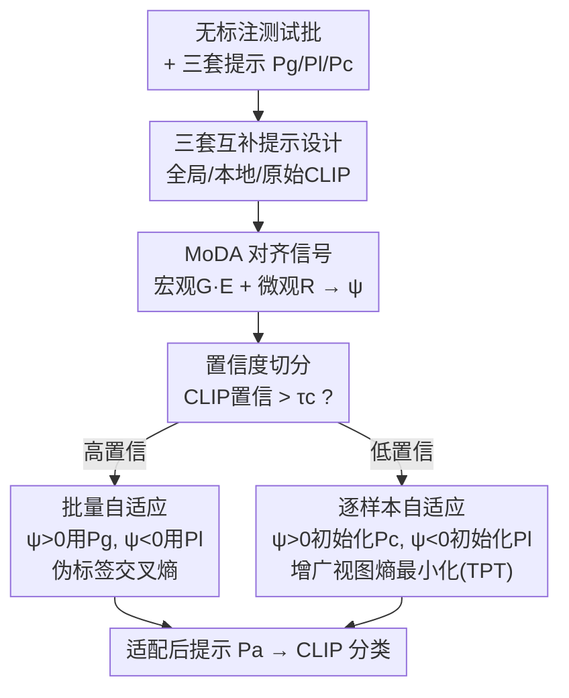

# Controllable Federated Prompt Learning at Test Time

**会议**: CVPR 2026  
**论文**: [CVF Open Access](https://openaccess.thecvf.com/content/CVPR2026/html/Zhu_Controllable_Federated_Prompt_Learning_at_Test_Time_CVPR_2026_paper.html)  
**代码**: 无（论文未公开）  
**领域**: 多模态VLM  
**关键词**: 联邦提示学习, 测试时自适应, CLIP, 分布偏移, 模型-数据对齐  

## 一句话总结
针对联邦提示学习模型部署后遇到新域分布偏移就崩的问题，本文首次提出测试时联邦提示学习（TTFPL）设定，并用 COTE 框架在「全局 / 本地 / 原始 CLIP」三套提示之间，靠一个自定义的模型-数据对齐分数 MoDA 在线无标注地动态择优，在五个基准的跨域设置上把平均精度提了 6%+。

## 研究背景与动机
**领域现状**：联邦提示学习（Federated Prompt Learning, FPL）把 CLIP 这类视觉-语言大模型搬进联邦学习——客户端不交换模型权重，只协作优化一小撮可学习的提示 token（prompt），既省通信又保隐私。为了照顾各客户端数据分布的差异，又衍生出个性化联邦提示学习（PFPL），在部署前用本地训练数据把提示微调到贴合本地分布。

**现有痛点**：PFPL 的个性化提示是在「历史训练数据」上调出来的，一旦部署到现实场景，光照、背景、视角变化让测试数据分布漂移，个性化提示反而严重退化。论文实验里这点触目惊心：`PromptFL + FT` 在本地原始测试集上 95.68%，一旦换成来自其他客户端的 OoC 数据直接掉到 22.07%——个性化越强，越脆。

**核心矛盾**：部署后做自适应时面临一个两难——既要让提示对齐本地漂移后的分布（local alignment），又不能破坏联邦提示里编码的跨客户端全局知识（global retention）。已有的测试时自适应（TTA）方法（TENT、TPT 等）都假设能访问完整数据、共享单一模型，且常常要改 backbone 或依赖分类头，这些假设和联邦 + 冻结 CLIP 的约束直接冲突。

**本文目标**：在「只有无标注测试数据、拿不到历史训练样本、不能跨客户端通信」的苛刻条件下，让每个客户端在推理阶段动态调整提示，兼顾本地特化与全局泛化。

**切入角度**：作者观察到客户端手上其实同时握着三套互补的提示——原始 CLIP 提示（域无关、最泛化）、全局提示（跨客户端共享语义）、本地提示（个性化、对本地视觉模式最敏感）。与其静态地把它们拼起来，不如根据当前测试数据的「特性」实时决定该信哪一套。

**核心 idea**：用一个能无监督衡量「模型预测分布 vs 数据真实分布是否对齐」的指标（MoDA），在三套提示之间做可控的、数据感知的在线择优与微调——对齐得好就用全局/原始提示保泛化，对齐得差就用本地提示补特化。

## 方法详解

### 整体框架
COTE（COntrollable TEst-time federated prompt learning）的输入是某客户端部署后收到的一批无标注测试样本，加上联邦训练阶段留下的三套提示 $\{P_g, P_l^i, P_c\}$；输出是针对当前分布在线适配后的提示 $P_a^i$，用于 CLIP 的图文相似度分类。整条流水线分三段：先用冻结 CLIP 跑一遍得到伪标签分布，用 **MoDA 指标**把这个分布量化成一个对齐信号 $\psi$；再按样本置信度把测试批切成高/低置信两组；最后两组分别走 batch-wise 与 sample-wise 的提示微调，且每组用哪套提示由 $\psi$ 的正负决定。整个过程只有提示是可学习的，backbone 始终冻结，零外部标签。

预测仍走标准 CLIP 图文匹配：类别 $k$ 的文本输入 $t_k(P_a^i)$ 由适配提示拼类名得到，logit 为 $\text{logit}(k)=\mathrm{sim}(f(x), g(t_k(P_a^i)))$，再 softmax 得 $p(\hat y=k\mid x;P_a^i)=\frac{\exp(\text{logit}(k)/\tau)}{\sum_j \exp(\text{logit}(j)/\tau)}$。

### 关键设计

**1. 三套互补提示 + TTFPL 新设定：把「该信谁」变成一个可调旋钮**

论文先把问题本身立起来：以往 FPL/PFPL 都止步于训练或部署前，没人处理「部署后才出现的未知域偏移」。作者首次形式化 Test-Time FPL（TTFPL）——给定提示集合 $\Pi_i=\{P_g, P_l^i, P_c\}$ 和无标注测试集 $D^{test}_i$，求一个本地自适应算子 $P_a^i=A_i(\Pi_i, D^{test}_i)$，在无标注、无历史数据、无跨端通信下优化。三套提示各管一层知识：$P_c$（原始 CLIP，"a photo of a"）提供域无关先验，$P_g$（聚合提示）提供跨客户端共享语义，$P_l^i$（本地个性化提示，由 $P_g$ 初始化后在本地数据上微调）提供对本地视觉模式的细粒度敏感。这一设计的价值在于：它把"局部对齐 vs 全局保持"这个两难，转化成"在三套现成提示间动态加权"的可控问题，而不需要重训或改 backbone。

**2. MoDA 模型-数据对齐分数：无标注也能判断模型与数据合不合拍**

这是全文的灵魂，要解决"没有标签，怎么知道当前该偏全局还是偏本地"。MoDA 从客户端的伪标签分布出发（类频率向量 $p_k=n_k/\sum_j n_j$），同时刻画宏观与微观两个层面。宏观看预测在整个标签空间 $S$（含未被预测到的类）上铺得有多均衡：归一化 Gini $G=\frac{1-\sum_k p_k^2}{1-1/|S|}$ 强调是否集中在主导类，归一化熵 $E=-\frac{1}{\log|S|}\sum_k p_k\log p_k$ 奖励向长尾类的分散；用 $|S|$ 归一化让二者反映对语义空间的全局覆盖。微观只看真正被激活的类子集 $S_{obs}$，用对本地均匀分布的偏离 $D=\sum_{k\in S_{obs}}(p_k-1/|S_{obs}|)^2$ 算局部规整度 $R=1-D/D_{max}$（$D_{max}=1/|S_{obs}|$），$R$ 低说明挤在少数活跃类上、不稳定。

三者融成统一分数 $M=G^{1-\phi}E^{1-\phi}R^{\phi}$，权重 $\phi=\frac{|S_{obs}|}{|S_{obs}|+|S|}$ 随激活类数自适应——激活类很少时（$|S_{obs}|\ll|S|$）靠全局规律，激活类多了再强调局部规整 $R$。高 $M$ 表示预测稳定、偏通用域；低 $M$ 暗示发散、需要更强个性化。但 $M$ 本身没有绝对刻度，作者再引入一个"客户端专属理想参考"：假设模型在 $S_{obs}$ 上均匀预测（$p_k^{csi}=1/|S_{obs}|$，此时 $R_{csi}=1$）得到理想分 $M_{csi}$，最终对齐信号为 $\psi=M-\lambda M_{csi}=M_{csi}(\frac{M}{M_{csi}}-\lambda)$，$\lambda\in(0,1)$ 是稳定系数。$\psi>0$ 表示预测更贴近"在多样数据上训练的模型"应有的样子（偏全局），$\psi<0$ 则数据偏向某种特化特征、需要进一步本地适配。$\psi$ 就是下游择提示的软开关。

**3. 置信度切分 + 双分支自适应：高置信信伪标签、低置信信增广熵，且都由 ψ 选提示**

直接对所有样本用伪标签会被低置信样本带偏，所以先用冻结 CLIP 的最大类概率 $c(x)=\max_y p(y\mid x)$ 按阈值 $\tau_c$ 切成 $D_{high}$ 与 $D_{low}$。**高置信组**做批量自适应：按 $\psi$ 选最该信的提示 $P^\star=P_g\ (\psi>0)$ 或 $P_l^i\ (\psi<0)$，取伪标签 $\hat y(x)=\arg\max_k p(k\mid x)$，用交叉熵 $L_{high}=-\frac{1}{|D_{high}|}\sum_{x}\log p(\hat y(x)\mid x)$ 精修——全局对齐时强化共享知识，本地偏斜时强化个性化。**低置信组**伪标签不可靠，改用逐样本的测试时提示调优（TPT）：初始化提示按 $\psi$ 选 $P_{init}=P_c\ (\psi>0)$ 或 $P_l^i\ (\psi<0)$，对每个不确定样本生成 $K_a$ 个增广视图，算各自预测熵 $H(x_k)=-\sum_k p(k\mid x_k)\log p(k\mid x_k)$，取熵最高的 top-$\beta$ 视图集合 $V_\beta(x)$，通过最小化其平均熵 $L_{low}=-\frac{1}{|V_\beta(x)|}\sum_{x_k\in V_\beta(x)}H(x_k)$（论文式中为最大化负熵，即促使一致、低熵预测⚠️ 符号以原文为准）来把不确定样本拉向最合适的初始化（CLIP 或本地）。两分支合在一起，让可靠样本稳进、不确定样本谨慎更新。

## 实验关键数据

### 主实验
五个基准（CIFAR100、ImageNet 及变体、Caltech101、Flowers102、Food101），用 Dirichlet $\alpha=0.01$ 制造极端 non-IID 联邦环境；每个数据集构造 Ori / Corr（损坏）/ OoC（他客户端数据）/ Mix 四种测试偏移。backbone 为冻结 CLIP ViT-B/16，每套提示 16 个可学习 token。

| 数据集 | 指标(Avg) | COTE | 最强基线(TPT) | OoC 单项提升 |
|--------|-----------|------|---------------|---------------|
| CIFAR100 | 71.08 | 64.17 | 19.2→42.3 |
| ImageNet | 81.44 | 75.21 | 6.9→36.6 |
| Caltech101 | 95.14 | 92.94 | +2.7 |
| Flowers102 | 86.49 | 81.56 | +5.7 |
| Food101 | 81.74 | 73.84 | +23.4 |

最戏剧性的是 OoC（来自其他客户端、分布差异最大）设置：CIFAR100 上从 TPT 的 19.2% 拉到 42.3%，ImageNet 上从 6.9% 拉到 36.6%。而个性化基线（FedOTP、pFedMoAP）在 OoC 上几乎全军覆没（ImageNet OoC 仅 2~4%），印证"个性化越强、跨域越脆"。同时 COTE 在 ImageNet-A/V2/R 这些自然偏移上与最优基线持平或更好，说明对齐机制兼顾了稳定与适应。

### 消融实验

| 配置 | CIFAR100 Avg | ImageNet Avg | 说明 |
|------|--------------|--------------|------|
| 仅 Gini | 67.14 | — | 单因子指标，偏主导类 |
| 仅 Entropy | 70.89 | — | 第二好，纯不确定性线索 |
| 仅 Regularity | 67.15 | — | 单因子，偏活跃类 |
| MoDA(完整) | 71.08 | — | 宏观+微观融合最稳 |
| 仅高置信分支 | 65.04 | 74.23 | 去掉切分，OoC 崩 |
| 仅低置信分支 | 64.17 | 75.21 | 同上 |
| COTE(完整) | 71.08 | 81.44 | 双分支协同 |

### 关键发现
- **置信度切分是 OoC 增益的命门**：只用单一分支处理全部样本，CIFAR100 OoC 从 42.34% 跌回 22.07%（仅高置信）/19.24%（仅低置信），ImageNet OoC 从 36.60% 跌到 5.60%/6.87%——区分高/低置信样本几乎贡献了全部跨域鲁棒性。
- **MoDA vs 单因子指标**：纯熵在大规模高基数标签空间（ImageNet 类多）上已经很强（CIFAR100 70.89%），但 MoDA 把宏观（G、E）与微观（R）拼起来，在更小或更不平衡的客户端分布上更可靠，整体取得最佳 71.08%。
- **超参敏感性**：稳定系数 $\lambda$ 从 0.7 升到 0.9 稳步涨点，0.9 最佳；权重 $\phi$ 取极端值（0 或 1）明显掉点（过泛化或过拟合），中段 $[0.25,0.50]$ 最好，而按激活类数自适应的 auto-$\phi$ 与最佳固定值持平或略优，说明自适应权重有效。

## 亮点与洞察
- **把 TTA 的"该信谁"问题量化成一个无监督开关**：MoDA + 理想参考得到的 $\psi$，本质是用预测分布的形状反推"模型和数据合不合拍"，全程不碰标签也不动 backbone，这套思路可迁移到任何"多套候选权重/提示在线择优"的场景。
- **宏观+微观双视角的对齐度量很巧**：单看 Gini 偏主导类、单看熵偏长尾、单看规整度偏活跃类，三者用自适应指数 $\phi$ 加权融合，避免了任一单因子在特定标签分布下失效——消融里 MoDA 全面压过单因子正是证据。
- **现成资产零成本复用**：全局/本地/CLIP 三套提示都是联邦训练阶段自然产物，COTE 不引入新参数、不重训，只在推理时择优微调，对真实 IoT 边缘部署友好。
- **"个性化反噬"的实证**：PFPL 方法在 OoC 上断崖式下跌这一现象，本身就是对"盲目个性化"的有力警示。

## 局限与展望
- **依赖伪标签分布的统计可靠性**：MoDA 建立在客户端测试批的伪标签频率上，当单客户端测试样本极少或类别极度集中时，$G/E/R$ 的估计可能不稳，论文未充分讨论小批量下的鲁棒性。
- **$\psi$ 的二值硬选择略粗**：高/低置信组都用 $\psi>0/\psi<0$ 硬切提示，处在 $\psi\approx0$ 的边界样本可能被错配；软加权融合三套提示或许更平滑（作者在 intro 里也强调"动态调整"，但实现上仍是离散择一）。⚠️
- **超参对数据集敏感**：$\tau_c=0.7$、$\lambda=0.9$、$\beta=0.1$、$K_a=64$ 等需调，且 OoC 这类极端偏移下增益巨大、在 Ori 上几乎无差别，说明收益高度集中在重度偏移场景。
- **未开源**：论文未提供代码与 Appendix 之外的复现细节，部分式子（如低置信分支熵的优化方向）需对照原文确认。

## 相关工作与启发
- **vs FPL（PromptFL / FedOTP / pFedMoAP）**：它们止步于训练或部署前，只学全局或个性化提示，无法应对部署后的未知偏移；COTE 在推理阶段动态择优，OoC 上大幅领先。
- **vs PFPL（pFedPrompt / pFedPG）**：个性化提示绑死历史训练分布，跨域即崩；COTE 把本地提示当成三选一之一，靠 MoDA 决定何时该信它、何时该退回全局/CLIP。
- **vs 集中式 TTA（TENT / TPT / CoTTA）**：这些假设全数据可达、改 backbone 或依赖分类头，与联邦 + 冻结 CLIP 冲突；COTE 是 head-free、prompt-level 的轻量适配，TPT 在此被借用为低置信分支的子模块而非整体方案。
- **vs FedTHE**：唯一探索 FL 测试时个性化的工作，但要调/集成分类头、改 backbone，且依赖 batch 更新，不适配 CLIP 的图文对齐范式；COTE 全程只动提示。

## 评分
- 新颖性: ⭐⭐⭐⭐⭐ 首次提出 TTFPL 设定 + 无监督 MoDA 对齐分数驱动三提示择优，方向新颖
- 实验充分度: ⭐⭐⭐⭐ 五基准四偏移 + 指标/切分/超参消融较完整，但缺代码与小批量鲁棒性分析
- 写作质量: ⭐⭐⭐⭐ 动机递进清晰、公式完备，个别符号方向需对照原文
- 价值: ⭐⭐⭐⭐ 直击联邦 VLM 部署后域偏移痛点，方法零重训、易落地边缘场景

<!-- RELATED:START -->

## 相关论文

- [\[CVPR 2026\] STAR: Test-Time Adaptation Can Enhance Universal Prompt Learning for Vision-Language Models](star_test-time_adaptation_can_enhance_universal_prompt_learning_for_vision-langu.md)
- [\[CVPR 2026\] Dual-Modality Anchor-Guided Filtering for Test-time Prompt Tuning](dual-modality_anchor-guided_filtering_for_test-time_prompt_tuning.md)
- [\[CVPR 2026\] Improving Calibration in Test-Time Prompt Tuning for Vision-Language Models via Data-Free Flatness-Aware Prompt Pretraining](improving_calibration_in_test-time_prompt_tuning_for_vision-language_models_via_.md)
- [\[CVPR 2026\] SoC: Semantic Orthogonal Calibration for Test-Time Prompt Tuning](soc_semantic_orthogonal_calibration_for_test-time_prompt_tuning.md)
- [\[CVPR 2026\] Dynamic Logits Adjustment and Exploration for Test-Time Adaptation in Vision Language Models](dynamic_logits_adjustment_and_exploration_for_test-time_adaptation_in_vision_lan.md)

<!-- RELATED:END -->
