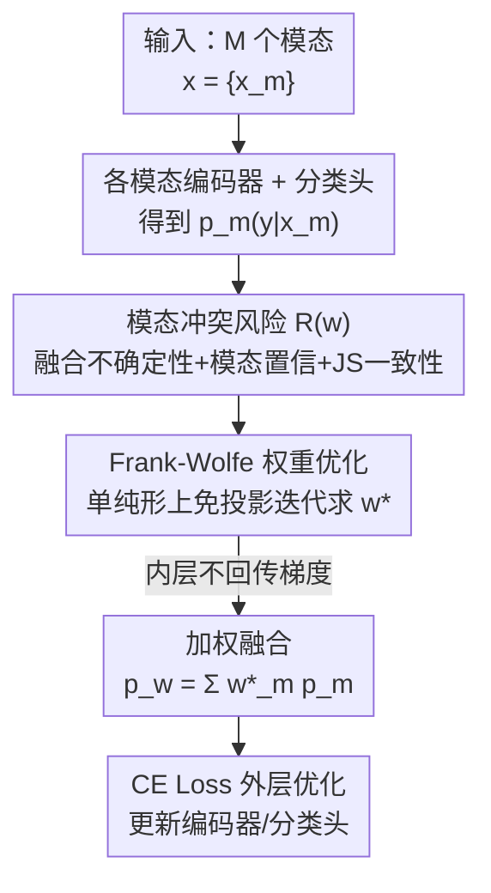

# CoRiM: Conflict-driven Risk Minimization for Dynamic Multimodal Fusion

**会议**: CVPR 2026  
**论文**: [CVF Open Access](https://openaccess.thecvf.com/content/CVPR2026/html/Zou_CoRiM_Conflict-driven_Risk_Minimization_for_Dynamic_Multimodal_Fusion_CVPR_2026_paper.html)  
**代码**: 无  
**领域**: 多模态融合 / 动态多模态融合  
**关键词**: 动态多模态融合, 模态冲突, 风险最小化, Frank-Wolfe, 概率单纯形  

## 一句话总结
本文把动态多模态融合重新定义为一个「逐样本、直接最小化冲突风险」的优化问题：设计了一个可微的模态冲突风险函数 $R(w)$（融合不确定性 + 模态置信先验 + JS 一致性），并用免投影的 Frank-Wolfe 算法在概率单纯形上求最优模态权重，从而在高冲突、强噪声场景下显著超越 QMF/PDF 等 SOTA。

## 研究背景与动机
**领域现状**：多模态决策（自动驾驶、多模态情感分析、临床诊断）依赖把多个模态的信息融合起来。传统融合用固定权重或全局注意力，假设各模态贡献恒定；近年主流转向**动态多模态融合（DMF）**，按样本自适应调整模态权重。其中有理论支撑的代表是 QMF（基于泛化理论，把融合权重与单模态损失建立负相关）和 PDF（进一步指出权重还应与"其他模态损失"正相关）。

**现有痛点**：这些方法的核心范式都是去**拟合标量代理量**——估计的不确定性、损失、或预测真类的置信度——以此间接满足泛化上界给出的相关性。但当模态之间出现**预测分布层面的冲突**（同一输入下两个模态给出截然不同的后验分布）时，单个标量根本刻画不了这种分布不一致带来的全部风险。固定/启发式加权在此会**放大预测偏差**，甚至让融合结果劣于单模态。

**核心矛盾**：作者在 NYUD v2 上做了细粒度分析，用单模态预测分布间的对称 KL 散度量化"冲突强度"。结果发现：强冲突样本上绝对精度确实下降，但融合相对单模态的**增益 $\Delta\mathrm{Acc}$ 反而随冲突强度单调上升**。也就是说，模态冲突不是要一味压制的噪声，而是"此时此刻动态融合最有价值"的信号——前提是融合策略要设计得当。可现有标量范式恰恰丢掉了这个分布级信号。

**本文目标**：把动态融合从"经验加权 / 置信校准"换成"直接在概率空间最小化一个冲突驱动的风险项"，使融合后的泛化上界更紧。

**切入角度**：借鉴域适应里的经典泛化界——目标风险被源风险加一个域间差异项（Div）控制。类比到多模态：融合风险 $R \lesssim R_{\text{avg}} + \mathrm{Div}(p_1,\dots,p_M) + \lambda$，其中 $\mathrm{Div}$ 衡量各模态预测分布的不一致。模态一致时 $\mathrm{Div}\approx 0$，越冲突上界越松。于是**最优融合 = 找到一组权重使预测分布空间内的模态不一致最小**。

**核心 idea**：用一个**可微的模态冲突风险 $R(w)$** 替代标量损失代理，把动态融合变成"逐样本在概率单纯形上直接最小化 $R(w)$"的约束优化问题，并用 Frank-Wolfe 高效求解。

## 方法详解

### 整体框架
给定一个含 $M$ 个模态的样本 $x=\{x_m\}_{m=1}^M$，每个模态过自己的编码器 $f_m(\cdot)$ 和分类头得到预测分布 $p_m(y|x_m)$。CoRiM 不再去预测一个标量权重，而是在每个样本上把模态权重 $w$ 当作**优化变量**，在概率单纯形 $\Delta^{M-1}$ 上直接最小化冲突风险 $R(w)$，求得 $w^\*$ 后做加权融合 $p_w=\sum_m w_m p_m$，再用交叉熵训练整个模型。

整个训练是**内外两层**：内层是逐样本的 FW 权重优化（求 $w^\*$，**不回传梯度**——它只是为当前样本挑出最优权重）；外层是常规的模型参数优化（CE Loss，回传梯度更新编码器和分类头）。这种"内层求权重、外层学表征"的解耦，让权重优化的迭代不污染主网络的梯度。

### 关键设计

**1. 模态冲突风险函数 MCR：把"分布级冲突"写成一个可微目标**

痛点是标量代理量（损失/置信）刻画不了预测分布间的冲突。本文直接在概率空间定义逐样本风险。先把融合预测写成加权平均 $p_w=\sum_{m=1}^M w_m p_m$，再定义

$$R(w) = \underbrace{\alpha H(p_w)}_{\text{融合不确定性}} + \underbrace{\beta H_m(w)}_{\text{模态置信}} + \underbrace{\gamma \mathrm{JS}_m(w)}_{\text{JS 一致性}}$$

三项各有分工：$H(p_w)=-\sum_c p_w(c)\log p_w(c)$ 是**融合分布的熵**，逼模型找到歧义最小（最不模糊）的融合解；$H_m(w)=\sum_{m}w_m H(p_m)$ 是各模态熵的加权平均，作为**先验置信项**（tie-breaker），偏好那些自身就更确定（熵更低）的模态；$\mathrm{JS}_m(w)=\frac{1}{M}\sum_m \mathrm{JS}(p_m\Vert p_w)$ 是各模态对融合共识 $p_w$ 的平均 JS 散度，**惩罚偏离共识的异常模态**。$\alpha,\beta,\gamma\ge 0$ 为超参。

为什么这样有效：作者顺着 Eq.(3) 的泛化界把冲突项实例化成这三个可微分量，得到上界式分解 $R(f_w)\lesssim R_{\text{avg}}+C_1H(p_w)+C_2H_m(w)+C_3\mathrm{JS}_m(w)+\lambda$（$C_1,C_2,C_3>0$）。这说明**在样本级最小化 $R(w)$ 就是在收紧整体风险上界**，于是 $R(w)$ 是泛化误差的一个上界代理，其最优解 $w^\*=\arg\min_{w\in\Delta^{M-1}}R(w)$ 对应最鲁棒的融合权重。这比"拟合一个标量"直接得多，也把冲突从"噪声"变成了"可优化的信号"。

**2. Frank-Wolfe 求解器：在单纯形上免投影地最小化非凸 $R(w)$**

权重 $w$ 必须落在概率单纯形 $\Delta^{M-1}$ 上（非负、和为 1）。投影梯度下降（PGD）每步都要做一次代价高昂的单纯形投影，而 $R(w)$ 又因 $H(p_w)$ 项**非凸**，经典 FW 的凸收敛保证不直接适用。本文选 FW 正是因为它**完全避开投影**：把目标线性化、沿单纯形顶点方向更新。

具体地，每步先算梯度 $g_t=\nabla_w R(w_t)$（衡量每个模态对总风险的贡献方向），再解线性子问题 $s_t=\arg\min_{s\in\Delta^{M-1}}\langle s,g_t\rangle$。由于在单纯形上线性目标的极小值必在顶点取到，$s_t=e_{m^\star}$（$m^\star=\arg\min_m [g_t]_m$）——即当前样本上**最可靠、能让风险下降最快的那个模态**。然后做凸组合更新 $w_{t+1}=(1-\eta_t)w_t+\eta_t s_t$，相当于在模态单纯形上沿最速下降方向做线性插值，天然保证更新后仍在单纯形内。整个过程在迭代中逐步"加重低风险模态、压制高冲突模态"。

为什么收敛有保证：作者证明 $R(w)$ 不是任意非凸函数，而是 **L-smooth**（梯度 Lipschitz 连续），满足现代非凸优化理论的前提，从而保证 FW 收敛到驻点；$R(w)$ 还具有 Difference-of-Convex（DC）结构，对这类结构用 FW 也是理论稳健的。在 $\eta_t=\eta\le 1/\sqrt{T}$ 下，FW 的驻点间隙 $\min_{t}G_t(w_t)=O(1/\sqrt{T})$ 次线性收敛；又因逐样本模态置信分布通常单峰，实践中几步即可收敛。⚠️ 公式细节以原文为准。

**3. 梯度分量分析：让三项各自如何"调权重"变得可解释**

由于每步 FW 沿 $\nabla R(w)$ 方向走，这个梯度决定了每个模态被加权还是被抑制。模态 $m$ 的梯度拆成三部分：

$$\nabla_{w_m}R(w) = \alpha\nabla_{w_m}H(p_w) + \beta\nabla_{w_m}H_m(w) + \gamma\nabla_{w_m}\mathrm{JS}_m(w)$$

其中**融合不确定性梯度** $\nabla_{w_m}H(p_w)=-\sum_c p_m(c)[1+\log p_w(c)]$，驱动模型偏向那些与融合预测高置信部分对齐的模态，降低整体歧义；**模态置信梯度** $\nabla_{w_m}H_m(w)=H(p_m)$ 是个常数，充当静态先验，恒定地偏向先验上更确定的模态；**一致性梯度** $\nabla_{w_m}\mathrm{JS}_m(w)$ 则惩罚偏离共识的模态。三者合力决定每个模态的瞬时下降速率，FW 据此选出让 $\langle s_t,g_t\rangle$ 最小的顶点（模态），直接收紧总风险上界。这一拆解的价值在于：它把"为什么某个模态在某样本上被压制/被加重"讲成了三股可解释的力，而不是黑盒权重。

### 损失函数 / 训练策略
外层训练目标是标准交叉熵 $L=\mathbb{E}_{(x,y)}[-\log p_{\text{fused}}(y|x)]$，其中 $p_{\text{fused}}=\sum_m w^\*_m p_m$ 用内层 FW 求得的最优权重。内层 FW 迭代**不回传梯度**（stop-gradient），即权重优化只为当前样本挑权重、不参与主网络的反向传播。FW 用均匀权重 $w^{(0)}=\frac{1}{M}\mathbf{1}$ 初始化，步长 $\eta_t\in(0,1]$，以风险改善量 $|R(w_{t+1})-R(w_t)|<\delta$ 作为停止判据。

## 实验关键数据

### 主实验
在 4 个标准多模态分类基准上对比，对 50% 模态加高斯噪声、$\epsilon$ 表示噪声强度。CoRiM 在干净与各噪声等级下均优于 QMF/PDF 等 SOTA，且高噪声下优势更明显。

| 数据集 | 噪声 $\epsilon$ | 指标 | PDF (前SOTA) | 本文 |
|--------|------|------|------|------|
| MVSA | 0.0 | AVG / WORST | 79.94 / 78.42 | **81.12 / 80.35** |
| MVSA | 10.0 | AVG / WORST | 63.09 / 60.31 | **65.34 / 63.78** |
| FOOD101 | 0.0 | AVG / WORST | 93.32 / 92.84 | **93.62 / 93.19** |
| FOOD101 | 5.0 | AVG / WORST | 76.47 / 76.09 | **78.09 / 77.87** |
| NYUD v2 | 0.0 | AVG / WORST | 71.37 / 70.18 | **72.36 / 72.02** |
| NYUD v2 | 10.0 | AVG / WORST | 62.56 / 60.25 | **63.04 / 61.75** |
| SUN RGB-D | 5.0 | AVG / WORST | 51.45 / 50.53 | **55.61 / 54.00** |

在三模态情感分析（音频/图像/文本）上同样有效：

| 数据集 | ReconBoost | 本文 |
|--------|-----------|------|
| MOSEI | 68.61 | **69.21** |
| MOSI | 77.96 | **78.46** |
| CH-SIMS | **73.88** | 73.68 |

### 消融实验
风险函数三分量（FU 融合不确定性 / MC 模态置信 / JSC 一致性）在 MVSA 上的消融：

| 配置 | $\epsilon=0$ AVG | $\epsilon=5$ AVG | $\epsilon=10$ AVG | 说明 |
|------|------|------|------|------|
| 仅 FU | 79.13 | 71.87 | 62.17 | 只求最小熵的无歧义解 |
| 仅 MC | 79.19 | 73.15 | 62.88 | 只用置信先验 |
| 仅 JSC | 79.13 | 72.25 | 60.50 | 只惩罚偏离共识 |
| FU+JSC | 80.53 | 73.83 | 62.94 | 双项组合 |
| **三项全开** | **81.12** | **75.65** | **65.34** | 完整模型 |

求解器与权重粒度消融（MVSA）：

| 类别 | 方法 | $\epsilon=0$ | $\epsilon=5$ | $\epsilon=10$ |
|------|------|------|------|------|
| 权重粒度 | Global（全局共享） | 75.85 | 68.54 | 62.36 |
| 权重粒度 | Class（按类共享） | 77.84 | 73.28 | 64.05 |
| 求解器 | PGD | 78.55 | 71.74 | 59.99 |
| 求解器 | EMD | 78.16 | 72.58 | 61.40 |
| — | **Ours（逐样本 + FW）** | **81.12** | **75.65** | **65.34** |

### 关键发现
- **三项协同缺一不可**：单看任一分量都还行，但三项联合才把鲁棒性拉满（MVSA $\epsilon=10$ 从单项约 60–63 提升到 65.34）。FU 找无歧义解、MC 给置信先验、JSC 压异常模态，三股力互补。
- **JS 散度优于其他一致性度量**：对比对称 KL、Hellinger、TV 散度，JS 因其对称、有界、凸的性质在高噪声下训练更平稳（MVSA $\epsilon=10$：JS 65.34 vs sKL 63.01 / TV 63.00）。
- **逐样本粒度是关键**：Global / Class 共享权重无法适应样本级冲突变化，高噪声下大幅掉点（Global $\epsilon=10$ 仅 62.36，本文 65.34）。
- **FW 优于 PGD/EMD**：PGD 的梯度投影易引入振荡，EMD 对超参敏感、高噪声下退化；FW 免投影 + 解析极点更新，收敛更稳（$\epsilon=10$：FW 65.34 vs PGD 59.99 / EMD 61.40）。

## 亮点与洞察
- **"冲突是信号不是噪声"的实证**：用 $\Delta\mathrm{Acc}$ 随对称 KL 冲突强度单调上升这一现象，论证了高冲突样本恰恰是动态融合最该发力的地方——这把整篇方法的动机立得很实，而非空谈鲁棒性。
- **把融合权重从"拟合标量"换成"概率空间直接优化"**：MCR 直接在预测分布上定义风险，比 QMF/PDF 的标量代理范式更贴近泛化界的本质，思路可迁移到任何需要"按样本选模态"的多模态任务。
- **FW + 单纯形是天作之合**：权重本就在概率单纯形上，FW 免投影、顶点更新天然契合，还顺手给出 L-smooth/DC 结构下的非凸收敛保证——把一个看似工程化的优化器选择落到了理论根上。
- **内外两层解耦 + stop-gradient**：内层求权重不回传梯度，避免权重迭代污染主网络训练，是个干净可复用的工程 trick。

## 局限与展望
- 实验主要在 2–3 模态分类任务上，更大 $M$、更复杂任务（检测/分割/生成）下 FW 内层迭代的开销与收敛性还需验证。
- $\alpha,\beta,\gamma$ 三个权衡系数需要调，论文未充分给出其敏感性分析，跨数据集的可迁移性存疑。
- 内层 FW 不回传梯度意味着权重优化与表征学习是"半解耦"的，二者若能联合可微优化是否更优，值得探索。
- ⚠️ 收敛性证明（L-smooth、DC 结构、$O(1/\sqrt T)$）放在附录，正文只给结论，复现时需核对附录推导。

## 相关工作与启发
- **vs QMF**：QMF 基于泛化理论把融合权重与单模态损失建立负相关，本质是拟合一个标量损失代理；本文直接在概率分布空间定义可微冲突风险并最小化，能刻画标量抓不住的分布级不一致，高噪声下更鲁棒（MVSA $\epsilon=10$：65.34 vs QMF 61.28）。
- **vs PDF**：PDF 进一步让权重与其他模态损失正相关，仍是标量拟合范式；本文的 MCR 用融合熵 + 模态置信 + JS 一致性三项联合刻画，并用 FW 求最优权重，在干净与噪声场景全面超过 PDF。
- **vs ReconBoost**：ReconBoost 把模态冲突视作学习器间的竞争、交替优化逐步调和各分支；本文不做交替训练，而是逐样本一次性在单纯形上解出最优权重，三模态情感任务上 MOSEI/MOSI 略胜（69.21/78.46 vs 68.61/77.96）。

## 评分
- 新颖性: ⭐⭐⭐⭐⭐ 把动态融合从"拟合标量"重定义为"概率空间直接最小化可微冲突风险"，并用 FW 求解，范式层面的创新。
- 实验充分度: ⭐⭐⭐⭐ 4 个分类基准 + 3 模态情感任务，多噪声等级 + 风险分量/一致性度量/粒度/求解器多维消融，较扎实；任务类型偏分类。
- 写作质量: ⭐⭐⭐⭐⭐ 动机用实证图立得很实，方法从泛化界一路推到可微目标再到求解器，逻辑闭环清晰。
- 价值: ⭐⭐⭐⭐ 在高冲突/强噪声多模态融合上稳定提升，思路与 FW-on-simplex 框架可迁移，理论根基扎实。

<!-- RELATED:START -->

## 相关论文

- [\[CVPR 2026\] Unbiased Dynamic Multimodal Fusion](unbiased_dynamic_multimodal_fusion.md)
- [\[CVPR 2026\] DeepAlign: Mitigating Modality Conflict through Modality-Specific Alignment](deepalign_mitigating_modality_conflict_through_modality-specific_alignment.md)
- [\[CVPR 2026\] Conflict-Aware Adaptive Cross-Reconstruction for Multimodal Sentiment Analysis](conflict-aware_adaptive_cross-reconstruction_for_multimodal_sentiment_analysis.md)
- [\[CVPR 2026\] Beyond Sequential Tools: A Unified VLM Agent System for Photographic Post-Processing via Dynamic Multi-Expert Fusion](beyond_sequential_tools_a_unified_vlm_agent_system_for_photographic_post-process.md)
- [\[CVPR 2026\] Breaking Multimodal LLM Safety via Video-Driven Prompting](breaking_multimodal_llm_safety_via_video-driven_prompting.md)

<!-- RELATED:END -->
