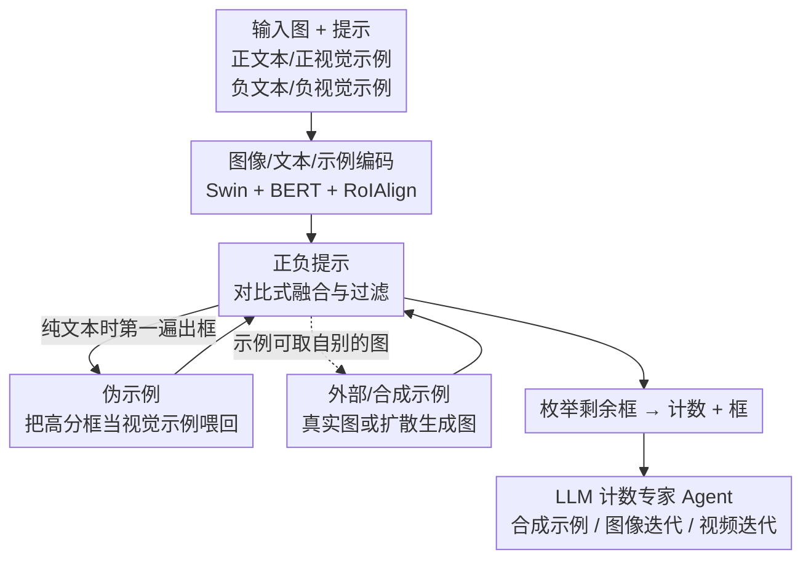

# CountGD++: Generalized Prompting for Open-World Counting

**会议**: CVPR 2026  
**arXiv**: [2512.23351](https://arxiv.org/abs/2512.23351)  
**代码**: https://github.com/niki-amini-naieni/CountGDPlusPlus/ (有)  
**领域**: 多模态VLM / 开放世界计数  
**关键词**: 开放世界计数, 正负提示, 伪示例, 外部/合成示例, LLM 视觉专家 Agent

## 一句话总结
CountGD++ 把开放世界目标计数的"提示"做泛化：既能用文本+视觉示例说"数什么"，也能用文本+视觉示例说"别数什么"，还能让模型自己生成视觉示例（伪示例）、从外部/合成图借示例，并把自己包装成 LLM 调用的计数专家 Agent——在 8 个数据集上不微调就大幅提升计数与检测精度（血细胞 MAE 从 ~11.5 降到 1.52）。

## 研究背景与动机
**领域现状**：开放世界计数（open-world counting）允许用户用文本、视觉示例（exemplar，框出图里几个示例实例）或两者来指定"数什么"。当前 SOTA 的 CountGD 系列（CountGD / CountGD-Box，基于 Grounding DINO）能同时吃文本和视觉示例，并输出框来枚举计数。

**现有痛点**：提示方式被卡住了三处。① **没法说"别数什么"**——面对"红细胞 vs 白细胞""熟苹果 vs 生苹果"这类外观相近的类别，模型只能描述目标、不能排除干扰物，假阳性高；② **视觉示例必须手工标注且只能取自当前图**——要在一个数据集每张图都画框，标注成本极高；③ **纯文本场景下信息不够**——对不常见的物体（如某种异国水果），光给文本，模型识别不准，但又没有视觉示例可用。

**核心矛盾**：视觉示例信息丰富、却标注昂贵且不能跨图复用；文本无需标注、却对细粒度/陌生类别不够判别。两者的优点没法同时享受，且都缺少"排除"机制。

**本文目标**：把提示从"只能说数什么"扩展为"既能说数什么、也能说别数什么"，并让视觉示例的获取自动化、可跨图、可合成。

**切入角度**：模型已经会输出大量候选框；既然如此，何不让它把自己输出的高分框当作"现成的视觉示例"喂回去（query expansion 的思路）；同时把负样本当作"过滤器"，在相似度空间里把候选推离负类、拉近正类。

**核心 idea**：用对比式的正负提示 + 自生成的"伪示例" + 外部/合成示例，把计数模型的提示能力泛化，并让 LLM 把它当视觉专家工具调用。

## 方法详解

### 整体框架
CountGD++ 在 CountGD-Box（Grounding DINO 的计数扩展）之上，把输入提示从"一条正文本 + 若干正视觉示例"扩成"一条正文本 $t^+$ + 任意多正视觉示例 $B^+$ + 任意多负提示对 $\{(B^-_i, t^-_i)\}$"，输出仍是一堆框、枚举得到计数。一次前向的数据流是：输入图与示例图分别过同一个图像编码器（Swin Transformer），示例图上用 RoIAlign 把框内区域抠成示例 token；正负文本过 BERT 文本编码器得文本 token；在 Feature Enhancer 里**只让对应同一类的视觉示例与文本相互 self-attention**、再与图像 token 做 cross-attention；Cross-Modality Interaction 解码器选出与提示最相似的 top-900 图像 token 作为 object query，映射到候选框；最后 Object Filtering Module 用两条相似度条件把"低置信"和"更像负类"的候选剔掉，剩下的枚举出数。

在这套推理框架之上，论文叠了三项把"提示获取"自动化/泛化的能力——伪示例（自生成视觉示例）、外部/合成示例（示例可来自别的图甚至扩散模型生成的图）、以及把整体当作 LLM 可调用的计数专家 Agent。

### 关键设计

**1. 正负提示：把"别数什么"做成相似度空间里的过滤器**

针对"无法排除相似干扰物"的痛点，CountGD++ 允许在提示里加任意多负提示对 $(B^-_i, t^-_i)$（如 $t^+$="strawberry"，$t^-_1$="blueberry"，$t^-_2$="raspberry"）。负样本不是用来检测、而是当过滤器：在 Feature Enhancer 里，**只有相互对应的视觉示例与文本才 self-attention，不同类的提示彼此不交互**（既让同一物体的多模态信息充分融合，又防止无关概念互相污染，不同负类之间也不互相 attend）。最终对每个 object query $q$，是否计数由两条件决定：

$$\max(\mathrm{Sig}(q^\top P^+)) > \sigma \quad \text{且} \quad \max(q^\top P^+) > \max(q^\top P^-)$$

其中 $P^+, P^-$ 是把正/负提示特征按列排成的矩阵，max 在提示维上取，$\sigma$ 是置信阈值，Sig 是 Sigmoid。第一条剔除"既不像正类也不像负类"的框，第二条剔除"更像负类"的框。加负样本本质是提升精确率——血细胞这类红白难分的场景，靠它把假阳性压下去。

**2. 对比式分类损失：让不同类的 query 在嵌入空间被推开**

要让上面的条件成立，训练目标必须保证目标 query 离正提示比离负提示近，即对 query $q$ 希望 $q^\top p^+ > q^\top p^-$。两边过 Sigmoid 转成概率 $\hat{y}^+=\mathrm{Sig}(q^\top p^+)$、$\hat{y}^-=\mathrm{Sig}(q^\top p^-)$，则只要 $\hat{y}^+\!\to\!1$、$\hat{y}^-\!\to\!0$ 不等式即成立——于是对 $\hat{y}^+$ 用标签 1、对 $\hat{y}^-$ 用标签 0 做二元（Focal）交叉熵。把所有 query 排成 $Q$、所有提示特征排成 $P$，得 $\hat{Y}=\mathrm{Sig}(Q^\top P)$，真值 $Y$ 中 $y_{i,j}=1$ 当且仅当 query $i$ 对应提示 $j$，分类损失即 $L_{cls}=\mathrm{FocalLoss}(\hat{Y}, Y)$。与 CountGD-Box 最大的区别在于：**同一张图里不同 query 可以匹配到不同类/不同提示特征**，于是 $L_{cls}$ 会把 query 从它不属于的示例/文本特征推开、向它属于的拉近，从而在嵌入空间分开多类——这正是推理期能"按正负条件过滤"的训练基础。

**3. 伪示例：让模型把自己输出的高分框当视觉示例喂回去**

针对"纯文本场景缺视觉信息、又不想手工标注"的痛点，CountGD++ 在只给文本时先做一遍前向、得到所有候选框，再把其中 top-$N$ 高分框直接当作"伪示例"（pseudo-exemplars）连同文本喂回去做第二遍前向，得到最终计数。这样无需任何人工标注就吃到了视觉示例的丰富信息（类似检索里的 query expansion：用高排名结果当新 query 再查一次）。$N$ 按场景选——训练集每图标 3 个示例，故 $N=3$ 最自然；实例少于 3 时取更小的 $N$。当正负文本都给时，还能分别产出**正伪示例**（取满足置信阈值且更像正提示的 top-$N$ 框）和**负伪示例**（更像负提示的 top-$N$ 框），二者都能像手工标注一样回喂。与 Patch-Selection（要单独的误差预测模型选 patch）、CountSE（生成隐式"软"示例、且无法利用真实示例）不同，这里是**同一个计数模型既产生又使用**示例，且能同时受益于视觉示例和文本。

**4. 外部/合成示例 + LLM 计数专家 Agent：示例可跨图、可生成，并交给 LLM 调度**

CountGD-Box 强制示例图等于输入图；CountGD++ 把输入图与示例图拆成**两条独立的编码流**（共享同一编码器权重），于是示例可来自任意外部图——真实图或扩散模型合成图。外部示例只需标注一次就能套用到整个数据集的所有图，标注成本从"每图都标"降到"标一张"。在此基础上，CountGD++ 被包装成 LLM 可调用的计数专家工具，论文给了三种用法：① **合成示例**——LLM 调图像生成 API（如扩散模型）按文本造一张只含一个目标实例的图，再用 CountGD++ 在合成图上取 top-1 框作为合成示例，连同文本与输入图回灌计数；② **图像迭代 Agent**——给定文本，LLM 反复取 top-$N$ 框当伪示例回喂直到计数收敛；③ **视频迭代 Agent**——逐帧计数，把当前帧 top-$N$ 高分框当伪示例传给下一帧，使视觉示例随物体（如生长变形的晶体）一起"进化"，解决首帧示例与后续帧外观不一致的问题。

### 损失函数 / 训练策略
总损失在分类损失外加上 CountGD-Box 的三项定位损失：
$$L = \lambda_{loc}(L^e_{h,w} + L_{center}) + \lambda_{GIoU} L^e_{GIoU} + \lambda_{cls} L_{cls}$$
其中 $L_{center}$ 为预测/真值框中心绝对差之和，$L^e_{h,w}$ 为宽高绝对误差之和，$L^e_{GIoU}$ 为广义 IoU（上标 $e$ 表示框只对 FSC-147 里的示例提供）。预测框与真值框用匈牙利匹配，匹配代价 $C=\lambda_{cls}L_{cls}+\lambda_{loc}L_{center}$。超参直接沿用 CountGD-Box：$\lambda_{loc}=5,\ \lambda_{GIoU}=2,\ \lambda_{cls}=2$，置信阈值 $\sigma=0.23$，全程不针对各下游数据集调参。训练集为 FSC-147，并额外加入 **1000 张合成的 mosaic 图**——因为标准计数数据集每图通常只标一类，无法学"区分多类/排除负类"，故用 mosaic 拼接构造多类别带标注的训练图。

## 实验关键数据

训练只用 FSC-147（+1000 张 mosaic），其余 8 个 benchmark 全部 zero-shot 不微调。

### 主实验

**FSCD-147（纯文本输入，计数 + 检测）**：

| 方法 | MAE ↓ | RMSE ↓ | AP ↑ | AP50 ↑ |
|------|-------|--------|------|--------|
| CountGD-Box | 15.01 | 118.16 | 30.44 | 61.56 |
| CountSE（不出框） | 7.84 | 82.99 | — | — |
| Ours（仅文本 $t$） | 16.55 | 129.76 | 33.01 | 61.75 |
| Ours（+伪示例 $t{+}p$） | 10.29 | 33.52 | 37.78 | 68.90 |
| **Ours（+伪+合成 $t{+}p{+}s$）** | **8.39** | **27.03** | **38.93** | **71.35** |

加伪示例让 RMSE 从 129.76 暴降到 33.52，再加合成示例进一步到 27.03，检测 AP50 71.35 全场最高；MAE 与不出框的 CountSE 相当，但 RMSE 与检测精度远超。

**ShanghaiTech 人群计数（仅正文本 "human" + 伪示例，zero-shot）**：

| 方法 | Part A MAE/RMSE | Part B MAE/RMSE |
|------|------|------|
| CountGD-Box | 132.2 / 253.9 | 32.2 / 57.9 |
| CountSE | 129.7 / 258.3 | — |
| **Ours** | **116.0 / 234.0** | **28.0 / 50.0** |

Part A MAE 较 CountSE 降 >10%、RMSE 降 9%。

**VideoCount 晶体（X 光视频里变形生长的晶体）**：

| 方法 | 提示 | MAE ↓ | RMSE ↓ |
|------|------|-------|--------|
| CountVid | 文本+人工视觉示例 | 12 | 13.5 |
| CountVid | 仅文本 | 69.1 | 86 |
| **Ours** | 仅文本（伪示例自进化） | **10** | **12.3** |

纯文本下 MAE/RMSE 较 CountVid 降约 7 倍，甚至超过用人工示例的 CountVid——因为伪示例随晶体一起进化、且每帧可用多达 10 个示例。

### 消融实验

**正负提示的威力（Blood Cell / OmniCount Fruits，给正负文本+示例）**：

| 配置（Blood Cell） | MAE ↓ | RMSE ↓ | AP50 ↑ | 说明 |
|------|------|------|------|------|
| CountGD-Box（仅正） | 11.34 | 15.42 | 0.45 | 旧 SOTA |
| Ours（仅正文本+内部示例） | 11.56 | 15.69 | 0.47 | 无负样本 |
| Ours（正+负，内部示例） | **1.73** | **3.06** | 0.71 | 加负后近一个数量级 |
| Ours（正+负，外部示例） | **1.52** | **2.42** | **0.80** | 外部示例泛化更好 |

OmniCount Fruits 上同样从 2.4 降到 0.41。**只有 CountGD++ 能用负样本**，这是它区分红/白细胞、不同苹果的关键。

**PrACo benchmark（负标签测试 + mosaic 多类测试）**：

| 方法 | 提示 | NMN ↓ | PCCN ↑ | CntP ↑ | CntR ↑ |
|------|------|------|------|------|------|
| DAVE | 正+负 | 0.08 | 97.62 | 0.84 | 0.80 |
| Ours | 仅正 | 0.88 | 62.86 | 0.86 | 0.96 |
| **Ours** | 正+负 | **0.07** | **97.99** | **0.90** | **0.96** |

其中 NMN（负预测归一化均值，越低越好）衡量"目标不在图中时误数多少"，PCCN（正类计数接近度）衡量多类场景计数准确度。

### 关键发现
- **贡献最大的是负样本**：在血细胞/水果这类相似类别上，从仅正到正+负，MAE 直接降近一个数量级（11.5→1.5），其余设计是在精度/效率/泛化上锦上添花。
- **伪示例对 RMSE 的改善远大于对 MAE**：FSCD-147 纯文本下 RMSE 从 129.76→33.52，说明它主要砍掉了大误差离群图（难例上文本不够、视觉示例补上）。
- **外部示例常优于内部示例**：当外部示例把目标拍得更清晰/更具代表性时，跨图泛化反而比从当前图抠的内部示例更好（Blood Cell AP50 0.71→0.80）。
- **视频里自进化伪示例 > 人工首帧示例**：物体随时间变形时，固定首帧示例会失配，逐帧更新的伪示例自动跟上。

## 亮点与洞察
- **"模型自产自销视觉示例"是个很顺的闭环**：检测模型本就输出一堆框，把高分框当示例回喂（query expansion 思想搬到计数），几乎零成本就把"纯文本"升级成"文本+视觉示例"，且统一在一个模型里完成产生与使用——比起需要额外误差预测模型选 patch 的方案更干净。
- **把"负提示"形式化成相似度空间的两条过滤条件 + 对比损失**，思路清晰且可迁移：任何"基于 query-prompt 相似度出框"的开放词表检测器，都能照此加"别检测什么"的能力。
- **示例可合成**：让 LLM 调扩散模型造一张单实例图、再用本模型取框当示例，等于给计数模型接上了"凭空造视觉示例"的能力，对训练集里没见过的类很有用。
- **视频里让示例随物体进化**的设计，把"逐帧重检测"升级成"带记忆的逐帧传播"，对生长/形变物体（晶体、细胞）尤其有效。

## 局限与展望
- **强依赖第一遍框的质量**：伪示例取自模型自己的高分框，若首遍前向就把目标识别错（高分框是干扰物），错误会被回喂放大；论文未深入分析这种失败模式。
- **负样本需要人能说清"别数什么"**：在干扰类难以用文本/示例界定、或类间差异极细微（PairTally 那种）时，负提示收益可能受限（PairTally/CARPK 结果放在附录，正文未展开）。
- **Agent 用法依赖外部大模型**：合成示例要调扩散模型、迭代要 LLM 控制器，引入了额外推理成本与对生成质量的依赖；论文也指出当前 LLM 自身计数能力仍弱（见补充材料），所以才需要把 CountGD++ 当专家工具。
- **多遍前向带来推理开销**：伪/合成示例至少要两遍前向，视频每帧两遍 + 多达 10 个示例，吞吐相比单遍计数下降。

## 相关工作与启发
- **vs CountGD / CountGD-Box**：同一作者团队的前作只支持正文本+正视觉示例（CountGD-Box 还要求示例取自输入图本身并能出框）。本文新增"负提示、伪示例、外部/合成示例、LLM Agent"四项能力，在所有数据集 zero-shot 提升，核心增量是"能说别数什么"和"示例自动化/可跨图"。
- **vs CountSE**：CountSE 是纯文本计数、生成隐式"软"示例，但软示例不一定对应单个物体、且无法利用真实视觉示例、不出框。CountGD++ 的伪示例是显式真实框、能在有真实示例时一并受益，并输出检测框（FSCD-147 上 RMSE/AP 大幅领先）。
- **vs Patch-Selection（PseCo 等）**：它们用一个独立的误差预测模型先选"好" patch 当示例，再喂给只吃示例的计数模型；CountGD++ 是单一统一模型自产自销，且同时利用文本+示例，精度更高。
- **vs DAVE（PrACo 上）**：DAVE 也能用负文本，但 CountGD++ 在负标签测试 NMN（0.07 vs 0.08）、多类 mosaic 测试的精确率/召回率（CntP 0.90、CntR 0.96）上全面更优。
- **vs ViperGPT / HuggingGPT 等 LLM-as-planner 工作**：本文把"开放世界计数"做成一个具备正负提示、外部图、自动示例能力的强视觉专家工具，给 LLM 提供了比通用检测器更精准的计数原语。

## 评分
- 新颖性: ⭐⭐⭐⭐ "正负提示 + 自生成伪示例 + 外部/合成示例 + Agent"四件套虽多为前作的自然延伸，但把"别数什么"和"示例自动化"做成统一框架且效果显著。
- 实验充分度: ⭐⭐⭐⭐⭐ 8 个数据集 zero-shot、覆盖图像/视频/医学/农业/人群/晶体，正负/内外示例组合消融完整。
- 写作质量: ⭐⭐⭐⭐ 架构与推理条件、损失推导讲得清楚，Agent 三种用法图文并茂；部分细节（mosaic 构造、自注意力其它选项）下放附录。
- 价值: ⭐⭐⭐⭐⭐ 大幅降低视觉示例标注成本、加上"排除"能力，对医学/农业/材料等真实细粒度计数场景实用性强，代码开源。

<!-- RELATED:START -->

## 相关论文

- [\[CVPR 2026\] From Indoor to Open World: Revealing the Spatial Reasoning Gap in MLLMs](from_indoor_to_open_world_revealing_the_spatial_reasoning_gap_in_mllms.md)
- [\[CVPR 2026\] UNICBench: UNIfied Counting Benchmark for MLLM](unicbench_unified_counting_benchmark_for_mllm.md)
- [\[CVPR 2026\] AV-Reasoner: Improving and Benchmarking Clue-Grounded Audio-Visual Counting for MLLMs](av-reasoner_improving_and_benchmarking_clue-grounded_audio-visual_counting_for_m.md)
- [\[ACL 2026\] GeoArena: Evaluating Open-World Geographic Reasoning in Large Vision-Language Models](../../ACL2026/multimodal_vlm/geoarena_evaluating_open-world_geographic_reasoning_in_large_vision-language_mod.md)
- [\[ICCV 2025\] On Large Multimodal Models as Open-World Image Classifiers](../../ICCV2025/multimodal_vlm/on_large_multimodal_models_as_open-world_image_classifiers.md)

<!-- RELATED:END -->
