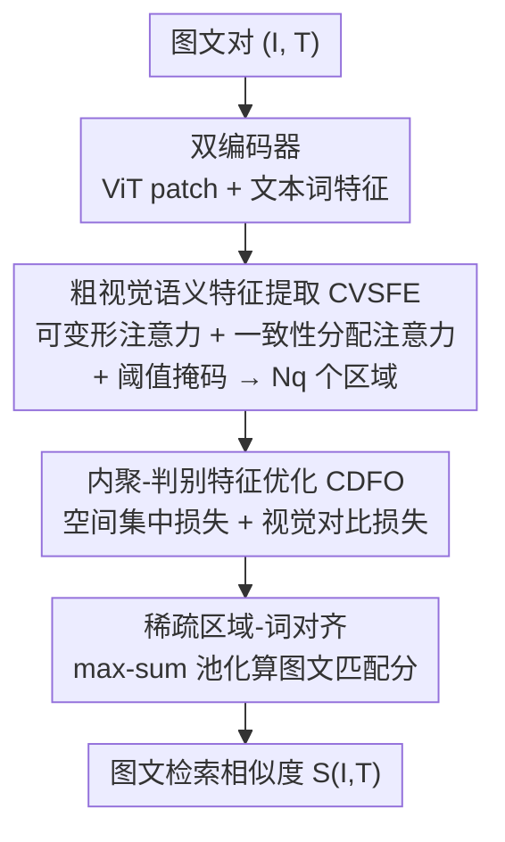

# CoV-Align: Efficient Fine-grained Cross-Modal Alignment with Cohesive Visual Semantics Priority

**会议**: CVPR 2026  
**论文**: [CVF Open Access](https://openaccess.thecvf.com/content/CVPR2026/html/Liu_CoV-Align_Efficient_Fine-grained_Cross-Modal_Alignment_with_Cohesive_Visual_Semantics_Priority_CVPR_2026_paper.html)  
**代码**: 未公开  
**领域**: 多模态VLM  
**关键词**: 跨模态对齐, 细粒度图文检索, 无文本引导聚合, 视觉语义区域, 可变形注意力  

## 一句话总结
CoV-Align 提出"先把图像 patch 在**没有文本参与**的情况下聚合成语义区域、再做区域-词对齐"的细粒度图文检索框架，用可变形注意力 + 一致性分配注意力生成区域、再用空间集中损失和视觉对比损失收紧区域质量，在 Flickr30K / MS-COCO 上刷新 SOTA 的同时比文本引导方法快 3–5 倍。

## 研究背景与动机
**领域现状**：图文跨模态对齐分两类。粗粒度对齐（VSE++、CLIP）把整图和整句各压成一个全局向量算相似度，简单但抓不住"哪个区域对应哪个词"的细节；细粒度对齐则要在局部视觉区域和具体词之间建立对应。细粒度这条线里，早期 SCAN 用 Faster-RCNN 出区域提议，受限于检测器固定类别、开放域用不了；后来 FILIP 等无检测器方法直接算所有 patch-token 两两相似度，但单个 patch 语义不完整、匹配模糊；当前 SOTA（LAPS、SPARC）改用**文本引导的交叉注意力**：拿文本 query 去聚合视觉 patch，再做对齐，效果最好。

**现有痛点**：文本引导聚合范式让"每个文本 query 和图中所有 patch 算对齐权重"，带来两个具体问题。其一，**冗余的 patch-word 对齐**——语义无关的 patch 也被卷进来，噪声稀释了关键语义、拖累检索精度。其二，**计算开销高**——百万级图库检索时，这种"每来一条文本就把全图 patch 重新聚合一遍"的重复计算造成巨大延迟和显存占用。

**核心矛盾**：两个问题的根源是同一件事——**让文本信息参与了 patch 聚合**。只要聚合阶段绑定文本，就既引入跨模态噪声、又把聚合算到了检索内循环里（每条 query 都要重算）。

**本文目标**：在不依赖文本的前提下，提前把图像里"手""推""推车"这种语义连贯的区域聚好，让无关区域根本不进入跨注意力；同时保证聚出来的区域足够准、足够有判别力。

**切入角度 / 核心 idea**：作者主张**视觉语义优先（Cohesive Visual Semantics Priority）**——区域聚合应当是图像自身的内禀属性，与查询文本无关。于是把聚合从"文本引导"换成"无文本引导"：区域只需对一张图算一次、可缓存复用，对齐时才让词特征进来算相似度。一句话概括：**用文本无关的视觉区域聚合替代文本引导聚合，既去噪又把重活移出检索内循环。**

## 方法详解

### 整体框架
给定一对图文 $(I, T)$，先用双编码器分别抽特征：ViT 把图像编码成 patch 特征 $F_v \in \mathbb{R}^{(N+1)\times d_v}$，Transformer 文本编码器把文本编码成词特征 $F_t \in \mathbb{R}^{L\times d_t}$。随后整条流水线分三步：**粗视觉语义特征提取器（CVSFE）** 在不看文本的情况下，用一组可学习 region query 把 patch 聚成 $N_q$ 个语义区域；**内聚-判别特征优化（CDFO）** 用两个损失把这些区域收紧（空间上集中、彼此上可区分）；最后 **稀疏区域-词对齐** 才让词特征进来，算区域和词的相似度并用 max-sum 池化得到图文匹配分。关键在于前两步完全和文本解耦——区域对一张图只算一次，检索时可直接复用。

### 关键设计

**1. 粗视觉语义特征提取器（CVSFE）：不靠文本把 patch 聚成语义区域**

这是"去掉文本引导"落地的核心。要在没有文本的情况下聚合，必须让一组可学习的 region query 自己找到图中语义连贯的局部。CVSFE 先用**可变形注意力（Deformable Attention, DAT）**：每个 region query $z_q$ 只对参考点 $p_q$ 附近一组稀疏采样位置做注意力，

$$z^{l+1}_q = \mathrm{MSDeformAttn}(z^l_q, p_q, F_v) = \sum_{m=1}^{M} W^l_m \Big[\sum_{k=1}^{K} A^l_{mk}\cdot F_v(p_q + \Delta p^l_{mk})\Big]$$

其中 $\Delta p_{mk}$ 是采样偏移、$A_{mk}$ 是注意力权重。这样每个 query 只聚焦稀疏的语义相关位置，既抓住区域又省算力。但稀疏采样还不够"语义一致"，作者再叠一层**一致性分配注意力（Consistent Assign Attention）**：用一个**共享投影矩阵 $W$** 约束注意力分布，让不同 query 的分配在同一套投影下保持一致，从而压制"把语义不相干的背景/上下文也聚进同一区域"的伪相关，注意力按

$$\mathrm{Attn} = \mathrm{Softmax}\Big(\frac{z_q W W^\top F_v^\top}{\tau}\Big)$$

计算（$\tau$ 为温度）。最后还加一道**阈值掩码**：把归一化后注意力低于阈值 $\varepsilon$ 的 patch 直接剪掉再做加权聚合，

$$\bar{\mathrm{Attn}}_{qk} = \begin{cases}\hat{\mathrm{Attn}}_{qk}, & \hat{\mathrm{Attn}}_{qk}\ge \varepsilon\\ 0, & \text{otherwise}\end{cases}, \qquad \hat{r}_q = \bar{\mathrm{Attn}}_q V^\top F_v$$

$\hat{\mathrm{Attn}}_{qk}$ 是把分数线性归一到 $[0,1]$ 后的值，方便统一阈值比较。实验里取 $N_q=8$ 个区域、$\varepsilon=0.7$，每个区域有自己的注意力图和区域中心。和文本引导方法相比，这一步把"区域生成"彻底搬到文本之外、对每张图只算一次。

**2. 内聚-判别特征优化（CDFO）：把聚出来的区域"收紧 + 拉开"**

光聚出区域还不够好：CVSFE 的注意力常常**飘到远处 patch（spatial drift）**，且多个区域在投影视图里会**空间重叠**，导致区域表示模糊。CDFO 用两个互补损失同时解决这两件事。**空间集中损失（Spatial Concentration Loss）** 针对"飘"——它先用归一化注意力 $a_q$ 算出区域中心 $c_q = \sum_{i,j}(a_q)_{i,j} p_{i,j}$，再惩罚注意力偏离中心的程度：

$$\mathcal{L}_{conc} = \sum_{i=1}^{H}\sum_{j=1}^{W}(a_q)_{i,j}\,\lVert p_{i,j} - c_q\rVert_2$$

利用"邻近像素语义高度相关"这一空间连续性先验，把每个区域的注意力压成空间上紧凑的一团。**视觉对比损失（Visual Contrastive Loss）** 针对"叠"——它把每个区域特征 $r_i$ 自身当正样本、**同一张图内其它区域** $r_j (j\ne i)$ 当负样本做对比：

$$\mathcal{L}_{v2v} = -\frac{1}{N_q}\sum_{i=1}^{N_q}\log\frac{\exp(r_i^\top r_i/\tau_1)}{\sum_{j=1}^{N_q}\exp(r_i^\top r_j/\tau_1)}$$

把同图不同区域互相推开，降低区域间信息冗余。两个损失协同，使区域特征既**内聚**（intra-semantic cohesion）又**判别**（inter-semantic discriminability）。

**3. 稀疏区域-词对齐：区域聚好之后才让文本进来**

前两步全程不碰文本，到这一步词特征 $F_t$ 才参与相似度计算。区域-词相似度矩阵按余弦相似度算 $s_{ij} = \frac{r_i^\top (F_t)_j}{\lVert r_i\rVert\,\lVert (F_t)_j\rVert}$，然后用 **max-sum 池化**聚合：对每个区域只保留它和所有词的最大相似度、对每个词只保留它和所有区域的最大相似度，再各自平均求和得到图文关联分

$$S(I, T) = \frac{1}{N_q}\sum_{i=1}^{N_q}\max_j (s)_{ij} + \frac{1}{L}\sum_{j=1}^{L}\max_i (s)_{ij}$$

由于区域聚合发生在文本之前，对齐这一步只是 $N_q$ 个区域（实验里仅 8 个）和词做稀疏匹配，相比"全 patch × 全词"的稠密对齐大幅省算力，这正是 3–5 倍加速的来源。

### 损失函数 / 训练策略
总损失是三部分加权和：全局对比损失（图→文 $\mathcal{L}_{v2t}$ 与文→图 $\mathcal{L}_{t2v}$，基于 $S(I,T)$ 的 InfoNCE）、视觉对比损失 $\mathcal{L}_{v2v}$、空间集中损失 $\mathcal{L}_{conc}$：

$$\mathcal{L}_{total} = \frac{\lambda_g}{2}(\mathcal{L}_{t2v} + \mathcal{L}_{v2t}) + \lambda_v \mathcal{L}_{v2v} + \lambda_c \mathcal{L}_{conc}$$

训练 30 epoch，Adam（lr=1e-4、weight decay=1e-4、cosine annealing），全部特征投到 512 维共享空间；超参 $\lambda_g, \lambda_v, \lambda_c, \varepsilon, N_q$ 取 $1, 1, 0.5, 0.7, 8$。

## 实验关键数据

### 主实验
在 Flickr30K 和 MS-COCO 上做图文双向检索（R@1/5/10 + RSum）。下表取 RSum 汇总不同视觉骨干下与最强细粒度对手 LAPS 的对比（数字为 RSum）：

| 骨干 | 数据集 | LAPS | CoV-Align | 提升 |
|------|--------|------|-----------|------|
| ViT-224 | Flickr30K 1K | 507.3 | **516.0** | +8.7 |
| ViT-384 | Flickr30K 1K | 525.4 | **538.2** | +12.8 |
| Swin-224 | Flickr30K 1K | 536.3 | **541.3** | +5.0 |
| Swin-384 | Flickr30K 1K | 545.3 | **557.0** | +11.7 |
| CLIP-ViT-L/14 | MS-COCO 5K | 465.3 (LG-MGC) | **491.9** | +26.6 |

接入 CLIP 微调后，CoV-Align 在 MS-COCO 5K 上 RSum 491.9，明显超过 LG-MGC 的 465.3，并与 ALBEF/BLIP 这类大规模 VLP 模型在同设置下保持竞争力。一个有意思的现象是：**输入分辨率越高（384 vs 224），相对 LAPS 的优势越大**，说明无文本区域聚合能更好利用高分辨率注意力图。

### 消融实验（Flickr30K，ViT-Base-224）
| 配置 | TR R@1 | IR R@1 | 说明 |
|------|--------|--------|------|
| Baseline（object-query 交叉注意力） | 70.4 | 59.4 | 起点 |
| + CVSFE | 73.9 | 62.1 | 加粗视觉语义区域，TR/IR 各 +3.5/+2.7 |
| + 视觉对比损失 | 75.4 | 62.6 | 提升区域间判别力，TR +1.5 |
| + 空间集中损失（Full） | **78.5** | **63.3** | 收紧空间分布，TR 再 +3.1 |

阈值 $\varepsilon$ 与区域数 $N_q$ 的敏感性也在 Table 3：$\varepsilon=0$（全 patch 进来）TR R@1 仅 74.5、噪声大，$\varepsilon=0.7$ 最优（78.5），$\varepsilon=0.9$ 又因过度过滤略降；$N_q=8$ 最优，4 个太少（72.7）、12/16 个反而下降（区域冗余）。

### 效率对比（Flickr30K，ViT-Base-224 + BERT-Base，batch 128）
| 模型 | FLOPs | 训练显存 | 备注 |
|------|-------|----------|------|
| CLIP | 2393.64G | 27G | 粗粒度参照 |
| SCAN | 2451.90G | 36G | 细粒度 |
| LAPS | 2577.61G | 49G | 最强细粒度对手 |
| **CoV-Align** | **2289.22G** | **25G** | FLOPs 最低、显存比 LAPS 省 49% |

评测时间上，MS-COCO 检索 CoV-Align 仅 114.0s，对比 LAPS 的 442.2s，约 **3 倍加速**，且精度还更高。

### 关键发现
- **三个组件都有正贡献，但 CVSFE 是地基**：它一上来就把 TR/IR R@1 各拉 +3.5/+2.7，因为生成的是语义连贯的区域级特征，而非 baseline 那种泛泛的粗粒度聚合。
- **空间集中损失在 TR 上贡献最大**（+3.1），说明"把注意力压成空间紧凑一团"对文→图检索尤其关键——文本描述往往对应图中一个紧凑物体/动作区域。
- **效率和精度同时变好**而非 trade-off：把聚合移出文本内循环、区域数压到 8，既省算力又去噪，是本文最反直觉的卖点。

## 亮点与洞察
- **"文本无关聚合"把重活移出检索内循环**：区域对每张图只算一次、可缓存，文本进来只和 8 个区域稀疏匹配——这是 3–5 倍加速的真正来源，思路可迁移到任何"query 侧不该参与底库表示构建"的检索场景。
- **共享投影矩阵 $W$ 强制注意力一致性**：用同一套投影约束所有 region query 的注意力分布，抑制伪相关，是个轻量但有效的"语义一致性"trick。
- **空间集中损失把视觉先验写进损失**：直接用"邻近像素语义相关"的空间连续性先验，惩罚注意力偏离区域中心，比单纯靠注意力自学习更稳。
- **分辨率越高优势越大**这一观察，暗示无文本区域聚合在高分辨率/大图场景更有潜力，对接入多模态大模型友好。

## 局限与展望
- 区域数 $N_q$ 固定为 8，对"物体很多"的复杂场景可能不够，作者也承认 12/16 反而掉点——固定区域数本身是个硬约束，自适应区域数是自然的改进方向。
- ⚠️ 论文未公开代码，可变形注意力 + 一致性分配注意力的实现细节（尤其共享投影矩阵 $W$ 的具体形态）需以原文 Appendix 为准。
- 评测集中在 Flickr30K / MS-COCO 两个经典图文检索 benchmark，未在更大规模、更开放域或下游 VQA/captioning 上验证"区域可复用"带来的端到端收益。
- 区域聚合完全脱离文本虽省算力，但也意味着对**高度依赖文本上下文消歧**的细粒度匹配（如同一物体在不同句子里指代不同）可能不如文本引导灵活——这一点论文未深入讨论。

## 相关工作与启发
- **vs LAPS / SPARC（文本引导聚合）**：他们用文本 query 去聚合视觉 patch 再对齐，精度高但每条 query 都要重算全图聚合、慢且引噪；CoV-Align 把聚合改成文本无关、只算一次，既去噪又快 3–5 倍，是本文最核心的范式差异。
- **vs SCAN（检测器 + 区域提议）**：SCAN 靠 Faster-RCNN 出区域，受固定类别词表限制、开放域差且慢；CoV-Align 用可学习 region query + 可变形注意力直接从 patch 聚区域，无检测器、开放域可用。
- **vs FILIP（全 patch-token 稠密对齐）**：FILIP 算所有 patch-token 对相似度，对噪声/冗余 patch 敏感；CoV-Align 先聚成 8 个干净区域再稀疏对齐，既抗噪又省算力。
- **vs CLIP（粗粒度全局对齐）**：CLIP 双编码器出全局向量、快但抓不住细粒度对应；CoV-Align 在保持接近 CLIP 效率的同时拿到细粒度对齐精度，相当于"粗粒度的速度 + 细粒度的精度"。

## 评分
- 新颖性: ⭐⭐⭐⭐ "文本无关区域聚合 + 视觉语义优先"是对主流文本引导范式的一次干净反转，角度新但组件（可变形注意力、对比损失）多为已有。
- 实验充分度: ⭐⭐⭐⭐ 4 种骨干 × 2 数据集主表 + CLIP/VLP 对比 + 消融 + 效率 + 可视化，覆盖全面。
- 写作质量: ⭐⭐⭐⭐ 动机-痛点-方法逻辑清晰，公式完整；部分注意力细节需查附录。
- 价值: ⭐⭐⭐⭐ 精度和效率同时改善、对大规模检索和接入多模态大模型很实用。

<!-- RELATED:START -->

## 相关论文

- [\[AAAI 2026\] Aligning the True Semantics: Constrained Decoupling and Distribution Sampling for Cross-Modal Alignment](../../AAAI2026/multimodal_vlm/aligning_the_true_semantics_constrained_decoupling_and_distr.md)
- [\[CVPR 2026\] FAVE: A Structured Benchmark for Fine-Grained Audio-Visual Temporal Evaluation in Multimodal LLMs](fave_a_structured_benchmark_for_fine-grained_audio-visual_temporal_evaluation_in.md)
- [\[CVPR 2026\] Decoupled and Reusable Adaptation for Efficient Cross-Modal Transfer](decoupled_and_reusable_adaptation_for_efficient_cross-modal_transfer.md)
- [\[CVPR 2026\] Rethinking Cross-Modal Anchor Alignment for Mitigating Error Accumulation](rethinking_cross-modal_anchor_alignment_for_mitigating_error_accumulation.md)
- [\[CVPR 2026\] IsoCLIP: Decomposing CLIP Projectors for Efficient Intra-modal Alignment](isoclip_decomposing_clip_projectors_for_efficient_intramodal_alignment.md)

<!-- RELATED:END -->
