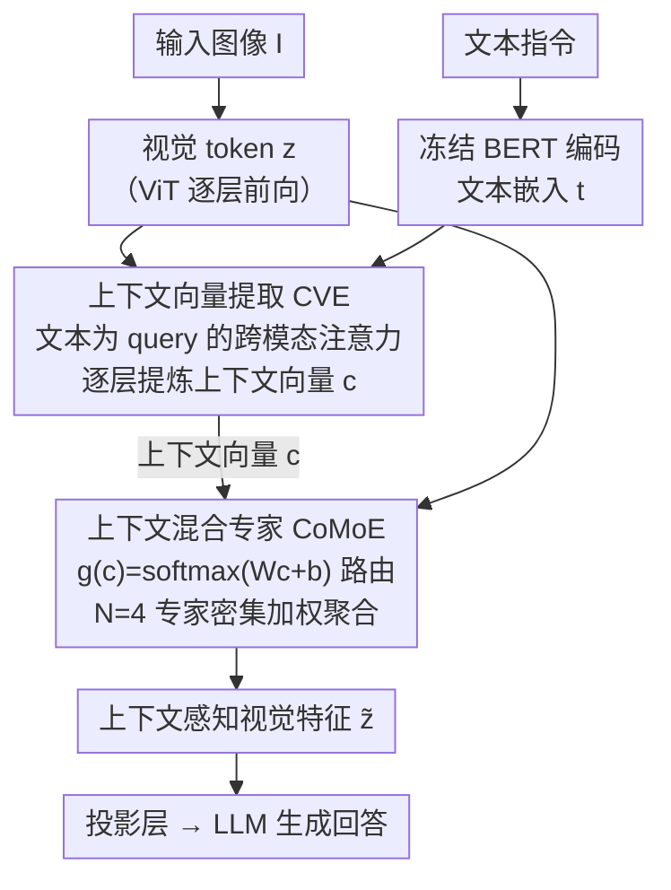

# CoVFT: Context-aware Visual Fine-tuning for Multimodal Large Language Models

**会议**: CVPR 2026  
**arXiv**: [2603.21077](https://arxiv.org/abs/2603.21077)  
**代码**: [https://github.com/weeknan/CoVFT](https://github.com/weeknan/CoVFT)  
**领域**: Multimodal VLM  
**关键词**: 多模态大模型, 视觉微调, 混合专家, 上下文感知, 视觉偏好冲突

## 一句话总结

发现 MLLM 中视觉编码器微调的"视觉偏好冲突"问题，提出 CoVFT 框架，通过上下文向量提取（CVE）和上下文混合专家（CoMoE）实现上下文感知的视觉微调，在 12 个多模态基准上达到 SOTA 且稳定性显著优于现有方法。

## 研究背景与动机

多模态大语言模型（MLLM）通常由视觉编码器 + 投影层 + LLM 三部分组成。在指令微调阶段，一个长期悬而未决的问题是：**视觉编码器应该冻结还是微调？**

现有实践的矛盾：
- InstructBLIP、LLaVA-1.5 选择冻结视觉编码器
- InternVL、Qwen-VL 选择联合微调
- 社区对此没有共识

作者通过受控实验发现了一个关键现象——**视觉偏好冲突（Visual Preference Conflicts）**：

1. 现有 VFT 方法（全参微调、LoRA、BitFit 等）**无法一致性地超越冻结基线**——虽然平均分可能更高，但在具体任务上波动很大
2. 根本原因：视觉编码器是**上下文无关的**——它只看图像，不看文本指令。但同一张图在不同任务下（如 grounding vs captioning）需要关注完全不同的视觉特征
3. 不同任务的梯度方向相互冲突，导致参数更新不稳定

证据：对同一数据集构建 grounding 和 captioning 任务，只改变文本查询。训练后两个视觉编码器的 L2 距离**持续增长**，且深层差异更大——证明不同认知需求确实"拉扯"了参数。

核心问题可形式化为：传统 VFT 建模的是 $p_{\theta_v}(\mathbf{z} | \mathbf{I})$，但 MLLM 需求的是 $p_{\theta_v}(\mathbf{z} | \mathbf{I}, \mathbf{c})$——视觉特征应依赖于多模态上下文。

## 方法详解

### 整体框架

CoVFT 要拆的死结是：标准视觉编码器只看图、不看文本指令，它建模的是"给定图像 $\mathbf{I}$ 的视觉特征" $p(\mathbf{z}|\mathbf{I})$；可同一张图，在 grounding 任务下要盯住物体位置、在 captioning 任务下要把握全图语义，需求的视觉特征截然不同。当这些任务的梯度被硬挤进同一套视觉参数时就会互相拉扯，微调反而比冻结更不稳。CoVFT 的破局思路是引入一个潜在上下文变量 $\mathbf{c}$，把视觉后验从 $p(\mathbf{z}|\mathbf{I})$ 扩展成 $p(\mathbf{z}|\mathbf{I}, \mathbf{c})$，让视觉编码"随任务上下文而变"。整体跑两步：先由 CVE 模块从图文信息里逐层提炼出上下文向量 $\mathbf{c}$，再由 CoMoE 模块拿这个 $\mathbf{c}$ 去调节视觉编码器内部的前馈计算，把本会互相冲突的优化信号按上下文分流到不同专家。

### 关键设计

**1. 上下文向量提取（CVE）：让视觉编码"知道"当前在做哪类任务**

视觉偏好冲突的根子在于视觉编码器是上下文无关的——它压根不知道这次要定位物体还是描述全图。CVE 要做的就是把这份"任务信号"提炼出来交给后续模块。具体做法是用一个冻结的 BERT 编码文本指令、得到文本嵌入 $\mathbf{t}$，然后在视觉编码器的若干层里，把当前视觉 token $\mathbf{z}$ 与文本嵌入 $\mathbf{t}$ 各自过一个轻量残差块 $f_{res}$（内含 GELU 激活的下投影-上投影结构），再做一次以文本为 query、以拼接后的多模态特征为 key/value 的跨模态注意力：

$$\mathbf{c}_i = \text{CrossAttn}(\hat{\mathbf{t}}_q, [\hat{\mathbf{z}}, \hat{\mathbf{t}}]_{k,v})$$

这里有两个刻意的选择。一是上下文向量跟着视觉编码器逐层同步更新，而不是另起一个推理阶段单独算一遍，省掉了额外前向开销；二是注意力以文本主导（文本当 query），保证抽出来的 $\mathbf{c}$ 反映的是"任务要什么"，而不是被视觉特征本身带跑。消融也印证了这点：text-only 上下文（60.55）明显好过 image-only（59.77），冲突确实主要由语言上下文驱动。

**2. 上下文混合专家（CoMoE）：把冲突的梯度按上下文分流，而不是硬塞进同一组参数**

有了 $\mathbf{c}$ 还不够，得让它真正改变视觉编码的行为。CoMoE 在 ViT 后半部分的层里，把单个 FFN 替换成 $N=4$ 个并行专家 $\mathcal{E}^n$（都从原始 FFN 复制初始化），再用上下文向量算一组路由权重 $\mathbf{g}(\mathbf{c}) = \text{softmax}(\mathbf{W}\mathbf{c}+\mathbf{b})$，对所有专家做密集加权聚合：

$$\tilde{\mathbf{z}} = \sum_{n=1}^N g^n(\mathbf{c})\,\mathcal{E}^n(\mathbf{z})$$

它能解冲突的关键全在反向传播：第 $n$ 个专家收到的梯度被自己的路由权重缩放，$\nabla_{\theta_e^n}\mathcal{L} = g^n(\mathbf{c})\cdot\frac{\partial\mathcal{L}}{\partial\tilde{\mathbf{z}}}\frac{\partial\mathcal{E}^n(\mathbf{z})}{\partial\theta_e^n}$。于是上下文相近的样本（比如一批 grounding）会落到相近路由、给同一批专家一致的更新；上下文不同的样本（grounding 与 captioning）则被分到不同专家、各自更新互不打架——本质上是把"同一组参数被多任务拉扯"拆解成"不同上下文走不同专家"。这里特意用密集路由（全专家激活）而非稀疏 top-k，是因为指令微调数据量有限，稀疏路由会让部分专家长期吃不到样本、训练不足；消融里 Dense（61.08）确实优于 Sparse@2（60.10）。

### 损失函数 / 训练策略

训练目标就是标准的 next-token prediction：

$$\mathcal{L}_{inst} = -\sum_{t=1}^T \log p_\theta(a_t | a_{<t}, \mathbf{Q}, \mathbf{I})$$

实际只解冻一小撮参数——CVE 模块、CoMoE 模块、以及 LayerNorm 统计量，视觉编码器其余权重全部冻结（可训练参数占比不到 5%）。两阶段配置上，预训练用 558K 图文对、只训投影层（lr=1e-3，batch=256）；指令微调用 665K 图文指令、联合训练 LLM + 投影层 + CoVFT 模块（lr=2e-5，batch=128）。

## 实验关键数据

### 主实验

LLaVA-1.5-7B 在 12 个多模态基准上：

| 方法 | General ↑ | Know.&OCR ↑ | Vision ↑ | Avg ↑ | 超越Freeze的任务数 |
|------|----------|------------|---------|------|-----------------|
| Freeze | 66.23 | 61.20 | 51.71 | 58.93 | — |
| Full fine-tuning | 66.69 | 61.29 | 52.17 | 59.29 | 6/12 |
| LoRA | 65.93 | 60.86 | 52.45 | 59.04 | 6/12 |
| BitFit | 66.14 | 61.58 | 53.10 | 59.57 | 9/12 |
| **CoVFT** | **67.04** | **61.93** | **55.81** | **61.08** | **12/12** |

关键数字：
- CoVFT 7B (61.08%) 超越了 Freeze 13B (61.43%) 的平均水平——仅优化不到 5% 的参数
- MMVP 上提升最为显著：从 28.00 (Freeze) 到 36.67 (+8.67)
- 在 13B 模型上也有效：CoVFT 达到 62.90%，超越 Full ft. (61.30%) 和 BitFit (61.43%)

### 消融实验

| 配置 | General | Know.&OCR | Vision | Avg | 说明 |
|------|---------|----------|--------|-----|------|
| 无上下文 (Full ft.) | 66.69 | 61.29 | 52.17 | 59.29 | 基线 |
| Image-only 上下文 | 66.60 | 61.69 | 53.17 | 59.77 | 文本信号缺失 |
| Text-only 上下文 | 66.84 | 61.86 | 54.73 | 60.55 | 文本比图像更关键 |
| Concat[I,T] | 66.78 | 61.79 | 54.56 | 60.44 | 简单拼接效果有限 |
| **CVE** | **67.04** | **61.93** | **55.81** | **61.08** | 跨模态注意力最优 |
| Random@2 路由 | 66.01 | 61.24 | 52.05 | 59.00 | 增参无效 |
| Uniform 路由 | 66.18 | 61.75 | 53.05 | 59.60 | 需要上下文条件 |
| Sparse@2 路由 | 66.63 | 61.78 | 53.60 | 60.10 | 可行但不如Dense |
| **Dense 路由** | **67.04** | **61.93** | **55.81** | **61.08** | 全专家激活最优 |

### 关键发现

1. **文本信号是关键**：Text-only 上下文 (60.55%) 远好于 Image-only (59.77%)，说明视觉偏好冲突主要由语言上下文驱动
2. **密集路由优于稀疏**：Dense > Sparse@2 > Uniform > Random@2，说明上下文条件的路由而非单纯增参数是有效的
3. **数据效率突出**：用 75% 的数据 + CoVFT 即可超越全量数据 + Freeze 基线
4. **跨架构泛化**：在 SigLiP、DINOv3 替换 CLIP，以及 InternVL 2.0 架构上均有效
5. **上下文向量空间有良好聚类结构**：PCA 可视化显示不同任务类型形成清晰聚类，路由权重相似度与上下文相似度相关系数 r=0.76

## 亮点与洞察

1. **问题定义精准**：首次将 MLLM 中 VFT 不稳定的原因归结为"视觉偏好冲突"，并通过受控实验提供了有力证据
2. **解决方案优雅**：CVE + CoMoE 的组合从根本上将上下文无关的视觉编码转为上下文相关，设计动机清晰
3. **实用价值高**：7B + CoVFT ≈ 13B + Freeze 的发现，意味着通过更好的视觉微调可以减少对大模型参数量的依赖
4. **实验极为全面**：12个基准、7B/13B、3种视觉编码器、InternVL 架构、数据效率分析

## 局限与展望

1. CVE 依赖额外的冻结 BERT 编码器——增加了推理时的计算开销，是否可以利用 LLM 自身的文本编码能力？
2. CoMoE 仅替换 ViT 后半部分的 FFN，深层 vs 浅层的最优分界点的选择依据不够透彻
3. 4 个专家是固定配置，未探索专家数量对不同任务复杂度的影响
4. 预训练阶段仍然冻结视觉编码器——在预训练中引入上下文感知是否能进一步提升？
5. 现有实验主要在 LLaVA 风格架构上验证，对 Q-Former 架构（如 InstructBLIP）的适用性未验证

## 相关工作与启发

- **LLaVA / LLaVA-1.5**：建立了简洁的 MLLM 范式和 VFT 基准
- **Cambrian-1**：也发现了 VFT 普遍有益但不稳定的现象，但未分析根因
- **MoE 在 NLP 中的应用**：稀疏 MoE 被广泛用于 LLM 扩展（如 Mixtral），本文将其引入视觉编码器且发现密集路由更优
- **SVPT**：在图像分类中的 SOTA PEFT 方法，但在 MLLM 中效果差于 Freeze——印证了视觉偏好冲突问题
- 启示：视觉编码器在 MLLM 中占比不到 5% 但影响巨大——是性价比最高的优化目标

## 评分

- 新颖性: ⭐⭐⭐⭐⭐ — 视觉偏好冲突的发现和上下文感知VFT的提出都是重要贡献
- 实验充分度: ⭐⭐⭐⭐⭐ — 12个基准、完整消融、多架构验证、数据效率分析
- 写作质量: ⭐⭐⭐⭐⭐ — 问题导向清晰，从观察到分析到方法一气呵成
- 价值: ⭐⭐⭐⭐⭐ — 对MLLM社区有直接指导意义，代码已开源

<!-- RELATED:START -->

## 相关论文

- [\[CVPR 2026\] LLaDA-V: Large Language Diffusion Models with Visual Instruction Tuning](llada-v_large_language_diffusion_models_with_visual_instruction_tuning.md)
- [\[CVPR 2026\] OddGridBench: Exposing the Lack of Fine-Grained Visual Discrepancy Sensitivity in Multimodal Large Language Models](oddgridbench_exposing_the_lack_of_fine-grained_visual_discrepancy_sensitivity_in.md)
- [\[CVPR 2026\] Fine-Grained Post-Training Quantization for Large Vision Language Models with Quantization-Aware Integrated Gradients](fine-grained_post-training_quantization_for_large_vision_language_models_with_qu.md)
- [\[CVPR 2026\] Phrase-Grounding-Aware Supervised Fine-Tuning for Chart Recognition via Side-Masked Attention](phrase-grounding-aware_supervised_fine-tuning_for_chart_recognition_via_side-mas.md)
- [\[CVPR 2026\] Taxonomy-Aware Representation Alignment for Hierarchical Visual Recognition with Large Multimodal Models](taxonomy-aware_representation_alignment_for_hierarchical_visual_recognition_with.md)

<!-- RELATED:END -->
