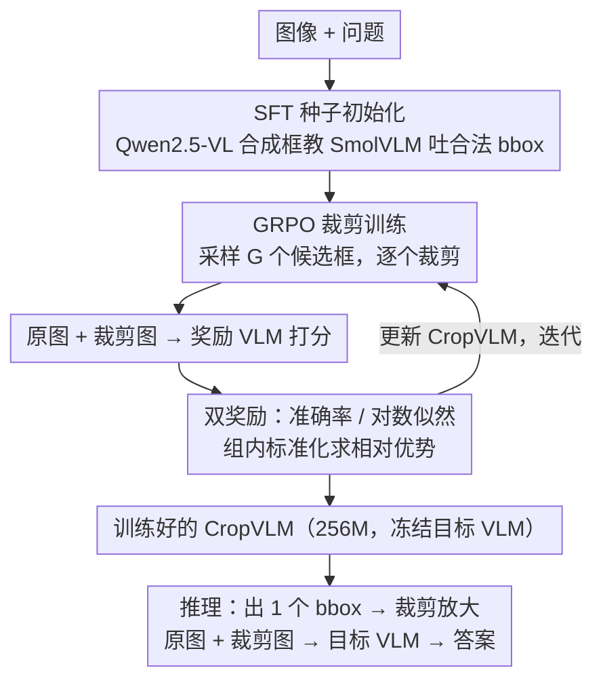

# CropVLM: Learning to Zoom for Fine-Grained Vision-Language Perception

**会议**: CVPR 2026  
**arXiv**: [2511.19820](https://arxiv.org/abs/2511.19820)  
**代码**: [GitHub](https://github.com/miguelscarv/cropvlm)  
**领域**: 多模态VLM  
**关键词**: 视觉裁剪, 强化学习, GRPO, 细粒度感知, 即插即用

## 一句话总结

提出CropVLM——一个256M参数的轻量裁剪网络，通过GRPO强化学习训练（无需人工标注边界框），动态选择图像最有信息量的区域供VLM聚焦，可与开源和商用VLM即插即用地提升细粒度视觉理解性能。

## 研究背景与动机

VLM在需要细粒度视觉感知的任务（文档分析、场景文字识别等）中受限于输入分辨率——LLaVA-1.5的336×336分辨率无法分辨小文字。均匀提高分辨率计算代价巨大且不必要（研究表明大多数请求只需少量image token即可回答）。

现有方法的局限：
- 架构修改（如Matryoshka、S2）需要大量重训练，有灾难性遗忘风险
- 不适用于商用模型（权重不可访问）
- ViCrop等无训练方法依赖注意力图/梯度，分布外泛化差
- UV-CoT使用DPO训练，需要合成偏好对，数据效率低

CropVLM的独特定位：轻量外挂模块，GRPO训练无需人工bbox，兼容开源/商用VLM。

## 方法详解

### 整体框架

CropVLM 想解决的是一个朴素但棘手的问题：VLM 看不清小目标，但把整张图喂到更高分辨率又太贵。它的思路是在目标 VLM 前面挂一个轻量"找重点"的模块——一个 256M 参数的 SmolVLM。给定图像和问题，这个小模块先输出一个边界框坐标，把原图对应区域裁出来放大；随后原图与放大后的裁剪图一起送进目标 VLM，由后者作答。整条链路里目标 VLM 的权重完全不动，CropVLM 只是替它把视线"对焦"到该看的地方，因此既能配开源模型，也能配只有 API 的商用模型。

难点在于：怎么教这个裁剪模块知道"哪里值得放大"？它没有人工标注的边界框可学，而且什么框算好，最终只能由下游 VLM 答得对不对来定义。下面三个设计正是围绕这条训练链展开的：先用 SFT 让小模型学会吐出合法的框，再用 GRPO 把"答得对不对"变成奖励去优化框，其中奖励本身又用双奖励设计来保证训练信号够密。

### 关键设计

**1. SFT 种子初始化：先让模型学会"按格式吐出一个框"，再交给 RL 优化**

SmolVLM 原本并不输出边界框格式，直接上 GRPO 等于让它在一片随机框里碰运气，几乎学不动。所以训练分两步走：先做一轮 SFT 冷启动，用 Qwen 2.5-VL 7B 生成一批合成边界框数据来教模型产出合法的 bbox 坐标（其中面积过小的框按百分位适当外扩，避免裁得太碎）。等模型具备了"生成有效框"这一基本能力，再进入 GRPO 阶段去打磨"框得好不好"。SFT 负责格式、RL 负责质量，两阶段各司其职。

**2. 基于 GRPO 的裁剪训练：把"答得对不对"直接变成裁剪的奖励**

人工标注边界框既贵，又未必是对模型最有用的框——人觉得显眼的区域不一定是 VLM 答题最需要看的地方。CropVLM 干脆绕开 GT 框，用强化学习让下游性能本身充当监督信号。对每个图像-问题对，裁剪模块采样 $G=6$ 个候选边界框，逐个裁剪后与原图一起送进奖励 VLM 打分，再在这一组 6 个分数内做标准化，得到每个候选的相对优势 $A_i=(r_i-\mathrm{mean}(r))/\mathrm{std}(r)$，据此更新裁剪模块。这样"好框"的定义不再是几何上贴合某个物体，而是"能让 VLM 把题答对"，训练目标和最终任务完全对齐，也省掉了任何额外的边界框标注或独立评估器。

**3. 双奖励设计：用对数似然奖励替准确率奖励，让更多样本能贡献梯度**

奖励 VLM 怎么给候选框打分？最直接的是准确率奖励——拿原图加裁剪图作答，对了给正分、错了给零分。但这种 0/1 信号太粗：一组 6 个候选很容易全对或全错，组内标准差为零、优势全是 0，这批样本就白跑了。为此论文加入对数似然奖励，直接取 VLM 对正确答案的 log-likelihood 当分数。它有两个好处：一是连续值，几乎不会出现组内奖励完全相同的情形，于是更多样本能产生非零优势、真正参与权重更新；二是只需一次前向传播算似然、不必生成完整答案，比准确率奖励更省算力。

### 损失函数 / 训练策略

- 两阶段：SFT（学习bbox格式）→ GRPO（优化裁剪质量）
- 所有训练在单张A100 GPU上完成，SFT约3小时，GRPO约24小时（2048px版本）
- 使用LoRA（rank 128, alpha 256）微调SmolVLM

## 实验关键数据

### 主实验（搭配不同VLM）

| 目标VLM | 无CropVLM | +CropVLM(2048) | 平均提升 |
|---------|-----------|----------------|----------|
| LLaVA 1.5 (336px) | 36.69 | 42.71 | +6.02 |
| Qwen 2.5 VL (448px) | 56.42 | 67.14 | +10.72 |
| GPT 4.1 nano (512px) | 41.27 | 47.41 | +6.14 |

### 对比其他裁剪方法

| 方法 | TextVQA | DocVQA | V* | HR-8k | 平均 |
|------|---------|--------|-----|-------|------|
| ViCrop (Qwen) | 74.15 | 72.27 | 53.40 | 46.00 | 59.67 |
| UV-CoT (Qwen) | 74.56 | 76.60 | 56.54 | 47.25 | 60.64 |
| CropVLM (Qwen) | 75.72 | 84.41 | 59.69 | 60.75 | 67.14 |

### 消融实验

| 配置 | 1024px平均 | 说明 |
|------|-----------|------|
| 基线SmolVLM | 44.55 | 无裁剪 |
| + SFT | 46.55 | 合成bbox训练 |
| + GRPO (准确率) | 49.75 | RL优化 |
| + GRPO (似然) | 50.89 | 似然奖励更优 |

### 关键发现

- CropVLM(1024px)搭配SmolVLM的性能超过基线SmolVLM(2048px)——低分辨率+智能裁剪优于高分辨率暴力处理
- 在分布外基准（V*、HR-Bench）上也有显著提升，说明裁剪策略泛化性好
- GPT 4.1 nano搭配CropVLM后拒绝回答的问题从31/191降至2/191
- 似然奖励一致优于准确率奖励

## 亮点与洞察

- 即插即用设计：无需修改目标VLM权重，甚至可用于商用API模型
- 极低成本：256M参数裁剪网络+单GPU训练，但提升显著
- GRPO训练的优雅之处：不需要GT bbox，不需要额外评估器模型，直接用下游性能作为奖励
- 证明了"裁剪"这个简单操作在VLM细粒度理解中的巨大价值

## 局限与展望

- 仅支持单次裁剪，多区域或多步推理未探索
- SmolVLM的数字输出词汇表受限（只有0-9数字），生成bbox坐标较慢
- 训练资源保守（单GPU、小group size），可能是性能下界
- 裁剪网络输入分辨率固定，未探索自适应分辨率策略

## 相关工作与启发

- **vs ViCrop**: 无训练方法依赖注意力图/梯度，分布外性能差；CropVLM学到的策略更鲁棒
- **vs UV-CoT**: DPO训练需249k偏好对+7B模型；CropVLM仅需62k数据+256M模型，更高效
- **vs DeepEyes/Mini-o3**: 多轮推理开销大；CropVLM单次裁剪即可，推理效率高

## 评分

- 新颖性: ⭐⭐⭐⭐ GRPO裁剪训练+即插即用设计在该领域新颖
- 实验充分度: ⭐⭐⭐⭐⭐ 多VLM、多基准、多方法对比、开销分析全面
- 写作质量: ⭐⭐⭐⭐ 方法简洁清晰，实验呈现规范
- 价值: ⭐⭐⭐⭐ 实用性极强的即插即用方案，低成本高回报

<!-- RELATED:START -->

## 相关论文

- [\[CVPR 2026\] DiG: Differential Grounding for Enhancing Fine-Grained Perception in Multimodal Large Language Models](dig_differential_grounding_for_enhancing_fine-grained_perception_in_multimodal_l.md)
- [\[CVPR 2026\] OddGridBench: Exposing the Lack of Fine-Grained Visual Discrepancy Sensitivity in Multimodal Large Language Models](oddgridbench_exposing_the_lack_of_fine-grained_visual_discrepancy_sensitivity_in.md)
- [\[CVPR 2026\] Chart-FR1: Visual Focus-Driven Fine-Grained Reasoning on Dense Charts](chart-fr1_visual_focus-driven_fine-grained_reasoning_on_dense_charts.md)
- [\[CVPR 2026\] TRivia: Self-supervised Fine-tuning of Vision-Language Models for Table Recognition](trivia_self-supervised_fine-tuning_of_vision-language_models_for_table_recogniti.md)
- [\[CVPR 2026\] SketchVL: Policy Optimization via Fine-Grained Credit Assignment for Chart Understanding and More](sketchvl_policy_optimization_via_fine-grained_credit_assignment_for_chart_unders.md)

<!-- RELATED:END -->
