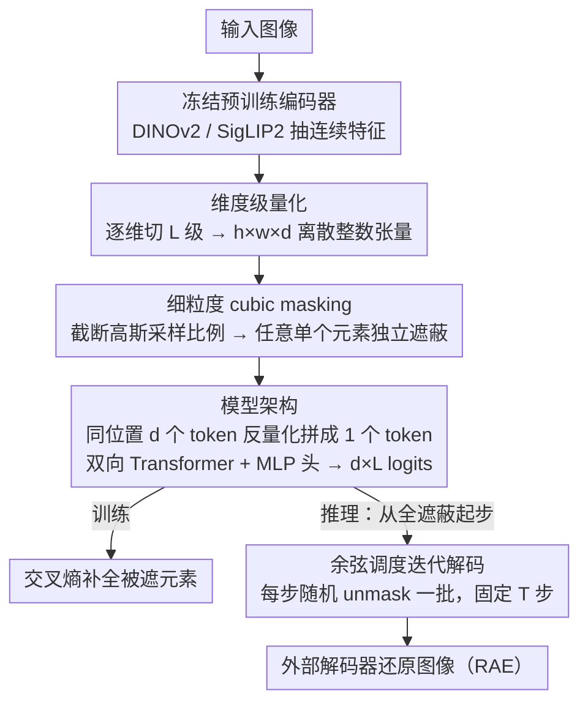

# Cubic Discrete Diffusion: Discrete Visual Generation on High-Dimensional Representation Tokens

**会议**: CVPR 2026  
**arXiv**: [2603.19232](https://arxiv.org/abs/2603.19232)  
**代码**: [GitHub](https://github.com/YuqingWang1029/CubiD)  
**领域**: 多模态VLM  
**关键词**: 离散扩散模型, 高维表征token, 视觉生成, 维度级量化, 统一多模态

## 一句话总结

提出 CubiD，首个在高维表征 token（768维）上做离散扩散生成的模型，通过在 $h \times w \times d$ 三维张量上进行细粒度 mask 预测实现高质量图像生成，同时保留理解能力。

## 研究背景与动机

**统一多模态建模的需求**：语言模型天然使用语义 token 进行理解和生成，但视觉模型存在割裂——理解用高维语义特征、生成用低维压缩 token（8-32维），阻碍统一架构。

**高维表征的重建优势**：近期研究（如 RAE）表明 768-1024 维的预训练表征特征可实现高质量重建，但其离散生成面临根本挑战。

**向量量化在高维空间失效**：传统 VQ 在高维空间遭遇维度灾难，数据稀疏导致聚类无效，码本规模需指数增长，量化特征偏移严重损害语义信息。

**维度级量化的可行性**：逐维度独立量化规避了联合量化的困难，且作为无训练方法可直接应用于冻结的预训练特征，但生成建模仍是瓶颈。

**现有生成方法的局限**：自回归需 $O(hwd)$ 步不可行，标准离散扩散无法建模位置内的维度依赖关系。

**核心洞察**：$h \times w \times d$ 张量具有天然的多维结构，可以打破空间位置的原子性约束，在整个三维空间中灵活操作。

## 方法详解

### 整体框架

CubiD 想解决的是「理解和生成用不同视觉表征」这个长期割裂：理解依赖 768 维的高维语义特征，生成却退回到 8–32 维的压缩 token。它的做法是让生成也直接发生在高维表征上，分两步走。第一步把冻结的预训练编码器（DINOv2 或 SigLIP2）抽出的连续特征离散化，得到一个 $h \times w \times d$ 的离散整数张量——空间上 $h \times w$ 个位置，每个位置内还有 $d$ 个独立的维度。第二步在这个三维张量上做离散扩散：训练时随机遮蔽一部分元素让模型补全，推理时从全遮蔽出发、分若干步迭代解码出完整图像。关键的转折在于，CubiD 不再把「一个空间位置」当成不可分割的原子，而是把遮蔽和预测的粒度下沉到三维张量里的**单个元素**。

### 关键设计

**1. 维度级量化：在高维空间绕开向量量化的维度灾难**

高维特征做离散生成的第一道坎是怎么量化。传统向量量化（VQ）把整个 $d$ 维向量映射到一个码本条目，但在 768 维空间里数据极度稀疏、聚类失效，码本规模要指数级膨胀才能覆盖，量化后的特征偏移又会严重损伤语义。CubiD 改成逐维度独立量化：对每个连续值单独切成 $L$ 个离散级别，

$$q_{x,y,i} = \text{Quantize}(z_{x,y,i};\, L)$$

DINOv2 取 $L=8$、SigLIP2 取 $L=16$ 就能逼近连续特征的重建质量。这种做法是无训练的，可以直接套在冻结的预训练特征上。它对语义的保留几乎无损：在 LLaVA 理解任务上维度级量化（DQ）的 GQA 是 63.1，对连续特征的 63.2 几乎持平，而向量量化（VQ）直接掉到 54.9。

**2. 细粒度 cubic masking：把遮蔽粒度从空间位置下沉到单个元素**

有了离散张量，怎么在上面做扩散是全文的核心。MaskGIT 这类方法的遮蔽单位是一整个空间位置——一旦遮蔽就把该位置的全部信息抹掉。但高维 token 的依赖关系既存在于位置之间、也存在于一个位置内部的各维度之间，按位置整块遮蔽就抹掉了「同位置内维度互相预测」的信号。CubiD 因此在 $h \times w \times d$ 张量里对**任意单个元素**独立遮蔽：训练时先从截断高斯分布

$$r \sim \text{TruncNorm}(\mu=1.0,\ \sigma=0.10,\ [0,1])$$

采样一个遮蔽比例 $r$，按比例随机选中若干元素替换成可学习的 [MASK] token，再让模型从未遮蔽的元素去预测被遮蔽的那些，用交叉熵优化：

$$\mathcal{L} = -\mathbb{E}\Big[\sum_{i \in \mathbf{M}} \log p(q_i \mid \mathbf{q}_{\bar{\mathbf{M}}})\Big]$$

举个具体的画面：某个空间位置原本有 768 个维度 token，cubic masking 可能只遮掉其中 300 个，留下的 468 个连同同一张图里其他位置的元素一起作为上下文，模型据此把那 300 个补回来——这是「位置内」依赖；而 MaskGIT 式的整位置遮蔽下，这 768 个要么全在、要么全没，根本学不到位置内部的关系。消融里 per-dim（只遮整维）gFID 高达 120、per-spatial（整位置）22，而 per-element 只有 5.33，量化了这个粒度选择的价值。

**3. 模型架构：序列长度只看空间、与特征维度解耦**

直接把 $h \times w \times d$ 个元素都铺成序列喂给 Transformer，序列长度会随 $d$ 爆炸。CubiD 的处理是：把每个空间位置内的 $d$ 个离散 token 反量化后拼回一个 $d$ 维向量，当作**一个** token，于是序列长度固定为 $h \times w$，和特征维度 $d$ 无关。主干是标准的双向注意力 Transformer，输出端用一个 MLP 预测头为每个位置产生 $d \times L$ 个 logits，对应该位置 $d$ 个维度、每个维度 $L$ 个候选级别的概率。这样既保住了元素级遮蔽的细粒度，又把计算量控制在和分辨率相称、而非和维度相称的量级上。

### 损失函数与推理

训练目标就是上面被遮蔽元素上的交叉熵（原文 Eq.3）。推理时从全遮蔽状态出发，按余弦调度迭代 unmask：每一步并行预测所有被遮蔽元素，再**随机**解开其中一批（要解开的数量由余弦调度决定，并非按预测置信度挑选），其余继续遮蔽，固定 $T$ 步后得到完整离散张量，再交给外部解码器还原成图像。这把原本需要 $O(hwd)$ 步的自回归生成压成了与 $d$ 无关的固定 $T$ 步并行迭代。

## 实验关键数据

### 主实验：ImageNet 256×256 生成

| 方法 | 维度 | 参数量 | gFID↓ (w/o cfg) | IS↑ | gFID↓ (w/ cfg) |
|------|------|--------|-----------------|-----|----------------|
| MaskGIT | 16 | 227M | 6.18 | 182.1 | 4.02 |
| CubiD-L (Ours) | 768 | 946M | 5.25 | - | - |
| CubiD-XXL (Ours) | 768 | 3.7B | 4.68 | - | 1.88 |

### 消融实验

| 消融项 | 设置 | gFID↓ |
|--------|------|-------|
| Masking 策略 | Per-dim / Per-spatial / **Per-element** | 120.03 / 22.22 / **5.33** |
| Mask token | Fixed / Random / **Learned** | 5.56 / 56.38 / **5.33** |
| 模型规模 | 946M / 1.4B / **3.7B** | 5.25 / 4.91 / **4.68** |
| 推理步数 | 64 / 256 / 512 | 9.14 / 5.33 / 5.25 |

### 关键发现

- 元素级 masking 是关键：Per-dim 完全失败（gFID=120），Per-spatial 模糊（gFID=22），证明高维 token 内外位置依赖不可分离
- 维度级量化保留理解能力：DQ 在 LLaVA 四个 benchmark 上与连续特征几乎一致
- 模型从 900M 到 3.7B 展现良好的缩放行为
- 跨编码器泛化：DINOv2（gFID=5.25）和 SigLIP2（gFID=5.87）均有效

## 亮点与洞察

- **首次**实现高维表征 token 的离散生成，打通理解与生成的统一表征
- 细粒度 cubic masking 设计优雅，将不可行的 $O(hwd)$ 问题转化为固定步数 $T$ 的并行迭代
- 实验验证了离散化高维 token 可同时服务理解和生成两个任务
- 消融实验充分展示了设计选择的必要性

## 局限性

- 当前仅在 ImageNet 条件生成上验证，未验证文本引导生成
- 依赖外部解码器（来自 RAE）将表征还原为图像
- 推理步数仍需数百步，效率有提升空间
- 未与最新连续扩散模型（如 DiT）深入比较 FID

## 相关工作与启发

- 与 MaskGIT 的关键区别在于 masking 粒度：CubiD 在维度级操作，而非空间位置级
- 与 RAE 互补：RAE 用连续扩散生成高维表征，CubiD 用离散扩散
- 与 TiTok 等低维离散生成方法的本质区别：CubiD 直接在预训练特征的原始维度上操作，保留语义完整性
- 为统一多模态架构（同一离散 token 用于理解 + 生成）奠定基础
- 维度级量化的成功验证对 VQ-VAE 领域有重要启示——高维空间不必做联合量化

## 评分
- 新颖性: ⭐⭐⭐⭐⭐
- 实验充分度: ⭐⭐⭐⭐
- 写作质量: ⭐⭐⭐⭐⭐
- 价值: ⭐⭐⭐⭐⭐

<!-- RELATED:START -->

## 相关论文

- [\[CVPR 2026\] Sparse-LaViDa: Sparse Multimodal Discrete Diffusion Language Models](sparse-lavida_sparse_multimodal_discrete_diffusion_language_models.md)
- [\[CVPR 2026\] Guiding Diffusion-based Reconstruction with Contrastive Signals for Balanced Visual Representation](guiding_diffusion-based_reconstruction_with_contrastive_signals_for_balanced_vis.md)
- [\[CVPR 2026\] WeMMU: Enhanced Bridging of Vision-Language Models and Diffusion Models via Noisy Query Tokens](wemmu_enhanced_bridging_of_vision-language_models_and_diffusion_models_via_noisy.md)
- [\[CVPR 2026\] VQRAE: Representation Quantization Autoencoders for Multimodal Understanding, Generation and Reconstruction](vqrae_representation_quantization_autoencoders_for_multimodal_understanding_gene.md)
- [\[CVPR 2026\] GroundingME: Exposing the Visual Grounding Gap in MLLMs through Multi-Dimensional Evaluation](groundingme_exposing_the_visual_grounding_gap_in_mllms_through_multi-dimensional.md)

<!-- RELATED:END -->
