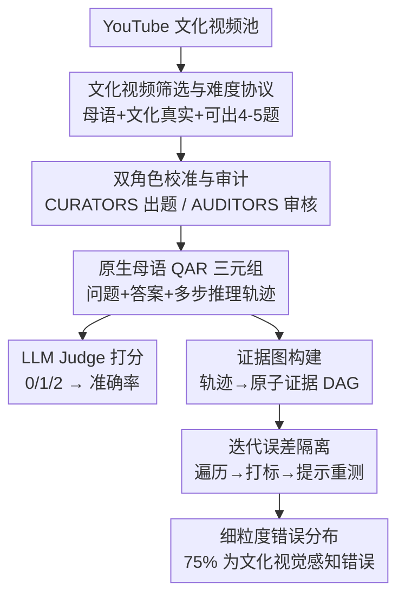

# CURVE: A Benchmark for Cultural and Multilingual Long Video Reasoning

**会议**: CVPR 2026  
**论文**: [CVF Open Access](https://openaccess.thecvf.com/content/CVPR2026/html/Singh_CURVE_A_Benchmark_for_Cultural_and_Multilingual_Long_Video_Reasoning_CVPR_2026_paper.html)  
**代码**: 待确认（作者承诺公开发布数据集）  
**领域**: 多模态VLM  
**关键词**: 视频理解, 多文化基准, 多语言, 长视频推理, 证据图诊断

## 一句话总结
CURVE 是一个完全由本地专家人工标注的多文化、多语言长视频推理基准（18 个地区/语言、540 个视频、2400 道题），并配套一套基于"证据图 + 迭代误差隔离"的细粒度错误诊断方法；评测显示最强模型 Gemini-2.5-Pro 聚合准确率仅 45%，远低于人类的 95%，且 75% 的失败源于对文化视觉元素的感知错误。

## 研究背景与动机
**领域现状**：长视频理解近年进展很快，出现了 Video-MME、MLVU、LongVideoBench、EgoSchema 等一批长视频问答基准，主流做法是采集视频、配上多项选择或开放式问题来测模型的感知与时序推理能力。

**现有痛点**：这些基准几乎全是"西方中心 + 英语为主"。少数想扩展语言覆盖的工作（如 xGQA、MaRVL、ViMUL-Bench）走的是**机器翻译英文标注**的捷径——语言换了，但视觉内容和文化情境仍停留在西方概念里，既引入翻译噪声，又测不出模型对真实文化语境的理解。另一个问题是它们大多只看**最终答案**对不对，无法定位模型究竟错在哪一步。

**核心矛盾**：要真正测"文化理解"，标注必须由**本地化、母语+本土文化双精通的专家**用母语原生创作，而不是翻译；而要诊断"错在哪"，单一的最终准确率太粗，需要把人类的多步推理过程结构化、逐节点比对——但一旦某一步错了，后续会连锁崩塌，"全惩罚会重复计错、只看第一处又丢失诊断信息"，这是个两难。

**本文目标**：(i) 造一个**非翻译、原生文化**的多语言长视频推理基准；(ii) 提供一套能逐步定位错误的诊断协议；(iii) 用它量化前沿模型与人类的差距及失败根因。

**切入角度**：每道题不仅有答案，还配一条**人工撰写的母语多步推理轨迹（reasoning trace）**。这条轨迹既是"为什么这样答"的依据，也是把模型推理拆开逐步对照的标尺。

**核心 idea**：用"原生母语标注的文化视频 + 把推理轨迹转成证据图 + 迭代式误差隔离"取代"翻译式标注 + 仅看最终答案"，从而既公平又可解释地暴露 VLM 在多文化视频推理上的短板。

## 方法详解
CURVE 本质是一个**基准 + 诊断协议**，没有训练新模型。它包含两条相对独立的"流水线"：一条是把视频和题目造出来的**人工标注 pipeline**（保证文化真实性和难度），另一条是评测时把模型错误定位到具体步骤的**证据图诊断 pipeline**。下面分别讲清这两条线，以及它们各自的关键设计。

### 整体框架
数据侧：18 个地区各招约 5 名本地专家，分成 CURATORS（出题人）和 AUDITORS（审核人）两组，经过"文化视频筛选 → 10% 样本校准 → 终稿标注与持续审计 → 人类评测"四阶段，产出 2400 道母语原生题，每题含 video、母语复杂问题、客观答案和一条人工多步推理轨迹。评测侧：用 LLM Judge（Gemini-2.5-Flash）给开放式回答 0/1/2 三档打分得到准确率；再把人类轨迹转成**证据图（DAG）**，用**迭代误差隔离**算法逐节点比对模型推理，把每一处失败打上细粒度标签。

### 关键设计

**1. 双角色人工标注 pipeline：用本地专家的对抗式协作保证文化真实性与难度**

最直接的痛点是"翻译式标注测不出文化理解、自动出题太容易"。CURVE 不用任何合成数据，而是为每个地区配 CURATORS（出题）和 AUDITORS（审核）两组本地专家，让二者形成对抗式协作。流程分四阶段：先由 AUDITORS 把"体育/美食/节庆/旅游/仪式/教育"六大文化域细化成本土子类（如日本某地特定节庆），据此从 YouTube 海量挖掘并按硬性清单人工筛选（必须母语音轨、有意义的视听内容、真实文化场景、时长 >1 分钟、足以支撑 4–5 道多步题）；再用 10% 样本做**校准**——一路是 Hardness Calibration，作者反复给反馈教专家"什么样的题才算难"（不能单帧解出、不能只靠音频、不能靠通用常识，必须扎根视频里的文化元素），另一路是 Correctness Calibration，独立 AUDITOR 在不看标准答案的情况下作答，与 CURATOR 不一致就触发对话式修订直至共识，无法达成共识的题直接丢弃；最后终稿阶段按分层采样平衡文化覆盖，并对 50% 数据做持续审计（独立重答 + 验证每题确实需要跨帧时序与文化 grounding）。这套"早期密集反馈 + 双盲互验"让数据质量和难度都被人手反复打磨，而不是靠模型自动生成。

**2. 原生母语多步推理轨迹：让每道题自带"为什么这样答"的标尺**

现有文化基准（如 ViMUL-Bench）只给最终答案，无法支撑细粒度诊断。CURVE 给每道题额外标注一条**母语原生的多步推理轨迹**——人类专家把"看到什么、查到什么、推出什么"写成几百词的详细过程（统计显示轨迹很长而答案很短）。每题强制要求至少两项推理技能（时序排序、目标推理、事件发生、阅读、聆听、空间感知、时序事件定位、计数、因果、数值推理、物体识别、反事实推理）外加一项**必选的"视觉文化理解"技能**。这条轨迹是后续证据图诊断的 ground truth，让评测从"答案对错"升级为"推理过程逐步可比"。

**3. 证据图（Evidence Graph）：把人类推理形式化成可逐节点比对的 DAG**

光有文本轨迹还不能机器化诊断。CURVE 用一个被 prompt 的 LLM 把非结构化的人类轨迹转成有向无环图：**节点是原子证据**（atomic evidence，即得出最终答案所需的单条关键信息，来源限定为三类——某个视频时间戳的视觉观察、外部知识检索的事实、由前序证据推出的逻辑推断），**边是前提依赖**（拿到父节点证据才能推出子节点）。统计上，平均每题需要约 5.0 个原子证据，其中超 63% grounded 在具体视频时间戳上，图深度 $\mu=2.5,\ \sigma=1.3$，说明题目混合了"独立取证（浅）"和"顺序推理链（深）"两类。这一步把模糊的"模型答错了"变成"模型在哪个证据节点上断链"。

**4. 迭代误差隔离（Iterative Error Isolation）：用反事实提示破解"连锁崩塌"两难**

一个错误会导致后续连锁失败：全惩罚会重复计错，只停在第一处又丢诊断信息。CURVE 用一个三阶段循环（Algorithm 1）来逐层揭露所有错误：**① 遍历**——prompt 一个 LLM 沿证据图 BFS，把每个节点的原子证据和模型推理逐一比对，某路径上证据缺失就在该节点停下；**② 错误隔离与打标**——遇到无法对应的证据，先判定是 Divergence（模型走了一条人类轨迹里没有但本身合理的替代路径，无法用人类图评判，仅占 2%）还是 Error（没分叉却产不出所需证据），对 Error 按细粒度 taxonomy 打标，区分感知类（时序定位、空间 grounding、属性误识、虚假物体/事件）、知识类、推理类；**③ 提示生成与重测**——对失败节点生成纠正性 hint（含正确证据），把证据图剪枝只留未评估节点，再带着"已正确收集的证据 + 新 hint"重新查询模型，与剪枝后的图比对。如此循环直到整条推理链被走通。这套**反事实纠错重入**的设计正是为了在"不重复计错"的同时"不放过被前序错误掩盖的后续错误"：实测最多跑 5 轮可解 99.7% 的题，并额外挖出约 22% 第一轮被掩盖的错误，尤其揭露了 78 处此前被感知失败遮住的推理错误。

### 损失函数 / 训练策略
本文是基准 + 诊断协议，不训练模型。评测协议要点：开放式回答用 Gemini-2.5-Flash 作 LLM Judge 打 0/1/2 三档分；诊断 pipeline（证据图构建、错误打标、hint 生成）统一用 Gemini-2.5-Pro 作 prompted LLM；人类基线由另一批本地评测者建立，允许用开放网络检索陌生文化实体但**严禁使用任何 LLM**，以保证是纯人类性能。

## 实验关键数据

### 主实验：18 个地区上的模型 vs 人类
评测两个开源（Qwen-2.5-VL、Qwen-3-VL）+ 五个闭源（Claude-Sonnet-4、GPT-5-mini、GPT-5、Gemini-2.5-Flash、Gemini-2.5-Pro）。Aggregate 为按地区加权平均。

| 模型 | 聚合准确率 | 最低地区(ta-IN 泰米尔) | 最高地区 |
|------|-----------|----------------------|---------|
| 人类基线 | **95.22** | 95.20 | 98.24 (it-IT) |
| Gemini-2.5-Pro | 45.07 | 31.60 | 64.29 (ko-KR) |
| GPT-5 | 42.20 | 26.40 | 56.34 (id-ID) |
| GPT-5-mini | 36.64 | 16.40 | 51.90 (ko-KR) |
| Gemini-2.5-Flash | 35.84 | 20.00 | 51.90 (de-DE) |
| Claude-Sonnet-4 | 23.36 | 15.60 | 30.97 (id-ID) |
| Qwen-3-VL | 21.50 | 12.40 (te-IN) | 34.58 (en-GB) |
| Qwen-2.5-VL | 12.75 | 3.60 | 25.70 (en-GB) |

最强模型与人类仍有约 **50 个百分点**的鸿沟。南印度语言上差距尤甚：Gemini-2.5-Pro 在 te-IN（泰卢固）仅 28.00%、ta-IN（泰米尔）31.60%，而在 ko-KR、en-GB 上表现明显更好——直接暴露了预训练语料的西方/英语偏置。

### 分析实验（在 6 地区子集上用 Gemini-2.5-Pro）

| 分析维度 | 设置 | 关键结果 |
|---------|------|---------|
| 音频重要性 | 音视频 vs 仅视频 | 加音频平均 **+4.32%**，zh-TW +8.15%、id-ID +7.09% |
| 思考预算 | 128→32k token | 35.9%(128) 升到峰值 **45.9%(2k)** 后饱和 |
| 时序复杂度 | 1→512 帧 | 准确率随帧数单调上升但很快递减，与人类仍有大 gap |

### 错误诊断（证据图，分析 Gemini-2.5-Pro / GPT-5 被判 0 分的题）

| 错误类别 | 占比 / 发现 |
|---------|------------|
| 文化视觉感知错误（时序定位+空间grounding+虚假物体/事件+属性误识） | **约 75%** 的全部失败 |
| 推理错误 | 显著少于感知错误 |
| 低资源 vs 高资源语言 | 低资源(ar-EG/ta-IN)文化视觉感知错误是高资源的 **1.4 倍** |
| 迭代隔离增益 | 跑满 5 轮解 99.7% 题，多挖出约 **22%** 被掩盖的错误（含 78 处潜在推理错误） |

### 关键发现
- **瓶颈不在视觉信息量，而在文化情境化推理**：帧数加到 512 仍远不及人类，说明模型缺的不是"看不到"而是"看懂文化语境后的推理"。
- **音频是非冗余的关键模态**：母语对白、文化特有音效带来稳定增益，证明 CURVE 真正需要"视听整体理解"而非只看画面。
- **测试时算力收益很快饱和**：2k token 后涨不动，靠堆推理预算补不上文化感知的硬伤。
- **迭代误差隔离不可或缺**：若只看第一处错误会漏掉约 22% 的失败，尤其是被感知失败遮蔽的推理错误。

## 亮点与洞察
- **把"翻译式多语言"彻底换成"原生母语标注"**：18 语言全部由本地专家用母语原生创作问题/答案/推理轨迹，连音轨都是母语，这是它与 ViMUL-Bench 等翻译派基准的本质区别，也是能测出真实文化偏置的前提。
- **证据图 + 迭代误差隔离是可迁移的诊断范式**：把"最终答案对错"升级成"逐原子证据比对 + 反事实纠错重入"，这套方法不止用于视频，任何带人类多步推理轨迹的任务（数学、Agent 规划）都能借鉴来定位"错在第几步、是哪类错"。
- **Divergence/Error 二分很巧**：先甄别"模型走了合理替代路径"（占 2%）再判错，避免把"换个正确解法"误判成错误，让诊断更公允。
- **75% 失败归因于文化视觉感知**这一定量结论，给"VLM 文化偏置"提供了可操作的改进靶点——优先补文化物体/事件的感知，而非堆推理算力。

## 局限与展望
- 作者承认：诊断 pipeline 依赖 Gemini-2.5-Pro 做错误分类与 hint 生成，**用 LLM 评 LLM**本身可能引入偏差（原文末尾正讨论这一点）。
- **感知错误与文化错误难以彻底解耦**：CURVE 强制每题带"视觉文化理解"技能、把所有错误归到文化语境下，但作者也坦言部分错误可能源于通用视觉局限而非文化 gap，二者纠缠是开放难题。
- 18 个地区"非穷尽"，框架虽可扩展但当前覆盖仍有限；⚠️ LLM Judge 与诊断 LLM 同为 Gemini 系，是否对 Gemini 系模型评分更宽松，论文未专门做交叉裁判的鲁棒性验证（以原文为准）。
- 改进方向：换用多个异构裁判模型做交叉验证、引入人工抽检校准 LLM Judge、把证据图诊断扩展到带音频证据节点的更细粒度分析。

## 相关工作与启发
- **vs ViMUL-Bench**：同样多语言多文化，但 ViMUL 混入通用视频且部分靠翻译、只看最终答案；CURVE 全人工原生标注、附多步推理轨迹、支持证据图细粒度诊断。
- **vs MINERVA**：MINERVA 也用人类轨迹做错误分类，但 CURVE 进一步把轨迹形式化成证据图并引入**迭代误差隔离**，能捕捉因果/时空依赖、用反事实 hint 逐层揭露被掩盖的错误。
- **vs Video-MME / MLVU / LongVideoBench**：这些是西方/英语中心的长视频基准，测时序与感知；CURVE 在长视频基础上叠加"原生文化语境"这一正交维度，暴露了它们测不出的文化偏置。

## 评分
- 新颖性: ⭐⭐⭐⭐⭐ 原生母语多文化基准 + 证据图迭代诊断，双重创新且角度稀缺
- 实验充分度: ⭐⭐⭐⭐⭐ 7 模型×18 地区主表 + 音频/帧数/思考预算/错误归因多维分析
- 写作质量: ⭐⭐⭐⭐ 动机与诊断方法讲得清楚，部分细节（taxonomy、统计）放补充材料
- 价值: ⭐⭐⭐⭐⭐ 给"VLM 文化偏置"提供可量化、可诊断的标尺，推动更公平的多模态模型

<!-- RELATED:START -->

## 相关论文

- [\[CVPR 2026\] Thinking With Videos: Multimodal Tool-Augmented Reinforcement Learning for Long Video Reasoning](thinking_with_videos_multimodal_tool-augmented_reinforcement_learning_for_long_v.md)
- [\[CVPR 2026\] REVISOR: Beyond Textual Reflection, Towards Multimodal Introspective Reasoning in Long-Form Video Understanding](revisor_beyond_textual_reflection_towards_multimodal_introspective_reasoning_in_.md)
- [\[CVPR 2026\] Select Less, Reason More: Prioritizing Evidence Purity for Video Reasoning](select_less_reason_more_prioritizing_evidence_purity_for_video_reasoning.md)
- [\[CVPR 2026\] MSJoE: Jointly Evolving MLLM and Sampler for Efficient Long-Form Video Understanding](msjoe_jointly_evolving_mllm_and_sampler_for_efficient_long-form_video_understand.md)
- [\[CVPR 2026\] QUANTIPHY: A Quantitative Benchmark Evaluating Physical Reasoning Abilities of Vision-Language Models](quantiphy_a_quantitative_benchmark_evaluating_physical_reasoning_abilities_of_vi.md)

<!-- RELATED:END -->
