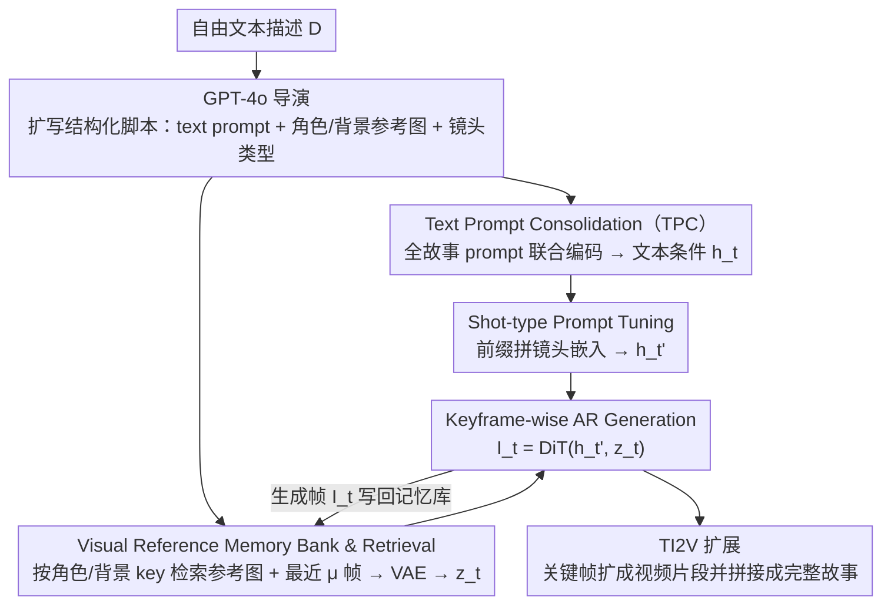

# Customized Visual Storytelling with Unified Multimodal LLMs

**会议**: CVPR 2026  
**arXiv**: [2603.27690](https://arxiv.org/abs/2603.27690)  
**代码**: 无（项目页面未明确提供）  
**领域**: 多模态VLM / 视觉叙事生成  
**关键词**: 视觉故事生成, 多模态定制, 统一多模态LLM, 镜头类型控制, 关键帧生成

## 一句话总结
提出 VstoryGen 框架和核心组件 CustFilmer，基于统一多模态大语言模型（UMLLM）实现多模态故事定制生成，支持文本描述、角色/场景参考图像和镜头类型的联合条件控制，并构建了 MSB 和 M2SB 两个新 benchmark。

## 研究背景与动机

**领域现状**：文本到视频生成领域进展迅速，但生成长序列连贯叙事视频仍是挑战。视觉故事生成方法（ConsiStory、StoryDiffusion、CharaConsist）主要依赖纯文本输入，少数支持角色 ID 保持。

**现有痛点**：(1) 现有方法仅使用文本输入，无法利用参考图像定制角色和场景；(2) 背景一致性常被忽视，仅关注前景角色；(3) 生成视角单调，缺乏电影感的镜头语言（远景/近景/特写等）；(4) 多角色交互场景生成能力不足。

**核心矛盾**：如何在保持角色和场景一致性的同时，实现灵活的多模态条件控制（文本+参考图+镜头类型）？

**本文要解决**：利用 UMLLM 的多模态理解和生成能力，构建支持丰富多模态条件的视觉叙事流水线。

**切入角度**：将 UMLLM 的图像编辑能力扩展为 keywise 自回归故事生成，通过结构化检索和镜头类型 prompt tuning 增强一致性和电影感。

**核心 idea**：UMLLM + 结构化多模态脚本 + 视觉参考记忆库 + 镜头类型 prompt tuning = 可定制的视觉叙事。

## 方法详解

### 整体框架
VstoryGen 要解决的是「从一句自由描述生成一整段镜头连贯、角色/场景一致、还带电影镜头语言的视觉故事」。它把这件事拆成三段接力：先让 GPT-4o 把用户的自由文本扩写成结构化脚本（每个镜头配好 text prompt、要复用的角色/背景参考图、以及镜头类型），再由核心组件 CustFilmer 逐帧生成一致的关键帧，最后交给现成的 TI2V（text-and-image-to-video）模型把每张关键帧扩成视频片段拼成完整故事。真正的技术贡献集中在中间的 CustFilmer——它把一个原本只会「单次图像编辑」的统一多模态大模型（UMLLM）改造成能一帧接一帧、带记忆地往下生成的故事生成器。在 CustFilmer 内部，每一帧走两条并行的条件分支：文本侧由 TPC 联合编码出 $h_t$、再被镜头类型嵌入前缀成 $h_t'$；视觉侧由记忆库检索出 $z_t$；两路在关键帧级自回归生成里汇合成 DiT 解码器的条件，出图 $I_t$ 又写回记忆库供后续帧检索，形成一条逐帧推进的回环。

### 关键设计

**1. Text Prompt Consolidation（TPC）：让一个故事的所有镜头描述共享同一段上下文**

如果把每个镜头的 prompt 单独丢给 LLM 编码，不同帧之间的角色、场景在嵌入空间里各说各话，生成出来很容易「换了个人」。TPC 的做法是把同一故事的全部 prompt $P=\{p_1,\dots,p_n\}$ 放进同一个 batch、在同一上下文窗口里联合自回归编码，得到一组 hidden states $H=\{h_1,\dots,h_n\}$。因为这些事件描述共享上下文，LLM 自身的上下文一致性会让它们的 hidden states 在语义和身份上自然对齐，后续每帧拿各自的 $h_t$ 去解码时，角色和场景的设定就被锁在了同一条基线上，而不是逐帧独立编码时的各自漂移。

**2. Visual Reference Memory Bank & Retrieval：用结构化检索而非模糊 embedding 找参考图**

光有文本一致还不够——角色长相、背景细节这些低层视觉信息得有图可依。本文维护一个 key-value 记忆库，key 是角色名/背景名这类脚本里明确标注的标识，value 是初始参考图（角色肖像、背景图）和已经生成出来的历史关键帧。生成第 $t$ 帧时，直接按脚本里这一镜头提到的角色/背景作为 query 去精确检索对应条目，再连同最近 $\mu$ 帧一起经 VAE 编码成视觉条件：

$$z_t = \text{VAE}\big[\mathcal{R}_t,\ \{\text{Scale}_\alpha(I_{t-i})\}_{i=1}^{\mu}\big]$$

这里刻意不用 embedding 相似度检索——那容易召回相近但不对的图、还不可解释；改用脚本标注的硬 key 检索，选哪张参考图清清楚楚。检索最近 $\mu$ 帧是为了让相邻镜头在时间上接得上，而缩放系数 $\alpha$ 控制历史帧注入的强度：越大越贴近历史（更一致）、越小越自由（更多样）。

**3. Shot-type Prompt Tuning：给不懂镜头语言的 UMLLM 注入构图先验**

通用 UMLLM 训练时没学过「远景/近景/特写」这套电影构图，直接让它生成镜头多样的画面会很单调。本文不去动庞大的基础模型，而是在 Condensed Movie Dataset（CMD）上只学一组镜头类型嵌入 $E_{\text{shot}}(k_t)\in\mathbb{R}^{d\times N}$，把它作为前缀拼在该帧 hidden state 前面：

$$h_t' = [\,E_{\text{shot}}(k_t);\ h_t\,]$$

这是典型的 prompt tuning——只有这组镜头嵌入可学习，基础模型一概冻结，4000 个迭代就能训完。代价极小却换来了对镜头类型的可控性，让同一故事能切出远景、近景、特写等多样视角，电影感就是从这里来的。

**4. Keyframe-wise Autoregressive Generation：把单次图像编辑改造成带记忆的逐帧生成**

标准 UMLLM 的图像编辑是「一问一答」式的单次操作，要生成连续故事就得反复多轮对话，既慢又会逐轮累积误差。本文把它改成关键帧级自回归：每一帧把前三步得到的文本条件 $h_t'$ 和视觉条件 $z_t$ 一起喂给 DiT 解码器直接出图，

$$I_t = \text{DiT}(h_t',\ z_t)$$

生成出来的 $I_t$ 又写回记忆库，成为后续帧检索的参考。用 VAE 编码参考图直接注入 DiT 这一步，保证了角色肖像、背景这些低层视觉信息能被原样带下去，而不是经过几轮对话被语言层稀释掉。

### 一个完整示例：生成一段三镜头小故事
假设用户输入「小女孩 Lily 在森林里遇到一只狐狸，最后成为朋友」：
1. **脚本阶段**：GPT-4o 扩成三镜头脚本——镜头 1（远景，Lily 走进森林）、镜头 2（近景，Lily 看见狐狸）、镜头 3（特写，两者对视），并标好每镜头复用 `Lily`、`森林` 这些 key；记忆库初始化存入 Lily 肖像图和森林背景图。
2. **第 1 帧**：TPC 把三句 prompt 联合编码出 $h_1$；按 key `Lily`/`森林` 检索到两张初始参考图（此时还没历史帧）编码成 $z_1$；拼上「远景」镜头嵌入得 $h_1'$；DiT 出图 $I_1$ 并写回记忆库。
3. **第 2 帧**：检索时除了 `Lily`/`森林` 的初始图，还召回刚生成的 $I_1$（最近 $\mu$ 帧），让 Lily 的长相和林子接得上；拼「近景」嵌入；出图 $I_2$ 再入库。
4. **第 3 帧**：同理召回 $I_1,I_2$ 保持一致，拼「特写」嵌入，出 $I_3$。三帧角色一致、背景连贯、景别各异，最后各自交给 TI2V 扩成视频片段拼成完整故事。

### 损失函数 / 训练策略
唯一需要训练的是 shot-type prompt tuning：在 CMD 电影数据上训 4000 迭代，只更新镜头嵌入，基础模型冻结。推理用 OmniGen2 作骨干 UMLLM，关键超参 $\alpha=0.75$、$d=2048$、$N=30$。

## 实验关键数据

### 主实验——MSB Benchmark（一致性指标）

| 方法 | 基础模型 | CLIP-I-fg (Inter)↑ | CLIP-I-bg (Inter)↑ | Avg Consistency↑ |
|------|---------|-------------------|-------------------|------------------|
| IP-Adapter | SDXL | 0.901 | 0.936 | 0.846 |
| ConsiStory | SDXL | 0.868 | 0.884 | 0.812 |
| StoryDiffusion | SDXL | 0.857 | 0.900 | 0.831 |
| CharaConsist | Flux.1 | 0.904 | 0.945 | 0.852 |
| **CustFilmer** | **OmniGen2** | **0.905** | **0.961** | **0.858** |

文本对齐与质量指标：

| 方法 | CLIP-T↑ | IAS↑ | IQS↑ | STA (镜头)↑ |
|------|--------|------|------|-----------|
| ConsiStory | **0.303** | 0.431 | 0.385 | 0.406 |
| CharaConsist | 0.265 | 0.448 | 0.415 | 0.247 |
| **CustFilmer** | 0.285 | **0.450** | **0.423** | **0.418** |

### 消融实验

| 配置 | Avg-Consistency↑ | 说明 |
|------|-----------------|------|
| 无 TPC + 无 Retrieval | 0.854 | 基线 |
| + TPC | 0.855 | 微弱提升 |
| + Retrieval | 0.856 | 微弱提升 |
| + TPC + Retrieval | **0.858** | 两者互补 |

$\alpha$ 参数消融：

| $\alpha$ | CLIP-T↑ | Avg-Consistency↑ | 说明 |
|---------|--------|-----------------|------|
| 0.125 | **0.289** | 0.850 | 多样性高但不一致 |
| 0.75 | 0.285 | 0.858 | 平衡选择 |
| 1.00 | 0.284 | **0.860** | 最一致但不够多样 |

### 关键发现
- CustFilmer 在整体一致性上最优，尤其是背景一致性 (CLIP-I-bg) 显著超越所有方法
- 镜头类型控制准确率 (STA=0.418) 远超非定制方法
- CLIP-T 略低于 ConsiStory 归因于不同骨干模型（SDXL 训练时用 CLIP encoder，天然优势）
- $\alpha=0.75$ 在一致性和多样性之间取得最佳平衡

## 亮点与洞察
- **完整的多模态故事流水线**：从自由文本描述→结构化脚本→关键帧→视频，端到端可用
- **镜头类型控制**：首次在视觉故事生成中引入电影镜头语言，显著增强叙事表现力
- **新 Benchmark 贡献**：MSB 和 M2SB 填补了多模态故事定制的评估空白
- **基于 UMLLM**：利用了统一多模态 LLM 的理解+生成能力，代表了故事生成的新范式

## 局限与展望
- 依赖 GPT-4o 做脚本生成（成本和延迟）
- TPC 和 Retrieval 带来的一致性提升幅度较小（0.854→0.858），设计的边际效益有限
- 多角色场景（M2SB）上优势不如单角色场景明显
- 未与最新的专用视频生成模型（如 Veo3）直接比较

## 相关工作与启发
- 与 CharaConsist 的对比表明，仅靠文本输入限制了定制灵活性
- UMLLM（特别是 OmniGen2）作为故事生成骨干是一个有前景的方向
- 镜头类型 prompt tuning 的思路可推广到其他需要构图控制的生成任务

## 评分
- 新颖性: ⭐⭐⭐⭐ 多模态定制+镜头控制的组合有创新，但各组件较增量
- 实验充分度: ⭐⭐⭐⭐ 新 benchmark+多基线对比+消融，但缺乏视频层面深入评估
- 写作质量: ⭐⭐⭐⭐ 结构清晰，方法描述详细
- 价值: ⭐⭐⭐⭐ 对视觉叙事生成领域有实际推动，benchmark 和框架可被后续工作采用

<!-- RELATED:START -->

## 相关论文

- [\[CVPR 2026\] TUNA: Taming Unified Visual Representations for Native Unified Multimodal Models](tuna_taming_unified_visual_representations_for_native_unified_multimodal_models.md)
- [\[CVPR 2026\] Widget2Code: From Visual Widgets to UI Code via Multimodal LLMs](widget2code_from_visual_widgets_to_ui_code_via_multimodal_llms.md)
- [\[CVPR 2026\] DuetSVG: Unified Multimodal SVG Generation with Internal Visual Guidance](duetsvg_unified_multimodal_svg_generation_with_internal_visual_guidance.md)
- [\[ICCV 2025\] Multimodal LLMs as Customized Reward Models for Text-to-Image Generation](../../ICCV2025/multimodal_vlm/multimodal_llms_as_customized_reward_models_for_text-to-image_generation.md)
- [\[CVPR 2026\] Visual-Aware CoT: Achieving High-Fidelity Visual Consistency in Unified Models](visual-aware_cot_achieving_high-fidelity_visual_consistency_in_unified_models.md)

<!-- RELATED:END -->
