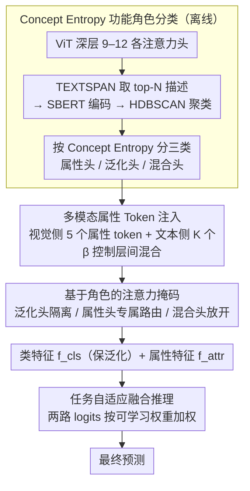

# DeAR: Fine-Grained VLM Adaptation by Decomposing Attention Head Roles

**会议**: CVPR 2026  
**arXiv**: [2603.01111](https://arxiv.org/abs/2603.01111)  
**代码**: [GitHub](https://github.com/wellsssssss/DeAR)  
**领域**: 多模态VLM  
**关键词**: Prompt Learning, VLM适配, 注意力头角色分解, CLIP, Zero-shot泛化

## 一句话总结

提出 DeAR，通过 Concept Entropy 指标将 ViT 深层注意力头分解为属性头/泛化头/混合头三类功能角色，并设计基于角色的注意力掩码机制精确控制信息流，在15个数据集上实现任务适配与零样本泛化的最佳平衡。

## 研究背景与动机

**CLIP 适配的核心挑战**：预训练 VLM 需要适配下游任务，但全微调导致灾难性遗忘，丧失强大的零样本泛化能力。

**现有 prompt learning 的层级观点过于简单**：现有方法假设浅层捕捉通用特征、深层处理任务特定知识，但这种层级视角忽略了层内各注意力头的功能多样性。

**不可控的 token 交互**：由于自注意力机制，插入的可学习 token 会与原始 token 不加区分地交互，任务特定知识可能破坏泛化核心。

**层级策略的矛盾**：MaPLe 注入早期层，MMRL 注入深层——冲突的策略揭示了缺乏细粒度的注入原则。

**可解释性研究的启发**：VLM 可解释性工作发现注意力头存在功能特化，为精细控制提供了理论依据。

**核心假设**：VLM 内部的功能特化不在层与层之间，而在深层各注意力头之间。

## 方法详解

### 整体框架

DeAR 想解决的问题是：给 CLIP 适配下游任务时，插入的可学习 token 会通过自注意力和原始视觉 token 无差别地交互，任务知识容易污染掉支撑零样本泛化的那部分表示。它的破题点是把"哪些表示该保护、哪些该改造"的判断下沉到**单个注意力头**的粒度上。整条 pipeline 分四步：① 先对 ViT 深层（9–12 层）的每个注意力头做一次"体检"，用 Concept Entropy 把头分成属性头 / 泛化头 / 混合头三类；② 从第 9 层起在视觉和文本两侧对称注入可学习的属性 token；③ 据每个头的角色给它定制一张注意力掩码，让属性 token 只去改造该改造的属性头、绕开该保护的泛化头；④ 推理时把保泛化的类特征（[CLS]）和任务特化的属性特征各自算出的 logits 按可学习权重融合，兼顾下游精度和零样本泛化。其中第①步是离线的一次性头分析，②–④ 才是在线的前向流程。

### 关键设计

**1. Concept Entropy 功能角色分类：用数据驱动的方式量出每个头"专不专一"**

现有 prompt learning 普遍把"浅层通用、深层任务特定"当成既定层级观，但这忽略了同一层内不同头的功能差异——有的头只盯颜色，有的头管全局语义。DeAR 不靠人工拍脑袋分类，而是对 ViT-B/16 后四层（9–12 层）的每个头先用 TEXTSPAN 生成 top-N 描述性文本，再经 SBERT 编码 + HDBSCAN 聚类，从数据中自动浮现出 12 个概念簇，再挑出颜色 / 形状 / 纹理 / 物体 / 位置这 5 类语义正交、对识别最关键的核心属性。一个头在这些概念簇上的概率分布 $P_{(l,h)}$，其香农熵就刻画了它的功能聚焦度：

$$H(P_{(l,h)}) = -\sum_j P_{(l,h)}(c_j) \log_2 P_{(l,h)}(c_j)$$

熵低说明这个头几乎只响应单一属性，归为**属性头**；熵高说明它在各概念上摊得很平、承担泛化功能，归为**泛化头**；介于两者之间的是**混合头**。这样得到的角色标签完全来自模型自身的响应统计，避免了主观划分，也为后续"按角色区别对待"提供了客观依据。

**2. 多模态属性 Token：在视觉与文本两侧对称注入并保持跨模态对齐**

有了头的角色图谱，还得有"被改造的对象"。DeAR 在视觉侧从第 $J=9$ 层起注入 5 个可学习属性 token（对应上面 5 类核心属性），并用 $\beta$ 参数控制每个 token 在层间传递时按 $\beta\,\mathbf{r}_{\text{attr}}+(1-\beta)\tilde{\mathbf{r}}_{\text{attr}}$ 混合原始 token 和上一层的语境化输出——$\beta$ 太小 token 会随语境"语义漂移"丢掉本义，太大又完全不吸收图像信息，折中后既能适配又守住属性含义。文本侧则对称地注入 $K$ 个可学习 token，确保图文两路的属性表示在同一语义空间里对齐——否则视觉端区分出的属性再精细，也无法和文本类名正确匹配。

**3. 基于角色的注意力掩码：给信息流装上"手术刀级"的闸门**

光注入 token 还不够，关键是要让它的影响精确落到该落的头上。DeAR 据角色给每个头打三种掩码 $\mathbf{M}$。对泛化头以及那些没被选为核心属性的其他专家头，做**严格隔离**：属性 token 与原始 token 之间的注意力被置为 $\mathbf{M}[i,j]=-\infty$ 完全屏蔽，这样新学的任务知识碰不到承载泛化的表示，零样本能力得以保全。对某个核心属性头，则把对应那一类属性 token **路由进这个专属专家头**、同时屏蔽其他属性 token，让"颜色 token"只去强化管颜色的头、互不串扰，实现聚焦学习。对混合头则放开，$\mathbf{M}[i,j]=0$ 允许所有 token 自由交互。举例来说，一个被判为"颜色头"的注意力头只接收颜色属性 token 的注入，形状、纹理等 token 对它一律不可见，而某个高熵泛化头则对所有属性 token 关闭大门——这种逐头定制的开闭，正是它和 MaPLe / MMRL 那种"整层一刀切注入"的根本区别。

**4. 任务自适应融合推理：让"保泛化"和"促适配"两路证据各取所需**

经过上述掩码控制后，模型同时产出两类特征：受掩码保护、几乎不被任务知识污染的类特征 $\mathbf{f}_{\text{cls}}$（来自 [CLS] token，偏泛化），以及 5 个聚焦各属性的属性特征 $\mathbf{f}_{\text{attr}}$（偏下游适配）。DeAR 不是简单相加，而是让两路各自和文本类名算出 logits 后，按一组可学习的标量权重 $\alpha_k$（经 softmax 归一化）加权求和得到最终预测。这组权重只在 base 类上学习、随后固定用于 novel 类，避免过拟合见过的类别。同时一个融合正则项 $\mathcal{L}_{\text{fusion}}=-\log(\alpha_{\text{cls}})$ 显式鼓励给类特征更高权重，防止模型过度依赖新学的属性特征而牺牲泛化——这一步是把前面"保护下来的泛化"和"学到的任务知识"在输出端做最后一次平衡。

### 损失函数

总目标由三项组成：

$$\mathcal{L}_{\text{total}} = \mathcal{L}_{\text{CE}} + \lambda_{\text{reg}} \mathcal{L}_{\text{reg}} + \lambda_{\text{fusion}} \mathcal{L}_{\text{fusion}}$$

其中 $\mathcal{L}_{\text{CE}}$ 是标准分类损失；$\mathcal{L}_{\text{reg}}$ 是自正则化项，约束适配后的特征不要偏离冻结 CLIP 的原始特征太远，进一步守住泛化；$\mathcal{L}_{\text{fusion}}$ 约束融合权重、鼓励推理时主特征保持较高权重，防止过度依赖新学的属性特征。

## 实验关键数据

### 主实验：Base-to-Novel 泛化（11个数据集平均）

| 方法 | Base Acc | Novel Acc | HM |
|------|----------|-----------|-----|
| CLIP | 69.34 | 74.22 | 71.70 |
| CoOp | 82.69 | 63.22 | 71.66 |
| MaPLe | 82.28 | 75.14 | 78.55 |
| PromptSRC | 84.26 | 76.10 | 79.97 |
| **DeAR (Ours)** | **84.50+** | **77.00+** | **80.60+** |

### 消融实验

| 组件 | 贡献 |
|------|------|
| 移除 Role-Based Mask | Novel 显著下降 |
| 移除属性 token | Base 和 Novel 均下降 |
| 移除融合正则化 | 过度依赖属性特征 |
| 仅用泛化头 mask | 可有效保护泛化 |

### 关键发现

- 属性条件图像检索验证了属性 token 确实捕捉了对应语义概念（颜色检索返回同色图像等）
- 在 15 个数据集上全面验证，包括域泛化和跨数据集迁移
- 该方法在保持 Base 性能的同时显著提升 Novel 类泛化

## 亮点与洞察

- 提出 Concept Entropy 从数据驱动角度量化注意力头的功能特化，避免主观分类
- Role-Based Attention Mask 设计极为精细，首次实现对 VLM 信息流的"手术刀级"控制
- 属性条件检索实验直观验证了设计的有效性
- 理论创新（头级功能分解）+ 工程实用（即插即用）兼具

## 局限性

- 分析仅针对 ViT-B/16，是否泛化到其他架构（如 ViT-L/14）待验证
- 属性类别（5类）是手动选择的，不同任务可能需要不同属性
- 增加了推理时的注意力掩码计算开销
- 仅在分类任务上验证，未扩展到检测/分割等任务

## 相关工作与启发

- 与 MaPLe、MMRL 等多模态 prompt learning 方法相比，DeAR 首次引入头级别功能分析
- 与 ATPrompt 的属性结构有交集，但 DeAR 通过注意力掩码实现更精细的控制
- Skip Tuning 思路相关但操作粒度不同（层级 vs. 头级）
- 对 VLM 内部机制的分析为后续可解释性研究提供了新视角

## 评分
- 新颖性: ⭐⭐⭐⭐⭐
- 实验充分度: ⭐⭐⭐⭐⭐
- 写作质量: ⭐⭐⭐⭐⭐
- 价值: ⭐⭐⭐⭐

<!-- RELATED:START -->

## 相关论文

- [\[CVPR 2026\] Concept-wise Attention for Fine-grained Concept Bottleneck Models](coat_cbm_concept_wise_attention.md)
- [\[CVPR 2026\] IsoCLIP: Decomposing CLIP Projectors for Efficient Intra-modal Alignment](isoclip_decomposing_clip_projectors_for_efficient_intramodal_alignment.md)
- [\[CVPR 2026\] MA-Bench: Towards Fine-grained Micro-Action Understanding](ma-bench_towards_fine-grained_micro-action_understanding.md)
- [\[CVPR 2026\] CropVLM: Learning to Zoom for Fine-Grained Vision-Language Perception](cropvlm_learning_to_zoom_for_fine_grained_vision_language_perception.md)
- [\[CVPR 2026\] EagleNet: Energy-Aware Fine-Grained Relationship Learning Network for Text-Video Retrieval](eaglenet_energy-aware_fine-grained_relationship_learning_network_for_text-video_.md)

<!-- RELATED:END -->
