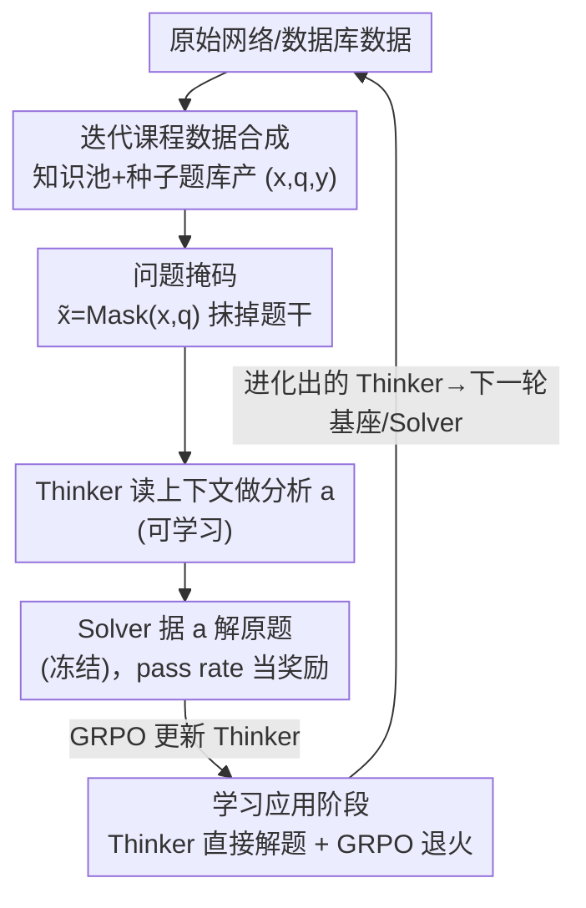

# Decouple to Generalize: Context-First Self-Evolving Learning for Data-Scarce Vision-Language Reasoning

**会议**: CVPR 2026  
**论文**: [CVF Open Access](https://openaccess.thecvf.com/content/CVPR2026/html/Li_Decouple_to_Generalize_Context-First_Self-Evolving_Learning_for_Data-Scarce_Vision-Language_Reasoning_CVPR_2026_paper.html)  
**代码**: 无（论文未公开仓库）  
**领域**: 多模态VLM  
**关键词**: 视觉语言推理, 强化学习, 自进化LVLM, 数据稀缺, 课程学习  

## 一句话总结
针对化学、地球科学、多模态数学这些缺高质量标注的专业领域，DoGe 把 VLM 的强化学习自进化拆成"认知过程解耦"（先让 Thinker 抛开题目只读上下文做分析、再让它解题）和"数据解耦"（知识池 + 种子题库的迭代课程合成）两条线，用一个两阶段 RL 循环避免合成数据导致的 reward hacking 和熵塌缩，3B/7B 模型在 7 个 benchmark 上平均提升 5.7% / 2.3%。

## 研究背景与动机
**领域现状**：用 RL 后训练（GRPO 这类）让 VLM 生成长链推理，已经成了"经验时代"实现自进化大模型的主流路径——模型自己产数据、自己拿奖励、迭代变强。

**现有痛点**：这条路死死绑在"有大量高质量多模态数据"这个前提上。化学、地球科学、多模态数学这些高价值专业领域，人工标注领域知识语料和设计高质量推理题成本极高。于是大家退而求其次用**合成数据**和**自奖励机制**，但合成的多模态题目会收敛到狭窄、重复的分布，自奖励又大多只在视觉感知层面发力，训练目标和专业领域的推理任务对不齐。

**核心矛盾**：作者指出一个更深的病根——绝大多数方法只用"问答对 + 规则判对错"来监督，即"答题—拿奖励"范式**完全忽略了题干里丰富的上下文信息**。在合成题分布本就有限的情况下，模型没有动力去真正理解领域知识，反而被激励去钻奖励相关的捷径（reward-associated shortcuts），结果就是经典的 **reward hacking**：策略熵塌缩、探索能力枯竭，泛化无从谈起。

**本文目标**：让 VLM 在数据稀缺的专业领域也能稳定自进化，既不被合成数据的窄分布卡死，又不掉进 reward hacking。

**切入角度**：作者借了心理学里人类认知的逻辑——人是先"学习"（理解情境与知识）再"应用"（解决问题），而不是上来就刷题。对应到 RL，就是应该先逼模型去消化那些被忽略的**上下文**，再去解题。

**核心 idea**："Decouple to Generalize"——用双重解耦换泛化：① 把策略模型解耦成 Thinker（读上下文做分析）和 Solver（据分析解题），用 Solver 的解题成功率反过来给 Thinker 的分析打分；② 把数据生产解耦成"知识池 + 种子题库"的迭代课程，持续扩充训练分布的多样性。

## 方法详解

### 整体框架
DoGe（Decouple to Generalize）建在多模态 GRPO 之上，要解决的是"数据稀缺领域里 RL 自进化会 reward hacking"这个问题，整体思路是**双重解耦**：一条线解耦**认知过程**（把一轮训练拆成 Thinker 先学上下文、再学应用的两阶段 RL），另一条线解耦**数据生产**（知识池产知识、种子题库迭代产难题）。

每一轮 $t$ 开始时，Thinker 和 Solver 都从上一轮的基座模型初始化：$\pi_T^{(t)} = \pi_S^{(t)} \leftarrow \pi^{(t)}$。训练样本是三元组 $(x, q, y)$——多模态上下文 $x$、问题 $q$、答案 $y$。整轮训练走完后，进化出的 Thinker 又会成为下一轮的基座 / Solver，形成"学习—应用—内化"的闭环。数据侧的知识池与种子题库则持续给这个闭环喂多样化的训练题。

### 关键设计

**1. Thinker–Solver 双解耦 + 问题掩码：把"读懂上下文"单独拎出来奖励**

针对"答题—拿奖励"范式忽略题干上下文、逼模型走捷径这个病根，DoGe 从同一个基座 VLM 派生出两个功能角色：Thinker $\pi_T(a|\tilde{x})$ 负责上下文分析，Solver $\pi_S(\hat{y}|x,q,a)$ 负责据分析解题。关键招数是**问题掩码** $\tilde{x} = \mathrm{Mask}(x, q)$——把题目和直接答案线索全抹掉，只留情境信息（比如化学题只留分子结构图、图表题只留图本身）。Thinker 在看不到具体问题的情况下，被迫去**深挖这张图/这段上下文到底讲了什么领域知识**，产出一段文字分析 $a$，而不是盯着题目找答案模式。

这一步妙在**怎么给"理解上下文"这种没有标准答案的东西打分**：作者用一个冻结的同款模型当 Solver，让它拿着 Thinker 的分析 $a$ 去解原题，用解题成功率当作 $a$ 好坏的量化奖励。Solver 解得越准，说明 $a$ 抓到的上下文越有价值、越深——这就把"分析质量"这件虚的事，落到了"下游解题 pass rate"这件实的事上，构成一个自监督反馈回路。

**2. 两阶段 RL：从"自由探索上下文"退火到"踏实解题"，并自举进化**

光会分析上下文不会解题没用，所以一轮训练分两段。**阶段一 Learning from Context**：固定 Solver、只训 Thinker。Thinker 对掩码输入采样一组候选分析 $a_k \sim \pi_T^{(t)}(\cdot|\tilde{x})$，奖励为
$$r_{\text{context}} = \mathbb{E}_{\hat{y}\sim\pi_S^{(t)}(\cdot|x,q,a_k)}\big[\mathbb{1}[\hat{y}=y] + \beta\cdot r_{\text{format}}(\hat{y})\big]$$
其中 $\mathbb{1}[\hat{y}=y]$ 是 Solver 解对原题的 0/1 正确性，$r_{\text{format}}$ 检查输出是否符合 `<think>...</think>` + 最终答案的格式（0/1），$\beta$ 是格式奖励权重。实现上对每个问题 Thinker 采 4 个分析、每个分析再让 Solver 出 4 个答案来估计奖励。

**阶段二 Learning from Application**：让训好的 Thinker $\pi_T^{(t+1)}$ 直接去解原题（不再掩码），把上一阶段学到的上层思维内化成真正的解题能力，奖励就是答对与否加格式：
$$r_{\text{app}} = \mathbb{E}_{\hat{y}\sim\pi_T^{(t+1)}(\cdot|x,q)}\big[\mathbb{1}[\hat{y}=y] + \beta\cdot r_{\text{format}}(\hat{y})\big]$$
作者把这一步称为 GRPO **退火（annealing）**——先用阶段一把策略熵抬高、探索打开，阶段二再收敛到解题。两阶段都用 GRPO 优化。最后阶段二更新出的参数 $\pi_T^{(t+1)\prime}$ 拿去初始化下一轮的 Solver，整个系统**自举（self-bootstrap）**：更强的 Thinker 给出更强的上下文理解，又托举出更强的 Solver，逐轮泛化能力滚雪球。这正是它对抗 reward hacking 的机制——先把熵抬起来再退火，避免基线那种一上来熵就塌、探索枯竭的窘境（实验里得到验证）。

**3. 迭代课程数据合成：知识池 + 种子题库，持续扩多样性**

光有认知解耦，数据分布太窄还是会过拟合，所以第二条解耦线专门造数据。**多模态知识池（Multimodal Knowledge Pool）**：用工具从网络和数据库爬大量无标注的文本/多模态原始数据，按信息密度分成 information rich / information poor；对信息贫乏的样本（比如只有一张图加拍摄日期），先调 Gemini-2.5-Flash 生成专家级分析报告把信息补全，缺图的样本则调工具生成图像。补全后的样本进入知识池，再由 SOTA LVLM 合成推理问答对。

**种子题库（Seed Problem Pool）**：存"模型偶尔能做对"的题。每轮迭代后用当前策略 $\pi_\theta$ 在训练集上算 pass rate，挑出 $0.1 \le \text{pass rate} \le 0.3$ 这种**难度适中、有学习价值**的题更新种子库，下一轮从库里采样合成更有挑战性的变体题。这套"知识池产知识 → 合成题 → 按 pass rate 筛种子 → 再合成变体"的循环，对应人类"从世界学知识 → 设计难题 → 内化为能力"的过程，持续给两阶段 RL 喂多样且难度匹配的数据。

### 损失函数 / 训练策略
两阶段都用 GRPO，训练码改自 verl 框架，8×A100。基座为 Qwen2.5VL-3B / 7B-Instruct。Thinker（阶段一）训 100 步、退火（阶段二）训 150 步（7B 两阶段均 150 步）；train batch size 分别 64 / 48，最大回复长 4096；阶段二每题采 8 个回复、阶段一采 4 个分析×每个 4 个答案估奖励。借鉴 DAPO 解耦了 clip 的 $\epsilon$，两阶段用不同值。共跑 3 轮迭代；另外对基座先做 15 步只给格式奖励的 RL 以改善指令遵循。

## 实验关键数据

### 主实验
7 个 benchmark，分两类：专业稀缺领域（MathVision、MathVista、ChemBench、MSEarthMCQ）与通用视觉推理及幻觉（MMMU、MMStar、HallBench）。Iter1–3 取每个 benchmark 的最优。

| 模型 | MMMU | MMStar | HallBench | MathVision | MathVista | ChemBench | MSEarthMCQ | Avg. |
|------|------|--------|-----------|------------|-----------|-----------|------------|------|
| Qwen2.5VL-3B*（基座） | 41.0 | 49.3 | 60.6 | 18.7 | 48.8 | 43.4 | 40.8 | 43.2 |
| Visionary-3B | 40.7 | 50.5 | 59.8 | 17.1 | 54.7 | 40.8 | 38.2 | 43.1 |
| **DoGe-3B (Iter3)** | **50.2** | 54.7 | 61.8 | 24.2 | 57.0 | 46.9 | 47.3 | **48.9** |
| Δmax vs 基座 | +9.2 | +5.4 | +1.9 | +5.5 | +9.1 | +4.3 | +7.5 | **+5.7** |
| Qwen2.5VL-7B*（基座） | 49.9 | 60.7 | 66.3 | 23.6 | 64.1 | 48.6 | 43.3 | 50.9 |
| Vision-R1-7B | 46.9 | 60.8 | 66.7 | 29.0 | 68.5 | 46.0 | 44.1 | 51.7 |
| **DoGe-7B (Iter3)** | 53.6 | 63.0 | 68.0 | 25.2 | 68.3 | 48.5 | 45.8 | **53.2** |
| Δmax vs 基座 | +3.7 | +2.5 | +2.0 | +1.7 | +4.7 | +0.4 | +3.2 | **+2.3** |

3B 系列平均 +5.7%、7B 系列平均 +2.3%，且 7 个 benchmark 全面提升。值得注意的是 HallBench（幻觉）平均涨 2.0%——作者归因于阶段一抹掉题目、强迫模型分析视觉上下文，缓解了"靠文本先验答题"的毛病。ChemBench 是纯文本数据集，DoGe 在上面也没退步，说明它没像以往 VLM 的 RL 那样损害文本推理能力。

### 消融实验
对照"DoGe 完整两阶段" vs "w/o DoGe（直接 naive GRPO）"，3B 模型：

| 配置 | Iter1 Avg. | Iter2 Avg. | Iter3 Avg. | 说明 |
|------|-----------|-----------|-----------|------|
| Our Method（DoGe） | **48.0** | **47.9** | **48.9** | 完整两阶段解耦 RL |
| ⊢ w/o DoGe（naive GRPO） | 47.2 | 47.8 | 48.6 | 去掉两阶段、直接 GRPO |

每轮 DoGe 都稳压基线，差距在多模态数学、通用推理这类推理密集任务上更明显。更关键的是**多轮稳定性**：naive GRPO 在 Iter2 容易因低质量数据触发 reward hacking、策略熵下降、能力受损，波动大；DoGe 因为无害地扩了策略熵，即便数据质量有波动也能稳定爬升。

### 关键发现
- **策略熵是核心证据**：先训 Thinker 再退火，能显著抬高后续 RL 的初始策略熵并在训练全程维持更高熵（Figure 4，3 轮 EMA 平滑）。基线则熵过低、探索枯竭，学不到可泛化的推理范式——这直接解释了"为什么解耦能防 reward hacking"。
- **数据质量敏感性下降**：DoGe 把模型对训练数据质量的敏感性降下来了，这对"只能靠合成数据"的稀缺领域格外重要。
- **Thinker 输出质量可验证**：用 Gemini-3.0-Flash-Thinking ⚠️（原文如此，以原文为准）当裁判按严格标准打分，Thinker(Iter1) 的分析比基座幻觉更低、更数据驱动（Figure 5/6 的定性案例：基座对地球图像做"表面臆测"，Thinker 给出基于数据的理性推断）。

## 亮点与洞察
- **"问题掩码"是点睛之笔**：把题目抹掉、只留上下文，强迫模型从"找答案模式"切换到"理解知识"，一举同时治了 reward hacking 和文本先验幻觉两个病——一个简单操作撬动两个核心问题，很巧。
- **用 Solver pass rate 给"无标准答案的分析"打分**：理解上下文这件事本来无法直接评判，作者用"下游解题成功率"做代理奖励，把虚的能力评估锚到实的可验证信号上，这个 reward 设计思路可迁移到任何"中间表示难评分"的场景（如检索 query 改写、规划草稿评估）。
- **先抬熵再退火的两阶段范式**：阶段一自由探索上下文天然把策略熵顶高，阶段二再收敛解题，相当于给 RL 内置了一个抗坍缩的"预热"，对所有容易熵塌缩的 RLVR 训练都有借鉴价值。
- **认知科学的"学习—应用—内化"映射**：把心理学的人类认知循环直接结构化成 RL 的两阶段 + 自举，提供了一个有解释力的设计模板。

## 局限与展望
- **Solver 冻结于本轮起点，能力有上限**：阶段一的奖励完全由冻结 Solver 的解题率决定，若基座在该领域本就很弱，Solver 给的奖励信号噪声大，Thinker 学到的"好分析"可能也偏（作者未深入讨论这一耦合风险）。
- **7B 的增益明显小于 3B**（+2.3% vs +5.7%），且 7B 在 MathVision、ChemBench 上几乎打平基线——方法的边际收益随基座变强而递减，对更大模型是否还成立存疑。
- **重度依赖外部强模型**：知识池补全用 Gemini-2.5-Flash、评测裁判用 Gemini-3.0-Flash，合成问答对也靠 SOTA LVLM——所谓"自进化"其实站在大模型蒸馏的肩膀上，真正零外部依赖的自进化还没验证。
- **流水线复杂、超参多**：双解耦 + 两阶段 + 课程迭代 + DAPO 式 clip 解耦，工程复杂度高，论文很多细节甩到 Appendix，复现门槛不低（且无公开代码）。
- 改进方向：让 Solver 也随轮次软更新（而非硬冻结）、把 pass-rate 难度筛选区间自适应化、探索不依赖闭源大模型的知识池构建。

## 相关工作与启发
- **vs Vision-R1 / OpenVLThinker（RL 多模态推理）**：它们走"合成 CoT 冷启动 + GRPO 刷题"的答题—奖励范式；DoGe 指出这套忽略题干上下文、易 reward hacking，改成先掩码学上下文再解题。主实验里 DoGe-7B 平均分压过 Vision-R1-7B（53.2 vs 51.7），但 Vision-R1 在 MathVision/MathVista 上更强，说明 DoGe 优势主要在稳定性与跨领域泛化而非单点峰值。
- **vs Vision-SR1（自奖励 RL）**：自奖励多用于强化视觉感知、对齐目标和专业推理任务对不齐；DoGe 的 Solver-pass-rate 奖励直接锚定下游解题正确性，与推理任务天然对齐。
- **vs Training-Free GRPO（免训自进化）**：后者把学习从参数空间搬到上下文空间、靠外部文本经验库，零训练成本；DoGe 仍是参数更新派，但同样强调"上下文"的价值，二者在"重视 context"上殊途同归。
- **vs 课程学习类方法**：DoGe 的种子题库挑 $0.1\le\text{pass rate}\le0.3$ 的"偶尔能做对"题，沿用了课程学习"挑适中难度加速 RL"的思路，但把它嵌进了自进化的数据合成闭环里。

## 评分
- 新颖性: ⭐⭐⭐⭐ "context-first + 双解耦"把 reward hacking 的病根定位到"忽略题干上下文"，问题掩码 + Solver-as-reward 的组合确实新颖。
- 实验充分度: ⭐⭐⭐⭐ 7 benchmark、3B/7B 双尺度、3 轮迭代 + 熵分析 + 定性案例，较扎实；但缺与更多自进化 SOTA 的横比，7B 增益偏弱。
- 写作质量: ⭐⭐⭐ 认知科学叙事清晰，但公式编号有小瑕疵、关键超参与 GRPO 细节大量甩到 Appendix，部分裁判模型名疑似笔误。
- 价值: ⭐⭐⭐⭐ 为数据稀缺专业领域的 VLM 自进化提供了可操作、抗坍缩的训练范式，reward 设计与两阶段退火思路可迁移性强。

<!-- RELATED:START -->

## 相关论文

- [\[CVPR 2026\] VisPlay: Self-Evolving Vision-Language Models](visplay_self-evolving_vision-language_models.md)
- [\[CVPR 2026\] OVOD-Agent: A Markov-Bandit Framework for Proactive Visual Reasoning and Self-Evolving Detection](ovod-agent_a_markov-bandit_framework_for_proactive_visual_reasoning_and_self-evo.md)
- [\[CVPR 2026\] Multimodal Learning on Low-Quality Data with Conformal Predictive Self-Calibration](multimodal_learning_on_low-quality_data_with_conformal_predictive_self-calibrati.md)
- [\[CVPR 2026\] EvoGraph-R1: Self-Evolving Multimodal Knowledge Hypergraphs for Agentic Retrieval](evograph-r1_self-evolving_multimodal_knowledge_hypergraphs_for_agentic_retrieval.md)
- [\[CVPR 2026\] Why Does RL Generalize Better Than SFT? A Data-Centric Perspective on VLM Post-Training](why_does_rl_generalize_better_than_sft_a_data-centric_perspective_on_vlm_post-tr.md)

<!-- RELATED:END -->
