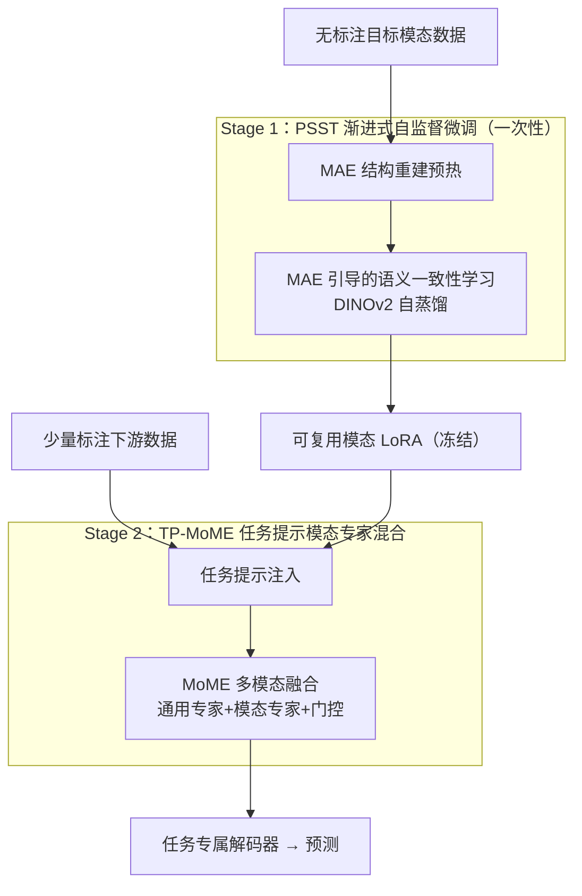

# Decoupled and Reusable Adaptation for Efficient Cross-Modal Transfer

**会议**: CVPR 2026  
**论文**: [CVF Open Access](https://openaccess.thecvf.com/content/CVPR2026/html/Liu_Decoupled_and_Reusable_Adaptation_for_Efficient_Cross-Modal_Transfer_CVPR_2026_paper.html)  
**代码**: 无  
**领域**: 多模态VLM  
**关键词**: 跨模态迁移, 参数高效迁移, LoRA, 自监督学习, 模态专家混合(MoE)  

## 一句话总结
把"将 RGB 基础模型迁移到红外/深度/事件等非 RGB 模态"的过程拆成"一次性学模态知识（自监督训出可复用的模态 LoRA）+ 轻量学任务知识（任务提示 + 模态专家混合）"两段，从而在换任务时不必从头重训，在 6 个跨模态场景上同时拿到数据、计算、存储三重效率优势。

## 研究背景与动机

**领域现状**：红外、深度、事件、LiDAR 等非 RGB 模态能提供 RGB 之外的互补信息，但这些模态标注稀缺、缺乏大规模基础模型。主流做法是借助 RGB 基础模型（SAM/SAM 2、DINOv2、CLIP）的视觉先验，用参数高效迁移（LoRA / adapter / prompt tuning）把它们适配到目标模态的具体任务上，例如 SHIFNet 把 SAM 2 适配到 RGB-T 分割、DSAM 把 SAM 适配到深度伪装目标检测。

**现有痛点**：这些方法都是**面向任务（task-oriented）**的——直接拿某个任务的标注数据做监督训练去同时跨越"模态鸿沟"和"任务鸿沟"。后果是：换一个下游任务就要重新收集标注、从头重训、再单独存一份模型，导致标注、计算、存储三方面的大量冗余；而且当某个任务标注样本很少时，光靠任务标注根本不足以同时填平这两个鸿沟。

**核心矛盾**：作者指出现有范式把"模态知识"和"任务知识"的学习**耦合**在了一次适配里，却忽略了一个关键事实——跨模态差异里占主导的是**模态鸿沟**，而模态鸿沟在不同任务间是**大体共享**的。同一目标模态、不同任务的数据虽然标注异构，但合在一起恰好刻画了该模态的内在分布。既然模态知识可复用，就没必要每换一个任务都重学一遍。

**本文目标**：实现高效跨模态迁移——把模态知识做成"一次性学、跨任务复用"，把任务知识做成"轻量、快速、可换"。这就拆成两个子问题：(1) 怎样**不依赖任务标签**学到通用模态知识？(2) 怎样在复用模态知识的基础上**用极小代价**注入任务知识并做好多模态融合？

**核心 idea**：**解耦**——把跨模态迁移拆成 Stage 1 的"一次性通用模态知识迁移"（自监督训练，产出可复用的模态 LoRA）和 Stage 2 的"灵活任务知识迁移"（任务提示 + 模态专家混合）。用海量易得的无标注模态数据去填模态鸿沟，用少量标注数据去填任务鸿沟。

## 方法详解

### 整体框架

输入是某个目标模态的一批**无标注**数据 $X=\{X_m\}$，骨干是从 SAM 2 初始化的 Hiera-B+/L 编码器（全程冻结，靠 LoRA 适配）。整条流水线分两阶段：

- **Stage 1（一次性、无监督）**：用 Progressive Self-Supervised Tuning（PSST）在无标注数据上训练注入编码器的 LoRA。先用 MAE 结构重建"预热"，再切到"MAE 引导的语义一致性学习"（DINOv2 风格自蒸馏）联合训练，让 LoRA 从低层纹理/结构逐步学到高层语义。训完得到一份**冻结、可跨任务复用**的模态 LoRA。
- **Stage 2（按任务、轻量）**：拿来对应模态的冻结 LoRA，给每个 Transformer block 插入可学习的任务提示来吸收任务知识；在指定层部署 TP-MoME（Task-Prompted Mixture-of-Modality Experts）做多模态融合；融合后的层级特征送进任务专属解码器出预测。换任务时只需重训这套很轻的提示 + MoME + 解码器。

> 上图自上而下对应下面三个关键设计：整张图的"两段式分隔"本身就是设计 1（解耦范式），S1 子图是设计 2（PSST），S2 子图是设计 3（TP-MoME）。

### 关键设计

**1. 解耦式两阶段迁移范式：把"共享的模态知识"和"易变的任务知识"分开学**

这是全文的总纲，针对的痛点是现有"面向任务"范式把模态鸿沟和任务鸿沟耦合在一次适配里、换任务必须从头重训重存。作者的观察是：模态鸿沟在不同任务间大体共享、且可由无标注数据刻画，而任务鸿沟才是真正易变的部分。于是把迁移过程一刀切成两段——Stage 1 用海量无标注模态数据做**一次性**模态知识迁移（每个模态只训一次，产出一份冻结的模态 LoRA），Stage 2 用少量标注数据做**可复用、可替换**的任务知识迁移。这样换任务时被复用的是 Stage 1 的模态 LoRA，只重训 Stage 2 那一小撮参数，把标注、计算、存储成本从"每任务一份完整模型"压到"每模态一份 1.3M 的 LoRA + 每任务一小撮提示/专家"。它和旧方法的根本区别就在这条"先模态、后任务"的分解线上。

**2. PSST 渐进式自监督微调：用无标注数据从结构到语义把模态知识灌进 LoRA**

针对 Stage 1 的核心难题——没有任务标签怎么学通用模态知识。作者先排除了一条看似自然的路：主流对比学习目标建立在 RGB 先验上（强制亮度/纹理不变），但对热成像、深度、事件这类模态，亮度或纹理的变化往往**就对应语义变化**，硬套会学坏。于是选用更契合非 RGB 模态的两类 SSL——MAE 单图重建（学结构）与 DINOv2 自蒸馏（学语义），并让它们**渐进、互相引导**。

具体分两步。**预热**：对无标注图 $x_m$ 用掩码生成器 $G(\cdot)$ 选出可见 patch，掩码输入 $\tilde{x}_m = x_m \odot G(x_m)$ 过冻结骨干 + LoRA 得 $z_m = E_{\theta_0+\Delta\theta}(\tilde{x}_m)$，MAE 头重建原图，目标为

$$L_{MAE} = \frac{1}{|G|}\sum_{i\in G}\bigl\|D_{MAE}(z_m)_i - x_{m,i}\bigr\|_1,$$

让 LoRA 先吃透模态的局部结构。**联合阶段**：从无标注数据里筛出"结构复杂/语义信息量高"（用 MAE 重建方差衡量）的子集 $D_{high,m}$，在其上把 MAE 分支和 DINOv2 分支一起训——两者共享同一冻结骨干和同一份可训 LoRA，DINOv2 的教师网络由学生权重的 EMA 更新。语义侧有两项：图像级一致性 $L_{i\text{-}con} = -\sum p_t \log p_s$（学生 class-token 的原型分布对齐教师，强制全局语义连贯）；以及**MAE 引导的 patch 级一致性**

$$L_{p\text{-}con} = -\sum_i w_i\, p_{t,i}\log p_{s,i},\qquad w_i = \frac{\exp(\alpha e_i)}{\sum_j \exp(\alpha e_j)},$$

其中 $e_i = \|D_{MAE}(z_m)_i - x_{m,i}\|_1$ 是该 patch 的 MAE 重建误差。这一项的巧思在于：**MAE 重建越吃力的 patch（结构越偏离 RGB 先验），在语义学习里给越大的权重**，从而把 DINOv2 的注意力主动引向"非 RGB 才有的模态特异线索"，而不是 RGB 上学过的通用纹理。DINOv2 分支总损失 $L_{DINO} = L_{i\text{-}con} + L_{p\text{-}con} + L_{koleo}$（$L_{koleo}$ 沿用 DINOv2 的特征均匀化正则），PSST 总损失 $L_{PSST} = \lambda L_{MAE} + L_{DINO}$。"先结构、后语义、且用结构误差反过来引导语义"正是"progressive + 互相引导"的来历。

**3. TP-MoME 任务提示的模态专家混合：用提示注入任务、用专家混合平衡三种知识**

针对 Stage 2 的痛点——既要复用冻结的模态 LoRA，又要用极小参数快速适配新任务，还要在多模态融合时同时照顾"任务特定、模态通用、模态特异"三种知识。作者拆成两部分。**任务提示**：给每个 block 插入可学习提示 $P_i^m$，与该 block 的 patch token 拼接成 $\tilde{R}^{(m,i)} = \mathrm{concat}(X_0, P_i^m, R^{(m,i)})$ 再过冻结 block，用极少参数把任务先验"提示"进来。**MoME 融合**：在指定融合层把各模态的提示后特征拼接、降维成 $\hat{R}^{(i)}_{cat}=\mathrm{Proj}(R^{(i)}_{cat})$，喂给一组专家——1 个通用专家 $E_0$（看完整输入）+ $N$ 个模态专家（每个看被 $\mathrm{Mask}_n(\cdot)$ 随机丢掉若干模态段的输入，逼它专注不同模态子集、学互补表示）。门控网络从池化后的拼接特征算混合权重 $\beta^{(i)} = \mathrm{softmax}(W_g(\mathrm{Pool}(R^{(i)}_{cat})) + b_g)$，最终融合特征为

$$R^{(i)}_{MoME} = \hat{R}^{(i)}_{cat} + \beta^{(i)}_0 E_0(\hat{R}^{(i)}_{cat}) + \sum_{n=1}^{N}\beta^{(i)}_n Z^{(i)}_n,$$

其中 $Z^{(i)}_n = E_n(\tilde{R}^{(i)}_{cat,n})$，且把基础投影特征 $\hat{R}^{(i)}_{cat}$ 的权重固定为 1 当作稳定锚点。和先前"把不同模态 LoRA 当专家做门控融合"（如 MLE-SAM，作者批评它本质等同非 MoE 融合）相比，TP-MoME 通过"通用专家 + 掩码诱导专精的模态专家 + 动态门控"显式地在融合中平衡了模态通用性与特异性，模态数越多优势越明显。各融合层的 $R^{(i)}_{MoME}$ 组成层级特征集喂进任务解码器 $\hat{Y}=D_{task}(R_{MoME})$，仅用任务损失 $L_{TP\text{-}MoME}=L_{task}(Y,\hat{Y})$ 训练。

### 损失函数 / 训练策略
- Stage 1：$L_{PSST} = \lambda L_{MAE} + L_{DINO}$，先 MAE 预热若干 epoch，再在筛选子集上 MAE+DINOv2 共享 LoRA 联合训练；教师走 EMA。
- Stage 2：只用下游任务损失 $L_{task}$ 训练提示、MoME、解码器；模态 LoRA 冻结。
- 实现：骨干 Hiera-B+/L（SAM 2 权重初始化），LoRA 注入每个自注意力层、rank=32；AdamW，lr 3e-4，weight decay 0.01，batch 12；MoME 插在 Hiera-B+ 的 [2,5,21,24]、Hiera-L 的 [2,8,44,48] 层。

## 实验关键数据

覆盖 6 类跨模态场景（RGB-T / RGB-D / RGB-Polarization / RGB-Event / RGB-D-E 等），对比对象包括全微调（FFT）方法与面向任务的参数高效（PEFT）方法。统一指标 mIoU(%)。

### 主实验

| 数据集 | 模态 | 本文(backbone) | 之前最佳 | 提升 |
|--------|------|----------------|----------|------|
| SUN-RGBD | RGB-D | 56.3 (Hiera-L) | GeminiFusion 54.6 (FFT) / SPEFT 55.0 (PEFT) | +1.7 / +1.3 |
| NYU Depth v2 | RGB-D | 61.4 (Hiera-L) | GeminiFusion 60.2 / SPEFT 59.9 | +1.2 / +1.5 |
| MFNet | RGB-T | 60.5 (Hiera-B+) | SPEFT 59.9 | +0.6 |
| PST900 | RGB-T | 88.7 (Hiera-B+) | SPEFT 87.6 / DPLNet 86.7 | +1.1 / +2.0 |
| MCubeS | RGB-A-D | 54.4 (Hiera-B+) | MemorySAM 52.9 | +1.5 |
| DELIVER | RGB-D-E | 65.1 (Hiera-B+) | MLE-SAM 62.7 / CMNeXt 64.4 | +2.4 / +0.7 |

即便只用更轻的 Hiera-B+，在多数任务上也已超过此前 SOTA 的 PEFT 与部分 FFT 方法；Hiera-L 进一步刷新最佳。

### 消融实验

在 MCubeS 与 DELIVER 上逐组件消融，Avg 为四列均值（mIoU%）：

| 配置 | R-A | R-A-D | R-D | R-D-E | Avg | 说明 |
|------|-----|-------|-----|-------|-----|------|
| 仅 Stage 2 (TP-MoME) | 49.6 | 50.1 | 60.3 | 59.6 | 54.9 | 去掉 PSST，模态鸿沟没填 |
| + MAE | 50.8 | 51.0 | 61.4 | 61.5 | 56.2 | 加结构重建 +1.3 |
| + DINO | 51.4 | 51.9 | 62.4 | 62.5 | 57.1 | 加语义自蒸馏 +2.2 |
| MAE+DINO 独立训 | 52.3 | 53.2 | 63.5 | 63.6 | 58.2 | 两步分开 +3.3 |
| 用门控求和替 MoME | 52.4 | 52.7 | 63.6 | 63.6 | 58.1 | 去 MoME 掉 1.2 |
| Full (W-G + MoME) | 52.8 | 54.4 | 64.9 | 65.1 | **59.3** | 完整模型 |

### 关键发现
- **PSST 是最大功臣**：去掉整个 Stage 1、只留 Stage 2，平均从 59.3 掉到 54.9（−4.4 mIoU），说明模态鸿沟必须靠无标注自监督先填好。
- **渐进 + 互相引导优于独立训**：MAE 与 DINOv2 独立串行已带来 +3.3，而改成"MAE 预热 + MAE 引导一致性学习"（W-G）再 +1.1，验证了用重建误差加权语义学习的互补价值。
- **MoME 在模态数多时增益更明显**：换成简单门控求和平均掉 1.2，但在三模态的 R-A-D、R-D-E 上分别掉 1.7、1.5，说明专家混合在"模态越多越难平衡"的场景越值钱。
- **三重效率**：仅 20% 标注就超过若干方法用 100% 标注的结果；MCubeS 上第 5 epoch 即超过 MemorySAM 第 12 epoch；5 个下游任务累计参数 121.4M（可训 40.6M），相比 MemorySAM 153.7M、CMNeXt 525.1M，可训参数效率 +44.3%，且每模态 LoRA 仅 1.3M。

## 亮点与洞察
- **"模态知识可复用"这一观察被产品化成可存储的 LoRA**：把"模态鸿沟跨任务共享"从一句洞察落到"一次性训、1.3M 一份、随取随用"的工程形态，是这篇最干净的贡献。
- **用 MAE 重建误差反向引导 DINOv2 的注意力**：$w_i \propto \exp(\alpha e_i)$ 让"模型最重建不出的 patch"获得最高语义监督权重，等于自动把学习焦点导向非 RGB 才有的模态特异线索——这个"用一个自监督任务的失败信号去指导另一个任务"的 trick 很可迁移。
- **拒绝 RGB 式对比学习**的判断有说服力：明确指出亮度/纹理不变性假设在非 RGB 模态上会把语义变化当噪声，从源头选对了 SSL 范式。
- **MoME 的掩码诱导专精**：靠随机丢模态段逼专家学互补表示，而不是靠额外标签或结构先验，是低成本制造专家多样性的实用做法。

## 局限与展望
- 主结果里 Hiera-L 才稳拿全场最佳，Hiera-B+ 在个别任务（如 MFNet vs FFT）只是"promising"，骨干规模对结果影响不小。
- Stage 1 依赖能收集到"足够大且多样"的无标注目标模态数据，论文把数据来源/规模放进了补充材料；对真正小众、连无标注数据都稀缺的模态，复用红利可能打折（⚠️ 正文未给该情形下的量化结果）。
- 评测集中在分割类密集预测任务，跨到检测/分类等差异更大的任务族时，模态 LoRA 的"任务无关性"能保持多少未充分验证。
- $\lambda$、$\alpha$、筛选子集 $D_{high,m}$ 的阈值等超参对 PSST 的影响正文未展开消融，复现时可能需要调。

## 相关工作与启发
- **vs 面向任务的 PEFT（SPEFT / DPLNet / MemorySAM）**：它们把模态与任务知识在一次适配里一起学、每任务存一份；本文把模态知识抽出来做成一次性可复用 LoRA，换任务只动 Stage 2，存储与可训参数大幅下降，且 SPEFT 局限于 RGB+X 双模态，本文天然支持三模态融合。
- **vs MLE-SAM（把不同模态 LoRA 当专家做门控）**：作者指出其本质等同非 MoE 多模态融合；TP-MoME 引入"通用专家 + 掩码诱导专精的模态专家 + 动态门控"，显式平衡模态通用/特异知识，模态越多差距越大。
- **vs MAE / DINOv2 原版自监督**：本文不是单用某一种 SSL，而是论证了非 RGB 模态该用"结构重建 + 语义自蒸馏"的组合，并用重建误差把两者耦合成渐进式课程，针对性强于直接照搬 RGB 上的 SSL 配方。

## 评分
- 新颖性: ⭐⭐⭐⭐ "解耦成可复用模态 LoRA + 任务侧 MoME"的范式切分清晰，MAE 误差引导语义学习的耦合有巧思。
- 实验充分度: ⭐⭐⭐⭐ 6 类跨模态场景 + 数据/计算/存储三重效率分析，消融逐组件到位；超参敏感性略缺。
- 写作质量: ⭐⭐⭐⭐ 动机—观察—方法的逻辑链顺，公式与符号清楚。
- 价值: ⭐⭐⭐⭐ 给"非 RGB 模态缺基础模型"提供了一条省标注省算力省存储的实用迁移路线。

<!-- RELATED:START -->

## 相关论文

- [\[CVPR 2026\] Parameter-Efficient Adaptation for MLLMs via Implicit Modality Decomposition](parameter-efficient_adaptation_for_mllms_via_implicit_modality_decomposition.md)
- [\[CVPR 2026\] Wan-Weaver: Interleaved Multi-modal Generation via Decoupled Training](wan-weaver_interleaved_multi-modal_generation_via_decoupled_training.md)
- [\[CVPR 2026\] CoV-Align: Efficient Fine-grained Cross-Modal Alignment with Cohesive Visual Semantics Priority](cov-align_efficient_fine-grained_cross-modal_alignment_with_cohesive_visual_sema.md)
- [\[CVPR 2026\] Decoupling Stability and Plasticity for Multi-Modal Test-Time Adaptation](decoupling_stability_and_plasticity_for_multi-modal_test-time_adaptation.md)
- [\[CVPR 2026\] Rethinking Cross-Modal Anchor Alignment for Mitigating Error Accumulation](rethinking_cross-modal_anchor_alignment_for_mitigating_error_accumulation.md)

<!-- RELATED:END -->
